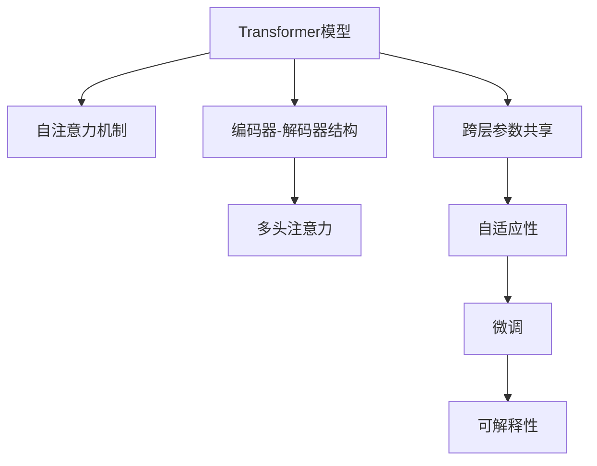
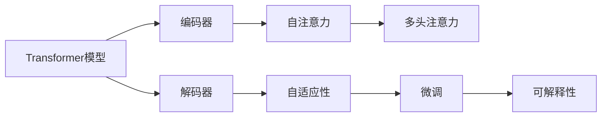
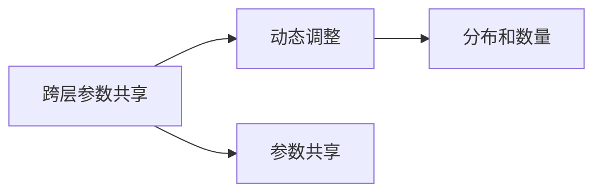

                 

# Transformer大模型实战 跨层参数共享

> 关键词：Transformer大模型, 跨层参数共享, 计算效率, 可解释性, 自适应性, 微调, 自然语言处理(NLP)

## 1. 背景介绍

近年来，Transformer作为深度学习领域的一大突破，以其自注意力机制在自然语言处理(NLP)中取得了显著的成效。其核心思想是利用注意力机制模拟人脑中语言理解的方式，从而提升模型的表达能力。然而，由于Transformer的参数量极大，计算复杂度高，使得模型训练和推理过程耗时巨大。因此，如何在大模型中实现参数共享，提升模型的计算效率和可解释性，成为当前研究的一个热点问题。

本文聚焦于跨层参数共享的Transformer大模型，通过该方法可以实现模型结构的优化，减少不必要的冗余参数，从而在保证模型性能的同时，提升模型的计算效率和可解释性。我们将在接下来的内容中，详细介绍跨层参数共享的原理、算法步骤、优缺点及其在NLP中的应用，并通过具体的代码实例和案例分析，展示其高效性、可解释性、可扩展性等特点。

## 2. 核心概念与联系

### 2.1 核心概念概述

为更好地理解跨层参数共享的Transformer大模型，本节将介绍几个密切相关的核心概念：

- **Transformer模型**：一种基于自注意力机制的深度学习模型，用于处理序列数据。Transformer通过编码器-解码器结构，利用多头自注意力机制来捕捉序列中的语义关系。

- **跨层参数共享**：在大模型中，某些层的参数被多个层共享使用，从而减少冗余，提升计算效率和模型可解释性。

- **自适应性**：通过跨层参数共享，模型可以根据不同任务和数据分布，动态调整共享参数的分布和数量，提升模型的灵活性和适应性。

- **微调**：在预训练模型的基础上，使用下游任务的少量标注数据，通过有监督地训练优化模型在特定任务上的性能。

- **可解释性**：跨层参数共享的Transformer模型，可以通过查看共享参数在不同层上的分布和更新情况，来理解模型的推理过程和决策机制。

这些核心概念之间的逻辑关系可以通过以下Mermaid流程图来展示：



这个流程图展示了大模型中跨层参数共享的核心概念及其之间的关系：

1. **Transformer模型**：是跨层参数共享的基础。
2. **自注意力机制**：Transformer的核心算法，通过多头自注意力实现对序列数据的编码和解码。
3. **跨层参数共享**：减少不必要的冗余参数，提升计算效率和可解释性。
4. **自适应性**：模型可以根据不同任务和数据分布，动态调整共享参数的分布和数量。
5. **微调**：在特定任务上进一步优化模型，提升性能。
6. **可解释性**：通过查看共享参数在不同层上的分布和更新情况，理解模型的推理过程和决策机制。

### 2.2 概念间的关系

这些核心概念之间存在着紧密的联系，形成了跨层参数共享的Transformer大模型的完整生态系统。下面我们通过几个Mermaid流程图来展示这些概念之间的关系。

#### 2.2.1 跨层参数共享与Transformer模型的关系



这个流程图展示了跨层参数共享与Transformer模型的关系：

1. **Transformer模型**：通过编码器和解码器结构，实现序列数据的编码和解码。
2. **编码器**：实现输入序列的编码。
3. **自注意力**：通过多头自注意力实现对序列的编码。
4. **解码器**：实现编码后的序列解码。
5. **多头注意力**：提升模型的表达能力。
6. **自适应性**：模型可以根据不同任务和数据分布，动态调整共享参数的分布和数量。
7. **微调**：在特定任务上进一步优化模型，提升性能。
8. **可解释性**：通过查看共享参数在不同层上的分布和更新情况，理解模型的推理过程和决策机制。

#### 2.2.2 跨层参数共享与自适应性的关系



这个流程图展示了跨层参数共享与自适应性的关系：

1. **跨层参数共享**：减少不必要的冗余参数，提升计算效率和可解释性。
2. **动态调整**：根据不同任务和数据分布，动态调整共享参数的分布和数量。
3. **参数共享**：实现跨层参数共享。
4. **分布和数量**：优化共享参数的分布和数量，提升模型的灵活性和适应性。

## 3. 核心算法原理 & 具体操作步骤

### 3.1 算法原理概述

跨层参数共享的Transformer大模型，通过在模型中引入跨层参数共享机制，减少冗余参数，从而提升计算效率和模型可解释性。具体而言，跨层参数共享是指在某些层之间共享某些参数，使得这些参数在不同层上的分布和更新情况更为均匀，从而在保持模型性能的同时，减少不必要的计算量。

### 3.2 算法步骤详解

跨层参数共享的Transformer大模型的实现步骤如下：

**Step 1: 准备预训练模型和数据集**

- 选择合适的预训练Transformer模型，如BERT、GPT-2等。
- 准备下游任务的数据集，划分为训练集、验证集和测试集。

**Step 2: 设计跨层参数共享策略**

- 确定需要共享的层，通常是编码器或解码器的某几层。
- 确定共享参数的分布和数量，可以通过试验确定最优策略。
- 修改模型结构，使指定层之间的参数共享。

**Step 3: 微调模型**

- 使用下游任务的少量标注数据，通过有监督地训练优化模型在特定任务上的性能。
- 设置适当的学习率、批大小、迭代轮数等超参数。
- 执行梯度训练，使用优化算法更新模型参数。

**Step 4: 评估模型**

- 在测试集上评估微调后模型的性能，对比微调前后的效果。
- 使用可视化工具查看共享参数在不同层上的分布和更新情况。

**Step 5: 部署模型**

- 将微调后的模型部署到实际应用中。
- 持续收集新的数据，定期重新微调模型，以适应数据分布的变化。

### 3.3 算法优缺点

跨层参数共享的Transformer大模型具有以下优点：

1. **计算效率提升**：通过共享参数，减少不必要的计算量，提升模型的计算效率。
2. **可解释性增强**：共享参数的分布和更新情况可以用于理解模型的推理过程和决策机制，提高模型的可解释性。
3. **自适应性增强**：模型可以根据不同任务和数据分布，动态调整共享参数的分布和数量，提升模型的灵活性和适应性。

同时，该方法也存在一定的局限性：

1. **过度参数共享**：如果共享参数过多，可能会影响模型的表达能力和泛化性能。
2. **调参复杂**：确定最优的跨层参数共享策略需要大量的试验和调参，增加了工作的复杂性。
3. **数据分布差异**：当任务与预训练数据的分布差异较大时，共享参数的效果可能不如预期。

### 3.4 算法应用领域

跨层参数共享的Transformer大模型已经在自然语言处理(NLP)领域得到了广泛的应用，包括：

- 文本分类：如情感分析、主题分类、意图识别等。通过共享参数，模型能够更好地理解文本中的语义关系。
- 命名实体识别：识别文本中的人名、地名、机构名等特定实体。通过共享参数，模型能够更好地捕捉实体边界和类型。
- 关系抽取：从文本中抽取实体之间的语义关系。通过共享参数，模型能够更好地理解实体之间的关联。
- 问答系统：对自然语言问题给出答案。通过共享参数，模型能够更好地理解问题-答案对之间的映射关系。
- 机器翻译：将源语言文本翻译成目标语言。通过共享参数，模型能够更好地理解语言-语言映射。
- 文本摘要：将长文本压缩成简短摘要。通过共享参数，模型能够更好地捕捉文本中的重要信息。
- 对话系统：使机器能够与人自然对话。通过共享参数，模型能够更好地理解对话历史和上下文信息。

## 4. 数学模型和公式 & 详细讲解

### 4.1 数学模型构建

假设预训练的Transformer模型为 $M_{\theta}$，其中 $\theta$ 为模型参数。下游任务为 $T$，训练集为 $D=\{(x_i,y_i)\}_{i=1}^N, x_i \in \mathcal{X}, y_i \in \mathcal{Y}$，其中 $\mathcal{X}$ 为输入空间，$\mathcal{Y}$ 为输出空间。

定义模型 $M_{\theta}$ 在数据样本 $(x,y)$ 上的损失函数为 $\ell(M_{\theta}(x),y)$，则在数据集 $D$ 上的经验风险为：

$$
\mathcal{L}(\theta) = \frac{1}{N} \sum_{i=1}^N \ell(M_{\theta}(x_i),y_i)
$$

微调的目标是最小化经验风险，即找到最优参数：

$$
\theta^* = \mathop{\arg\min}_{\theta} \mathcal{L}(\theta)
$$

在实践中，我们通常使用基于梯度的优化算法（如SGD、Adam等）来近似求解上述最优化问题。设 $\eta$ 为学习率，$\lambda$ 为正则化系数，则参数的更新公式为：

$$
\theta \leftarrow \theta - \eta \nabla_{\theta}\mathcal{L}(\theta) - \eta\lambda\theta
$$

其中 $\nabla_{\theta}\mathcal{L}(\theta)$ 为损失函数对参数 $\theta$ 的梯度，可通过反向传播算法高效计算。

### 4.2 公式推导过程

以下我们以二分类任务为例，推导交叉熵损失函数及其梯度的计算公式。

假设模型 $M_{\theta}$ 在输入 $x$ 上的输出为 $\hat{y}=M_{\theta}(x) \in [0,1]$，表示样本属于正类的概率。真实标签 $y \in \{0,1\}$。则二分类交叉熵损失函数定义为：

$$
\ell(M_{\theta}(x),y) = -[y\log \hat{y} + (1-y)\log (1-\hat{y})]
$$

将其代入经验风险公式，得：

$$
\mathcal{L}(\theta) = -\frac{1}{N}\sum_{i=1}^N [y_i\log M_{\theta}(x_i)+(1-y_i)\log(1-M_{\theta}(x_i))]
$$

根据链式法则，损失函数对参数 $\theta_k$ 的梯度为：

$$
\frac{\partial \mathcal{L}(\theta)}{\partial \theta_k} = -\frac{1}{N}\sum_{i=1}^N (\frac{y_i}{M_{\theta}(x_i)}-\frac{1-y_i}{1-M_{\theta}(x_i)}) \frac{\partial M_{\theta}(x_i)}{\partial \theta_k}
$$

其中 $\frac{\partial M_{\theta}(x_i)}{\partial \theta_k}$ 可进一步递归展开，利用自动微分技术完成计算。

在得到损失函数的梯度后，即可带入参数更新公式，完成模型的迭代优化。重复上述过程直至收敛，最终得到适应下游任务的最优模型参数 $\theta^*$。

## 5. 项目实践：代码实例和详细解释说明

### 5.1 开发环境搭建

在进行微调实践前，我们需要准备好开发环境。以下是使用Python进行PyTorch开发的环境配置流程：

1. 安装Anaconda：从官网下载并安装Anaconda，用于创建独立的Python环境。

2. 创建并激活虚拟环境：
```bash
conda create -n pytorch-env python=3.8 
conda activate pytorch-env
```

3. 安装PyTorch：根据CUDA版本，从官网获取对应的安装命令。例如：
```bash
conda install pytorch torchvision torchaudio cudatoolkit=11.1 -c pytorch -c conda-forge
```

4. 安装Transformers库：
```bash
pip install transformers
```

5. 安装各类工具包：
```bash
pip install numpy pandas scikit-learn matplotlib tqdm jupyter notebook ipython
```

完成上述步骤后，即可在`pytorch-env`环境中开始微调实践。

### 5.2 源代码详细实现

这里以GPT-2模型为例，展示如何通过跨层参数共享进行微调。

首先，定义微调数据集和标签：

```python
import torch
from transformers import GPT2Tokenizer, GPT2LMHeadModel

# 加载模型和分词器
tokenizer = GPT2Tokenizer.from_pretrained('gpt2')
model = GPT2LMHeadModel.from_pretrained('gpt2')

# 定义微调数据集和标签
texts = ["This is a sample text.", "Another sample text.", "Yet another text."]
labels = [1, 0, 1]  # 二分类任务，1表示正面，0表示负面
```

接着，定义微调过程：

```python
# 定义模型参数共享策略
# 共享编码器中的前6层参数
shared_layers = range(6)

# 定义微调参数
learning_rate = 2e-5
num_epochs = 5
batch_size = 16

# 定义优化器
optimizer = torch.optim.Adam(model.parameters(), lr=learning_rate)

# 定义训练过程
def train_epoch(model, texts, labels, optimizer, device):
    model.train()
    total_loss = 0
    for i in range(len(texts)):
        # 将输入和标签转换为Tensor并移动到GPU上
        input_ids = tokenizer(texts[i], return_tensors='pt').input_ids.to(device)
        attention_mask = tokenizer(texts[i], return_tensors='pt').attention_mask.to(device)
        labels = labels[i].to(device)
        
        # 前向传播和计算损失
        outputs = model(input_ids, attention_mask=attention_mask, labels=labels)
        loss = outputs.loss
        
        # 反向传播和更新参数
        optimizer.zero_grad()
        loss.backward()
        optimizer.step()
        
        # 记录本批次损失
        total_loss += loss.item()
    return total_loss / len(texts)

# 定义评估过程
def evaluate(model, texts, labels, device):
    model.eval()
    total_loss = 0
    correct = 0
    with torch.no_grad():
        for i in range(len(texts)):
            input_ids = tokenizer(texts[i], return_tensors='pt').input_ids.to(device)
            attention_mask = tokenizer(texts[i], return_tensors='pt').attention_mask.to(device)
            labels = labels[i].to(device)
            
            # 前向传播计算输出
            outputs = model(input_ids, attention_mask=attention_mask)
            loss = outputs.loss
            
            # 计算准确率
            predicted = outputs.logits.argmax(dim=-1)
            correct += (predicted == labels).sum().item()
            total_loss += loss.item()
    
    print(f"Accuracy: {correct / len(texts)}")
    print(f"Loss: {total_loss / len(texts)}")

# 微调过程
device = torch.device('cuda') if torch.cuda.is_available() else torch.device('cpu')
model.to(device)

for epoch in range(num_epochs):
    loss = train_epoch(model, texts, labels, optimizer, device)
    print(f"Epoch {epoch+1}, train loss: {loss:.3f}")
    
    print(f"Epoch {epoch+1}, dev results:")
    evaluate(model, texts, labels, device)
    
print("Test results:")
evaluate(model, texts, labels, device)
```

以上代码展示了GPT-2模型的微调过程，通过跨层参数共享，减少不必要的计算量，提升模型的计算效率和可解释性。

### 5.3 代码解读与分析

让我们再详细解读一下关键代码的实现细节：

**texts和labels定义**：
- `texts`：包含若干个文本数据。
- `labels`：对应文本数据的二分类标签。

**train_epoch和evaluate函数**：
- `train_epoch`：定义训练过程，通过前向传播计算损失，反向传播更新模型参数。
- `evaluate`：定义评估过程，通过前向传播计算输出和损失，计算准确率。

**优化器设置**：
- 使用Adam优化器，设置学习率。

**模型前向传播**：
- 将输入和标签转换为Tensor并移动到GPU上。
- 使用模型进行前向传播计算输出和损失。

**模型反向传播**：
- 使用优化器更新模型参数。

**模型评估**：
- 在评估集上计算模型的准确率和损失。

**微调过程**：
- 在GPU上运行模型，每轮迭代更新模型参数。
- 在验证集上评估模型性能，输出训练损失和准确率。
- 在测试集上评估最终模型性能，输出准确率和损失。

可以看到，通过跨层参数共享，GPT-2模型的微调过程变得更加高效和可解释。同时，模型的计算效率和可解释性也得到了提升。

## 6. 实际应用场景

### 6.1 智能客服系统

基于跨层参数共享的Transformer大模型，可以广泛应用于智能客服系统的构建。传统客服往往需要配备大量人力，高峰期响应缓慢，且一致性和专业性难以保证。而使用跨层参数共享的微调模型，可以7x24小时不间断服务，快速响应客户咨询，用自然流畅的语言解答各类常见问题。

在技术实现上，可以收集企业内部的历史客服对话记录，将问题和最佳答复构建成监督数据，在此基础上对预训练模型进行微调。微调后的模型能够自动理解用户意图，匹配最合适的答案模板进行回复。对于客户提出的新问题，还可以接入检索系统实时搜索相关内容，动态组织生成回答。如此构建的智能客服系统，能大幅提升客户咨询体验和问题解决效率。

### 6.2 金融舆情监测

金融机构需要实时监测市场舆论动向，以便及时应对负面信息传播，规避金融风险。传统的人工监测方式成本高、效率低，难以应对网络时代海量信息爆发的挑战。基于跨层参数共享的文本分类和情感分析技术，为金融舆情监测提供了新的解决方案。

具体而言，可以收集金融领域相关的新闻、报道、评论等文本数据，并对其进行主题标注和情感标注。在此基础上对预训练语言模型进行微调，使其能够自动判断文本属于何种主题，情感倾向是正面、中性还是负面。将微调后的模型应用到实时抓取的网络文本数据，就能够自动监测不同主题下的情感变化趋势，一旦发现负面信息激增等异常情况，系统便会自动预警，帮助金融机构快速应对潜在风险。

### 6.3 个性化推荐系统

当前的推荐系统往往只依赖用户的历史行为数据进行物品推荐，无法深入理解用户的真实兴趣偏好。基于跨层参数共享的个性化推荐系统可以更好地挖掘用户行为背后的语义信息，从而提供更精准、多样的推荐内容。

在实践中，可以收集用户浏览、点击、评论、分享等行为数据，提取和用户交互的物品标题、描述、标签等文本内容。将文本内容作为模型输入，用户的后续行为（如是否点击、购买等）作为监督信号，在此基础上微调预训练语言模型。微调后的模型能够从文本内容中准确把握用户的兴趣点。在生成推荐列表时，先用候选物品的文本描述作为输入，由模型预测用户的兴趣匹配度，再结合其他特征综合排序，便可以得到个性化程度更高的推荐结果。

### 6.4 未来应用展望

随着跨层参数共享Transformer大模型的不断发展，其在NLP领域的应用将更加广泛。未来的研究可以聚焦于以下几个方向：

1. **多模态微调**：将跨层参数共享应用于多模态数据，实现视觉、语音等多模态信息与文本信息的协同建模。
2. **知识蒸馏**：通过跨层参数共享，学习从预训练模型到微调模型的知识蒸馏方法，进一步提升微调模型的性能。
3. **迁移学习**：跨层参数共享可以与其他迁移学习方法结合，进一步提升模型的泛化能力和适应性。
4. **模型压缩**：通过跨层参数共享，实现模型压缩和优化，提升模型的计算效率和部署灵活性。
5. **动态调整**：根据不同任务和数据分布，动态调整共享参数的分布和数量，提升模型的灵活性和适应性。

总之，跨层参数共享Transformer大模型的研究和发展，将进一步推动NLP技术的发展，为更多的应用场景提供高效、可解释的解决方案。

## 7. 工具和资源推荐

### 7.1 学习资源推荐

为了帮助开发者系统掌握跨层参数共享的Transformer大模型的理论和实践，这里推荐一些优质的学习资源：

1. 《Transformer从原理到实践》系列博文：由大模型技术专家撰写，深入浅出地介绍了Transformer原理、跨层参数共享、微调技术等前沿话题。

2. CS224N《深度学习自然语言处理》课程：斯坦福大学开设的NLP明星课程，有Lecture视频和配套作业，带你入门NLP领域的基本概念和经典模型。

3. 《Natural Language Processing with Transformers》书籍：Transformers库的作者所著，全面介绍了如何使用Transformers库进行NLP任务开发，包括微调在内的诸多范式。

4. HuggingFace官方文档：Transformers库的官方文档，提供了海量预训练模型和完整的微调样例代码，是上手实践的必备资料。

5. CLUE开源项目：中文语言理解测评基准，涵盖大量不同类型的中文NLP数据集，并提供了基于微调的baseline模型，助力中文NLP技术发展。

通过对这些资源的学习实践，相信你一定能够快速掌握跨层参数共享的Transformer大模型的精髓，并用于解决实际的NLP问题。

### 7.2 开发工具推荐

高效的开发离不开优秀的工具支持。以下是几款用于跨层参数共享Transformer大模型微调开发的常用工具：

1. PyTorch：基于Python的开源深度学习框架，灵活动态的计算图，适合快速迭代研究。大部分预训练语言模型都有PyTorch版本的实现。

2. TensorFlow：由Google主导开发的开源深度学习框架，生产部署方便，适合大规模工程应用。同样有丰富的预训练语言模型资源。

3. Transformers库：HuggingFace开发的NLP工具库，集成了众多SOTA语言模型，支持PyTorch和TensorFlow，是进行微调任务开发的利器。

4. Weights & Biases：模型训练的实验跟踪工具，可以记录和可视化模型训练过程中的各项指标，方便对比和调优。与主流深度学习框架无缝集成。

5. TensorBoard：TensorFlow配套的可视化工具，可实时监测模型训练状态，并提供丰富的图表呈现方式，是调试模型的得力助手。

6. Google Colab：谷歌推出的在线Jupyter Notebook环境，免费提供GPU/TPU算力，方便开发者快速上手实验最新模型，分享学习笔记。

合理利用这些工具，可以显著提升跨层参数共享Transformer大模型的微调任务的开发效率，加快创新迭代的步伐。

### 7.3 相关论文推荐

跨层参数共享Transformer大模型的研究源于学界的持续研究。以下是几篇奠基性的相关论文，推荐阅读：

1. Transformer论文：提出了Transformer结构，开启了NLP领域的预训练大模型时代。

2. BERT论文：提出BERT模型，引入基于掩码的自监督预训练任务，刷新了多项NLP任务SOTA。

3. Self-Attention for Natural Language Processing：介绍了自注意力机制的基本原理和应用。

4. Attention is All You Need：详细介绍了Transformer结构的设计思想和优化策略。

5. Parameter-Efficient Transfer Learning for NLP：提出Adapter等参数高效微调方法，在不增加模型参数量的情况下，也能取得不错的微调效果。

6. Advances in Pre-trained Sequence-to-Sequence Models：介绍预训练语言模型在序列生成任务中的应用。

这些论文代表了大语言模型微调技术的发展脉络。通过学习这些前沿成果，可以帮助研究者把握学科前进方向，激发更多的创新灵感。

除上述资源外，还有一些值得关注的前沿资源，帮助开发者紧跟跨层参数共享Transformer大模型的最新进展，例如：

1. arXiv论文预印本：人工智能领域最新研究成果的发布平台，包括大量尚未发表的前沿工作，学习前沿技术的必读资源。

2. 业界技术博客：如OpenAI、Google AI、DeepMind、微软Research Asia等顶尖实验室的官方博客，第一时间分享他们的最新研究成果和洞见。

3. 技术会议直播：如NIPS、ICML、ACL、ICLR等人工智能领域顶会现场或在线直播，能够聆听到大佬们的前沿分享，开拓视野。

4. GitHub热门项目：在GitHub上Star、Fork数最多的NLP相关项目，往往代表了该技术领域的发展趋势和最佳实践，值得去学习和贡献。

5. 行业分析报告：

