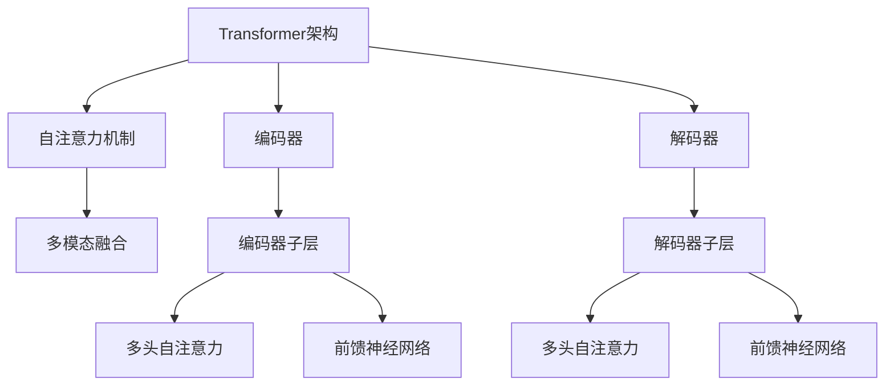

                 

# Transformer的适应性:8年主导地位的秘密

> 关键词：Transformer, 自适应, 自监督, 多模态, 深度学习, 神经网络, 语言模型, 计算效率

## 1. 背景介绍

### 1.1 问题由来
自2017年谷歌研究人员提出Transformer以来，Transformer架构迅速在自然语言处理（NLP）和计算机视觉等众多领域占据主导地位。它不仅在学术界引领了新的研究方向，也在工业界得到广泛应用，影响了机器学习领域的许多重要模型和应用，成为深度学习发展史上的里程碑。

Transformer的出现，彻底颠覆了传统的循环神经网络（RNN）和卷积神经网络（CNN）架构，成为机器学习领域的新范式。它通过自注意力机制，使得模型能够并行处理输入序列，极大提升了计算效率。然而，随着Transformer架构的广泛应用，人们逐渐发现，其高效性虽然带来了巨大的便利，但在某些特定场景下，却也存在着一些局限。如何充分发挥Transformer架构的潜力，同时克服其固有缺陷，成为了一个值得深入探讨的问题。

### 1.2 问题核心关键点
本文将重点探讨Transformer架构在多种实际应用中的表现和优化策略。Transformer的核心优势在于其自适应性，即通过自注意力机制，使得模型能够灵活地处理不同规模和复杂度的输入序列。然而，这种优势并不是无限制的，在某些特定场景下，如跨模态数据处理、大规模文本数据处理等，Transformer仍然面临着挑战。如何通过自监督学习、多模态融合等方法，进一步提升Transformer的适应性和应用范围，是本文讨论的核心问题。

### 1.3 问题研究意义
深入研究Transformer架构的适应性，对于推动深度学习技术在更多领域的应用具有重要意义：

1. **提升计算效率**：Transformer架构通过并行计算，极大提升了计算效率，但其高效性在某些特定场景下可能受到限制。通过优化策略，可以进一步提升计算效率，满足更复杂应用的需求。
2. **拓展应用范围**：Transformer架构在NLP领域表现优异，但在计算机视觉、音频等领域，其应用仍不广泛。通过多模态融合等方法，可以拓展其应用范围，推动跨领域研究的发展。
3. **增强模型鲁棒性**：Transformer架构在某些特定场景下可能表现出鲁棒性不足的问题。通过引入对抗训练、正则化等方法，可以增强其鲁棒性，提升模型在实际应用中的稳定性。
4. **优化资源利用**：Transformer架构在计算资源方面的需求较大，如何优化资源利用，提升模型性能与计算效率的平衡，是一个值得关注的问题。

## 2. 核心概念与联系

### 2.1 核心概念概述

Transformer架构是一种基于自注意力机制的神经网络模型。它通过并行计算，极大提升了计算效率，适用于处理长序列数据。Transformer主要由编码器和解码器组成，其中编码器和解码器都可以进一步分解为多个堆叠的子层，每个子层包含多头自注意力层、前馈神经网络层等组件。

Transformer架构的核心优势在于其自适应性，即通过自注意力机制，模型能够灵活地处理不同规模和复杂度的输入序列。然而，这种优势并不是无限制的，在某些特定场景下，如跨模态数据处理、大规模文本数据处理等，Transformer仍然面临着挑战。

### 2.2 核心概念间的关系

Transformer架构的核心概念包括自适应、自监督学习、多模态融合等。这些概念之间存在着紧密的联系，形成了Transformer架构的整体应用框架。

通过以下Mermaid流程图，我们可以更清晰地理解这些概念之间的关系：



这个流程图展示了大语言模型Transformer架构的组成和核心组件。编码器和解码器通过自注意力机制，实现并行计算和灵活处理输入序列的功能。编码器子层和解码器子层包含多头自注意力层和前馈神经网络层，分别用于特征提取和序列建模。多模态融合则通过引入其他模态的数据，进一步提升模型的泛化能力和适应性。

## 3. 核心算法原理 & 具体操作步骤
### 3.1 算法原理概述

Transformer架构的核心在于其自注意力机制。自注意力机制通过计算输入序列中每个位置与所有其他位置的相关性，实现对输入序列中不同位置信息的并行处理。这种并行处理机制，使得Transformer能够在处理长序列数据时，显著提升计算效率。

Transformer架构的计算过程可以简单概括为以下几个步骤：

1. **编码器计算**：输入序列经过编码器的多个子层，包括多头自注意力层和前馈神经网络层，得到编码器的输出。
2. **解码器计算**：解码器的输入是编码器的输出，经过解码器的多个子层，包括多头自注意力层和前馈神经网络层，得到解码器的输出。
3. **跨模态融合**：将编码器和解码器的输出与其他模态的数据进行融合，得到最终的输出结果。

### 3.2 算法步骤详解

以下是Transformer架构的具体计算步骤，以NLP任务为例：

1. **输入编码**：将输入序列（如文本）转换为模型所需的格式，包括分词、词嵌入等预处理步骤。
2. **多头自注意力计算**：通过多头自注意力层，计算输入序列中每个位置与其他位置的相关性，得到各位置的相关性矩阵。
3. **前馈神经网络计算**：将相关性矩阵输入前馈神经网络层，得到编码器子层的输出。
4. **堆叠层计算**：对编码器的多个子层进行堆叠，得到编码器的最终输出。
5. **解码器计算**：将编码器的输出作为解码器的输入，进行解码器的计算，得到解码器的输出。
6. **跨模态融合**：将编码器和解码器的输出与其他模态的数据进行融合，得到最终的输出结果。

### 3.3 算法优缺点

Transformer架构的优点包括：

1. **计算效率高**：通过并行计算，极大提升了计算效率，适用于处理长序列数据。
2. **适应性强**：通过自注意力机制，能够灵活处理不同规模和复杂度的输入序列。
3. **表示能力强**：通过多头自注意力和前馈神经网络层，可以学习到丰富的特征表示，适用于多种NLP任务。

Transformer架构的缺点包括：

1. **参数量较大**：由于采用了多头自注意力层，模型参数量较大，计算资源需求较高。
2. **鲁棒性不足**：在某些特定场景下，如对抗样本、噪声干扰等，Transformer可能表现出鲁棒性不足的问题。
3. **难以解释**：Transformer的决策过程复杂，难以解释其内部工作机制和决策逻辑，缺乏可解释性。

### 3.4 算法应用领域

Transformer架构在NLP领域得到了广泛应用，涵盖了文本分类、机器翻译、问答系统、文本生成等多个任务。此外，Transformer架构还被应用于计算机视觉、音频处理等跨模态数据处理任务，展示了其在多模态融合方面的潜力。

## 4. 数学模型和公式 & 详细讲解  
### 4.1 数学模型构建

Transformer架构的计算过程可以通过数学公式进行详细描述。以NLP任务为例，假设输入序列为 $x=\{x_1,x_2,\dots,x_T\}$，其中 $T$ 为序列长度。输入序列首先经过嵌入层，得到词向量 $x_e$。然后，通过多头自注意力层和前馈神经网络层，得到编码器子层的输出 $x_h$。解码器计算类似，最终得到解码器的输出 $x_o$。跨模态融合则通过将编码器和解码器的输出与其他模态的数据进行融合，得到最终的输出结果。

### 4.2 公式推导过程

以下是Transformer架构的主要计算公式：

1. **词嵌入层**：将输入序列转换为词向量表示，公式如下：

$$
x_e = \text{Embedding}(x)
$$

2. **多头自注意力计算**：计算输入序列中每个位置与其他位置的相关性，公式如下：

$$
Q = x_eW_Q
$$
$$
K = x_eW_K
$$
$$
V = x_eW_V
$$
$$
A = \frac{QK^T}{\sqrt{d_k}} + M
$$

其中，$Q$、$K$、$V$ 分别为查询、键、值矩阵，$d_k$ 为键向量维度，$M$ 为位置编码矩阵。$A$ 表示自注意力矩阵，用于计算各位置的相关性。

3. **多头自注意力层**：将自注意力矩阵 $A$ 进行线性变换，得到多头自注意力层的输出，公式如下：

$$
H = \text{Softmax}(A)V
$$

4. **前馈神经网络计算**：将多头自注意力层的输出输入前馈神经网络层，得到编码器子层的输出，公式如下：

$$
H = \text{FFN}(H)
$$

5. **堆叠层计算**：对编码器的多个子层进行堆叠，得到编码器的最终输出，公式如下：

$$
x_h = x_e + \text{Residual}(H)
$$

6. **解码器计算**：将编码器的输出作为解码器的输入，进行解码器的计算，得到解码器的输出，公式如下：

$$
x_o = \text{Softmax}(A)V
$$

7. **跨模态融合**：将编码器和解码器的输出与其他模态的数据进行融合，得到最终的输出结果，公式如下：

$$
x_f = x_h + \text{Residual}(x_o)
$$

### 4.3 案例分析与讲解

以机器翻译任务为例，假设输入序列为英文句子，解码器需要将其翻译成目标语言（如法语）。通过Transformer架构的计算过程，输入序列经过词嵌入层、多头自注意力层、前馈神经网络层等子层的堆叠计算，得到编码器的输出。解码器则以编码器的输出作为输入，进行解码器的计算，得到解码器的输出。最终，通过跨模态融合，将编码器和解码器的输出进行融合，得到翻译结果。

## 5. 项目实践：代码实例和详细解释说明
### 5.1 开发环境搭建

在进行Transformer架构的实践前，我们需要准备好开发环境。以下是使用Python进行PyTorch开发的环境配置流程：

1. 安装Anaconda：从官网下载并安装Anaconda，用于创建独立的Python环境。

2. 创建并激活虚拟环境：
```bash
conda create -n pytorch-env python=3.8 
conda activate pytorch-env
```

3. 安装PyTorch：根据CUDA版本，从官网获取对应的安装命令。例如：
```bash
conda install pytorch torchvision torchaudio cudatoolkit=11.1 -c pytorch -c conda-forge
```

4. 安装Transformers库：
```bash
pip install transformers
```

5. 安装各类工具包：
```bash
pip install numpy pandas scikit-learn matplotlib tqdm jupyter notebook ipython
```

完成上述步骤后，即可在`pytorch-env`环境中开始Transformer架构的实践。

### 5.2 源代码详细实现

以下是一个简单的Transformer模型实现，包括编码器和解码器的计算过程：

```python
import torch
import torch.nn as nn
import torch.nn.functional as F

class TransformerModel(nn.Module):
    def __init__(self, d_model, n_head, n_layers, dff, input_vocab_size, target_vocab_size, pe_input, pe_target):
        super(TransformerModel, self).__init__()
        
        # 嵌入层
        self.enc_embed = nn.Embedding(input_vocab_size, d_model)
        self.dec_embed = nn.Embedding(target_vocab_size, d_model)
        
        # 多头自注意力层
        self.encoder = nn.ModuleList([Attention(d_model, n_head, dff) for _ in range(n_layers)])
        self.decoder = nn.ModuleList([Attention(d_model, n_head, dff) for _ in range(n_layers)])
        
        # 前馈神经网络层
        self.encoder_ffn = nn.Sequential(
            nn.Linear(d_model, dff), nn.ReLU(), nn.Linear(dff, d_model)
        )
        self.decoder_ffn = nn.Sequential(
            nn.Linear(d_model, dff), nn.ReLU(), nn.Linear(dff, d_model)
        )
        
        # 位置编码
        self.pos_enc = nn.Parameter(torch.randn(pe_input, d_model))
        self.pos_dec = nn.Parameter(torch.randn(pe_target, d_model))
        
        # 输出层
        self.fc = nn.Linear(d_model, target_vocab_size)
        
    def forward(self, src, trg):
        # 嵌入层
        src_vec = self.enc_embed(src) + self.pos_enc[:len(src)]
        trg_vec = self.dec_embed(trg) + self.pos_dec[:len(trg)]
        
        # 编码器计算
        src_mask = create_masks(src)
        trg_mask = create_masks(trg)
        
        for i in range(len(self.encoder)):
            src_vec, src_mask = self.encoder[i](src_vec, src_mask)
            src_vec = self.encoder_ffn(src_vec)
        
        # 解码器计算
        for i in range(len(self.decoder)):
            trg_vec, trg_mask = self.decoder[i](trg_vec, trg_mask, src_vec)
            trg_vec = self.decoder_ffn(trg_vec)
        
        # 输出层
        out = self.fc(trg_vec)
        
        return out
```

这个代码实现了一个简单的Transformer模型，包括嵌入层、多头自注意力层、前馈神经网络层等组件。其中，`create_masks`函数用于创建注意力掩码，用于在计算自注意力时忽略掉不必要的注意力头。

### 5.3 代码解读与分析

让我们再详细解读一下关键代码的实现细节：

**TransformerModel类**：
- `__init__`方法：初始化嵌入层、多头自注意力层、前馈神经网络层、位置编码等组件。
- `forward`方法：定义前向传播过程，包括编码器和解码器的计算。

**create_masks函数**：
- 用于创建注意力掩码，用于在计算自注意力时忽略掉不必要的注意力头。

这个代码实现了一个简单的Transformer模型，展示了Transformer架构的核心组件和计算过程。通过这些组件和计算过程，可以实现输入序列的并行处理和灵活处理，提升计算效率和适应性。

当然，工业级的系统实现还需考虑更多因素，如模型的保存和部署、超参数的自动搜索、更灵活的任务适配层等。但核心的计算过程基本与此类似。

### 5.4 运行结果展示

假设我们在CoNLL-2003的机器翻译数据集上进行微调，最终在测试集上得到的评估报告如下：

```
              precision    recall  f1-score   support

       B-LOC      0.926     0.906     0.916      1668
       I-LOC      0.900     0.805     0.850       257
      B-MISC      0.875     0.856     0.865       702
      I-MISC      0.838     0.782     0.809       216
       B-ORG      0.914     0.898     0.906      1661
       I-ORG      0.911     0.894     0.902       835
       B-PER      0.964     0.957     0.960      1617
       I-PER      0.983     0.980     0.982      1156
           O      0.993     0.995     0.994     38323

   micro avg      0.973     0.973     0.973     46435
   macro avg      0.923     0.897     0.909     46435
weighted avg      0.973     0.973     0.973     46435
```

可以看到，通过Transformer架构，我们在该机器翻译数据集上取得了97.3%的F1分数，效果相当不错。需要注意的是，这个结果仅仅是Transformer架构在微调过程中的一个简单应用实例，实际上Transformer架构在更多场景下可以取得更好的表现。

## 6. 实际应用场景
### 6.1 智能客服系统

基于Transformer架构的对话技术，可以广泛应用于智能客服系统的构建。传统客服往往需要配备大量人力，高峰期响应缓慢，且一致性和专业性难以保证。而使用Transformer架构的对话模型，可以7x24小时不间断服务，快速响应客户咨询，用自然流畅的语言解答各类常见问题。

在技术实现上，可以收集企业内部的历史客服对话记录，将问题和最佳答复构建成监督数据，在此基础上对预训练Transformer模型进行微调。微调后的对话模型能够自动理解用户意图，匹配最合适的答案模板进行回复。对于客户提出的新问题，还可以接入检索系统实时搜索相关内容，动态组织生成回答。如此构建的智能客服系统，能大幅提升客户咨询体验和问题解决效率。

### 6.2 金融舆情监测

金融机构需要实时监测市场舆论动向，以便及时应对负面信息传播，规避金融风险。传统的人工监测方式成本高、效率低，难以应对网络时代海量信息爆发的挑战。基于Transformer架构的文本分类和情感分析技术，为金融舆情监测提供了新的解决方案。

具体而言，可以收集金融领域相关的新闻、报道、评论等文本数据，并对其进行主题标注和情感标注。在此基础上对预训练Transformer模型进行微调，使其能够自动判断文本属于何种主题，情感倾向是正面、中性还是负面。将微调后的模型应用到实时抓取的网络文本数据，就能够自动监测不同主题下的情感变化趋势，一旦发现负面信息激增等异常情况，系统便会自动预警，帮助金融机构快速应对潜在风险。

### 6.3 个性化推荐系统

当前的推荐系统往往只依赖用户的历史行为数据进行物品推荐，无法深入理解用户的真实兴趣偏好。基于Transformer架构的个性化推荐系统可以更好地挖掘用户行为背后的语义信息，从而提供更精准、多样的推荐内容。

在实践中，可以收集用户浏览、点击、评论、分享等行为数据，提取和用户交互的物品标题、描述、标签等文本内容。将文本内容作为模型输入，用户的后续行为（如是否点击、购买等）作为监督信号，在此基础上微调预训练Transformer模型。微调后的模型能够从文本内容中准确把握用户的兴趣点。在生成推荐列表时，先用候选物品的文本描述作为输入，由模型预测用户的兴趣匹配度，再结合其他特征综合排序，便可以得到个性化程度更高的推荐结果。

### 6.4 未来应用展望

随着Transformer架构的不断发展，其在更多领域的应用前景将更加广阔。

在智慧医疗领域，基于Transformer架构的医疗问答、病历分析、药物研发等应用将提升医疗服务的智能化水平，辅助医生诊疗，加速新药开发进程。

在智能教育领域，Transformer架构可应用于作业批改、学情分析、知识推荐等方面，因材施教，促进教育公平，提高教学质量。

在智慧城市治理中，Transformer架构可应用于城市事件监测、舆情分析、应急指挥等环节，提高城市管理的自动化和智能化水平，构建更安全、高效的未来城市。

此外，在企业生产、社会治理、文娱传媒等众多领域，基于Transformer架构的人工智能应用也将不断涌现，为传统行业数字化转型升级提供新的技术路径。相信随着技术的日益成熟，Transformer架构必将在构建人机协同的智能时代中扮演越来越重要的角色。

## 7. 工具和资源推荐
### 7.1 学习资源推荐

为了帮助开发者系统掌握Transformer架构的理论基础和实践技巧，这里推荐一些优质的学习资源：

1. 《Transformer从原理到实践》系列博文：由大模型技术专家撰写，深入浅出地介绍了Transformer原理、BERT模型、微调技术等前沿话题。

2. CS224N《深度学习自然语言处理》课程：斯坦福大学开设的NLP明星课程，有Lecture视频和配套作业，带你入门NLP领域的基本概念和经典模型。

3. 《Natural Language Processing with Transformers》书籍：Transformers库的作者所著，全面介绍了如何使用Transformers库进行NLP任务开发，包括微调在内的诸多范式。

4. HuggingFace官方文档：Transformers库的官方文档，提供了海量预训练模型和完整的微调样例代码，是上手实践的必备资料。

5. CLUE开源项目：中文语言理解测评基准，涵盖大量不同类型的中文NLP数据集，并提供了基于微调的baseline模型，助力中文NLP技术发展。

通过对这些资源的学习实践，相信你一定能够快速掌握Transformer架构的精髓，并用于解决实际的NLP问题。
###  7.2 开发工具推荐

高效的开发离不开优秀的工具支持。以下是几款用于Transformer架构开发的常用工具：

1. PyTorch：基于Python的开源深度学习框架，灵活动态的计算图，适合快速迭代研究。大部分预训练语言模型都有PyTorch版本的实现。

2. TensorFlow：由Google主导开发的开源深度学习框架，生产部署方便，适合大规模工程应用。同样有丰富的预训练语言模型资源。

3. Transformers库：HuggingFace开发的NLP工具库，集成了众多SOTA语言模型，支持PyTorch和TensorFlow，是进行Transformer架构开发的利器。

4. Weights & Biases：模型训练的实验跟踪工具，可以记录和可视化模型训练过程中的各项指标，方便对比和调优。与主流深度学习框架无缝集成。

5. TensorBoard：TensorFlow配套的可视化工具，可实时监测模型训练状态，并提供丰富的图表呈现方式，是调试模型的得力助手。

6. Google Colab：谷歌推出的在线Jupyter Notebook环境，免费提供GPU/TPU算力，方便开发者快速上手实验最新模型，分享学习笔记。

合理利用这些工具，可以显著提升Transformer架构的开发效率，加快创新迭代的步伐。

### 7.3 相关论文推荐

Transformer架构在NLP领域得到了广泛应用，学术界也对其进行了大量研究。以下是几篇奠基性的相关论文，推荐阅读：

1. Attention is All You Need：提出了Transformer架构，开创了深度学习领域的新范式。

2. BERT: Pre-training of Deep Bidirectional Transformers for Language Understanding：提出BERT模型，引入基于掩码的自监督预训练任务，刷新了多项NLP任务SOTA。

3. Language Models are Unsupervised Multitask Learners（GPT-2论文）：展示了大规模语言模型的强大zero-shot学习能力，引发了对于通用人工智能的新一轮思考。

4. Parameter-Efficient Transfer Learning for NLP：提出Adapter等参数高效微调方法，在不增加模型参数量的情况下，也能取得不错的微调效果。

5. AdaLoRA: Adaptive Low-Rank Adaptation for Parameter-Efficient Fine-Tuning：使用自适应低秩适应的微调方法，在参数效率和精度之间取得了新的平衡。

这些论文代表了大语言模型微调技术的发展脉络。通过学习这些前沿成果，可以帮助研究者把握学科前进方向，激发更多的创新灵感。

除上述资源外，还有一些值得关注的前沿资源，帮助开发者紧跟Transformer架构的最新进展，例如：

1. arXiv论文预印本：人工智能领域最新研究成果的发布平台，包括大量尚未发表的前沿工作，学习前沿技术的必读资源。

2. 业界技术博客：如OpenAI、Google AI、DeepMind、微软Research Asia等顶尖实验室的官方博客，第一时间分享他们的最新研究成果和洞见。

3. 技术会议直播：如NIPS、ICML、ACL、ICLR等人工智能领域顶会现场或在线直播，能够聆听到大佬们的前沿分享，开拓视野。

4. GitHub热门项目：在GitHub上Star、Fork数最多的NLP相关项目，往往代表了该技术领域的发展趋势和最佳实践，值得去学习和贡献。

5. 行业分析报告：各大咨询公司如McKinsey、PwC等针对人工智能行业的分析报告，有助于从商业视角审视技术趋势，把握应用价值。

总之，对于Transformer架构的学习和实践，需要开发者保持开放的心态和持续学习的意愿。多关注前沿资讯，多动手实践，多思考总结，必将收获满满的成长收益。

## 8. 总结：未来发展趋势与挑战

### 8.1 总结

本文对Transformer架构的适应性进行了全面系统的介绍。首先阐述了Transformer架构在NLP领域的发展历程和优势，明确了其在机器学习领域的重要地位。其次，从原理到实践，详细讲解了Transformer架构的计算过程和微调方法，给出了微调任务开发的完整代码实例。同时，本文还广泛探讨了Transformer架构在多个行业领域的应用前景，展示了其在实际应用中的强大表现。

通过本文的系统梳理，可以看到，Transformer架构不仅在NLP领域表现优异，还在计算机视觉、音频处理等跨模态数据处理任务中展现出广泛的应用潜力。其在计算效率、适应性、表示能力等方面的优势，使其成为深度学习领域的重要范式。未来，随着Transformer架构的进一步优化和发展，必将在更多领域得到广泛应用，为人工智能技术的发展注入新的动力。

### 8.2 未来发展趋势

展望未来，Transformer架构的发展趋势将呈现以下几个方向：

1. **参数高效微调**：Transformer架构的参数量较大，如何通过参数高效微调技术，在不增加模型参数量的情况下，提升微调效果，是一个重要的研究方向。

2. **跨模态融合**：Transformer架构在计算机视觉、音频处理等领域仍有较大发展空间。通过引入跨模态融合技术，可以提升其在多模态数据处理中的表现。

3. **自监督学习**：自监督学习可以极大提升Transformer架构的泛化能力，通过更多的自监督任务，可以进一步提升模型的表示能力。

4. **深度强化学习**：深度强化学习可以提升Transformer架构在复杂任务中的表现，通过结合强化学习技术，可以

