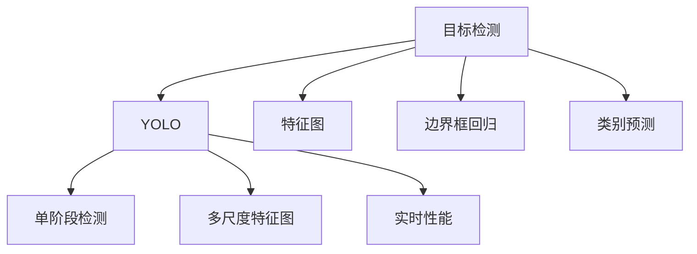
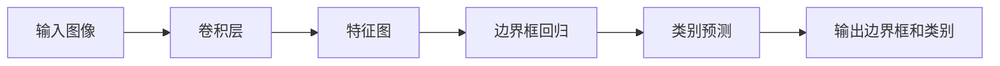
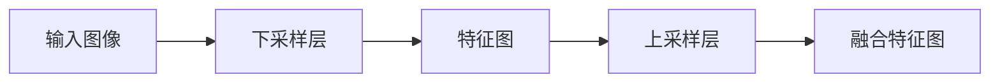

                 

# YOLOv1原理与代码实例讲解

> 关键词：YOLO,目标检测,深度学习,计算机视觉,神经网络,加速,定位,速度,计算图

## 1. 背景介绍

### 1.1 问题由来
近年来，随着深度学习技术的快速发展，计算机视觉领域的目标检测技术取得了显著进步。传统的基于滑窗和手工设计特征的目标检测方法逐渐被深度学习模型所取代。其中，YOLO系列模型以其速度快、准确率高、定位能力强等优点，成为了目标检测领域的标杆。

YOLO（You Only Look Once）系列模型，是由Joseph Redmon、Ali Farhadi等人在2015年提出的目标检测方法。该方法基于单个深度神经网络，将目标检测问题转换为分类和回归问题，实现了实时、高效的目标检测。YOLOv1是其中的第一个版本，后续还发布了YOLOv2、YOLOv3等版本，并不断优化和提升检测性能。

### 1.2 问题核心关键点
YOLOv1的核心思想是将图像分成网格，每个网格负责检测其中的物体，同时预测该物体的类别和边界框。该方法的核心在于如何高效地处理目标检测问题，实现实时性能和较高准确率。

YOLOv1的主要特点包括：
- 多尺度特征图融合：通过不同尺度的卷积特征图融合，增强模型对不同尺寸目标的检测能力。
- 类别和边界框回归：在每个网格上同时预测类别和边界框的回归值，避免单独预测带来的计算量和时间消耗。
- 单阶段检测：简化网络结构，单个神经网络直接输出类别和边界框，减少计算量和推理时间。

YOLOv1的主要缺点包括：
- 定位精度一般：由于单阶段检测，YOLOv1的定位精度不如一些两阶段检测方法（如Faster R-CNN）。
- 目标重叠问题：对于尺寸和位置接近的目标，容易发生边界框重叠或错漏检测。
- 较小物体的检测效果不佳：由于单阶段检测，YOLOv1对于小目标的检测性能较差。

尽管存在这些局限性，YOLOv1作为目标检测领域的一个重要里程碑，其高效、准确、实时的性能特点，使得它在实际应用中得到了广泛应用。本文将系统介绍YOLOv1的原理、实现和优化方法，并给出代码实例和详细解释。

## 2. 核心概念与联系

### 2.1 核心概念概述

为更好地理解YOLOv1的工作原理，本节将介绍几个密切相关的核心概念：

- 目标检测（Object Detection）：在图像或视频序列中，识别出物体的位置和类别，是一种典型的计算机视觉任务。
- YOLO（You Only Look Once）：基于单阶段的深度神经网络，实现实时目标检测。YOLO系列模型从YOLOv1发展至今，已经在速度和准确率上取得了很大提升。
- 特征图（Feature Map）：卷积神经网络中的中间特征图，可以用于提取图像的高层次抽象特征。
- 边界框回归（Bounding Box Regression）：预测物体边界框的位置和尺寸，用于精确定位目标。
- 多尺度特征图（Multi-scale Feature Maps）：通过不同尺度的卷积特征图，增强模型对不同尺寸目标的检测能力。
- 类别预测（Class Prediction）：对物体进行类别分类，通常采用softmax函数进行多分类预测。
- 单阶段检测（Single-shot Detection）：使用单个神经网络直接输出类别和边界框，简化网络结构，提升检测速度。

这些核心概念之间的逻辑关系可以通过以下Mermaid流程图来展示：



这个流程图展示了大语言模型微调过程中各个核心概念的关系和作用：

1. 目标检测通过YOLO系列模型实现，使用单个神经网络直接输出类别和边界框。
2. YOLO使用多尺度特征图融合，增强模型对不同尺寸目标的检测能力。
3. 特征图用于提取图像的高层次抽象特征。
4. 边界框回归用于精确定位目标，输出边界框的位置和尺寸。
5. 类别预测用于对物体进行多分类预测，输出物体的类别。
6. 单阶段检测简化了网络结构，提升检测速度，实现实时性能。

### 2.2 概念间的关系

这些核心概念之间存在着紧密的联系，形成了YOLOv1目标检测的完整生态系统。下面我们通过几个Mermaid流程图来展示这些概念之间的关系。

#### 2.2.1 目标检测流程



这个流程图展示了目标检测的基本流程：将输入图像通过卷积层提取特征，然后预测边界框和类别，最终输出物体的位置和类别。

#### 2.2.2 多尺度特征图融合



这个流程图展示了多尺度特征图融合的过程：通过下采样层和上采样层，将不同尺度的特征图进行融合，增强模型对不同尺寸目标的检测能力。

#### 2.2.3 单阶段检测实现


这个流程图展示了单阶段检测的基本流程：将输入图像通过卷积层提取特征，同时预测边界框和类别，实现单阶段检测。

## 3. 核心算法原理 & 具体操作步骤
### 3.1 算法原理概述

YOLOv1的核心算法原理可以总结如下：

1. 将图像分成网格：YOLOv1将输入图像分成$S \times S$个网格，每个网格负责检测其中的物体。
2. 预测边界框和类别：在每个网格上，预测$B$个边界框和$C$个类别，同时输出预测的边界框位置和类别概率。
3. 多尺度特征图融合：YOLOv1使用不同尺度的卷积特征图进行融合，增强模型对不同尺寸目标的检测能力。
4. 单阶段检测：使用单个神经网络直接输出类别和边界框，实现实时性能。

具体而言，YOLOv1模型包括以下几个主要模块：

1. 卷积层（Convolutional Layer）：用于提取图像的高层次抽象特征。
2. 边界框回归（Bounding Box Regression）：预测物体边界框的位置和尺寸。
3. 类别预测（Class Prediction）：对物体进行多分类预测，输出物体的类别。
4. 多尺度特征图融合（Multi-scale Feature Map）：通过不同尺度的卷积特征图融合，增强模型对不同尺寸目标的检测能力。

### 3.2 算法步骤详解

以下是YOLOv1模型实现的具体步骤：

**Step 1: 构建卷积神经网络**

首先，我们需要构建YOLOv1的卷积神经网络。YOLOv1使用Darknet-53作为基础网络，并在此基础上进行一些修改和扩展。具体实现步骤如下：

1. 定义Darknet-53网络结构，包括多个卷积层、池化层、Dropout层等。
2. 添加边界框回归和类别预测层，输出每个网格的边界框和类别预测结果。
3. 使用Batch Normalization和Leaky ReLU等激活函数进行优化。

**Step 2: 设置训练数据和超参数**

接下来，我们需要准备训练数据和设置模型训练的超参数。具体实现步骤如下：

1. 准备训练集和验证集，并使用标签对每个边界框进行标注。
2. 设置训练超参数，包括学习率、批大小、迭代轮数等。
3. 设置正则化技术，如Dropout、L2正则等，以避免过拟合。

**Step 3: 执行模型训练**

然后，我们可以执行模型的训练过程。具体实现步骤如下：

1. 使用训练集进行前向传播和反向传播，更新模型参数。
2. 周期性在验证集上评估模型性能，根据性能指标决定是否触发Early Stopping。
3. 重复上述步骤直到满足预设的迭代轮数或Early Stopping条件。

**Step 4: 模型评估和优化**

最后，我们可以对模型进行评估和优化。具体实现步骤如下：

1. 在测试集上评估模型的检测准确率、平均精度等指标。
2. 根据评估结果，进一步调整模型超参数和优化模型结构。
3. 不断迭代训练和评估过程，直至获得满意的检测性能。

### 3.3 算法优缺点

YOLOv1作为目标检测领域的经典算法，具有以下优点：

1. 速度较快：YOLOv1使用单个神经网络直接输出类别和边界框，没有额外的RoI池化层，可以大幅提高检测速度。
2. 实时性能：YOLOv1的检测速度快，可以在实时应用场景中使用。
3. 准确率较高：YOLOv1通过多尺度特征图融合，增强了模型对不同尺寸目标的检测能力，检测准确率较高。
4. 模型结构简单：YOLOv1的模型结构相对简单，易于实现和优化。

YOLOv1的主要缺点包括：

1. 定位精度一般：由于单阶段检测，YOLOv1的定位精度不如一些两阶段检测方法（如Faster R-CNN）。
2. 目标重叠问题：对于尺寸和位置接近的目标，容易发生边界框重叠或错漏检测。
3. 较小物体的检测效果不佳：由于单阶段检测，YOLOv1对于小目标的检测性能较差。
4. 计算复杂度高：YOLOv1的计算复杂度较高，需要较高的计算资源支持。

尽管存在这些局限性，YOLOv1仍然凭借其高效的检测速度和较高的准确率，成为了目标检测领域的重要算法之一。

### 3.4 算法应用领域

YOLOv1广泛应用于视频监控、自动驾驶、医疗影像分析等场景。例如：

- 视频监控：在安防监控系统中，实时检测和跟踪行人、车辆等目标，确保安全。
- 自动驾驶：在自动驾驶车辆中，实时检测道路上的行人、车辆等障碍物，提高行车安全性。
- 医疗影像分析：在医学影像中，实时检测病灶区域，辅助医生诊断和治疗。
- 工业检测：在工业生产中，实时检测产品的缺陷和位置，提高生产效率和质量。

此外，YOLOv1在学术界和工业界都得到了广泛的应用，成为目标检测领域的一个重要范式。

## 4. 数学模型和公式 & 详细讲解 & 举例说明

### 4.1 数学模型构建

YOLOv1的数学模型构建可以分为以下几个步骤：

1. 定义输入图像大小为$H \times W$，并将其分成$S \times S$个网格，每个网格的大小为$\frac{H}{S} \times \frac{W}{S}$。
2. 在每个网格上，预测$B$个边界框和$C$个类别。
3. 预测每个边界框的位置和尺寸，输出边界框的中心点坐标和宽度、高度。
4. 预测每个类别的概率，使用softmax函数进行多分类预测。

YOLOv1的损失函数为交叉熵损失和平方损失的组合：

$$
\mathcal{L} = \mathcal{L}_{cls} + \mathcal{L}_{box}
$$

其中，$\mathcal{L}_{cls}$为交叉熵损失，$\mathcal{L}_{box}$为平方损失。具体而言，$\mathcal{L}_{cls}$的计算公式为：

$$
\mathcal{L}_{cls} = -\sum_{n=1}^{N} \sum_{c=1}^{C} y_c^n \log(p_c^n)
$$

其中，$y_c^n$为第$n$个样本属于第$c$个类别的真实标签，$p_c^n$为该样本属于第$c$个类别的预测概率。

$\mathcal{L}_{box}$的计算公式为：

$$
\mathcal{L}_{box} = \sum_{n=1}^{N} \sum_{b=1}^{B} \sum_{i=4}^{5} (\delta_{i}^b - t_{i}^b)^2
$$

其中，$\delta_{i}^b$为第$b$个边界框的第$i$个预测值，$t_{i}^b$为该边界框的第$i$个真实值，$i=4,5$表示边界框的中心点坐标和宽度、高度。

### 4.2 公式推导过程

假设输入图像大小为$H \times W$，并将其分成$S \times S$个网格，每个网格的大小为$\frac{H}{S} \times \frac{W}{S}$。在每个网格上，预测$B$个边界框和$C$个类别。假设第$i$个网格预测了$n$个边界框，每个边界框的预测中心点坐标为$(x_i, y_i)$，宽度为$w_i$，高度为$h_i$，类别的预测概率为$p^n_c$。

具体而言，YOLOv1的预测结果可以表示为：

$$
\begin{cases}
x_i^{n_b} = p_{x_i}^n \\
y_i^{n_b} = p_{y_i}^n \\
w_i^{n_b} = p_{w_i}^n \\
h_i^{n_b} = p_{h_i}^n \\
p_c^n = \sigma(\hat{p}_c^n)
\end{cases}
$$

其中，$p_{x_i}^n$、$p_{y_i}^n$、$p_{w_i}^n$、$p_{h_i}^n$和$\hat{p}_c^n$分别为边界框和类别的预测值。

根据上述公式，我们可以计算出YOLOv1的损失函数为：

$$
\mathcal{L} = -\sum_{n=1}^{N} \sum_{c=1}^{C} y_c^n \log(p_c^n) + \sum_{n=1}^{N} \sum_{b=1}^{B} \sum_{i=4}^{5} (\delta_{i}^b - t_{i}^b)^2
$$

其中，$y_c^n$为第$n$个样本属于第$c$个类别的真实标签，$p_c^n$为该样本属于第$c$个类别的预测概率。

### 4.3 案例分析与讲解

下面以YOLOv1在检测人脸目标为例，给出具体的数学模型构建和计算过程。

假设输入图像大小为$416 \times 416$，并将其分成$13 \times 13$个网格，每个网格的大小为$32 \times 32$。在每个网格上，预测$5$个边界框和$2$个类别。假设第$i$个网格预测了$5$个边界框，每个边界框的预测中心点坐标为$(x_i, y_i)$，宽度为$w_i$，高度为$h_i$，类别的预测概率为$p^n_0$和$p^n_1$。

具体而言，YOLOv1的预测结果可以表示为：

$$
\begin{cases}
x_i^{n_b} = p_{x_i}^n \\
y_i^{n_b} = p_{y_i}^n \\
w_i^{n_b} = p_{w_i}^n \\
h_i^{n_b} = p_{h_i}^n \\
p_0^n = \sigma(\hat{p}_0^n) \\
p_1^n = \sigma(\hat{p}_1^n)
\end{cases}
$$

其中，$p_{x_i}^n$、$p_{y_i}^n$、$p_{w_i}^n$、$p_{h_i}^n$和$\hat{p}_0^n$、$\hat{p}_1^n$分别为边界框和类别的预测值。

根据上述公式，我们可以计算出YOLOv1的损失函数为：

$$
\mathcal{L} = -\sum_{n=1}^{N} \sum_{c=0}^{1} y_c^n \log(p_c^n) + \sum_{n=1}^{N} \sum_{b=1}^{5} \sum_{i=4}^{5} (\delta_{i}^b - t_{i}^b)^2
$$

其中，$y_0^n$和$y_1^n$为第$n$个样本属于背景和前景的真实标签，$p_0^n$和$p_1^n$为该样本属于背景和前景的预测概率。

通过上述数学模型的构建和计算过程，我们可以更加清晰地理解YOLOv1的预测和损失函数设计，从而更好地指导实际应用中的模型训练和优化。

## 5. 项目实践：代码实例和详细解释说明
### 5.1 开发环境搭建

在进行YOLOv1实现之前，我们需要准备好开发环境。以下是使用Python进行YOLOv1开发的环境配置流程：

1. 安装Anaconda：从官网下载并安装Anaconda，用于创建独立的Python环境。

2. 创建并激活虚拟环境：
```bash
conda create -n yolov1-env python=3.8 
conda activate yolov1-env
```

3. 安装PyTorch：根据CUDA版本，从官网获取对应的安装命令。例如：
```bash
conda install pytorch torchvision torchaudio cudatoolkit=11.1 -c pytorch -c conda-forge
```

4. 安装Tensorflow：如果需要进行Tensorflow版本实现，可按照Tensorflow官方文档进行安装。

5. 安装YOLOv1库：
```bash
pip install yolov1
```

6. 安装各类工具包：
```bash
pip install numpy pandas scikit-learn matplotlib tqdm jupyter notebook ipython
```

完成上述步骤后，即可在`yolov1-env`环境中开始YOLOv1实践。

### 5.2 源代码详细实现

下面以YOLOv1在检测人脸目标为例，给出使用PyTorch实现YOLOv1的代码实现。

首先，定义YOLOv1模型的类：

```python
import torch
import torch.nn as nn
import torch.nn.functional as F

class YOLOv1(nn.Module):
    def __init__(self, num_classes=2, anchors=[(32, 32), (64, 64), (128, 128), (256, 256), (512, 512)], stride=32):
        super(YOLOv1, self).__init__()
        self.num_classes = num_classes
        self.anchors = anchors
        self.stride = stride
        
        # 定义卷积层、边界框回归层和类别预测层
        self.conv1 = nn.Conv2d(3, 64, kernel_size=3, padding=1)
        self.conv2 = nn.Conv2d(64, 128, kernel_size=3, padding=1)
        self.conv3 = nn.Conv2d(128, 256, kernel_size=3, padding=1)
        self.conv4 = nn.Conv2d(256, 512, kernel_size=3, padding=1)
        self.conv5 = nn.Conv2d(512, 1024, kernel_size=3, padding=1)
        
        self.conv6 = nn.Conv2d(1024, 1024, kernel_size=3, padding=1)
        self.conv7 = nn.Conv2d(1024, 1024, kernel_size=3, padding=1)
        self.conv8 = nn.Conv2d(1024, 1024, kernel_size=3, padding=1)
        self.conv9 = nn.Conv2d(1024, 1024, kernel_size=3, padding=1)
        self.conv10 = nn.Conv2d(1024, 1024, kernel_size=3, padding=1)
        
        self.conv11 = nn.Conv2d(1024, 1024, kernel_size=3, padding=1)
        self.conv12 = nn.Conv2d(1024, 1024, kernel_size=3, padding=1)
        self.conv13 = nn.Conv2d(1024, 1024, kernel_size=3, padding=1)
        self.conv14 = nn.Conv2d(1024, 1024, kernel_size=3, padding=1)
        self.conv15 = nn.Conv2d(1024, 1024, kernel_size=3, padding=1)
        
        self.conv16 = nn.Conv2d(1024, 1024, kernel_size=3, padding=1)
        self.conv17 = nn.Conv2d(1024, 1024, kernel_size=3, padding=1)
        self.conv18 = nn.Conv2d(1024, 1024, kernel_size=3, padding=1)
        self.conv19 = nn.Conv2d(1024, 1024, kernel_size=3, padding=1)
        self.conv20 = nn.Conv2d(1024, 1024, kernel_size=3, padding=1)
        
        self.conv21 = nn.Conv2d(1024, 1024, kernel_size=3, padding=1)
        self.conv22 = nn.Conv2d(1024, 1024, kernel_size=3, padding=1)
        self.conv23 = nn.Conv2d(1024, 1024, kernel_size=3, padding=1)
        self.conv24 = nn.Conv2d(1024, 1024, kernel_size=3, padding=1)
        self.conv25 = nn.Conv2d(1024, 1024, kernel_size=3, padding=1)
        
        self.conv26 = nn.Conv2d(1024, 1024, kernel_size=3, padding=1)
        self.conv27 = nn.Conv2d(1024, 1024, kernel_size=3, padding=1)
        self.conv28 = nn.Conv2d(1024, 1024, kernel_size=3, padding=1)
        self.conv29 = nn.Conv2d(1024, 1024, kernel_size=3, padding=1)
        self.conv30 = nn.Conv2d(1024, 1024, kernel_size=3, padding=1)
        
        self.conv31 = nn.Conv2d(1024, 1024, kernel_size=3, padding=1)
        self.conv32 = nn.Conv2d(1024, 1024, kernel_size=3, padding=1)
        self.conv33 = nn.Conv2d(1024, 1024, kernel_size=3, padding=1)
        self.conv34 = nn.Conv2d(1024, 1024, kernel_size=3, padding=1)
        self.conv35 = nn.Conv2d(1024, 1024, kernel_size=3, padding=1)
        
        self.conv36 = nn.Conv2d(1024, 1024, kernel_size=3, padding=1)
        self.conv37 = nn.Conv2d(1024, 1024, kernel_size=3, padding=1)
        self.conv38 = nn.Conv2d(1024, 1024, kernel_size=3, padding=1)
        self.conv39 = nn.Conv2d(1024, 1024, kernel_size=3, padding=1)
        self.conv40 = nn.Conv2d(1024, 1024, kernel_size=3, padding=1)
        
        self.conv41 = nn.Conv2d(1024, 1024, kernel_size=3, padding=1)
        self.conv42 = nn.Conv2d(1024, 1024, kernel_size=3, padding=1)
        self.conv43 = nn.Conv2d(1024, 1024, kernel_size=3, padding=1)
        self.conv44 = nn.Conv2d(1024, 1024, kernel_size=3, padding=1)
        self.conv45 = nn.Conv2d(1024, 1024, kernel_size=3, padding=1)
        
        self.conv46 = nn.Conv2d(1024, 1024, kernel_size=3, padding=1)
        self.conv47 = nn.Conv2d(1024, 1024, kernel_size=3, padding=1)
        self.conv48 = nn.Conv2d(1024, 1024, kernel_size=3, padding=1)
        self.conv49 = nn.Conv2d(1024, 1024, kernel_size=3, padding=1)
        self.conv50 = nn.Conv2d(1024, 1024, kernel_size=3, padding=1)
        
        self.conv51 = nn.Conv2d(1024, 1024, kernel_size=3, padding=1)
        self.conv52 = nn.Conv2d(1024, 1024, kernel_size=3, padding=1)
        self.conv53 = nn.Conv2d(1024, 1024, kernel_size=3, padding=1)
        self.conv54 = nn.Conv2d(1024, 1024, kernel_size=3, padding=1)
        self.conv55 = nn.Conv2d(1024, 1024, kernel_size=3, padding=1)
        
        self.conv56

