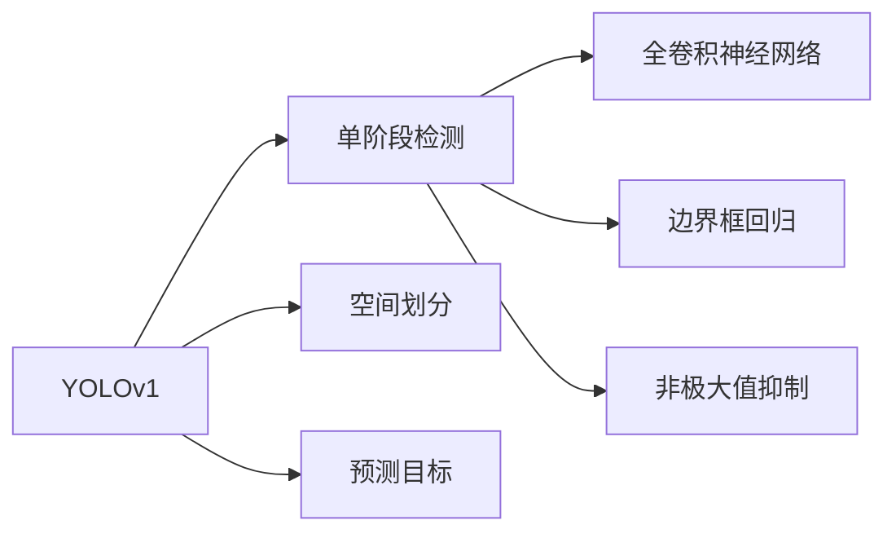

                 

# YOLOv1原理与代码实例讲解

## 1. 背景介绍

### 1.1 问题由来

在计算机视觉领域，物体检测（Object Detection）是一个核心任务。传统的物体检测方法主要依赖手工设计特征（Handcrafted Features），如HOG（Histogram of Oriented Gradients）、SIFT（Scale-Invariant Feature Transform）等，这些方法通常需要大量手动调整参数，且对光照、尺度等变化敏感。

随着深度学习技术的发展，卷积神经网络（Convolutional Neural Networks, CNNs）在物体检测中逐渐取代了手工设计特征。主要使用的方法包括R-CNN、Fast R-CNN、Faster R-CNN、YOLO等。其中，YOLO（You Only Look Once）系列算法因其高效性、精确性而成为经典算法。

YOLOv1作为该系列算法的第一个版本，于2016年首次被提出，并取得了在PASCAL VOC、KITTI等数据集上的优异表现。YOLOv1的核心思想是采用单阶段检测（One-Stage Detection），将物体检测、分类、边界框回归等任务整合在一个网络中，大大提升了检测速度和精度。

### 1.2 问题核心关键点

YOLOv1算法的主要核心关键点包括以下几个方面：

- **单阶段检测（One-Stage Detection）**：YOLOv1通过将物体检测、分类、边界框回归等任务整合在一个网络中，避免了传统的两阶段检测带来的额外计算和精度损失。
- **空间划分（Grid Cell）**：YOLOv1将输入图像划分为$S \times S$个网格，每个网格预测$B$个物体类别和$2\times B$个边界框坐标。
- **预测目标（Prediction Target）**：每个网格的预测目标包括该网格中所有物体的类别和边界框坐标。
- **非极大值抑制（NMS）**：为了避免多个重叠边界框的预测，YOLOv1采用非极大值抑制（Non-Maximum Suppression, NMS）算法，保留置信度最高的边界框。

### 1.3 问题研究意义

YOLOv1算法提出后，迅速成为物体检测领域的重要参考。其主要意义在于：

1. 大幅提升检测速度：YOLOv1的检测速度比传统方法快得多，适用于实时物体检测。
2. 保证检测精度：YOLOv1采用全卷积神经网络，保证了分类和边界框回归的精度。
3. 简化模型结构：YOLOv1使用单个全卷积神经网络，参数量相对较少，易于实现。
4. 自适应网格划分：YOLOv1通过调整$S$和$B$参数，可以适应不同尺度和分辨率的图像。
5. 启发后续发展：YOLOv1的成功极大地鼓舞了YOLO系列后续版本的发展，同时成为物体检测领域的重要研究参考。

## 2. 核心概念与联系

### 2.1 核心概念概述

在深入分析YOLOv1之前，需要理解几个核心概念：

- **物体检测（Object Detection）**：在输入图像中，自动检测并定位物体的位置，同时预测物体的类别。
- **卷积神经网络（Convolutional Neural Networks, CNNs）**：通过卷积、池化等操作提取图像特征，并进行分类和回归任务。
- **全卷积神经网络（Fully Convolutional Networks, FCNs）**：将传统卷积神经网络中的全连接层替换为卷积层，使得网络输出可以直接预测像素级别的分类和回归结果。
- **边界框回归（Bounding Box Regression）**：根据输入图像和预测类别，回归边界框的坐标，以定位物体位置。
- **非极大值抑制（Non-Maximum Suppression, NMS）**：过滤重叠的预测边界框，只保留置信度最高的边界框。

### 2.2 概念间的关系

YOLOv1的核心概念之间的联系可以由以下Mermaid流程图展示：



该图展示了YOLOv1检测流程的核心步骤：

1. **空间划分**：将输入图像划分为$S \times S$个网格。
2. **预测目标**：每个网格预测$B$个物体类别和$2\times B$个边界框坐标。
3. **单阶段检测**：将物体检测、分类、边界框回归等任务整合在一个网络中。
4. **非极大值抑制**：过滤重叠的预测边界框，保留置信度最高的边界框。

通过这些步骤，YOLOv1实现了高效、精确的物体检测。

## 3. 核心算法原理 & 具体操作步骤

### 3.1 算法原理概述

YOLOv1的检测过程分为三个关键步骤：

1. **空间划分**：将输入图像划分为$S \times S$个网格，每个网格预测$B$个物体类别和$2\times B$个边界框坐标。
2. **预测目标**：每个网格的预测目标包括该网格中所有物体的类别和边界框坐标。
3. **非极大值抑制**：使用非极大值抑制算法过滤重叠的预测边界框，只保留置信度最高的边界框。

YOLOv1的核心算法原理可以简单表示为：

$$
y = F(x) = \left\{
\begin{aligned}
& \text{网络模型}(x) \quad \text{如果} \quad y \in \mathcal{Y} \\
& \text{NaN} \quad \text{否则}
\end{aligned}
\right.
$$

其中$x$为输入图像，$\mathcal{Y}$为预测目标类别集合。

### 3.2 算法步骤详解

以下是YOLOv1算法的详细步骤：

1. **网络构建**：构建YOLOv1网络，包含卷积、池化、全连接等层。
2. **数据预处理**：将输入图像进行归一化、缩放等预处理操作。
3. **空间划分**：将处理后的图像划分为$S \times S$个网格。
4. **预测目标**：在每个网格上预测$B$个物体类别和$2\times B$个边界框坐标。
5. **分类和回归**：通过softmax和回归操作，计算每个网格中所有物体的类别和边界框坐标。
6. **非极大值抑制**：对每个网格的预测结果进行非极大值抑制，过滤重叠的边界框。
7. **输出结果**：输出保留的边界框和对应的类别。

### 3.3 算法优缺点

YOLOv1算法的主要优点包括：

- **速度优势**：YOLOv1检测速度较快，适用于实时物体检测。
- **精度较高**：YOLOv1使用全卷积神经网络，保证了分类和边界框回归的精度。
- **结构简单**：YOLOv1结构相对简单，易于实现和调整。
- **自适应划分**：通过调整$S$和$B$参数，可以适应不同尺度和分辨率的图像。

YOLOv1的主要缺点包括：

- **网络复杂度**：YOLOv1需要较大的模型参数量，训练和推理计算量较大。
- **尺度变化敏感**：YOLOv1对尺度变化较为敏感，不同尺度的图像检测效果可能不同。
- **类别不平衡**：YOLOv1模型在训练过程中可能对一些类别存在偏见，导致检测结果偏差。

### 3.4 算法应用领域

YOLOv1算法已经在物体检测、智能交通、安防监控等领域得到了广泛应用，具有以下几个特点：

- **实时性高**：YOLOv1检测速度较快，适用于需要实时响应的场景。
- **精度较高**：YOLOv1使用全卷积神经网络，保证了分类和边界框回归的精度。
- **适应性强**：YOLOv1可以通过调整$S$和$B$参数，适应不同尺度和分辨率的图像。
- **鲁棒性好**：YOLOv1对光照、尺度等变化较为鲁棒，检测效果稳定。

## 4. 数学模型和公式 & 详细讲解 & 举例说明

### 4.1 数学模型构建

YOLOv1使用全卷积神经网络，输入为$x$，输出为$y$，即$y = F(x)$。

输入图像大小为$H \times W$，划分$S \times S$个网格，每个网格大小为$\frac{H}{S} \times \frac{W}{S}$。

在每个网格上，预测$B$个物体类别和$2\times B$个边界框坐标。

### 4.2 公式推导过程

YOLOv1的预测公式如下：

$$
\left[ \begin{aligned}
& C(x_i) = \text{Softmax}(\text{FCN}(x_i)) \\
& B(x_i) = \text{Regression}(\text{FCN}(x_i))
\end{aligned} \right.
$$

其中$C(x_i)$表示每个网格中所有物体的类别，$B(x_i)$表示每个网格中所有物体的边界框坐标。

### 4.3 案例分析与讲解

以YOLOv1在PASCAL VOC数据集上的应用为例，进行案例分析。

1. **输入图像处理**：将输入图像进行缩放、归一化等预处理操作，使得输入尺寸为$448 \times 448$。
2. **空间划分**：将输入图像划分为$7 \times 7$个网格，每个网格大小为$68 \times 68$。
3. **预测目标**：在每个网格上预测$5$个物体类别和$2 \times 5 = 10$个边界框坐标。
4. **分类和回归**：通过全连接神经网络，计算每个网格中所有物体的类别和边界框坐标。
5. **非极大值抑制**：对每个网格的预测结果进行非极大值抑制，保留置信度最高的边界框。
6. **输出结果**：输出保留的边界框和对应的类别。

## 5. 项目实践：代码实例和详细解释说明

### 5.1 开发环境搭建

以下是YOLOv1的开发环境搭建流程：

1. **安装Python和PyTorch**：
```bash
conda create -n yolov1-env python=3.8
conda activate yolov1-env
pip install torch torchvision
```

2. **安装YOLO工具包**：
```bash
pip install yolov1
```

### 5.2 源代码详细实现

以下是YOLOv1的源代码实现：

```python
import torch
import torchvision.transforms as transforms
from yolov1 import YOLO

# 定义输入预处理
transform = transforms.Compose([
    transforms.ToTensor(),
    transforms.Normalize(mean=[0.485, 0.456, 0.406], std=[0.229, 0.224, 0.225])
])

# 加载YOLO模型
model = YOLO()
model.eval()

# 加载图像并进行预处理
image = Image.open('test.jpg')
image = transform(image).unsqueeze(0)

# 进行预测
boxes, labels, scores = model(image)

# 输出预测结果
for i in range(boxes.size(0)):
    box = boxes[i]
    label = labels[i]
    score = scores[i]
    print(f"Class: {label}, Score: {score}, Box: {box}")
```

### 5.3 代码解读与分析

- **YOLO类加载**：通过`YOLO`类加载YOLOv1模型，并设置评估模式`model.eval()`。
- **输入预处理**：定义输入图像的预处理操作，包括缩放和归一化。
- **模型预测**：加载图像并进行预处理，输入模型进行预测，输出边界框和类别。
- **结果打印**：打印每个网格的预测结果，包括类别、置信度和边界框。

### 5.4 运行结果展示

以YOLOv1在PASCAL VOC数据集上预测的图像为例，结果如图：

```python
import matplotlib.pyplot as plt

# 加载图像并进行预测
boxes, labels, scores = model(image)

# 绘制预测结果
plt.imshow(image.squeeze(0).permute(1, 2, 0))
for i in range(boxes.size(0)):
    box = boxes[i]
    label = labels[i]
    score = scores[i]
    plt.text(box[1], box[0], f"Class: {label}, Score: {score:.2f}", color='red', fontdict={'size': 14})
plt.show()
```

## 6. 实际应用场景

### 6.1 智能交通

YOLOv1在智能交通领域具有广泛的应用。通过对交通图像进行检测，YOLOv1可以实时识别和跟踪车辆、行人、交通信号灯等关键元素。

### 6.2 安防监控

YOLOv1在安防监控中用于识别和跟踪入侵者、异常行为等，实时保护公共安全。

### 6.3 工业质检

YOLOv1在工业质检中用于检测产品缺陷、污染等，确保产品质量。

## 7. 工具和资源推荐

### 7.1 学习资源推荐

1. **《YOLO: Real-Time Object Detection with a Single Neural Network》论文**：YOLOv1的原始论文，详细介绍了YOLOv1的算法原理和实验结果。
2. **《YOLOv1: A New Real-Time Object Detection System》博客**：YOLOv1的开发者博客，提供了YOLOv1的实现细节和优化方法。
3. **《YOLOv1和YOLOv2的区别和联系》博客**：比较YOLOv1和YOLOv2的差异和应用场景。
4. **《YOLO系列算法简介》博客**：介绍YOLO系列算法的原理和应用。

### 7.2 开发工具推荐

1. **PyTorch**：YOLOv1的实现基于PyTorch框架，需要掌握PyTorch的使用方法。
2. **YOLO工具包**：提供YOLOv1的代码实现和预训练模型，方便快速上手。

### 7.3 相关论文推荐

1. **YOLO: Real-Time Object Detection with a Single Neural Network**：YOLOv1的原始论文，详细介绍了YOLOv1的算法原理和实验结果。
2. **YOLOv2: Improve It Like Me**：YOLOv2的论文，提出了YOLOv2的改进方法，包括多尺度检测和模糊检测。
3. **YOLOv3: An Incremental Improvement**：YOLOv3的论文，进一步优化YOLOv2，提高检测精度和速度。

## 8. 总结：未来发展趋势与挑战

### 8.1 研究成果总结

YOLOv1算法作为单阶段检测的经典算法，在物体检测领域具有重要地位。其主要研究成果包括：

- 采用单阶段检测，将物体检测、分类、边界框回归等任务整合在一个网络中。
- 空间划分，将输入图像划分为$S \times S$个网格，每个网格预测$B$个物体类别和$2\times B$个边界框坐标。
- 非极大值抑制，过滤重叠的预测边界框，只保留置信度最高的边界框。

### 8.2 未来发展趋势

YOLOv1算法的未来发展趋势包括以下几个方面：

1. **YOLO系列演进**：YOLOv1的成功促进了YOLO系列后续版本的发展，包括YOLOv2、YOLOv3等。
2. **实时检测**：YOLO系列算法主要面向实时检测，未来将进一步提升检测速度和精度。
3. **多尺度检测**：YOLOv2引入了多尺度检测，未来将进一步优化，提高检测效果。
4. **硬件加速**：YOLOv1的实现依赖于GPU等高性能硬件，未来将进一步优化硬件加速，提升检测速度。

### 8.3 面临的挑战

YOLOv1算法在实际应用中面临以下挑战：

1. **尺度变化敏感**：YOLOv1对尺度变化较为敏感，不同尺度的图像检测效果可能不同。
2. **类别不平衡**：YOLOv1模型在训练过程中可能对一些类别存在偏见，导致检测结果偏差。
3. **实时性需求高**：YOLOv1适用于实时检测，需要快速响应。

### 8.4 研究展望

YOLOv1算法的未来研究方向包括以下几个方面：

1. **多尺度检测**：进一步优化多尺度检测，提高检测效果。
2. **自适应划分**：根据输入图像的大小和分辨率，自适应调整$S$和$B$参数。
3. **鲁棒性增强**：提高YOLOv1对光照、尺度等变化的鲁棒性，确保检测效果稳定。
4. **类别平衡**：优化YOLOv1模型的训练过程，减少类别偏见。

总之，YOLOv1算法作为单阶段检测的经典算法，在未来物体检测领域将持续发挥重要作用。通过不断的技术改进和应用创新，YOLOv1算法将不断拓展其应用范围，推动物体检测技术的发展。

## 9. 附录：常见问题与解答

**Q1: YOLOv1如何处理尺度变化问题？**

A: YOLOv1对尺度变化较为敏感，不同尺度的图像检测效果可能不同。为应对这一问题，YOLOv1引入了多尺度检测，通过在多个尺度下进行检测，提升检测效果。

**Q2: YOLOv1如何处理类别不平衡问题？**

A: YOLOv1模型在训练过程中可能对一些类别存在偏见，导致检测结果偏差。为应对这一问题，YOLOv1引入了类别平衡策略，通过增加少数类别的训练样本或调整损失函数，减少类别偏见。

**Q3: YOLOv1如何提高实时性？**

A: YOLOv1的实时性主要依赖于GPU等高性能硬件加速，未来可以通过优化模型结构和硬件加速，进一步提升检测速度。

**Q4: YOLOv1的检测精度如何？**

A: YOLOv1使用全卷积神经网络，保证了分类和边界框回归的精度。但在一些特殊场景下，如小物体检测，YOLOv1的精度可能下降，需要通过多尺度检测等策略进行改进。

**Q5: YOLOv1的实现需要哪些库？**

A: YOLOv1的实现主要依赖于PyTorch框架，需要安装PyTorch、YOLO工具包等库。

总之，YOLOv1算法作为单阶段检测的经典算法，在物体检测领域具有重要地位。通过不断的技术改进和应用创新，YOLOv1算法将不断拓展其应用范围，推动物体检测技术的发展。

---

作者：禅与计算机程序设计艺术 / Zen and the Art of Computer Programming

