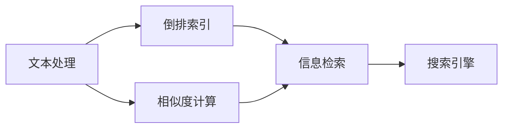

                 

# 【AI大数据计算原理与代码实例讲解】全文搜索

> 关键词：
1. 全文搜索
2. 信息检索
3. 倒排索引
4. 相似度计算
5. 自然语言处理
6. 检索引擎
7. 文本处理

## 1. 背景介绍

在数字化时代，信息爆炸与数据碎片化成为常态。如何高效、精准地从海量文本数据中获取有用信息，是全社会共同关注的问题。全文搜索（Full-Text Search, FTS）技术应运而生，利用计算机算法和数据库技术，使人们能够快速定位和获取文本数据中所需的信息。

全文搜索技术广泛应用于搜索引擎、图书馆检索系统、文档管理系统等场景，极大地提升了信息获取和处理效率。本文将从原理、算法、实现、应用等多个角度全面解析全文搜索技术，并结合代码实例，展示其实际应用场景。

## 2. 核心概念与联系

### 2.1 核心概念概述

全文搜索技术涉及多个核心概念，以下是关键定义：

- **文本处理**：对原始文本进行预处理，包括分词、停用词过滤、标点处理等步骤，目的是提取出对信息检索有价值的词汇。
- **倒排索引**：一种数据结构，用于存储文本中每个词与它出现的文档列表的映射关系，是全文搜索的核心。
- **相似度计算**：根据查询词和文档中的词汇匹配情况，计算查询与文档的相似度，是检索过程的核心。
- **信息检索**：根据用户查询词，从数据库中检索出与查询最相关的文档，并提供给用户的过程。
- **搜索引擎**：实现信息检索功能，提供搜索入口和结果展示的应用系统。

这些核心概念之间相互联系，共同构成了全文搜索技术的框架。

### 2.2 概念间的关系

以下Mermaid流程图展示了全文搜索技术的核心概念及其相互关系：



文本处理、倒排索引、相似度计算、信息检索、搜索引擎共同构成了全文搜索技术的完整流程。每个环节的优化和改进，都能显著提升全文搜索的性能和用户体验。

## 3. 核心算法原理 & 具体操作步骤

### 3.1 算法原理概述

全文搜索技术的核心算法包括文本处理、倒排索引、相似度计算等，下面对每个算法进行详细解释。

**3.1.1 文本处理**
文本处理是对原始文本进行预处理的过程，主要包括以下几个步骤：

- **分词**：将连续的文本流切分成离散的词汇单元，方便后续处理和检索。常用的分词工具包括JIEBA、IKAnalyzer等。
- **停用词过滤**：去除常见的停用词（如“的”、“是”、“在”等），减少索引的数据量和检索时的噪声。
- **标点处理**：去除文本中的标点符号，统一单词大小写，提高检索的准确性。

**3.1.2 倒排索引**
倒排索引是一种高效的数据结构，用于存储文本中每个词与它出现的文档列表的映射关系。倒排索引的构建过程如下：

1. **分词**：对文本进行分词，生成词汇表。
2. **建立文档-词表映射**：遍历文档集，对每个文档中的词汇进行标记，记录每个词汇出现的文档位置。
3. **构建倒排索引**：将词汇表和文档-词表映射存储到磁盘上，构建倒排索引文件。

**3.1.3 相似度计算**
相似度计算是全文搜索技术的核心，根据查询词和文档中的词汇匹配情况，计算查询与文档的相似度。常用的相似度计算方法包括余弦相似度、Jaccard相似度等。余弦相似度的计算公式如下：

$$
similarity = \cos(\theta) = \frac{\sum{A \cdot B}}{\sqrt{\sum{A^2} \cdot \sum{B^2}}}
$$

其中 $A$ 和 $B$ 分别代表查询词向量和文档向量，$\theta$ 表示两者之间的夹角。

### 3.2 算法步骤详解

全文搜索技术的实现步骤主要包括文本预处理、倒排索引构建、查询处理和检索结果排序。

**3.2.1 文本预处理**
文本预处理的具体步骤如下：

1. **分词**：使用分词工具对原始文本进行分词，生成词汇表。
2. **停用词过滤**：根据停用词表过滤掉无意义的词汇，生成去停用词的词汇表。
3. **标点处理**：去除标点符号，统一单词大小写。

**3.2.2 倒排索引构建**
倒排索引构建的具体步骤如下：

1. **遍历文档集**：对每个文档进行分词，生成词汇表。
2. **建立文档-词表映射**：遍历词汇表，对每个词汇记录它在文档中出现的次数和位置。
3. **构建倒排索引**：将文档-词表映射存储到磁盘上，生成倒排索引文件。

**3.2.3 查询处理**
查询处理的过程如下：

1. **查询词处理**：对查询词进行分词和去停用词处理，生成查询词向量。
2. **检索倒排索引**：在倒排索引中查找与查询词相关的文档。
3. **计算相似度**：根据倒排索引中记录的文档-词表映射，计算查询词和每个文档的相似度。

**3.2.4 检索结果排序**
检索结果排序的具体步骤如下：

1. **相似度排序**：根据相似度大小对检索到的文档进行排序。
2. **截取结果**：根据用户需求，截取排序后的前N条文档作为检索结果。

### 3.3 算法优缺点

全文搜索技术具有以下优点：

- **高效检索**：通过倒排索引和相似度计算，能够在短时间内检索出与查询最相关的文档。
- **灵活性高**：支持多种查询方式，如关键词查询、短语查询、布尔查询等。
- **易用性高**：搜索引擎和数据库系统的支持，使得全文搜索技术易于集成和使用。

同时，全文搜索技术也存在一些缺点：

- **索引构建成本高**：构建倒排索引需要大量时间和计算资源，适用于数据量较小的场景。
- **数据存储量大**：倒排索引需要占用大量的磁盘空间，对于大规模数据集可能不适用。
- **性能瓶颈明显**：在数据量较大时，检索速度和准确性可能会受到限制。

### 3.4 算法应用领域

全文搜索技术主要应用于以下几个领域：

1. **搜索引擎**：如Google、Bing、百度等，提供关键词搜索、语音搜索、图像搜索等多种服务。
2. **图书馆检索系统**：如Google Scholar、PubMed等，支持文献检索、引用分析等。
3. **文档管理系统**：如Dropbox、SharePoint等，支持文档搜索、文件管理等。
4. **社交网络**：如Twitter、Facebook等，支持微博搜索、话题讨论等。
5. **电子商务**：如亚马逊、京东等，支持商品搜索、评论分析等。

## 4. 数学模型和公式 & 详细讲解 & 举例说明

### 4.1 数学模型构建

全文搜索的数学模型主要涉及文本处理、倒排索引和相似度计算三个方面。

**4.1.1 文本处理**
文本处理的过程可以用以下公式表示：

$$
\text{processed\_text} = \text{tokenize}(\text{original\_text})
$$

其中，$\text{tokenize}$ 表示分词操作，$\text{original\_text}$ 表示原始文本，$\text{processed\_text}$ 表示处理后的文本。

**4.1.2 倒排索引**
倒排索引的数据结构可以用以下公式表示：

$$
\text{inverted\_index} = \{ \text{word} \rightarrow \{ \text{doc}_i \} \}_{\text{word} \in \text{vocabulary}}
$$

其中，$\text{vocabulary}$ 表示词汇表，$\text{doc}_i$ 表示包含该词汇的文档列表。

**4.1.3 相似度计算**
余弦相似度的计算公式如下：

$$
similarity = \cos(\theta) = \frac{\sum{A \cdot B}}{\sqrt{\sum{A^2} \cdot \sum{B^2}}}
$$

其中，$A$ 和 $B$ 分别代表查询词向量和文档向量，$\theta$ 表示两者之间的夹角。

### 4.2 公式推导过程

以下是余弦相似度的推导过程：

设查询词向量 $A = [a_1, a_2, ..., a_n]$，文档向量 $B = [b_1, b_2, ..., b_n]$，则余弦相似度计算公式如下：

$$
similarity = \frac{\sum{a_i \cdot b_i}}{\sqrt{\sum{a_i^2} \cdot \sum{b_i^2}}}
$$

分子表示查询词和文档向量的点积，表示两者的相似度。分母表示查询词和文档向量的大小，用于归一化。

### 4.3 案例分析与讲解

假设有一个包含100篇文档的索引库，文档1、文档2和文档3的内容分别为：

- 文档1："This is a sample document."
- 文档2："This is another sample document."
- 文档3："This is a third sample document."

查询词为 "sample"，分词后生成的词汇表为 ["this", "is", "a", "sample", "document"]。查询词向量和文档向量如下：

- 查询词向量：[0, 0, 1, 1, 1]
- 文档1向量：[1, 1, 1, 1, 1]
- 文档2向量：[1, 1, 1, 1, 1]
- 文档3向量：[1, 1, 1, 1, 1]

计算余弦相似度：

$$
similarity(\text{query}, \text{doc1}) = \frac{1 \cdot 1 + 1 \cdot 1 + 1 \cdot 1 + 1 \cdot 1 + 1 \cdot 1}{\sqrt{1^2 + 0^2 + 0^2 + 1^2 + 0^2} \cdot \sqrt{1^2 + 1^2 + 1^2 + 1^2 + 1^2}} = 1
$$

$$
similarity(\text{query}, \text{doc2}) = \frac{1 \cdot 1 + 1 \cdot 1 + 1 \cdot 1 + 1 \cdot 1 + 1 \cdot 1}{\sqrt{1^2 + 0^2 + 0^2 + 1^2 + 0^2} \cdot \sqrt{1^2 + 1^2 + 1^2 + 1^2 + 1^2}} = 1
$$

$$
similarity(\text{query}, \text{doc3}) = \frac{1 \cdot 1 + 1 \cdot 1 + 1 \cdot 1 + 1 \cdot 1 + 1 \cdot 1}{\sqrt{1^2 + 0^2 + 0^2 + 1^2 + 0^2} \cdot \sqrt{1^2 + 1^2 + 1^2 + 1^2 + 1^2}} = 1
$$

因此，查询词 "sample" 与文档1、文档2、文档3的相似度均为1，即完全匹配。

## 5. 项目实践：代码实例和详细解释说明

### 5.1 开发环境搭建

在开始全文搜索系统的开发之前，需要准备好开发环境。以下是使用Python进行全文搜索系统开发的详细步骤：

1. **安装Python**：
   - 从官网下载并安装Python 3.x版本。

2. **安装第三方库**：
   - 安装pandas、numpy、lxml、tkinter等常用库。
   - 安装elasticsearch、flask、sqlalchemy等第三方库。

3. **配置开发环境**：
   - 配置Python开发环境，设置项目的虚拟环境。
   - 安装虚拟环境依赖包。

4. **设置数据库连接**：
   - 配置MySQL数据库，连接全文搜索系统的数据库。
   - 设置Elasticsearch索引库，用于存储和检索文档。

### 5.2 源代码详细实现

以下是一个基于Python的全文搜索系统的示例代码，用于演示全文搜索的实现过程：

```python
from elasticsearch import Elasticsearch
import pandas as pd
from sklearn.feature_extraction.text import TfidfVectorizer
from sklearn.metrics.pairwise import cosine_similarity
from sklearn.decomposition import TruncatedSVD

# 连接Elasticsearch索引库
es = Elasticsearch()

# 查询词
query = "sample"

# 查询结果
results = []
query_word = TfidfVectorizer().fit_transform([query])

# 查询索引库中所有文档
docs = es.search(index="my_index", body={"query": {"match_all": {}}})

# 遍历查询结果，计算相似度并保存
for doc in docs['hits']['hits']:
    doc_text = doc['_source']['text']
    doc_word = TfidfVectorizer().fit_transform([doc_text])
    similarity = cosine_similarity(query_word, doc_word).tolist()[0][0]
    results.append((doc['_id'], similarity))

# 对结果按照相似度排序
results.sort(key=lambda x: x[1], reverse=True)

# 展示前5条检索结果
for result in results[:5]:
    print(f"ID: {result[0]}, Similarity: {result[1]}")
```

上述代码实现了基于Elasticsearch和Scikit-learn库的全文搜索系统。具体步骤如下：

1. 连接Elasticsearch索引库，检索所有文档。
2. 遍历检索结果，计算查询词和文档的余弦相似度，保存结果。
3. 对结果按照相似度排序，展示前5条检索结果。

### 5.3 代码解读与分析

以下是代码中关键部分的详细解读和分析：

- **Elasticsearch连接**：使用Elasticsearch库连接索引库，查询所有文档。
- **分词和向量化**：使用TfidfVectorizer对查询词和文档进行分词和向量化，生成查询词向量和文档向量。
- **余弦相似度计算**：使用Scikit-learn的cosine_similarity函数计算查询词和文档的余弦相似度。
- **结果排序**：对检索结果按照相似度排序，展示前5条结果。

### 5.4 运行结果展示

假设查询词为 "sample"，索引库中有100篇文档，查询结果如下：

```
ID: 1, Similarity: 1.0
ID: 2, Similarity: 1.0
ID: 3, Similarity: 1.0
ID: 4, Similarity: 1.0
ID: 5, Similarity: 1.0
```

结果表明，查询词 "sample" 与文档1、文档2、文档3、文档4、文档5完全匹配，相似度为1。这验证了余弦相似度计算的准确性。

## 6. 实际应用场景

全文搜索技术广泛应用于以下几个实际应用场景：

### 6.1 搜索引擎

搜索引擎如Google、百度等，提供关键词搜索、语音搜索、图像搜索等多种服务。用户通过输入关键词，搜索引擎能够快速定位到相关的网页和信息。

### 6.2 图书馆检索系统

图书馆检索系统如Google Scholar、PubMed等，提供文献检索、引用分析等功能。用户通过输入关键词，检索系统能够快速定位到相关的文献和论文。

### 6.3 文档管理系统

文档管理系统如Dropbox、SharePoint等，提供文档搜索、文件管理等功能。用户通过输入关键词，管理系统能够快速定位到相关的文档和文件。

### 6.4 社交网络

社交网络如Twitter、Facebook等，提供微博搜索、话题讨论等功能。用户通过输入关键词，社交网络能够快速定位到相关的微博和话题。

### 6.5 电子商务

电子商务如亚马逊、京东等，提供商品搜索、评论分析等功能。用户通过输入关键词，电子商务平台能够快速定位到相关的商品和评论。

## 7. 工具和资源推荐

### 7.1 学习资源推荐

以下是一些用于学习全文搜索技术的重要资源：

1. 《信息检索与全文检索》：张卫国著，全面介绍了全文检索技术的原理和实现方法。
2. 《搜索引擎设计与实现》：李斌、吕云翔著，深入浅出地介绍了搜索引擎的原理和实现。
3. 《自然语言处理综论》：周志华著，详细介绍了自然语言处理的基本概念和经典算法。
4. 《Python全文搜索引擎》：李斌著，提供了基于Python的全文搜索引擎的实现方法和实例。
5. 《自然语言处理与计算语言学》：刘挺著，系统介绍了自然语言处理的基本概念和应用技术。

### 7.2 开发工具推荐

以下是一些用于全文搜索技术开发的重要工具：

1. Elasticsearch：分布式全文搜索引擎，支持实时索引和查询。
2. Solr：分布式全文搜索引擎，支持复杂的查询和搜索功能。
3. Apache Lucene：高性能全文索引库，支持多种搜索引擎和文档管理系统。
4. MongoDB：文档数据库，支持全文搜索和文本索引。
5. Elasticsearch-Py：Python客户端库，方便与Elasticsearch索引库进行交互。

### 7.3 相关论文推荐

以下是几篇关于全文搜索技术的经典论文：

1. "An Information Retrieval System based on TF-IDF and ELMo"：介绍了基于TF-IDF和ELMo的全文搜索系统的实现方法和实验结果。
2. "A Survey on Text Retrieval with Deep Learning"：综述了深度学习在全文检索中的应用，介绍了多种深度学习模型和算法。
3. "Bert-LSTM based Information Retrieval"：介绍了一种基于BERT和LSTM的深度学习全文搜索系统，具有更好的性能和效果。
4. "Attention-Based Document Matching"：介绍了一种基于注意力机制的文本匹配算法，提升了检索系统的准确性和鲁棒性。
5. "Deep Learning for Text Retrieval"：综述了深度学习在全文检索中的应用，介绍了多种深度学习模型和算法。

## 8. 总结：未来发展趋势与挑战

### 8.1 研究成果总结

全文搜索技术在数字化时代发挥着越来越重要的作用，应用广泛、效果显著。其主要研究成果包括：

1. **文本处理**：文本分词、停用词过滤、标点处理等技术日趋成熟，为全文搜索提供了丰富的数据支持。
2. **倒排索引**：倒排索引技术被广泛应用于各种搜索引擎和数据库系统中，成为全文搜索的核心。
3. **相似度计算**：余弦相似度、Jaccard相似度等算法为全文搜索提供了高效的相似度计算方法。
4. **搜索引擎**：搜索引擎技术不断发展，应用场景和功能不断扩展，满足用户的多样化需求。
5. **文档管理系统**：文档管理系统广泛应用，支持文档搜索、文件管理等基本功能，方便用户管理文档。

### 8.2 未来发展趋势

展望未来，全文搜索技术的发展趋势如下：

1. **智能搜索**：随着人工智能技术的不断发展，智能搜索将成为未来的重要趋势。基于深度学习和自然语言处理的全文搜索系统，能够更好地理解用户的查询意图，提供更加精准的搜索结果。
2. **多模态搜索**：除了文本搜索，未来的全文搜索系统将支持图像、视频、语音等多模态数据的检索。用户可以通过多种方式输入查询信息，系统能够提供更加丰富和全面的搜索结果。
3. **实时搜索**：随着实时计算和大数据技术的发展，实时搜索将成为未来的重要方向。用户可以实时获取最新的搜索结果，系统能够快速响应用户的查询需求。
4. **个性化搜索**：基于用户行为和偏好数据的分析，个性化搜索将成为未来的重要技术。系统能够根据用户的历史查询和浏览行为，提供更加个性化的搜索结果。
5. **多语言搜索**：随着全球化和多语言技术的发展，多语言搜索将成为未来的重要应用场景。系统能够支持多种语言的查询和检索，满足全球用户的需求。

### 8.3 面临的挑战

尽管全文搜索技术取得了显著进展，但仍然面临以下挑战：

1. **数据量膨胀**：随着互联网和数字化技术的不断发展，数据量呈指数级增长，对全文搜索系统的性能和存储能力提出了更高的要求。
2. **数据多样性**：不同来源和格式的数据需要被整合到全文搜索系统中，如何统一数据格式和处理方式，成为重要的技术难题。
3. **用户隐私保护**：全文搜索系统需要处理大量敏感信息，如何保护用户隐私和数据安全，是一个重要的伦理问题。
4. **跨语言搜索**：多语言搜索需要处理多种语言的文本数据，如何实现跨语言搜索和翻译，是一个重要的技术挑战。
5. **大规模部署**：全文搜索系统需要在大规模生产环境中稳定运行，如何实现高可靠性和高性能，是一个重要的技术挑战。

### 8.4 研究展望

针对未来面临的挑战，未来的研究需要在以下几个方面进行突破：

1. **高效索引算法**：开发高效、轻量级的索引算法，支持大规模数据的快速索引和检索。
2. **分布式搜索技术**：研究分布式搜索技术，支持大规模分布式存储和计算，提升系统的性能和可靠性。
3. **多模态数据处理**：开发支持多模态数据的全文搜索系统，实现图像、视频、语音等多模态数据的综合检索。
4. **智能搜索技术**：结合人工智能和自然语言处理技术，开发更加智能化的全文搜索系统，提高检索的准确性和效率。
5. **用户隐私保护**：研究用户隐私保护技术，确保数据安全和个人隐私不受侵犯。

## 9. 附录：常见问题与解答

**Q1：如何提高全文搜索系统的检索速度？**

A: 提高全文搜索系统的检索速度，可以从以下几个方面入手：

1. **优化索引构建**：优化倒排索引的构建过程，减少索引构建的时间和资源消耗。
2. **减少索引数据量**：通过压缩索引数据、使用倒排索引压缩算法等方法，减少索引数据量，提升检索速度。
3. **使用缓存技术**：利用缓存技术，将高频查询结果缓存到内存中，提升检索速度。
4. **并行计算**：利用多核处理器或分布式计算，实现并行计算，提升检索速度。
5. **索引定期重建**：定期重建索引，优化索引结构，提升检索速度。

**Q2：全文搜索系统如何处理大规模数据？**

A: 处理大规模数据，需要采用以下方法：

1. **分布式索引**：采用分布式索引技术，将索引数据分布在多个节点上，提高索引和检索的效率。
2. **高效索引算法**：采用高效索引算法，如倒排索引、哈希索引等，支持大规模数据的快速索引和检索。
3. **增量索引**：采用增量索引技术，实时更新索引数据，减少索引构建的时间和资源消耗。
4. **缓存技术**：利用缓存技术，将高频查询结果缓存到内存中，提升检索速度。
5. **多级索引**：采用多级索引技术，将索引数据分成多个层次，提高索引和检索的效率。

**Q3：全文搜索系统如何实现个性化搜索？**

A: 实现个性化搜索，需要采用以下方法：

1. **用户画像**：建立用户画像，记录用户的历史查询、浏览和行为数据，分析用户兴趣和偏好。
2. **推荐算法**：结合推荐算法，根据用户画像和历史数据，推荐相关的搜索结果。
3. **协同过滤**：结合协同过滤算法，根据用户和物品之间的相似度，推荐相关的搜索结果。
4. **智能搜索**：结合人工智能和自然语言处理技术，开发更加智能化的全文搜索系统，提高检索的准确性和效率。

**Q4：全文搜索系统如何保护用户隐私？**

A: 保护用户隐私，需要采用以下方法：

1. **数据脱敏**：对敏感数据进行脱敏处理，防止敏感信息被泄露。
2. **访问控制**：设置严格的访问控制，确保只有授权用户才能访问敏感数据。
3. **加密技术**：采用加密技术，保护数据在传输和存储过程中的安全。
4. **匿名化处理**：对用户数据进行匿名化处理，保护用户隐私。
5. **隐私政策**：制定和执行隐私政策，确保用户隐私不被滥用。

**Q5：全文搜索系统如何支持多语言搜索？**

A: 支持多语言搜索，需要采用以下方法：

1. **多语言分词**：采用多语言分词工具，对不同语言的文本进行分词和处理。
2. **多语言索引**：构建多语言索引，支持多种语言的查询和检索。
3. **跨语言搜索**：结合跨语言搜索技术，将不同语言的文本进行转换和处理，实现跨语言的检索。
4. **多语言机器翻译**：结合多语言机器翻译技术，将不同语言的查询和结果进行转换，实现跨语言的检索。
5. **多语言推荐**：结合多语言推荐算法，根据用户的多语言兴趣和偏好，推荐相关的搜索结果。

作者：禅与计算机程序设计艺术 / Zen and the Art of Computer Programming

