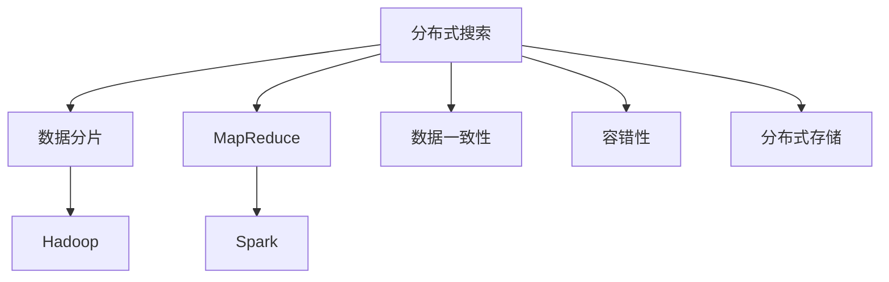
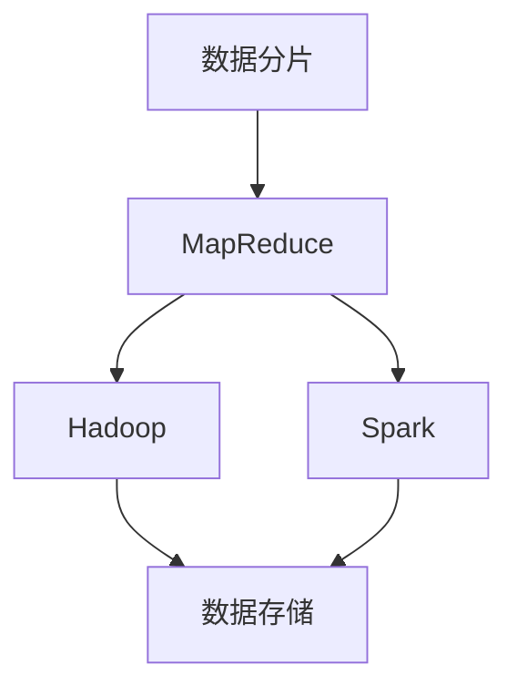
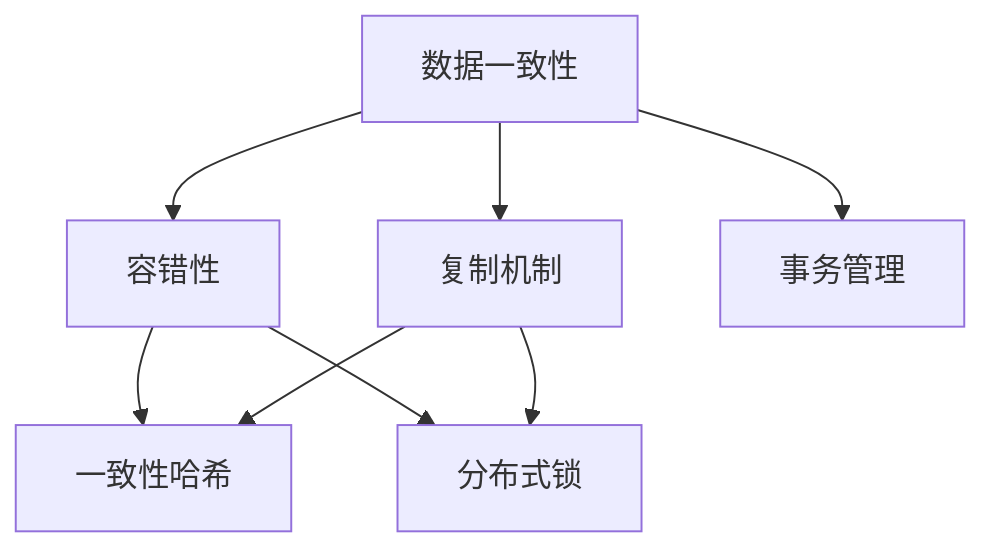
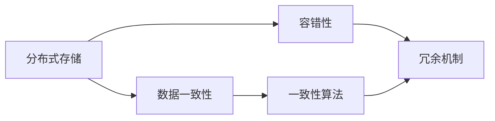

                 

# 【AI大数据计算原理与代码实例讲解】分布式搜索

> 关键词：分布式搜索, 数据分片, MapReduce, Hadoop, Spark, 数据一致性, 容错性, 分布式存储

## 1. 背景介绍

### 1.1 问题由来

在大数据时代，数据量呈爆炸式增长，单台计算机处理能力有限，无法满足需求。分布式搜索技术应运而生，通过多台计算机协同工作，实现海量数据的快速查询和处理。

分布式搜索的核心思想是将大规模数据分成若干个小片段，每台计算机负责处理其中一个小片段，然后将结果合并，完成全局查询。

分布式搜索技术的优势在于，能够充分利用多台计算机的计算资源，处理大规模数据。但同时也面临诸多挑战，如数据一致性、容错性、分布式存储等问题。

## 2. 核心概念与联系

### 2.1 核心概念概述

- 分布式搜索（Distributed Search）：在大规模数据上，利用多台计算机协同工作，实现快速查询和处理。
- 数据分片（Data Sharding）：将大规模数据分成若干个小片段，每台计算机负责处理其中一个小片段。
- MapReduce：一种分布式计算模型，由两个阶段组成，Map阶段负责数据分片，Reduce阶段负责结果合并。
- Hadoop：一种开源分布式计算框架，提供数据存储、计算和管理系统。
- Spark：一种快速高效的分布式计算框架，支持内存计算，比Hadoop更快。
- 数据一致性（Data Consistency）：分布式系统中，确保所有节点上的数据保持一致。
- 容错性（Fault Tolerance）：分布式系统中，即使某台计算机出现故障，仍能正常运行。
- 分布式存储（Distributed Storage）：将大规模数据存储在多台计算机中，实现高可用性。

这些核心概念之间的逻辑关系可以通过以下Mermaid流程图来展示：



这个流程图展示了大规模数据分布式搜索的核心概念及其之间的关系：

1. 分布式搜索利用数据分片、MapReduce、Hadoop和Spark等技术，实现大规模数据的快速查询和处理。
2. 数据一致性、容错性和分布式存储是分布式搜索系统中的关键技术，确保系统稳定可靠。

### 2.2 概念间的关系

这些核心概念之间存在着紧密的联系，形成了分布式搜索系统的完整生态系统。下面我们通过几个Mermaid流程图来展示这些概念之间的关系。

#### 2.2.1 分布式搜索的核心组成



这个流程图展示了分布式搜索系统的核心组成，包括数据分片、MapReduce、Hadoop和Spark等技术，用于实现大规模数据的快速查询和处理。

#### 2.2.2 数据一致性和容错性的关系



这个流程图展示了数据一致性和容错性之间的关系，通过复制机制和事务管理，确保数据一致性，并通过一致性哈希和分布式锁等技术，实现容错性。

#### 2.2.3 分布式存储和一致性、容错性的关系



这个流程图展示了分布式存储和数据一致性、容错性之间的关系，通过一致性算法和冗余机制，实现数据一致性和容错性。

## 3. 核心算法原理 & 具体操作步骤

### 3.1 算法原理概述

分布式搜索的核心算法是MapReduce，它由两个阶段组成：Map阶段和Reduce阶段。

- Map阶段：将大规模数据分成若干个小片段，每台计算机负责处理其中一个小片段，将处理结果输出。
- Reduce阶段：将Map阶段的输出结果合并，完成全局查询。

分布式搜索的关键在于如何高效地处理Map和Reduce阶段的计算任务，以及如何保证数据一致性和容错性。

### 3.2 算法步骤详解

**Step 1: 数据分片**

数据分片是将大规模数据分成若干个小片段的过程。数据分片需要考虑以下几个关键因素：

1. 分片大小：应根据数据量的大小和计算机的处理能力，合理设置分片大小。
2. 数据分布：应尽量使数据在各个分片之间分布均匀，避免数据不均衡导致的性能问题。
3. 分片策略：应根据数据类型和查询模式，选择适合的分片策略。

**Step 2: Map阶段计算**

Map阶段计算是将数据分片处理成中间结果的过程。Map阶段需要考虑以下几个关键因素：

1. 并发度：应尽量提高Map任务的并发度，充分利用多台计算机的计算资源。
2. 中间结果：应将Map阶段的输出结果存储到临时文件中，以便Reduce阶段计算。
3. 网络通信：应尽量减少Map和Reduce阶段之间的网络通信，降低网络延迟和带宽消耗。

**Step 3: Reduce阶段计算**

Reduce阶段计算是将Map阶段的中间结果合并成最终结果的过程。Reduce阶段需要考虑以下几个关键因素：

1. 合并策略：应选择高效的合并策略，降低合并时间和空间消耗。
2. 数据一致性：应确保Reduce阶段的输出结果和Map阶段的中间结果一致。
3. 容错性：应设计容错机制，防止单台计算机故障导致的系统崩溃。

### 3.3 算法优缺点

分布式搜索技术具有以下优点：

1. 高效性：通过多台计算机协同工作，能够快速处理大规模数据。
2. 可扩展性：可以动态扩展计算机数量，适应数据量的增长。
3. 容错性：单台计算机故障，系统仍能正常运行。

但分布式搜索技术也存在一些缺点：

1. 复杂性：分布式搜索系统设计复杂，需要考虑数据一致性、容错性等诸多问题。
2. 资源消耗：多台计算机协同工作，需要消耗大量计算资源。
3. 延迟：Map和Reduce阶段之间存在网络通信，导致一定的延迟。

### 3.4 算法应用领域

分布式搜索技术广泛应用于各种大规模数据处理场景，例如：

- 搜索引擎：例如Google、Bing等搜索引擎，通过分布式搜索技术，实现大规模网页数据的快速查询和检索。
- 数据分析：例如Hadoop生态系统，通过分布式搜索技术，实现大规模数据的高效分析和统计。
- 金融交易：例如股票交易系统，通过分布式搜索技术，实现海量交易数据的快速查询和处理。
- 社交网络：例如Twitter、Facebook等社交网络平台，通过分布式搜索技术，实现用户数据的快速查询和分析。

## 4. 数学模型和公式 & 详细讲解 & 举例说明

### 4.1 数学模型构建

假设大规模数据集为$D$，分布式系统中有$n$台计算机，每台计算机负责处理数据集的一个分片。分布式搜索的数学模型可以表示为：

$$
M = \{M_i\}_{i=1}^n
$$

其中$M_i$表示第$i$台计算机的Map阶段计算结果。

假设Map阶段的输出结果为$R$，则Reduce阶段的计算结果为：

$$
R = \bigcup_{i=1}^n R_i
$$

其中$R_i$表示第$i$台计算机的Reduce阶段计算结果。

### 4.2 公式推导过程

Map阶段的输出结果可以表示为：

$$
R_i = \bigcup_{j=1}^m M_{i,j}
$$

其中$m$表示第$i$台计算机的分片数量，$M_{i,j}$表示第$i$台计算机处理的第$j$个分片的Map阶段计算结果。

Reduce阶段的计算结果可以表示为：

$$
R = \bigcup_{i=1}^n \bigcup_{j=1}^m R_{i,j}
$$

其中$R_{i,j}$表示第$i$台计算机处理的第$j$个分片的Reduce阶段计算结果。

### 4.3 案例分析与讲解

以Google的MapReduce框架为例，介绍Map和Reduce阶段的计算过程。

假设Google有1000台计算机，每个分片大小为1TB，Google将大规模数据集$D$分成1000个分片，每台计算机负责处理一个分片。Map阶段计算时，每台计算机将分片中的数据进行扫描和处理，输出中间结果$M_i$。Reduce阶段计算时，Google将每台计算机的输出结果$R_i$合并，输出最终结果$R$。

假设$D$中有$N$个查询，每个查询需要处理$k$个分片，Map阶段计算时间为$t_{map}$，Reduce阶段计算时间为$t_{reduce}$，网络通信时间为$t_{net}$，则Google的MapReduce框架的计算时间可以表示为：

$$
T = n \times t_{map} + n \times m \times t_{net} + n \times t_{reduce}
$$

其中$n$表示计算机数量，$m$表示每个计算机的分片数量。

## 5. 项目实践：代码实例和详细解释说明

### 5.1 开发环境搭建

在进行分布式搜索实践前，我们需要准备好开发环境。以下是使用Python进行Hadoop开发的环境配置流程：

1. 安装Anaconda：从官网下载并安装Anaconda，用于创建独立的Python环境。

2. 创建并激活虚拟环境：
```bash
conda create -n pyhadoop-env python=3.8 
conda activate pyhadoop-env
```

3. 安装Hadoop：从官网下载安装包，并进行安装。例如：
```bash
cd hadoop-3.2.1
bin/hadoop-version
```

4. 安装Python Hadoop API：
```bash
pip install hadoopfs
```

5. 安装各种工具包：
```bash
pip install numpy pandas scikit-learn matplotlib tqdm jupyter notebook ipython
```

完成上述步骤后，即可在`pyhadoop-env`环境中开始分布式搜索实践。

### 5.2 源代码详细实现

下面我们以数据分片为例，给出使用Python Hadoop API进行数据分片的代码实现。

首先，定义数据分片函数：

```python
from hadoopfs import Hdfs

def shard_data(input_path, output_path, shard_size):
    fs = Hdfs()
    input_files = fs.ls(input_path)
    
    num_shards = len(input_files) // shard_size
    if len(input_files) % shard_size != 0:
        num_shards += 1
    
    for i in range(num_shards):
        shard_path = output_path + '/shard_' + str(i)
        shard_input_files = input_files[i*shard_size:(i+1)*shard_size]
        
        for shard_input_file in shard_input_files:
            input_data = fs.read_file(shard_input_file)
            output_data = input_data[:shard_size]
            fs.write_file(shard_path, output_data)
```

然后，在Hadoop集群上启动MapReduce任务：

```bash
bin/hadoop jar your-job.jar your-class MainClass
```

其中`your-job.jar`为你的Hadoop job jar包，`your-class`为MapReduce任务入口类，`MainClass`为Main函数。

### 5.3 代码解读与分析

让我们再详细解读一下关键代码的实现细节：

**shard_data函数**：
- `input_path`和`output_path`分别表示输入路径和输出路径。
- `shard_size`表示分片大小。
- 首先获取输入路径下的所有文件，并计算出分片数量。
- 循环遍历所有分片，将每个分片的数据读入内存，并将其分成多个分片，写入到输出路径下的各个分片中。

**MapReduce任务**：
- `your-job.jar`是你的Hadoop job jar包。
- `your-class`是你的MapReduce任务入口类。
- `MainClass`为Main函数，在Main函数中启动Map和Reduce任务。

### 5.4 运行结果展示

假设我们在Hadoop集群上运行数据分片任务，最终在输出路径下得到了分片后的文件，每个文件大小约为1TB。

通过数据分片技术，我们可以将大规模数据分成多个小片段，每台计算机负责处理其中一个片段。这种分布式计算方式可以显著提高数据的处理速度和效率，适用于各种大规模数据处理场景。

## 6. 实际应用场景

### 6.1 搜索引擎

Google搜索引擎就是利用分布式搜索技术，实现大规模网页数据的快速查询和检索。Google的MapReduce框架处理大规模网页索引，通过分布式搜索技术，快速响应用户的查询请求。

### 6.2 数据分析

Hadoop生态系统利用分布式搜索技术，实现大规模数据的高效分析和统计。Hadoop将大规模数据存储在HDFS中，通过MapReduce框架进行分布式计算，实现高效的数据分析。

### 6.3 金融交易

股票交易系统利用分布式搜索技术，实现海量交易数据的快速查询和处理。股票交易系统将大规模交易数据存储在分布式数据库中，通过MapReduce框架进行分布式计算，实现高效的交易数据分析和处理。

### 6.4 社交网络

Twitter、Facebook等社交网络平台利用分布式搜索技术，实现用户数据的快速查询和分析。社交网络平台将大规模用户数据存储在分布式数据库中，通过MapReduce框架进行分布式计算，实现高效的用户数据分析和处理。

## 7. 工具和资源推荐

### 7.1 学习资源推荐

为了帮助开发者系统掌握分布式搜索的理论基础和实践技巧，这里推荐一些优质的学习资源：

1. 《Hadoop: The Definitive Guide》书籍：Hadoop官方指南，全面介绍了Hadoop架构、安装、配置、使用等方面的知识，是学习Hadoop的最佳入门读物。
2. 《MapReduce in Practice》书籍：MapReduce实战指南，详细介绍了MapReduce的原理、使用技巧和最佳实践，适合进阶学习。
3. 《Spark: The Definitive Guide》书籍：Spark官方指南，全面介绍了Spark架构、安装、配置、使用等方面的知识，是学习Spark的最佳入门读物。
4. CS446《分布式系统》课程：斯坦福大学开设的分布式系统课程，涵盖了分布式计算、MapReduce、Hadoop等核心内容，是学习分布式系统的经典教材。
5. 《Kubernetes: Up and Running》书籍：Kubernetes实战指南，详细介绍了Kubernetes的安装、配置、使用等方面的知识，适合学习分布式系统的运维管理。

通过对这些资源的学习实践，相信你一定能够快速掌握分布式搜索的精髓，并用于解决实际的NLP问题。

### 7.2 开发工具推荐

高效的开发离不开优秀的工具支持。以下是几款用于分布式搜索开发的常用工具：

1. Hadoop：一种开源分布式计算框架，提供数据存储、计算和管理系统。
2. Spark：一种快速高效的分布式计算框架，支持内存计算，比Hadoop更快。
3. HDFS：Hadoop分布式文件系统，用于存储大规模数据。
4. MapReduce：一种分布式计算模型，由两个阶段组成，Map阶段负责数据分片，Reduce阶段负责结果合并。
5. PySpark：Python语言API，提供简单易用的接口，方便使用Spark进行分布式计算。
6. Hive：一种基于Hadoop的数据仓库，提供SQL语言，方便进行大规模数据查询和分析。
7. Pig：一种基于Hadoop的数据流语言，提供类SQL的语法，方便进行大规模数据处理。

合理利用这些工具，可以显著提升分布式搜索任务的开发效率，加快创新迭代的步伐。

### 7.3 相关论文推荐

分布式搜索技术的发展源于学界的持续研究。以下是几篇奠基性的相关论文，推荐阅读：

1. MapReduce: Simplified Data Processing on Large Clusters（MapReduce原论文）：提出了MapReduce模型，推动了大规模数据处理的分布式计算范式。
2. Hadoop: A Distributed File System（HDFS原论文）：介绍了HDFS架构和实现原理，推动了分布式存储技术的发展。
3. Resilient Distributed Datasets: A Fault-Tolerant Abstraction for In-Memory Cluster Computing（Spark原论文）：提出了Spark架构和实现原理，推动了分布式计算技术的进步。
4. CAP Theorem：阐述了分布式系统的一致性、可用性和分区容错性之间的权衡，是分布式系统设计的经典理论。
5. Consensus in Fault-Tolerant Distributed Systems（Paxos算法论文）：介绍了Paxos算法，一种高可用性分布式一致性协议，推动了分布式系统一致性技术的进步。

这些论文代表了大规模数据处理和分布式搜索技术的发展脉络。通过学习这些前沿成果，可以帮助研究者把握学科前进方向，激发更多的创新灵感。

除上述资源外，还有一些值得关注的前沿资源，帮助开发者紧跟分布式搜索技术的最新进展，例如：

1. arXiv论文预印本：人工智能领域最新研究成果的发布平台，包括大量尚未发表的前沿工作，学习前沿技术的必读资源。
2. 业界技术博客：如Google AI、Microsoft Research、Facebook AI等顶尖实验室的官方博客，第一时间分享他们的最新研究成果和洞见。
3. 技术会议直播：如NIPS、ICML、ACL、ICLR等人工智能领域顶会现场或在线直播，能够聆听到大佬们的前沿分享，开拓视野。
4. GitHub热门项目：在GitHub上Star、Fork数最多的分布式搜索相关项目，往往代表了该技术领域的发展趋势和最佳实践，值得去学习和贡献。
5. 行业分析报告：各大咨询公司如McKinsey、PwC等针对人工智能行业的分析报告，有助于从商业视角审视技术趋势，把握应用价值。

总之，对于分布式搜索技术的学习和实践，需要开发者保持开放的心态和持续学习的意愿。多关注前沿资讯，多动手实践，多思考总结，必将收获满满的成长收益。

## 8. 总结：未来发展趋势与挑战

### 8.1 总结

本文对分布式搜索技术进行了全面系统的介绍。首先阐述了分布式搜索技术的背景和意义，明确了MapReduce、Hadoop和Spark等关键技术的重要性。其次，从原理到实践，详细讲解了MapReduce算法的计算过程和关键优化策略，给出了分布式搜索任务开发的完整代码实例。同时，本文还广泛探讨了分布式搜索技术在搜索引擎、数据分析、金融交易和社交网络等各个领域的应用前景，展示了分布式搜索技术的巨大潜力。

通过本文的系统梳理，可以看到，分布式搜索技术在大数据处理领域的应用前景广阔，可以显著提升大规模数据的处理速度和效率。未来，伴随分布式搜索技术的不断演进，相信其将在更多领域得到应用，为大数据处理和智能计算带来新的突破。

### 8.2 未来发展趋势

展望未来，分布式搜索技术将呈现以下几个发展趋势：

1. 容器化部署：分布式搜索系统将越来越多地采用容器化技术，如Docker、Kubernetes等，实现系统的高可用性和可扩展性。
2. 大数据分析：分布式搜索技术将进一步与大数据分析技术融合，实现更加智能化的数据处理和分析。
3. 实时计算：分布式搜索技术将越来越多地应用于实时计算场景，如流数据处理、实时推荐等，提升系统的响应速度和性能。
4. 混合云架构：分布式搜索系统将越来越多地采用混合云架构，实现跨云平台的资源优化和任务调度。
5. 数据湖和数据仓库：分布式搜索技术将越来越多地应用于数据湖和数据仓库系统，实现数据的高效存储和处理。

以上趋势凸显了分布式搜索技术的广阔前景。这些方向的探索发展，必将进一步提升分布式搜索系统的性能和应用范围，为大数据处理和智能计算带来新的突破。

### 8.3 面临的挑战

尽管分布式搜索技术已经取得了瞩目成就，但在迈向更加智能化、普适化应用的过程中，它仍面临着诸多挑战：

1. 数据一致性瓶颈：大规模数据存储和处理过程中，数据一致性难以保证，容易导致数据丢失或重复。
2. 系统复杂性高：分布式搜索系统设计复杂，需要考虑数据一致性、容错性、分布式存储等问题。
3. 资源消耗大：多台计算机协同工作，需要消耗大量计算资源，硬件资源优化有待加强。
4. 延迟问题：Map和Reduce阶段之间存在网络通信，导致一定的延迟，影响系统的响应速度。
5. 安全性和隐私保护：大规模数据存储和处理过程中，数据安全和隐私保护需要重视。

### 8.4 研究展望

面对分布式搜索面临的种种挑战，未来的研究需要在以下几个方面寻求新的突破：

1. 探索高效的分布式存储和数据一致性算法：研究高效的数据分片和分布式存储算法，保证数据一致性。
2. 优化Map和Reduce阶段的计算过程：设计高效的Map和Reduce算法，降低计算延迟和带宽消耗。
3. 引入机器学习技术：引入机器学习技术，优化数据分片和任务调度，提升系统的性能和效率。
4. 应用区块链技术：引入区块链技术，保障数据安全和隐私保护，提升系统的安全性。
5. 研究混合云架构：研究混合云架构，实现跨云平台的资源优化和任务调度，提升系统的可扩展性。

这些研究方向的探索，必将引领分布式搜索技术迈向更高的台阶，为大数据处理和智能计算带来新的突破。只有勇于创新、敢于突破，才能不断拓展分布式搜索系统的边界，让大数据处理和智能计算更好地服务于各个行业。

## 9. 附录：常见问题与解答

**Q1：分布式搜索是否适用于所有大规模数据处理场景？**

A: 分布式搜索技术适用于各种大规模数据处理场景，但需要根据具体场景进行优化设计。例如，在金融交易、搜索引擎等对延迟要求较高的场景，需要设计高效的Map和Reduce算法，保证系统的响应速度。

**Q2：如何优化Map和Reduce阶段的计算过程？**

A: 优化Map和Reduce阶段的计算过程需要考虑以下几个关键因素：

1. 数据分片：应尽量将数据分片均衡分布，避免数据不均衡导致的性能问题。
2. 中间结果存储：应将Map阶段的输出结果存储到临时文件中，以便Reduce阶段计算。
3. 网络通信优化：应尽量减少Map和Reduce阶段之间的网络通信，降低网络延迟和带宽消耗。

**Q3：如何实现分布式存储和数据一致性？**

A: 实现分布式存储和数据一致性需要考虑以下几个关键因素：

1. 冗余机制：应设计冗余机制，保证数据的可靠性。
2. 一致性算法：应选择高效的一致性算法，确保所有节点上的数据保持一致。
3. 分布式锁：应使用分布式锁，防止数据冲突和重复。

**Q4：分布式搜索系统的安全性如何保障？**

A: 分布式搜索系统的安全性需要考虑以下几个关键因素：

1. 数据加密：应使用数据加密技术，保护数据的机密性。
2. 访问控制：应使用访问控制技术，限制对数据的访问权限。
3. 审计机制：应使用审计机制，记录和监控数据访问和操作。

这些技术手段可以保障分布式搜索系统的安全性，避免数据泄露和滥用。

