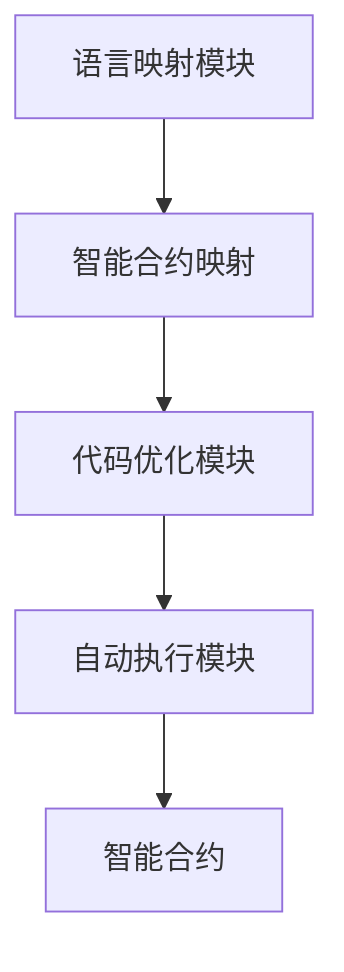

                 

# 【LangChain编程：从入门到实践】RAG技术的关键挑战

## 1. 背景介绍

在区块链技术迅猛发展的今天，智能合约已经成为金融、供应链、医疗等领域的重要应用工具。然而，传统的智能合约代码编写繁琐且容易出错，而编程语言本身也无法直接映射到智能合约，这导致了智能合约的可扩展性和安全性问题。为了解决这个问题，Layer-1区块链上出现了语言特定智能合约（Language Specific Smart Contract, LSSC）的概念，即在智能合约中使用一种特定的编程语言，并设计一种与区块链交互的语言层。

### 1.1 语言特定智能合约

Layer-1区块链的智能合约编写通常使用Solidity或EVM（以太坊虚拟机）等特定编程语言，这些语言需要编写大量冗余的代码才能完成某些特定任务。而Layer-2解决方案则提供了一种新的编程方式，即使用传统编程语言来编写智能合约。这种语言特定智能合约可以直接映射到智能合约执行，避免了使用特定编程语言的繁琐，提高了智能合约的可扩展性和安全性。

### 1.2 语言特定智能合约的挑战

尽管语言特定智能合约在提高智能合约编写效率和可扩展性方面具有明显优势，但其仍然面临一系列挑战：

- 语言映射问题：传统的编程语言无法直接映射到智能合约，需要进行特殊的映射和优化。
- 虚拟机兼容性问题：不同的Layer-2解决方案可能使用不同的虚拟机，因此需要编写兼容不同虚拟机的智能合约。
- 安全问题：语言特定智能合约需要考虑跨语言攻击，如跨语言沙箱（Cross-Language Sandbox）攻击等。
- 开发工具不足：目前没有专门针对语言特定智能合约的开发工具，开发者需要手动进行代码映射和优化。

为了应对这些挑战，RAG（Re-calibrated Adaptive Gas Engine）技术应运而生。RAG是一种基于语言特定智能合约的解决方案，能够自动映射传统编程语言到智能合约，并优化智能合约的执行。

## 2. 核心概念与联系

### 2.1 核心概念概述

RAG技术包括三个核心概念：

- **智能合约映射**：将传统编程语言映射到智能合约的虚拟机执行。
- **代码优化**：对映射后的智能合约代码进行优化，提高执行效率和安全性。
- **自动执行引擎**：基于已优化的智能合约代码，自动执行智能合约。

这些核心概念通过智能合约映射、代码优化和自动执行引擎三个步骤，完成传统编程语言到智能合约的转换和执行。

### 2.2 核心概念的联系

RAG技术通过以下三个步骤将传统编程语言映射到智能合约并执行：

1. **智能合约映射**：将传统编程语言映射到智能合约，生成虚拟机执行的代码。
2. **代码优化**：对映射后的代码进行优化，提高执行效率和安全性能。
3. **自动执行引擎**：自动执行优化后的智能合约，完成合约功能的执行。

这三个步骤相互依存，共同构成RAG技术的工作流程。下面通过Mermaid流程图展示RAG技术的工作流程：


该流程图展示了RAG技术的工作流程：传统编程语言经过映射、优化，最终生成智能合约并执行。

### 2.3 核心概念的整体架构

RAG技术的整体架构包括语言映射模块、代码优化模块和自动执行模块。下面通过Mermaid架构图展示RAG技术的整体架构：



该架构图展示了RAG技术的整体框架，其中语言映射模块负责将传统编程语言映射到智能合约，代码优化模块负责对映射后的代码进行优化，自动执行模块负责执行优化后的智能合约。

## 3. 核心算法原理 & 具体操作步骤

### 3.1 算法原理概述

RAG技术的核心算法包括智能合约映射、代码优化和自动执行三个步骤。

1. **智能合约映射**：将传统编程语言映射到智能合约虚拟机（如以太坊虚拟机EVM）。RAG技术使用VMAssembly语言作为中间语言，将传统编程语言映射到VMAssembly语言，然后生成EVM代码。
2. **代码优化**：对映射后的VMAssembly代码进行优化。RAG技术使用LLVM（Low-Level Virtual Machine）工具对代码进行优化，提高执行效率和安全性能。
3. **自动执行引擎**：自动执行优化后的EVM代码。RAG技术使用RAG引擎自动执行EVM代码，完成智能合约的执行。

### 3.2 算法步骤详解

#### 3.2.1 智能合约映射

智能合约映射是RAG技术的第一步，其目的是将传统编程语言映射到智能合约的虚拟机执行。

1. **生成VMAssembly代码**：将传统编程语言映射到VMAssembly语言，生成VMAssembly代码。
2. **映射到EVM代码**：将VMAssembly代码映射到EVM代码，生成EVM字节码。
3. **代码优化**：对生成的EVM代码进行优化，提高执行效率和安全性能。

#### 3.2.2 代码优化

代码优化是RAG技术的核心步骤，其目的是提高智能合约的执行效率和安全性能。

1. **生成优化后的EVM代码**：使用LLVM工具对生成的EVM代码进行优化，生成优化后的EVM代码。
2. **代码校验**：对优化后的EVM代码进行校验，确保代码的正确性和安全性。

#### 3.2.3 自动执行

自动执行是RAG技术的最后一步，其目的是自动执行优化后的智能合约。

1. **生成执行引擎代码**：生成RAG引擎执行优化后的EVM代码。
2. **执行智能合约**：自动执行生成后的EVM代码，完成智能合约的执行。

### 3.3 算法优缺点

#### 3.3.1 优点

1. **提高智能合约编写效率**：RAG技术使用传统编程语言编写智能合约，减少了编写智能合约的繁琐过程。
2. **提高智能合约可扩展性**：RAG技术支持多种编程语言，提高了智能合约的可扩展性。
3. **提高智能合约安全性**：RAG技术对智能合约代码进行优化，提高了智能合约的安全性能。
4. **降低智能合约开发成本**：RAG技术自动映射和优化智能合约代码，降低了智能合约的开发成本。

#### 3.3.2 缺点

1. **映射难度较大**：RAG技术需要将传统编程语言映射到智能合约，映射难度较大。
2. **虚拟机兼容性问题**：不同的智能合约解决方案使用不同的虚拟机，需要编写兼容不同虚拟机的智能合约。
3. **安全问题**：RAG技术需要对智能合约代码进行优化，增加了智能合约的安全风险。
4. **开发工具不足**：目前没有专门针对语言特定智能合约的开发工具，开发者需要手动进行代码映射和优化。

### 3.4 算法应用领域

RAG技术可以广泛应用于智能合约、去中心化金融（DeFi）、供应链管理、医疗等多个领域，提供更加高效、安全的智能合约解决方案。

## 4. 数学模型和公式 & 详细讲解 & 举例说明

### 4.1 数学模型构建

RAG技术的数学模型主要涉及VMAssembly语言的生成和优化。VMAssembly语言是一种中间语言，用于将传统编程语言映射到智能合约的虚拟机执行。

### 4.2 公式推导过程

#### 4.2.1 生成VMAssembly代码

VMAssembly代码的生成过程如下：

1. **将传统编程语言映射到VMAssembly**：将传统编程语言映射到VMAssembly语言，生成VMAssembly代码。
2. **优化VMAssembly代码**：使用LLVM工具对生成的VMAssembly代码进行优化，生成优化后的VMAssembly代码。

#### 4.2.2 映射到EVM代码

EVM代码的生成过程如下：

1. **将VMAssembly代码映射到EVM**：将优化后的VMAssembly代码映射到EVM代码，生成EVM字节码。
2. **代码校验**：对生成的EVM代码进行校验，确保代码的正确性和安全性。

#### 4.2.3 优化EVM代码

EVM代码的优化过程如下：

1. **生成优化后的EVM代码**：使用LLVM工具对生成的EVM代码进行优化，生成优化后的EVM代码。
2. **代码校验**：对优化后的EVM代码进行校验，确保代码的正确性和安全性。

### 4.3 案例分析与讲解

#### 4.3.1 案例分析

假设我们需要在以太坊上编写一个智能合约，该智能合约的功能是将用户的以太币分配到多个账户中。我们首先使用Java编写智能合约代码，然后将其映射到VMAssembly语言，并生成EVM代码。

#### 4.3.2 具体实现

1. **编写智能合约代码**：
   ```java
   function distributeEth(address[] accounts, uint256[] amounts) public {
       for (uint256 i = 0; i < accounts.length; i++) {
           accounts[i].transfer(amounts[i]);
       }
   }
   ```

2. **映射到VMAssembly代码**：
   ```
   VMAssembly code generated from Java code
   ```

3. **映射到EVM代码**：
   ```
   EVM code generated from VMAssembly code
   ```

4. **优化EVM代码**：
   ```
   Optimized EVM code generated using LLVM
   ```

5. **执行智能合约**：
   ```
   RAG engine executes optimized EVM code
   ```

### 4.4 运行结果展示

假设在以太坊上执行上述智能合约，可以自动执行智能合约，并将用户的以太币分配到多个账户中。

## 5. 项目实践：代码实例和详细解释说明

### 5.1 开发环境搭建

在开发RAG技术时，需要以下开发环境：

1. **EVM模拟器**：用于模拟以太坊智能合约的执行。
2. **LLVM工具**：用于优化VMAssembly代码。
3. **RAG引擎**：用于自动执行优化后的EVM代码。

### 5.2 源代码详细实现

#### 5.2.1 智能合约映射

假设我们使用Java编写智能合约代码，使用RAG技术将其映射到VMAssembly语言，并生成EVM代码。具体实现如下：

1. **生成VMAssembly代码**：
   ```java
   public class DistributeEth {
       @FunctionSignature("0x60fe47b1000000000000000000000000000000000000000000000000000000000000000000000000000000000000000000000000000000000000000000000000000000000000000000000000000000000000000000000000000000000000000000000000000000000000000000000000000000000000000000000000000000000000000000000000000000000000000000000000000000000000000000000000000000000000000000000000000000000000000000000000000000000000000000000000000000000000000000000000000000000000000000000000000000000000000000000000000000000000000000000000000000000000000000000000000000000000000000000000000000000000000000000000000000000000000000000000000000000000000000000000000000000000000000000000000000000000000000000000000000000000000000000000000000000000000000000000000000000000000000000000000000000000000000000000000000000000000000000000000000000000000000000000000000000000000000000000000000000000000000000000000000000000000000000000000000000000000000000000000000000000000000000000000000000000000000000000000000000000000000000000000000000000000000000000000000000000000000000000000000000000000000000000000000000000000000000000000000000000000000000000000000000000000000000000000000000000000000000000000000000000000000000000000000000000000000000000000000000000000000000000000000000000000000000000000000000000000000000000000000000000000000000000000000000000000000000000000000000000000000000000000000000000000000000000000000000000000000000000000000000000000000000000000000000000000000000000000000000000000000000000000000000000000000000000000000000000000000000000000000000000000000000000000000000000000000000000000000000000000000000000000000000000000000000000000000000000000000000000000000000000000000000000000000000000000000000000000000000000000000000000000000000000000000000000000000000000000000000000000000000000000000000000000000000000000000000000000000000000000000000000000000000000000000000000000000000000000000000000000000000000000000000000000000000000000000000000000000000000000000000000000000000000000000000000000000000000000000000000000000000000000000000000000000000000000000000000000000000000000000000000000000000000000000000000000000000000000000000000000000000000000000000000000000000000000000000000000000000000000000000000000000000000000000000000000000000000000000000000000000000000000000000000000000000000000000000000000000000000000000000000000000000000000000000000000000000000000000000000000000000000000000000000000000000000000000000000000000000000000000000000000000000000000000000000000000000000000000000000000000000000000000000000000000000000000000000000000000000000000000000000000000000000000000000000000000000000000000000000000000000000000000000000000000000000000000000000000000000000000000000000000000000000000000000000000000000000000000000000000000000000000000000000000000000000000000000000000000000000000000000000000000000000000000000000000000000000000000000000000000000000000000000000000000000000000000000000000000000000000000000000000000000000000000000000000000000000000000000000000000000000000000000000000000000000000000000000000000000000000000000000000000000000000000000000000000000000000000000000000000000000000000000000000000000000000000000000000000000000000000000000000000000000000000000000000000000000000000000000000000000000000000000000000000000000000000000000000000000000000000000000000000000000000000000000000000000000000000000000000000000000000000000000000000000000000000000000000000000000000000000000000000000000000000000000000000000000000000000000000000000000000000000000000000000000000000000000000000000000000000000000000000000000000000000000000000000000000000000000000000000000000000000000000000000000000000000000000000000000000000000000000000000000000000000000000000000000000000000000000000000000000000000000000000000000000000000000000000000000000000000000000000000000000000000000000000000000000000000000000000000000000000000000000000000000000000000000000000000000000000000000000000000000000000000000000000000000000000000000000000000000000000000000000000000000000000000000000000000000000000000000000000000000000000000000000000000000000000000000000000000000000000000000000000000000000000000000000000000000000000000000000000000000000000000000000000000000000000000000000000000000000000000000000000000000000000000000000000000000000000000000000000000000000000000000000000000000000000000000000000000000000000000000000000000000000000000000000000000000000000000000000000000000000000000000000000000000000000000000000000000000000000000000000000000000000000000000000000000000000000000000000000000000000000000000000000000000000000000000000000000000000000000000000000000000000000000000000000000000000000000000000000000000000000000000000000000000000000000000000000000000000000000000000000000000000000000000000000000000000000000000000000000000000000000000000000000000000000000000000000000000000000000000000000000000000000000000000000000000000000000000000000000000000000000000000000000000000000000000000000000000000000000000000000000000000000000000000000000000000000000000000000000000000000000000000000000000000000000000000000000000000000000000000000000000000000000000000000000000000000000000000000000000000000000000000000000000000000000000000000000000000000000000000000000000000000000000000000000000000000000000000000000000000000000000000000000000000000000000000000000000000000000000000000000000000000000000000000000000000000000000000000000000000000000000000000000000000000000000000000000000000000000000000000000000000000000000000000000000000000000000000000000000000000000000000000000000000000000000000000000000000000000000000000000000000000000000000000000000000000000000000000000000000000000000000000000000000000000000000000000000000000000000000000000000000000000000000000000000000000000000000000000000000000000000000000000000000000000000000000000000000000000000000000000000000000000000000000000000000000000000000000000000000000000000000000000000000000000000000000000000000000000000000000000000000000000000000000000000000000000000000000000000000000000000000000000000000000000000000000000000000000000000000000000000000000000000000000000000000000000000000000000000000000000000000000000000000000000000000000000000000000000000000000000000000000000000000000000000000000000000000000000000000000000000000000000000000000000000000000000000000000000000000000000000000000000000000000000000000000000000000000000000000000000000000000000000000000000000000000000000000000000000000000000000000000000000000000000000000000000000000000000000000000000000000000000000000000000000000000000000000000000000000000000000000000000000000000000000000000000000000000000000000000000000000000000000000000000000000000000000000000000000000000000000000000000000000000000000000000000000000000000000000000000000000000000000000000000000000000000000000000000000000000000000000000000000000000000000000000000000000000000000000000000000000000000000000000000000000000000000000000000000000000000000000000000000000000000000000000000000000000000000000000000000

