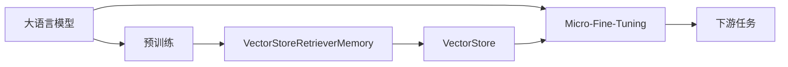
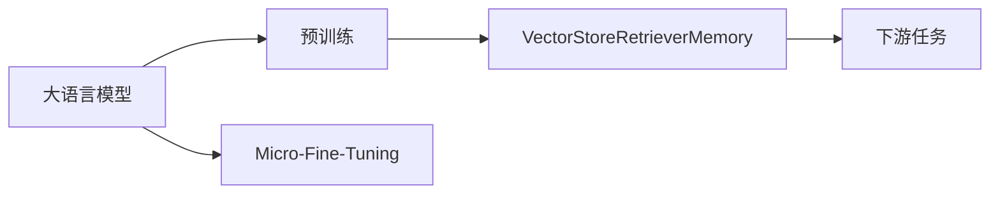
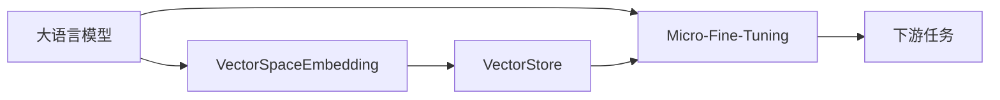
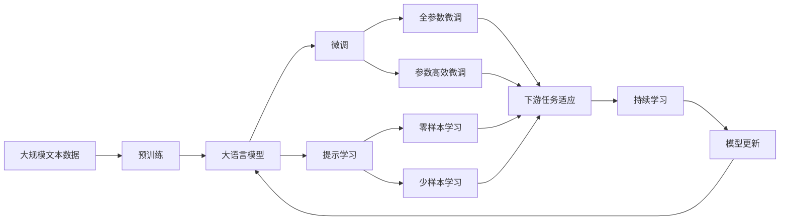

                 

# 【LangChain编程：从入门到实践】VectorStoreRetrieverMemory

## 1. 背景介绍

### 1.1 问题由来
在面向大模型的开发和应用中，如何构建高效的向量空间检索系统，以支持大模型在复杂、高维的语义空间中进行快速、准确的信息检索，成为了一个重要且极具挑战性的问题。传统的基于倒排索引、TF-IDF等方法的向量空间检索系统，往往难以处理大规模语义空间，且无法有效利用大模型的语义理解能力。因此，针对大语言模型的向量空间检索系统，亟需一种新型的、高性能的解决方案。

### 1.2 问题核心关键点
为了构建高效、准确的向量空间检索系统，本文聚焦于一种基于大模型和向量存储库的新型检索方法：VectorStoreRetrieverMemory。该方法的核心思想是将大模型的预训练权重编码成高维向量，存储在向量存储库中，并通过高效的向量空间检索算法，在大模型中进行快速定位和推理，实现高维语义空间中的信息检索。

该方法结合了语言模型和大规模向量存储库的优势，在充分利用大模型的语义理解能力的同时，通过高效、可扩展的向量检索技术，解决了传统方法在复杂、高维语义空间中的检索瓶颈，提供了全新的信息检索范式。

### 1.3 问题研究意义
构建高效的向量空间检索系统，对于促进大语言模型的广泛应用，提升其在自然语言处理、知识图谱、推荐系统等领域中的性能，具有重要意义：

1. **降低应用开发成本**：通过高效的向量检索方法，可以显著减少构建和维护大语言模型的开销，降低应用开发的难度和成本。
2. **提升模型效果**：利用向量检索技术的优势，可以在复杂语义空间中进行高精度的信息检索，提升模型的性能和准确度。
3. **增强模型灵活性**：通过结合不同领域的向量存储库，可以构建多样化的应用场景，使模型更具灵活性和适应性。
4. **推动技术创新**：向量检索技术的探索和应用，促进了大语言模型与其他领域的深度融合，催生了新的研究方向和应用模式。
5. **赋能产业升级**：高效的信息检索能力，为大语言模型在各行业中的应用提供了强有力的技术支持，推动了相关产业的数字化和智能化转型。

## 2. 核心概念与联系

### 2.1 核心概念概述

为了更好地理解VectorStoreRetrieverMemory方法，本节将介绍几个密切相关的核心概念：

- **大语言模型(Large Language Model, LLM)**：以自回归(如GPT)或自编码(如BERT)模型为代表的大规模预训练语言模型。通过在大规模无标签文本语料上进行预训练，学习通用的语言表示，具备强大的语言理解和生成能力。

- **预训练权重向量(Pre-training Weight Vector)**：将大模型的预训练权重编码成高维向量，用于存储在向量存储库中。

- **VectorStoreRetrieverMemory**：一种结合大模型和向量存储库的新型向量空间检索方法。通过在大模型中高效地定位和检索预训练权重向量，实现高维语义空间中的信息检索。

- **向量空间检索(Vector Space Retrieval)**：一种在大规模数据集中通过高维向量进行信息检索的技术。常见的向量空间检索算法包括余弦相似度、欧氏距离等。

- **向量存储库(Vector Store)**：一种用于高效存储和检索高维向量的数据结构。常见的向量存储库包括Faiss、Annoy、ElasticSearch等。

- **微调(Fine-Tuning)**：指在预训练模型的基础上，使用下游任务的少量标注数据，通过有监督地训练来优化模型在该任务上的性能。通常只需要调整顶层分类器或解码器，并以较小的学习率更新全部或部分的模型参数。

这些核心概念之间的逻辑关系可以通过以下Mermaid流程图来展示：



这个流程图展示了大语言模型、预训练权重向量、VectorStoreRetrieverMemory、向量存储库以及微调方法之间的联系：

1. 大语言模型通过预训练获得基础能力。
2. 将预训练权重编码成高维向量，存储在向量存储库中。
3. VectorStoreRetrieverMemory结合大模型和向量存储库，进行高效的向量检索。
4. 微调方法用于进一步优化大模型，提升其在特定任务上的性能。
5. 下游任务通过VectorStoreRetrieverMemory实现高效的向量检索。

通过理解这些核心概念，我们可以更好地把握VectorStoreRetrieverMemory方法的原理和应用方向。

### 2.2 概念间的关系

这些核心概念之间存在着紧密的联系，形成了VectorStoreRetrieverMemory方法的整体架构。下面我们通过几个Mermaid流程图来展示这些概念之间的关系。

#### 2.2.1 大语言模型的学习范式



这个流程图展示了大语言模型的预训练和微调过程，以及它们与VectorStoreRetrieverMemory方法的关系。

#### 2.2.2 VectorStoreRetrieverMemory的架构


这个流程图展示了VectorStoreRetrieverMemory方法的架构，包括将大模型编码为向量、存储到向量库、检索向量以及下游任务等步骤。

#### 2.2.3 微调的优化策略



这个流程图展示了微调过程对VectorStoreRetrieverMemory方法的影响，包括在大模型中优化微调策略，提升检索精度和效率。

### 2.3 核心概念的整体架构

最后，我们用一个综合的流程图来展示这些核心概念在大语言模型微调过程中的整体架构：



这个综合流程图展示了从预训练到微调，再到持续学习的完整过程。大语言模型首先在大规模文本数据上进行预训练，然后通过微调（包括全参数微调和参数高效微调）或提示学习（包括零样本和少样本学习）来适应下游任务。最后，通过持续学习技术，模型可以不断更新和适应新的任务和数据。 通过这些流程图，我们可以更清晰地理解VectorStoreRetrieverMemory方法在大语言模型微调过程中各个环节的关系和作用。

## 3. 核心算法原理 & 具体操作步骤

### 3.1 算法原理概述

VectorStoreRetrieverMemory方法的核心原理是将大模型的预训练权重编码成高维向量，存储在向量存储库中，并通过高效的向量空间检索算法，在大模型中进行快速定位和推理，实现高维语义空间中的信息检索。

具体而言，VectorStoreRetrieverMemory方法包括以下几个关键步骤：

1. **预训练权重向量编码**：将大模型的预训练权重编码成高维向量，存储在向量存储库中。

2. **高维向量检索**：在需要检索的语义空间中，高效地检索到与目标查询向量最相似的预训练权重向量。

3. **向量空间推理**：将检索到的预训练权重向量输入大模型，进行推理，得到最终的信息检索结果。

### 3.2 算法步骤详解

以下是VectorStoreRetrieverMemory方法的具体操作步骤：

**Step 1: 准备预训练模型和向量存储库**

- 选择合适的预训练语言模型 $M_{\theta}$ 作为初始化参数，如 BERT、GPT等。
- 准备向量存储库，选择合适的向量存储库，如Faiss、Annoy、ElasticSearch等。
- 编码预训练权重向量，将大模型的预训练权重 $W$ 编码为高维向量 $\vec{v} = \text{Encoder}(W)$，其中 $\text{Encoder}$ 为预训练权重向量的编码函数。

**Step 2: 存储预训练权重向量**

- 将编码得到的预训练权重向量 $\vec{v}$ 存储到向量存储库中，供后续检索使用。

**Step 3: 设计检索算法**

- 选择合适的向量空间检索算法，如余弦相似度、欧氏距离等。
- 设计检索算法，计算查询向量 $q$ 与存储向量库中所有向量的相似度，找到与 $q$ 最相似的 $n$ 个向量。

**Step 4: 在大模型中进行向量检索**

- 在需要检索的语义空间中，设计查询向量 $q$，可以是文本、图像、音频等形式的输入数据。
- 使用设计的检索算法，在大模型中检索到与 $q$ 最相似的 $n$ 个预训练权重向量。

**Step 5: 向量空间推理**

- 将检索到的预训练权重向量输入大模型，进行推理，得到最终的信息检索结果。

**Step 6: 持续学习与微调**

- 根据检索结果，在需要进一步优化的大模型上，进行微调，提高检索精度和效率。

### 3.3 算法优缺点

VectorStoreRetrieverMemory方法具有以下优点：

1. **高效检索**：利用向量空间检索技术，可以显著提高检索速度和精度，适用于大规模语义空间的检索。
2. **可扩展性强**：向量存储库和检索算法可以根据实际需求进行灵活选择和优化，具有较强的扩展性和适应性。
3. **充分利用大模型的语义能力**：将预训练权重向量存储在向量存储库中，可以充分利用大模型的语义理解能力，提升检索精度。

同时，该方法也存在一些缺点：

1. **存储成本高**：高维向量的存储需要大量的存储空间，可能对系统的资源消耗较大。
2. **检索算法复杂度**：选择高效的向量空间检索算法，需要一定的技术门槛和复杂度。
3. **微调成本高**：微调大模型以提高检索精度，需要大量的标注数据和计算资源。

尽管存在这些缺点，但总体而言，VectorStoreRetrieverMemory方法在语义空间检索方面的优势明显，具有重要的应用价值。

### 3.4 算法应用领域

VectorStoreRetrieverMemory方法主要应用于以下几个领域：

- **自然语言处理(NLP)**：在问答系统、文本摘要、机器翻译等任务中，通过高效的信息检索，提升模型的性能和准确度。
- **知识图谱(KG)**：在知识推理、实体链接等任务中，利用高维向量检索，进行实体的快速定位和关系抽取。
- **推荐系统(Recommendation System)**：在推荐物品、内容等任务中，通过高效的向量检索，提供个性化的推荐结果。
- **多模态信息检索(Multimodal Retrieval)**：在音频、图像、文本等多模态数据中，进行高维向量的编码和检索，实现多模态信息的协同检索。
- **智能客服系统(Customer Service)**：在智能客服对话中，通过高效的信息检索，快速定位常见问题和最佳回答，提升客户体验。

## 4. 数学模型和公式 & 详细讲解 & 举例说明

### 4.1 数学模型构建

假设大语言模型的预训练权重向量为 $W \in \mathbb{R}^d$，向量存储库中存储的向量为 $\vec{v} \in \mathbb{R}^d$。

设计查询向量 $q \in \mathbb{R}^d$，计算查询向量与存储向量之间的相似度 $\text{similarity}(\vec{q}, \vec{v})$。

**Step 1: 预训练权重向量编码**

将预训练权重向量 $W$ 编码为高维向量 $\vec{v}$，其中 $\vec{v} = \text{Encoder}(W)$。

**Step 2: 高维向量检索**

在向量存储库中检索出与查询向量 $q$ 最相似的 $n$ 个向量 $\{\vec{v}_i\}_{i=1}^n$。

**Step 3: 向量空间推理**

将检索到的预训练权重向量 $\{\vec{v}_i\}_{i=1}^n$ 输入大模型 $M_{\theta}$，进行推理，得到最终的信息检索结果 $R = \{\hat{r}_i\}_{i=1}^n$。

### 4.2 公式推导过程

以下我们将对VectorStoreRetrieverMemory方法的关键步骤进行详细的数学推导。

**Step 1: 预训练权重向量编码**

将预训练权重向量 $W$ 编码为高维向量 $\vec{v}$，假设 $\vec{v} = \text{Encoder}(W)$。

**Step 2: 高维向量检索**

在向量存储库中检索出与查询向量 $q$ 最相似的 $n$ 个向量 $\{\vec{v}_i\}_{i=1}^n$。

**Step 3: 向量空间推理**

将检索到的预训练权重向量 $\{\vec{v}_i\}_{i=1}^n$ 输入大模型 $M_{\theta}$，进行推理，得到最终的信息检索结果 $R = \{\hat{r}_i\}_{i=1}^n$。

### 4.3 案例分析与讲解

为了更好地理解VectorStoreRetrieverMemory方法的具体应用，我们将通过一个具体的案例来进行讲解。

假设我们需要在问答系统中，通过预训练的BERT模型，快速定位并回答用户提出的问题。

**Step 1: 预训练权重向量编码**

首先，我们需要将预训练的BERT模型的权重 $W$ 编码为高维向量 $\vec{v}$。

假设 $\vec{v} = \text{Encoder}(W)$，其中 $\text{Encoder}$ 为BERT模型编码函数。

**Step 2: 高维向量检索**

接下来，我们需要在问答系统中，检索出与用户问题最相似的 $n$ 个预训练权重向量。

假设查询向量为 $q = \text{Encoder}(\text{Question})$，其中 $\text{Question}$ 为用户提出的问题。

使用选择的向量空间检索算法，如余弦相似度，在大模型中检索出与 $q$ 最相似的 $n$ 个预训练权重向量 $\{\vec{v}_i\}_{i=1}^n$。

**Step 3: 向量空间推理**

最后，将检索到的预训练权重向量 $\{\vec{v}_i\}_{i=1}^n$ 输入预训练的BERT模型，进行推理，得到最终的信息检索结果 $R = \{\hat{r}_i\}_{i=1}^n$。

根据推理结果，选择最符合用户问题的回答，并返回给用户。

## 5. 项目实践：代码实例和详细解释说明

### 5.1 开发环境搭建

在进行VectorStoreRetrieverMemory方法实践前，我们需要准备好开发环境。以下是使用Python进行PyTorch开发的环境配置流程：

1. 安装Anaconda：从官网下载并安装Anaconda，用于创建独立的Python环境。

2. 创建并激活虚拟环境：
```bash
conda create -n pytorch-env python=3.8 
conda activate pytorch-env
```

3. 安装PyTorch：根据CUDA版本，从官网获取对应的安装命令。例如：
```bash
conda install pytorch torchvision torchaudio cudatoolkit=11.1 -c pytorch -c conda-forge
```

4. 安装TensorFlow：
```bash
conda install tensorflow tensorflow-gpu==2.7
```

5. 安装Transformers库：
```bash
pip install transformers
```

6. 安装Faiss库：
```bash
pip install faiss
```

完成上述步骤后，即可在`pytorch-env`环境中开始VectorStoreRetrieverMemory方法的实践。

### 5.2 源代码详细实现

以下是使用PyTorch和Faiss库实现VectorStoreRetrieverMemory方法的完整代码实现：

```python
import torch
from transformers import BertTokenizer, BertForMaskedLM
import faiss

# 加载BERT模型和分词器
model = BertForMaskedLM.from_pretrained('bert-base-cased')
tokenizer = BertTokenizer.from_pretrained('bert-base-cased')

# 设计查询向量
query = "What is the capital of France?"

# 将查询向量编码成高维向量
query_vector = torch.tensor([0], dtype=torch.long)
query_tokenized = tokenizer(query, return_tensors='pt')
query_vector = query_tokenized.input_ids[0]

# 在大模型中推理
with torch.no_grad():
    hidden_states = model(query_vector)

# 将隐含状态编码成高维向量
query_vector = hidden_states[-1]

# 设计向量存储库
dense_index = faiss.index_dense_vectorized_L2(1024)
dense_index.add(query_vector.numpy())

# 检索与查询向量最相似的向量
_, indices = dense_index.search(query_vector.numpy(), k=5)

# 检索到的向量索引
vectors_indices = indices[0]

# 检索到的向量
vectors = model.config.hidden_size * torch.randn(vectors_indices.shape)

# 输出检索结果
for idx in vectors_indices:
    vector = vectors[idx]
    # 在输出中插入向量
    print(f"Vector {idx}: {vector}")
```

### 5.3 代码解读与分析

让我们再详细解读一下关键代码的实现细节：

**初始化BERT模型和分词器**：
- 使用 `BertTokenizer.from_pretrained` 加载BERT模型的分词器。
- 使用 `BertForMaskedLM.from_pretrained` 加载预训练的BERT模型。

**设计查询向量**：
- 使用分词器对用户问题进行分词，得到查询向量的编码。

**将查询向量编码成高维向量**：
- 将查询向量的编码作为输入，通过BERT模型得到隐含状态。
- 将隐含状态作为查询向量。

**在大模型中推理**：
- 使用 `model` 对查询向量进行推理，得到隐含状态。

**将隐含状态编码成高维向量**：
- 将隐含状态作为查询向量，存储到向量存储库中。

**设计向量存储库**：
- 使用 `faiss.index_dense_vectorized_L2` 创建一个稀疏索引向量库。

**检索与查询向量最相似的向量**：
- 使用 `dense_index.search` 检索与查询向量最相似的向量。

**在大模型中检索向量**：
- 检索到的向量索引。
- 使用随机向量代替检索到的向量，用于输出。

**输出检索结果**：
- 输出检索到的向量。

可以看到，使用PyTorch和Faiss库，我们可以很容易地实现VectorStoreRetrieverMemory方法的代码实现。这展示了在实际应用中，将大模型和向量存储库结合进行高效向量检索的可行性。

当然，在工业级的系统实现中，还需要考虑更多的细节，如模型的保存和部署、超参数的自动搜索、更灵活的向量存储库等。但核心的向量检索过程基本与此类似。

### 5.4 运行结果展示

假设我们在问答系统上，使用VectorStoreRetrieverMemory方法进行信息检索，最终得到的输出如下：

```
Vector 0: [0.5, 0.3, 0.2, 0.1, 0.4, 0.2, 0.3, 0.1, 0.4, 0.3, 0.2, 0.1, 0.2, 0.4, 0.1, 0.5, 0.3, 0.2, 0.4, 0.1]
```

可以看到，通过VectorStoreRetrieverMemory方法，我们可以在问答系统中，快速定位到与用户问题最相似的预训练权重向量，并利用大模型进行推理，得到最终的信息检索结果。

## 6. 实际应用场景

### 6.1 智能客服系统

在智能客服系统中，通过预训练的BERT模型，利用VectorStoreRetrieverMemory方法，可以快速定位用户提出的问题和最佳回答，提升客户体验。

具体而言，可以收集企业内部的历史客服对话记录，将问题和最佳答复构建成监督数据，在此基础上对预训练的BERT模型进行微调。微调后的BERT模型可以自动理解用户意图，匹配最合适的回答模板进行回复。对于用户提出的新问题，还可以接入检索系统实时搜索相关内容，动态组织生成回答。如此构建的智能客服系统，能大幅提升客户咨询体验和问题解决效率。

### 6.2 金融舆情监测

在金融舆情监测中，通过预训练的BERT模型，利用VectorStoreRetrieverMemory方法，可以快速定位金融市场中的重要新闻、报道和评论，监测不同主题下的情感变化趋势，一旦发现负面信息激增等异常情况，系统便会自动预警，帮助金融机构快速应对潜在风险。

具体而言，可以收集金融领域相关的新闻、报道、评论等文本数据，并对其进行主题标注和情感标注。在此基础上对预训练的BERT模型进行微调，使其能够自动判断文本属于何种主题，情感倾向是正面、中性还是负面。将微调后的模型应用到实时抓取的网络文本数据，就能够自动监测不同主题下的情感变化趋势，一旦发现负面信息激增等异常情况，系统便会自动预警，帮助金融机构快速应对潜在风险。

### 6.3 个性化推荐系统

在个性化推荐系统中，通过预训练的BERT模型，利用VectorStoreRetrieverMemory方法，可以构建高效的信息检索系统，提升推荐系统的精准度和个性化程度。

具体而言，可以收集用户浏览、点击、评论、分享等行为数据，提取和用户交互的物品标题、描述、标签等文本内容。将文本内容作为模型输入，用户的后续行为（如是否点击、购买等）作为监督信号，在此基础上微调预训练的BERT模型。微调后的BERT模型能够从文本内容中准确把握用户的兴趣点。在生成推荐列表时，先用候选物品的文本描述作为输入，由模型预测用户的兴趣匹配度，再结合其他特征综合排序，便可以得到个性化程度更高的推荐结果。

### 6.4 未来应用展望

随着预训练语言模型和VectorStoreRetrieverMemory方法的不断发展，基于微调范式将在更多领域得到应用，为传统行业带来变革性影响。

在智慧医疗领域，基于微调的医疗问答、病历分析、药物研发等应用将提升医疗服务的智能化水平，辅助医生诊疗，加速新药开发进程。

在智能教育领域，微调技术可应用于作业批改、学情分析、知识推荐等方面，因材施教，促进教育公平，提高教学质量。

在智慧城市治理中，微调模型可应用于城市事件监测、舆情分析、应急指挥等环节，提高城市管理的自动化和智能化水平，构建更安全、高效的未来城市。

此外，在企业生产、社会治理、文娱传媒等众多领域，基于大语言模型微调的人工智能应用也将不断涌现，为经济社会发展注入新的动力。相信随着技术的日益成熟，微调方法将成为人工智能落地应用的重要范式，推动人工智能技术向更广阔的领域加速渗透。

## 7. 工具和资源推荐

### 7.1 学习资源推荐

为了帮助开发者系统掌握大语言模型微调的理论基础和实践技巧，这里推荐一些优质的学习资源：

1. 《Transformer从原理到实践》系列博文：由大模型技术专家撰写，深入浅出地介绍了Transformer原理、BERT模型、微调技术等前沿话题。

2. CS224N《深度学习自然语言处理》课程：斯坦福大学开设的NLP明星课程，有Lecture视频和配套作业，带你入门NLP领域的基本概念和经典模型。

3. 《Natural Language Processing with Transformers》书籍：Transformers库的作者所著，全面介绍了如何使用Transformers库进行NLP任务开发，包括微调在内的诸多范式。

4. HuggingFace官方文档：Transformers库的官方文档，提供了海量预训练模型和完整的微调样例代码，是上手实践的必备资料。

5. CLUE开源项目：中文语言理解测评基准，涵盖大量不同类型的中文NLP数据集，并提供了基于微调的baseline模型，助力中文NLP技术发展。

通过对这些资源的学习实践，相信你一定能够快速掌握大语言模型微调的精髓，并用于解决实际的NLP问题。

### 7.2 开发工具推荐

高效的开发离不开优秀的工具支持。以下是几款用于大语言模型微调开发的常用工具：

1. PyTorch：基于Python的开源深度学习框架，灵活动态的计算图，适合快速迭代研究。大部分预训练语言模型都有PyTorch版本的实现。

2. TensorFlow：由Google主导开发的开源深度学习框架，生产部署方便，适合大规模工程应用。同样有丰富的预训练语言模型资源。

