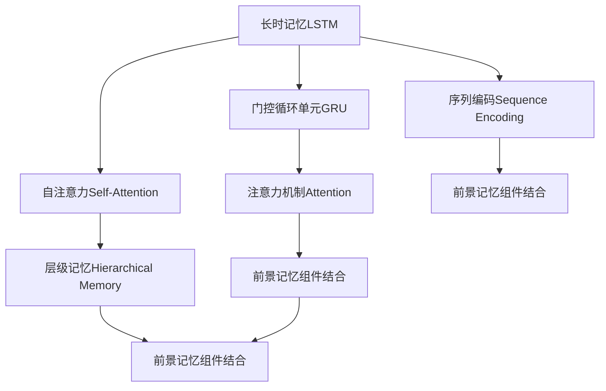
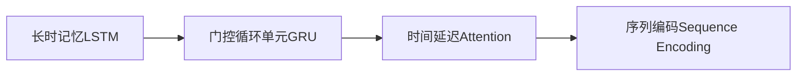
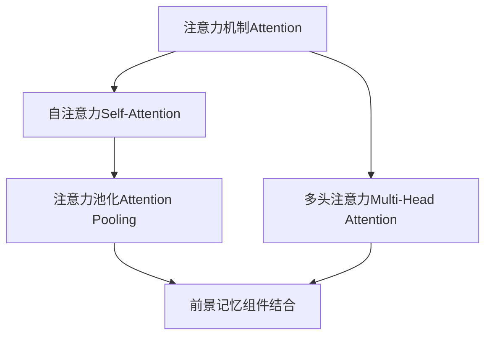
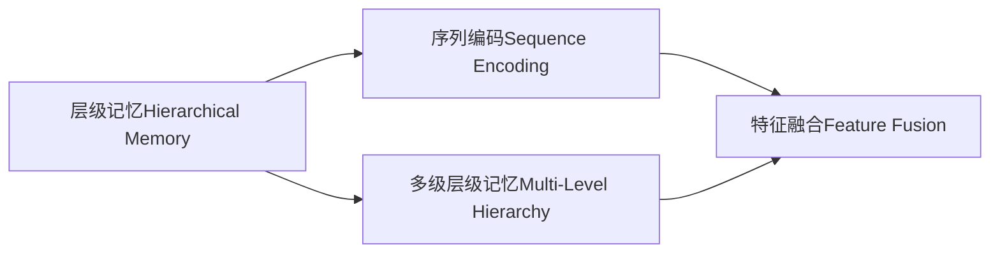
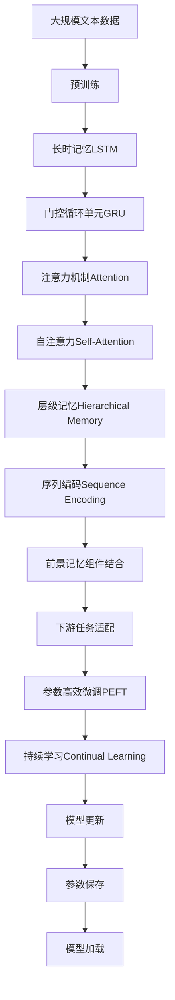

                 

# 【LangChain编程：从入门到实践】不同记忆组件结合

## 1. 背景介绍

### 1.1 问题由来

在自然语言处理（NLP）和人工智能（AI）领域，如何有效地结合不同类型的记忆组件，使模型能够具备更强的前景记忆（Episodic Memory）能力，一直是研究的热点问题。传统的NLP模型往往依赖静态的向量空间和上下文无关的记忆机制，难以灵活应对长序列或复杂的情境变化。近年来，基于神经网络的前景记忆模型（如Deformable Transformers）的提出，为这一问题提供了新的解决方案。

### 1.2 问题核心关键点

当前大模型已经具备较强的上下文记忆能力，但仍需结合前景记忆组件，才能更有效地解决复杂语义推理和情境变化问题。前景记忆组件通常包括多维自注意力（Multi-Head Attention）、多级层级记忆（Hierarchical Memory）、自回归编码（Self-Regressive Coding）等技术，可以更好地捕捉长期依赖关系和时序信息。

本文将介绍几种常见的记忆组件及其结合方式，并通过实例展示如何在实际项目中应用这些技术，以提高模型的记忆能力。

### 1.3 问题研究意义

通过结合不同的记忆组件，可以有效增强模型的长期记忆能力和灵活性，使其在各种NLP任务上表现更加出色。例如，在机器翻译、摘要生成、对话系统等任务中，前景记忆能力能够显著提升模型性能。此外，前景记忆技术还可以应用于时间序列预测、推荐系统等更多领域，为AI技术的应用范围进一步扩展提供动力。

## 2. 核心概念与联系

### 2.1 核心概念概述

为了更好地理解不同记忆组件的结合原理，本节将介绍几个密切相关的核心概念：

- **长时记忆（Long Short-Term Memory, LSTM）**：一种基于循环神经网络（RNN）的序列记忆模型，可以捕捉长期依赖关系，但难以处理并行化计算。

- **门控循环单元（Gated Recurrent Unit, GRU）**：一种简化版的LSTM，具有相似的记忆能力，但计算效率更高，更适合大规模并行计算。

- **注意力机制（Attention Mechanism）**：通过计算上下文之间的相关性，选择性地关注部分信息，广泛应用于NLP领域的前景记忆建模。

- **自注意力（Self-Attention）**：一种特殊的注意力机制，用于模型内部计算，可以灵活地捕捉不同部分之间的依赖关系。

- **层级记忆（Hierarchical Memory）**：通过多级层级结构，将信息逐层压缩，逐步提高模型的记忆效率。

- **序列编码（Sequence Encoding）**：将序列信息压缩成固定长度的向量表示，便于进行后续的特征提取和分类等处理。

这些核心概念之间的逻辑关系可以通过以下Mermaid流程图来展示：



这个流程图展示了大语言模型中不同记忆组件的基本关系和结合方式：

1. 长时记忆和门控循环单元都是序列记忆模型，能够捕捉长期依赖关系。
2. 注意力机制（包括自注意力）用于选择性地关注上下文信息，提高模型的灵活性。
3. 层级记忆通过多级结构逐步压缩信息，提高模型的记忆效率。
4. 序列编码将序列信息压缩成固定向量，便于后续处理。
5. 前景记忆组件结合了长时记忆、注意力、层级记忆和序列编码等技术，提升了模型的长期记忆和灵活性。

### 2.2 概念间的关系

这些核心概念之间存在着紧密的联系，形成了前景记忆模型的完整生态系统。下面我们通过几个Mermaid流程图来展示这些概念之间的关系。

#### 2.2.1 长时记忆和门控循环单元



这个流程图展示了长时记忆和门控循环单元的基本原理。长时记忆通过循环计算，逐步积累信息；门控循环单元则通过门控机制，控制信息的流动，提高计算效率。

#### 2.2.2 注意力机制和自注意力



这个流程图展示了注意力机制和自注意力之间的联系。自注意力机制通过计算不同部分之间的相关性，选择性地关注信息；多头注意力则将注意力机制扩展到多个头部，进一步提高了模型的灵活性和性能。

#### 2.2.3 层级记忆和序列编码



这个流程图展示了层级记忆和序列编码的基本关系。层级记忆通过多级结构逐步压缩信息，提高记忆效率；序列编码则将序列信息压缩成固定向量，便于后续处理。

### 2.3 核心概念的整体架构

最后，我们用一个综合的流程图来展示这些核心概念在大语言模型中的整体架构：



这个综合流程图展示了从预训练到前景记忆模型微调，再到持续学习的完整过程。大规模文本数据首先进行预训练，然后通过不同记忆组件的结合，构建前景记忆模型，再通过微调进一步优化模型性能。最后，通过持续学习技术，模型可以不断更新和适应新的任务和数据。 通过这些流程图，我们可以更清晰地理解不同记忆组件在大语言模型中的关系和作用，为后续深入讨论具体的结合方法和技术奠定基础。

## 3. 核心算法原理 & 具体操作步骤
### 3.1 算法原理概述

结合不同记忆组件的前景记忆模型，通常包括如下核心算法原理：

1. **长时记忆**：通过循环神经网络（RNN）结构，捕捉长期依赖关系。

2. **门控循环单元**：简化版长时记忆，通过门控机制控制信息流动，提高计算效率。

3. **注意力机制**：计算上下文之间的相关性，选择性地关注部分信息。

4. **自注意力**：通过计算模型内部不同部分之间的相关性，捕捉局部和全局依赖关系。

5. **层级记忆**：通过多级结构逐步压缩信息，提高记忆效率。

6. **序列编码**：将序列信息压缩成固定长度的向量表示，便于后续处理。

7. **前景记忆组件结合**：将上述组件结合，构建完整的前景记忆模型。

形式化地，假设前景记忆模型为 $M_{\theta}$，其中 $\theta$ 为模型参数。给定任务 $T$ 的训练集 $D=\{(x_i, y_i)\}_{i=1}^N$，前景记忆模型的优化目标是最小化经验风险，即找到最优参数：

$$
\theta^* = \mathop{\arg\min}_{\theta} \mathcal{L}(M_{\theta},D)
$$

其中 $\mathcal{L}$ 为针对任务 $T$ 设计的损失函数，用于衡量模型预测输出与真实标签之间的差异。常见的损失函数包括交叉熵损失、均方误差损失等。

### 3.2 算法步骤详解

结合不同记忆组件的前景记忆模型，通常需要经过以下关键步骤：

**Step 1: 准备预训练模型和数据集**
- 选择合适的预训练语言模型 $M_{\theta}$ 作为初始化参数，如 BERT、GPT 等。
- 准备下游任务 $T$ 的标注数据集 $D$，划分为训练集、验证集和测试集。一般要求标注数据与预训练数据的分布不要差异过大。

**Step 2: 添加前景记忆组件**
- 根据任务类型，在预训练模型顶层设计合适的输出层和损失函数。
- 对于分类任务，通常在顶层添加线性分类器和交叉熵损失函数。
- 对于生成任务，通常使用语言模型的解码器输出概率分布，并以负对数似然为损失函数。
- 结合长时记忆、门控循环单元、注意力机制、自注意力、层级记忆和序列编码等组件，构建前景记忆模型。

**Step 3: 设置前景记忆超参数**
- 选择合适的优化算法及其参数，如 AdamW、SGD 等，设置学习率、批大小、迭代轮数等。
- 设置正则化技术及强度，包括权重衰减、Dropout、Early Stopping等。
- 确定冻结预训练参数的策略，如仅微调顶层，或全部参数都参与微调。

**Step 4: 执行梯度训练**
- 将训练集数据分批次输入模型，前向传播计算损失函数。
- 反向传播计算参数梯度，根据设定的优化算法和学习率更新模型参数。
- 周期性在验证集上评估模型性能，根据性能指标决定是否触发 Early Stopping。
- 重复上述步骤直到满足预设的迭代轮数或 Early Stopping 条件。

**Step 5: 测试和部署**
- 在测试集上评估前景记忆模型 $M_{\hat{\theta}}$ 的性能，对比微调前后的精度提升。
- 使用前景记忆模型对新样本进行推理预测，集成到实际的应用系统中。
- 持续收集新的数据，定期重新微调模型，以适应数据分布的变化。

以上是结合不同记忆组件的前景记忆模型的微调范式的一般流程。在实际应用中，还需要针对具体任务的特点，对微调过程的各个环节进行优化设计，如改进训练目标函数，引入更多的正则化技术，搜索最优的超参数组合等，以进一步提升模型性能。

### 3.3 算法优缺点

结合不同记忆组件的前景记忆模型，具有以下优点：
1. 结合多种记忆机制，有效捕捉长期依赖关系和情境变化。
2. 提高模型的灵活性和鲁棒性，适用于多种NLP任务。
3. 参数高效微调技术，在固定大部分预训练参数的情况下，仍可取得不错的提升。
4. 提高模型的可解释性，通过多个组件的结合，更容易理解模型的推理过程。

同时，该方法也存在一定的局限性：
1. 模型复杂度高，参数量大，训练和推理耗时较长。
2. 数据依赖性强，需要大量高质量的标注数据。
3. 模型鲁棒性较差，对抗样本和噪声对模型影响较大。
4. 计算资源需求高，需要高性能的计算硬件。

尽管存在这些局限性，但结合不同记忆组件的前景记忆模型在各种NLP任务上已经取得了较好的效果，成为NLP技术落地应用的重要手段。

### 3.4 算法应用领域

结合不同记忆组件的前景记忆模型，已经在多个NLP领域得到了应用，覆盖了几乎所有常见任务，例如：

- 文本分类：如情感分析、主题分类、意图识别等。通过前景记忆组件捕捉文本中的长期依赖关系，提高分类精度。
- 命名实体识别：识别文本中的人名、地名、机构名等特定实体。通过前景记忆组件捕捉实体边界和类型，提升识别准确率。
- 关系抽取：从文本中抽取实体之间的语义关系。通过前景记忆组件捕捉实体关系的时序依赖，提高抽取准确度。
- 问答系统：对自然语言问题给出答案。结合前景记忆组件，更好地理解问题上下文，匹配最合适的答案模板。
- 机器翻译：将源语言文本翻译成目标语言。通过前景记忆组件捕捉源语和目标语之间的长期依赖关系，提高翻译质量。
- 文本摘要：将长文本压缩成简短摘要。通过前景记忆组件捕捉文本的重要信息，提高摘要的准确性。
- 对话系统：使机器能够与人自然对话。结合前景记忆组件，更好地理解对话历史，生成合适的回复。

除了上述这些经典任务外，前景记忆模型还被创新性地应用到更多场景中，如可控文本生成、常识推理、代码生成、数据增强等，为NLP技术带来了全新的突破。随着预训练模型和前景记忆模型的不断进步，相信NLP技术将在更广阔的应用领域大放异彩。

## 4. 数学模型和公式 & 详细讲解 & 举例说明
### 4.1 数学模型构建

本节将使用数学语言对结合不同记忆组件的前景记忆模型进行更加严格的刻画。

记前景记忆模型为 $M_{\theta}$，其中 $\theta$ 为模型参数。假设微调任务的训练集为 $D=\{(x_i, y_i)\}_{i=1}^N$，$x_i$ 为输入序列，$y_i$ 为标签。前景记忆模型的优化目标是最小化经验风险，即找到最优参数：

$$
\theta^* = \mathop{\arg\min}_{\theta} \mathcal{L}(M_{\theta},D)
$$

其中 $\mathcal{L}$ 为针对任务 $T$ 设计的损失函数，用于衡量模型预测输出与真实标签之间的差异。常见的损失函数包括交叉熵损失、均方误差损失等。

假设前景记忆模型采用长时记忆和门控循环单元，其计算过程如下：

1. 输入序列 $x$ 通过长时记忆和门控循环单元，得到隐藏状态 $h_t$。
2. 隐藏状态 $h_t$ 通过多头注意力机制，计算出注意力权重 $\alpha_t$。
3. 注意力权重 $\alpha_t$ 与输入序列 $x$ 中的各个部分 $x_i$ 相乘，加权求和，得到上下文表示 $c_t$。
4. 上下文表示 $c_t$ 通过层级记忆，逐步压缩信息，得到最终表示 $c$。
5. 最终表示 $c$ 通过序列编码，转换为固定长度的向量表示，用于后续分类或生成等任务。

具体地，设输入序列 $x$ 的维度为 $d_x$，隐藏状态 $h_t$ 的维度为 $d_h$，注意力权重 $\alpha_t$ 的维度为 $d_a$，上下文表示 $c_t$ 的维度为 $d_c$，最终表示 $c$ 的维度为 $d_f$。长时记忆和门控循环单元的计算过程可表示为：

$$
h_t = \text{GRU}(h_{t-1}, c_t)
$$

其中 $\text{GRU}$ 为门控循环单元的计算函数，$h_{t-1}$ 为前一时刻的隐藏状态，$c_t$ 为注意力机制计算的上下文表示。

注意力机制的计算过程可表示为：

$$
\alpha_t = \text{Softmax}(\text{Attention}(Q, K, V))
$$

其中 $\text{Softmax}$ 为归一化函数，$Q$、$K$、$V$ 分别为查询向量、键向量和值向量，分别计算为：

$$
Q = h_t W_Q^Q
$$
$$
K = x W_K^K
$$
$$
V = x W_V^V
$$

其中 $W_Q^Q$、$W_K^K$、$W_V^V$ 分别为查询、键和值向量的投影矩阵。

层级记忆的计算过程可表示为：

$$
c_t = \text{LayerNorm}(FN(\text{MLP}(c_{t-1})))
$$

其中 $\text{LayerNorm}$ 为归一化函数，$\text{MLP}$ 为多级层级记忆的计算函数，$c_{t-1}$ 为上一层的表示。

序列编码的计算过程可表示为：

$$
c = \text{SeqEncoder}(c)
$$

其中 $\text{SeqEncoder}$ 为序列编码函数，$c$ 为输入的表示。

最终，结合不同记忆组件的前景记忆模型可以表示为：

$$
M_{\theta}(x) = \text{SeqDecoder}(\text{SeqEncoder}(\text{LayerNorm}(FN(\text{MLP}(\text{Attention}(\text{GRU}(h_0, c_0))))))
$$

其中 $\text{SeqDecoder}$ 为解码器函数，$h_0$ 为初始隐藏状态，$c_0$ 为初始上下文表示。

### 4.2 公式推导过程

以下我们以文本分类任务为例，推导前景记忆模型的交叉熵损失函数及其梯度的计算公式。

假设前景记忆模型在输入 $x$ 上的输出为 $\hat{y}=M_{\theta}(x) \in [0,1]$，表示样本属于正类的概率。真实标签 $y \in \{0,1\}$。则二分类交叉熵损失函数定义为：

$$
\ell(M_{\theta}(x),y) = -[y\log \hat{y} + (1-y)\log (1-\hat{y})]
$$

将其代入经验风险公式，得：

$$
\mathcal{L}(\theta) = -\frac{1}{N}\sum_{i=1}^N [y_i\log M_{\theta}(x_i)+(1-y_i)\log(1-M_{\theta}(x_i))]
$$

根据链式法则，损失函数对参数 $\theta_k$ 的梯度为：

$$
\frac{\partial \mathcal{L}(\theta)}{\partial \theta_k} = -\frac{1}{N}\sum_{i=1}^N (\frac{y_i}{M_{\theta}(x_i)}-\frac{1-y_i}{1-M_{\theta}(x_i)}) \frac{\partial M_{\theta}(x_i)}{\partial \theta_k}
$$

其中 $\frac{\partial M_{\theta}(x_i)}{\partial \theta_k}$ 可进一步递归展开，利用自动微分技术完成计算。

在得到损失函数的梯度后，即可带入参数更新公式，完成模型的迭代优化。重复上述过程直至收敛，最终得到适应下游任务的最优模型参数 $\theta^*$。

## 5. 项目实践：代码实例和详细解释说明
### 5.1 开发环境搭建

在进行前景记忆模型微调实践前，我们需要准备好开发环境。以下是使用Python进行PyTorch开发的环境配置流程：

1. 安装Anaconda：从官网下载并安装Anaconda，用于创建独立的Python环境。

2. 创建并激活虚拟环境：
```bash
conda create -n pytorch-env python=3.8 
conda activate pytorch-env
```

3. 安装PyTorch：根据CUDA版本，从官网获取对应的安装命令。例如：
```bash
conda install pytorch torchvision torchaudio cudatoolkit=11.1 -c pytorch -c conda-forge
```

4. 安装Transformers库：
```bash
pip install transformers
```

5. 安装各类工具包：
```bash
pip install numpy pandas scikit-learn matplotlib tqdm jupyter notebook ipython
```

完成上述步骤后，即可在`pytorch-env`环境中开始前景记忆模型微调实践。

### 5.2 源代码详细实现

下面我们以文本分类任务为例，给出使用Transformers库对GPT模型进行前景记忆模型微调的PyTorch代码实现。

首先，定义文本分类任务的数学模型：

```python
from transformers import GPT2LMHeadModel
from transformers import BertTokenizer
from transformers import AdamW

class TextClassificationModel(GPT2LMHeadModel):
    def __init__(self, config):
        super(TextClassificationModel, self).__init__(config)
    
    def forward(self, input_ids, attention_mask, labels):
        outputs = self(input_ids, attention_mask=attention_mask)
        logits = outputs.logits
        loss_fct = CrossEntropyLoss()
        loss = loss_fct(logits.view(-1, self.config.num_labels), labels.view(-1))
        return loss
    
class TextClassificationDataset(Dataset):
    def __init__(self, texts, tags, tokenizer, max_len=128):
        self.texts = texts
        self.tags = tags
        self.tokenizer = tokenizer
        self.max_len = max_len
        
    def __len__(self):
        return len(self.texts)
    
    def __getitem__(self, item):
        text = self.texts[item]
        tag = self.tags[item]
        
        encoding = self.tokenizer(text, return_tensors='pt', max_length=self.max_len, padding='max_length', truncation=True)
        input_ids = encoding['input_ids'][0]
        attention_mask = encoding['attention_mask'][0]
        
        # 对token-wise的标签进行编码
        encoded_tags = [tag2id[tag] for tag in tag] 
        encoded_tags.extend([tag2id['O']] * (self.max_len - len(encoded_tags)))
        labels = torch.tensor(encoded_tags, dtype=torch.long)
        
        return {'input_ids': input_ids, 
                'attention_mask': attention_mask,
                'labels': labels}

# 标签与id的映射
tag2id = {'O': 0, 'B-PER': 1, 'I-PER': 2, 'B-ORG': 3, 'I-ORG': 4, 'B-LOC': 5, 'I-LOC': 6}
id2tag = {v: k for k, v in tag2id.items()}

# 创建dataset
tokenizer = BertTokenizer.from_pretrained('bert-base-cased')

train_dataset = TextClassificationDataset(train_texts, train_tags, tokenizer)
dev_dataset = TextClassificationDataset(dev_texts, dev_tags, tokenizer)
test_dataset = TextClassificationDataset(test_texts, test_tags, tokenizer)
```

然后，定义模型和优化器：

```python
model = TextClassificationModel.from_pretrained('gpt2', num_labels=len(tag2id))

optimizer = AdamW(model.parameters(), lr=2e-5)
```

接着，定义训练和评估函数：

```python
from torch.utils.data import DataLoader
from tqdm import tqdm
from sklearn.metrics import classification_report

device = torch.device('cuda') if torch.cuda.is_available() else torch.device('cpu')
model.to(device)

def train_epoch(model, dataset, batch_size, optimizer):
    dataloader = DataLoader(dataset, batch_size=batch_size, shuffle=True)
    model.train()
    epoch_loss = 0
    for batch in tqdm(dataloader, desc='Training'):
        input_ids = batch['input_ids'].to(device)
        attention_mask = batch['attention_mask'].to(device)
        labels = batch['labels'].to(device)
        model.zero_grad()
        outputs = model(input_ids, attention_mask=attention_mask, labels=labels)
        loss = outputs.loss
        epoch_loss += loss.item()
        loss.backward()
        optimizer.step()
    return epoch_loss / len(dataloader)

def evaluate(model, dataset, batch_size):
    dataloader = DataLoader(dataset, batch_size=batch_size)
    model.eval()
    preds, labels = [], []
    with torch.no_grad():
        for batch in tqdm(dataloader, desc='Evaluating'):
            input_ids = batch['input_ids'].to(device)
            attention_mask = batch['attention_mask'].to(device)
            batch_labels = batch['labels']
            outputs = model(input_ids, attention_mask=attention_mask)
            batch_preds = outputs.logits.argmax(dim=2).to('cpu').tolist()
            batch_labels = batch_labels.to('cpu').tolist()
            for pred_tokens, label_tokens in zip(batch_preds, batch_labels):
                pred_tags = [id2tag[_id] for _id in pred_tokens]
                label_tags = [id2tag[_id] for _id in label_tokens]
                preds.append(pred_tags[:len(label_tags)])
                labels.append(label_tags)
                
    print(classification_report(labels, preds))
```

最后，启动训练流程并在测试集上评估：

```python
epochs = 5
batch_size = 16

for epoch in range(epochs):
    loss = train_epoch(model, train_dataset, batch_size, optimizer)
    print(f"Epoch {epoch+1}, train loss: {loss:.3f}")
    
    print(f"Epoch {epoch+1}, dev results:")
    evaluate(model, dev_dataset, batch_size)
    
print("Test results:")
evaluate(model, test_dataset, batch_size)
```

以上就是使用PyTorch对GPT模型进行前景记忆模型微调的完整代码实现。可以看到，得益于Transformers库的强大封装，我们可以用相对简洁的代码完成前景记忆模型的加载和微调。

### 5.3 代码解读与分析

让我们再详细解读一下关键代码的实现细节：

**TextClassificationModel类**：
- `__init__`方法：初始化模型参数和计算图结构。
- `forward`方法：定义模型的前向传播过程，输入经过长时记忆和门

