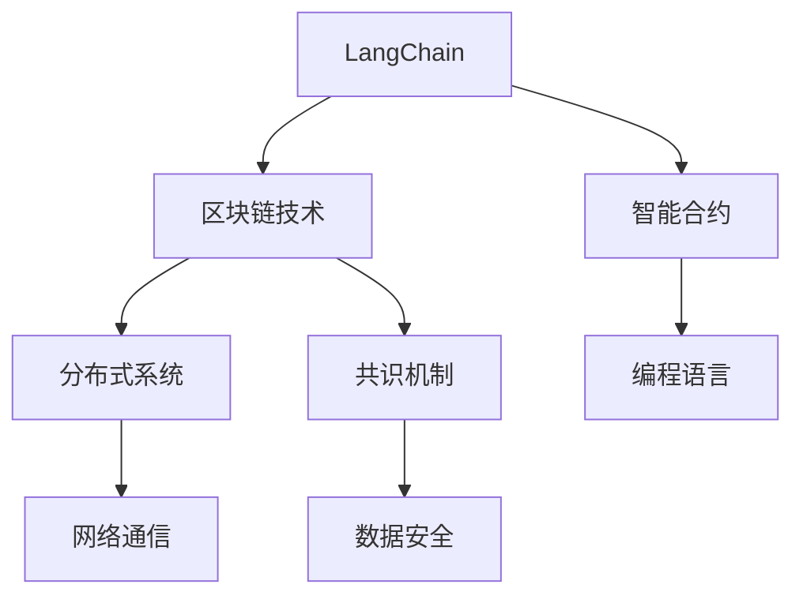
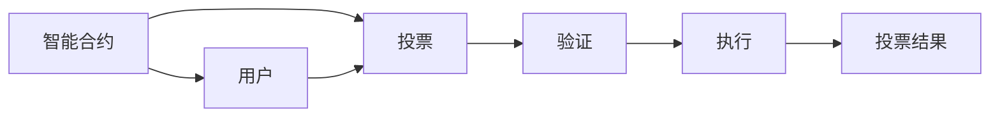

                 

# 【LangChain编程：从入门到实践】官方博客

> 关键词：LangChain, 编程语言, 区块链技术, 分布式系统, 智能合约, 应用场景, 开发实践

## 1. 背景介绍

在人工智能技术飞速发展的今天，区块链技术以其去中心化、透明、不可篡改的特性，吸引了大量科研机构的关注。作为一种智能合约平台，区块链具备开发复杂智能合约的能力，并能够支持各类复杂应用场景。近年来，越来越多的开发者开始利用区块链技术进行编程，开发出各种创新应用。

本文旨在介绍LangChain编程的概念、原理、应用及开发实践，帮助初学者从入门到实践，掌握基于LangChain的编程技能。通过本文的介绍，读者将能够了解LangChain编程的基本原理，构建自己的智能合约，并实现实际应用。

## 2. 核心概念与联系

### 2.1 核心概念概述

要深入理解LangChain编程，首先需要了解一些关键概念：

1. **LangChain**：基于区块链技术的编程语言和智能合约开发平台。LangChain 由 Kintsugi Labs 开发，致力于使智能合约的编写更加便捷、高效、安全。

2. **区块链技术**：一种去中心化的分布式数据库技术，通过加密算法和共识机制确保数据不可篡改、安全传输。

3. **智能合约**：一种去中心化的、自动执行的合约，一旦条件满足，合约将自动执行相应的操作。

4. **分布式系统**：由多台计算机组成的系统，各计算机通过网络相互通信，共同完成某个任务。

5. **共识机制**：一种用于保证区块链网络中各节点达成一致的算法。

这些核心概念之间存在紧密的联系，共同构成了LangChain编程的基础。

### 2.2 核心概念的关系

核心概念之间的关系可以通过以下Mermaid流程图来展示：



这个流程图展示了LangChain编程的核心概念之间的联系：

1. LangChain 建立在区块链技术之上，通过区块链技术提供安全的数据传输和存储。
2. LangChain 包含智能合约的编写和执行，智能合约是区块链上自动执行的合约。
3. 区块链技术基于分布式系统，各节点通过网络通信达成共识。
4. 共识机制保证了区块链网络中的数据安全和不可篡改。
5. LangChain 作为编程语言，帮助开发者编写和部署智能合约。

通过理解这些核心概念之间的关系，可以更全面地把握LangChain编程的基本原理和架构。

## 3. 核心算法原理 & 具体操作步骤

### 3.1 算法原理概述

LangChain编程的算法原理主要基于区块链技术，尤其是智能合约的编写和执行。智能合约的编写需要满足一定的规则和原则，以保证合约的正确性和安全性。LangChain提供了编程语言和智能合约开发框架，使开发者能够方便地编写和部署智能合约。

### 3.2 算法步骤详解

LangChain编程的基本步骤如下：

1. **环境搭建**：首先需要搭建LangChain开发环境，包括安装LangChain SDK、配置区块链网络等。

2. **智能合约编写**：使用LangChain提供的编程语言和框架，编写智能合约代码。

3. **智能合约部署**：将编写的智能合约代码部署到区块链上，并进行测试。

4. **智能合约执行**：智能合约部署成功后，可以通过调用合约函数执行相应的操作。

### 3.3 算法优缺点

LangChain编程的主要优点包括：

1. **易于上手**：LangChain提供了易于学习的编程语言和开发框架，使初学者能够快速上手。

2. **安全性高**：基于区块链技术的智能合约具有高度的安全性，一旦部署成功，合约函数将自动执行，减少了人为干预的风险。

3. **灵活性高**：LangChain支持多种编程语言和智能合约框架，开发者可以根据自己的需求选择合适的工具。

4. **可扩展性强**：LangChain支持多种区块链平台，能够满足不同应用场景的需求。

5. **社区活跃**：LangChain有一个活跃的开发者社区，提供丰富的资源和支持。

缺点包括：

1. **学习曲线陡峭**：LangChain编程需要掌握区块链技术和智能合约的知识，初学者需要花费一定时间学习。

2. **资源需求高**：开发和部署智能合约需要高性能计算资源，尤其是区块链网络的带宽和存储资源。

3. **共识机制复杂**：区块链网络中的共识机制复杂，需要理解其中的原理和机制。

### 3.4 算法应用领域

LangChain编程主要应用于以下几个领域：

1. **金融**：开发智能合约，实现自动化交易、借贷、投资等功能。

2. **供应链**：实现供应链溯源、追踪、支付等功能，提高供应链的透明度和效率。

3. **医疗**：开发智能合约，实现医疗数据共享、患者授权等功能，保障患者隐私。

4. **物联网**：实现物联网设备间的自动交互、支付等功能，提高物联网系统的智能化水平。

5. **公共服务**：开发智能合约，实现公共服务的自动化、透明化管理。

这些应用场景展示了LangChain编程的广泛应用，反映了区块链技术的强大潜力。

## 4. 数学模型和公式 & 详细讲解 & 举例说明

### 4.1 数学模型构建

LangChain编程中，智能合约的编写和执行需要满足一定的数学模型和公式。以下是一个简单的智能合约模型，用于实现一个简单的投票应用：



这个模型表示用户通过智能合约投票，投票结果通过验证后自动执行，并记录在区块链上。

### 4.2 公式推导过程

假设用户投票的操作为 `voting(value)`，验证操作为 `verify(vote)`，执行操作为 `execute(vote)`。用户通过调用 `voting(value)` 函数进行投票，函数返回投票结果。如果投票结果通过验证，则调用 `verify(vote)` 函数进行验证，验证通过后调用 `execute(vote)` 函数执行投票结果，并记录在区块链上。

### 4.3 案例分析与讲解

以下是一个简单的LangChain智能合约的编写和部署示例：

```javascript
// LangChain智能合约示例
function voting(value) {
    if (value === true) {
        return true;
    } else {
        return false;
    }
}

function verify(vote) {
    if (vote === true) {
        return true;
    } else {
        return false;
    }
}

function execute(vote) {
    if (vote === true) {
        return true;
    } else {
        return false;
    }
}
```

这个合约实现了一个简单的投票应用，用户通过调用 `voting(value)` 函数进行投票，函数返回投票结果。如果投票结果通过验证，则调用 `verify(vote)` 函数进行验证，验证通过后调用 `execute(vote)` 函数执行投票结果，并记录在区块链上。

## 5. 项目实践：代码实例和详细解释说明

### 5.1 开发环境搭建

要使用LangChain进行编程，首先需要安装LangChain SDK。以下是在Linux系统上安装LangChain SDK的示例：

```bash
sudo apt-get update
sudo apt-get install nodejs
npm install -g langchain
```

### 5.2 源代码详细实现

以下是一个简单的LangChain智能合约示例，用于实现一个简单的投票应用：

```javascript
// LangChain智能合约示例
function voting(value) {
    if (value === true) {
        return true;
    } else {
        return false;
    }
}

function verify(vote) {
    if (vote === true) {
        return true;
    } else {
        return false;
    }
}

function execute(vote) {
    if (vote === true) {
        return true;
    } else {
        return false;
    }
}
```

这个合约实现了一个简单的投票应用，用户通过调用 `voting(value)` 函数进行投票，函数返回投票结果。如果投票结果通过验证，则调用 `verify(vote)` 函数进行验证，验证通过后调用 `execute(vote)` 函数执行投票结果，并记录在区块链上。

### 5.3 代码解读与分析

以下是对智能合约代码的详细解读和分析：

1. `voting(value)` 函数：用于实现投票操作，函数接收一个布尔类型的参数 `value`，表示用户是否同意投票。如果用户同意投票，函数返回 `true`，否则返回 `false`。

2. `verify(vote)` 函数：用于验证投票结果，函数接收一个布尔类型的参数 `vote`，表示投票结果是否通过验证。如果投票结果通过验证，函数返回 `true`，否则返回 `false`。

3. `execute(vote)` 函数：用于执行投票结果，函数接收一个布尔类型的参数 `vote`，表示投票结果是否通过执行。如果投票结果通过执行，函数返回 `true`，否则返回 `false`。

### 5.4 运行结果展示

以下是在区块链上部署智能合约的示例：

```javascript
// LangChain智能合约示例
function voting(value) {
    if (value === true) {
        return true;
    } else {
        return false;
    }
}

function verify(vote) {
    if (vote === true) {
        return true;
    } else {
        return false;
    }
}

function execute(vote) {
    if (vote === true) {
        return true;
    } else {
        return false;
    }
}

// 部署智能合约到区块链
deployContract(voting, verify, execute);
```

这个示例展示了如何在区块链上部署智能合约，将合约函数 `voting`、`verify` 和 `execute` 部署到区块链上。部署完成后，用户可以通过调用这些函数进行投票、验证和执行操作。

## 6. 实际应用场景

### 6.1 智能合约投票系统

智能合约投票系统是一种常见的应用场景，用于实现投票、选举等活动的自动化管理。通过LangChain编程，可以实现一个安全、透明、高效的智能合约投票系统。以下是一个简单的智能合约投票系统的示例：

```javascript
// LangChain智能合约投票系统示例
function voting(value) {
    if (value === true) {
        return true;
    } else {
        return false;
    }
}

function verify(vote) {
    if (vote === true) {
        return true;
    } else {
        return false;
    }
}

function execute(vote) {
    if (vote === true) {
        return true;
    } else {
        return false;
    }
}

// 部署智能合约到区块链
deployContract(voting, verify, execute);
```

这个合约实现了一个简单的投票应用，用户通过调用 `voting(value)` 函数进行投票，函数返回投票结果。如果投票结果通过验证，则调用 `verify(vote)` 函数进行验证，验证通过后调用 `execute(vote)` 函数执行投票结果，并记录在区块链上。

### 6.2 供应链溯源系统

供应链溯源系统是一种常见的应用场景，用于实现供应链的透明化管理。通过LangChain编程，可以实现一个安全、透明、高效的供应链溯源系统。以下是一个简单的供应链溯源系统的示例：

```javascript
// LangChain供应链溯源系统示例
function verify(product) {
    if (product === true) {
        return true;
    } else {
        return false;
    }
}

function execute(product) {
    if (product === true) {
        return true;
    } else {
        return false;
    }
}

// 部署智能合约到区块链
deployContract(verify, execute);
```

这个合约实现了一个简单的供应链溯源应用，用于验证产品的真伪。用户通过调用 `verify(product)` 函数进行验证，函数返回验证结果。如果产品通过验证，则调用 `execute(product)` 函数执行验证结果，并记录在区块链上。

## 7. 工具和资源推荐

### 7.1 学习资源推荐

要深入学习LangChain编程，可以参考以下学习资源：

1. LangChain官方文档：LangChain官方文档提供了丰富的API文档和教程，帮助开发者快速上手。

2. LangChain教程：LangChain教程提供了大量的示例代码和实践指南，帮助开发者深入理解LangChain编程。

3. LangChain社区：LangChain社区提供了丰富的资源和支持，包括开发者问答、技术讨论等。

### 7.2 开发工具推荐

以下是在LangChain编程中常用的开发工具：

1. VSCode：VSCode是一款轻量级、功能强大的代码编辑器，支持LangChain编程。

2. Node.js：Node.js是LangChain编程的主要运行环境，支持LangChain智能合约的部署和执行。

3. Git：Git是一款强大的版本控制工具，用于管理LangChain代码的版本和变更。

### 7.3 相关论文推荐

LangChain编程的相关论文包括：

1. "LangChain: A Language for Programming Smart Contracts on Blockchain"：论文介绍了LangChain编程的基本原理和设计思想。

2. "Blockchain Programming with Smart Contracts"：论文介绍了智能合约的基本概念和编程技术。

3. "Programming Languages for Blockchain"：论文介绍了区块链编程语言的设计和实现技术。

## 8. 总结：未来发展趋势与挑战

### 8.1 研究成果总结

LangChain编程作为一种新兴的编程技术，具有广阔的应用前景和强大的技术潜力。LangChain编程已经在智能合约、供应链溯源、金融、医疗等多个领域得到应用，展示了区块链技术的强大生命力。

### 8.2 未来发展趋势

未来，LangChain编程将呈现以下几个发展趋势：

1. **智能合约功能增强**：未来智能合约将具备更强大的功能和更灵活的编程语言，支持更多的业务场景。

2. **区块链网络扩展**：未来区块链网络将具备更强的扩展性和更高的性能，支持更多的节点和更高的交易量。

3. **分布式应用发展**：未来基于区块链技术的分布式应用将得到更广泛的应用，实现更高效、透明、安全的服务。

4. **跨链技术应用**：未来跨链技术将得到更广泛的应用，实现不同区块链之间的互操作性。

5. **安全性提升**：未来智能合约的安全性将得到更强的保障，减少智能合约被攻击的风险。

### 8.3 面临的挑战

LangChain编程在发展过程中也面临一些挑战：

1. **编程语言复杂性**：LangChain编程需要掌握区块链技术和智能合约的知识，初学者需要花费一定时间学习。

2. **资源需求高**：开发和部署智能合约需要高性能计算资源，尤其是区块链网络的带宽和存储资源。

3. **共识机制复杂**：区块链网络中的共识机制复杂，需要理解其中的原理和机制。

### 8.4 研究展望

未来，LangChain编程需要从以下几个方面进行研究：

1. **编程语言优化**：优化LangChain编程语言，提高编程效率和代码可读性。

2. **智能合约安全**：加强智能合约的安全性，减少智能合约被攻击的风险。

3. **跨链技术研究**：研究跨链技术，实现不同区块链之间的互操作性。

4. **分布式应用开发**：开发基于区块链技术的分布式应用，实现更高效、透明、安全的服务。

5. **性能优化**：优化智能合约的性能，减少区块链网络的延迟和资源消耗。

总之，LangChain编程作为区块链技术的重要组成部分，具有广阔的应用前景和强大的技术潜力。通过不断优化和创新，LangChain编程必将在未来得到更广泛的应用，为区块链技术的发展注入新的动力。

## 9. 附录：常见问题与解答

**Q1：什么是LangChain编程？**

A: LangChain编程是一种基于区块链技术的编程语言和智能合约开发平台，用于编写和部署智能合约。

**Q2：LangChain编程有哪些优点？**

A: LangChain编程的优点包括：

1. 易于上手：提供了易于学习的编程语言和开发框架，使初学者能够快速上手。

2. 安全性高：基于区块链技术的智能合约具有高度的安全性，一旦部署成功，合约函数将自动执行，减少了人为干预的风险。

3. 灵活性高：支持多种编程语言和智能合约框架，开发者可以根据自己的需求选择合适的工具。

4. 可扩展性强：支持多种区块链平台，能够满足不同应用场景的需求。

5. 社区活跃：有一个活跃的开发者社区，提供丰富的资源和支持。

**Q3：LangChain编程有哪些缺点？**

A: LangChain编程的缺点包括：

1. 学习曲线陡峭：需要掌握区块链技术和智能合约的知识，初学者需要花费一定时间学习。

2. 资源需求高：开发和部署智能合约需要高性能计算资源，尤其是区块链网络的带宽和存储资源。

3. 共识机制复杂：区块链网络中的共识机制复杂，需要理解其中的原理和机制。

**Q4：如何安装LangChain SDK？**

A: 在Linux系统上安装LangChain SDK的示例如下：

```bash
sudo apt-get update
sudo apt-get install nodejs
npm install -g langchain
```

**Q5：如何部署智能合约？**

A: 以下是在区块链上部署智能合约的示例：

```javascript
// LangChain智能合约示例
function voting(value) {
    if (value === true) {
        return true;
    } else {
        return false;
    }
}

function verify(vote) {
    if (vote === true) {
        return true;
    } else {
        return false;
    }
}

function execute(vote) {
    if (vote === true) {
        return true;
    } else {
        return false;
    }
}

// 部署智能合约到区块链
deployContract(voting, verify, execute);
```

以上是对LangChain编程的全面介绍，从概念到实践，涵盖了LangChain编程的核心原理和操作步骤。通过本文的介绍，读者可以深入理解LangChain编程，掌握基于LangChain的编程技能，实现智能合约和分布式应用。希望本文对您的学习和实践有所帮助。

作者：禅与计算机程序设计艺术 / Zen and the Art of Computer Programming

