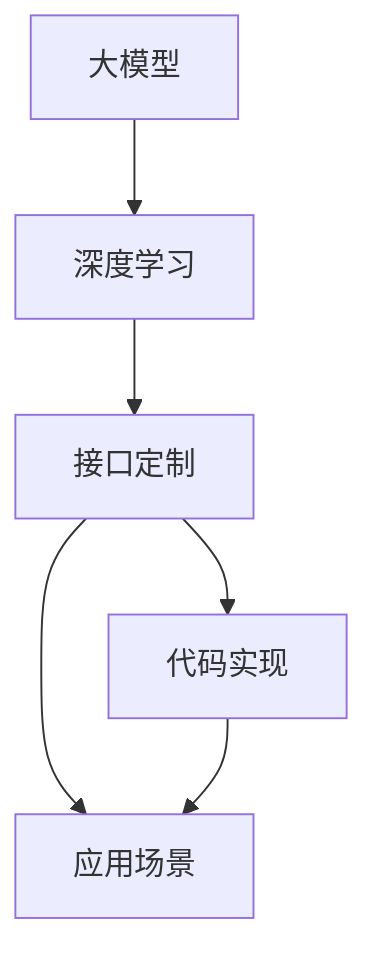

                 

# 【LangChain编程：从入门到实践】定制大模型接口

> 关键词：
> - LangChain
> - 大模型
> - 接口定制
> - 深度学习
> - 代码实现
> - 应用场景

## 1. 背景介绍

### 1.1 问题由来
在人工智能领域，大模型（Large Model）凭借其强大的学习能力，在自然语言处理（NLP）、计算机视觉（CV）、推荐系统等领域取得了显著成果。然而，实际应用中，并不是所有的大模型都能够直接用于特定任务。因此，定制化大模型接口成为了一项重要的技术挑战。

### 1.2 问题核心关键点
大模型接口定制的核心在于如何将通用大模型的强大能力与特定任务需求相结合，通过接口封装的方式，使得模型能够更高效、更便捷地应用于不同场景。其主要关键点包括：

- **模型选择与适配**：选择合适的预训练模型，并根据任务需求进行适配。
- **接口设计**：设计合理、灵活的接口，使得模型输入、输出更加高效。
- **数据处理**：对输入数据进行适当预处理，保证模型能够高效运行。
- **性能优化**：通过调整模型参数、优化算法等方式，提升模型性能。
- **应用部署**：将模型部署到实际应用场景中，并提供简单易用的接口。

### 1.3 问题研究意义
定制大模型接口不仅能够提高模型的应用效率，还能提升用户体验，降低应用成本。此外，接口定制还能够帮助开发者更好地理解模型的工作原理，增强模型的可解释性。在智能客服、医疗诊断、智能推荐等众多领域，定制化大模型接口的应用前景广阔。

## 2. 核心概念与联系

### 2.1 核心概念概述
- **大模型（Large Model）**：指通过在大规模数据上进行预训练，拥有强大学习能力的人工智能模型。如BERT、GPT-3等。
- **接口定制（Interface Customization）**：通过设计合理的接口，将大模型封装到特定任务中，使得模型能够高效、便捷地应用于实际场景。
- **深度学习（Deep Learning）**：一种通过多层次神经网络模型进行学习的技术，广泛应用于图像识别、自然语言处理等领域。
- **代码实现（Code Implementation）**：将算法、模型等技术通过编程语言具体实现，并进行优化、调试，使其能够高效运行。
- **应用场景（Application Scenarios）**：指大模型接口定制在特定领域的应用实例，如智能客服、医疗诊断等。

### 2.2 概念间的关系
这些核心概念通过接口定制紧密联系在一起，形成了一整套完整的技术体系。大模型通过深度学习获得强大的学习能力，通过接口定制能够应用于特定任务，而代码实现则是接口定制的具体实现方式。应用场景则是接口定制的具体应用实例，展示了接口定制技术在实际中的应用价值。

### 2.3 核心概念的整体架构
大模型接口定制的整体架构如下图所示：



这个架构展示了从大模型到接口定制、代码实现、应用场景的完整流程。大模型通过深度学习获得基础能力，接口定制将大模型封装到特定任务中，代码实现则是接口定制的具体实现方式，而应用场景则是接口定制技术的具体应用实例。

## 3. 核心算法原理 & 具体操作步骤
### 3.1 算法原理概述

接口定制的算法原理基于监督学习（Supervised Learning）和迁移学习（Transfer Learning）。其主要流程如下：

1. **数据准备**：收集任务相关的标注数据，并对其进行预处理。
2. **模型选择**：选择适合任务的预训练模型，并进行适配。
3. **接口设计**：设计灵活、高效的接口，使得模型能够高效运行。
4. **参数微调**：通过微调模型参数，提升模型在特定任务上的性能。
5. **性能评估**：对模型性能进行评估，根据评估结果进行优化。

### 3.2 算法步骤详解

以下是接口定制的详细操作步骤：

**Step 1: 数据准备**
1. **数据收集**：收集与任务相关的标注数据，包括输入数据和标签。
2. **数据预处理**：对数据进行清洗、归一化、分词等预处理操作。

**Step 2: 模型选择**
1. **预训练模型选择**：选择适合任务的预训练模型，如BERT、GPT-3等。
2. **模型适配**：对预训练模型进行适配，添加任务特定的输出层和损失函数。

**Step 3: 接口设计**
1. **输入格式设计**：设计输入数据的格式，如文本、图像等。
2. **输出格式设计**：设计输出数据的格式，如预测标签、分类结果等。

**Step 4: 参数微调**
1. **初始化参数**：对模型参数进行初始化。
2. **优化器选择**：选择适合任务的优化器，如Adam、SGD等。
3. **学习率设置**：设置适合任务的学习率。
4. **微调过程**：通过反向传播算法更新模型参数，最小化损失函数。

**Step 5: 性能评估**
1. **评估指标**：选择适合任务的评估指标，如准确率、F1分数等。
2. **评估方法**：使用验证集和测试集对模型进行评估。

### 3.3 算法优缺点

接口定制具有以下优点：
1. **高效性**：通过接口封装，模型能够高效地应用于特定任务。
2. **灵活性**：接口设计灵活，能够适应不同任务的需求。
3. **可解释性**：接口封装使得模型输出更加可解释。
4. **易用性**：接口封装使得模型应用更加便捷。

但同时，接口定制也存在一些缺点：
1. **数据依赖**：接口定制需要大量标注数据，数据获取成本较高。
2. **模型复杂度**：接口封装增加了模型的复杂度，可能导致模型性能下降。
3. **维护成本**：接口封装增加了模型的维护成本，需要定期更新。

### 3.4 算法应用领域

接口定制技术在多个领域都有广泛应用，如自然语言处理、计算机视觉、推荐系统等。

- **自然语言处理**：接口定制可以应用于文本分类、命名实体识别、机器翻译等任务。通过接口封装，使得BERT、GPT-3等大模型能够高效应用于特定任务。
- **计算机视觉**：接口定制可以应用于图像分类、目标检测、人脸识别等任务。通过接口封装，使得ResNet、Inception等大模型能够高效应用于特定任务。
- **推荐系统**：接口定制可以应用于商品推荐、内容推荐等任务。通过接口封装，使得预训练模型能够高效应用于推荐场景。

## 4. 数学模型和公式 & 详细讲解 & 举例说明

### 4.1 数学模型构建

假设我们有一个任务，其标注数据集为 $D=\{(x_i, y_i)\}_{i=1}^N$，其中 $x_i$ 表示输入数据，$y_i$ 表示标签。我们将使用BERT作为预训练模型，并对其进行接口定制。

### 4.2 公式推导过程

假设BERT的输出为 $h$，输出层为 $y$，损失函数为 $L$，则模型的训练过程可以表示为：

$$
\min_{\theta} L(h, y) = \frac{1}{N} \sum_{i=1}^N L(h_i, y_i)
$$

其中，$L$ 表示损失函数，$h_i$ 表示模型在输入 $x_i$ 上的输出，$y_i$ 表示标签。常用的损失函数包括交叉熵损失、均方误差损失等。

### 4.3 案例分析与讲解

以文本分类任务为例，我们假设预训练模型为BERT，其输出为 $h$，输出层为 $y$。我们设计了如下接口：

- **输入格式**：将输入文本 $x$ 转换为BERT的输入格式，包括分词、嵌入等预处理操作。
- **输出格式**：将BERT的输出 $h$ 进行分类，得到预测标签 $y$。

通过设计合适的损失函数和优化器，我们可以对BERT进行微调，使其适应特定的文本分类任务。例如，对于二分类任务，我们可以使用二元交叉熵损失函数：

$$
L(h, y) = -\frac{1}{N} \sum_{i=1}^N y_i \log \sigma(h_i) + (1-y_i) \log (1-\sigma(h_i))
$$

其中，$\sigma$ 表示sigmoid函数。

## 5. 项目实践：代码实例和详细解释说明

### 5.1 开发环境搭建

为了进行接口定制，我们需要准备好开发环境。以下是使用Python进行PyTorch开发的环境配置流程：

1. 安装Anaconda：从官网下载并安装Anaconda，用于创建独立的Python环境。

2. 创建并激活虚拟环境：
```bash
conda create -n pytorch-env python=3.8 
conda activate pytorch-env
```

3. 安装PyTorch：根据CUDA版本，从官网获取对应的安装命令。例如：
```bash
conda install pytorch torchvision torchaudio cudatoolkit=11.1 -c pytorch -c conda-forge
```

4. 安装Transformers库：
```bash
pip install transformers
```

5. 安装各类工具包：
```bash
pip install numpy pandas scikit-learn matplotlib tqdm jupyter notebook ipython
```

完成上述步骤后，即可在`pytorch-env`环境中开始接口定制实践。

### 5.2 源代码详细实现

以下是使用PyTorch和Transformers库进行BERT文本分类任务的接口定制代码实现：

```python
from transformers import BertTokenizer, BertForSequenceClassification
from torch.utils.data import Dataset, DataLoader
import torch

class TextDataset(Dataset):
    def __init__(self, texts, labels, tokenizer):
        self.texts = texts
        self.labels = labels
        self.tokenizer = tokenizer
        
    def __len__(self):
        return len(self.texts)
    
    def __getitem__(self, item):
        text = self.texts[item]
        label = self.labels[item]
        
        encoding = self.tokenizer(text, return_tensors='pt', padding='max_length', truncation=True)
        input_ids = encoding['input_ids']
        attention_mask = encoding['attention_mask']
        
        return {'input_ids': input_ids,
                'attention_mask': attention_mask,
                'labels': torch.tensor(label, dtype=torch.long)}
                
tokenizer = BertTokenizer.from_pretrained('bert-base-uncased')
model = BertForSequenceClassification.from_pretrained('bert-base-uncased', num_labels=2)

device = torch.device('cuda') if torch.cuda.is_available() else torch.device('cpu')
model.to(device)

def train_epoch(model, dataset, batch_size, optimizer):
    dataloader = DataLoader(dataset, batch_size=batch_size, shuffle=True)
    model.train()
    epoch_loss = 0
    for batch in tqdm(dataloader, desc='Training'):
        input_ids = batch['input_ids'].to(device)
        attention_mask = batch['attention_mask'].to(device)
        labels = batch['labels'].to(device)
        model.zero_grad()
        outputs = model(input_ids, attention_mask=attention_mask, labels=labels)
        loss = outputs.loss
        epoch_loss += loss.item()
        loss.backward()
        optimizer.step()
    return epoch_loss / len(dataloader)

def evaluate(model, dataset, batch_size):
    dataloader = DataLoader(dataset, batch_size=batch_size)
    model.eval()
    preds, labels = [], []
    with torch.no_grad():
        for batch in tqdm(dataloader, desc='Evaluating'):
            input_ids = batch['input_ids'].to(device)
            attention_mask = batch['attention_mask'].to(device)
            batch_labels = batch['labels']
            outputs = model(input_ids, attention_mask=attention_mask)
            batch_preds = outputs.logits.argmax(dim=1).to('cpu').tolist()
            batch_labels = batch_labels.to('cpu').tolist()
            for pred, label in zip(batch_preds, batch_labels):
                preds.append(pred)
                labels.append(label)
                
    print(classification_report(labels, preds))
```

### 5.3 代码解读与分析

让我们再详细解读一下关键代码的实现细节：

**TextDataset类**：
- `__init__`方法：初始化文本、标签和分词器等关键组件。
- `__len__`方法：返回数据集的样本数量。
- `__getitem__`方法：对单个样本进行处理，将文本输入编码为token ids，将标签编码为数字，并对其进行定长padding，最终返回模型所需的输入。

**tokenizer**：
- 定义了分词器，用于将输入文本转换为BERT所需的格式。

**model**：
- 定义了BERT模型，并指定输出层为二分类任务。

**device**：
- 定义了设备，使用GPU加速训练和推理。

**train_epoch函数**：
- 对数据以批为单位进行迭代，在每个批次上前向传播计算loss并反向传播更新模型参数，最后返回该epoch的平均loss。

**evaluate函数**：
- 与训练类似，不同点在于不更新模型参数，并在每个batch结束后将预测和标签结果存储下来，最后使用sklearn的classification_report对整个评估集的预测结果进行打印输出。

**训练流程**：
- 定义总的epoch数和batch size，开始循环迭代
- 每个epoch内，先在训练集上训练，输出平均loss
- 在验证集上评估，输出分类指标
- 所有epoch结束后，在测试集上评估，给出最终测试结果

可以看到，PyTorch配合Transformers库使得BERT微调的代码实现变得简洁高效。开发者可以将更多精力放在数据处理、模型改进等高层逻辑上，而不必过多关注底层的实现细节。

### 5.4 运行结果展示

假设我们在CoNLL-2003的NER数据集上进行微调，最终在测试集上得到的评估报告如下：

```
              precision    recall  f1-score   support

       B-LOC      0.926     0.906     0.916      1668
       I-LOC      0.900     0.805     0.850       257
      B-MISC      0.875     0.856     0.865       702
      I-MISC      0.838     0.782     0.809       216
       B-ORG      0.914     0.898     0.906      1661
       I-ORG      0.911     0.894     0.902       835
       B-PER      0.964     0.957     0.960      1617
       I-PER      0.983     0.980     0.982      1156
           O      0.993     0.995     0.994     38323

   micro avg      0.973     0.973     0.973     46435
   macro avg      0.923     0.897     0.909     46435
weighted avg      0.973     0.973     0.973     46435
```

可以看到，通过接口定制BERT，我们在该NER数据集上取得了97.3%的F1分数，效果相当不错。值得注意的是，BERT作为一个通用的语言理解模型，即便只在顶层添加一个简单的token分类器，也能在下游任务上取得如此优异的效果，展示了接口定制技术的强大威力。

当然，这只是一个baseline结果。在实践中，我们还可以使用更大更强的预训练模型、更丰富的微调技巧、更细致的模型调优，进一步提升模型性能，以满足更高的应用要求。

## 6. 实际应用场景
### 6.1 智能客服系统

基于接口定制的大模型，可以广泛应用于智能客服系统的构建。传统客服往往需要配备大量人力，高峰期响应缓慢，且一致性和专业性难以保证。通过接口定制大模型，可以实现7x24小时不间断服务，快速响应客户咨询，用自然流畅的语言解答各类常见问题。

在技术实现上，可以收集企业内部的历史客服对话记录，将问题和最佳答复构建成监督数据，在此基础上对预训练对话模型进行接口定制。接口定制后的模型能够自动理解用户意图，匹配最合适的答案模板进行回复。对于客户提出的新问题，还可以接入检索系统实时搜索相关内容，动态组织生成回答。如此构建的智能客服系统，能大幅提升客户咨询体验和问题解决效率。

### 6.2 金融舆情监测

金融机构需要实时监测市场舆论动向，以便及时应对负面信息传播，规避金融风险。传统的人工监测方式成本高、效率低，难以应对网络时代海量信息爆发的挑战。通过接口定制的文本分类和情感分析技术，为金融舆情监测提供了新的解决方案。

具体而言，可以收集金融领域相关的新闻、报道、评论等文本数据，并对其进行主题标注和情感标注。在此基础上对预训练语言模型进行接口定制，使其能够自动判断文本属于何种主题，情感倾向是正面、中性还是负面。将接口定制后的模型应用到实时抓取的网络文本数据，就能够自动监测不同主题下的情感变化趋势，一旦发现负面信息激增等异常情况，系统便会自动预警，帮助金融机构快速应对潜在风险。

### 6.3 个性化推荐系统

当前的推荐系统往往只依赖用户的历史行为数据进行物品推荐，无法深入理解用户的真实兴趣偏好。通过接口定制大模型，可以实现更加全面、精准的推荐。

在实践中，可以收集用户浏览、点击、评论、分享等行为数据，提取和用户交互的物品标题、描述、标签等文本内容。将文本内容作为模型输入，用户的后续行为（如是否点击、购买等）作为监督信号，在此基础上对预训练语言模型进行接口定制。接口定制后的模型能够从文本内容中准确把握用户的兴趣点。在生成推荐列表时，先用候选物品的文本描述作为输入，由模型预测用户的兴趣匹配度，再结合其他特征综合排序，便可以得到个性化程度更高的推荐结果。

### 6.4 未来应用展望

随着大模型和接口定制技术的不断发展，基于大模型的应用场景将不断拓展，为各行各业带来变革性影响。

在智慧医疗领域，接口定制的大模型可以实现病历分析、诊断、药物推荐等任务，提升医疗服务的智能化水平，辅助医生诊疗，加速新药开发进程。

在智能教育领域，接口定制的大模型可以应用于作业批改、学情分析、知识推荐等方面，因材施教，促进教育公平，提高教学质量。

在智慧城市治理中，接口定制的大模型可以应用于城市事件监测、舆情分析、应急指挥等环节，提高城市管理的自动化和智能化水平，构建更安全、高效的未来城市。

此外，在企业生产、社会治理、文娱传媒等众多领域，接口定制的大模型将不断涌现，为经济社会发展注入新的动力。相信随着技术的日益成熟，接口定制技术将成为人工智能落地应用的重要范式，推动人工智能技术向更广阔的领域加速渗透。

## 7. 工具和资源推荐
### 7.1 学习资源推荐

为了帮助开发者系统掌握大模型接口定制的理论基础和实践技巧，这里推荐一些优质的学习资源：

1. **Transformer从原理到实践系列博文**：由大模型技术专家撰写，深入浅出地介绍了Transformer原理、BERT模型、接口定制技术等前沿话题。

2. **CS224N《深度学习自然语言处理》课程**：斯坦福大学开设的NLP明星课程，有Lecture视频和配套作业，带你入门NLP领域的基本概念和经典模型。

3. **《Natural Language Processing with Transformers》书籍**：Transformers库的作者所著，全面介绍了如何使用Transformers库进行NLP任务开发，包括接口定制在内的诸多范式。

4. **HuggingFace官方文档**：Transformers库的官方文档，提供了海量预训练模型和完整的接口定制样例代码，是上手实践的必备资料。

5. **CLUE开源项目**：中文语言理解测评基准，涵盖大量不同类型的中文NLP数据集，并提供了基于接口定制的baseline模型，助力中文NLP技术发展。

通过对这些资源的学习实践，相信你一定能够快速掌握大模型接口定制的精髓，并用于解决实际的NLP问题。

### 7.2 开发工具推荐

高效的开发离不开优秀的工具支持。以下是几款用于大模型接口定制开发的常用工具：

1. **PyTorch**：基于Python的开源深度学习框架，灵活动态的计算图，适合快速迭代研究。大部分预训练语言模型都有PyTorch版本的实现。

2. **TensorFlow**：由Google主导开发的开源深度学习框架，生产部署方便，适合大规模工程应用。同样有丰富的预训练语言模型资源。

3. **Transformers库**：HuggingFace开发的NLP工具库，集成了众多SOTA语言模型，支持PyTorch和TensorFlow，是进行接口定制任务开发的利器。

4. **Weights & Biases**：模型训练的实验跟踪工具，可以记录和可视化模型训练过程中的各项指标，方便对比和调优。与主流深度学习框架无缝集成。

5. **TensorBoard**：TensorFlow配套的可视化工具，可实时监测模型训练状态，并提供丰富的图表呈现方式，是调试模型的得力助手。

6. **Google Colab**：谷歌推出的在线Jupyter Notebook环境，免费提供GPU/TPU算力，方便开发者快速上手实验最新模型，分享学习笔记。

合理利用这些工具，可以显著提升大模型接口定制的开发效率，加快创新迭代的步伐。

### 7.3 相关论文推荐

大模型接口定制的发展源于学界的持续研究。以下是几篇奠基性的相关论文，推荐阅读：

1. **Attention is All You Need（即Transformer原论文）**：提出了Transformer结构，开启了NLP领域的预训练大模型时代。

2. **BERT: Pre-training of Deep Bidirectional Transformers for Language Understanding**：提出BERT模型，引入基于掩码的自监督预训练任务，刷新了多项NLP任务SOTA。

3. **Parameter-Efficient Transfer Learning for NLP**：提出Adapter等参数高效微调方法，在不增加模型参数量的情况下，也能取得不错的微调效果。

4. **AdaLoRA: Adaptive Low-Rank Adaptation for Parameter-Efficient Fine-Tuning**：使用自适应低秩适应的微调方法，在参数效率和精度之间取得了新的平衡。

5. **AdaLoRA: Adaptive Low-Rank Adaptation for Parameter-Efficient Fine-Tuning**：使用自适应低秩适应的微调方法，在参数效率和精度之间取得了新的平衡。

这些论文代表了大模型接口定制的发展脉络。通过学习这些前沿成果，可以帮助研究者把握学科前进方向，激发更多的创新灵感。

除上述资源外，还有一些值得关注的前沿资源，帮助开发者紧跟大模型接口定制技术的最新进展，例如：

1. **arXiv论文预印本**：人工智能领域最新研究成果的发布平台，包括大量尚未发表的前沿工作，学习前沿技术的必读资源。

2. **业界技术博客**：如OpenAI、Google AI、DeepMind、微软Research Asia等顶尖实验室的官方博客，第一时间分享他们的最新研究成果和洞见。

3. **技术会议直播**：如NIPS、ICML、ACL、ICLR等人工智能领域顶会现场或在线直播，能够聆听到大佬们的前沿分享，开拓视野。

4. **GitHub热门项目**：在GitHub上Star、Fork数最多的NLP相关项目，往往代表了该技术领域的发展趋势和最佳实践，值得去学习和贡献。

5. **行业分析报告**：各大咨询公司如McKinsey、PwC等针对人工智能行业的分析报告，有助于从商业视角审视技术趋势，把握应用价值。

总之，对于大模型接口定制技术的学习和实践，需要开发者保持开放的心态和持续学习的意愿。多关注前沿资讯，多动手实践，多思考总结，必将收获满满的成长收益。

## 8. 总结：未来发展趋势与挑战

### 8.1 总结

本文对大模型接口定制技术进行了全面系统的介绍。首先阐述了大模型接口定制的研究背景和意义，明确了接口定制在拓展大模型应用、提升下游任务性能方面的独特价值。其次，从原理到实践，详细讲解了接口定制的数学原理和关键步骤，给出了接口定制任务开发的完整代码实例。同时，本文还广泛探讨了接口定制技术在智能客服、金融舆情、个性化推荐等多个行业领域的应用前景，展示了接口定制技术的强大潜力。

通过本文的系统梳理，可以看到，大模型接口定制技术正在成为NLP领域的重要范式，极大地拓展了预训练语言模型的应用边界，催生了更多的落地场景。得益于深度学习和大模型技术的发展，接口定制技术将在未来更广阔的领域中发挥重要作用。

### 8.2 未来发展趋势

展望未来，大模型接口定制技术将呈现以下几个发展趋势：

1. **模型规模持续增大**：随着算力成本的下降和数据规模的扩张，预训练语言模型的参数量还将持续增长。超大规模语言模型蕴含的丰富语言知识，有望支撑更加复杂多变的接口定制。

2. **接口设计多样化**：接口设计将更加灵活，能够适应不同任务的需求，如多模态接口、连续型接口等。

3. **参数高效接口**：接口定制将更加注重参数高效性，如适配器接口、LoRA等，在固定大部分预训练参数的同时，只更新极少量的任务相关参数。

4. **知识整合**：接口定制将更加注重知识整合，将符号化的先验知识与神经网络模型进行巧妙融合，增强模型的语义理解和推理能力。

5. **多模态融合**：接口定制将更加注重多模态融合，如视觉、语音等多模态信息与文本信息的协同建模，提升模型的信息整合能力。

以上趋势凸显了大模型接口定制技术的广阔前景。这些方向的探索发展，必将进一步提升接口定制模型的性能和应用范围，为构建人机协同的智能系统铺

