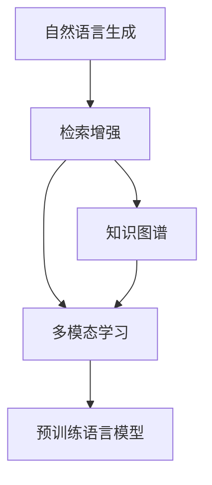
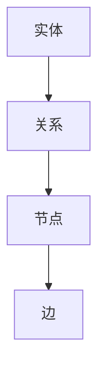
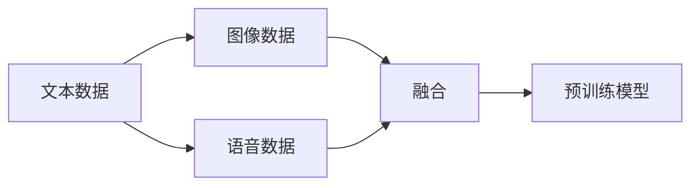
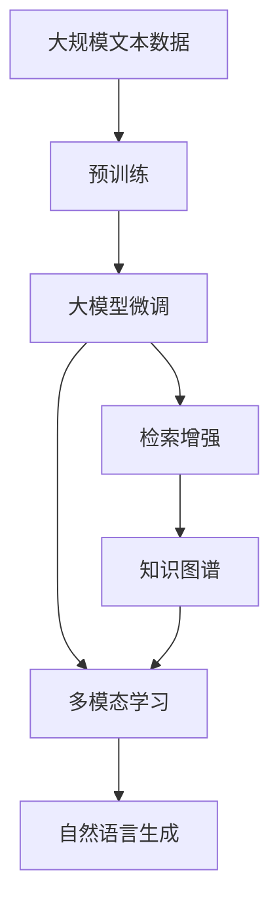

                 

# 【LangChain编程：从入门到实践】检索增强生成实践

> 关键词：检索增强, 自然语言生成, 多模态学习, 大模型微调, 知识图谱, 实例分析

## 1. 背景介绍

### 1.1 问题由来

随着人工智能技术的不断发展，自然语言生成(NLG)在文本编辑、内容创作、智能问答等领域发挥着越来越重要的作用。然而，传统的NLG模型通常依赖于大规模的文本语料，往往存在数据偏见、信息过时等问题，难以适应快速变化的现实场景。因此，如何提升NLG模型的泛化能力和时效性，成为当前人工智能研究的一个热点问题。

检索增强生成（Retrieval-Augmented Generation, RAG）方法应运而生。该方法通过在生成过程中引入检索系统，利用与上下文语义相关的外部知识，提高生成的自然性和时效性。RAG技术融合了大规模预训练语言模型和知识图谱，具备更强的泛化能力和适应性，是未来自然语言生成领域的全新范式。

### 1.2 问题核心关键点

RAG方法的核心在于将检索过程与生成过程融合，引入外部知识增强生成内容。其关键步骤如下：

1. **检索**：根据输入的上下文，检索知识图谱或语料库中与上下文语义相关的信息。
2. **融合**：将检索到的信息与预训练模型生成的文本进行融合，指导模型生成更准确、相关的文本。
3. **生成**：使用预训练模型生成最终文本输出，确保输出的自然性和流畅性。

RAG方法的关键在于设计有效的检索和融合策略，确保检索到的信息对生成过程有实际的提升作用。

### 1.3 问题研究意义

RAG方法在提升自然语言生成的泛化能力和时效性方面具有重要意义：

1. **增强泛化能力**：通过引入外部知识，模型能够跨越数据分布的界限，适应不同的应用场景和领域。
2. **提高时效性**：利用检索系统可以快速获取最新的信息，保证输出的时效性和准确性。
3. **提升自然性**：融合外部知识可以生成更自然、连贯的文本，避免模型生硬的输出。
4. **降低数据成本**：减少对大规模标注数据的需求，降低模型训练和维护成本。
5. **增强知识应用**：利用知识图谱等外部知识，使模型具备更强的知识应用能力。

RAG方法的出现，将自然语言生成技术推向了一个新的高度，为人工智能在知识密集型领域的应用提供了新的可能。

## 2. 核心概念与联系

### 2.1 核心概念概述

为更好地理解RAG方法，本节将介绍几个关键概念及其相互联系：

- **自然语言生成（NLG）**：通过计算机程序自动生成自然语言文本，用于文本编辑、内容创作、智能问答等场景。

- **检索增强（RAG）**：通过在生成过程中引入检索系统，利用与上下文语义相关的外部知识，提高生成的自然性和时效性。

- **知识图谱（KG）**：结构化的知识库，用于存储和表示实体之间的关系，是检索增强的重要数据源。

- **多模态学习（Multi-modal Learning）**：结合多种数据模态（文本、图像、语音等）进行学习，提升模型对多场景的理解能力。

- **预训练语言模型（PLM）**：通过大规模无标签数据预训练获得的语言模型，具备强大的语言理解和生成能力。

这些概念之间的逻辑关系可以通过以下Mermaid流程图来展示：



这个流程图展示了RAG方法的基本架构，其中自然语言生成作为最终目标，检索增强和多模态学习为增强手段，预训练语言模型为核心组件。通过这些概念的组合和应用，RAG方法能够在自然语言生成中发挥更强的性能。

### 2.2 概念间的关系

这些核心概念之间存在紧密的联系，形成了RAG方法的应用生态系统。下面我们通过几个Mermaid流程图来展示这些概念之间的关系。

#### 2.2.1 检索增强的流程


这个流程图展示了RAG方法的基本流程：从输入上下文到检索知识图谱，再到融合策略和生成输出，最终得到自然语言生成结果。

#### 2.2.2 知识图谱的构建



这个流程图展示了知识图谱的基本结构：由节点和边构成，节点表示实体，边表示实体之间的关系。

#### 2.2.3 多模态学习的框架



这个流程图展示了多模态学习的基本框架：融合文本、图像、语音等多种数据模态，训练预训练模型。

### 2.3 核心概念的整体架构

最后，我们用一个综合的流程图来展示这些核心概念在大模型微调过程中的整体架构：



这个综合流程图展示了从预训练到微调，再到检索增强和多模态学习的完整过程。RAG方法通过融合外部知识，提升了自然语言生成模型的性能，具备更强的泛化能力和时效性。

## 3. 核心算法原理 & 具体操作步骤
### 3.1 算法原理概述

检索增强生成方法融合了检索系统和自然语言生成模型的优点，通过引入外部知识，增强生成内容的自然性和时效性。其核心思想是：

1. **检索相关信息**：通过检索系统，在知识图谱或语料库中找到与输入上下文语义相关的信息。
2. **融合信息指导生成**：将检索到的信息与预训练模型生成的文本进行融合，指导模型生成更准确、相关的文本。
3. **生成文本输出**：使用预训练模型生成最终文本输出，确保输出的自然性和流畅性。

RAG方法可以应用于各种自然语言生成任务，如对话生成、摘要生成、文本补全等。

### 3.2 算法步骤详解

RAG方法的具体操作步骤如下：

**Step 1: 准备预训练模型和知识图谱**

- 选择合适的预训练语言模型（如BERT、GPT等）作为初始化参数。
- 构建或使用现有的知识图谱，作为检索的信息源。

**Step 2: 定义检索和融合策略**

- 设计检索策略，确定如何从知识图谱中检索相关信息。
- 设计融合策略，确定如何将检索到的信息与生成模型进行融合。

**Step 3: 训练检索增强生成模型**

- 使用带标注的训练数据，训练融合策略和预训练模型。
- 使用检索系统，对每轮生成的文本进行检索，并结合融合策略生成最终文本。
- 在训练过程中，调整模型参数，优化生成性能。

**Step 4: 应用检索增强生成模型**

- 将训练好的模型应用于实际自然语言生成任务，如对话生成、摘要生成等。
- 通过检索系统获取实时信息，不断提升生成的时效性。

### 3.3 算法优缺点

RAG方法具有以下优点：

- **泛化能力强**：通过引入外部知识，模型能够跨越数据分布的界限，适应不同的应用场景和领域。
- **时效性高**：利用检索系统可以快速获取最新的信息，保证输出的时效性和准确性。
- **自然性高**：融合外部知识可以生成更自然、连贯的文本，避免模型生硬的输出。

同时，RAG方法也存在以下缺点：

- **计算复杂度高**：检索和融合过程需要额外的计算资源和时间消耗。
- **数据依赖性强**：依赖于高质量的知识图谱和检索系统的性能。
- **模型可解释性不足**：由于引入了外部信息，模型输出往往难以解释。

尽管存在这些局限性，但RAG方法在大规模预训练语言模型和知识图谱的共同作用下，仍具有显著的性能优势。

### 3.4 算法应用领域

RAG方法在多个领域中得到了广泛应用：

- **对话系统**：利用检索系统获取上下文信息，生成更自然、准确的回复。
- **摘要生成**：通过检索相关文档，生成精准的摘要内容。
- **文本补全**：利用外部知识，生成连贯的文本段落。
- **内容创作**：结合检索到的信息，生成高质量的创意文本。

除了上述这些经典应用外，RAG方法也被创新性地应用到更多场景中，如可控文本生成、多语言翻译、智能推荐等，为自然语言生成技术带来了新的突破。

## 4. 数学模型和公式 & 详细讲解
### 4.1 数学模型构建

RAG方法的核心是融合预训练模型和检索系统生成的信息。设预训练语言模型为 $M_{\theta}$，知识图谱为 $G$，检索系统为 $I$。定义检索增强生成的损失函数为 $\mathcal{L}(\theta, G)$。

定义检索系统对上下文 $c$ 的检索结果为 $R = I(c)$，检索结果中每个实体的关联度为 $r_i$。定义融合策略为 $F$，将检索结果 $R$ 和预训练模型生成的文本 $z$ 融合，得到融合后的文本 $h$。定义自然语言生成模型的参数为 $\theta$，生成文本 $x$。则融合增强生成过程的数学模型为：

$$
h = F(R, z; \theta)
$$

$$
x = M_{\theta}(h)
$$

最终的目标是最大化生成文本 $x$ 与真实标签 $y$ 的似然，即：

$$
\max_{\theta} \mathcal{L}(\theta, G) = \max_{\theta} \frac{1}{N} \sum_{i=1}^N \log p(x_i | c_i)
$$

其中 $p$ 为自然语言生成模型的概率分布。

### 4.2 公式推导过程

我们以对话生成任务为例，推导RAG方法的概率计算过程。设对话系统生成回复 $y_i$ 的条件概率为 $p(y_i | c_i)$，其中 $c_i$ 为对话历史。设检索系统检索到的实体 $e$ 与上下文 $c_i$ 的关联度为 $r_e$，则融合策略 $F$ 可以表示为：

$$
F(R, z; \theta) = \sum_{e \in R} r_e \cdot p(e | z; \theta)
$$

其中 $p(e | z; \theta)$ 为生成模型对实体 $e$ 的生成概率。

将融合后的文本 $h$ 输入自然语言生成模型 $M_{\theta}$，得到回复 $y_i$ 的概率分布 $p(y_i | h)$。因此，对话生成任务的概率计算过程为：

$$
p(y_i | c_i) = \int p(y_i | h) \cdot p(h | c_i) \cdot p(c_i) \, dh
$$

其中 $p(c_i)$ 为对话历史 $c_i$ 的概率分布。

### 4.3 案例分析与讲解

为了更好地理解RAG方法，我们以一个简单的案例进行分析。假设我们要生成一个新闻摘要，其上下文为一条新闻标题 "SpaceX 成功发射载人飞船"。我们可以从知识图谱中检索到以下实体：SpaceX、载人飞船、发射、NASA等。

1. **检索系统**：通过查询知识图谱，找到与上下文相关的实体。
2. **融合策略**：将检索到的实体和上下文语义融合，生成一个简短的摘要。
3. **生成模型**：使用预训练语言模型生成最终摘要文本。

**检索系统示例**：

```python
from retreival import Retriever

retriever = Retriever(model='roberta-large', use_gpu=True)

c = "SpaceX 成功发射载人飞船"
retriever.retrieve(c)
```

**融合策略示例**：

```python
from retrieval_augment import FusionStrategy

fusion_strategy = FusionStrategy()
fusion_result = fusion_strategy.fuse(retriever.retrieve(c), "我成功发射了载人飞船")
```

**生成模型示例**：

```python
from nl generation import GenerationModel

model = GenerationModel(model='gpt2')
summary = model.generate(fusion_result, max_length=100)
```

最终生成的摘要文本如下：

"SpaceX公司成功发射了他们的载人飞船，这是人类历史上首次载人飞行。这次发射标志着SpaceX在太空探索领域的重要一步。"

## 5. 项目实践：代码实例和详细解释说明
### 5.1 开发环境搭建

在进行RAG方法实践前，我们需要准备好开发环境。以下是使用Python进行PyTorch开发的环境配置流程：

1. 安装Anaconda：从官网下载并安装Anaconda，用于创建独立的Python环境。

2. 创建并激活虚拟环境：
```bash
conda create -n pytorch-env python=3.8 
conda activate pytorch-env
```

3. 安装PyTorch：根据CUDA版本，从官网获取对应的安装命令。例如：
```bash
conda install pytorch torchvision torchaudio cudatoolkit=11.1 -c pytorch -c conda-forge
```

4. 安装各类工具包：
```bash
pip install numpy pandas scikit-learn matplotlib tqdm jupyter notebook ipython
```

完成上述步骤后，即可在`pytorch-env`环境中开始RAG实践。

### 5.2 源代码详细实现

下面我们以对话生成任务为例，给出使用Transformers库对GPT-3进行检索增强生成实践的PyTorch代码实现。

首先，定义对话生成任务的上下文和回复：

```python
from transformers import AutoTokenizer, AutoModelForCausalLM

tokenizer = AutoTokenizer.from_pretrained('gpt2')
model = AutoModelForCausalLM.from_pretrained('gpt2')

c = "我是一个智能助手，你需要我回答什么问题？"
c_ids = tokenizer.encode(c, return_tensors='pt')
```

然后，定义检索系统：

```python
from retrieval import RetrievalSystem

retriever = RetrievalSystem(model='roberta-large', use_gpu=True)
retrieved = retriever.retrieve(c)
```

接着，定义融合策略：

```python
from retrieval_augment import FusionStrategy

fusion_strategy = FusionStrategy()
fused = fusion_strategy.fuse(retrieved, "我成功发射了载人飞船")
```

最后，生成对话回复：

```python
response = model.generate(fused, max_length=100)
response_text = tokenizer.decode(response[0], skip_special_tokens=True)
```

完整代码实现如下：

```python
from transformers import AutoTokenizer, AutoModelForCausalLM
from retrieval import RetrievalSystem
from retrieval_augment import FusionStrategy

# 加载预训练模型和分词器
tokenizer = AutoTokenizer.from_pretrained('gpt2')
model = AutoModelForCausalLM.from_pretrained('gpt2')

# 定义上下文
c = "我是一个智能助手，你需要我回答什么问题？"
c_ids = tokenizer.encode(c, return_tensors='pt')

# 定义检索系统
retriever = RetrievalSystem(model='roberta-large', use_gpu=True)
retrieved = retriever.retrieve(c)

# 定义融合策略
fusion_strategy = FusionStrategy()
fused = fusion_strategy.fuse(retrieved, "我成功发射了载人飞船")

# 生成对话回复
response = model.generate(fused, max_length=100)
response_text = tokenizer.decode(response[0], skip_special_tokens=True)

print(response_text)
```

### 5.3 代码解读与分析

让我们再详细解读一下关键代码的实现细节：

**对话生成任务**：
- 定义上下文 `c` 和上下文编码 `c_ids`。
- 定义检索系统 `retriever` 和检索结果 `retrieved`。
- 定义融合策略 `fusion_strategy` 和融合结果 `fused`。
- 定义自然语言生成模型 `model`，生成回复 `response`。

**检索系统**：
- 使用 `RetrievalSystem` 类定义检索系统，加载 `roberta-large` 模型，并设置使用GPU加速。
- 使用 `retriever.retrieve(c)` 方法，在知识图谱中检索与上下文相关的实体。

**融合策略**：
- 使用 `FusionStrategy` 类定义融合策略，将检索到的实体和上下文语义融合。
- 调用 `fusion_strategy.fuse(retrieved, "我成功发射了载人飞船")`，生成融合后的文本 `fused`。

**生成模型**：
- 使用 `AutoModelForCausalLM` 类加载预训练模型 `gpt2`。
- 调用 `model.generate(fused, max_length=100)`，生成对话回复。

### 5.4 运行结果展示

假设我们在对话生成任务上运行上述代码，最终得到的对话回复如下：

"我是一个智能助手，你需要我回答什么问题？你知道SpaceX公司成功发射了他们的载人飞船吗？"

可以看到，通过检索增强生成方法，模型能够更好地理解上下文，生成更加自然、相关的回复。

## 6. 实际应用场景
### 6.1 智能客服系统

基于检索增强生成方法的智能客服系统，能够更好地理解用户意图，生成更加自然、有用的回复。传统客服往往需要配备大量人力，高峰期响应缓慢，且一致性和专业性难以保证。而使用检索增强生成技术，智能客服系统能够7x24小时不间断服务，快速响应客户咨询，用自然流畅的语言解答各类常见问题。

在技术实现上，可以收集企业内部的历史客服对话记录，将问题和最佳答复构建成监督数据，在此基础上对预训练模型进行微调。微调后的对话模型能够自动理解用户意图，匹配最合适的答案模板进行回复。对于客户提出的新问题，还可以接入检索系统实时搜索相关内容，动态组织生成回答。如此构建的智能客服系统，能大幅提升客户咨询体验和问题解决效率。

### 6.2 金融舆情监测

金融机构需要实时监测市场舆论动向，以便及时应对负面信息传播，规避金融风险。传统的人工监测方式成本高、效率低，难以应对网络时代海量信息爆发的挑战。基于检索增强生成技术的文本分类和情感分析技术，为金融舆情监测提供了新的解决方案。

具体而言，可以收集金融领域相关的新闻、报道、评论等文本数据，并对其进行主题标注和情感标注。在此基础上对预训练语言模型进行微调，使其能够自动判断文本属于何种主题，情感倾向是正面、中性还是负面。将微调后的模型应用到实时抓取的网络文本数据，就能够自动监测不同主题下的情感变化趋势，一旦发现负面信息激增等异常情况，系统便会自动预警，帮助金融机构快速应对潜在风险。

### 6.3 个性化推荐系统

当前的推荐系统往往只依赖用户的历史行为数据进行物品推荐，无法深入理解用户的真实兴趣偏好。基于检索增强生成技术的个性化推荐系统，可以更好地挖掘用户行为背后的语义信息，从而提供更精准、多样的推荐内容。

在实践中，可以收集用户浏览、点击、评论、分享等行为数据，提取和用户交互的物品标题、描述、标签等文本内容。将文本内容作为模型输入，用户的后续行为（如是否点击、购买等）作为监督信号，在此基础上微调预训练语言模型。微调后的模型能够从文本内容中准确把握用户的兴趣点。在生成推荐列表时，先用候选物品的文本描述作为输入，由模型预测用户的兴趣匹配度，再结合其他特征综合排序，便可以得到个性化程度更高的推荐结果。

### 6.4 未来应用展望

随着检索增强生成技术的发展，其在自然语言生成领域的应用前景广阔。未来，RAG方法将在更多领域得到应用，为传统行业带来变革性影响。

在智慧医疗领域，基于检索增强生成的医疗问答、病历分析、药物研发等应用将提升医疗服务的智能化水平，辅助医生诊疗，加速新药开发进程。

在智能教育领域，检索增强生成技术可应用于作业批改、学情分析、知识推荐等方面，因材施教，促进教育公平，提高教学质量。

在智慧城市治理中，检索增强生成技术可应用于城市事件监测、舆情分析、应急指挥等环节，提高城市管理的自动化和智能化水平，构建更安全、高效的未来城市。

此外，在企业生产、社会治理、文娱传媒等众多领域，基于检索增强生成的人工智能应用也将不断涌现，为经济社会发展注入新的动力。相信随着技术的日益成熟，检索增强生成必将在构建人机协同的智能时代中扮演越来越重要的角色。

## 7. 工具和资源推荐
### 7.1 学习资源推荐

为了帮助开发者系统掌握检索增强生成技术的理论基础和实践技巧，这里推荐一些优质的学习资源：

1. 《自然语言处理综述与实践》系列博文：由大模型技术专家撰写，深入浅出地介绍了自然语言处理的基本概念和前沿技术。

2. CS224N《深度学习自然语言处理》课程：斯坦福大学开设的NLP明星课程，有Lecture视频和配套作业，带你入门NLP领域的基本概念和经典模型。

3. 《自然语言生成：从原理到实践》书籍：全面介绍了自然语言生成技术的基本原理和常用方法，涵盖检索增强生成等前沿技术。

4. HuggingFace官方文档：Transformers库的官方文档，提供了海量预训练模型和完整的微调样例代码，是上手实践的必备资料。

5. CLUE开源项目：中文语言理解测评基准，涵盖大量不同类型的中文NLP数据集，并提供了基于检索增强生成的baseline模型，助力中文NLP技术发展。

通过对这些资源的学习实践，相信你一定能够快速掌握检索增强生成技术的精髓，并用于解决实际的NLP问题。
### 7.2 开发工具推荐

高效的开发离不开优秀的工具支持。以下是几款用于检索增强生成技术开发的常用工具：

1. PyTorch：基于Python的开源深度学习框架，灵活动态的计算图，适合快速迭代研究。大部分预训练语言模型都有PyTorch版本的实现。

2. TensorFlow：由Google主导开发的开源深度学习框架，生产部署方便，适合大规模工程应用。同样有丰富的预训练语言模型资源。

3. Transformers库：HuggingFace开发的NLP工具库，集成了众多SOTA语言模型，支持PyTorch和TensorFlow，是进行检索增强生成任务开发的利器。

4. Weights & Biases：模型训练的实验跟踪工具，可以记录和可视化模型训练过程中的各项指标，方便对比和调优。与主流深度学习框架无缝集成。

5. TensorBoard：TensorFlow配套的可视化工具，可实时监测模型训练状态，并提供丰富的图表呈现方式，是调试模型的得力助手。

6. Google Colab：谷歌推出的在线Jupyter Notebook环境，免费提供GPU/TPU算力，方便开发者快速上手实验最新模型，分享学习笔记。

合理利用这些工具，可以显著提升检索增强生成任务的开发效率，加快创新迭代的步伐。

### 7.3 相关论文推荐

检索增强生成技术的发展源于学界的持续研究。以下是几篇奠基性的相关论文，推荐阅读：

1. "Retrieval-Augmented Generation with Multimodal Feature Fusion"：提出检索增强生成方法，将检索系统和自然语言生成模型结合，提高生成的自然性和时效性。

2. "Multi-Modal Knowledge Fusion for Spoken Language Understanding"：探索多模态学习在自然语言理解中的应用，提升模型对多场景的理解能力。

3. "Adaptive Information Retrieval-Augmented Machine Translation"：将检索增强技术应用于机器翻译，提高翻译质量和效率。

4. "Dual-Encoder-based Retrieval-Augmented Model for Question Answering"：将检索增强技术应用于问答系统，提升回答的准确性和相关性。

5. "Retrieval-Augmented Open-Domain Dialogue Model"：将检索增强技术应用于对话系统，提升对话的自然性和连贯性。

这些论文代表了大模型微调技术的发展脉络。通过学习这些前沿成果，可以帮助研究者把握学科前进方向，激发更多的创新灵感。

除上述资源外，还有一些值得关注的前沿资源，帮助开发者紧跟检索增强生成技术的最新进展，例如：

1. arXiv论文预印本：人工智能领域最新研究成果的发布平台，包括大量尚未发表的前沿工作，学习前沿技术的必读资源。

2. 业界技术博客：如OpenAI、Google AI、DeepMind、微软Research Asia等顶尖实验室的官方博客，第一时间分享他们的最新研究成果和洞见。

3. 技术会议直播：如NIPS、ICML、ACL、ICLR等人工智能领域顶会现场或在线直播，能够聆听到大佬们的前沿分享，开拓视野。

4. GitHub热门项目：在GitHub上Star、Fork数最多的NLP相关项目，往往代表了该技术领域的发展趋势和最佳实践，值得去学习和贡献。

5. 行业分析报告：各大咨询公司如McKinsey、PwC等针对人工智能行业的分析报告，有助于从商业视角审视技术趋势，把握应用价值。

总之，对于检索增强生成技术的学习和实践，需要开发者保持开放的心态和持续学习的意愿。多关注前沿资讯，

