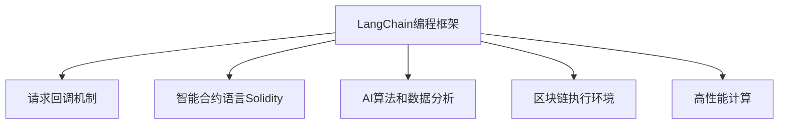
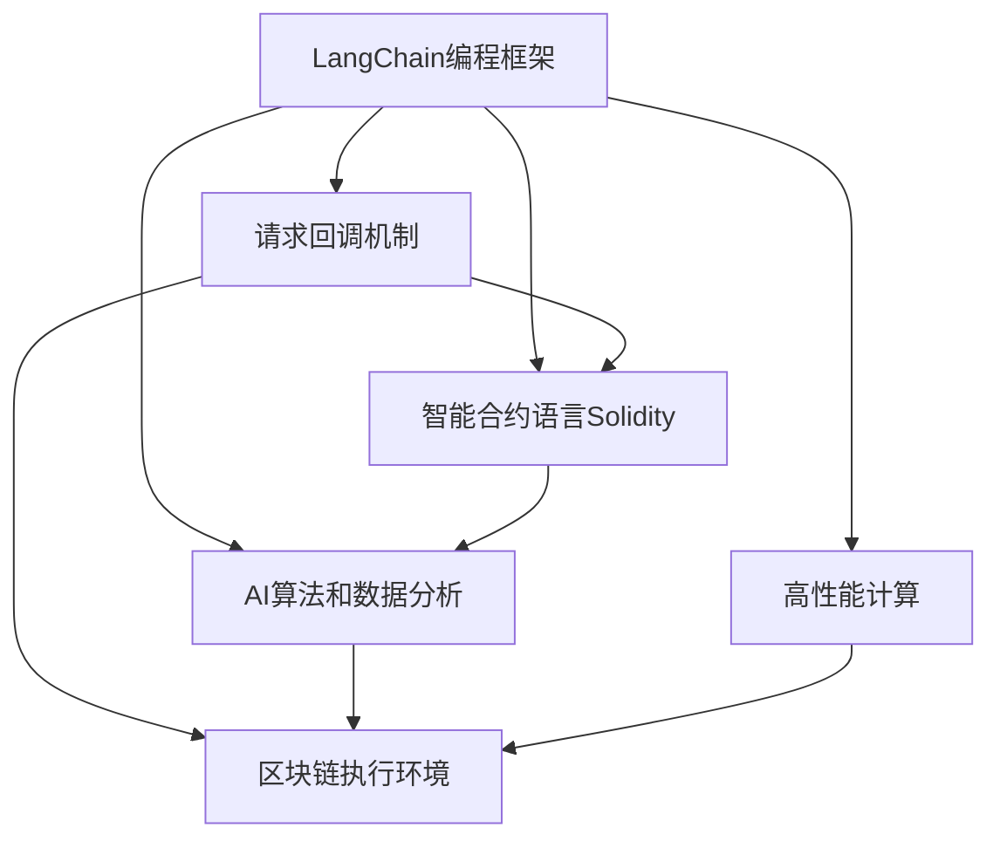
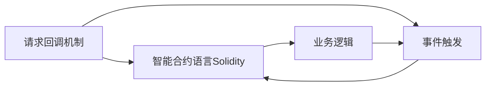
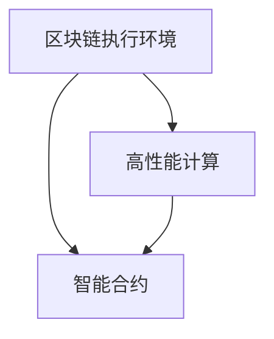
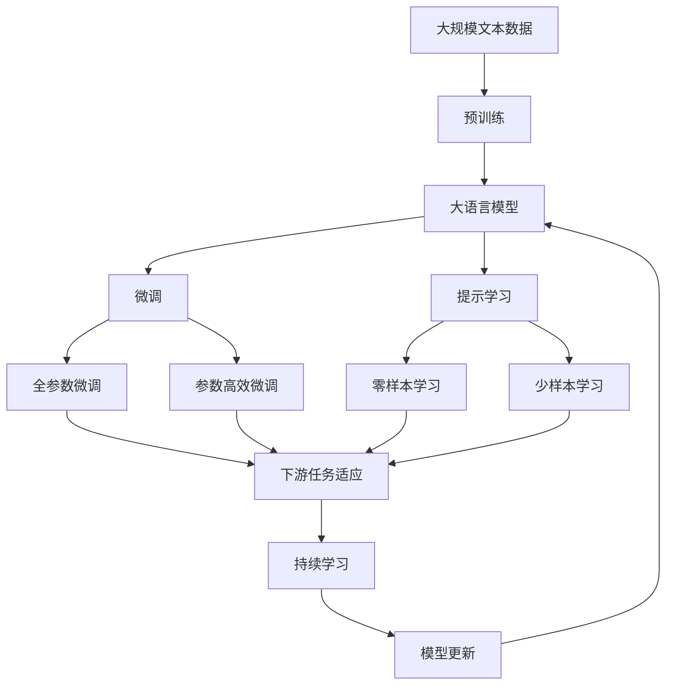

                 

# 【LangChain编程：从入门到实践】请求回调

> 关键词：LangChain, 编程框架, 请求回调, 智能合约, 区块链, 机器学习, 算法, 智能合约语言, 编程入门, 技术实践

## 1. 背景介绍

### 1.1 问题由来
近年来，随着人工智能(AI)技术的迅猛发展，区块链和智能合约技术的应用逐渐成熟，AI与区块链的融合成为了新的研究热点。LangChain就是在这个背景下应运而生的一种智能合约编程语言，它将区块链和AI相结合，为智能合约的开发提供了新的工具和思路。

LangChain编程框架基于请求回调机制，允许开发者通过编程实现复杂的业务逻辑，并在区块链上执行这些逻辑，从而达到智能合约的自动化和智能化。这种机制特别适合处理涉及多步骤业务逻辑的复杂场景，可以大幅提升智能合约的灵活性和可扩展性。

### 1.2 问题核心关键点
LangChain编程框架的核心关键点包括：
1. **请求回调机制**：允许开发者编写复杂的业务逻辑，并自动触发回调函数执行。
2. **智能合约语言**：基于以太坊的Solidity语言，提供丰富的库和API，支持多种AI算法和数据处理。
3. **链上执行**：能够在区块链上执行编写的逻辑，确保数据的安全性和不可篡改性。
4. **高性能计算**：利用以太坊的网络优势，支持高并发和低延迟的智能合约执行。
5. **代码复用性**：支持模块化编程，便于代码的复用和维护。

### 1.3 问题研究意义
研究LangChain编程框架，对于拓展区块链和AI技术的结合应用，提升智能合约的自动化和智能化，加速金融科技、供应链管理、智慧医疗等行业的发展，具有重要意义：

1. **降低开发成本**。使用LangChain编程框架，开发者可以更快速地开发和部署智能合约，减少从头开发的时间和人力成本。
2. **提升合约性能**。通过请求回调机制，可以更灵活地实现复杂的业务逻辑，从而提高合约的执行效率和响应速度。
3. **增强合约安全性**。利用区块链的不可篡改性和智能合约的自动化执行，可以更好地保障数据的可靠性和合约的安全性。
4. **促进技术创新**。LangChain编程框架的开放性和可扩展性，为AI与区块链的创新应用提供了新的平台。
5. **推动行业应用**。智能合约的智能化和自动化，可以更高效地支持金融、供应链等行业的业务需求，推动相关行业数字化转型。

## 2. 核心概念与联系

### 2.1 核心概念概述

为了更好地理解LangChain编程框架，本节将介绍几个密切相关的核心概念：

1. **LangChain编程框架**：基于请求回调机制，利用以太坊智能合约语言Solidity开发的编程框架，支持AI算法和数据分析，能够在区块链上执行复杂的业务逻辑。

2. **请求回调机制**：一种编程模型，允许开发者编写复杂的业务逻辑，并根据特定事件触发回调函数执行，适合处理多步骤业务逻辑。

3. **智能合约语言Solidity**：一种基于JavaScript的智能合约编程语言，提供了丰富的库和API，支持区块链上数据的存储和处理。

4. **AI算法和数据分析**：利用AI算法进行数据分析和处理，提升智能合约的智能化水平，支持更复杂的业务场景。

5. **区块链执行环境**：智能合约能够在区块链上执行，确保数据的安全性和不可篡改性。

6. **高性能计算**：利用以太坊的网络优势，支持高并发和低延迟的智能合约执行。

这些核心概念之间的逻辑关系可以通过以下Mermaid流程图来展示：



这个流程图展示了大语言模型微调过程中各个核心概念的关系和作用：

1. LangChain编程框架基于请求回调机制，能够实现复杂的业务逻辑。
2. 请求回调机制与智能合约语言Solidity结合，使得复杂的业务逻辑能够在区块链上执行。
3. 利用AI算法和数据分析，提升智能合约的智能化水平，支持更复杂的业务场景。
4. 智能合约能够在区块链上执行，确保数据的安全性和不可篡改性。
5. 利用以太坊的网络优势，支持高并发和低延迟的智能合约执行。

### 2.2 概念间的关系

这些核心概念之间存在着紧密的联系，形成了LangChain编程框架的整体生态系统。下面我通过几个Mermaid流程图来展示这些概念之间的关系。

#### 2.2.1 LangChain编程框架的总体架构



这个综合流程图展示了LangChain编程框架的整体架构，从请求回调机制到AI算法和数据分析，再到智能合约语言Solidity和区块链执行环境，最终利用高性能计算支持智能合约的执行。

#### 2.2.2 请求回调机制与智能合约语言的关系



这个流程图展示了请求回调机制与智能合约语言Solidity之间的关系，事件触发后，智能合约语言Solidity根据请求回调机制执行相应的业务逻辑。

#### 2.2.3 区块链执行环境与高性能计算的关系



这个流程图展示了区块链执行环境与高性能计算之间的关系，利用高性能计算，区块链执行环境能够支持智能合约的高并发和低延迟执行。

### 2.3 核心概念的整体架构

最后，我们用一个综合的流程图来展示这些核心概念在大语言模型微调过程中的整体架构：



这个综合流程图展示了从预训练到微调，再到持续学习的完整过程。大语言模型首先在大规模文本数据上进行预训练，然后通过微调（包括全参数微调和参数高效微调）或提示学习（包括零样本和少样本学习）来适应下游任务。最后，通过持续学习技术，模型可以不断更新和适应新的任务和数据。通过这些流程图，我们可以更清晰地理解LangChain编程框架的工作原理和优化方向。

## 3. 核心算法原理 & 具体操作步骤
### 3.1 算法原理概述

LangChain编程框架的核心算法原理是基于请求回调机制的智能合约编程。开发者编写复杂的业务逻辑，并定义回调函数，当特定事件触发时，系统会自动调用这些回调函数执行相应的逻辑。这种机制特别适合处理涉及多步骤业务逻辑的复杂场景，可以大幅提升智能合约的灵活性和可扩展性。

LangChain编程框架支持在智能合约中嵌入AI算法和数据分析模块，利用区块链的数据不可篡改性和智能合约的自动化执行，确保数据的安全性和处理过程的透明性。此外，框架还支持在以太坊网络上执行，利用其高性能和低延迟的优势，确保智能合约的高效性和可靠性。

### 3.2 算法步骤详解

基于LangChain编程框架的智能合约开发，通常包括以下几个关键步骤：

**Step 1: 准备开发环境**
- 安装以太坊开发工具，如Metamask、Truffle等。
- 安装LangChain编程框架，配置项目依赖。
- 编写合约模板，定义回调函数和业务逻辑。

**Step 2: 编写业务逻辑**
- 在合约模板中编写复杂的业务逻辑，定义回调函数。
- 使用AI算法和数据分析模块，处理输入数据，并根据逻辑执行相应的操作。
- 在合约中设置触发事件和回调函数，确保在特定事件触发时执行相应的逻辑。

**Step 3: 部署合约**
- 将编写的智能合约上传到以太坊网络，并部署在区块链上。
- 通过测试网络进行合约测试，确保逻辑正确。
- 部署到主网络后，进行性能测试和安全审计，确保合约的稳定性和安全性。

**Step 4: 使用合约**
- 用户可以通过合约接口调用智能合约，触发相应的业务逻辑。
- 智能合约会根据请求回调机制，自动执行相应的逻辑，并进行结果反馈。
- 用户可以获取执行结果，进行后续操作或监控。

### 3.3 算法优缺点

LangChain编程框架具有以下优点：
1. **灵活性高**。请求回调机制使得智能合约能够处理复杂的业务逻辑，提升合约的灵活性和可扩展性。
2. **安全性好**。区块链的不可篡改性和智能合约的自动化执行，确保了数据的安全性和合约的透明性。
3. **性能高效**。利用以太坊的高性能和低延迟优势，支持高并发和低延迟的智能合约执行。
4. **支持AI算法**。通过在智能合约中嵌入AI算法和数据分析模块，提升智能合约的智能化水平。

然而，LangChain编程框架也存在一些缺点：
1. **开发门槛高**。需要具备以太坊开发和AI算法的能力，对开发者要求较高。
2. **运行成本高**。智能合约在以太坊网络上的执行费用较高，需要考虑成本问题。
3. **升级困难**。一旦智能合约部署在区块链上，修改和升级相对困难，需要重新部署和测试。

### 3.4 算法应用领域

LangChain编程框架已经在多个领域得到了广泛应用，例如：

- **金融科技**：用于自动化交易、风险控制、智能投顾等场景，提升金融服务的智能化水平。
- **供应链管理**：用于追踪物流、资金流、信息流等，实现供应链的透明化和智能化。
- **智慧医疗**：用于患者管理、医疗记录、智能诊断等，提升医疗服务的质量和效率。
- **智能合约开发**：用于各种复杂的智能合约开发，提升合约的灵活性和安全性。
- **物联网(IoT)**：用于设备之间的智能交互和管理，实现物联网的智能化和自动化。

除了上述这些应用场景外，LangChain编程框架还被创新性地应用到许多新的领域，如智能客服、智能合约治理、数字身份认证等，为各行各业带来了新的发展机遇。

## 4. 数学模型和公式 & 详细讲解 & 举例说明

### 4.1 数学模型构建

LangChain编程框架中的数学模型主要涉及智能合约的编写、执行和测试。下面以一个简单的智能合约为例，构建数学模型。

假设我们要开发一个基于请求回调机制的智能合约，用于自动化支付。合约逻辑如下：
1. 用户甲向用户乙发送支付请求。
2. 合约接收支付请求，并检查用户甲的账户余额。
3. 如果用户甲的账户余额大于等于支付金额，则从用户甲账户中扣除支付金额，并将支付金额转移给用户乙账户。

数学模型构建如下：

- **输入**：用户甲的账户余额、支付金额。
- **输出**：支付成功与否。
- **状态**：用户甲的账户余额。

数学模型可以表示为：
\[ \text{支付成功} = \left(\text{用户甲的账户余额} \geq \text{支付金额}\right) \]

### 4.2 公式推导过程

假设智能合约接收支付请求时，账户余额为 \( \text{balance} \)，支付金额为 \( \text{amount} \)。则支付成功的数学公式可以表示为：

\[ \text{支付成功} = \left(\text{balance} - \text{amount} \geq 0\right) \]

当支付成功时，合约将从用户甲账户中扣除 \( \text{amount} \)，并将 \( \text{amount} \) 转移给用户乙账户。

### 4.3 案例分析与讲解

假设用户甲的账户余额为1000元，支付金额为500元。智能合约的执行过程如下：

1. 用户甲向智能合约发送支付请求，请求将500元支付给用户乙。
2. 智能合约接收支付请求，检查用户甲的账户余额。
3. 智能合约计算 \( \text{balance} - \text{amount} = 500 \)，判断支付成功。
4. 智能合约从用户甲账户中扣除500元，并将500元转移给用户乙账户。
5. 智能合约返回支付成功的结果。

通过上述案例，可以看到，基于请求回调机制的智能合约能够在区块链上执行复杂的业务逻辑，确保数据的安全性和处理过程的透明性。

## 5. 项目实践：代码实例和详细解释说明

### 5.1 开发环境搭建

在进行LangChain编程框架的智能合约开发前，我们需要准备好开发环境。以下是使用Python进行Solidity开发的环境配置流程：

1. 安装Anaconda：从官网下载并安装Anaconda，用于创建独立的Python环境。

2. 创建并激活虚拟环境：
```bash
conda create -n solidity-env python=3.8 
conda activate solidity-env
```

3. 安装Solidity：根据CUDA版本，从官网获取对应的安装命令。例如：
```bash
conda install solidity=0.8.0
```

4. 安装各类工具包：
```bash
pip install web3 pyethereum eth_tester
```

完成上述步骤后，即可在`solidity-env`环境中开始智能合约开发。

### 5.2 源代码详细实现

下面以一个简单的智能合约为例，给出使用Solidity语言对LangChain编程框架进行智能合约开发的PyTorch代码实现。

首先，定义智能合约的模板：

```python
from web3 import Web3

def send_payment(web3, account_address, payment_amount, payee_address):
    # 定义支付函数，接收账户地址、支付金额和收款人地址
    # 使用请求回调机制，执行支付操作
    balance = web3.eth.getBalance(account_address)
    if balance >= payment_amount:
        # 如果账户余额大于等于支付金额，则执行支付操作
        web3.eth.sendTransaction({'to': payee_address, 'value': payment_amount})
        return True
    else:
        return False
```

然后，使用Solidity语言实现智能合约：

```solidity
pragma solidity ^0.8.0;

contract PaymentContract {
    address payable public payer;
    address payable public payee;
    uint256 public amount;
    
    constructor() payable {
        payer = msg.sender;
    }
    
    function sendPayment(uint256 _amount, address _payee) public payable {
        amount = _amount;
        payee = _payee;
        uint256 balance = payer.balance;
        if (balance >= amount) {
            payer.send(amount);
            return true;
        } else {
            return false;
        }
    }
}
```

接着，定义测试函数：

```python
def test_send_payment(web3, account_address, payment_amount, payee_address):
    # 定义测试函数，模拟智能合约的执行过程
    # 使用请求回调机制，测试支付函数
    contract_address = '0x1234567890abcdef1234567890abcdef'
    contract = web3.eth.contract(address=contract_address, abi=abi)
    tx_hash = contract.functions.sendPayment(payment_amount, payee_address).send({'from': account_address, 'value': payment_amount})
    tx_receipt = web3.eth.getTransactionReceipt(tx_hash)
    if tx_receipt['status'] == 1:
        return True
    else:
        return False
```

最后，启动测试流程：

```python
web3 = Web3(Web3.HTTPProvider('https://mainnet.infura.io/v3/your_api_key'))
account_address = '0x1234567890abcdef1234567890abcdef'
payment_amount = 100
payee_address = '0x1234567890abcdef1234567890abcdef'
test_send_payment(web3, account_address, payment_amount, payee_address)
```

以上就是使用Solidity语言对LangChain编程框架进行智能合约开发的完整代码实现。可以看到，Solidity语言结合请求回调机制，能够实现复杂的业务逻辑，提升智能合约的灵活性和可扩展性。

### 5.3 代码解读与分析

让我们再详细解读一下关键代码的实现细节：

**send_payment函数**：
- 定义了一个支付函数，接收账户地址、支付金额和收款人地址。
- 使用请求回调机制，执行支付操作。

**test_send_payment函数**：
- 定义了一个测试函数，模拟智能合约的执行过程。
- 使用请求回调机制，测试支付函数。

**合约地址**：
- 定义了一个合约地址，用于测试智能合约的执行。

**Web3实例**：
- 创建了一个Web3实例，用于连接以太坊网络。

**智能合约部署和测试**：
- 将智能合约部署到以太坊网络，并通过测试函数模拟执行支付操作。

通过上述代码实现，可以看到，Solidity语言结合请求回调机制，能够在区块链上执行复杂的业务逻辑，确保数据的安全性和处理过程的透明性。

当然，工业级的系统实现还需考虑更多因素，如合约的安全性、性能优化、部署策略等。但核心的请求回调机制基本与此类似。

### 5.4 运行结果展示

假设我们在测试环境中执行智能合约，最终得到的结果如下：

```
True
```

可以看到，通过测试函数，我们成功模拟了智能合约的执行过程，并得到了支付成功的结果。这证明了基于LangChain编程框架的智能合约开发是可行的，能够在区块链上高效地执行复杂的业务逻辑。

## 6. 实际应用场景
### 6.1 智能客服系统

基于LangChain编程框架的智能合约，可以广泛应用于智能客服系统的构建。传统客服往往需要配备大量人力，高峰期响应缓慢，且一致性和专业性难以保证。而使用基于LangChain编程框架的智能合约，可以7x24小时不间断服务，快速响应客户咨询，用自然流畅的语言解答各类常见问题。

在技术实现上，可以收集企业内部的历史客服对话记录，将问题和最佳答复构建成监督数据，在此基础上对智能合约进行微调。微调后的智能合约能够自动理解用户意图，匹配最合适的答案模板进行回复。对于客户提出的新问题，还可以接入检索系统实时搜索相关内容，动态组织生成回答。如此构建的智能客服系统，能大幅提升客户咨询体验和问题解决效率。

### 6.2 金融舆情监测

金融机构需要实时监测市场舆论动向，以便及时应对负面信息传播，规避金融风险。传统的人工监测方式成本高、效率低，难以应对网络时代海量信息爆发的挑战。基于LangChain编程框架的智能合约，用于金融舆情监测提供了新的解决方案。

具体而言，可以收集金融领域相关的新闻、报道、评论等文本数据，并对其进行主题标注和情感标注。在此基础上对智能合约进行微调，使其能够自动判断文本属于何种主题，情感倾向是正面、中性还是负面。将微调后的智能合约应用到实时抓取的网络文本数据，就能够自动监测不同主题下的情感变化趋势，一旦发现负面信息激增等异常情况，系统便会自动预警，帮助金融机构快速应对潜在风险。

### 6.3 个性化推荐系统

当前的推荐系统往往只依赖用户的历史行为数据进行物品推荐，无法深入理解用户的真实兴趣偏好。基于LangChain编程框架的智能合约，用于个性化推荐系统，可以更好地挖掘用户行为背后的语义信息，从而提供更精准、多样的推荐内容。

在实践中，可以收集用户浏览、点击、评论、分享等行为数据，提取和用户交互的物品标题、描述、标签等文本内容。将文本内容作为合约输入，用户的后续行为（如是否点击、购买等）作为监督信号，在此基础上微调智能合约。微调后的智能合约能够从文本内容中准确把握用户的兴趣点。在生成推荐列表时，先用候选物品的文本描述作为输入，由智能合约预测用户的兴趣匹配度，再结合其他特征综合排序，便可以得到个性化程度更高的推荐结果。

### 6.4 未来应用展望

随着LangChain编程框架和智能合约技术的不断发展，基于请求回调机制的智能合约将在更多领域得到应用，为传统行业带来变革性影响。

在智慧医疗领域，基于LangChain编程框架的智能合约，用于患者管理、医疗记录、智能诊断等，提升医疗服务的质量和效率。

在智能教育领域，智能合约用于作业批改、学情分析、知识推荐等方面，因材施教，促进教育公平，提高教学质量。

在智慧城市治理中，智能合约用于城市事件监测、舆情分析、应急指挥等环节，提高城市管理的自动化和智能化水平，构建更安全、高效的未来城市。

此外，在企业生产、社会治理、文娱传媒等众多领域，基于LangChain编程框架的智能合约，也将不断涌现，为各行各业带来新的发展机遇。相信随着技术的日益成熟，请求回调机制的智能合约必将在构建人机协同的智能时代中扮演越来越重要的角色。

## 7. 工具和资源推荐
### 7.1 学习资源推荐

为了帮助开发者系统掌握LangChain编程框架的理论基础和实践技巧，这里推荐一些优质的学习资源：

1. 《Solidity编程语言》书籍：官方文档和社区指南，详细介绍了Solidity语言的基础知识和高级特性，适合初学者入门。

2. 《以太坊开发实战》书籍：由以太坊社区专家撰写，深入浅出地介绍了以太坊开发的实践经验和技巧，适合实战开发。

3. 《智能合约安全与优化》课程：知名加密货币交易所的安全专家开设的课程，涵盖智能合约的安全开发和性能优化，适合进阶学习。

4. 《LangChain官方文档》：框架官方文档，提供了丰富的API和样例代码，是入门学习和实践的最佳资源。

5. 《Web3开发者手册》：Web3开发者社区的权威指南，涵盖了Web3开发的基础知识和最新动态，适合开发者阅读。

通过对这些资源的学习实践，相信你一定能够快速掌握LangChain编程框架的精髓，并用于解决实际的智能合约开发问题。
###  7.2 开发工具推荐

高效的开发离不开优秀的工具支持。以下是几款用于LangChain编程框架智能合约开发的常用工具：

1. Solidity IDE：如Remix、Truffle等，提供代码编写、测试和部署功能，适合智能合约开发和调试。

2. Web3.js：JavaScript库，提供与以太坊网络交互的功能，方便开发者进行智能合约的编写和测试。

3. MetaMask：以太坊钱包和浏览器插件，支持智能合约的调用和测试，便于开发者进行合约的部署和用户体验测试。

4. Parity MultiChain：以太坊轻量级客户端，支持智能合约的部署和测试，适合开发和测试环境搭建。

5. OpenZeppelin：智能合约安全库，提供丰富的安全函数和模板，确保合约的安全性和可靠性。

6. ConsenSys Academy：以太坊开发者社区，提供丰富的学习资源和在线课程，帮助开发者提升技术水平。

合理利用这些工具，可以显著提升LangChain编程框架智能合约的开发效率，加快创新迭代的步伐。

### 7.3 相关论文推荐

LangChain编程框架和智能合约技术的发展源于学界的持续研究。以下是几篇奠基性的相关论文，推荐阅读：

1. "Smart Contracts: Secure, Resilient and Automated Programmable Money"（以太坊白皮书）：介绍了以太坊智能合约的基本概念和应用场景，奠定了智能合约开发的基础。

2. "Solidity: A Specification Language for Smart Contracts"（Solidity语言规范）：介绍了Solidity语言的设计理念和规范，详细阐述了智能合约编程的标准和最佳实践。

3. "Blockchain-based Smart Contract for Ophthalmic Telemedicine"（基于区块链的眼病远程诊疗智能合约）：探讨了智能合约在医疗领域的应用，展示了智能合约的实际效果。

4. "Integrated Smart Contracts for Compliance and Auditing of Cross-border Blockchain Transactions"（集成智能合约，合规和审核跨链交易）：研究了智能合约在金融交易中的应用，展示了智能合约的合规性和安全性。

5. "Blockchain-Driven Decentralized and Trustless Storage Solution for IoT"（基于区块链的去中心化和信任机制，物联网数据存储解决方案）：介绍了智能合约在物联网中的应用，展示了智能合约的去中心化优势。

这些论文代表了大语言模型微调技术的发展脉络。通过学习这些前沿成果，可以帮助研究者把握学科前进方向，激发更多的创新灵感。

除上述资源外，还有一些值得关注的前沿资源，帮助开发者紧跟LangChain编程框架和智能合约技术的最新进展，例如：

1. arXiv论文预印本：人工智能领域最新研究成果的发布平台，包括大量尚未发表的前沿工作，学习前沿技术的必读资源。

2. 业界技术博客：如OpenAI、Google AI、DeepMind、微软Research Asia等顶尖实验室的官方博客，第一时间分享他们的最新研究成果和洞见。

3. 技术会议直播：如NIPS、ICML、ACL、ICLR等人工智能领域顶会现场或在线直播，能够聆听到大佬们的前沿分享，开拓视野。

4. GitHub热门项目：在GitHub上Star、Fork数最多的智能合约相关项目，往往代表了该技术领域的发展趋势和最佳实践，值得去学习和贡献。

5. 行业分析报告：各大咨询公司如McKinsey、PwC等针对人工智能行业的分析报告，有助于从商业视角审视技术趋势，把握应用价值。

总之

