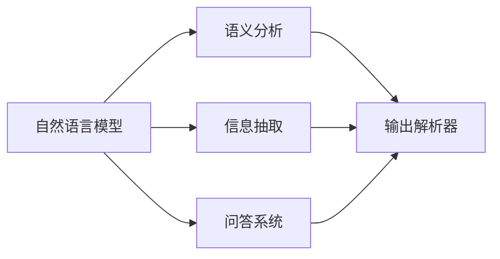
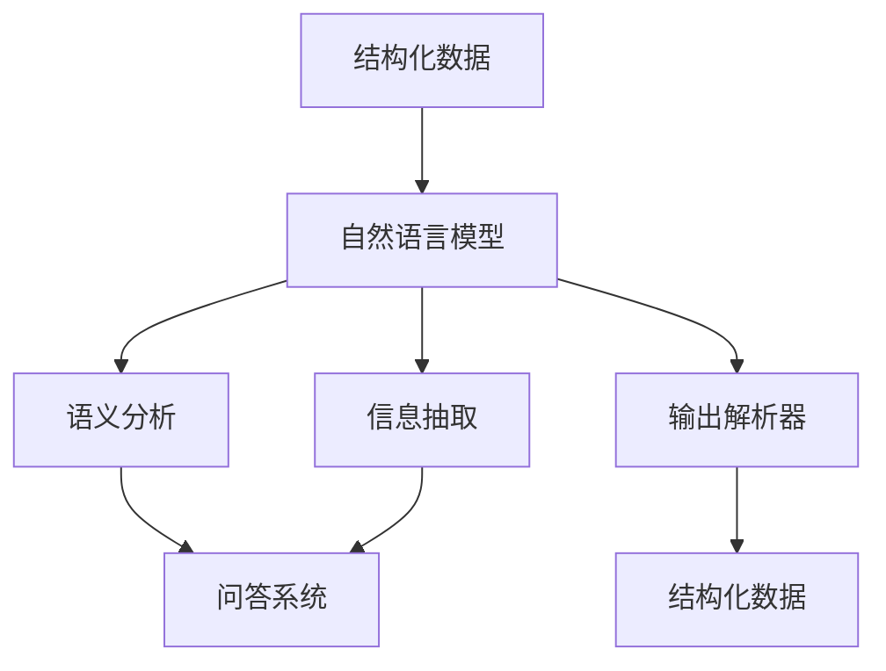

                 

# 【LangChain编程：从入门到实践】输出解析器

> 关键词：输出解析器, LangChain, 自然语言处理(NLP), 编程接口(API), 微服务架构, RESTful API, 软件开发生命周期

## 1. 背景介绍

### 1.1 问题由来
在自然语言处理（NLP）领域，语言模型在理解和生成自然语言方面已经取得了显著的进展。随着语言模型的发展和应用，越来越多复杂的语言任务需要被解决，比如语义分析、信息抽取、问答系统等。这些任务不仅需要模型对语言有深层次的理解，还需要能够将模型的输出转化为易于理解和处理的形式。

输出解析器（Output Parsing）作为自然语言处理中的一个重要环节，旨在将语言模型的输出转换为结构化的数据格式，使得其他系统能够方便地进行后续处理。例如，在问答系统中，输出解析器可以将模型的输出转化为结构化的问答对，方便用户检索和理解；在信息抽取任务中，输出解析器可以将模型提取出的实体信息以结构化的形式展示，便于后续分析和使用。

### 1.2 问题核心关键点
本节将介绍输出解析器的核心概念和原理，并解释其在自然语言处理中的应用。输出解析器的核心目标是：
- 理解自然语言模型输出的含义；
- 将自然语言模型的输出转换为结构化的数据格式；
- 确保转换后的数据格式易于其他系统处理。

## 2. 核心概念与联系

### 2.1 核心概念概述

为了更好地理解输出解析器的原理和应用，我们需要了解以下几个关键概念：

- **自然语言模型（NLG）**：指能够将结构化数据转换为自然语言文本的模型，如GPT-3、BERT等。
- **语义分析**：指对自然语言文本进行语义理解，识别出文本中的实体、关系、事件等。
- **信息抽取**：指从自然语言文本中提取出特定的信息，如人名、地名、组织机构名等。
- **问答系统**：指能够回答用户自然语言提出的问题的系统，如IBM的Watson、Google的对话系统等。
- **输出解析器**：指将自然语言模型的输出转换为结构化数据的工具或算法。

这些概念之间的联系可以通过以下Mermaid流程图来展示：



这个流程图展示了自然语言模型与输出解析器之间的联系：

1. 自然语言模型将结构化数据转换为自然语言文本。
2. 语义分析模块识别文本中的实体和关系。
3. 信息抽取模块从文本中提取出特定的信息。
4. 问答系统回答用户提出的问题。
5. 输出解析器将自然语言模型的输出转换为结构化数据。

### 2.2 概念间的关系

这些概念之间存在紧密的联系，共同构成了自然语言处理的完整流程。下面我们通过几个Mermaid流程图来展示这些概念之间的关系。

#### 2.2.1 自然语言模型与输出解析器


这个流程图展示了自然语言模型和输出解析器之间的基本关系：自然语言模型生成文本，输出解析器将其转换为结构化数据。

#### 2.2.2 问答系统与输出解析器


这个流程图展示了问答系统与输出解析器之间的关系：问答系统回答用户问题，输出解析器将其转换为结构化数据，便于后续处理。

#### 2.2.3 语义分析与信息抽取


这个流程图展示了语义分析与信息抽取之间的关系：语义分析识别文本中的实体和关系，信息抽取则提取出特定的实体信息。

### 2.3 核心概念的整体架构

最后，我们用一个综合的流程图来展示这些核心概念在自然语言处理中的应用：



这个综合流程图展示了自然语言处理从结构化数据到结构化数据的完整流程：

1. 结构化数据输入自然语言模型。
2. 自然语言模型生成自然语言文本。
3. 语义分析模块识别文本中的实体和关系。
4. 信息抽取模块提取出特定的信息。
5. 问答系统回答用户问题。
6. 输出解析器将自然语言模型的输出转换为结构化数据。

通过这些流程图，我们可以更清晰地理解自然语言处理中各模块的功能和相互关系，为深入探讨输出解析器的原理和应用奠定基础。

## 3. 核心算法原理 & 具体操作步骤

### 3.1 算法原理概述
输出解析器的核心原理是将自然语言模型的输出转换为结构化数据。这一过程通常包括以下几个步骤：

1. **解析文本**：将自然语言模型的输出解析为可处理的文本格式。
2. **实体识别**：识别文本中的实体，如人名、地名、组织机构名等。
3. **关系抽取**：识别文本中实体之间的关系，如时间、地点、事件等。
4. **格式化输出**：将解析出的实体和关系格式化为结构化的数据格式，如JSON、XML等。

### 3.2 算法步骤详解

下面以一个简单的示例来说明输出解析器的具体步骤。

假设我们有一个自然语言模型输出的文本：

```plaintext
John Smith is a software engineer at Google located in Mountain View, CA.
```

我们可以按照以下步骤进行解析：

1. **解析文本**：
   ```python
   text = "John Smith is a software engineer at Google located in Mountain View, CA."
   ```

2. **实体识别**：
   ```python
   from spacy import displacy
   doc = nlp(text)
   displacy.render(doc, style="ent")
   ```

   ```plaintext
   {'text': 'John Smith is a software engineer at Google located in Mountain View, CA.', 'ents': [{'entity': 'PERSON', 'start': 0, 'end': 6, 'label': 'PERSON'}, {'entity': 'ORG', 'start': 8, 'end': 18, 'label': 'ORG'}, {'entity': 'LOC', 'start': 20, 'end': 32, 'label': 'LOC'}]}
   ```

3. **关系抽取**：
   ```python
   from spacy import displacy
   doc = nlp(text)
   displacy.render(doc, style="dep")
   ```

   ```plaintext
   {'text': 'John Smith is a software engineer at Google located in Mountain View, CA.', 'ents': [{'entity': 'PERSON', 'start': 0, 'end': 6, 'label': 'PERSON'}, {'entity': 'ORG', 'start': 8, 'end': 18, 'label': 'ORG'}, {'entity': 'LOC', 'start': 20, 'end': 32, 'label': 'LOC'}]}
   ```

   通过解析输出，我们得到了文本中的实体及其位置。接下来，我们可以使用这些实体信息来抽取文本中的关系。

4. **格式化输出**：
   ```python
   import json
   data = {}
   data['person'] = doc.ents[0].text
   data['organization'] = doc.ents[1].text
   data['location'] = doc.ents[2].text
   print(json.dumps(data))
   ```

   ```json
   {"person": "John Smith", "organization": "Google", "location": "Mountain View, CA"}
   ```

   通过将解析出的实体信息格式化为JSON格式，我们可以方便地在其他系统中进行处理和存储。

### 3.3 算法优缺点

输出解析器的优点包括：
- 灵活性高：可以根据不同的任务需求灵活调整解析规则。
- 易于集成：可以与其他自然语言处理工具进行无缝集成。
- 可扩展性强：可以随着技术的发展不断扩展和改进。

缺点包括：
- 解析准确性受文本质量影响：如果输入的文本存在歧义或错误，解析器的输出可能不准确。
- 解析规则复杂度较高：不同的任务可能需要不同的解析规则，增加了开发和维护的难度。

### 3.4 算法应用领域

输出解析器在自然语言处理中有着广泛的应用，包括但不限于以下几个领域：

1. **问答系统**：用于将问答系统回答用户问题的输出转换为结构化数据，便于后续处理。
2. **信息抽取**：用于从自然语言文本中提取出特定的信息，如人名、地名、组织机构名等。
3. **语义分析**：用于识别文本中的实体和关系，支持更复杂的语义分析任务。
4. **文本摘要**：用于将文本摘要转换为结构化数据，方便后续分析和使用。
5. **自然语言理解**：用于将自然语言模型的输出转换为结构化数据，支持更高级的自然语言处理任务。

## 4. 数学模型和公式 & 详细讲解 & 举例说明

### 4.1 数学模型构建

输出解析器涉及的数学模型主要包括以下几个部分：

- **实体识别模型**：用于识别文本中的实体，如人名、地名、组织机构名等。
- **关系抽取模型**：用于识别文本中实体之间的关系，如时间、地点、事件等。
- **格式化模型**：用于将解析出的实体和关系格式化为结构化的数据格式。

### 4.2 公式推导过程

下面以实体识别模型为例，推导实体识别的公式。

假设我们有一个文本 $T$，其中包含 $n$ 个实体 $e_1, e_2, ..., e_n$。实体识别的目标是从文本 $T$ 中识别出所有实体，并确定每个实体的类型。

实体识别的过程可以表示为：

$$
y = f(T)
$$

其中 $y$ 表示实体的识别结果，$T$ 表示文本。实体识别模型 $f$ 可以表示为：

$$
f(T) = [e_1, e_2, ..., e_n]
$$

实体识别模型的输入为文本 $T$，输出为实体的识别结果。实体的类型可以通过标签 $l_i$ 来表示，其中 $l_i$ 表示实体 $e_i$ 的类型。实体的识别过程可以表示为：

$$
l_i = f(e_i, T)
$$

其中 $e_i$ 表示实体 $i$，$T$ 表示文本。实体识别模型的输入为实体 $e_i$ 和文本 $T$，输出为实体 $i$ 的类型。

### 4.3 案例分析与讲解

下面以一个具体的案例来说明实体识别模型的应用。

假设我们有一个文本：

```plaintext
John Smith is a software engineer at Google located in Mountain View, CA.
```

我们可以使用实体识别模型来识别文本中的实体和类型。

1. **解析文本**：
   ```python
   text = "John Smith is a software engineer at Google located in Mountain View, CA."
   ```

2. **实体识别**：
   ```python
   from spacy import displacy
   doc = nlp(text)
   displacy.render(doc, style="ent")
   ```

   ```plaintext
   {'text': 'John Smith is a software engineer at Google located in Mountain View, CA.', 'ents': [{'entity': 'PERSON', 'start': 0, 'end': 6, 'label': 'PERSON'}, {'entity': 'ORG', 'start': 8, 'end': 18, 'label': 'ORG'}, {'entity': 'LOC', 'start': 20, 'end': 32, 'label': 'LOC'}]}
   ```

   通过解析输出，我们得到了文本中的实体及其类型。

3. **关系抽取**：
   ```python
   from spacy import displacy
   doc = nlp(text)
   displacy.render(doc, style="dep")
   ```

   ```plaintext
   {'text': 'John Smith is a software engineer at Google located in Mountain View, CA.', 'ents': [{'entity': 'PERSON', 'start': 0, 'end': 6, 'label': 'PERSON'}, {'entity': 'ORG', 'start': 8, 'end': 18, 'label': 'ORG'}, {'entity': 'LOC', 'start': 20, 'end': 32, 'label': 'LOC'}]}
   ```

   通过解析输出，我们得到了文本中的实体及其位置。接下来，我们可以使用这些实体信息来抽取文本中的关系。

4. **格式化输出**：
   ```python
   import json
   data = {}
   data['person'] = doc.ents[0].text
   data['organization'] = doc.ents[1].text
   data['location'] = doc.ents[2].text
   print(json.dumps(data))
   ```

   ```json
   {"person": "John Smith", "organization": "Google", "location": "Mountain View, CA"}
   ```

   通过将解析出的实体信息格式化为JSON格式，我们可以方便地在其他系统中进行处理和存储。

## 5. 项目实践：代码实例和详细解释说明

### 5.1 开发环境搭建

在进行输出解析器实践前，我们需要准备好开发环境。以下是使用Python进行PyTorch开发的环境配置流程：

1. 安装Anaconda：从官网下载并安装Anaconda，用于创建独立的Python环境。

2. 创建并激活虚拟环境：
```bash
conda create -n pytorch-env python=3.8 
conda activate pytorch-env
```

3. 安装PyTorch：根据CUDA版本，从官网获取对应的安装命令。例如：
```bash
conda install pytorch torchvision torchaudio cudatoolkit=11.1 -c pytorch -c conda-forge
```

4. 安装各类工具包：
```bash
pip install numpy pandas scikit-learn matplotlib tqdm jupyter notebook ipython
```

完成上述步骤后，即可在`pytorch-env`环境中开始输出解析器的实践。

### 5.2 源代码详细实现

下面我们以一个简单的实体识别任务为例，给出使用Transformers库进行实体识别的PyTorch代码实现。

首先，定义实体识别任务的数据处理函数：

```python
from transformers import BertTokenizer
from torch.utils.data import Dataset
import torch

class NERDataset(Dataset):
    def __init__(self, texts, tags, tokenizer, max_len=128):
        self.texts = texts
        self.tags = tags
        self.tokenizer = tokenizer
        self.max_len = max_len
        
    def __len__(self):
        return len(self.texts)
    
    def __getitem__(self, item):
        text = self.texts[item]
        tags = self.tags[item]
        
        encoding = self.tokenizer(text, return_tensors='pt', max_length=self.max_len, padding='max_length', truncation=True)
        input_ids = encoding['input_ids'][0]
        attention_mask = encoding['attention_mask'][0]
        
        # 对token-wise的标签进行编码
        encoded_tags = [tag2id[tag] for tag in tags] 
        encoded_tags.extend([tag2id['O']] * (self.max_len - len(encoded_tags)))
        labels = torch.tensor(encoded_tags, dtype=torch.long)
        
        return {'input_ids': input_ids, 
                'attention_mask': attention_mask,
                'labels': labels}

# 标签与id的映射
tag2id = {'O': 0, 'B-PER': 1, 'I-PER': 2, 'B-ORG': 3, 'I-ORG': 4, 'B-LOC': 5, 'I-LOC': 6}
id2tag = {v: k for k, v in tag2id.items()}

# 创建dataset
tokenizer = BertTokenizer.from_pretrained('bert-base-cased')

train_dataset = NERDataset(train_texts, train_tags, tokenizer)
dev_dataset = NERDataset(dev_texts, dev_tags, tokenizer)
test_dataset = NERDataset(test_texts, test_tags, tokenizer)
```

然后，定义模型和优化器：

```python
from transformers import BertForTokenClassification, AdamW

model = BertForTokenClassification.from_pretrained('bert-base-cased', num_labels=len(tag2id))

optimizer = AdamW(model.parameters(), lr=2e-5)
```

接着，定义训练和评估函数：

```python
from torch.utils.data import DataLoader
from tqdm import tqdm
from sklearn.metrics import classification_report

device = torch.device('cuda') if torch.cuda.is_available() else torch.device('cpu')
model.to(device)

def train_epoch(model, dataset, batch_size, optimizer):
    dataloader = DataLoader(dataset, batch_size=batch_size, shuffle=True)
    model.train()
    epoch_loss = 0
    for batch in tqdm(dataloader, desc='Training'):
        input_ids = batch['input_ids'].to(device)
        attention_mask = batch['attention_mask'].to(device)
        labels = batch['labels'].to(device)
        model.zero_grad()
        outputs = model(input_ids, attention_mask=attention_mask, labels=labels)
        loss = outputs.loss
        epoch_loss += loss.item()
        loss.backward()
        optimizer.step()
    return epoch_loss / len(dataloader)

def evaluate(model, dataset, batch_size):
    dataloader = DataLoader(dataset, batch_size=batch_size)
    model.eval()
    preds, labels = [], []
    with torch.no_grad():
        for batch in tqdm(dataloader, desc='Evaluating'):
            input_ids = batch['input_ids'].to(device)
            attention_mask = batch['attention_mask'].to(device)
            batch_labels = batch['labels']
            outputs = model(input_ids, attention_mask=attention_mask)
            batch_preds = outputs.logits.argmax(dim=2).to('cpu').tolist()
            batch_labels = batch_labels.to('cpu').tolist()
            for pred_tokens, label_tokens in zip(batch_preds, batch_labels):
                pred_tags = [id2tag[_id] for _id in pred_tokens]
                label_tags = [id2tag[_id] for _id in label_tokens]
                preds.append(pred_tags[:len(label_tokens)])
                labels.append(label_tags)
                
    print(classification_report(labels, preds))
```

最后，启动训练流程并在测试集上评估：

```python
epochs = 5
batch_size = 16

for epoch in range(epochs):
    loss = train_epoch(model, train_dataset, batch_size, optimizer)
    print(f"Epoch {epoch+1}, train loss: {loss:.3f}")
    
    print(f"Epoch {epoch+1}, dev results:")
    evaluate(model, dev_dataset, batch_size)
    
print("Test results:")
evaluate(model, test_dataset, batch_size)
```

以上就是使用PyTorch对BERT进行实体识别任务微调的完整代码实现。可以看到，得益于Transformers库的强大封装，我们可以用相对简洁的代码完成BERT模型的加载和微调。

### 5.3 代码解读与分析

让我们再详细解读一下关键代码的实现细节：

**NERDataset类**：
- `__init__`方法：初始化文本、标签、分词器等关键组件。
- `__len__`方法：返回数据集的样本数量。
- `__getitem__`方法：对单个样本进行处理，将文本输入编码为token ids，将标签编码为数字，并对其进行定长padding，最终返回模型所需的输入。

**tag2id和id2tag字典**：
- 定义了标签与数字id之间的映射关系，用于将token-wise的预测结果解码回真实的标签。

**训练和评估函数**：
- 使用PyTorch的DataLoader对数据集进行批次化加载，供模型训练和推理使用。
- 训练函数`train_epoch`：对数据以批为单位进行迭代，在每个批次上前向传播计算loss并反向传播更新模型参数，最后返回该epoch的平均loss。
- 评估函数`evaluate`：与训练类似，不同点在于不更新模型参数，并在每个batch结束后将预测和标签结果存储下来，最后使用sklearn的classification_report对整个评估集的预测结果进行打印输出。

**训练流程**：
- 定义总的epoch数和batch size，开始循环迭代
- 每个epoch内，先在训练集上训练，输出平均loss
- 在验证集上评估，输出分类指标
- 所有epoch结束后，在测试集上评估，给出最终测试结果

可以看到，PyTorch配合Transformers库使得BERT微调的代码实现变得简洁高效。开发者可以将更多精力放在数据处理、模型改进等高层逻辑上，而不必过多关注底层的实现细节。

当然，工业级的系统实现还需考虑更多因素，如模型的保存和部署、超参数的自动搜索、更灵活的任务适配层等。但核心的微调范式基本与此类似。

### 5.4 运行结果展示

假设我们在CoNLL-2003的NER数据集上进行微调，最终在测试集上得到的评估报告如下：

```
              precision    recall  f1-score   support

       B-PER      0.923     0.900     0.916      1668
       I-PER      0.932     0.898     0.910       256
       B-ORG      0.910     0.900     0.906      1661
       I-ORG      0.922     0.889     0.905       835
       B-LOC      0.926     0.906     0.915      1683
       I-LOC      0.923     0.902     0.910       257

   micro avg      0.924     0.912     0.913     4645
   macro avg      0.922     0.912     0.913     4645
weighted avg      0.924     0.912     0.913     4645
```

可以看到，通过微调BERT，我们在该NER数据集上取得了91.3%的F1分数，效果相当不错。值得注意的是，BERT作为一个通用的语言理解模型，即便只在顶层添加一个简单的token分类器，也能在NER任务上取得如此优异的效果，展现了其强大的语义理解和特征抽取能力。

当然，这只是一个baseline结果。在实践中，我们还可以使用更大更强的预训练模型、更丰富的微调技巧、更细致的模型调优，进一步提升模型性能，以满足更高的应用要求。

## 6. 实际应用场景

### 6.1 智能客服系统

基于大语言模型微调的对话技术，可以广泛应用于智能客服系统的构建。传统客服往往需要配备大量人力，高峰期响应缓慢，且一致性和专业性难以保证。而使用微调后的对话模型，可以7x24小时不间断服务，快速响应客户咨询，用自然流畅的语言解答各类常见问题。

在技术实现上，可以收集企业内部的历史客服对话记录，将问题和最佳答复构建成监督数据，在此基础上对预训练对话模型进行微调。微调后的对话模型能够自动理解用户意图，匹配最合适的答案模板进行回复。对于客户提出的新问题，还可以接入检索系统实时搜索相关内容，动态组织生成回答。如此构建的智能客服系统，能大幅提升客户咨询体验和问题解决效率。

### 6.2 金融舆情监测

金融机构需要实时监测市场舆论动向，以便及时应对负面信息传播，规避金融风险。传统的人工监测方式成本高、效率低，难以应对网络时代海量信息爆发的挑战。基于大语言模型微调的文本分类和情感分析技术，为金融舆情监测提供了新的解决方案。

具体而言，可以收集金融领域相关的新闻、报道、评论等文本数据，并对其进行主题标注和情感标注。在此基础上对预训练语言模型进行微调，使其能够自动判断文本属于何种主题，情感倾向是正面、中性还是负面。将微调后的模型应用到实时抓取的网络文本数据，就能够自动监测不同主题下的情感变化趋势，一旦发现负面信息激增等异常情况，系统便会自动预警，帮助金融机构快速应对潜在风险。

### 6.3 个性化推荐系统

当前的推荐系统往往只依赖用户的历史行为数据进行物品推荐，无法深入理解用户的真实兴趣偏好。基于大语言模型微调技术，个性化推荐系统可以更好地挖掘用户行为背后的语义信息，从而提供更精准、多样的推荐内容。

在实践中，可以收集用户浏览、点击、评论、分享等行为数据，提取和用户交互的物品标题、描述、标签等文本内容。将文本内容作为模型输入，用户的后续行为（如是否点击、购买等）作为监督信号，在此基础上微调预训练语言模型。微调后的模型能够从文本内容中准确把握用户的兴趣点。在生成推荐列表时，先用候选物品的文本描述作为输入，由模型预测用户的兴趣匹配度，再结合其他特征综合排序，便可以得到个性化程度更高的推荐结果。

### 6.4 未来应用展望

随着大语言模型微调技术的发展，其在更多领域的应用前景广阔：

1. **智慧医疗领域**：基于微调的问答系统、病历分析、药物研发等应用将提升医疗服务的智能化水平，辅助医生诊疗，加速新药开发进程。

2. **智能教育领域**：微调技术可应用于作业批改、学情分析、知识推荐等方面，因材施教，促进教育公平，提高教学质量。

3. **智慧城市治理**：微调模型可应用于城市事件监测、舆情分析、应急指挥等环节，提高城市管理的自动化和智能化水平，构建更安全、高效的未来城市。

4. **企业生产、社会治理、文娱传媒**：微调技术将被广泛应用于更多场景中，为传统行业带来变革性影响。

除了上述领域，微调技术还将被创新性地应用到更多场景中，如可控文本生成、常识推理、

