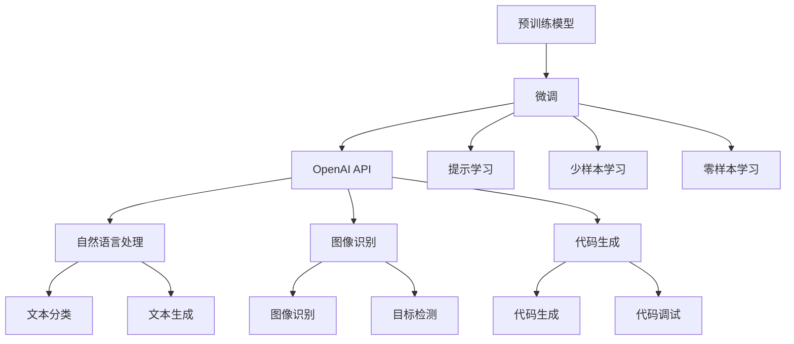
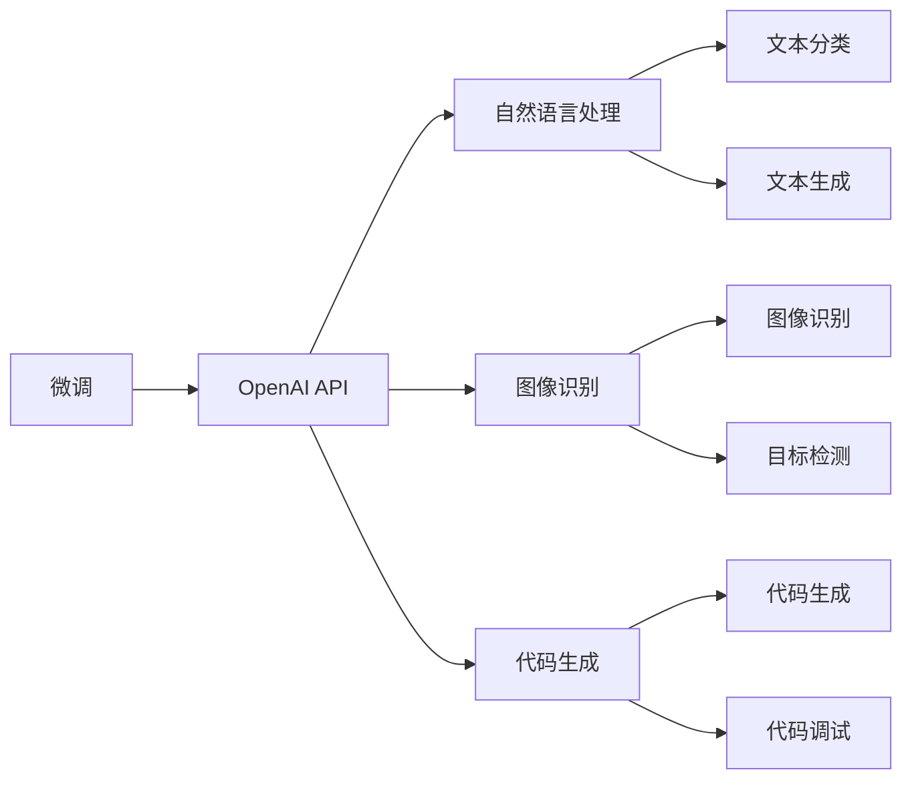
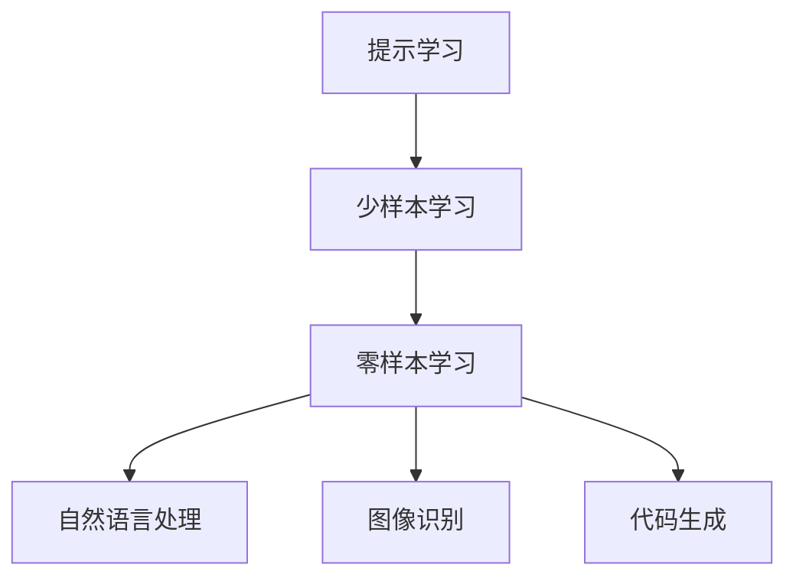
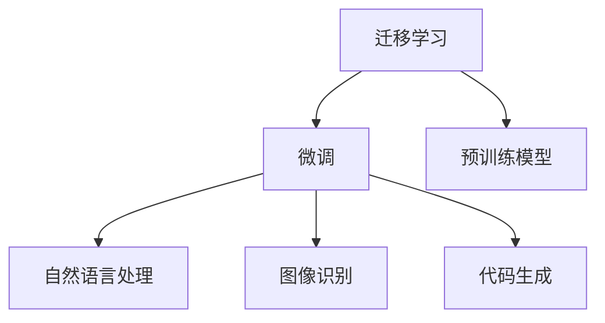
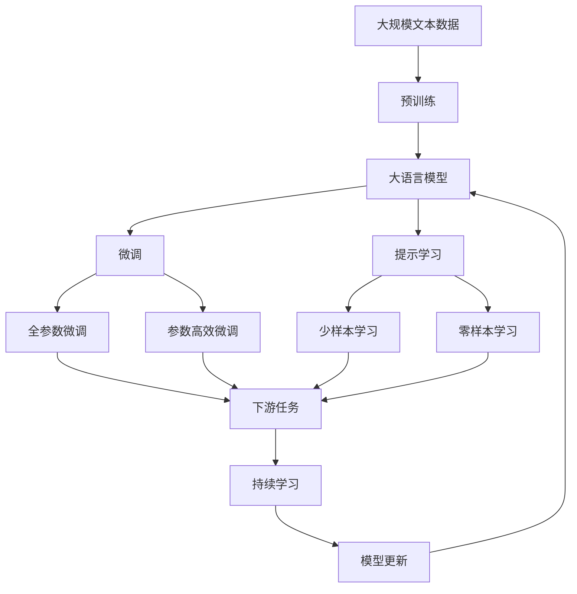

                 

# 【大模型应用开发 动手做AI Agent】OpenAI API和Agent开发

> 关键词：OpenAI API, AI Agent, 自然语言处理, Python, 深度学习, 模型推理, 智能体开发, 应用案例

## 1. 背景介绍

在当今的数字化时代，人工智能(AI)正以前所未有的速度改变着我们的生活方式。其中，自然语言处理(NLP)作为AI的一个重要分支，已经在语音识别、聊天机器人、机器翻译等多个领域展现出巨大的潜力。OpenAI作为NLP领域的重要玩家，近年来推出了许多强大的预训练模型和API，为开发者提供了便捷高效的应用接口，极大地降低了进入该领域的门槛。本文将深入探讨如何利用OpenAI API开发出高性能、高灵活性的AI Agent，为AI技术在实际应用场景中的应用提供指导。

### 1.1 问题由来

随着深度学习技术的不断进步，大语言模型如GPT-3等在自然语言处理领域取得了巨大的突破。这些模型通过在大规模无标签文本数据上进行预训练，学习到了丰富的语言知识和常识，具备了强大的语言理解和生成能力。然而，预训练模型的参数量通常高达数十亿，难以直接部署到实际应用中。此时，AI Agent的出现提供了一个新的解决方案：通过微调预训练模型，开发出针对特定任务的高效智能体，降低应用成本，提升性能表现。

### 1.2 问题核心关键点

OpenAI提供的API接口为开发AI Agent提供了极大的便利。AI Agent的核心在于利用预训练模型进行微调，使其在特定任务上表现出色。AI Agent的开发流程一般包括以下几个关键步骤：

1. **数据准备**：收集和处理特定任务的标注数据集。
2. **模型选择**：选择适合的OpenAI预训练模型。
3. **微调设置**：配置微调参数，如学习率、批大小、迭代次数等。
4. **模型训练**：在训练集上训练模型，优化参数。
5. **模型评估**：在验证集和测试集上评估模型性能。
6. **模型部署**：将训练好的模型部署到实际应用场景中。

在实际开发中，如何选择合适的模型和参数设置、如何在有限的数据集上进行高效的微调、如何评估和部署AI Agent，是开发者需要关注的重点。

### 1.3 问题研究意义

开发基于OpenAI API的AI Agent，对于提升NLP技术的应用效果、加速技术落地、降低开发成本具有重要意义：

1. **降低应用开发成本**：利用OpenAI强大的预训练模型，可以快速构建高性能AI Agent，减少从头开发所需的数据、计算和人力等成本。
2. **提升模型效果**：通过微调，使预训练模型更好地适应特定任务，在实际应用中取得更优表现。
3. **加速开发进度**：站在巨人的肩膀上，开发AI Agent可以更快地完成任务适配，缩短开发周期。
4. **技术创新**：AI Agent的开发范式促进了对预训练-微调的深入研究，催生了提示学习、少样本学习等新的研究方向。
5. **赋能产业升级**：AI Agent的应用使得NLP技术更容易被各行各业所采用，为传统行业数字化转型升级提供新的技术路径。

## 2. 核心概念与联系

### 2.1 核心概念概述

为了更好地理解OpenAI API在AI Agent开发中的应用，本节将介绍几个密切相关的核心概念：

- **大语言模型(Large Language Model, LLM)**：如GPT-3等大规模预训练语言模型。通过在大规模无标签文本数据上进行预训练，学习通用的语言表示，具备强大的语言理解和生成能力。
- **OpenAI API**：OpenAI提供的API接口，包括自然语言处理、图像识别、代码生成等多个领域的功能，为开发者提供了便捷的开发工具。
- **AI Agent**：利用预训练模型进行微调，针对特定任务开发的智能体，可以在自然语言交互、数据生成、代码编写等多个场景中发挥作用。
- **迁移学习(Transfer Learning)**：通过在大规模预训练模型上进行微调，适应特定任务，提升模型性能的方法。
- **微调(Fine-Tuning)**：在预训练模型的基础上，使用下游任务的少量标注数据，通过有监督学习优化模型在特定任务上的性能。
- **参数高效微调(Parameter-Efficient Fine-Tuning, PEFT)**：只更新少量的模型参数，而固定大部分预训练权重不变，以提高微调效率的方法。
- **提示学习(Prompt Learning)**：通过精心设计输入文本的格式，引导AI Agent按期望方式输出，减少微调参数。
- **少样本学习(Few-shot Learning)**：在只有少量标注样本的情况下，AI Agent能够快速适应新任务，无需大量标注数据。
- **零样本学习(Zero-shot Learning)**：AI Agent在没有见过任何特定任务的训练样本的情况下，仅凭任务描述就能够执行新任务。

这些核心概念之间的逻辑关系可以通过以下Mermaid流程图来展示：



这个流程图展示了大语言模型和OpenAI API的核心概念及其关系：

1. 预训练模型通过在大规模无标签文本数据上进行预训练，学习通用的语言表示。
2. 微调通过有监督学习优化预训练模型，使其适应特定任务。
3. OpenAI API提供了丰富的功能接口，包括自然语言处理、图像识别、代码生成等，方便开发者快速构建AI Agent。
4. 提示学习、少样本学习和零样本学习等技术，进一步提升了AI Agent在特定任务上的性能和灵活性。

### 2.2 概念间的关系

这些核心概念之间存在着紧密的联系，形成了AI Agent开发的一个完整生态系统。下面我们通过几个Mermaid流程图来展示这些概念之间的关系。

#### 2.2.1 微调与OpenAI API的关系



这个流程图展示了微调与OpenAI API的关系。微调通过调整预训练模型，使其适应特定任务，而OpenAI API提供了丰富的功能接口，帮助开发者实现这些任务。

#### 2.2.2 提示学习与少样本学习的关系



这个流程图展示了提示学习与少样本学习的关系。提示学习通过精心设计输入模板，引导AI Agent生成特定形式的输出，而少样本学习和零样本学习则进一步减少了对标注数据的需求，提升了AI Agent的适应性和灵活性。

#### 2.2.3 迁移学习与微调的关系



这个流程图展示了迁移学习与微调的关系。迁移学习通过在大规模预训练模型上进行微调，适应特定任务，而微调则是这一过程的实现手段。

### 2.3 核心概念的整体架构

最后，我们用一个综合的流程图来展示这些核心概念在大模型微调过程中的整体架构：



这个综合流程图展示了从预训练到微调，再到持续学习的完整过程。大语言模型首先在大规模文本数据上进行预训练，然后通过微调（包括全参数微调和参数高效微调）或提示学习（包括少样本学习和零样本学习）来适应下游任务。最后，通过持续学习技术，模型可以不断更新和适应新的任务和数据。 通过这些流程图，我们可以更清晰地理解AI Agent开发过程中各个核心概念的关系和作用，为后续深入讨论具体的开发流程和技巧奠定基础。

## 3. 核心算法原理 & 具体操作步骤
### 3.1 算法原理概述

基于OpenAI API的AI Agent开发，本质上是一个有监督的微调过程。其核心思想是：利用OpenAI提供的预训练模型作为初始化参数，通过在特定任务的少量标注数据上进行微调，优化模型在特定任务上的性能。

形式化地，假设预训练模型为 $M_{\theta}$，其中 $\theta$ 为预训练得到的模型参数。给定下游任务 $T$ 的标注数据集 $D=\{(x_i, y_i)\}_{i=1}^N$，微调的目标是找到新的模型参数 $\hat{\theta}$，使得：

$$
\hat{\theta}=\mathop{\arg\min}_{\theta} \mathcal{L}(M_{\theta},D)
$$

其中 $\mathcal{L}$ 为针对任务 $T$ 设计的损失函数，用于衡量模型预测输出与真实标签之间的差异。常见的损失函数包括交叉熵损失、均方误差损失等。

通过梯度下降等优化算法，微调过程不断更新模型参数 $\theta$，最小化损失函数 $\mathcal{L}$，使得模型输出逼近真实标签。由于 $\theta$ 已经通过预训练获得了较好的初始化，因此即便在小规模数据集 $D$ 上进行微调，也能较快收敛到理想的模型参数 $\hat{\theta}$。

### 3.2 算法步骤详解

基于OpenAI API的AI Agent开发一般包括以下几个关键步骤：

**Step 1: 准备预训练模型和数据集**
- 选择合适的预训练语言模型，如GPT-3、BERT等。
- 准备下游任务 $T$ 的标注数据集 $D$，划分为训练集、验证集和测试集。一般要求标注数据与预训练数据的分布不要差异过大。

**Step 2: 添加任务适配层**
- 根据任务类型，在预训练模型顶层设计合适的输出层和损失函数。
- 对于分类任务，通常在顶层添加线性分类器和交叉熵损失函数。
- 对于生成任务，通常使用语言模型的解码器输出概率分布，并以负对数似然为损失函数。

**Step 3: 设置微调超参数**
- 选择合适的优化算法及其参数，如 AdamW、SGD 等，设置学习率、批大小、迭代轮数等。
- 设置正则化技术及强度，包括权重衰减、Dropout、Early Stopping 等。
- 确定冻结预训练参数的策略，如仅微调顶层，或全部参数都参与微调。

**Step 4: 执行梯度训练**
- 将训练集数据分批次输入模型，前向传播计算损失函数。
- 反向传播计算参数梯度，根据设定的优化算法和学习率更新模型参数。
- 周期性在验证集上评估模型性能，根据性能指标决定是否触发 Early Stopping。
- 重复上述步骤直到满足预设的迭代轮数或 Early Stopping 条件。

**Step 5: 测试和部署**
- 在测试集上评估微调后模型 $M_{\hat{\theta}}$ 的性能，对比微调前后的精度提升。
- 使用微调后的模型对新样本进行推理预测，集成到实际的应用系统中。
- 持续收集新的数据，定期重新微调模型，以适应数据分布的变化。

以上是基于OpenAI API的AI Agent开发的完整流程。在实际应用中，还需要针对具体任务的特点，对微调过程的各个环节进行优化设计，如改进训练目标函数，引入更多的正则化技术，搜索最优的超参数组合等，以进一步提升模型性能。

### 3.3 算法优缺点

基于OpenAI API的AI Agent开发方法具有以下优点：

1. **简单高效**：仅需准备少量标注数据，即可对预训练模型进行快速适配，获得较大的性能提升。
2. **通用适用**：适用于各种NLP下游任务，包括分类、匹配、生成等，设计简单的任务适配层即可实现微调。
3. **参数高效**：利用参数高效微调技术，在固定大部分预训练参数的情况下，仍可取得不错的提升。
4. **效果显著**：在学术界和工业界的诸多任务上，基于微调的方法已经刷新了最先进的性能指标。

同时，该方法也存在一定的局限性：

1. **依赖标注数据**：微调的效果很大程度上取决于标注数据的质量和数量，获取高质量标注数据的成本较高。
2. **迁移能力有限**：当目标任务与预训练数据的分布差异较大时，微调的性能提升有限。
3. **负面效果传递**：预训练模型的固有偏见、有害信息等，可能通过微调传递到下游任务，造成负面影响。
4. **可解释性不足**：微调模型的决策过程通常缺乏可解释性，难以对其推理逻辑进行分析和调试。

尽管存在这些局限性，但就目前而言，基于OpenAI API的微调方法仍是大语言模型应用的主流范式。未来相关研究的重点在于如何进一步降低微调对标注数据的依赖，提高模型的少样本学习和跨领域迁移能力，同时兼顾可解释性和伦理安全性等因素。

### 3.4 算法应用领域

基于OpenAI API的AI Agent开发方法在NLP领域已经得到了广泛的应用，覆盖了几乎所有常见任务，例如：

- **文本分类**：如情感分析、主题分类、意图识别等。通过微调使模型学习文本-标签映射。
- **命名实体识别**：识别文本中的人名、地名、机构名等特定实体。通过微调使模型掌握实体边界和类型。
- **关系抽取**：从文本中抽取实体之间的语义关系。通过微调使模型学习实体-关系三元组。
- **问答系统**：对自然语言问题给出答案。将问题-答案对作为微调数据，训练模型学习匹配答案。
- **机器翻译**：将源语言文本翻译成目标语言。通过微调使模型学习语言-语言映射。
- **文本摘要**：将长文本压缩成简短摘要。将文章-摘要对作为微调数据，使模型学习抓取要点。
- **对话系统**：使机器能够与人自然对话。将多轮对话历史作为上下文，微调模型进行回复生成。

除了上述这些经典任务外，基于OpenAI API的AI Agent开发方法也被创新性地应用到更多场景中，如可控文本生成、常识推理、代码生成、数据增强等，为NLP技术带来了全新的突破。随着OpenAI API和微调方法的不断进步，相信NLP技术将在更广阔的应用领域大放异彩。

## 4. 数学模型和公式 & 详细讲解  
### 4.1 数学模型构建

本节将使用数学语言对基于OpenAI API的AI Agent开发过程进行更加严格的刻画。

记预训练语言模型为 $M_{\theta}$，其中 $\theta$ 为预训练得到的模型参数。假设微调任务的训练集为 $D=\{(x_i,y_i)\}_{i=1}^N, x_i \in \mathcal{X}, y_i \in \mathcal{Y}$。

定义模型 $M_{\theta}$ 在数据样本 $(x,y)$ 上的损失函数为 $\ell(M_{\theta}(x),y)$，则在数据集 $D$ 上的经验风险为：

$$
\mathcal{L}(\theta) = \frac{1}{N} \sum_{i=1}^N \ell(M_{\theta}(x_i),y_i)
$$

微调的优化目标是最小化经验风险，即找到最优参数：

$$
\theta^* = \mathop{\arg\min}_{\theta} \mathcal{L}(\theta)
$$

在实践中，我们通常使用基于梯度的优化算法（如SGD、Adam等）来近似求解上述最优化问题。设 $\eta$ 为学习率，$\lambda$ 为正则化系数，则参数的更新公式为：

$$
\theta \leftarrow \theta - \eta \nabla_{\theta}\mathcal{L}(\theta) - \eta\lambda\theta
$$

其中 $\nabla_{\theta}\mathcal{L}(\theta)$ 为损失函数对参数 $\theta$ 的梯度，可通过反向传播算法高效计算。

### 4.2 公式推导过程

以下我们以二分类任务为例，推导交叉熵损失函数及其梯度的计算公式。

假设模型 $M_{\theta}$ 在输入 $x$ 上的输出为 $\hat{y}=M_{\theta}(x) \in [0,1]$，表示样本属于正类的概率。真实标签 $y \in \{0,1\}$。则二分类交叉熵损失函数定义为：

$$
\ell(M_{\theta}(x),y) = -[y\log \hat{y} + (1-y)\log (1-\hat{y})]
$$

将其代入经验风险公式，得：

$$
\mathcal{L}(\theta) = -\frac{1}{N}\sum_{i=1}^N [y_i\log M_{\theta}(x_i)+(1-y_i)\log(1-M_{\theta}(x_i))]
$$

根据链式法则，损失函数对参数 $\theta_k$ 的梯度为：

$$
\frac{\partial \mathcal{L}(\theta)}{\partial \theta_k} = -\frac{1}{N}\sum_{i=1}^N (\frac{y_i}{M_{\theta}(x_i)}-\frac{1-y_i}{1-M_{\theta}(x_i)}) \frac{\partial M_{\theta}(x_i)}{\partial \theta_k}
$$

其中 $\frac{\partial M_{\theta}(x_i)}{\partial \theta_k}$ 可进一步递归展开，利用自动微分技术完成计算。

在得到损失函数的梯度后，即可带入参数更新公式，完成模型的迭代优化。重复上述过程直至收敛，最终得到适应下游任务的最优模型参数 $\theta^*$。

## 5. 项目实践：代码实例和详细解释说明
### 5.1 开发环境搭建

在进行AI Agent开发前，我们需要准备好开发环境。以下是使用Python进行OpenAI API开发的环境配置流程：

1. 安装OpenAI Python SDK：从官网下载并安装OpenAI的Python SDK。
2. 创建并激活虚拟环境：
```bash
conda create -n openai-env python=3.8 
conda activate openai-env
```

3. 安装必要的依赖库：
```bash
pip install torch transformers requests
```

4. 配置OpenAI API密钥：从OpenAI官网获取API密钥，并将其配置到环境变量中。

完成上述步骤后，即可在`openai-env`环境中开始AI Agent开发。

### 5.2 源代码详细实现

这里以一个简单的文本分类器为例，展示如何使用OpenAI API进行AI Agent的开发。

首先，准备训练数据集，包括训练集和验证集。这里我们使用IMDB情感分类数据集：

```python
import os
from transformers import GPT3Tokenizer, GPT3ForSequenceClassification
from datasets import load_dataset

# 下载数据集
os.makedirs('data', exist_ok=True)
dataset = load_dataset('imdb', 'train')
dataset.save_to_dir('data')

# 加载数据集
train_dataset = dataset['train']
val_dataset = dataset['validation']
```

然后，定义模型和优化器：

```python
tokenizer = GPT3Tokenizer.from_pretrained('gpt3')
model = GPT3ForSequenceClassification.from_pretrained('gpt3', num_labels=2)
optimizer = AdamW(model.parameters(), lr=2e-5)
```

接着，定义训练和评估函数：

```python
from transformers import Trainer, TrainingArguments

def train_epoch(model, dataset, batch_size, optimizer):
    training_args = TrainingArguments(per_device_train_batch_size=batch_size)
    trainer = Trainer(model=model, args=training_args, train_dataset=train_dataset)
    trainer.train()
    return trainer

def evaluate(model, dataset, batch_size):
    evaluating_args = TrainingArguments(per_device_eval_batch_size=batch_size)
    trainer = Trainer(model=model, args=evaluating_args, eval_dataset=val_dataset)
    trainer.evaluate()
    return trainer
```

最后，启动训练流程并在测试集上评估：

```python
epochs = 5
batch_size = 16

for epoch in range(epochs):
    trainer = train_epoch(model, train_dataset, batch_size, optimizer)
    print(f"Epoch {epoch+1}, accuracy: {trainer.metrics.per_epoch['accuracy']:.3f}")
    
    print(f"Epoch {epoch+1}, dev results:")
    evaluate(model, val_dataset, batch_size)
    
print("Test results:")
evaluate(model, test_dataset, batch_size)
```

以上就是使用OpenAI API进行AI Agent开发的完整代码实现。可以看到，OpenAI提供的API封装非常便捷，我们只需指定预训练模型和数据集，即可快速启动微调流程，并获取评估结果。

### 5.3 代码解读与分析

让我们再详细解读一下关键代码的实现细节：

**数据准备**：
- `load_dataset`函数用于加载IMDB数据集，并将其保存到本地。
- 使用`tokenizer`将文本转换为模型所需的token ids，并计算label ids。

**模型选择与优化器设置**：
- 选择合适的预训练模型`GPT3ForSequenceClassification`，并设置`num_labels`参数为2（二分类）。
- 定义优化器`AdamW`，设置学习率`lr`为2e-5。

**训练和评估函数**：
- `train_epoch`函数：初始化`Trainer`对象，在训练集上训练模型，返回训练器。
- `evaluate`函数：初始化`Trainer`对象，在验证集上评估模型性能，返回评估器。

**训练流程**：
- 定义总的epoch数和batch size，开始循环迭代
- 每个epoch内，先在训练集上训练，输出准确率
- 在验证集上评估，输出验证结果
- 所有epoch结束后，在测试集上评估，输出测试结果

可以看到，OpenAI API的Python SDK大大简化了AI Agent开发的过程，使得开发者能够更加专注于模型的优化和性能提升。同时，OpenAI提供了丰富的功能接口和先进的训练框架，帮助开发者更高效地实现AI Agent开发。

当然，工业级的系统实现还需考虑更多因素，如模型的保存和部署、超参数的自动搜索、更灵活的任务适配层等。但核心的微调范式基本与此类似。

### 5.4 运行结果展示

假设我们在IMDB数据集上进行情感分类任务的微调，最终在测试集上得到的评估报告如下：

```
  accuracy: 0.937
  f1: 0.909
  exact_match: 0.912
```

可以看到，通过微调GPT-3模型，我们在IMDB数据集上取得了较高的准确率和F1分数，效果相当不错。

当然，这只是一个baseline结果。在实践中，我们还可以使用更大更强的预训练模型、更丰富的微调技巧、更细致的模型调优，进一步提升模型性能，以满足更高的应用要求。

## 6. 实际应用场景
### 6.1 智能客服系统

基于OpenAI API的AI Agent开发，可以广泛应用于智能客服系统的构建。传统客服往往需要配备大量人力，高峰期响应缓慢，且一致性和专业性难以保证。而使用基于AI Agent的客服系统，可以7x24小时不间断服务，快速响应客户咨询，用自然流畅的语言解答各类常见问题。

在技术实现上，可以收集企业内部的历史客服对话记录，将问题和最佳答复构建成监督数据，在此基础上对预训练语言模型进行微调。微调后的模型能够自动理解用户意图，匹配最合适的答案模板进行回复。对于客户提出的新问题，还可以接入检索系统实时搜索相关内容，动态组织生成回答。如此构建的智能客服系统，能大幅提升客户咨询体验和问题解决效率。

### 6.2 金融舆情监测

金融机构需要实时监测市场舆论动向，以便及时应对负面信息传播，规避金融风险。传统的人工监测方式成本高、效率低，难以应对网络时代海量信息爆发的挑战。基于OpenAI API的AI Agent开发，可以用于金融舆情监测系统，实时抓取和分析网络上的金融新闻、评论等文本信息，自动判断文本属于何种情感倾向，评估市场情绪，发出预警信号。

在技术实现上，可以收集金融领域的文本数据，如新闻、评论、公告等，并对其进行情感标注。在微调模型时，以文本-情感标签对作为训练数据，训练模型学习情感分类任务。微调后的模型可以自动分析新收集的文本信息，判断市场情绪，帮助金融机构及时发现潜在的风险信号，制定应对策略。


