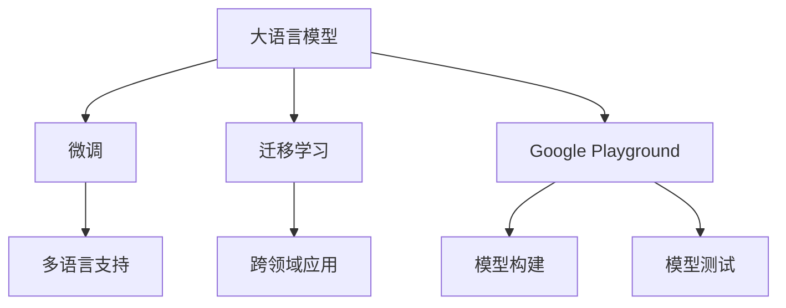

                 

# 【大模型应用开发 动手做AI Agent】不写代码，在Playground中玩Assistants

## 1. 背景介绍

### 1.1 问题由来

在人工智能(AI)技术快速发展的今天，语言模型（Language Models）已经成为了NLP领域的重要基础。但是，这些模型在应用过程中，往往需要大量的计算资源和数据，这对于一般开发者来说可能门槛较高。为了降低这一门槛，谷歌推出了Google Playground，一个专门为AI开发者提供的在线实验平台。

### 1.2 问题核心关键点

Google Playground的核心思想是将复杂的技术转化为易于理解的接口，开发者无需编写代码，即可通过可视化的方式来构建、训练和测试自己的AI模型。这一平台特别适合初学者和需要在各种环境中部署模型的人们。

### 1.3 问题研究意义

通过Google Playground，开发者可以更加直观地了解大模型的应用，从而加深对NLP技术的理解和掌握。此外，这一平台还支持多模型的对比，可以直观地展示不同模型之间的差异，帮助开发者选择最适合自己的模型。这不仅降低了NLP应用的入门门槛，也为AI技术的普及和应用开辟了新的途径。

## 2. 核心概念与联系

### 2.1 核心概念概述

1. **语言模型（Language Model）**：通过训练，可以从大量文本数据中学习到单词或句子之间的概率关系。语言模型通常用于文本生成、文本分类、问答系统等任务。

2. **大模型（Large Language Model）**：如GPT-3、BERT等，通过在大规模数据上预训练，能够学习到更加丰富的语言知识和语义理解。

3. **微调（Fine-Tuning）**：在大模型的基础上，通过有限的数据对其进行特定任务的训练，以提升模型在特定任务上的表现。

4. **迁移学习（Transfer Learning）**：通过在大模型上微调，利用其已有知识，减少新任务上的训练成本，提高模型性能。

5. **Google Playground**：一个在线的AI模型构建和实验平台，支持多语言、多任务，让开发者无需写代码即可构建和测试AI模型。

### 2.2 概念间的关系

通过Google Playground，用户可以更加直观地理解大模型微调等概念，以及如何在实际应用中使用这些技术。以下是几个概念间的关系图：

### 2.3 核心概念的整体架构

最终，这些概念通过Google Playground这一平台，形成了一个有机整体，开发者可以通过可视化的界面，轻松地构建、训练和测试自己的AI模型，极大地降低了NLP应用的复杂度和门槛。

## 3. 核心算法原理 & 具体操作步骤
### 3.1 算法原理概述

Google Playground中的AI模型构建，本质上是基于大语言模型的微调过程。该平台提供了多个预训练模型，用户可以选择其中任意一个，通过可视化的方式对其进行微调。微调的目标是在特定任务上优化模型，提高其在该任务上的表现。

### 3.2 算法步骤详解

以下是Google Playground中AI模型构建的具体步骤：

1. **选择模型**：首先，用户需要选择一种预训练的模型。Google Playground中支持包括BERT、GPT-3在内的多种模型。

2. **数据准备**：用户需要准备好用于微调的数据。这些数据通常包括训练集、验证集和测试集。

3. **模型微调**：在Google Playground的界面中，用户可以调整模型的参数，包括学习率、正则化等，通过可视化的方式来进行微调。

4. **模型测试**：微调完成后，用户可以在Google Playground中进行模型测试，评估模型的性能。

5. **模型部署**：测试通过后，用户可以将模型部署到实际应用中，如智能客服、情感分析等。

### 3.3 算法优缺点

Google Playground的优点在于，它将复杂的技术转化为易于理解的接口，大大降低了NLP应用的入门门槛。此外，它还支持多模型的对比，可以帮助开发者选择最适合的模型。但是，Google Playground的缺点在于，它可能无法完全替代传统编程方式，对于一些高级的技术实现，用户可能还需要编写代码。

### 3.4 算法应用领域

Google Playground的AI模型微调方法，已经在各种NLP应用中得到了广泛应用，如智能客服、情感分析、机器翻译等。这些应用不仅提高了模型的性能，也显著降低了开发成本，加速了AI技术的落地。

## 4. 数学模型和公式 & 详细讲解 & 举例说明
### 4.1 数学模型构建

在Google Playground中，用户可以通过可视化的界面，对模型的参数进行调整。以下是其中的一个简单例子：

假设用户想要微调一个简单的线性回归模型，模型输入为 $x$，输出为 $y$，则模型的数学表达式为：

$$ y = w_0 + w_1x $$

其中 $w_0$ 和 $w_1$ 为模型的权重。用户需要调整这些权重，使得模型在训练集上的损失最小。

### 4.2 公式推导过程

对于线性回归模型，用户可以通过以下公式来计算损失函数：

$$ L(w) = \frac{1}{2N} \sum_{i=1}^{N} (y_i - w_0 - w_1x_i)^2 $$

其中 $y_i$ 为训练集中的第 $i$ 个样本的真实标签，$x_i$ 为第 $i$ 个样本的输入特征。通过梯度下降等优化算法，最小化损失函数 $L(w)$，就可以得到最优的模型参数 $w$。

### 4.3 案例分析与讲解

例如，用户想要在Google Playground中微调一个简单的二分类模型。用户需要将数据集输入到平台中，并通过可视化的界面，调整模型的参数。用户可以设置学习率、迭代次数等参数，并通过平台中的“train”按钮开始训练。在训练过程中，平台会显示出损失函数的值，帮助用户监控训练进度。训练完成后，用户可以在平台中对模型进行测试，评估其性能。

## 5. 项目实践：代码实例和详细解释说明
### 5.1 开发环境搭建

1. 用户需要访问Google Playground的官网，并进行注册和登录。

2. 用户可以选择一种预训练模型，如BERT或GPT-3。

3. 用户需要准备好用于微调的数据集，并将其上传到平台中。

### 5.2 源代码详细实现

Google Playground中的AI模型微调，实际上是通过平台的可视化界面进行的，不需要编写代码。以下是用户可能需要进行的操作步骤：

1. **选择模型**：在平台中选择一种预训练模型，如BERT或GPT-3。

2. **上传数据集**：将用于微调的数据集上传到平台中，包括训练集、验证集和测试集。

3. **设置参数**：在平台中设置模型的超参数，如学习率、迭代次数、正则化等。

4. **开始训练**：点击“train”按钮，平台开始训练模型。

5. **评估模型**：训练完成后，平台会显示出模型的性能评估结果，包括损失函数、准确率等。

6. **部署模型**：将模型部署到实际应用中，如智能客服、情感分析等。

### 5.3 代码解读与分析

Google Playground的优点在于，它将复杂的编程过程转换为可视化的界面，使得用户可以更加直观地进行模型构建和训练。用户可以通过拖拽和调整参数的方式，轻松地实现模型的微调。

### 5.4 运行结果展示

用户可以在平台中查看训练过程的损失函数变化图，并根据这些图表来调整模型参数。此外，平台还提供了详细的性能评估报告，帮助用户了解模型的表现。

## 6. 实际应用场景
### 6.1 智能客服系统

Google Playground中的AI模型，可以用于构建智能客服系统。用户可以通过可视化的界面，构建一个简单的客服模型，该模型能够理解用户的意图，并给出相应的回答。

### 6.2 情感分析

用户可以使用Google Playground中的模型，对社交媒体上的文本进行情感分析，帮助企业了解用户的情感倾向，从而制定更加合适的市场策略。

### 6.3 机器翻译

用户可以通过微调BERT或GPT-3等模型，构建一个简单的机器翻译系统，将一种语言翻译成另一种语言。

### 6.4 未来应用展望

随着Google Playground的不断发展和完善，未来的AI模型将更加高效和智能化。AI模型将能够处理更加复杂的任务，如自然语言推理、语音识别等，从而进一步拓展其在各行各业中的应用。

## 7. 工具和资源推荐
### 7.1 学习资源推荐

1. **《Transformer from Scratch》**：该书深入浅出地介绍了Transformer模型的原理和实现，适合初学者和有基础的开发者。

2. **Google AI Blog**：谷歌AI团队的官方博客，包含最新的AI技术和应用案例，是了解NLP最新趋势的好去处。

3. **Kaggle**：数据科学竞赛平台，用户可以在其中找到大量的NLP数据集和竞赛项目，锻炼自己的技能。

4. **Coursera**：在线课程平台，提供多种NLP相关的课程，适合希望系统学习NLP技术的开发者。

### 7.2 开发工具推荐

1. **Google Playground**：在线AI模型构建和测试平台，支持多语言、多任务，是NLP应用开发的利器。

2. **TensorFlow**：谷歌开发的深度学习框架，支持多种模型训练和部署方式。

3. **PyTorch**：Facebook开发的深度学习框架，灵活高效，适合研究和开发NLP模型。

4. **Keras**：高层API，简化深度学习模型的构建过程，适合初学者。

### 7.3 相关论文推荐

1. **Attention is All You Need**：Transformer模型的原论文，介绍了自注意力机制在NLP中的应用。

2. **BERT: Pre-training of Deep Bidirectional Transformers for Language Understanding**：BERT模型的论文，介绍了基于掩码自监督任务的预训练方法。

3. **Google Playground**：平台官方文档，详细介绍了平台的功能和使用方法。

## 8. 总结：未来发展趋势与挑战
### 8.1 研究成果总结

Google Playground的推出，大大降低了NLP应用的入门门槛，使得更多的人能够参与到AI技术的开发和应用中来。平台提供了多种预训练模型和可视化界面，使得AI模型的构建和训练变得更加简单。

### 8.2 未来发展趋势

未来的AI模型将更加高效和智能化，能够处理更加复杂的任务。AI模型将能够与外部系统进行更好的交互，提供更加个性化和智能化的服务。

### 8.3 面临的挑战

尽管Google Playground的推出，大大降低了NLP应用的门槛，但AI技术在实际应用中仍面临一些挑战，如模型鲁棒性、安全性等。

### 8.4 研究展望

未来的研究将聚焦于如何进一步提高AI模型的性能和稳定性，同时保证其安全性。此外，如何更好地将AI技术与外部系统进行集成，也将是重要的研究方向。

## 9. 附录：常见问题与解答
----------------------------------------------------------------

**Q1：Google Playground支持哪些语言模型？**

A：Google Playground支持包括BERT、GPT-3在内的多种语言模型，用户可以在平台中选择最适合的模型。

**Q2：如何在Google Playground中构建和测试AI模型？**

A：用户可以通过可视化的界面，选择模型、上传数据集、设置参数，并通过“train”按钮进行模型训练。训练完成后，用户可以在平台中评估模型的性能，并将模型部署到实际应用中。

**Q3：Google Playground是否支持多模型对比？**

A：是的，Google Playground支持多模型的对比，用户可以在同一平台上测试多个模型的性能，从而选择最适合的模型。

**Q4：如何使用Google Playground构建智能客服系统？**

A：用户可以通过可视化的界面，构建一个简单的智能客服模型，该模型能够理解用户的意图，并给出相应的回答。

**Q5：Google Playground是否支持多语言应用？**

A：是的，Google Playground支持多种语言，用户可以在平台上选择不同的语言进行模型构建和测试。

---

作者：禅与计算机程序设计艺术 / Zen and the Art of Computer Programming

