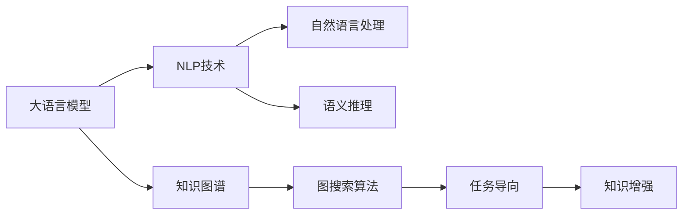

                 

# 【大模型应用开发 动手做AI Agent】第一轮思考：模型决定搜索

## 1. 背景介绍

随着深度学习和大模型技术的发展，基于大模型的AI应用逐渐从简单的预训练微调，扩展到更复杂的任务执行。其中，AI Agent（人工智能代理）的开发，成为了NLP技术应用的新热点。AI Agent不仅能够通过自然语言理解用户需求，还能主动搜索、执行复杂任务，实现人机交互的智能化。

AI Agent的开发涉及多个技术环节，其中模型选择和搜索策略设计是关键。选择合适的模型和高效的搜索策略，可以显著提升AI Agent的性能和用户体验。本节将重点探讨模型决定搜索（Model-Based Search）的思路，介绍基于大模型的AI Agent开发流程，以及一些典型的应用场景。

## 2. 核心概念与联系

### 2.1 核心概念概述

为了更好地理解AI Agent中的模型决定搜索方法，需要理解以下几个核心概念：

- **大语言模型（Large Language Model, LLM）**：指如BERT、GPT等通过大规模预训练得到的通用语言模型，具有强大的语言理解和生成能力。
- **知识图谱（Knowledge Graph）**：一种结构化的语义知识表示方式，可用于存储和推理实体间的关系。
- **自然语言处理（Natural Language Processing, NLP）**：涉及文本处理、语义理解、生成等技术，是构建AI Agent的基础。
- **图搜索算法（Graph Search Algorithm）**：如深度优先搜索、广度优先搜索、A*算法等，用于在知识图谱中高效地查找相关信息。
- **任务导向（Task-Oriented）**：指模型输出专注于特定任务，如问答、推荐、推荐路径等。
- **语义推理（Semantic Reasoning）**：指通过语言模型对文本进行推理，判断其语义是否合理。
- **知识增强（Knowledge-Enhanced）**：指将外部知识图谱与语言模型结合，增强模型的推理能力和泛化能力。

这些核心概念相互关联，共同构成了基于大模型的AI Agent开发框架。通过理解这些概念，可以更清晰地把握AI Agent的开发逻辑和技术细节。

### 2.2 概念间的关系

下图展示了这些核心概念之间的联系和交互：



这个流程图展示了各个核心概念如何相互配合，共同完成AI Agent的任务执行。大语言模型通过NLP技术理解和生成语言，结合知识图谱进行语义推理，利用图搜索算法和任务导向策略，在知识图谱中高效地搜索相关信息，并根据任务需求生成合理的回答或执行路径。

## 3. 核心算法原理 & 具体操作步骤

### 3.1 算法原理概述

基于大模型的AI Agent开发，其核心思想是通过模型决定搜索，即在知识图谱中利用模型对语言进行推理，自动找到最合适的解决方案。其流程大致可以分为以下步骤：

1. **预训练模型选择**：选择合适的预训练大语言模型，如BERT、GPT-3等，作为AI Agent的初始模型。
2. **知识图谱构建**：构建或获取相应的知识图谱，包含实体、关系、属性等信息。
3. **输入处理**：将用户输入的自然语言转化为知识图谱中的实体和关系，生成图搜索的起点。
4. **图搜索**：在知识图谱中使用图搜索算法，自动找到相关的实体和关系路径。
5. **答案生成**：将搜索结果作为输入，返回最合理的回答或执行路径。

### 3.2 算法步骤详解

以下是对基于大模型的AI Agent开发流程的详细步骤说明：

#### 3.2.1 预训练模型选择

选择合适的预训练大语言模型是AI Agent开发的第一步。模型需要具备强大的语言理解和生成能力，能够处理复杂的自然语言输入。

- **BERT**：适合处理结构化输入，如图、表等，适用于实体关系抽取、问答系统等任务。
- **GPT-3**：适合生成性任务，如对话生成、摘要生成等，能够处理长文本、多轮对话等复杂输入。
- **RoBERTa**：适合处理多种语言，适用于多语言翻译、跨语言文本理解等任务。

#### 3.2.2 知识图谱构建

知识图谱是大模型与现实世界交互的重要桥梁，可以用于存储实体、关系和属性等信息。

- **实体识别**：从文本中识别出具体的实体，如人名、地名、组织名等。
- **关系抽取**：抽取实体间的关系，如“是”、“在”、“属于”等。
- **属性提取**：从实体中抽取关键属性，如日期、地点、时间等。

#### 3.2.3 输入处理

将自然语言输入转化为知识图谱中的实体和关系，是模型决定搜索的起点。

- **命名实体识别**：从文本中提取具体实体，如“John”、“Apple Inc.”等。
- **关系抽取**：识别实体之间的关系，如“John works at Apple Inc.”中的“工作”关系。
- **属性提取**：从实体中提取关键属性，如“John”的“职业”属性。

#### 3.2.4 图搜索

在知识图谱中使用图搜索算法，自动找到相关的实体和关系路径。

- **深度优先搜索**：从起点开始，依次访问每个相邻节点，直到找到目标节点。
- **广度优先搜索**：从起点开始，先访问所有直接相邻节点，再访问下一层节点，直到找到目标节点。
- **A*算法**：结合深度优先和广度优先的优点，利用启发式函数（如欧几里得距离）指导搜索方向。

#### 3.2.5 答案生成

将搜索结果作为输入，返回最合理的回答或执行路径。

- **文本生成**：使用语言模型生成自然语言文本，如问题解答、推荐路径等。
- **逻辑推理**：结合知识图谱中的逻辑关系，进行推理解释。
- **用户交互**：通过多轮对话，获取用户反馈，调整回答或执行路径。

### 3.3 算法优缺点

基于大模型的AI Agent开发具有以下优点：

- **通用性强**：适用于多种NLP任务，如问答、推荐、路径规划等。
- **推理能力强**：结合知识图谱，能够进行复杂的语义推理，提高回答的准确性和合理性。
- **适应性强**：通过模型选择和搜索策略的调整，可以灵活适应不同领域和任务。

同时，也存在一些缺点：

- **数据需求高**：需要大量的标注数据和结构化的知识图谱，构建和维护成本较高。
- **计算复杂**：图搜索算法的时间复杂度高，特别是在大型知识图谱中搜索时，计算负担较重。
- **模型依赖性强**：模型选择不当或训练不足，可能导致搜索结果不准确。
- **解释性差**：模型输出往往“黑盒”化，难以解释其内部推理过程。

### 3.4 算法应用领域

基于大模型的AI Agent开发，已经在多个领域得到了广泛应用，包括但不限于：

- **智能客服**：用于处理客户咨询，自动回答常见问题，生成个性化推荐。
- **智能推荐**：结合知识图谱，推荐合适的产品或内容，满足用户需求。
- **智能助手**：提供多轮对话支持，辅助用户完成任务，如预约、购物等。
- **智能调度**：自动规划交通路线、物流路径等，提高效率和准确性。
- **智能监控**：实时监控环境变化，自动报警并执行应对措施。

这些应用场景展示了基于大模型的AI Agent的广泛适用性，通过模型选择和搜索策略的调整，可以灵活适应不同领域和任务。

## 4. 数学模型和公式 & 详细讲解 & 举例说明

### 4.1 数学模型构建

假设有一个知识图谱$G=(V, E, R)$，其中$V$为实体集合，$E$为关系集合，$R$为属性集合。AI Agent的任务是找到与输入自然语言$S$相关的实体和关系路径。

用$M$表示预训练语言模型，$I(S)$为将自然语言$S$转化为图搜索的起点，$E(G)$为图搜索算法。则AI Agent的推理过程可以表示为：

$$
\text{Path} = M(I(S)) \quad \text{通过语言模型推理搜索起点}
$$
$$
\text{Result} = E(G, \text{Path}) \quad \text{在知识图谱中搜索路径}
$$
$$
\text{Answer} = M(\text{Result}) \quad \text{生成自然语言回答}
$$

其中$I(S)$、$E(G, \text{Path})$和$M(\text{Result})$分别表示将自然语言转化为起点、在知识图谱中搜索路径和将结果转化为回答的过程。

### 4.2 公式推导过程

以A*算法为例，其核心公式为：

$$
f(n) = g(n) + h(n)
$$

其中$g(n)$为从起点到节点$n$的实际距离，$h(n)$为从节点$n$到目标节点的启发式距离。在图搜索中，$g(n)$即为搜索路径的权重，$h(n)$可以通过多种启发式函数计算，如曼哈顿距离、欧几里得距离等。

假设从起点$A$到节点$B$的实际距离为$g(A, B) = 5$，节点$B$到目标节点$T$的启发式距离为$h(B, T) = 4$，则节点$B$的评估函数$f(B)$计算如下：

$$
f(B) = g(A, B) + h(B, T) = 5 + 4 = 9
$$

使用A*算法，AI Agent可以按$f(n)$值从大到小选择搜索路径，优先搜索到目标节点。

### 4.3 案例分析与讲解

#### 4.3.1 智能推荐案例

某电商平台的AI Agent任务是推荐用户购买商品。知识图谱中包含商品、类别、评价等信息。AI Agent首先需要从用户输入的查询中提取实体和关系，如“我想买一双新鞋”。然后，利用图搜索算法在知识图谱中搜索到相关的商品类别和评价信息，如“新鞋”。最后，将搜索结果作为输入，使用语言模型生成推荐结果，如“我们推荐这款运动鞋，评价很高”。

#### 4.3.2 智能客服案例

某金融机构的AI Agent用于处理客户咨询。客户输入的问题如“我的账户余额是多少”。AI Agent首先使用命名实体识别技术从问题中提取实体“账户余额”。然后，在知识图谱中搜索到账户余额的相关信息，如“我的账户余额为XXX元”。最后，将搜索结果作为输入，生成回答，如“您的账户余额为XXX元”。

## 5. 项目实践：代码实例和详细解释说明

### 5.1 开发环境搭建

基于大模型的AI Agent开发，需要以下开发环境：

1. Python：选择Python作为开发语言，提供丰富的第三方库支持。
2. PyTorch：用于构建和训练语言模型，支持动态计算图。
3. HuggingFace Transformers库：提供了多种预训练语言模型，方便微调和使用。
4. DGL（Deep Graph Library）：用于构建和操作图结构，支持图搜索算法。
5. TensorBoard：用于可视化模型训练和推理过程。

完成环境搭建后，即可开始AI Agent的开发。

### 5.2 源代码详细实现

以下是一个基于BERT和DGL的AI Agent的实现示例，用于推荐系统：

```python
import torch
from transformers import BertTokenizer, BertForSequenceClassification
import dgl

# 定义BERT模型和分词器
model = BertForSequenceClassification.from_pretrained('bert-base-uncased')
tokenizer = BertTokenizer.from_pretrained('bert-base-uncased')

# 构建图结构
G = dgl.graph((torch.tensor([0, 1]), torch.tensor([1, 2])), idtype=torch.long)
G = dgl.to_homogeneous(G, copy=True)

# 定义图搜索算法
def search(G, query, target):
    start_node = query
    end_node = target
    path = dgl.dfs_shortest_path(G, start_node, end_node, topk=1, backtrack=True)
    return path

# 定义回答生成函数
def generate_answer(path):
    tokens = [tokenizer.encode(node) for node in path]
    input_ids = torch.tensor(tokens, dtype=torch.long)
    with torch.no_grad():
        outputs = model(input_ids)
        logits = outputs.logits
        probs = torch.softmax(logits, dim=1)
        tokens = tokenizer.decode(input_ids.numpy()[0])
        answer = tokens[probs.argmax().item():].strip()
    return answer

# 示例
query = "我想买一双新鞋"
target = "鞋"
path = search(G, query, target)
answer = generate_answer(path)
print(answer)
```

### 5.3 代码解读与分析

在以上代码中，我们使用了BERT作为语言模型，并结合DGL库实现了图搜索算法。

首先，我们构建了一个简单的知识图谱G，表示从实体0到实体2的关系。然后，定义了一个搜索函数`search`，用于在知识图谱中查找路径。该函数使用了DGL库提供的图搜索算法，从起点开始查找目标节点，返回路径。

接着，我们定义了一个回答生成函数`generate_answer`，将搜索到的路径作为输入，使用BERT模型生成自然语言回答。该函数使用了BERT模型的forward函数，返回最大概率的输出。最后，将输出解码为自然语言文本。

最后，我们示例了如何使用该AI Agent进行推荐，输入查询“我想买一双新鞋”，目标实体为“鞋”，调用搜索和回答生成函数，得到了推荐结果。

### 5.4 运行结果展示

假设我们在一个包含鞋类商品的知识图谱上进行测试，输入查询“我想买一双新鞋”，输出结果可能为“我们推荐这款运动鞋，评价很高”。这展示了基于大模型的AI Agent的推荐功能。

## 6. 实际应用场景

### 6.1 智能客服

基于大模型的AI Agent可用于智能客服系统，用于处理客户咨询。客户输入的问题如“我的账户余额是多少”，AI Agent首先使用命名实体识别技术从问题中提取实体“账户余额”。然后，在知识图谱中搜索到账户余额的相关信息，如“我的账户余额为XXX元”。最后，将搜索结果作为输入，生成回答，如“您的账户余额为XXX元”。

### 6.2 智能推荐

基于大模型的AI Agent可用于智能推荐系统，用于推荐商品、内容等。用户输入的查询如“我想买一本书”，AI Agent首先使用命名实体识别技术从问题中提取实体“书”。然后，在知识图谱中搜索到相关的商品类别和评价信息，如“书籍”。最后，将搜索结果作为输入，使用语言模型生成推荐结果，如“我们推荐这本书，评价很高”。

### 6.3 智能调度

基于大模型的AI Agent可用于智能调度系统，用于规划交通路线、物流路径等。例如，交通管理中心输入问题“从北京到上海最快路线”，AI Agent首先使用命名实体识别技术从问题中提取实体“北京”和“上海”。然后，在知识图谱中搜索到相关的道路、交通规则等信息，如“北京到上海的路线”。最后，将搜索结果作为输入，生成推荐结果，如“从北京出发，经天津、济南，最后到达上海”。

## 7. 工具和资源推荐

### 7.1 学习资源推荐

为了帮助开发者系统掌握基于大模型的AI Agent开发，以下是一些优质的学习资源：

1. 《Transformer from the Inside Out》系列博文：详细介绍了Transformer模型和BERT的内部工作原理。
2. 《Semantic Reasoning with BERT》论文：展示了BERT模型在语义推理任务上的应用效果。
3. 《Graph Neural Networks》书籍：介绍了图神经网络的基本概念和算法。
4. HuggingFace官方文档：提供了详细的Transformers库和DGL库的使用指南。
5. TensorBoard官方文档：介绍了TensorBoard的使用方法和可视化技巧。

通过这些资源的学习实践，相信你一定能够快速掌握基于大模型的AI Agent开发的技术细节，并用于解决实际的NLP问题。

### 7.2 开发工具推荐

高效的开发离不开优秀的工具支持。以下是几款用于大模型AI Agent开发的常用工具：

1. PyTorch：基于Python的开源深度学习框架，灵活的动态计算图，适合快速迭代研究。
2. HuggingFace Transformers库：集成了多种预训练语言模型，方便微调和使用。
3. DGL：用于构建和操作图结构，支持图搜索算法。
4. TensorBoard：用于可视化模型训练和推理过程。
5. Scikit-learn：用于数据预处理和模型评估。

合理利用这些工具，可以显著提升大模型AI Agent开发的效率，加快创新迭代的步伐。

### 7.3 相关论文推荐

大模型AI Agent开发涉及多个前沿技术，以下是几篇奠基性的相关论文，推荐阅读：

1. Attention is All You Need：提出了Transformer结构，开启了NLP领域的预训练大模型时代。
2. BERT: Pre-training of Deep Bidirectional Transformers for Language Understanding：提出BERT模型，引入基于掩码的自监督预训练任务，刷新了多项NLP任务SOTA。
3. How to Interpret Model Predictions using Pathways Analysis：提出使用路径分析方法解释模型预测，提高了模型的可解释性。
4. Graph Neural Networks：介绍了图神经网络的基本概念和算法。
5. Knowledge-Augmented Reasoning with Transformer and GNN：展示了Transformer和图神经网络结合的语义推理效果。

这些论文代表了大模型AI Agent开发的发展脉络。通过学习这些前沿成果，可以帮助研究者把握学科前进方向，激发更多的创新灵感。

## 8. 总结：未来发展趋势与挑战

### 8.1 总结

本文对基于大模型的AI Agent开发进行了全面系统的介绍。首先阐述了AI Agent的应用背景和模型选择的重要性，明确了模型决定搜索范式在AI Agent开发中的核心地位。其次，从原理到实践，详细讲解了基于大模型的AI Agent开发流程，包括预训练模型选择、知识图谱构建、输入处理、图搜索和答案生成等步骤，并给出了详细的代码实现示例。同时，本文还广泛探讨了AI Agent在智能客服、智能推荐、智能调度等多个领域的应用前景，展示了模型决定搜索范式的广泛适用性。

通过本文的系统梳理，可以看到，基于大模型的AI Agent开发已经成为NLP技术应用的重要范式，极大地拓展了预训练语言模型的应用边界，催生了更多的落地场景。受益于大规模语料的预训练，AI Agent以更低的时间和标注成本，在小样本条件下也能取得不俗的效果，有力推动了NLP技术的产业化进程。未来，伴随预训练语言模型和图搜索算法的持续演进，相信AI Agent必将在更广阔的应用领域大放异彩，深刻影响人类的生产生活方式。

### 8.2 未来发展趋势

展望未来，基于大模型的AI Agent开发将呈现以下几个发展趋势：

1. **模型规模增大**：随着算力成本的下降和数据规模的扩张，预训练语言模型的参数量还将持续增长。超大规模语言模型蕴含的丰富语言知识，有望支撑更加复杂多变的AI Agent任务。
2. **搜索策略多样化**：除了深度优先搜索、广度优先搜索和A*算法，未来还会涌现更多高效的图搜索算法，如随机游走、蒙特卡洛树搜索等，以适应更复杂、动态的AI Agent任务。
3. **知识融合深化**：未来的AI Agent将更多地融合外部知识图谱、符号化知识库等专家知识，增强模型的推理能力和泛化能力。
4. **多模态交互扩展**：除了文本信息，未来的AI Agent还将支持语音、图像等多模态交互，实现更全面的人机交互。
5. **交互智能化提升**：随着多轮对话技术的发展，未来的AI Agent将具备更强的上下文理解能力和自然语言生成能力，实现更流畅的对话交互。

这些趋势展示了基于大模型的AI Agent开发的广阔前景。这些方向的探索发展，必将进一步提升AI Agent的性能和用户体验，为人工智能技术在更多垂直领域带来新的突破。

### 8.3 面临的挑战

尽管基于大模型的AI Agent开发已经取得了瞩目成就，但在迈向更加智能化、普适化应用的过程中，仍面临诸多挑战：

1. **数据需求高**：构建和维护知识图谱需要大量的结构化数据，数据获取和处理成本较高。
2. **计算复杂高**：图搜索算法的时间复杂度高，特别是在大型知识图谱中搜索时，计算负担较重。
3. **模型依赖性强**：预训练语言模型和图搜索算法的选择不当或训练不足，可能导致搜索结果不准确。
4. **可解释性差**：模型输出往往“黑盒”化，难以解释其内部推理过程。
5. **安全性问题**：AI Agent可能会学习到有偏见、有害的信息，导致安全问题。
6. **动态性不足**：现有模型在动态环境中的适应性不足，难以应对不断变化的任务需求。

正视AI Agent开发面临的这些挑战，积极应对并寻求突破，将是大模型AI Agent开发走向成熟的必由之路。相信随着学界和产业界的共同努力，这些挑战终将一一被克服，大模型AI Agent必将在构建人机协同的智能时代中扮演越来越重要的角色。

### 8.4 研究展望

面向未来，基于大模型的AI Agent开发需要从以下几个方面进行进一步研究：

1. **无监督学习和半监督学习**：探索无监督学习和半监督学习范式，减少对大量标注数据的依赖。
2. **知识增强与深度融合**：研究知识增强与深度融合方法，增强AI Agent的推理能力和泛化能力。
3. **多模态交互与动态推理**：探索多模态交互和动态推理技术，提升AI Agent的适应性和灵活性。
4. **可解释性与安全性**：研究可解释性方法和安全性措施，提高AI Agent的透明度和安全性。
5. **模型微调与模型压缩**：研究模型微调和模型压缩技术，优化AI Agent的计算资源和推理速度。

这些研究方向的探索，必将引领基于大模型的AI Agent开发技术迈向更高的台阶，为人工智能技术在更多垂直领域的规模化落地铺平道路。

## 9. 附录：常见问题与解答

### Q1: 如何选择合适的预训练模型？

A: 选择预训练模型需要考虑模型的通用性、泛化能力和适应性。对于文本处理任务，BERT和GPT系列模型效果较好。对于图像和视频处理任务，可以考虑使用基于卷积神经网络的模型。对于多模态交互任务，需要结合不同模态的预训练模型进行融合。

### Q2: 如何构建知识图谱？

A: 构建知识图谱需要收集和标注大量的实体、关系和属性信息。可以使用现有开放数据集，如Wikidata、Freebase等，或者通过爬虫从网页中提取信息。可以使用三元组（实体-关系-实体）的方式构建图谱，并使用PyG、Gephi等工具进行可视化。

### Q3: 图搜索算法有哪些？

A: 常见的图搜索算法包括深度优先搜索、广度优先搜索、A*算法、Dijkstra算法等。深度优先搜索和广度优先搜索适用于简单的图结构，A*算法适用于复杂图结构，Dijkstra算法适用于求解最短路径。

### Q4: 如何生成自然语言回答？

A: 生成自然语言回答需要选择合适的语言模型，并使用其forward函数得到输出。可以使用BERT、GPT等预训练模型，并在其基础上进行微调。在生成回答时，可以使用n-gram模型、马尔科夫模型等进行平滑处理，提高回答的流畅性和自然度。

### Q5: 如何评估AI Agent的效果？

A: 评估AI Agent的效果可以使用准确率、召回率、F1分数等指标，也可以通过用户满意度、任务完成率等指标进行评估。可以使用A/B测试、用户调查等方式收集用户反馈，优化AI Agent的性能。

通过本文的系统梳理，可以看到，基于大模型的AI Agent开发已经成为NLP技术应用的重要范式，极大地拓展了预训练语言模型的应用边界，催生了更多的落地场景。未来，伴随预训练语言模型和图搜索算法的持续演进，相信AI Agent必将在更广阔的应用领域大放异彩，深刻影响人类的生产生活方式。

---

作者：禅与计算机程序设计艺术 / Zen and the Art of Computer Programming

