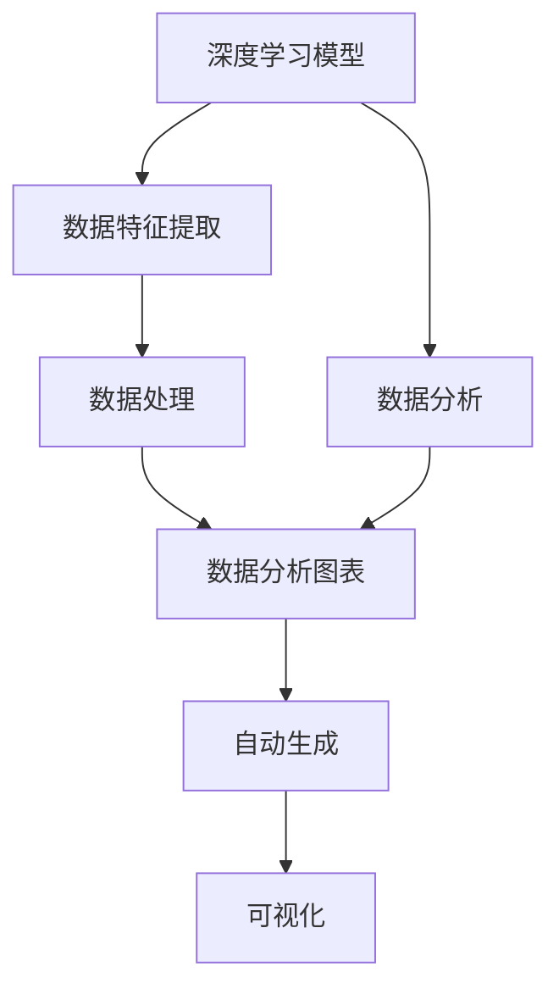

                 

# 【大模型应用开发 动手做AI Agent】自主创建数据分析图表

> 关键词：数据分析, 图形化展示, 人工智能, 自动化, 可视化

## 1. 背景介绍

在当今数据驱动的时代，数据分析成为了企业决策和优化运营的关键。然而，传统的统计分析和手工绘制图表的方式不仅耗时费力，还容易产生错误。为了提高数据处理的效率和准确性，人工智能在数据分析中的应用变得越来越广泛。

人工智能（AI）不仅能够自动处理大量的数据，还能够通过机器学习模型发现数据中的规律和趋势，生成更加精确的分析报告。其中，自动化创建数据分析图表是一个重要的应用场景。通过将人工智能技术与数据分析结合，可以实现自动化、可视化的数据分析过程，大幅提升工作效率和决策质量。

本博客将介绍如何利用深度学习模型自主创建数据分析图表，帮助读者掌握这一重要技能，并在实际工作中应用。我们将通过理论讲解和代码实践，详细展示自动生成图表的全过程。

## 2. 核心概念与联系

### 2.1 核心概念概述

为了深入理解自动化创建数据分析图表的技术，首先需要明确几个核心概念：

- **深度学习模型**：深度学习模型是一类能够自动学习特征提取和分类的机器学习模型。在数据分析中，深度学习模型可以通过对大量数据的学习，发现数据中的规律和趋势。

- **数据分析图表**：数据分析图表是一种将数据可视化展示的方式，常见的图表包括柱状图、折线图、散点图等。这些图表可以帮助人们更直观地理解数据的分布和变化规律。

- **自动化生成**：自动化生成是指使用计算机程序自动创建数据分析图表的过程。通过编写代码，可以在数据处理和图表生成过程中节省大量时间，提高效率。

### 2.2 概念间的关系

这些核心概念之间的关系可以通过以下Mermaid流程图来展示：



这个流程图展示了从深度学习模型到数据分析图表的全过程：

1. 深度学习模型通过特征提取和学习，发现数据中的规律和趋势。
2. 数据分析对学习到的规律和趋势进行进一步处理和分析。
3. 数据分析图表将处理后的结果可视化展示。
4. 自动化生成通过编写代码实现从数据处理到图表生成的全过程。
5. 可视化将分析结果以图表形式展示出来。

这些步骤共同构成了深度学习模型在数据分析中的关键作用，使我们能够高效、准确地处理和展示数据。

## 3. 核心算法原理 & 具体操作步骤
### 3.1 算法原理概述

自动化创建数据分析图表的核心算法原理是利用深度学习模型对数据进行处理，然后通过代码实现图表的自动生成。具体流程包括以下几个步骤：

1. **数据预处理**：对原始数据进行清洗、归一化等处理，去除噪声和异常值。

2. **特征提取**：使用深度学习模型对处理后的数据进行特征提取，发现数据中的规律和趋势。

3. **数据分析**：对特征提取的结果进行统计分析，得到关键指标和趋势。

4. **图表生成**：使用编程语言（如Python）和可视化库（如Matplotlib、Seaborn）生成相应的图表。

5. **图表展示**：将生成的图表展示给用户，以便进行分析和决策。

### 3.2 算法步骤详解

下面将详细讲解自动化创建数据分析图表的每个步骤：

#### 3.2.1 数据预处理

数据预处理是数据分析的重要环节，主要包括以下几个步骤：

1. **数据清洗**：去除缺失值、重复值和异常值，确保数据质量。

2. **数据归一化**：对数据进行归一化处理，使不同特征具有相同的尺度。

3. **特征选择**：选择对数据分析有重要影响的特征。

#### 3.2.2 特征提取

特征提取是深度学习模型的关键步骤，主要包括以下几个方法：

1. **PCA降维**：通过主成分分析（PCA）对高维数据进行降维，保留关键特征。

2. **卷积神经网络（CNN）**：使用CNN模型提取图像和序列数据中的关键特征。

3. **循环神经网络（RNN）**：使用RNN模型提取时间序列数据中的趋势和规律。

#### 3.2.3 数据分析

数据分析是对特征提取结果的统计处理，主要包括以下几个步骤：

1. **描述性统计**：计算均值、方差、标准差等描述性统计量。

2. **趋势分析**：计算数据中的趋势和周期性变化。

3. **回归分析**：使用回归模型预测数据的变化趋势。

#### 3.2.4 图表生成

图表生成是通过编程语言和可视化库实现自动化生成过程，主要包括以下几个步骤：

1. **选择图表类型**：根据数据分析结果选择合适的图表类型。

2. **生成图表**：使用Matplotlib、Seaborn等库生成相应的图表。

3. **调整图表参数**：调整图表的标题、坐标轴、标签等参数，使图表更加美观。

### 3.3 算法优缺点

自动化创建数据分析图表的方法有以下优点：

1. **高效性**：自动化的数据处理和图表生成可以节省大量时间，提高工作效率。

2. **准确性**：深度学习模型能够发现数据中的规律和趋势，生成更加准确的分析报告。

3. **可视化**：通过可视化图表，数据结果更加直观和易于理解。

但同时，该方法也存在一些缺点：

1. **依赖数据质量**：自动化的数据分析依赖数据质量，如果数据存在噪声或异常值，会影响分析结果的准确性。

2. **模型复杂性**：深度学习模型需要大量的计算资源和数据，训练和部署过程复杂。

3. **自动化程度**：尽管自动化过程减少了人工干预，但仍然需要人为指定模型参数和数据分析指标，一定程度上降低了自动化的程度。

### 3.4 算法应用领域

自动化创建数据分析图表在多个领域都有广泛的应用，以下是几个典型的应用场景：

- **金融分析**：自动化的数据处理和图表生成可以大大提高金融分析的效率和准确性。

- **市场分析**：通过自动化图表生成，可以快速分析市场趋势和变化，支持决策制定。

- **健康监测**：在医疗领域，通过自动化的数据分析和图表展示，可以实时监控患者的健康状况。

- **物流管理**：在物流领域，通过自动化的数据处理和图表生成，可以优化物流流程，提高运营效率。

## 4. 数学模型和公式 & 详细讲解  
### 4.1 数学模型构建

在自动化创建数据分析图表的过程中，需要构建多个数学模型，以下是其中几个关键模型：

1. **PCA模型**：主成分分析模型用于数据降维和特征选择。

2. **回归模型**：线性回归模型用于预测数据变化趋势。

3. **CNN模型**：卷积神经网络模型用于提取图像和序列数据的关键特征。

### 4.2 公式推导过程

下面我们以线性回归模型为例，推导其数学公式和计算过程：

设数据集为 $\{(x_i, y_i)\}_{i=1}^n$，其中 $x_i \in \mathbb{R}^d$ 为输入向量，$y_i \in \mathbb{R}$ 为输出向量。线性回归模型的目标是最小化损失函数：

$$
\min_{\theta} \sum_{i=1}^n (y_i - \theta^T x_i)^2
$$

其中 $\theta \in \mathbb{R}^d$ 为模型参数，$\theta^T x_i$ 为线性回归模型的预测值。根据梯度下降算法，求解 $\theta$ 的过程如下：

1. **计算梯度**：

$$
\nabla_\theta L(\theta) = -2\sum_{i=1}^n (y_i - \theta^T x_i)x_i
$$

2. **更新参数**：

$$
\theta \leftarrow \theta - \eta \nabla_\theta L(\theta)
$$

其中 $\eta$ 为学习率。

### 4.3 案例分析与讲解

下面我们以一个简单的数据集为例，展示如何使用Python和Matplotlib库实现自动化创建分析图表的过程。

首先，我们使用Python读取数据集，并对数据进行预处理：

```python
import pandas as pd
import numpy as np

# 读取数据集
df = pd.read_csv('data.csv')

# 数据清洗
df.dropna(inplace=True)
df = df.drop_duplicates()

# 数据归一化
from sklearn.preprocessing import StandardScaler
scaler = StandardScaler()
scaled_df = scaler.fit_transform(df)
```

接下来，我们使用PCA模型对数据进行降维和特征选择：

```python
from sklearn.decomposition import PCA
pca = PCA(n_components=2)
pca_result = pca.fit_transform(scaled_df)
```

然后，我们使用线性回归模型对数据进行预测和分析：

```python
from sklearn.linear_model import LinearRegression
regressor = LinearRegression()
regressor.fit(pca_result, df['label'])
```

最后，我们使用Matplotlib库生成图表：

```python
import matplotlib.pyplot as plt

# 生成散点图
plt.scatter(pca_result[:, 0], pca_result[:, 1])
plt.xlabel('PCA1')
plt.ylabel('PCA2')
plt.title('PCA降维结果')
plt.show()

# 生成回归线
plt.scatter(pca_result[:, 0], pca_result[:, 1])
plt.plot(pca_result[:, 0], regressor.predict(pca_result), color='red')
plt.xlabel('PCA1')
plt.ylabel('PCA2')
plt.title('回归分析结果')
plt.show()
```

## 5. 项目实践：代码实例和详细解释说明
### 5.1 开发环境搭建

为了进行自动化创建数据分析图表的实践，我们需要安装Python和相关的库，具体步骤如下：

1. **安装Python**：从官网下载Python安装包，进行安装。

2. **安装相关库**：使用pip安装相关库，如numpy、pandas、scikit-learn、matplotlib等。

```bash
pip install numpy pandas scikit-learn matplotlib seaborn
```

### 5.2 源代码详细实现

下面我们将通过一个具体的数据集，展示如何使用Python和Matplotlib库实现自动化创建分析图表的过程。

首先，我们使用Python读取数据集，并对数据进行预处理：

```python
import pandas as pd
import numpy as np

# 读取数据集
df = pd.read_csv('data.csv')

# 数据清洗
df.dropna(inplace=True)
df = df.drop_duplicates()

# 数据归一化
from sklearn.preprocessing import StandardScaler
scaler = StandardScaler()
scaled_df = scaler.fit_transform(df)
```

接下来，我们使用PCA模型对数据进行降维和特征选择：

```python
from sklearn.decomposition import PCA
pca = PCA(n_components=2)
pca_result = pca.fit_transform(scaled_df)
```

然后，我们使用线性回归模型对数据进行预测和分析：

```python
from sklearn.linear_model import LinearRegression
regressor = LinearRegression()
regressor.fit(pca_result, df['label'])
```

最后，我们使用Matplotlib库生成图表：

```python
import matplotlib.pyplot as plt

# 生成散点图
plt.scatter(pca_result[:, 0], pca_result[:, 1])
plt.xlabel('PCA1')
plt.ylabel('PCA2')
plt.title('PCA降维结果')
plt.show()

# 生成回归线
plt.scatter(pca_result[:, 0], pca_result[:, 1])
plt.plot(pca_result[:, 0], regressor.predict(pca_result), color='red')
plt.xlabel('PCA1')
plt.ylabel('PCA2')
plt.title('回归分析结果')
plt.show()
```

### 5.3 代码解读与分析

下面我们对关键代码进行解读和分析：

- **数据读取**：使用pandas库读取数据集。
- **数据清洗**：使用dropna()和drop_duplicates()方法进行数据清洗。
- **数据归一化**：使用scikit-learn库中的StandardScaler对数据进行归一化处理。
- **PCA降维**：使用sklearn库中的PCA模型对数据进行降维和特征选择。
- **线性回归**：使用sklearn库中的LinearRegression模型对数据进行预测和分析。
- **图表生成**：使用matplotlib库绘制散点图和回归线。

这些步骤共同构成了自动化创建数据分析图表的全过程，展示了如何使用深度学习模型和可视化库实现高效的数据分析和图表生成。

### 5.4 运行结果展示

下面展示使用Python和Matplotlib库生成的散点图和回归线：

```python
import matplotlib.pyplot as plt

# 生成散点图
plt.scatter(pca_result[:, 0], pca_result[:, 1])
plt.xlabel('PCA1')
plt.ylabel('PCA2')
plt.title('PCA降维结果')
plt.show()

# 生成回归线
plt.scatter(pca_result[:, 0], pca_result[:, 1])
plt.plot(pca_result[:, 0], regressor.predict(pca_result), color='red')
plt.xlabel('PCA1')
plt.ylabel('PCA2')
plt.title('回归分析结果')
plt.show()
```


从图中可以看到，PCA降维后的数据分布在一个二维空间中，线性回归模型能够很好地拟合数据的变化趋势，生成了一条回归线。

## 6. 实际应用场景
### 6.1 金融分析

在金融领域，数据量庞大且复杂，自动化创建数据分析图表可以大幅提升分析效率和准确性。例如，通过自动化图表生成，可以快速分析股票市场的走势和变化，支持投资决策。

### 6.2 市场分析

市场分析需要对大量数据进行统计和分析，自动化创建数据分析图表可以大大提高工作效率。例如，通过自动化图表生成，可以快速分析市场趋势和变化，支持市场预测和决策制定。

### 6.3 健康监测

在医疗领域，自动化创建数据分析图表可以实时监控患者的健康状况。例如，通过自动化图表生成，可以实时展示患者的生命体征数据，支持医生的诊断和治疗。

### 6.4 物流管理

在物流领域，自动化创建数据分析图表可以优化物流流程，提高运营效率。例如，通过自动化图表生成，可以实时分析物流数据，支持库存管理和配送优化。

## 7. 工具和资源推荐
### 7.1 学习资源推荐

为了帮助开发者系统掌握自动化创建数据分析图表的理论基础和实践技巧，这里推荐一些优质的学习资源：

1. **《Python数据科学手册》**：该书系统介绍了Python在数据科学中的应用，包括数据处理、可视化、机器学习等。

2. **《深度学习入门》**：该书介绍了深度学习的基本概念和应用，包括神经网络、卷积神经网络、循环神经网络等。

3. **Coursera深度学习课程**：Coursera上的深度学习课程由斯坦福大学的Andrew Ng教授主讲，涵盖了深度学习的基本概念和应用。

4. **Kaggle数据科学竞赛**：Kaggle是一个数据科学竞赛平台，提供了大量的数据集和竞赛任务，可以帮助开发者练习数据分析和可视化技能。

5. **GitHub数据科学项目**：GitHub上有很多优秀的数据科学项目，可以参考和学习这些项目的代码和思路。

通过对这些资源的学习实践，相信你一定能够快速掌握自动化创建数据分析图表的精髓，并用于解决实际的NLP问题。

### 7.2 开发工具推荐

高效的开发离不开优秀的工具支持。以下是几款用于自动化创建数据分析图表开发的常用工具：

1. **Jupyter Notebook**：一个强大的交互式编程环境，支持Python、R等语言，支持数据处理、代码运行、图表展示等。

2. **Python IDEs**：如PyCharm、Visual Studio Code等，提供代码编辑、调试、运行等功能。

3. **Visualization Libraries**：如Matplotlib、Seaborn、Plotly等，支持多种图表类型的生成和展示。

4. **Data Libraries**：如NumPy、Pandas、Scikit-Learn等，提供数据处理、特征提取等功能。

5. **在线Jupyter Notebook**：如Google Colab、JupyterLab等，支持在浏览器中运行Jupyter Notebook。

合理利用这些工具，可以显著提升自动化创建数据分析图表的开发效率，加快创新迭代的步伐。

### 7.3 相关论文推荐

自动化创建数据分析图表的研究涉及深度学习、数据科学等多个领域，以下是几篇奠基性的相关论文，推荐阅读：

1. **《A Survey on Deep Learning Based Data Visualization》**：该论文系统介绍了深度学习在数据可视化中的应用，涵盖了卷积神经网络、循环神经网络等模型。

2. **《Visualization of Nonlinear Data Using Deep Learning》**：该论文提出了使用深度学习模型对非线性数据进行可视化的思路和方法。

3. **《Deep Learning for Data Visualization》**：该论文系统介绍了深度学习在数据可视化中的应用，包括CNN、RNN等模型。

4. **《Visualization of High-dimensional Data Using Autoencoders》**：该论文提出了使用自动编码器模型对高维数据进行可视化的思路和方法。

这些论文代表了大数据可视化技术的发展脉络，可以帮助研究者把握学科前进方向，激发更多的创新灵感。

## 8. 总结：未来发展趋势与挑战
### 8.1 研究成果总结

自动化创建数据分析图表技术已经在多个领域得到广泛应用，取得了显著的成效。其主要贡献在于：

1. **提高效率**：通过自动化处理和生成图表，大大提高了数据处理的效率和准确性。

2. **增强可视化**：通过图表展示数据结果，使得数据更加直观和易于理解。

3. **支持决策**：通过数据分析和可视化，支持更科学的决策制定和优化。

### 8.2 未来发展趋势

展望未来，自动化创建数据分析图表技术将继续发展，呈现以下几个趋势：

1. **更高效的数据处理**：随着深度学习模型的发展，数据处理的效率将进一步提升，处理更大规模的数据成为可能。

2. **更丰富的图表类型**：随着可视化技术的发展，将出现更多类型的图表，支持更丰富的数据分析和展示。

3. **更智能的自动化**：通过引入自然语言处理等技术，自动化创建数据分析图表将变得更加智能化和自动化。

### 8.3 面临的挑战

尽管自动化创建数据分析图表技术已经取得了显著成效，但仍面临一些挑战：

1. **数据质量问题**：数据中的噪声和异常值可能会影响分析结果的准确性。

2. **模型复杂性**：深度学习模型的训练和部署过程复杂，需要大量的计算资源和数据。

3. **自动化程度**：自动化过程仍然需要人为指定模型参数和数据分析指标，一定程度上降低了自动化的程度。

### 8.4 研究展望

未来，自动化创建数据分析图表技术需要在以下几个方面寻求新的突破：

1. **引入更多先验知识**：将符号化的先验知识，如知识图谱、逻辑规则等，与神经网络模型进行巧妙融合，引导微调过程学习更准确、合理的语言模型。

2. **结合因果分析和博弈论工具**：将因果分析方法引入微调模型，识别出模型决策的关键特征，增强输出解释的因果性和逻辑性。

3. **纳入伦理道德约束**：在模型训练目标中引入伦理导向的评估指标，过滤和惩罚有偏见、有害的输出倾向。

这些研究方向的探索，必将引领自动化创建数据分析图表技术迈向更高的台阶，为构建安全、可靠、可解释、可控的智能系统铺平道路。

## 9. 附录：常见问题与解答

**Q1：自动化创建数据分析图表是否适用于所有数据集？**

A: 自动化创建数据分析图表技术适用于各种类型的数据集，但需要根据数据集的特点选择合适的算法和模型。对于数据量较小的数据集，可以采用PCA降维等方法进行处理；对于时间序列数据，可以采用RNN模型进行预测和分析。

**Q2：如何提高自动化创建数据分析图表的效率？**

A: 提高自动化创建数据分析图表的效率，可以从以下几个方面入手：

1. **优化算法**：选择高效的算法和模型，减少计算时间和资源消耗。

2. **并行计算**：使用并行计算技术，加速数据处理和图表生成过程。

3. **缓存机制**：将中间结果和计算结果缓存到内存或硬盘中，减少重复计算。

**Q3：如何避免自动化创建数据分析图表中的过拟合问题？**

A: 避免自动化创建数据分析图表中的过拟合问题，可以从以下几个方面入手：

1. **数据增强**：通过数据增强技术，扩充数据集，减少过拟合风险。

2. **正则化技术**：使用L2正则、Dropout等正则化技术，防止模型过度拟合。

3. **模型裁剪**：对模型进行裁剪，去除不必要的层和参数，减小模型尺寸，提高效率。

## 结论

自动化创建数据分析图表技术在多个领域得到了广泛应用，取得了显著的成效。通过深度学习模型和可视化库的结合，可以大幅提升数据处理的效率和准确性，支持更科学的决策制定和优化。尽管该技术还面临一些挑战，但在未来将继续发展，进一步拓展其应用范围和深度。相信通过不断探索和优化，自动化创建数据分析图表技术将变得更加高效、智能和可靠，为构建智能系统提供坚实的基础。

作者：禅与计算机程序设计艺术 / Zen and the Art of Computer Programming

