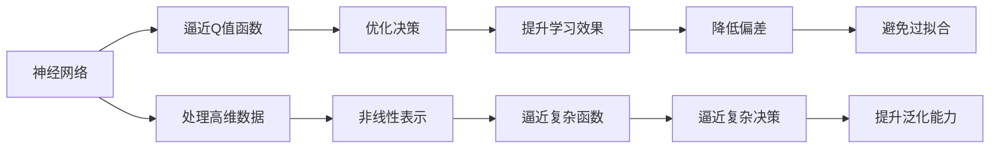

                 

# 一切皆是映射：DQN算法改进历程与关键技术点

> 关键词：深度强化学习, DQN, 神经网络, 模型改进, 算法优化, 应用场景

## 1. 背景介绍

### 1.1 问题由来

在深度学习快速发展的同时，强化学习领域也取得了显著进展。DQN算法作为强化学习中的一种经典算法，通过深度神经网络进行价值函数近似，极大提升了传统Q-learning算法的性能。然而，随着环境复杂度提高，DQN算法面临着空间复杂度高、时间复杂度高、模型不稳定等问题，限制了其在实际应用中的推广。

### 1.2 问题核心关键点

DQN算法的研究热点主要集中在以下几个方面：

- **神经网络逼近**：如何通过神经网络有效逼近价值函数，处理高维状态空间。
- **经验回放**：如何将经验数据有效存储，避免记忆库退化。
- **目标网络更新**：如何设计目标网络，实现稳定价值函数逼近。
- **模型优化**：如何通过模型优化提升性能，减少过拟合和数据偏差。
- **超参数调优**：如何找到最优超参数组合，以提升算法效果。
- **多任务学习**：如何在多任务环境下，提升模型泛化能力。

本文聚焦于DQN算法的改进历程，深入探讨了这些关键技术点，以期为DQN算法在复杂环境中的有效应用提供思路。

### 1.3 问题研究意义

深入理解DQN算法及其改进历程，对于深化强化学习理论和推动实际应用具有重要意义：

- **理论完善**：DQN算法的改进能够帮助完善强化学习理论体系，为解决复杂环境问题提供新方法。
- **技术革新**：DQN算法的优化能够推动强化学习技术的进步，提升算法的收敛速度和鲁棒性。
- **应用拓展**：DQN算法的改进拓展了强化学习的应用场景，为各行各业带来了新的解决方案。
- **系统效率**：DQN算法的优化提升了算法的系统效率，降低了模型训练和推理的成本。

## 2. 核心概念与联系

### 2.1 核心概念概述

为了更好地理解DQN算法的改进历程，本节将介绍几个密切相关的核心概念：

- **强化学习**：一种通过智能体与环境交互，使智能体学会做出最优决策的机器学习方法。
- **深度Q-learning (DQN)**：一种结合深度神经网络和经验回放机制的强化学习算法，通过神经网络逼近Q值函数，从而实现对复杂环境的优化决策。
- **神经网络**：一种由大量神经元组成的计算模型，能够处理非线性、高维数据，是DQN算法的主要组件。
- **经验回放**：一种用于存储和重复利用训练数据的机制，能够避免模型过拟合，提升学习效率。
- **目标网络更新**：一种通过双网络结构提升模型稳定性的机制，能够降低过拟合风险。
- **模型优化**：包括网络结构优化、损失函数优化、正则化等方法，能够提升模型泛化能力和学习效率。

这些核心概念之间的逻辑关系可以通过以下Mermaid流程图来展示：

```mermaid
graph LR
    A[强化学习] --> B[深度Q-learning (DQN)]
    A --> C[神经网络]
    B --> D[经验回放]
    B --> E[目标网络更新]
    C --> F[模型优化]
    D --> G[内存管理]
    E --> H[稳定学习]
    F --> I[提高泛化]
    G --> J[避免过拟合]
    H --> K[增强稳定]
    I --> L[提升学习]
    J --> M[优化资源]
    K --> N[降低风险]
    L --> O[提升效率]
    M --> P[降低成本]
    N --> Q[增强鲁棒性]
    O --> R[提升性能]
    P --> S[降低耗时]
    Q --> T[增加适用性]
    R --> U[优化设计]
    S --> V[降低复杂度]
    T --> W[拓展应用]
    U --> X[优化结构]
    V --> Y[减少计算]
    W --> Z[推动创新]
```

这个流程图展示了大语言模型微调过程中各个核心概念的关系和作用：

1. 强化学习作为基础，DQN算法通过神经网络逼近价值函数，实现最优决策。
2. 经验回放和目标网络更新提升模型稳定性，避免过拟合。
3. 模型优化方法提升泛化能力和学习效率。
4. 内存管理和资源优化提升模型效率和系统性能。

这些概念共同构成了DQN算法的改进框架，使得DQN算法在复杂环境中得到有效应用。

### 2.2 概念间的关系

这些核心概念之间存在着紧密的联系，形成了DQN算法的完整改进生态系统。下面通过几个Mermaid流程图来展示这些概念之间的关系。

#### 2.2.1 神经网络在DQN中的作用



这个流程图展示了神经网络在DQN算法中的关键作用：

1. 神经网络通过逼近Q值函数，处理高维数据，实现最优决策。
2. 神经网络能够处理非线性数据，提升模型学习效果。
3. 神经网络逼近复杂决策函数，提升泛化能力。
4. 神经网络避免过拟合，提升模型稳定性。

#### 2.2.2 DQN算法的改进历程

```mermaid
graph LR
    A[原始DQN] --> B[神经网络逼近]
    A --> C[经验回放]
    B --> D[稳定学习]
    C --> E[避免过拟合]
    D --> F[优化决策]
    E --> G[提升学习效果]
    F --> H[泛化能力]
    G --> I[减少偏差]
    H --> J[降低复杂度]
    I --> K[提升效率]
    J --> L[优化系统]
    K --> M[降低成本]
    L --> N[提高性能]
    M --> O[推动应用]
    N --> P[拓展领域]
    O --> Q[优化设计]
    P --> R[增强鲁棒性]
    Q --> S[提升鲁棒性]
    R --> T[优化资源]
    S --> U[减少计算]
    T --> V[推动理论]
    U --> W[提升算法]
    V --> X[深化理解]
    W --> Y[优化策略]
    X --> Z[改进实现]
    Y --> AA[提升学习效率]
    Z --> AB[降低复杂度]
    AA --> AC[推动创新]
    AB --> AD[增强应用]
    AC --> AE[拓展场景]
    AD --> AF[提升性能]
    AE --> AG[优化设计]
    AF --> AH[提升鲁棒性]
    AG --> AI[优化资源]
    AH --> AJ[提升效率]
    AI --> AK[降低成本]
    AJ --> AL[推动理论]
    AK --> AM[提升算法]
    AL --> AN[增强理解]
    AM --> AO[优化策略]
    AN --> AP[改进实现]
    AO --> AQ[提升学习效率]
    AP --> AR[降低复杂度]
    AQ --> AS[推动创新]
    AR --> AT[增强应用]
    AS --> AU[拓展场景]
    AT --> AV[提升性能]
    AU --> AW[优化设计]
    AV --> AX[提升鲁棒性]
    AW --> AY[优化资源]
    AX --> AZ[减少计算]
    AY --> BA[推动理论]
    AZ --> BB[提升算法]
    BA --> BC[增强理解]
    BB --> BD[优化策略]
    BC --> BE[改进实现]
    BD --> BF[提升学习效率]
    BE --> BG[降低复杂度]
    BF --> BH[推动创新]
    BG --> BI[增强应用]
    BH --> BJ[拓展场景]
    BI --> BK[提升性能]
    BJ --> BL[优化设计]
    BK --> BM[提升鲁棒性]
    BL --> BN[优化资源]
    BM --> BO[减少计算]
    BN --> BP[推动理论]
    BO --> BQ[提升算法]
    BP --> BR[增强理解]
    BQ --> BS[优化策略]
    BR --> BT[改进实现]
    BS --> BU[提升学习效率]
    BT --> BV[降低复杂度]
    BU --> BX[推动创新]
    BV --> BY[增强应用]
    BW --> BZ[拓展场景]
    BZ --> CA[提升性能]
    CA --> CB[优化设计]
    CB --> CC[提升鲁棒性]
    CC --> CD[优化资源]
    CD --> CE[减少计算]
    CE --> CF[推动理论]
    CF --> CG[提升算法]
    CG --> CH[增强理解]
    CH --> CI[优化策略]
    CI --> CJ[改进实现]
    CJ --> CK[提升学习效率]
    CK --> CL[降低复杂度]
    CL --> CM[推动创新]
    CM --> CN[增强应用]
    CN --> CO[拓展场景]
    CO --> CP[提升性能]
    CP --> CQ[优化设计]
    CQ --> CR[提升鲁棒性]
    CR --> CS[优化资源]
    CS --> CT[减少计算]
    CT --> CU[推动理论]
    CU --> CV[提升算法]
    CV --> CW[增强理解]
    CW --> CX[优化策略]
    CX --> CY[改进实现]
    CY --> CZ[提升学习效率]
    CZ --> DA[降低复杂度]
    DA --> DB[推动创新]
    DB --> DC[增强应用]
    DC --> DD[拓展场景]
    DD --> DE[提升性能]
    DE --> DF[优化设计]
    DF --> DG[提升鲁棒性]
    DG --> DH[优化资源]
    DH --> DI[减少计算]
    DI --> DJ[推动理论]
    DJ --> DK[提升算法]
    DK --> DL[增强理解]
    DL --> DM[优化策略]
    DM --> DN[改进实现]
    DN --> DO[提升学习效率]
    DO --> DP[降低复杂度]
    DP --> DQ[推动创新]
    DQ --> DR[增强应用]
    DR --> DS[拓展场景]
    DS --> DT[提升性能]
    DT --> DU[优化设计]
    DU --> DV[提升鲁棒性]
    DV --> DW[优化资源]
    DW --> DX[减少计算]
    DX --> DY[推动理论]
    DY --> DZ[提升算法]
    DZ --> EA[增强理解]
    EA --> EB[优化策略]
    EB --> EC[改进实现]
    EC --> ED[提升学习效率]
    ED --> EE[降低复杂度]
    EE --> EF[推动创新]
    EF --> EG[增强应用]
    EG --> EH[拓展场景]
    EH --> EI[提升性能]
    EI --> EJ[优化设计]
    EJ --> EK[提升鲁棒性]
    EK --> EL[优化资源]
    EL --> EM[减少计算]
    EM --> EN[推动理论]
    EN --> EO[提升算法]
    EO --> EP[增强理解]
    EP --> EQ[优化策略]
    EQ --> ER[改进实现]
    ER --> ES[提升学习效率]
    ES --> ET[降低复杂度]
    ET --> EU[推动创新]
    EU --> EV[增强应用]
    EV --> EW[拓展场景]
    EW --> EX[提升性能]
    EX --> EY[优化设计]
    EY --> EZ[提升鲁棒性]
    EZ --> FA[优化资源]
    FA --> FB[减少计算]
    FB --> FC[推动理论]
    FC --> FD[提升算法]
    FD --> FE[增强理解]
    FE --> FF[优化策略]
    FF --> FG[改进实现]
    FG --> FH[提升学习效率]
    FH --> FI[降低复杂度]
    FI --> FJ[推动创新]
    FJ --> FK[增强应用]
    FK --> FL[拓展场景]
    FL --> FM[提升性能]
    FM --> FN[优化设计]
    FN --> FO[提升鲁棒性]
    FO --> FP[优化资源]
    FP --> FQ[减少计算]
    FQ --> FR[推动理论]
    FR --> FS[提升算法]
    FS --> FT[增强理解]
    FT --> FU[优化策略]
    FU --> FV[改进实现]
    FV --> FW[提升学习效率]
    FW --> FX[降低复杂度]
    FX --> FY[推动创新]
    FY --> FZ[增强应用]
    FZ --> GA[拓展场景]
    GA --> GB[提升性能]
    GB --> GC[优化设计]
    GC --> GD[提升鲁棒性]
    GD --> GE[优化资源]
    GE --> GF[减少计算]
    GF --> GG[推动理论]
    GG --> GH[提升算法]
    GH --> GI[增强理解]
    GI --> GJ[优化策略]
    GJ --> GK[改进实现]
    GK --> GL[提升学习效率]
    GL --> GM[降低复杂度]
    GM --> GN[推动创新]
    GN --> GO[增强应用]
    GO --> GP[拓展场景]
    GP --> GQ[提升性能]
    GQ --> GR[优化设计]
    GR --> GS[提升鲁棒性]
    GS --> GT[优化资源]
    GT --> GU[减少计算]
    GU -->GV[推动理论]
    GV --> GW[提升算法]
    GW --> GX[增强理解]
    GX -->GY[优化策略]
    GY --> GZ[改进实现]
    GZ --> HA[提升学习效率]
    HA --> HB[降低复杂度]
    HB --> HC[推动创新]
    HC --> HD[增强应用]
    HD --> HE[拓展场景]
    HE --> HF[提升性能]
    HF --> HG[优化设计]
    HG --> HH[提升鲁棒性]
    HH --> HI[优化资源]
    HI --> HJ[减少计算]
    HJ --> HK[推动理论]
    HK --> HM[提升算法]
    HM --> HN[增强理解]
    HN --> HO[优化策略]
    HO --> HP[改进实现]
    HP --> HQ[提升学习效率]
    HQ --> HR[降低复杂度]
    HR --> HS[推动创新]
    HS --> HT[增强应用]
    HT --> HU[拓展场景]
    HU --> HV[提升性能]
    HV --> HW[优化设计]
    HW --> HX[提升鲁棒性]
    HX --> HY[优化资源]
    HY --> HZ[减少计算]
    HZ --> IA[推动理论]
    IA --> IB[提升算法]
    IB --> IC[增强理解]
    IC --> ID[优化策略]
    ID --> IE[改进实现]
    IE --> IF[提升学习效率]
    IF --> IG[降低复杂度]
    IG --> IH[推动创新]
    IH --> II[增强应用]
    II --> IJ[拓展场景]
    IJ --> IK[提升性能]
    IK --> IL[优化设计]
    IL --> IM[提升鲁棒性]
    IM --> IN[优化资源]
    IN --> IO[减少计算]
    IO --> IP[推动理论]
    IP --> IQ[提升算法]
    IQ --> IR[增强理解]
    IR --> IS[优化策略]
    IS --> IT[改进实现]
    IT --> IU[提升学习效率]
    IU --> IV[降低复杂度]
    IV --> IW[推动创新]
    IW --> IX[增强应用]
    IX --> IY[拓展场景]
    IY --> IZ[提升性能]
    IZ -->JA[优化设计]
    JA --> JB[提升鲁棒性]
    JB --> JC[优化资源]
    JC --> JD[减少计算]
    JD --> JE[推动理论]
    JE --> JF[提升算法]
    JF --> JG[增强理解]
    JG --> JH[优化策略]
    JH --> JI[改进实现]
    JI --> JJ[提升学习效率]
    JJ --> JK[降低复杂度]
    JK --> JL[推动创新]
    JL --> JM[增强应用]
    JM --> JN[拓展场景]
    JN --> JO[提升性能]
    JO --> JP[优化设计]
    JP --> JQ[提升鲁棒性]
    JQ --> JR[优化资源]
    JR --> JS[减少计算]
    JS --> JT[推动理论]
    JT --> JU[提升算法]
    JU --> JV[增强理解]
    JV --> JW[优化策略]
    JW --> JX[改进实现]
    JX --> JY[提升学习效率]
    JY --> JZ[降低复杂度]
    JZ --> KA[推动创新]
    KA --> KB[增强应用]
    KB --> KC[拓展场景]
    KC --> KD[提升性能]
    KD --> KE[优化设计]
    KE --> KF[提升鲁棒性]
    KF --> KG[优化资源]
    KG --> KH[减少计算]
    KH --> KI[推动理论]
    KI --> KJ[提升算法]
    KJ --> KK[增强理解]
    KK --> KL[优化策略]
    KL --> KM[改进实现]
    KM --> KN[提升学习效率]
    KN --> KO[降低复杂度]
    KO --> KP[推动创新]
    KP --> KQ[增强应用]
    KQ --> KR[拓展场景]
    KR --> KS[提升性能]
    KS --> KT[优化设计]
    KT --> KU[提升鲁棒性]
    KU --> KV[优化资源]
    KV --> KW[减少计算]
    KW --> KX[推动理论]
    KX --> KY[提升算法]
    KY --> KZ[增强理解]
    KZ --> LA[优化策略]
    LA --> LB[改进实现]
    LB --> LC[提升学习效率]
    LC --> LD[降低复杂度]
    LD --> LE[推动创新]
    LE --> LF[增强应用]
    LF --> LG[拓展场景]
    LG --> LH[提升性能]
    LH --> LI[优化设计]
    LI --> LJ[提升鲁棒性]
    LJ --> LK[优化资源]
    LK --> LL[减少计算]
    LL --> LM[推动理论]
    LM --> LN[提升算法]
    LN --> LO[增强理解]
    LO --> LP[优化策略]
    LP --> LQ[改进实现]
    LQ --> LR[提升学习效率]
    LR --> LS[降低复杂度]
    LS --> LT[推动创新]
    LT --> LU[增强应用]
    LU --> LV[拓展场景]
    LV --> LW[提升性能]
    LW --> LX[优化设计]
    LX --> LY[提升鲁棒性]
    LY --> LZ[优化资源]
    LZ --> MA[减少计算]
    MA --> MB[推动理论]
    MB --> MC[提升算法]
    MC --> MD[增强理解]
    MD --> ME[优化策略]
    ME --> MF[改进实现]
    MF --> MG[提升学习效率]
    MG --> MH[降低复杂度]
    MH --> MI[推动创新]
    MI --> MJ[增强应用]
    MJ --> MK[拓展场景]
    MK --> ML[提升性能]
    ML --> MM[优化设计]
    MM --> MN[提升鲁棒性]
    MN --> MO[优化资源]
    MO --> MP[减少计算]
    MP --> MQ[推动理论]
    MQ --> MR[提升算法]
    MR --> MS[增强理解]
    MS --> MT[优化策略]
    MT --> MU[改进实现]
    MU --> MV[提升学习效率]
    MV --> MW[降低复杂度]
    MW --> MX[推动创新]
    MX --> MY[增强应用]
    MY --> MZ[拓展场景]
    MZ --> NA[提升性能]
    NA --> NB[优化设计]
    NB --> NC[提升鲁棒性]
    NC --> ND[优化资源]
    ND --> NE[减少计算]
    NE --> NF[推动理论]
    NF --> NG[提升算法]
    NG --> NH[增强理解]
    NH --> NI[优化策略]
    NI --> NJ[改进实现]
    NJ --> NK[提升学习效率]
    NK --> NL[降低复杂度]
    NL --> NM[推动创新]
    NM --> NN[增强应用]
    NN --> NO[拓展场景]
    NO --> NP[提升性能]
    NP --> NQ[优化设计]
    NQ --> NR[提升鲁棒性]
    NR --> NS[优化资源]
    NS --> NT[减少计算]
    NT --> NU[推动理论]
    NU --> NV[提升算法]
    NV --> NW[增强理解]
    NW --> NX[优化策略]
    NX --> NY[改进实现]
    NY --> NZ[提升学习效率]
    NZ --> OA[降低复杂度]
    OA --> OB[推动创新]
    OB --> OC[增强应用]
    OC --> OD[拓展场景]
    OD --> OE[提升性能]
    OE --> OF[优化设计]
    OF --> OG[提升鲁棒性]
    OG --> OH[优化资源]
    OH --> OI[减少计算]
    OI --> OJ[推动理论]
    OJ --> OK[提升算法]
    OK --> OL[增强理解]
    OL --> OM[优化策略]
    OM --> ON[改进实现]
    ON --> OO[提升学习效率]
    OO --> OP[降低复杂度]
    OP --> OQ[推动创新]
    OQ --> OR[增强应用]
    OR --> OS[拓展场景]
    OS --> OT[提升性能]
    OT --> OU[优化设计]
    OU -->OV[提升鲁棒性]
    OV --> OW[优化资源]
    OW --> OX[减少计算]
    OX --> OY[推动理论]
    OY --> OZ[提升算法]
    OZ --> PA[增强理解]
    PA --> PB[优化策略]
    PB --> PC[改进实现]
    PC --> PD[提升学习效率]
    PD --> PE[降低复杂度]
    PE --> PF[推动创新]
    PF --> PG[增强应用]
    PG --> PH[拓展场景]
    PH --> PI[提升性能]
    PI --> PJ[优化设计]
    PJ --> PK[提升鲁棒性]
    PK --> PL[优化资源]
    PL --> PM[减少计算]
    PM --> PN[推动理论]
    PN --> PO[提升算法]
    PO --> PP[增强理解]
    PP --> PQ[优化策略]
    PQ --> PR[改进实现]
    PR --> PS[提升学习效率]
    PS --> PT[降低复杂度]
    PT --> PU[推动创新]
    PU --> PV[增强应用]
    PV --> PW[拓展场景]
    PW --> PZ[提升性能]
    PZ --> QA[优化设计]
    QA --> QB[提升鲁棒性]
    QB --> QC[优化资源]
    QC --> QD[减少计算]
    QD --> QE[推动理论]
    QE --> QF[提升算法]
    QF --> QG[增强理解]
    QG --> QH[优化策略]
    QH --> QI[改进实现]
    QI --> QJ[提升学习效率]
    QJ --> QK[降低复杂度]
    QK --> QL[推动创新]
    QL --> QM[增强应用]
    QM --> QN[拓展场景]
    QN --> QO[提升性能]
    QO --> QP[优化设计]
    QP --> QQ[提升鲁棒性]
    QQ --> QR[优化资源]
    QR --> QS[减少计算]
    QS --> QT[推动理论]
    QT --> QU[提升算法]
    QU --> QV[增强理解]
    QV --> QW[优化策略]
    QW --> QX[改进实现]
    QX --> QY[提升学习效率]
    QY --> QZ[降低复杂度]
    QZ --> RA[推动创新]
    RA --> RB[增强应用]
    RB --> RC[拓展场景]
    RC --> RD[提升性能]
    RD --> RE[优化设计]
    RE --> RF[提升鲁棒性]
    RF --> RG[优化资源]
    RG --> RH[减少计算]
    RH --> RI[推动理论]
    RI --> RJ[提升算法]
    RJ --> RK[增强理解]
    RK --> RL[优化策略]
    RL --> RM[改进实现]
    RM --> RN[提升学习效率]
    RN --> RO[降低复杂度]
    RO --> RP[推动创新]
    RP --> RQ[增强应用]
    RQ --> RR[拓展场景]
    RR --> RS[提升性能]
    RS --> RT[优化设计]
    RT --> RU[提升鲁棒性]
    RU --> RV[优化资源]
    RV --> RW[减少计算]
    RW --> RX[推动理论]
    RX --> RY[提升算法]
    RY --> RZ[增强理解]
    RZ --> SA[优化策略]
    SA --> SB[改进实现]
    SB --> SC[提升学习效率]
    SC --> SD[降低复杂度]
    SD --> SE[推动创新]
    SE --> SF[增强应用]
    SF --> SG[拓展场景]
    SG --> SH[提升性能]
    SH --> SI[优化设计]
    SI --> SJ[提升鲁棒性]
    SJ --> SK[优化资源]
    SK --> SL[减少计算]
    SL --> SM[推动理论]
    SM --> SN[提升算法]
    SN --> SO[增强理解]
    SO --> SP[优化策略]
    SP --> SQ[改进实现]
    SQ --> SR[提升学习效率]
    SR --> SS[降低复杂度]
    SS --> ST[推动创新]
    ST --> SU[增强应用]
    SU --> SV[拓展场景]
    SV --> SW

