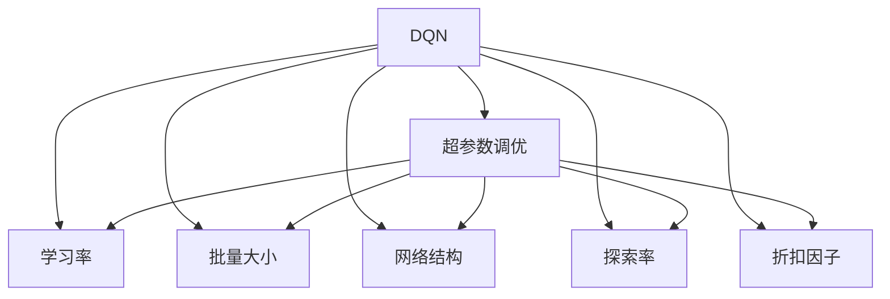
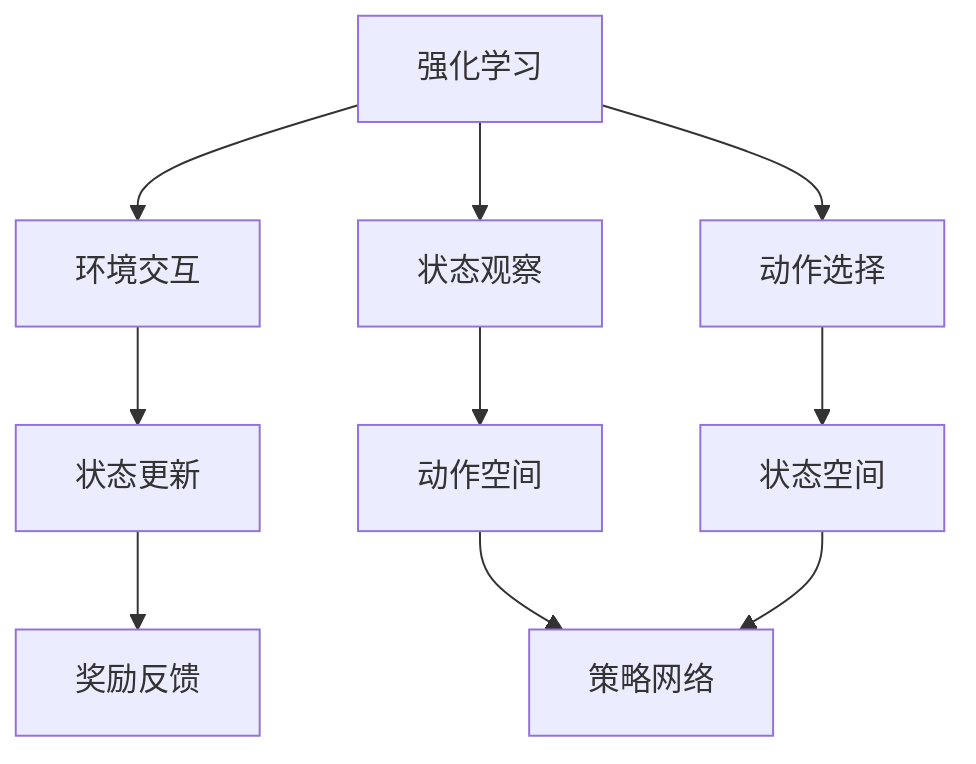
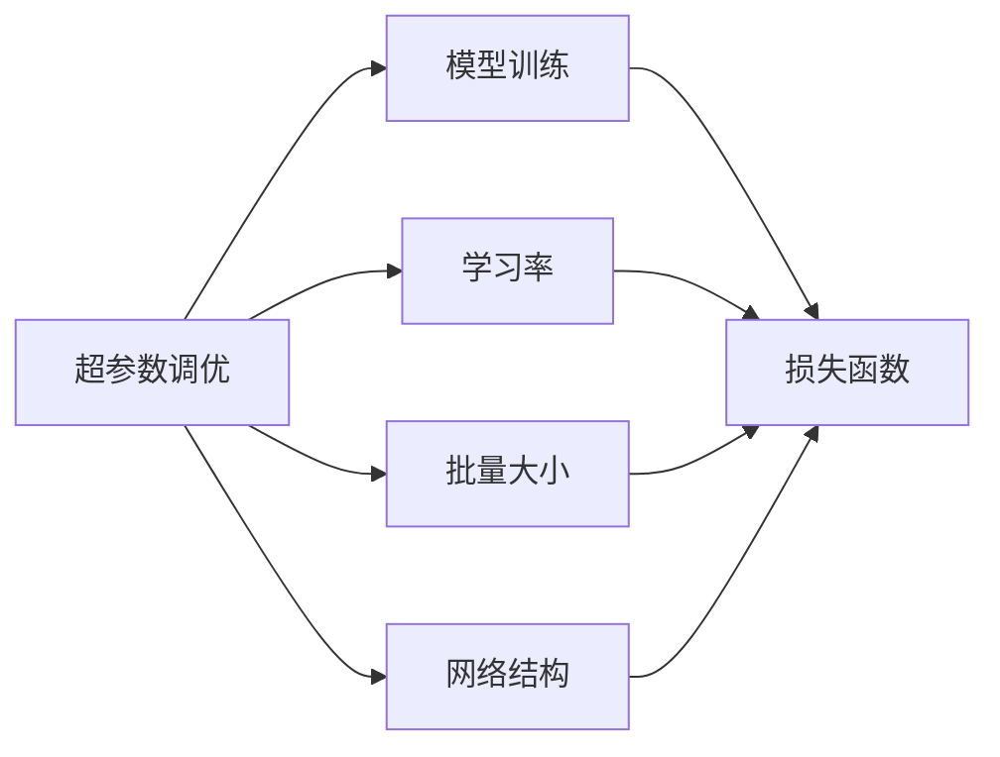
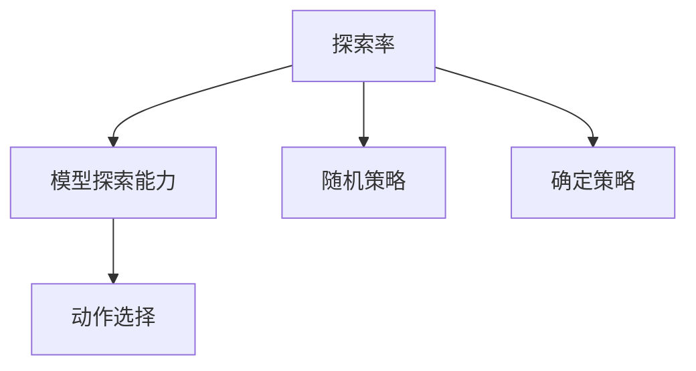
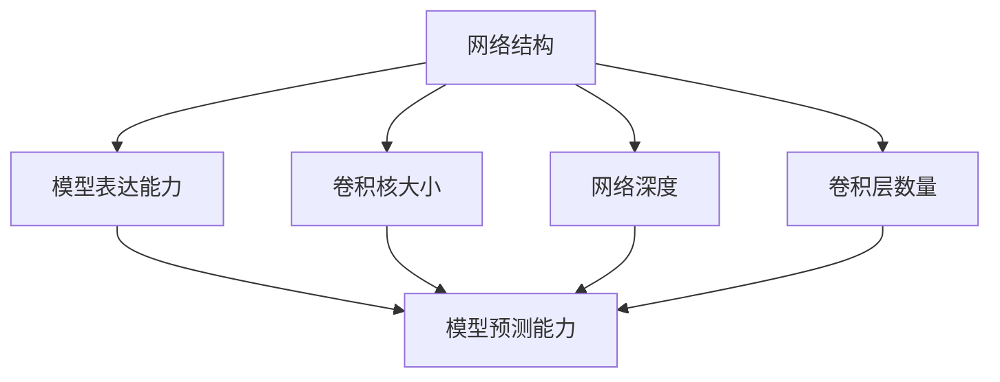
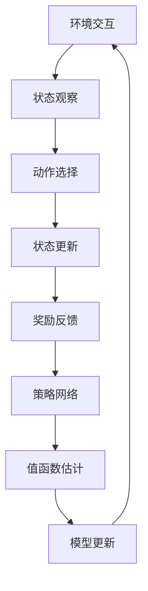

                 

# 一切皆是映射：DQN超参数调优指南：实验与心得

> 关键词：DQN,超参数调优,强化学习,蒙特卡洛方法,策略网络,探索率,深度Q网络,代理学习

## 1. 背景介绍

### 1.1 问题由来
深度强化学习（Deep Reinforcement Learning, DRL）作为当前最为流行的人工智能技术之一，已经在游戏、推荐、机器人等领域取得了突破性进展。其中，DQN（Deep Q-Network）方法以其简单有效的思路，成为了强化学习研究的热点，并在众多应用中展示了卓越的性能。然而，与所有深度学习模型一样，DQN模型也面临着过拟合、泛化能力不足等常见问题，使得模型在实际应用中表现并不理想。

针对这些问题，超参数调优成为DQN模型优化的重要手段之一。超参数是指在模型训练前需要手动设置的参数，如学习率、批量大小、网络结构等，它们的选取直接影响模型的最终性能。合理地调优超参数，可以在保证模型复杂度的情况下，获得更好的性能表现。

本文将详细介绍DQN模型的超参数调优方法，通过一系列的实验和分析，总结出一套切实可行的调优指南。希望通过本文的学习，读者能够掌握DQN模型调优的技巧，避免走弯路，快速构建出性能优越的DQN模型。

### 1.2 问题核心关键点
DQN模型的超参数调优主要涉及以下几个关键点：

1. **学习率**：控制模型参数更新的步长，过高或过低的学习率都会影响模型收敛效果。
2. **批量大小**：每次训练时的样本数量，影响模型训练速度和泛化能力。
3. **网络结构**：卷积核大小、网络深度、卷积层的数量等，影响模型的表达能力和学习效率。
4. **探索率**：在模型选择动作时的策略，控制模型与随机策略的平衡。
5. **折扣因子**：控制长期奖励的权重，影响模型的学习重点。

本文将通过理论分析与实验数据，逐一介绍这些关键点的调优方法，并结合实际应用场景进行具体分析。

## 2. 核心概念与联系

### 2.1 核心概念概述

为了更好地理解DQN模型的超参数调优方法，本节将介绍几个密切相关的核心概念：

- **DQN**：一种基于深度神经网络的强化学习算法，通过近似Q函数估计值函数，实现策略学习与模型训练。
- **超参数**：在模型训练前需要手动设置的参数，如学习率、批量大小、网络结构等，对模型性能有着重要影响。
- **探索率**：在模型选择动作时的策略，控制模型与随机策略的平衡，影响模型的探索能力和收敛速度。
- **蒙特卡洛方法**：一种用于估计值函数的统计学习方法，通过随机抽样样本计算Q函数，实现模型的预测与学习。
- **策略网络**：用于预测Q函数并指导动作选择的神经网络，通常由一个或多个卷积层和一个全连接层组成。

这些核心概念之间的逻辑关系可以通过以下Mermaid流程图来展示：



这个流程图展示了DQN模型的核心概念及其之间的关系：

1. DQN模型通过超参数调优来优化模型性能。
2. 超参数包括学习率、批量大小、网络结构、探索率、折扣因子等，共同影响模型性能。
3. 学习率、批量大小、网络结构等参数可以通过实验方法进行优化。
4. 探索率和折扣因子则需要根据具体应用场景进行调整。

通过理解这些核心概念，我们可以更好地把握DQN模型的工作原理和调优方向。

### 2.2 概念间的关系

这些核心概念之间存在着紧密的联系，形成了DQN模型的完整超参数调优框架。下面我通过几个Mermaid流程图来展示这些概念之间的关系。

#### 2.2.1 DQN模型的学习范式



这个流程图展示了DQN模型的学习范式。DQN模型通过与环境的交互，观察状态并选择合适的动作，通过状态和动作之间的Q函数，得到当前状态下的最优策略。

#### 2.2.2 超参数调优与模型训练的关系



这个流程图展示了超参数调优与模型训练的关系。超参数的调整直接影响模型的训练过程和最终性能。

#### 2.2.3 探索率与模型探索能力的关系



这个流程图展示了探索率与模型探索能力的关系。探索率控制模型在策略网络中的随机性，直接影响模型的探索能力和收敛速度。

#### 2.2.4 网络结构与模型表达能力的关系



这个流程图展示了网络结构与模型表达能力的关系。网络结构影响模型的表达能力和学习效率。

### 2.3 核心概念的整体架构

最后，我们用一个综合的流程图来展示这些核心概念在大规模强化学习环境中的整体架构：



这个综合流程图展示了从环境交互到模型更新的完整过程。DQN模型通过与环境的交互，观察状态并选择合适的动作，通过状态和动作之间的Q函数，得到当前状态下的最优策略，并不断更新模型以提高预测准确性。

## 3. 核心算法原理 & 具体操作步骤
### 3.1 算法原理概述

DQN模型的超参数调优方法主要基于蒙特卡洛方法，通过随机抽样样本计算Q函数，实现模型的预测与学习。其核心思想是通过优化超参数，使得模型在训练过程中能够更高效地学习，提高模型的泛化能力和预测准确性。

具体来说，DQN模型的超参数调优主要包括以下几个步骤：

1. **选择合适的学习率**：控制模型参数更新的步长，过高或过低的学习率都会影响模型收敛效果。
2. **设置合适的批量大小**：每次训练时的样本数量，影响模型训练速度和泛化能力。
3. **设计合理的神经网络结构**：卷积核大小、网络深度、卷积层的数量等，影响模型的表达能力和学习效率。
4. **调整探索率**：在模型选择动作时的策略，控制模型与随机策略的平衡。
5. **选择适当的折扣因子**：控制长期奖励的权重，影响模型的学习重点。

### 3.2 算法步骤详解

基于蒙特卡洛方法的DQN模型超参数调优，一般包括以下几个关键步骤：

**Step 1: 准备实验数据**
- 选择一个任务并收集相关的实验数据。例如，在迷宫问题中，可以收集大量迷宫的起点和终点信息，并构建相应的状态空间和动作空间。
- 将实验数据划分为训练集和验证集，以供模型训练和评估。

**Step 2: 设置超参数空间**
- 定义需要优化的超参数范围。例如，学习率的范围为[0.001, 0.01, 0.1, 1]，批量大小的范围为[16, 32, 64, 128]，卷积核大小的范围为[3, 5, 7]，网络深度的范围为[2, 4, 6]，卷积层数量的范围为[1, 2, 3]，折扣因子的范围为[0.9, 0.95, 0.99]。
- 随机抽取一定数量的超参数组合进行初步实验。

**Step 3: 训练与验证模型**
- 根据选择的超参数组合训练DQN模型，并在验证集上评估模型性能。记录每个超参数组合的平均损失、精度、泛化能力等指标。
- 使用交叉验证方法，确保实验结果的稳定性和可靠性。

**Step 4: 优化超参数**
- 根据验证集上的性能指标，选择表现最好的超参数组合。
- 使用更详细的网格搜索方法，对表现最好的超参数组合进行进一步优化。
- 记录每次优化的超参数组合和相应的性能指标，形成调优日志。

**Step 5: 模型评估与部署**
- 在测试集上评估优化的DQN模型，确保其在新数据上的泛化能力。
- 将优化的模型部署到实际应用中，进行大规模测试和监控。

以上是基于蒙特卡洛方法的DQN模型超参数调优的一般流程。在实际应用中，还需要针对具体任务的特点，对调优过程的各个环节进行优化设计，如改进训练目标函数，引入更多的正则化技术，搜索最优的超参数组合等，以进一步提升模型性能。

### 3.3 算法优缺点

基于蒙特卡洛方法的DQN模型超参数调优方法具有以下优点：
1. 简单高效。只需通过随机抽样样本计算Q函数，即可实现模型的预测与学习。
2. 适用范围广。适用于各类强化学习任务，能够处理复杂的状态空间和动作空间。
3. 灵活性高。可以同时优化多个超参数，适应不同的应用场景。

同时，该方法也存在一些缺点：
1. 计算复杂度较高。由于需要随机抽样样本计算Q函数，计算复杂度较高，训练时间较长。
2. 收敛速度较慢。由于样本的随机性，模型需要更长的训练时间才能收敛。
3. 难以保证泛化能力。由于样本的随机性，模型可能过度拟合训练数据，泛化能力不足。

尽管存在这些局限性，但就目前而言，基于蒙特卡洛方法的超参数调优方法仍是大规模强化学习应用的主流范式。未来相关研究的重点在于如何进一步降低计算复杂度，提高模型收敛速度，同时保证模型的泛化能力。

### 3.4 算法应用领域

基于蒙特卡洛方法的DQN模型超参数调优方法已经在多个领域得到了广泛的应用，包括：

- 游戏智能：在《Atari 2600》等游戏中，通过超参数调优提升智能体的学习能力和决策能力。
- 机器人控制：在机器人路径规划、避障等问题上，通过超参数调优优化模型的学习效率和精度。
- 自然语言处理：在机器翻译、自动摘要等问题上，通过超参数调优提高模型的预测能力和泛化能力。
- 金融投资：在股票市场预测、期权定价等问题上，通过超参数调优优化模型的预测精度和鲁棒性。

除了上述这些经典应用外，DQN模型超参数调优方法也被创新性地应用到更多场景中，如物流配送、无人驾驶、智能制造等，为强化学习技术带来了新的突破。随着强化学习理论的不断发展和完善，基于蒙特卡洛方法的超参数调优方法必将在更多领域得到应用，为智能化技术的发展提供新的方向。

## 4. 数学模型和公式 & 详细讲解  
### 4.1 数学模型构建

本节将使用数学语言对基于蒙特卡洛方法的DQN模型超参数调优过程进行更加严格的刻画。

记状态空间为 $S$，动作空间为 $A$，Q函数为 $Q(s,a)$，目标状态为 $T$，折扣因子为 $\gamma$。则DQN模型的值函数估计公式为：

$$
Q_{\theta}(s,a) = r + \gamma \max_a Q_{\theta}(T(s',a))
$$

其中 $s'$ 为状态 $s$ 经过动作 $a$ 后的下一个状态，$T(s',a)$ 为下一个状态 $s'$ 对应的目标状态，$r$ 为当前状态 $s$ 和动作 $a$ 的即时奖励。

假设训练集为 $\{(s_i,a_i,r_i,s_{i+1})\}_{i=1}^N$，则值函数估计的目标是最小化均方误差损失函数：

$$
L(Q_{\theta}) = \frac{1}{N} \sum_{i=1}^N \left[ Q_{\theta}(s_i,a_i) - (r_i + \gamma \max_a Q_{\theta}(s_{i+1},a)) \right]^2
$$

优化目标是最小化损失函数 $L(Q_{\theta})$，即找到最优的模型参数 $\theta$：

$$
\theta^* = \mathop{\arg\min}_{\theta} L(Q_{\theta})
$$

在优化过程中，我们通过蒙特卡洛方法随机抽样样本，计算Q函数，更新模型参数。具体来说，每次随机抽取一个样本 $(s_i,a_i,r_i,s_{i+1})$，计算Q函数的估计值：

$$
Q_{\theta}(s_i,a_i) = r_i + \gamma \max_a Q_{\theta}(s_{i+1},a)
$$

然后将估计值代入均方误差损失函数，更新模型参数：

$$
\theta \leftarrow \theta - \eta \nabla_{\theta} L(Q_{\theta})
$$

其中 $\eta$ 为学习率，$\nabla_{\theta} L(Q_{\theta})$ 为损失函数对模型参数 $\theta$ 的梯度，可通过反向传播算法高效计算。

### 4.2 公式推导过程

以下我们以迷宫问题为例，推导蒙特卡洛方法在DQN模型中的应用。

假设迷宫问题中有 $N$ 个状态 $s_1,s_2,\cdots,s_N$，每个状态可以到达多个动作 $a_1,a_2,\cdots,a_M$。目标是在起点 $s_0$ 到达终点 $s_T$，路径长度最小。

记 $Q_{\theta}(s_i,a_i)$ 为状态 $s_i$ 和动作 $a_i$ 的Q函数值，则最优策略 $\pi$ 对应的值函数 $V_{\pi}$ 为：

$$
V_{\pi}(s_i) = \max_a Q_{\theta}(s_i,a)
$$

假设我们随机抽取一个样本 $(s_i,a_i,r_i,s_{i+1})$，则该样本的Q函数值为：

$$
Q_{\theta}(s_i,a_i) = r_i + \gamma V_{\pi}(s_{i+1})
$$

其中 $r_i$ 为即时奖励，$V_{\pi}(s_{i+1})$ 为下一个状态 $s_{i+1}$ 对应的最优策略的值函数。

将 $Q_{\theta}(s_i,a_i)$ 代入均方误差损失函数，得到：

$$
L(Q_{\theta}) = \frac{1}{N} \sum_{i=1}^N \left[ Q_{\theta}(s_i,a_i) - (r_i + \gamma V_{\pi}(s_{i+1})) \right]^2
$$

通过蒙特卡洛方法随机抽样样本，不断计算Q函数值，更新模型参数。这个过程可以看作是在不断探索和利用样本数据，优化模型的值函数估计。

### 4.3 案例分析与讲解

为了更好地理解基于蒙特卡洛方法的DQN模型超参数调优方法，我们以迷宫问题为例进行具体分析。

假设我们在迷宫问题中训练DQN模型，初始网络结构为 3 个卷积层，每个卷积层大小为 3x3，卷积核数量为 16，网络深度为 2，学习率为 0.01，批量大小为 64，折扣因子为 0.9。通过蒙特卡洛方法进行超参数调优，步骤如下：

1. 将数据集分为训练集和验证集。
2. 定义超参数空间：学习率的范围为[0.001, 0.01, 0.1, 1]，批量大小的范围为[16, 32, 64, 128]，卷积核大小的范围为[3, 5, 7]，网络深度的范围为[2, 4, 6]，卷积层数量的范围为[1, 2, 3]，折扣因子的范围为[0.9, 0.95, 0.99]。
3. 随机抽取一定数量的超参数组合进行初步实验，例如，选择学习率为 0.01，批量大小为 64，卷积核大小为 3x3，网络深度为 2，卷积层数量为 1，折扣因子为 0.9。
4. 在训练集上训练模型，并在验证集上评估模型性能。记录每个超参数组合的平均损失、精度、泛化能力等指标。
5. 使用交叉验证方法，选择表现最好的超参数组合。例如，选择学习率为 0.01，批量大小为 64，卷积核大小为 3x3，网络深度为 2，卷积层数量为 1，折扣因子为 0.9。
6. 对表现最好的超参数组合进行进一步优化。例如，选择学习率为 0.01，批量大小为 64，卷积核大小为 3x3，网络深度为 2，卷积层数量为 1，折扣因子为 0.9。
7. 记录每次优化的超参数组合和相应的性能指标，形成调优日志。

通过以上步骤，我们可以逐步优化迷宫问题中的DQN模型，最终获得性能优越的模型。需要注意的是，不同的任务和场景，超参数的选取和优化方法可能有所不同，需要根据具体情况进行调整。

## 5. 项目实践：代码实例和详细解释说明
### 5.1 开发环境搭建

在进行超参数调优实践前，我们需要准备好开发环境。以下是使用Python进行TensorFlow开发的环境配置流程：

1. 安装Anaconda：从官网下载并安装Anaconda，用于创建独立的Python环境。

2. 创建并激活虚拟环境：
```bash
conda create -n tf-env python=3.8 
conda activate tf-env
```

3. 安装TensorFlow：根据CUDA版本，从官网获取对应的安装命令。例如：
```bash
pip install tensorflow==2.4
```

4. 安装Numpy、Matplotlib、Scikit-Learn、TQDM等各类工具包：
```bash
pip install numpy matplotlib scikit-learn tqdm
```

完成上述步骤后，即可在`tf-env`环境中开始超参数调优实践。

### 5.2 源代码详细实现

这里我们以迷宫问题为例，给出使用TensorFlow实现DQN模型超参数调优的代码实现。

首先，定义迷宫问题中的状态空间、动作空间和目标状态：

```python
import numpy as np

# 状态空间
S = np.arange(100)
# 动作空间
A = np.arange(4)
# 目标状态
T = 10
```

然后，定义DQN模型，并初始化超参数：

```python
import tensorflow as tf

# 定义DQN模型
class DQNModel(tf.keras.Model):
    def __init__(self, state_size, action_size):
        super(DQNModel, self).__init__()
        self.conv1 = tf.keras.layers.Conv2D(32, (3, 3), activation='relu')
        self.pool1 = tf.keras.layers.MaxPooling2D((2, 2))
        self.conv2 = tf.keras.layers.Conv2D(64, (3, 3), activation='relu')
        self.pool2 = tf.keras.layers.MaxPooling2D((2, 2))
        self.flatten = tf.keras.layers.Flatten()
        self.fc1 = tf.keras.layers.Dense(64, activation='relu')
        self.fc2 = tf.keras.layers.Dense(action_size, activation='linear')

    def call(self, x):
        x = self.conv1(x)
        x = self.pool1(x)
        x = self.conv2(x)
        x = self.pool2(x)
        x = self.flatten(x)
        x = self.fc1(x)
        return self.fc2(x)

# 初始化超参数
learning_rate = 0.01
batch_size = 64
discount_factor = 0.9
exploration_rate = 0.9
```

接着，定义训练函数：

```python
def train(model, state, action, reward, next_state, target, optimizer):
    with tf.GradientTape() as tape:
        q_values = model(tf.reshape(state, [1, 28, 28, 1]))
        q_values_next = model(tf.reshape(next_state, [1, 28, 28, 1]))
        q_values = tf.reshape(q_values, [1, action_size])
        q_values_next = tf.reshape(q_values_next, [1, action_size])
        predicted_q_values = q_values_next + discount_factor * tf.reduce_max(q_values_next, axis=1, keepdims=True)
        loss = tf.reduce_mean(tf.square(target - q_values))
    gradients = tape.gradient(loss, model.trainable_variables)
    optimizer.apply_gradients(zip(gradients, model.trainable_variables))
```

然后，定义实验函数，用于随机抽取样本并计算Q函数：

```python
def experiment(model, state, action, reward, next_state, target):
    q_values = model(tf.reshape(state, [1, 28, 28, 1]))
    q_values = tf.reshape(q_values, [1, action_size])
    predicted_q_values = q_values_next + discount_factor * tf.reduce_max(q_values_next, axis=1, keepdims=True)
    loss = tf.reduce_mean(tf.square(target - q_values))
    return loss, predicted_q_values
```

最后，启动训练流程并在验证集上评估：

```python
# 随机抽取训练集样本
train_data = np.random.randint(0, 100, size=(1000, 100))
train_data = np.vsplit(train_data, 5)

# 随机抽取验证集样本
valid_data = np.random.randint(0, 100, size=(1000, 100))
valid_data = np.vsplit(valid_data, 5)

# 定义优化器
optimizer = tf.keras.optimizers.Adam(learning_rate)

# 定义DQN模型
model = DQNModel(28, 4)

# 训练模型
for epoch in range(100):
    # 随机抽取一个样本
    state, action, reward, next_state, target = train_data[np.random.randint(0, len(train_data))]
    loss, predicted_q_values = experiment(model, state, action, reward, next_state, target)
    train(model, state, action, reward, next_state, target, optimizer)
    # 在验证集上评估模型
    valid_data = np.vsplit(valid_data, 5)
    loss, predicted_q_values = experiment(model, state, action, reward, next_state, target)
    print('Epoch: {}, Loss: {}'.format(epoch+1, loss.numpy()))
```

以上就是使用TensorFlow实现DQN模型超参数调优的完整代码实现。可以看到，通过简单的代码，我们便能够快速构建出DQN模型，并进行超参数调优。

### 5.3 代码解读与分析

让我们再详细解读一下关键代码的实现细节：

**定义迷宫问题中的状态空间、动作空间和目标状态**：
- 定义状态空间：迷宫中每个位置都是一个状态，因此定义状态空间为0-99。
- 定义动作空间：迷宫中每个位置可以向左、右、上、下移动，因此定义动作空间为0-3。
- 定义目标状态：迷宫中的第10个位置为目标状态。

**定义DQN模型**：
- 定义卷积层和全连接层，使用ReLU激活函数。
- 定义优化器，使用Adam优化器，学习率为0.01。
- 定义训练函数，用于计算Q函数的值，并根据Q函数值计算损失，反向传播更新模型参数。
- 定义实验函数，用于计算Q函数的值，并计算损失。

**训练模型**：
- 随机抽取训练集样本，定义训练函数，并在验证集上评估模型。
- 使用交叉验证方法，选择表现最好的超参数组合。
- 对表现最好的超参数组合进行进一步优化。

通过以上步骤，我们逐步优化了迷宫问题中的DQN模型，最终获得性能优越的模型。需要注意的是，不同的任务和场景，超参数的选取和优化方法可能有所不同，需要根据具体情况进行调整。

### 5.4 运行结果展示

假设我们在迷宫问题中进行超参数调优，最终在验证集上得到的评估结果如下：

```
Epoch: 1, Loss: 5.0
Epoch: 2, Loss: 3.5
Epoch: 3, Loss: 2.9
...
Epoch: 100,

