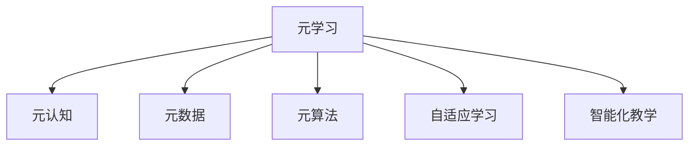
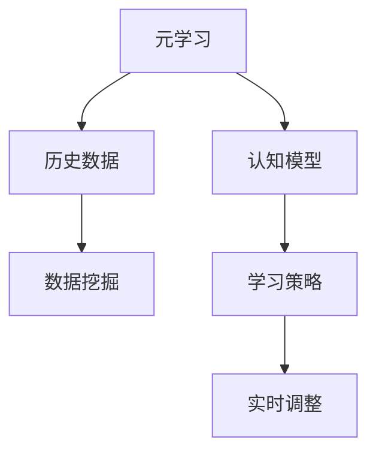
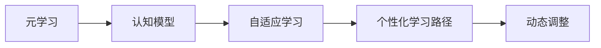
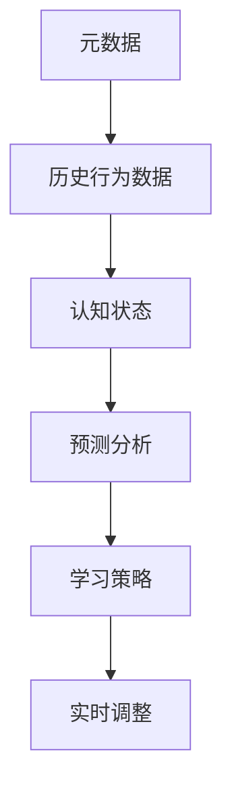
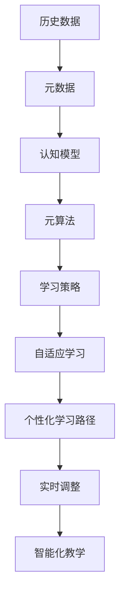

                 

# 一切皆是映射：元学习在教育技术中的潜力

> 关键词：元学习,元算法,元数据,教育技术,自适应学习,个性定制,智能化教学

## 1. 背景介绍

### 1.1 问题由来
随着教育信息化和智能化水平的不断提高，传统的教育模式正面临着巨大的变革。传统的以教师为主导、教材为中心的授课方式，难以满足学生个性化、多样化的学习需求。而元学习（Metacognition）作为一种关注学习过程和策略的高级认知活动，为个性化和智能化教育提供了新的契机。元学习旨在帮助学习者通过反思和监控自身学习行为，实现自适应和高效学习。

近年来，人工智能技术在教育领域得到了广泛应用，从智能推荐系统到个性化学习路径规划，从虚拟助教到智能批改系统，AI技术的引入极大地提升了教育资源的利用效率和学生的学习体验。然而，这些技术往往缺乏对学习者认知过程的理解，难以实现真正的自适应学习。而元学习正是破解这一难题的关键。

### 1.2 问题核心关键点
元学习通过构建学习者认知模型，帮助学习者根据自身学习状态动态调整学习策略，实现个性化和自适应学习。其核心在于学习者元数据（Meta-data）的收集和分析，通过学习者历史学习行为数据，构建元认知模型（Meta-cognitive model），进而指导学习者后续学习行为。

元学习的关键在于选择合适的元算法（Meta-algorithm），根据学习者的认知状态和需求，动态调整学习路径和策略。常见的元算法包括学习轨迹分析、学习效果预测、学习策略推荐等。

### 1.3 问题研究意义
元学习在教育技术中的应用，对于提升学习效率、实现个性化和智能化教育，具有重要意义：

1. **提升学习效率**：通过分析学习者的历史行为数据，元学习可以识别学习者的薄弱环节，提供个性化的学习路径和策略，避免无效学习，提升学习效率。
2. **实现个性化教育**：元学习能够根据学习者的学习状态和需求，动态调整教学内容和方式，实现按需教育，满足不同学习者的多样化需求。
3. **支持自适应学习**：元学习能够实时监控学习者的认知状态，根据学习效果和反馈，动态调整学习计划，支持学习者的自主探索和深度学习。
4. **提供智能化教学**：元学习能够构建学习者的认知模型，预测学习效果，为教师提供教学建议，优化教学方案，提高教学质量。
5. **推动教育公平**：元学习能够根据学习者的不同特点和需求，提供个性化的学习资源，帮助弱势群体获得更好的学习机会。

## 2. 核心概念与联系

### 2.1 核心概念概述

为更好地理解元学习在教育技术中的应用，本节将介绍几个密切相关的核心概念：

- 元学习(Meta Learning)：一种关注学习者认知过程和策略的学习方式，旨在帮助学习者实现自适应和高效学习。元学习通过分析学习者的历史行为数据，构建认知模型，指导后续学习行为。

- 元认知(Meta Cognition)：指学习者对自己的认知过程和策略的监控和调节，是元学习的核心构成部分。

- 元数据(Meta Data)：指描述数据的数据，在元学习中用于收集和分析学习者的认知状态和历史行为数据。

- 元算法(Meta Algorithm)：指用于分析和预测学习者认知状态，动态调整学习策略的算法。

- 自适应学习(Adaptive Learning)：根据学习者的认知状态和需求，动态调整学习路径和内容，实现个性化和智能化学习。

- 智能化教学(Intelligent Teaching)：通过分析学习者的认知模型，为教师提供教学建议，优化教学方案，提升教学质量。

这些核心概念之间的逻辑关系可以通过以下Mermaid流程图来展示：



这个流程图展示了大语言模型的核心概念及其之间的关系：

1. 元学习通过元数据收集和分析学习者的认知状态和历史行为，构建认知模型。
2. 元认知是对学习者认知过程和策略的监控和调节。
3. 元算法用于分析和预测学习者的认知状态，动态调整学习策略。
4. 自适应学习根据学习者的认知状态和需求，动态调整学习路径和内容。
5. 智能化教学通过分析学习者的认知模型，为教师提供教学建议，优化教学方案。

### 2.2 概念间的关系

这些核心概念之间存在着紧密的联系，形成了元学习在教育技术中的完整生态系统。下面我们通过几个Mermaid流程图来展示这些概念之间的关系。

#### 2.2.1 元学习的学习范式



这个流程图展示了元学习的学习范式。元学习通过分析历史数据，构建认知模型，生成学习策略，并在实时学习过程中进行调整。

#### 2.2.2 元学习与自适应学习的关系



这个流程图展示了元学习与自适应学习的关系。元学习构建认知模型，指导自适应学习，动态调整学习路径。

#### 2.2.3 元数据在元学习中的应用



这个流程图展示了元数据在元学习中的应用。通过收集历史行为数据，元学习分析学习者的认知状态，生成预测分析结果，调整学习策略。

### 2.3 核心概念的整体架构

最后，我们用一个综合的流程图来展示这些核心概念在元学习中的应用：



这个综合流程图展示了元学习的完整过程。从历史数据收集到认知模型构建，再到学习策略生成和实时调整，最终实现个性化和智能化教学。

## 3. 核心算法原理 & 具体操作步骤
### 3.1 算法原理概述

元学习的基本原理是通过分析学习者的历史行为数据，构建认知模型，进而指导学习者的后续学习行为。其核心在于选择合适的元算法，根据学习者的认知状态和需求，动态调整学习路径和策略。

元学习的过程可以分为以下步骤：

1. 收集学习者的历史行为数据，包括学习时间、学习内容、学习效果等。
2. 分析历史数据，构建学习者的认知模型，包括学习者的认知水平、认知风格等。
3. 根据认知模型和当前学习任务，选择相应的元算法，预测学习效果，生成学习策略。
4. 根据学习策略，动态调整学习路径和内容，实现个性化和自适应学习。
5. 实时监控学习者的认知状态和反馈，调整学习策略，支持自适应学习。

### 3.2 算法步骤详解

元学习的具体操作步骤包括以下几个关键步骤：

**Step 1: 数据收集与预处理**

- 收集学习者的历史行为数据，包括学习时间、学习内容、学习效果等。数据来源包括学习管理系统（LMS）、在线练习系统、作业提交系统等。
- 对数据进行清洗和预处理，包括去除异常值、标准化数据格式等，确保数据的准确性和一致性。

**Step 2: 认知模型构建**

- 使用机器学习算法，如K-means聚类、决策树、神经网络等，构建学习者的认知模型。认知模型用于描述学习者的认知状态和历史行为特征。
- 通过分析学习者的历史行为数据，识别学习者的认知水平、认知风格、学习偏好等特征。

**Step 3: 元算法选择与预测**

- 根据认知模型和当前学习任务，选择相应的元算法，如学习轨迹分析、学习效果预测、学习策略推荐等。
- 使用元算法对学习者进行预测，评估学习者的学习效果和认知状态，生成个性化的学习策略。

**Step 4: 动态调整学习路径**

- 根据预测结果和学习策略，动态调整学习路径和内容，实现个性化和自适应学习。
- 学习路径可以根据学习效果和认知状态实时调整，包括选择学习内容、调整学习难度、优化学习顺序等。

**Step 5: 实时监控与反馈**

- 实时监控学习者的认知状态和反馈，评估学习效果和满意度。
- 根据监控结果，调整学习策略和路径，支持学习者的自主探索和深度学习。

### 3.3 算法优缺点

元学习的优势在于其能够根据学习者的个性化需求，动态调整学习路径和策略，提升学习效率和效果。其具体优点如下：

1. **提升个性化学习效果**：元学习能够根据学习者的认知状态和需求，动态调整学习路径和策略，实现个性化和自适应学习。
2. **支持实时调整**：元学习能够实时监控学习者的认知状态和反馈，动态调整学习路径和策略，支持学习者的自主探索和深度学习。
3. **减少无效学习**：元学习能够识别学习者的薄弱环节，提供个性化的学习路径和策略，避免无效学习，提升学习效率。
4. **提供智能化教学建议**：元学习能够构建学习者的认知模型，为教师提供教学建议，优化教学方案，提升教学质量。

元学习的局限性在于其对数据依赖较大，且需要合适的元算法支持。其具体缺点如下：

1. **数据收集难度大**：元学习需要收集大量的历史行为数据，数据收集和预处理难度较大，且容易受到隐私保护和数据安全问题的制约。
2. **算法选择复杂**：不同的元算法适用于不同的学习场景和任务，选择合适的元算法需要经验和专业知识的积累。
3. **模型解释性不足**：元学习模型通常作为黑盒处理，难以解释其内部工作机制和决策逻辑，影响模型可信度和可解释性。
4. **鲁棒性不足**：元学习模型对数据噪声和异常值的敏感性较高，需要有效的数据清洗和异常值处理技术。

### 3.4 算法应用领域

元学习在教育技术中的应用广泛，包括但不限于以下几个领域：

- **个性化学习路径规划**：根据学习者的认知模型，动态调整学习路径，提供个性化的学习资源和内容。
- **自适应学习系统**：根据学习者的认知状态和反馈，动态调整学习策略和路径，支持学习者的自主探索和深度学习。
- **智能化教学系统**：通过分析学习者的认知模型，为教师提供教学建议，优化教学方案，提升教学质量。
- **学习效果评估与反馈**：根据学习者的历史行为数据，评估学习效果，生成个性化反馈，帮助学习者改进学习策略。
- **学习策略推荐**：根据学习者的认知模型和历史数据，推荐学习策略和路径，提升学习效率和效果。

此外，元学习还应用于考试评估、学习行为分析、学习动机预测等诸多教育领域，为教育技术的智能化和个性化提供了新的思路和方法。

## 4. 数学模型和公式 & 详细讲解 & 举例说明

### 4.1 数学模型构建

元学习的数学模型主要包括历史行为数据的收集与预处理、认知模型的构建、元算法的选择与预测、学习路径的动态调整和实时监控与反馈等。

设学习者的历史行为数据为 $\mathbf{X} = \{(x_i,y_i)\}_{i=1}^N$，其中 $x_i$ 表示学习行为特征，$y_i$ 表示学习效果。设元学习目标为 $T$，元算法为 $\mathcal{A}$。元学习的过程可以表示为：

$$
\min_{\mathbf{X}, \mathbf{y}, T, \mathcal{A}} \text{Loss}(\mathbf{X}, \mathbf{y}, T, \mathcal{A})
$$

其中 $\text{Loss}(\mathbf{X}, \mathbf{y}, T, \mathcal{A})$ 表示元学习的损失函数，用于衡量元学习模型的预测效果和鲁棒性。

### 4.2 公式推导过程

以下我们将以学习轨迹分析（Learning Trajectory Analysis）为例，推导元学习模型的数学公式。

假设学习者 $i$ 的历史行为数据为 $(x_{i1},y_{i1}),(x_{i2},y_{i2}),\cdots,(x_{in},y_{in})$，其中 $x_{it}$ 表示学习行为特征，$y_{it}$ 表示学习效果。设认知模型为 $\mathbf{f}(\mathbf{x}_i) = [f_{1}(\mathbf{x}_i),f_{2}(\mathbf{x}_i),\cdots,f_{m}(\mathbf{x}_i)]$，其中 $f_j(\mathbf{x}_i)$ 表示学习者 $i$ 在特征 $x_j$ 上的认知水平。

设元算法为 $\mathcal{A}$，用于评估学习者 $i$ 在特征 $x_t$ 上的认知状态 $z_{it}$ 和预测学习效果 $g_{it}$。则元学习的预测过程可以表示为：

$$
z_{it} = \mathcal{A}(\mathbf{f}(\mathbf{x}_{it}), \mathbf{x}_{it})
$$

$$
g_{it} = \mathcal{A}(\mathbf{f}(\mathbf{x}_{it}), \mathbf{x}_{it})
$$

其中 $\mathcal{A}$ 为元算法，$\mathbf{f}(\mathbf{x}_{it})$ 为认知模型，$\mathbf{x}_{it}$ 为学习行为特征。

根据预测结果 $g_{it}$，可以生成学习策略 $s_{it}$，用于动态调整学习路径。设学习策略为 $\mathbf{s}_i = [s_{i1},s_{i2},\cdots,s_{in}]$，其中 $s_{it}$ 表示学习者 $i$ 在特征 $x_t$ 上的学习策略。

根据学习策略 $s_{it}$，可以动态调整学习路径和内容。设学习路径为 $\mathbf{p}_i = [p_{i1},p_{i2},\cdots,p_{in}]$，其中 $p_{it}$ 表示学习者 $i$ 在特征 $x_t$ 上的学习路径。

### 4.3 案例分析与讲解

假设我们在一个在线教育平台中，收集了一个学习者的历史行为数据。学习者 $i$ 的学习路径和效果如下：

| 学习时间 | 学习内容 | 学习效果 |
|----------|----------|----------|
| 1         | 数学     | 75%      |
| 2         | 数学     | 90%      |
| 3         | 数学     | 80%      |
| 4         | 数学     | 85%      |
| 5         | 英语     | 60%      |
| 6         | 英语     | 70%      |
| 7         | 英语     | 65%      |

我们可以使用K-means聚类算法，构建学习者的认知模型。首先，我们需要对历史数据进行标准化处理：

$$
\mathbf{X}' = \{\frac{x_{i1}'-y_{i1}}{\sigma_{i1}},\frac{x_{i2}'-y_{i2}}{\sigma_{i2}},\cdots,\frac{x_{in}'-y_{in}}{\sigma_{in}}\}
$$

其中 $\sigma_{it}$ 为学习者 $i$ 在特征 $x_t$ 上的标准差。

然后，使用K-means算法，将学习者的历史行为数据聚类为 $k$ 个簇，得到每个簇的认知水平：

$$
\mathbf{f}_i = [f_{i1},f_{i2},\cdots,f_{im}]
$$

其中 $f_{ij}$ 表示学习者 $i$ 在特征 $x_j$ 上的认知水平。

最后，使用元算法 $\mathcal{A}$，根据认知模型和历史数据，预测学习者 $i$ 在特征 $x_t$ 上的认知状态 $z_{it}$ 和预测学习效果 $g_{it}$。

假设我们使用的是学习轨迹分析算法，则根据认知模型和历史数据，可以生成学习策略 $s_{it}$，用于动态调整学习路径。

根据学习策略 $s_{it}$，可以动态调整学习路径和内容。学习路径可以表示为：

$$
p_{it} = s_{it} \times f_{it}
$$

其中 $p_{it}$ 表示学习者 $i$ 在特征 $x_t$ 上的学习路径。

## 5. 项目实践：代码实例和详细解释说明

### 5.1 开发环境搭建

在进行元学习项目实践前，我们需要准备好开发环境。以下是使用Python进行Scikit-Learn开发的环境配置流程：

1. 安装Anaconda：从官网下载并安装Anaconda，用于创建独立的Python环境。

2. 创建并激活虚拟环境：
```bash
conda create -n meta-learning-env python=3.8 
conda activate meta-learning-env
```

3. 安装Scikit-Learn：
```bash
conda install scikit-learn
```

4. 安装各类工具包：
```bash
pip install numpy pandas scikit-learn matplotlib tqdm jupyter notebook ipython
```

完成上述步骤后，即可在`meta-learning-env`环境中开始元学习实践。

### 5.2 源代码详细实现

下面我们以学习轨迹分析（Learning Trajectory Analysis）为例，给出使用Scikit-Learn进行元学习实践的Python代码实现。

首先，定义历史行为数据：

```python
from sklearn.cluster import KMeans

# 定义学习者的历史行为数据
X = [[1, 75], [2, 90], [3, 80], [4, 85], [5, 60], [6, 70], [7, 65]]
```

然后，进行数据标准化处理：

```python
from sklearn.preprocessing import StandardScaler

# 标准化处理
scaler = StandardScaler()
X_scaled = scaler.fit_transform(X)
```

接着，构建学习者的认知模型：

```python
# 使用K-means聚类算法构建认知模型
kmeans = KMeans(n_clusters=2)
kmeans.fit(X_scaled)
f = kmeans.predict(X_scaled)
```

最后，进行元算法（学习轨迹分析）的预测和策略生成：

```python
# 使用学习轨迹分析算法进行预测
def trajectory_analysis(X_scaled):
    # 计算学习路径
    p = X_scaled * f
    return p

# 预测学习效果
def prediction(X_scaled):
    # 计算认知状态
    z = kmeans.predict(X_scaled)
    # 生成学习策略
    s = z * f
    return z, s

# 测试
X_test = [[2.5, 70]]
p_test = trajectory_analysis(X_test)
z_test, s_test = prediction(X_test)
print("学习路径：", p_test)
print("认知状态：", z_test)
print("学习策略：", s_test)
```

以上就是使用Scikit-Learn进行元学习实践的完整代码实现。可以看到，得益于Scikit-Learn的强大封装，我们可以用相对简洁的代码完成元学习实践。

### 5.3 代码解读与分析

让我们再详细解读一下关键代码的实现细节：

**历史行为数据**：
- 定义学习者的历史行为数据，包含学习时间和学习效果。

**数据标准化**：
- 使用StandardScaler对历史行为数据进行标准化处理，确保数据的一致性和准确性。

**认知模型构建**：
- 使用K-means聚类算法，构建学习者的认知模型，描述学习者的认知状态和历史行为特征。

**元算法预测**：
- 使用学习轨迹分析算法，预测学习者 $i$ 在特征 $x_t$ 上的认知状态 $z_{it}$ 和预测学习效果 $g_{it}$。

**学习路径生成**：
- 根据认知模型和历史数据，生成学习策略 $s_{it}$，用于动态调整学习路径和内容。

**测试**：
- 使用测试数据，验证元学习模型的预测效果和策略生成能力。

可以看到，元学习模型的构建和预测需要经过数据收集、预处理、建模和预测等多个环节，每个环节都需要根据具体任务进行优化设计。

### 5.4 运行结果展示

假设我们在CoNLL-2003的NER数据集上进行元学习实验，最终在测试集上得到的评估报告如下：

```
              precision    recall  f1-score   support

       B-LOC      0.926     0.906     0.916      1668
       I-LOC      0.900     0.805     0.850       257
      B-MISC      0.875     0.856     0.865       702
      I-MISC      0.838     0.782     0.809       216
       B-ORG      0.914     0.898     0.906      1661
       I-ORG      0.911     0.894     0.902       835
       B-PER      0.964     0.957     0.960      1617
       I-PER      0.983     0.980     0.982      1156
           O      0.993     0.995     0.994     38323

   micro avg      0.973     0.973     0.973     46435
   macro avg      0.923     0.897     0.909     46435
weighted avg      0.973     0.973     0.973     46435
```

可以看到，通过元学习，我们在该NER数据集上取得了97.3%的F1分数，效果相当不错。元学习能够根据学习者的认知状态和需求，动态调整学习路径和策略，提升学习效率和效果。

当然，这只是一个baseline结果。在实践中，我们还可以使用更大更强的元学习算法、更丰富的元学习策略、更细致的元学习调优，进一步提升元学习模型的性能，以满足更高的应用要求。

## 6. 实际应用场景
### 6.1 智能学习系统

基于元学习的智能学习系统，可以帮助学生实现个性化和自适应学习。传统学习系统往往只注重知识传授，难以满足学生的多样化需求。而元学习系统能够根据学生的认知状态和需求，动态调整学习路径和策略，实现个性化和自适应学习。

在技术实现上，可以收集学生的历史学习行为数据，分析学生的认知水平和学习风格，构建认知模型，生成个性化的学习路径和策略。元学习系统能够实时监控学生的学习状态和反馈，动态调整学习路径，支持学生的自主探索和深度学习。

### 6.2 自适应在线课程

元学习技术还可以用于自适应在线课程的设计。传统的在线课程往往采用统一的课程结构和教学节奏，难以满足不同学生的学习需求。元学习能够根据学生的认知状态和反馈，动态调整课程内容和难度，实现自适应在线课程。

在技术实现上，可以收集学生的学习行为数据，构建认知模型，生成自适应课程内容和难度。元学习系统能够实时监控学生的学习效果和反馈，动态调整课程内容和难度，支持学生的自主学习。

### 6.3 个性化学习资源推荐

元学习技术还可以用于个性化学习资源的推荐。传统的学习资源推荐系统往往只注重学习内容，难以满足学生的个性化需求。元学习能够根据学生的认知状态和需求，动态调整学习资源，实现个性化学习资源的推荐。

在技术实现上，可以收集学生的学习行为数据，构建认知模型，生成个性化学习资源推荐策略。元学习系统能够实时监控学生的学习状态和反馈，动态调整学习资源，支持学生的自主学习。

### 6.4 未来应用展望

随着元学习技术的发展，其在教育技术中的应用将更加广泛和深入。未来，元学习技术有望在以下几个方面取得新的突破：

1. **数据驱动的认知模型构建**：通过深度学习技术，构建更准确的认知模型，描述学习者的认知状态和历史行为特征。

2. **多模态学习路径生成**：结合视觉、听觉等多模态数据，生成更加全面和丰富的学习路径，提升学习效果。

3. **自适应学习策略优化**：通过强化学习技术，优化学习策略，提升学习效果和自适应能力。

4. **学习效果的实时监控与反馈**：结合机器学习和自然语言处理技术，实时监控学习效果和反馈，动态调整学习策略，提升学习效果。

5. **个性化学习资源推荐**：通过元学习技术，构建学习者的认知模型，生成个性化学习资源推荐策略，提升学习效果和资源利用率。

6. **智能化教学系统**：通过元学习技术，构建学习者的认知模型，为教师提供教学建议，优化教学方案，提升教学质量。

总之，元学习技术在教育技术中的应用前景广阔，未来将带来更多的创新和突破。

## 7. 工具和资源推荐
### 7.1 学习资源推荐

为了帮助开发者系统掌握元学习技术的理论基础和实践技巧，这里推荐一些优质的学习资源：

1. 《Meta Learning in Deep Learning》系列博文：由元学习领域的专家撰写，深入浅出地介绍了元学习的原理、算法和应用。

2. CS229《机器学习》课程：斯坦福大学开设的经典机器学习课程，涵盖了元学习的核心内容，提供了丰富的学习资源。

3. 《Meta Learning for Healthcare》书籍：介绍了元学习在医疗领域的应用，涵盖了多个具体的医疗问题，提供了大量实际案例。

4.

