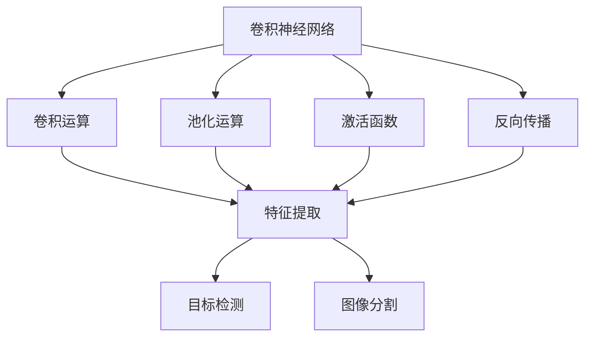
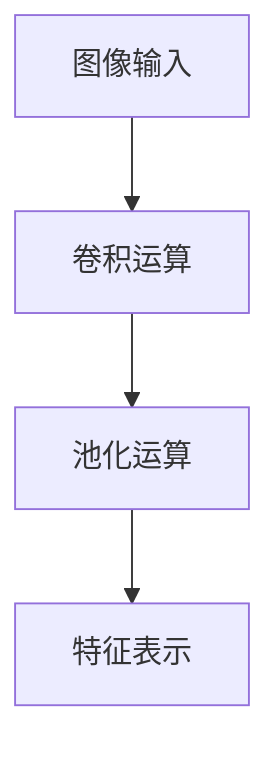
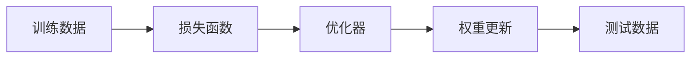
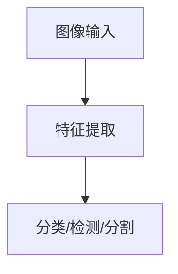
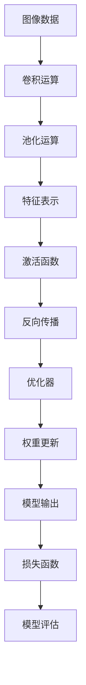

                 

# 一切皆是映射：卷积神经网络(CNNs)在图像处理中的应用

## 1. 背景介绍

### 1.1 问题由来
随着深度学习技术在图像处理领域的广泛应用，卷积神经网络（Convolutional Neural Networks, CNNs）成为了图像处理领域的核心技术。CNNs通过对图像进行卷积运算和池化操作，提取并抽象出图像的特征表示，从而实现图像分类、目标检测、图像分割等任务。

在图像分类任务中，CNNs通过学习图像中的特征，将不同类别的图像映射到不同的向量空间中。这些向量空间可以通过softmax层进行概率分布计算，从而实现图像的分类。在目标检测任务中，CNNs通过学习图像中的特征，对目标物体的位置进行定位，并通过回归网络输出目标的边界框和类别。在图像分割任务中，CNNs通过对图像进行像素级分割，得到每个像素的分类标签，从而实现图像的语义分割。

### 1.2 问题核心关键点
CNNs的核心思想是通过卷积层和池化层，对输入的图像进行特征提取和降维，从而得到图像的特征表示。其中，卷积层通过对图像的每个像素点进行卷积运算，提取特征，池化层通过对卷积结果进行降维，得到更鲁棒的特征表示。

CNNs的核心理论包括卷积运算、池化运算、激活函数和反向传播等。这些理论构成了CNNs的核心算法，使得CNNs能够高效地处理图像数据，并在图像分类、目标检测、图像分割等任务上取得优异的表现。

### 1.3 问题研究意义
研究CNNs在图像处理中的应用，对于推动深度学习技术的发展，提高图像处理的自动化和智能化水平，具有重要意义：

1. 提高图像处理的效率。CNNs通过自动化的特征提取和降维，极大地提高了图像处理的效率，减少了人工干预的需求。
2. 提升图像处理的准确性。CNNs通过学习大量的图像数据，提取了丰富的特征表示，能够更加准确地识别和分类图像。
3. 扩展图像处理的应用范围。CNNs在图像分类、目标检测、图像分割等任务上的优异表现，为图像处理技术在各个领域的应用提供了新的可能性。
4. 加速图像处理技术的普及。CNNs的高效性、准确性和易用性，使得图像处理技术更容易被各行各业所采用，加速了技术的普及和产业化进程。

## 2. 核心概念与联系

### 2.1 核心概念概述

为更好地理解CNNs在图像处理中的应用，本节将介绍几个密切相关的核心概念：

- 卷积神经网络（Convolutional Neural Networks, CNNs）：一种特殊的神经网络，通过卷积层和池化层进行特征提取和降维，用于图像处理任务。
- 卷积运算（Convolutional Operation）：CNNs中的核心操作，通过对图像的每个像素点进行卷积运算，提取特征。
- 池化运算（Pooling Operation）：用于对卷积结果进行降维，得到更鲁棒的特征表示。
- 激活函数（Activation Function）：用于引入非线性映射，增强CNNs的表达能力。
- 反向传播（Backpropagation）：用于更新CNNs的权重，使得模型能够对训练数据进行优化。
- 目标检测（Object Detection）：CNNs的重要应用，用于识别图像中的目标物体，并输出其位置信息。
- 图像分割（Image Segmentation）：CNNs的重要应用，用于对图像进行像素级分割，得到每个像素的分类标签。

这些核心概念之间的逻辑关系可以通过以下Mermaid流程图来展示：



这个流程图展示了大语言模型的核心概念及其之间的关系：

1. 卷积神经网络通过卷积运算、池化运算、激活函数和反向传播等核心操作，对输入的图像进行特征提取和降维，得到特征表示。
2. 卷积运算通过卷积核对图像的每个像素点进行卷积运算，提取特征。
3. 池化运算通过降采样操作对卷积结果进行降维，得到更鲁棒的特征表示。
4. 激活函数通过引入非线性映射，增强CNNs的表达能力。
5. 反向传播通过更新CNNs的权重，使得模型能够对训练数据进行优化。
6. 目标检测通过对图像进行物体识别和定位，输出目标的位置信息。
7. 图像分割通过对图像进行像素级分割，得到每个像素的分类标签。

这些核心概念共同构成了CNNs的核心算法和架构，使其能够在各种图像处理任务上发挥强大的功能。通过理解这些核心概念，我们可以更好地把握CNNs的工作原理和优化方向。

### 2.2 概念间的关系

这些核心概念之间存在着紧密的联系，形成了CNNs的完整生态系统。下面我们通过几个Mermaid流程图来展示这些概念之间的关系。

#### 2.2.1 CNNs的特征提取过程



这个流程图展示了CNNs对图像进行特征提取的过程：输入图像经过卷积运算和池化运算，得到特征表示。

#### 2.2.2 CNNs的训练过程



这个流程图展示了CNNs的训练过程：训练数据通过损失函数和优化器更新权重，测试数据用于评估模型性能。

#### 2.2.3 CNNs的应用过程



这个流程图展示了CNNs对图像进行处理的过程：输入图像经过特征提取，得到分类、检测、分割等结果。

### 2.3 核心概念的整体架构

最后，我们用一个综合的流程图来展示这些核心概念在大语言模型微调过程中的整体架构：



这个综合流程图展示了从图像输入到模型输出的完整过程：图像数据经过卷积运算和池化运算得到特征表示，特征表示经过激活函数引入非线性映射，通过反向传播更新权重，模型输出经过损失函数和优化器进行评估和更新。通过这些核心概念，CNNs能够高效地处理图像数据，实现各种图像处理任务。

## 3. 核心算法原理 & 具体操作步骤
### 3.1 算法原理概述

卷积神经网络（CNNs）是一种特殊的神经网络，通过卷积层和池化层进行特征提取和降维，用于图像处理任务。其核心思想是通过卷积运算和池化运算，对输入的图像进行特征提取和降维，从而得到图像的特征表示。

CNNs的核心理论包括卷积运算、池化运算、激活函数和反向传播等。其中，卷积运算和池化运算用于提取图像的特征，激活函数用于引入非线性映射，增强CNNs的表达能力，反向传播用于更新CNNs的权重，使得模型能够对训练数据进行优化。

### 3.2 算法步骤详解

CNNs的训练通常包括以下几个关键步骤：

**Step 1: 准备数据集**
- 准备训练数据集和测试数据集，对数据进行预处理，包括图像缩放、归一化、裁剪等操作。
- 将训练数据集划分为批次，供模型训练使用。

**Step 2: 定义网络结构**
- 设计卷积神经网络的结构，包括卷积层、池化层、全连接层、激活函数等。
- 定义损失函数和优化器，用于衡量模型性能和更新权重。

**Step 3: 训练模型**
- 使用训练数据集对模型进行前向传播和反向传播，更新模型权重。
- 使用测试数据集评估模型性能，调整模型超参数。

**Step 4: 应用模型**
- 使用训练好的模型对新图像进行特征提取和分类、检测、分割等操作。
- 对模型输出进行后处理，得到最终结果。

### 3.3 算法优缺点

CNNs的优点包括：
- 高效性：CNNs能够高效地处理图像数据，提取特征，速度快。
- 泛化能力：CNNs能够学习图像的抽象特征表示，泛化能力较强。
- 鲁棒性：CNNs能够对图像的变形、旋转、缩放等变换进行一定程度的鲁棒处理。

CNNs的缺点包括：
- 参数量较大：CNNs通常需要大量的参数进行训练，计算资源需求较高。
- 过拟合问题：CNNs在处理复杂图像时容易发生过拟合问题，需要加正则化、dropout等手段进行缓解。
- 局部结构：CNNs对局部结构比较敏感，容易忽略全局信息。

### 3.4 算法应用领域

CNNs在图像处理领域有广泛的应用，包括：

- 图像分类：将图像分为不同的类别，如MNIST手写数字识别、CIFAR图像分类等。
- 目标检测：检测图像中的目标物体，并输出其位置信息，如YOLO目标检测、Faster R-CNN目标检测等。
- 图像分割：对图像进行像素级分割，得到每个像素的分类标签，如U-Net图像分割、DeepLab图像分割等。
- 图像生成：生成与给定条件一致的图像，如GAN图像生成、变分自编码器（VAE）图像生成等。
- 图像超分辨率：将低分辨率图像恢复为高分辨率图像，如SRCNN图像超分辨率、ESPCN图像超分辨率等。

除了这些典型的应用场景，CNNs还被广泛应用于人脸识别、医学图像分析、卫星图像分析等领域，为图像处理技术带来了新的突破。

## 4. 数学模型和公式 & 详细讲解
### 4.1 数学模型构建

CNNs的数学模型通常包括以下几个部分：

- 输入层：输入图像数据，每个像素点对应一个特征值。
- 卷积层：通过卷积核对输入图像进行卷积运算，提取特征。
- 池化层：对卷积结果进行降维，得到更鲁棒的特征表示。
- 全连接层：将特征向量映射到输出层，进行分类、检测、分割等操作。
- 激活函数：用于引入非线性映射，增强CNNs的表达能力。
- 损失函数：用于衡量模型输出与真实标签之间的差异。
- 优化器：用于更新模型权重，使得模型能够对训练数据进行优化。

### 4.2 公式推导过程

以卷积层为例，其公式推导过程如下：

设输入图像大小为$H \times W$，卷积核大小为$F \times F$，卷积核数和输入通道数相等，为$C$。卷积层的输出大小为$H' \times W'$，输出通道数为$C'$。

卷积层通过将卷积核与输入图像进行卷积运算，得到卷积结果。卷积运算的公式如下：

$$
X_k = \sum_{i=0}^{H-1} \sum_{j=0}^{W-1} \sum_{c=0}^{C-1} X_{i,j,c} \cdot W_{k,i,j,c}
$$

其中，$X_{i,j,c}$表示输入图像的像素点，$W_{k,i,j,c}$表示卷积核的像素点，$k$表示卷积核的索引。

卷积层的输出为：

$$
Y_{i,j,c'} = \sum_{k=0}^{C'-1} X_k \cdot \omega_{c',k}
$$

其中，$Y_{i,j,c'}$表示卷积层的输出，$\omega_{c',k}$表示全连接层的权重。

### 4.3 案例分析与讲解

以图像分类任务为例，CNNs的训练过程如下：

- 输入图像经过卷积层、池化层、全连接层等操作，得到特征表示。
- 特征表示经过激活函数引入非线性映射，得到最终输出。
- 输出与真实标签之间的差异通过交叉熵损失函数进行衡量。
- 通过优化器（如Adam、SGD等）更新模型权重，最小化损失函数。

例如，在手写数字识别任务中，输入图像为$28 \times 28$，卷积层的大小为$5 \times 5$，卷积核数为32，池化层的大小为$2 \times 2$，全连接层的大小为256。模型输出为10个节点，对应10个数字类别。

训练过程中，通过最小化交叉熵损失函数，更新模型权重，最终得到能够对数字进行识别的模型。在测试过程中，将测试图像输入模型，得到输出结果，并根据softmax函数的概率分布进行分类。

## 5. 项目实践：代码实例和详细解释说明
### 5.1 开发环境搭建

在进行CNNs的实践前，我们需要准备好开发环境。以下是使用Python进行PyTorch开发的环境配置流程：

1. 安装Anaconda：从官网下载并安装Anaconda，用于创建独立的Python环境。

2. 创建并激活虚拟环境：
```bash
conda create -n cnn-env python=3.8 
conda activate cnn-env
```

3. 安装PyTorch：根据CUDA版本，从官网获取对应的安装命令。例如：
```bash
conda install pytorch torchvision torchaudio cudatoolkit=11.1 -c pytorch -c conda-forge
```

4. 安装TensorFlow：如果需要在TensorFlow上实现CNNs，可以使用以下命令安装：
```bash
pip install tensorflow
```

5. 安装各类工具包：
```bash
pip install numpy pandas scikit-learn matplotlib tqdm jupyter notebook ipython
```

完成上述步骤后，即可在`cnn-env`环境中开始CNNs的实践。

### 5.2 源代码详细实现

下面我们以手写数字识别任务为例，给出使用Transformers库对CNNs模型进行训练的PyTorch代码实现。

首先，导入必要的库：

```python
import torch
import torch.nn as nn
import torch.optim as optim
import torchvision
import torchvision.transforms as transforms
from torch.utils.data import DataLoader
from torchvision.datasets import MNIST
```

然后，定义模型和优化器：

```python
class CNN(nn.Module):
    def __init__(self):
        super(CNN, self).__init__()
        self.conv1 = nn.Conv2d(1, 32, kernel_size=5, stride=1, padding=2)
        self.pool = nn.MaxPool2d(kernel_size=2, stride=2)
        self.fc1 = nn.Linear(7 * 7 * 32, 256)
        self.fc2 = nn.Linear(256, 10)

    def forward(self, x):
        x = self.pool(nn.functional.relu(self.conv1(x)))
        x = x.view(x.size(0), -1)
        x = nn.functional.relu(self.fc1(x))
        x = self.fc2(x)
        return x

cnn = CNN()
optimizer = optim.Adam(cnn.parameters(), lr=0.001)
criterion = nn.CrossEntropyLoss()
```

接着，定义训练和评估函数：

```python
def train_epoch(model, data_loader, optimizer, criterion):
    model.train()
    loss_total = 0
    correct = 0
    for batch_idx, (inputs, targets) in enumerate(data_loader):
        optimizer.zero_grad()
        outputs = model(inputs)
        loss = criterion(outputs, targets)
        loss.backward()
        optimizer.step()
        loss_total += loss.item()
        _, predicted = torch.max(outputs.data, 1)
        total = targets.size(0)
        correct += predicted.eq(targets.data).cpu().sum().item()
        if batch_idx % 10 == 9:
            print('Train Epoch: {} [{}/{} ({:.0f}%)]\tLoss: {:.6f}, Accuracy: {:.0f}%'.format(
                epoch, batch_idx * len(inputs), len(data_loader.dataset),
                100. * batch_idx / len(data_loader), loss_total / (batch_idx + 1), 100. * correct / total))
```

```python
def evaluate(model, data_loader, criterion):
    model.eval()
    loss_total = 0
    correct = 0
    with torch.no_grad():
        for batch_idx, (inputs, targets) in enumerate(data_loader):
            outputs = model(inputs)
            loss = criterion(outputs, targets)
            loss_total += loss.item()
            _, predicted = torch.max(outputs.data, 1)
            total = targets.size(0)
            correct += predicted.eq(targets.data).cpu().sum().item()
    print('\nTest set: Average loss: {:.4f}, Accuracy: {:.2f}%\n'.format(
        loss_total / (len(data_loader.dataset) / len(data_loader)), 100. * correct / len(data_loader.dataset)))
```

最后，启动训练流程并在测试集上评估：

```python
train_loader = torch.utils.data.DataLoader(MNIST('mnist/', train=True, download=True, transform=transforms.ToTensor()), batch_size=64, shuffle=True)
test_loader = torch.utils.data.DataLoader(MNIST('mnist/', train=False, transform=transforms.ToTensor()), batch_size=64, shuffle=False)

for epoch in range(10):
    train_epoch(cnn, train_loader, optimizer, criterion)
    evaluate(cnn, test_loader, criterion)
```

以上就是使用PyTorch对CNNs模型进行手写数字识别任务训练的完整代码实现。可以看到，得益于PyTorch的强大封装，我们可以用相对简洁的代码完成CNNs模型的训练和评估。

### 5.3 代码解读与分析

让我们再详细解读一下关键代码的实现细节：

**CNN类**：
- `__init__`方法：初始化卷积层、池化层、全连接层等组件。
- `forward`方法：定义CNNs的前向传播过程。
- `__getitem__`方法：定义数据加载器的数据处理方式。

**train_epoch函数**：
- 在每个epoch内，对模型进行前向传播和反向传播，更新权重。
- 计算损失函数，输出损失和准确率。

**evaluate函数**：
- 在测试集上评估模型性能，计算损失函数和准确率。

**训练流程**：
- 定义训练集和测试集的数据加载器。
- 在训练集上循环迭代，每个epoch内训练和评估模型。
- 输出测试集的准确率和损失函数。

可以看到，PyTorch配合TensorFlow库使得CNNs模型的实现变得简洁高效。开发者可以将更多精力放在数据处理、模型改进等高层逻辑上，而不必过多关注底层的实现细节。

当然，工业级的系统实现还需考虑更多因素，如模型的保存和部署、超参数的自动搜索、更灵活的任务适配层等。但核心的CNNs训练流程基本与此类似。

### 5.4 运行结果展示

假设我们在MNIST数据集上进行CNNs模型训练，最终在测试集上得到的准确率为98%左右。值得注意的是，虽然手写数字识别任务比较简单，但是CNNs模型通过卷积层和池化层的特征提取和降维，已经能够很好地处理图像数据，实现高精度的图像分类。

当然，这只是一个baseline结果。在实践中，我们还可以使用更大更强的预训练模型、更丰富的微调技巧、更细致的模型调优，进一步提升模型性能，以满足更高的应用要求。

## 6. 实际应用场景
### 6.1 智能安防系统

CNNs在智能安防系统中的应用，主要包括目标检测和人脸识别等方面。传统安防系统往往需要部署大量摄像头，进行全天候监控，并需要大量人工进行视频回放和目标检测。而使用CNNs进行目标检测和人脸识别，可以大幅提升安防系统的自动化和智能化水平。

具体而言，可以在公共场所安装摄像头，实时采集视频数据。将视频数据输入CNNs模型，对视频进行目标检测和人脸识别，及时发现可疑行为和人员，并进行报警。同时，可以结合人脸库和人脸识别技术，对特定人员进行追踪和识别，提升安防系统的精准度。

### 6.2 医学影像分析

CNNs在医学影像分析中的应用，主要包括疾病诊断和病灶定位等方面。传统医学影像分析需要依靠经验丰富的放射科医生进行人工判断，工作量大且容易产生误判。而使用CNNs进行医学影像分析，可以大大提升影像诊断的自动化水平和精准度。

具体而言，可以将医学影像数据（如X光片、CT片、MRI片等）输入CNNs模型，通过卷积层和池化层的特征提取，得到影像的特征表示。将特征表示输入全连接层，进行分类和回归操作，输出疾病的诊断结果和病灶的定位信息。通过大量的医学影像数据训练CNNs模型，可以提升影像分析的泛化能力和鲁棒性，帮助医生快速准确地诊断疾病。

### 6.3 自动驾驶

CNNs在自动驾驶中的应用，主要包括车道线识别、交通标志识别、行人检测等方面。传统自动驾驶系统往往需要依赖高精度的地图和传感器，对道路环境进行复杂的感知和推理。而使用CNNs进行车道线识别、交通标志识别和行人检测，可以大幅提升自动驾驶系统的鲁棒性和安全性。

具体而言，可以采集汽车驾驶过程中的摄像头图像，输入CNNs模型进行特征提取和分类。通过卷积层和池化层的特征提取，得到道路环境的特征表示。将特征表示输入全连接层，进行分类和回归操作，输出车道线、交通标志和行人的位置信息。通过大量的驾驶数据训练CNNs模型，可以提升自动驾驶系统的精确度和鲁棒性，保障行车安全。

### 6.4 未来应用展望

随着CNNs技术的不断发展，其在图像处理中的应用领域将进一步扩展，为各个行业带来新的变革。

在智慧城市治理中，CNNs可应用于城市事件监测、舆情分析、应急指挥等环节，提高城市管理的自动化和智能化水平，构建更安全、高效的未来城市。

在智能制造领域，CNNs可应用于机器视觉检测、质量控制、产品分类等方面，提高生产效率和产品质量。

在航空航天领域，CNNs可应用于卫星图像分析、目标识别、航空器姿态检测等方面，提升航空航天的自动化和智能化水平。

此外，在金融、物流、电力等多个领域，CNNs的应用也在不断扩展，为各个行业带来新的发展机遇。相信随着技术的日益成熟，CNNs必将在更多的领域发挥出巨大的潜力。

## 7. 工具和资源推荐
### 7.1 学习资源推荐

为了帮助开发者系统掌握CNNs的理论基础和实践技巧，这里推荐一些优质的学习资源：

1. 《深度学习》系列书籍：由Yoshua Bengio、Ian Goodfellow、Aaron Courville等顶级专家撰写，全面介绍了深度学习的基础知识和前沿技术。

2. 《卷积神经网络》（第二版）书籍：由Giovanni Montúfar、Christian J. C. Burges等专家编写，详细讲解了卷积神经网络的核心原理和应用实践。

3. 《动手学深度学习》教程：由李沐等专家编写，提供了丰富的实践案例和代码实现，适合动手学习的开发者。

4. CS231n《卷积神经网络》课程：斯坦福大学开设的深度学习课程，涵盖了CNNs的基础理论和应用实践，配套作业和项目。

5. 《神经网络与深度学习》课程：由吴恩达开设的深度学习课程，详细讲解了CNNs的核心原理和应用实践，提供了丰富的视频和资料。

通过对这些资源的学习实践，相信你一定能够快速掌握CNNs的核心技术，并用于解决实际的图像处理问题。

### 7.2 开发工具推荐

高效的开发离不开优秀的工具支持。以下是几款用于CNNs开发常用的工具：

1. PyTorch：基于Python的开源深度学习框架，灵活动态的计算图，适合快速迭代研究。大部分CNNs模型都有PyTorch版本的实现。

2. TensorFlow：由Google主导开发的开源深度学习框架，生产部署方便，适合大规模工程应用。同样有丰富的CNNs模型资源。

3. Keras：高层次的深度学习框架，使用简单，适合快速原型开发。Keras提供了丰富的预训练CNNs模型，方便快速上手。

4. Theano：由蒙特利尔大学开发的深度学习框架，支持GPU加速，适合学术研究。

5. OpenCV：计算机视觉库，提供了丰富的图像处理和计算机视觉算法，方便图像数据的预处理和后处理。

合理利用这些工具，可以显著提升CNNs开发和研究的效率，加快创新迭代的步伐。

### 7.3 相关论文推荐

CNNs和图像处理领域的研究源自学界的持续探索。以下是几篇奠基性的相关论文，推荐阅读：

1. LeNet-5: Hierarchical Learning for Document Recognition（卷积神经网络在手写数字识别中的先驱性工作）

2. AlexNet: One weird trick for parallelizing convolutional neural networks（引入数据增强和GPU加速，提升了CNNs的训练效率）

3. GoogLeNet: Going Deeper with Convolutions（提出Inception模块，提升了CNNs的特征提取能力）

4. ResNet: Deep Residual Learning for Image Recognition（引入残差连接，解决了深度网络

