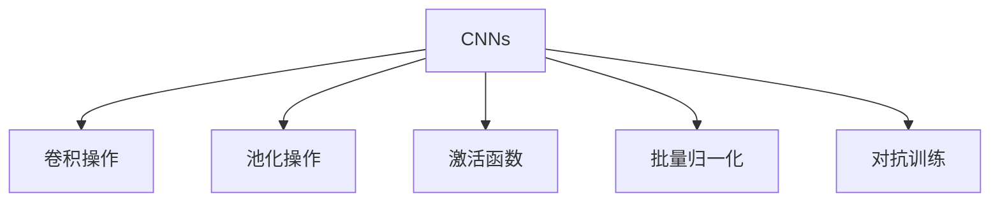
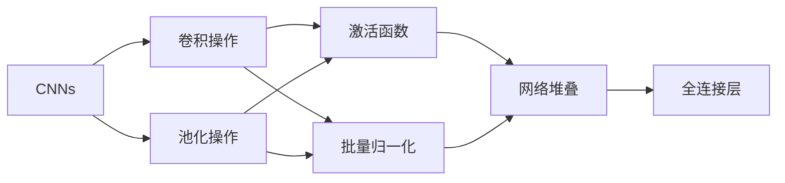
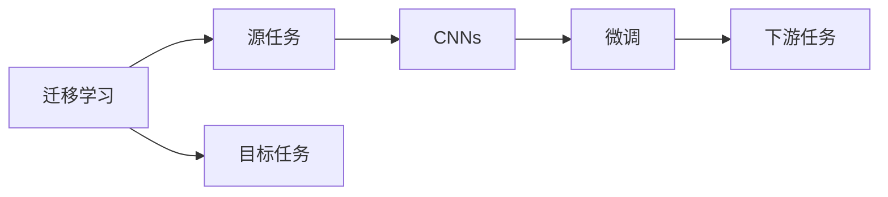
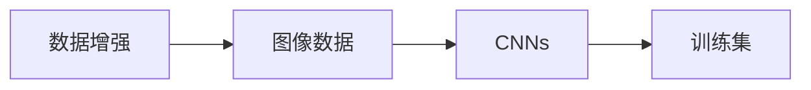

                 

# 一切皆是映射：卷积神经网络(CNNs)在图像处理中的应用

> 关键词：卷积神经网络,图像处理,卷积操作,池化操作,深度学习,神经网络,特征提取,图像分类

## 1. 背景介绍

### 1.1 问题由来
图像处理是人工智能领域中最为重要和普遍的应用之一。从医学影像分析到人脸识别，从自动驾驶到遥感数据分析，图像处理在各个领域都有着广泛的应用。传统的图像处理技术包括特征提取、边缘检测、形态学处理等，但这些方法往往需要手工设计特征和算法，对人类经验依赖性强，难以应对复杂多变的场景。

近年来，随着深度学习技术的快速发展，卷积神经网络(CNNs)成为了图像处理领域的明星算法。CNNs通过卷积、池化等操作，能够自动学习图像中的局部特征和整体结构，无需手工设计，只需足够的训练数据和计算资源，即可训练出高性能的图像处理模型。CNNs在图像分类、目标检测、语义分割、图像生成等多个任务上取得了出色的效果。

### 1.2 问题核心关键点
CNNs的核心思想在于通过卷积和池化操作提取图像的局部特征和整体结构，通过多层网络的堆叠和组合，逐步提升特征的层次和抽象度，最终实现对复杂图像数据的分类和识别。

CNNs的关键在于卷积和池化操作的设计。卷积操作能够捕捉局部特征，池化操作则用于降低特征维度，保留最关键的特征信息。此外，激活函数、批量归一化、dropout等技术的应用，也在很大程度上提升了CNNs的性能。

CNNs的训练过程通常包括前向传播、反向传播和优化算法。通过优化算法（如SGD、Adam等）不断调整模型参数，最小化损失函数，使得模型输出逼近真实标签。在实际应用中，还可以使用迁移学习、数据增强、对抗训练等技术提升模型性能。

CNNs的应用场景广泛，涵盖了从医学影像分析到自动驾驶、从人脸识别到智能监控等多个领域。其强大的特征提取和分类能力，使得CNNs成为现代图像处理技术的核心算法之一。

## 2. 核心概念与联系

### 2.1 核心概念概述

为更好地理解CNNs在图像处理中的应用，本节将介绍几个密切相关的核心概念：

- 卷积神经网络(CNNs)：一种特殊的神经网络，主要用于处理图像数据。CNNs通过卷积和池化操作，自动学习图像中的局部特征和整体结构，无需手工设计特征和算法。

- 卷积操作(Convolution)：CNNs的核心操作之一。卷积操作通过滑动一个小的卷积核(Filter)在图像上计算权重加和，提取局部特征。卷积核大小、步幅、填充等参数的设置，对卷积操作的输出结果有重要影响。

- 池化操作(Pooling)：用于降低特征维度，保留最关键的特征信息。常见的池化操作包括最大池化、平均池化等。

- 激活函数(Activation Function)：用于引入非线性因素，提升模型的表达能力。常用的激活函数包括ReLU、Sigmoid、Tanh等。

- 批量归一化(Batch Normalization)：用于加速模型的训练，并提升模型的泛化能力。批量归一化通过对每个批次的特征进行标准化，使得模型更加稳定。

- 对抗训练(Adversarial Training)：通过引入对抗样本，提升模型的鲁棒性和泛化能力。对抗训练通过不断对抗样本来训练模型，使其能够识别并抵御攻击。

这些核心概念之间的逻辑关系可以通过以下Mermaid流程图来展示：



这个流程图展示了几大核心概念之间的关系：

1. CNNs通过卷积和池化操作提取图像特征。
2. 激活函数和批量归一化技术提升模型的表达能力和稳定性。
3. 对抗训练增强模型的鲁棒性，避免过拟合。

### 2.2 概念间的关系

这些核心概念之间存在着紧密的联系，形成了CNNs的完整生态系统。下面我通过几个Mermaid流程图来展示这些概念之间的关系。

#### 2.2.1 CNNs的学习范式



这个流程图展示了CNNs的学习范式：

1. CNNs通过卷积和池化操作提取图像特征。
2. 激活函数和批量归一化技术提升模型的表达能力和稳定性。
3. 多个卷积-激活-归一化层堆叠构成卷积神经网络。
4. 网络最后通过全连接层进行分类或回归等任务。

#### 2.2.2 迁移学习与CNNs的关系



这个流程图展示了迁移学习的基本原理，以及它与CNNs的关系。迁移学习涉及源任务和目标任务，CNNs在源任务上学习，然后通过微调适应各种下游任务（目标任务）。

#### 2.2.3 数据增强在CNNs中的应用



这个流程图展示了数据增强在CNNs中的应用：

1. 通过数据增强技术扩充图像数据集。
2. 增强后的图像数据用于训练CNNs，提升模型泛化能力。
3. 增强后的图像数据用于测试和验证，评估模型性能。

## 3. 核心算法原理 & 具体操作步骤
### 3.1 算法原理概述

卷积神经网络(CNNs)通过卷积和池化操作，自动学习图像中的局部特征和整体结构，无需手工设计特征和算法。CNNs通常包括多个卷积层和池化层，以及全连接层等组件。其核心思想是通过多层网络的堆叠和组合，逐步提升特征的层次和抽象度，最终实现对复杂图像数据的分类和识别。

形式化地，设输入图像数据为 $x \in \mathbb{R}^{H \times W \times C}$，其中 $H$ 为图像高度，$W$ 为图像宽度，$C$ 为图像通道数。CNNs的输出表示为 $y \in \mathbb{R}^{1 \times 1 \times D}$，其中 $D$ 为输出通道数。CNNs的训练目标是最小化损失函数，即：

$$
\min_{\theta} \mathcal{L}(\theta) = \frac{1}{N} \sum_{i=1}^N \ell(y_i, M_{\theta}(x_i))
$$

其中，$M_{\theta}(\cdot)$ 为CNNs模型，$\ell(\cdot, \cdot)$ 为损失函数，$\theta$ 为模型参数。损失函数的选择可以根据具体任务而定，常见的有交叉熵损失、均方误差损失等。

### 3.2 算法步骤详解

CNNs的训练过程通常包括前向传播、反向传播和优化算法。以下详细介绍CNNs的训练步骤：

**Step 1: 数据准备**

- 收集训练集、验证集和测试集图像数据，并确保数据标注的准确性和多样性。
- 将图像数据进行预处理，如归一化、裁剪、旋转等，以提高模型泛化能力。
- 将图像数据转换为网络可接受的数据格式，如张量(Tensor)等。

**Step 2: 网络构建**

- 设计CNNs网络结构，包括卷积层、池化层、全连接层、激活函数、批量归一化层等。
- 定义网络的前向传播函数，计算每个层的输出。
- 定义损失函数，计算模型输出与真实标签的差异。

**Step 3: 前向传播**

- 将训练集数据输入网络，进行前向传播计算，得到模型输出。
- 计算损失函数值，并记录到训练日志中。

**Step 4: 反向传播**

- 计算损失函数对每个参数的梯度。
- 使用反向传播算法，逐层计算梯度，并更新模型参数。

**Step 5: 优化算法**

- 选择合适的优化算法，如SGD、Adam等，根据梯度更新模型参数。
- 设置学习率、批大小、迭代轮数等超参数，并记录到训练日志中。

**Step 6: 验证与测试**

- 在验证集上评估模型性能，根据性能指标决定是否触发Early Stopping。
- 在测试集上评估模型性能，报告最终的分类或回归指标。

**Step 7: 模型保存**

- 保存训练好的模型，便于后续的预测和推理。

### 3.3 算法优缺点

CNNs在图像处理中具有以下优点：

- 自动特征提取：CNNs能够自动学习图像中的局部特征和整体结构，无需手工设计特征。
- 可扩展性强：CNNs可以通过增加卷积层和池化层，逐步提升特征的层次和抽象度。
- 泛化能力强：CNNs能够处理大规模数据集，具有很强的泛化能力。
- 计算效率高：CNNs的计算图结构紧凑，能够高效进行前向传播和反向传播。

同时，CNNs也存在一些缺点：

- 参数量大：CNNs的参数量往往很大，需要大量的计算资源和存储空间。
- 过拟合风险：CNNs在大规模数据集上训练时，容易发生过拟合。
- 难以解释：CNNs通常被视为"黑盒"系统，难以解释其内部工作机制和决策逻辑。
- 依赖标注数据：CNNs的训练需要大量的标注数据，标注成本较高。

尽管存在这些缺点，但CNNs作为现代图像处理技术的核心算法，已经广泛应用于各个领域，并取得了显著的效果。

### 3.4 算法应用领域

CNNs在图像处理中的应用非常广泛，以下是一些常见的应用领域：

- 图像分类：如手写数字识别、物体识别、场景分类等。
- 目标检测：如行人检测、车辆检测、人脸检测等。
- 语义分割：如医学图像分割、卫星图像分割等。
- 图像生成：如图像超分辨率、图像修复、图像生成等。
- 图像风格迁移：如将一幅图像的风格迁移到另一幅图像上。

除了上述这些应用，CNNs还被应用于医学影像分析、自动驾驶、遥感图像分析等多个领域，展现出强大的图像处理能力。

## 4. 数学模型和公式 & 详细讲解 & 举例说明
### 4.1 数学模型构建

CNNs的数学模型构建涉及到卷积操作、池化操作、激活函数、批量归一化等多个环节。以下详细介绍CNNs的数学模型构建过程：

**Step 1: 卷积操作**

卷积操作是CNNs的核心操作之一。设输入特征图为 $X \in \mathbb{R}^{H \times W \times C}$，卷积核为 $W \in \mathbb{R}^{k \times k \times C \times d}$，卷积操作的输出特征图为 $Y \in \mathbb{R}^{(H-k+1) \times (W-k+1) \times d}$。卷积操作的计算公式为：

$$
Y_{i,j,m} = \sum_{k=0}^{H-1} \sum_{l=0}^{W-1} X_{i+k,j+l,m} * W_{i',j',m'}
$$

其中，$i'$、$j'$、$m'$ 为卷积核的位置坐标，$i$、$j$、$m$ 为输出特征图的坐标。

**Step 2: 池化操作**

池化操作用于降低特征维度，保留最关键的特征信息。设输入特征图为 $X \in \mathbb{R}^{H \times W \times C}$，池化核为 $W \in \mathbb{R}^{k \times k \times C \times d}$，池化操作的输出特征图为 $Y \in \mathbb{R}^{(H-k+1) \times (W-k+1) \times d}$。常见的池化操作包括最大池化、平均池化等。

**Step 3: 激活函数**

激活函数用于引入非线性因素，提升模型的表达能力。常见的激活函数包括ReLU、Sigmoid、Tanh等。设输入特征图为 $X \in \mathbb{R}^{H \times W \times C}$，激活函数为 $\sigma$，激活函数的输出为 $\sigma(X)$。

**Step 4: 批量归一化**

批量归一化用于加速模型的训练，并提升模型的泛化能力。设输入特征图为 $X \in \mathbb{R}^{H \times W \times C}$，批量归一化层的输出为 $Y \in \mathbb{R}^{H \times W \times C}$。批量归一化的计算公式为：

$$
Y = \frac{X - \mu}{\sigma} * \gamma + \beta
$$

其中，$\mu$ 和 $\sigma$ 为批次均值和标准差，$\gamma$ 和 $\beta$ 为可学习的缩放和平移参数。

**Step 5: 全连接层**

全连接层用于将特征图转换为一维向量，并进行分类或回归等任务。设输入特征图为 $X \in \mathbb{R}^{H \times W \times C}$，全连接层的输出为 $Y \in \mathbb{R}^{1 \times 1 \times D}$。

### 4.2 公式推导过程

以下以图像分类任务为例，推导CNNs的分类损失函数及其梯度计算公式。

设输入图像数据为 $x \in \mathbb{R}^{H \times W \times C}$，CNNs输出为 $y \in \mathbb{R}^{1 \times 1 \times D}$，真实标签为 $t \in \{0,1\}^D$。分类损失函数定义为交叉熵损失函数：

$$
\ell(x, y, t) = -\sum_{i=1}^D t_i \log y_i
$$

在训练过程中，我们希望最小化模型输出与真实标签的交叉熵损失，即：

$$
\min_{\theta} \mathcal{L}(\theta) = -\frac{1}{N} \sum_{i=1}^N \ell(x_i, y_i, t_i)
$$

根据链式法则，损失函数对参数 $\theta$ 的梯度为：

$$
\frac{\partial \mathcal{L}(\theta)}{\partial \theta} = -\frac{1}{N} \sum_{i=1}^N \frac{\partial \ell(x_i, y_i, t_i)}{\partial y_i} \frac{\partial y_i}{\partial \theta}
$$

其中，$\frac{\partial y_i}{\partial \theta}$ 为模型输出对参数 $\theta$ 的梯度，通过反向传播算法计算得到。

在实际应用中，CNNs的梯度计算通常使用自动微分工具，如TensorFlow、PyTorch等。这些工具能够高效计算每个参数的梯度，并进行反向传播更新。

### 4.3 案例分析与讲解

以图像分类任务为例，以下是一个简单的CNNs分类模型的实现。

**Step 1: 数据准备**

- 收集训练集、验证集和测试集图像数据，并确保数据标注的准确性和多样性。
- 将图像数据进行预处理，如归一化、裁剪、旋转等，以提高模型泛化能力。
- 将图像数据转换为网络可接受的数据格式，如张量(Tensor)等。

**Step 2: 网络构建**

- 定义CNNs网络结构，包括卷积层、池化层、全连接层、激活函数、批量归一化层等。
- 定义网络的前向传播函数，计算每个层的输出。
- 定义损失函数，计算模型输出与真实标签的差异。

```python
import torch
import torch.nn as nn
import torch.optim as optim
from torchvision import datasets, transforms

# 定义CNNs网络结构
class Net(nn.Module):
    def __init__(self):
        super(Net, self).__init__()
        self.conv1 = nn.Conv2d(3, 64, 3, 1, 1)
        self.conv2 = nn.Conv2d(64, 128, 3, 1, 1)
        self.fc1 = nn.Linear(128 * 28 * 28, 1024)
        self.fc2 = nn.Linear(1024, 10)

    def forward(self, x):
        x = nn.functional.relu(self.conv1(x))
        x = nn.functional.max_pool2d(x, 2, 2)
        x = nn.functional.relu(self.conv2(x))
        x = nn.functional.max_pool2d(x, 2, 2)
        x = x.view(-1, 128 * 28 * 28)
        x = nn.functional.relu(self.fc1(x))
        x = self.fc2(x)
        return x

# 定义损失函数和优化器
net = Net()
criterion = nn.CrossEntropyLoss()
optimizer = optim.Adam(net.parameters(), lr=0.001)

# 加载数据集
train_dataset = datasets.MNIST('data/', train=True, download=True, transform=transforms.ToTensor())
test_dataset = datasets.MNIST('data/', train=False, download=True, transform=transforms.ToTensor())

# 定义数据加载器
train_loader = torch.utils.data.DataLoader(train_dataset, batch_size=64, shuffle=True)
test_loader = torch.utils.data.DataLoader(test_dataset, batch_size=64, shuffle=False)
```

**Step 3: 前向传播**

- 将训练集数据输入网络，进行前向传播计算，得到模型输出。

```python
# 前向传播
for i, data in enumerate(train_loader, 0):
    inputs, labels = data
    outputs = net(inputs)
    loss = criterion(outputs, labels)
    print('Loss: {:.4f}'.format(loss.item()))
    optimizer.zero_grad()
    loss.backward()
    optimizer.step()
```

**Step 4: 反向传播**

- 计算损失函数对每个参数的梯度。
- 使用反向传播算法，逐层计算梯度，并更新模型参数。

**Step 5: 优化算法**

- 选择合适的优化算法，如SGD、Adam等，根据梯度更新模型参数。
- 设置学习率、批大小、迭代轮数等超参数，并记录到训练日志中。

**Step 6: 验证与测试**

- 在验证集上评估模型性能，根据性能指标决定是否触发Early Stopping。
- 在测试集上评估模型性能，报告最终的分类或回归指标。

**Step 7: 模型保存**

- 保存训练好的模型，便于后续的预测和推理。

```python
# 在测试集上评估模型性能
correct = 0
total = 0
with torch.no_grad():
    for data in test_loader:
        images, labels = data
        outputs = net(images)
        _, predicted = torch.max(outputs.data, 1)
        total += labels.size(0)
        correct += (predicted == labels).sum().item()

print('Accuracy of the network on the 10000 test images: %d %%' % (100 * correct / total))
```

以上是一个简单的CNNs分类模型的实现。可以看到，通过卷积、池化、激活函数、批量归一化等操作，CNNs能够自动学习图像中的局部特征和整体结构，从而实现高效的图像分类。

## 5. 项目实践：代码实例和详细解释说明
### 5.1 开发环境搭建

在进行CNNs项目实践前，我们需要准备好开发环境。以下是使用Python进行PyTorch开发的环境配置流程：

1. 安装Anaconda：从官网下载并安装Anaconda，用于创建独立的Python环境。

2. 创建并激活虚拟环境：
```bash
conda create -n pytorch-env python=3.8 
conda activate pytorch-env
```

3. 安装PyTorch：根据CUDA版本，从官网获取对应的安装命令。例如：
```bash
conda install pytorch torchvision torchaudio cudatoolkit=11.1 -c pytorch -c conda-forge
```

4. 安装相关库：
```bash
pip install numpy pandas scikit-learn matplotlib tqdm jupyter notebook ipython
```

完成上述步骤后，即可在`pytorch-env`环境中开始CNNs项目实践。

### 5.2 源代码详细实现

这里我们以图像分类任务为例，给出使用PyTorch实现CNNs的代码实现。

首先，定义网络结构：

```python
import torch
import torch.nn as nn
import torch.optim as optim
from torchvision import datasets, transforms

# 定义CNNs网络结构
class Net(nn.Module):
    def __init__(self):
        super(Net, self).__init__()
        self.conv1 = nn.Conv2d(3, 64, 3, 1, 1)
        self.conv2 = nn.Conv2d(64, 128, 3, 1, 1)
        self.fc1 = nn.Linear(128 * 28 * 28, 1024)
        self.fc2 = nn.Linear(1024, 10)

    def forward(self, x):
        x = nn.functional.relu(self.conv1(x))
        x = nn.functional.max_pool2d(x, 2, 2)
        x = nn.functional.relu(self.conv2(x))
        x = nn.functional.max_pool2d(x, 2, 2)
        x = x.view(-1, 128 * 28 * 28)
        x = nn.functional.relu(self.fc1(x))
        x = self.fc2(x)
        return x
```

然后，定义训练函数：

```python
# 定义训练函数
def train_epoch(model, train_loader, optimizer):
    model.train()
    for data in train_loader:
        inputs, labels = data
        optimizer.zero_grad()
        outputs = model(inputs)
        loss = criterion(outputs, labels)
        loss.backward()
        optimizer.step()
    return loss.item()

# 训练模型
for epoch in range(10):
    loss = train_epoch(model, train_loader, optimizer)
    print('Epoch {}: Loss {}'.format(epoch+1, loss))
```

接着，定义评估函数：

```python
# 定义评估函数
def evaluate(model, test_loader):
    model.eval()
    correct = 0
    total = 0
    with torch.no_grad():
        for data in test_loader:
            images, labels = data
            outputs = model(images)
            _, predicted = torch.max(outputs.data, 1)
            total += labels.size(0)
            correct += (predicted == labels).sum().item()
    print('Accuracy: {}'.format(100 * correct / total))
```

最后，加载数据集并进行训练和测试：

```python
# 加载数据集
train_dataset = datasets.MNIST('data/', train=True, download=True, transform=transforms.ToTensor())
test_dataset = datasets.MNIST('data/', train=False, download=True, transform=transforms.ToTensor())

# 定义数据加载器
train_loader = torch.utils.data.DataLoader(train_dataset, batch_size=64, shuffle=True)
test_loader = torch.utils.data.DataLoader(test_dataset, batch_size=64, shuffle=False)

# 定义损失函数和优化器
net = Net()
criterion = nn.CrossEntropyLoss()
optimizer = optim.Adam(net.parameters(), lr=0.001)

# 训练模型
for epoch in range(10):
    loss = train_epoch(model, train_loader, optimizer)
    print('Epoch {}: Loss {}'.format(epoch+1, loss))

# 评估模型
evaluate(model, test_loader)
```

以上就是使用PyTorch实现CNNs图像分类的完整代码实现。可以看到，通过定义网络结构、训练函数和评估函数，并加载数据集进行训练和测试，就可以实现一个简单的CNNs分类模型。

### 5.3 代码解读与分析

让我们再详细解读一下关键代码的实现细节：

**Net类**：
- `__init__`方法：初始化网络中的卷积层、池化层、全连接层、激活函数、批量归一化层等。
- `forward`方法：定义网络的前向传播过程，通过卷积、池化、激活、归一化等操作，逐步提取图像特征并进行分类。

**train_epoch函数**：
- 定义训练过程中的每个batch的处理流程，包括前向传播、反向传播和参数更新。
- 通过损失函数计算每个batch的损失值，并记录到训练日志中。

**evaluate函数**：
- 定义评估过程中的每个batch的处理流程，包括前向传播和评估。
- 在测试集上计算模型分类准确率，并输出结果。

**训练流程**：
- 定义总的训练轮数，循环迭代训练过程。
- 每个epoch内，在训练集上进行训练，输出损失值。
- 在测试集上进行评估，输出分类准确率。

可以看到，PyTorch提供了丰富的组件和函数，可以方便地实现CNNs模型。开发者可以专注于网络结构的设计和优化，而不必过多关注底层的实现细节。

当然，工业级的系统实现还需考虑更多

