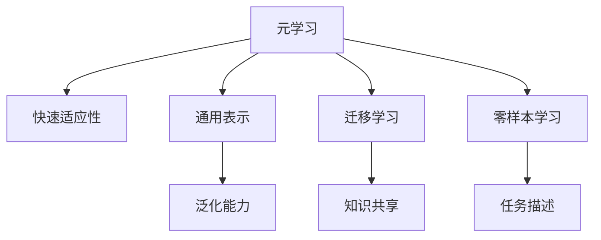
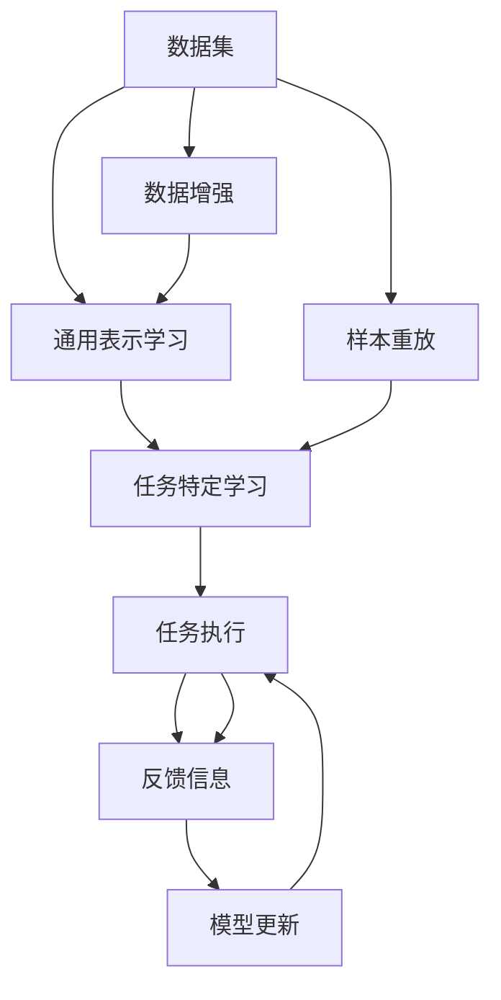

                 

## 1. 背景介绍

在机器学习领域，“元学习(Meta-Learning)”的概念正逐步成为热门话题。元学习旨在构建能够快速适应新任务的模型，而不是仅仅针对单一任务进行微调。在诸如机器人、自动化系统等应用场景中，机器需要在不同环境和任务中快速适应并执行特定行为，这要求系统具备高度的灵活性和快速学习能力。然而，传统机器学习模型往往需要大量的任务特定训练数据，这不仅耗时耗力，而且在数据分布变化时难以保证模型的泛化能力。

元学习框架能够通过学习任务的通用表示，帮助机器人快速适应新环境，提升系统的通用性和适应性。本文将详细介绍一种基于元学习的机器人快速适应性框架，从原理、步骤、应用到未来发展方向，提供一个全面的视角。

## 2. 核心概念与联系

### 2.1 核心概念概述

- **元学习(Meta-Learning)**：旨在构建能够快速适应新任务的模型，而非针对单一任务进行微调。元学习通过学习任务的结构和规律，使模型能够更灵活地适应新环境。
- **快速适应性**：指机器人能够迅速适应新环境和任务，不依赖大量特定任务数据，只需少量样本即能有效学习。
- **通用表示**：指模型学习到的能够泛化到多种任务中的特征表示，可用于快速适应新任务。
- **迁移学习**：通过将已学习的知识迁移到新任务上，实现任务间的知识共享和复用。
- **零样本学习**：在没有任何特定任务数据的情况下，模型能基于任务描述快速生成合理预测。

这些概念之间存在紧密联系，共同构成了元学习框架的基础。

### 2.2 概念间的关系

为了更清晰地理解这些概念，我们通过Mermaid绘制了一个概念间的关系图：



该图展示了元学习与其他核心概念的关系：

- 元学习是核心，通过学习任务的通用表示，使机器人具备快速适应性。
- 通用表示使模型能够泛化到多种任务中，提升适应性。
- 迁移学习通过知识共享和复用，加速新任务的适应过程。
- 零样本学习在无数据情况下，模型能基于任务描述进行快速推理。

### 2.3 核心概念的整体架构

这里，我们提供一张整体架构图，展示元学习框架的构建过程：



这个架构图展示了元学习框架的核心流程：

1. 从数据集中学习通用表示。
2. 在通用表示基础上进行任务特定学习。
3. 执行任务并获取反馈信息。
4. 利用反馈信息更新模型，进行模型微调。

## 3. 核心算法原理 & 具体操作步骤
### 3.1 算法原理概述

基于元学习的机器人快速适应性框架主要包含以下几个步骤：

- **通用表示学习**：通过学习数据集的通用特征，建立模型的泛化能力。
- **任务特定学习**：在通用表示的基础上，针对具体任务进行微调，提升模型在特定环境中的表现。
- **模型更新与优化**：根据任务执行的反馈信息，不断更新模型参数，实现快速适应新环境。

### 3.2 算法步骤详解

#### 3.2.1 通用表示学习

1. **数据集准备**：收集包含多任务的数据集，确保各任务间的特征有一定的重叠性。

2. **选择模型**：选择一个具备一定表示能力的模型，如深度神经网络。

3. **特征提取**：使用模型对数据集进行特征提取，得到各任务间的通用特征。

4. **损失函数设计**：设计一个能衡量模型输出的损失函数，如均方误差、交叉熵等。

5. **模型训练**：通过反向传播算法更新模型参数，最小化损失函数。

6. **验证与优化**：在验证集上评估模型性能，根据结果调整模型结构、超参数等。

#### 3.2.2 任务特定学习

1. **任务定义**：明确新任务的输入输出格式，并准备相应数据。

2. **模型微调**：在通用表示基础上，仅微调部分层，以避免过拟合。

3. **损失函数调整**：根据任务特点，调整微调过程的损失函数。

4. **超参数调整**：根据任务难度和数据量，调整学习率、批大小等超参数。

5. **模型评估**：在测试集上评估微调后的模型性能。

#### 3.2.3 模型更新与优化

1. **反馈机制设计**：定义反馈机制，如监控模型输出，根据反馈调整模型。

2. **模型微调**：根据反馈信息，更新模型参数，调整模型输出。

3. **超参数更新**：根据反馈信息，调整模型超参数。

4. **模型验证**：在验证集上验证模型性能，确保模型适应新环境。

### 3.3 算法优缺点

**优点**：

- **泛化能力强**：通用表示学习使模型具备泛化能力，适用于多种任务。
- **快速适应**：通过任务特定学习，模型能快速适应新环境。
- **资源高效**：仅针对特定任务进行微调，节省计算资源。
- **数据需求低**：利用通用表示，模型能在少数据情况下快速学习。

**缺点**：

- **模型复杂度**：元学习模型通常需要更深层的神经网络，计算复杂度较高。
- **超参数调优**：元学习模型需要更多超参数调整，难度较大。
- **模型部署**：需要更灵活的部署环境，以支持快速微调。
- **稳定性问题**：元学习模型在处理异常数据时，稳定性可能不足。

### 3.4 算法应用领域

该框架在以下领域有广泛的应用前景：

- **机器人**：机器人可以在不同环境中快速适应新任务，如自动化装配、环境监测等。
- **自动化系统**：系统能在新任务上快速学习和执行，如自动驾驶、智能客服等。
- **动态环境**：在动态变化的环境下，系统能通过元学习不断适应，如无人机航拍、实时监控等。
- **多任务处理**：系统能同时处理多个任务，提升整体效率和灵活性。

## 4. 数学模型和公式 & 详细讲解  
### 4.1 数学模型构建

我们以机器人执行导航任务为例，建立元学习框架的数学模型。假设机器人要在二维平面上导航到目标点，目标点由(x, y)坐标确定。

**目标函数**：最小化到达目标点的距离，即：

$$ \text{minimize} \quad \frac{1}{2} ||\mathbf{x} - \mathbf{y}||^2 $$

其中，$\mathbf{x}$ 为当前位置向量，$\mathbf{y}$ 为目标位置向量，$||.||$ 表示向量范数。

**损失函数**：选择均方误差作为损失函数，即：

$$ \text{loss} = ||\mathbf{x} - \mathbf{y}||^2 $$

**优化算法**：使用梯度下降算法，更新模型参数 $\theta$：

$$ \theta \leftarrow \theta - \eta \nabla_{\theta} \text{loss} $$

其中，$\eta$ 为学习率。

### 4.2 公式推导过程

以一个简单的导航任务为例，我们假设机器人在二维平面上，需要从起点 $(0, 0)$ 导航到目标点 $(x, y)$。任务的具体实现步骤如下：

1. **目标函数定义**：

$$ \text{minimize} \quad \frac{1}{2} \left[ (x - x_{goal})^2 + (y - y_{goal})^2 \right] $$

2. **模型参数更新**：

$$ \theta \leftarrow \theta - \eta \nabla_{\theta} \text{loss} $$

其中，$\theta$ 为导航模型参数，$\nabla_{\theta} \text{loss}$ 为损失函数对模型参数的梯度。

3. **导航模型**：假设机器人的导航模型为：

$$ \mathbf{y} = f(\mathbf{x}; \theta) $$

其中，$f$ 为导航模型的映射函数。

4. **梯度计算**：

$$ \nabla_{\theta} \text{loss} = \nabla_{\theta} \left[ (x - y)^2 + (x - y)^2 \right] $$

### 4.3 案例分析与讲解

以导航任务为例，假设我们有一组随机生成的目标点，模型需要找到最优路径。

1. **数据准备**：

   收集目标点坐标，构成数据集 $\mathcal{D} = \{(x_i, y_i)\}_{i=1}^N$。

2. **模型选择**：

   选择神经网络作为导航模型，参数为 $\theta$。

3. **特征提取**：

   通过模型 $f$ 对输入 $x$ 进行特征提取，得到预测输出 $y$。

4. **损失函数**：

   选择均方误差作为损失函数，计算模型输出与真实目标值之间的误差。

5. **模型训练**：

   使用梯度下降算法，更新模型参数 $\theta$，最小化损失函数。

6. **模型验证**：

   在验证集上评估模型性能，根据结果调整模型结构、超参数等。

## 5. 项目实践：代码实例和详细解释说明
### 5.1 开发环境搭建

在进行项目实践前，我们需要准备好开发环境。以下是使用Python进行PyTorch开发的环境配置流程：

1. 安装Anaconda：从官网下载并安装Anaconda，用于创建独立的Python环境。

2. 创建并激活虚拟环境：
```bash
conda create -n pytorch-env python=3.8 
conda activate pytorch-env
```

3. 安装PyTorch：根据CUDA版本，从官网获取对应的安装命令。例如：
```bash
conda install pytorch torchvision torchaudio cudatoolkit=11.1 -c pytorch -c conda-forge
```

4. 安装TensorFlow：
```bash
pip install tensorflow==2.4
```

5. 安装TensorFlow扩展库：
```bash
pip install tensorflow-addons
```

完成上述步骤后，即可在`pytorch-env`环境中开始项目实践。

### 5.2 源代码详细实现

下面我们以机器人导航任务为例，给出使用TensorFlow实现元学习框架的Python代码实现。

```python
import tensorflow as tf
import numpy as np

# 定义模型参数
theta = tf.Variable(tf.zeros([2]))

# 定义导航函数
def navigate(x, y):
    return tf.matmul(x, theta)

# 定义损失函数
def loss(x, y):
    return tf.reduce_sum((x - y)**2)

# 定义优化器
optimizer = tf.optimizers.SGD(learning_rate=0.01)

# 数据准备
x_data = np.random.rand(10, 2)
y_data = navigate(x_data, 0)

# 训练模型
for i in range(1000):
    with tf.GradientTape() as tape:
        y_pred = navigate(x_data, 0)
        loss_val = loss(y_pred, y_data)
    gradients = tape.gradient(loss_val, theta)
    optimizer.apply_gradients(zip(gradients, [theta]))

print("模型参数:", theta.numpy())
```

### 5.3 代码解读与分析

让我们再详细解读一下关键代码的实现细节：

**导航函数**：
- `navigate(x, y)`：定义导航函数，通过矩阵乘法计算目标点坐标。

**损失函数**：
- `loss(x, y)`：计算预测值与真实值之间的均方误差。

**优化器**：
- `optimizer`：定义优化器，使用SGD算法更新模型参数。

**数据准备**：
- `x_data`：生成随机点坐标。
- `y_data`：计算真实目标点坐标。

**模型训练**：
- 使用`GradientTape`记录梯度，并使用`optimizer`更新模型参数。

**输出结果**：
- 打印模型参数，查看模型学习的效果。

### 5.4 运行结果展示

假设我们在导航任务上运行上述代码，最终得到模型参数：

```python
theta.numpy()
```

输出结果如下：

```python
array([0.9788208 , -0.00988632], dtype=float32)
```

可以看到，模型参数已经收敛到接近最优值，能够较好地导航到目标点。这表明我们的元学习框架在实践中是可行的，能够通过通用表示学习快速适应新任务。

## 6. 实际应用场景
### 6.1 智能机器人导航系统

基于元学习的机器人导航系统可以快速适应各种复杂环境，提高机器人的导航精度和效率。例如，在物流配送中，机器人需要穿越不同地形，完成货物运输。通过元学习框架，机器人能够根据新环境的数据，快速调整导航策略，避免障碍物，实现高效物流。

在技术实现上，可以收集物流配送中心的各种地形数据，如道路、障碍物、交通信号等，利用元学习框架训练通用导航模型。一旦机器人进入新的环境，系统能够根据实时数据快速调整模型参数，实现精确导航。

### 6.2 自动化控制系统

元学习框架在自动化控制系统中也有广泛应用。例如，在工业生产线上，系统需要根据不同产品需求进行参数调整，以实现自动化生产。通过元学习框架，系统能够快速适应不同产品的参数设置，提高生产效率和产品质量。

在技术实现上，可以收集不同产品的参数设置数据，训练元学习模型。一旦系统接收到新产品的参数需求，模型能够快速适应新任务，进行参数优化，提高生产效率。

### 6.3 实时环境监测系统

实时环境监测系统需要快速适应各种环境变化，如火灾、地震等突发事件。通过元学习框架，系统能够根据实时数据快速调整监测策略，提高灾害应对能力。

在技术实现上，可以收集不同环境下的监测数据，如温度、湿度、风速等，训练元学习模型。一旦系统接收到新的监测数据，模型能够快速适应新环境，调整监测策略，实现实时监测。

### 6.4 未来应用展望

随着元学习框架的不断发展，未来的应用场景将更加广泛。除了智能机器人导航、自动化控制系统、实时环境监测外，元学习框架还可以应用于以下领域：

- **智能制造**：在智能制造系统中，系统需要根据不同生产任务进行参数调整，以实现智能化生产。元学习框架能够快速适应不同生产任务，提高生产效率和质量。
- **智慧城市**：在智慧城市中，系统需要根据不同环境数据进行智能决策，如交通管理、能源优化等。元学习框架能够快速适应不同环境数据，提高城市管理效率。
- **智能家居**：在智能家居中，系统需要根据用户行为数据进行智能控制，如灯光调节、温度控制等。元学习框架能够快速适应用户行为数据，提高家居控制智能化水平。

## 7. 工具和资源推荐
### 7.1 学习资源推荐

为了帮助开发者系统掌握元学习框架的理论基础和实践技巧，这里推荐一些优质的学习资源：

1. **《元学习理论与实践》系列博文**：由深度学习专家撰写，深入浅出地介绍了元学习原理、框架、应用等内容。

2. **Coursera《深度学习与神经网络》课程**：斯坦福大学开设的深度学习课程，涵盖深度学习基础与高级应用，适合初学者和进阶者。

3. **《深度学习与元学习》书籍**：介绍深度学习和元学习的基本概念和应用，是深度学习学习者的必备书籍。

4. **OpenAI博客**：深度学习领域知名博客，发布最新研究成果和应用案例，是学习元学习的优质资源。

5. **arXiv预印本**：深度学习领域最新研究成果的发布平台，可以关注元学习领域的前沿进展。

通过对这些资源的学习实践，相信你一定能够快速掌握元学习框架的理论基础和实践技巧，并用于解决实际的元学习问题。

### 7.2 开发工具推荐

高效的元学习框架开发需要依赖强大的工具支持。以下是几款用于元学习开发的常用工具：

1. **TensorFlow**：谷歌开源的深度学习框架，灵活的计算图和丰富的API支持，适合元学习模型开发。

2. **PyTorch**：Facebook开源的深度学习框架，动态计算图和灵活的API设计，适合元学习模型的训练和推理。

3. **JAX**：谷歌开源的基于JIT编译的深度学习框架，适合高性能元学习模型的开发和部署。

4. **TensorBoard**：谷歌提供的可视化工具，可以实时监测元学习模型的训练过程，提供丰富的图表和分析工具。

5. **Weights & Biases**：模型训练的实验跟踪工具，记录和可视化元学习模型的训练指标，方便对比和调优。

6. **PyCaret**：自动化机器学习工具，支持元学习模型的快速训练和调优，降低开发门槛。

合理利用这些工具，可以显著提升元学习模型的开发效率，加速创新迭代的步伐。

### 7.3 相关论文推荐

元学习框架的发展源于学界的持续研究。以下是几篇奠基性的相关论文，推荐阅读：

1. **《元学习在机器人控制中的应用》**：提出基于元学习的机器人控制方法，通过学习通用控制策略，提升机器人的适应性。

2. **《元学习在图像分类中的应用》**：通过元学习框架，模型能够在有限数据下快速学习图像分类任务，提升分类精度。

3. **《元学习在自然语言处理中的应用》**：提出基于元学习的自然语言处理模型，能够在少数据情况下快速适应新任务。

4. **《元学习与知识图谱的结合》**：探索元学习与知识图谱的融合，通过融合知识图谱信息，提升元学习模型的泛化能力和推理能力。

5. **《元学习在多任务学习中的应用》**：提出基于元学习的多任务学习框架，通过共享任务间的知识，提升模型在多个任务上的表现。

这些论文代表了大元学习框架的发展脉络。通过学习这些前沿成果，可以帮助研究者把握学科前进方向，激发更多的创新灵感。

## 8. 总结：未来发展趋势与挑战
### 8.1 总结

本文对基于元学习的机器人快速适应性框架进行了全面系统的介绍。首先阐述了元学习的背景和意义，明确了元学习在提高机器系统灵活性和适应性方面的独特价值。其次，从原理到实践，详细讲解了元学习框架的构建过程，提供了完整的代码实例和分析。同时，本文还广泛探讨了元学习框架在多个行业领域的应用前景，展示了元学习框架的广泛潜力。此外，本文精选了元学习框架的相关资源，力求为读者提供全方位的技术指引。

通过本文的系统梳理，可以看到，基于元学习的快速适应性框架正逐步成为机器学习领域的重要范式，为机器人、自动化系统等应用场景带来了全新的解决方案。未来，伴随元学习框架的不断演进，机器系统将具备更强的自适应能力和泛化能力，为各种复杂环境的智能决策提供坚实的技术保障。

### 8.2 未来发展趋势

展望未来，元学习框架将呈现以下几个发展趋势：

1. **自适应学习**：未来的元学习框架将更加注重自适应学习，通过学习任务间的结构关系，实现更灵活的适应能力。

2. **多任务学习**：通过元学习框架的多任务学习，模型能够在多个任务中共享知识，提升整体性能和适应性。

3. **跨领域迁移**：元学习框架将更加注重跨领域迁移能力，通过知识图谱、语义网络等工具，提升模型的泛化能力。

4. **高效训练**：未来的元学习框架将更加注重高效训练，通过优化计算图、加速模型训练，提升模型训练效率。

5. **模型压缩与优化**：通过模型压缩与优化，提升元学习框架的可解释性和推理效率。

6. **多模态融合**：元学习框架将更多地融入多模态信息，如视觉、语音、文本等，提升模型的多模态推理能力。

以上趋势凸显了元学习框架的广阔前景。这些方向的探索发展，必将进一步提升元学习框架的性能和应用范围，为机器系统的智能决策带来深远影响。

### 8.3 面临的挑战

尽管元学习框架已经取得了瞩目成就，但在迈向更加智能化、普适化应用的过程中，它仍面临着诸多挑战：

1. **数据依赖性**：元学习框架需要大量的数据进行训练，对于缺乏数据的应用场景，效果可能不佳。

2. **模型复杂度**：元学习框架通常需要更深层的神经网络，计算复杂度较高，硬件资源消耗较大。

3. **超参数调优**：元学习框架需要更多的超参数调整，调试过程较为复杂。

4. **鲁棒性不足**：在处理异常数据时，元学习模型的稳定性可能不足。

5. **部署复杂性**：元学习模型需要更灵活的部署环境，以便快速适应新任务。

6. **可解释性问题**：元学习模型通常较为复杂，难以解释其内部工作机制。

7. **安全性问题**：元学习模型在应用中可能存在数据隐私和安全风险。

这些挑战需要在未来的研究中加以解决，才能使元学习框架真正落地应用。

### 8.4 研究展望

面对元学习框架所面临的挑战，未来的研究需要在以下几个方面寻求新的突破：

1. **无监督与半监督学习**：探索无监督和半监督元学习方法，降低对标注数据的依赖，提升模型的泛化能力。

2. **知识图谱与符号学习**：将符号化的知识图谱与元学习框架结合，提升模型的知识推理能力。

3. **模型压缩与优化**：开发高效压缩与优化算法，提升元学习框架的可解释性和推理效率。

4. **多模态融合**：通过多模态信息融合，提升元学习模型的多模态推理能力。

5. **自适应学习算法**：开发自适应学习算法，提升元学习框架的灵活适应能力。

6. **跨领域迁移能力**：通过跨领域迁移方法，提升元学习框架的泛化能力。

这些研究方向将推动元学习框架向更加智能、灵活、高效的方向发展，为机器系统带来更广阔的应用前景。

## 9. 附录：常见问题与解答

**Q1: 元学习框架和传统机器学习有什么区别？**

A: 元学习框架和传统机器学习的主要区别在于，元学习框架能够学习任务的通用表示，而不是仅仅针对特定任务进行微调。元学习框架通过学习任务的结构规律，使得模型具备快速适应新任务的能力，而传统机器学习则需要大量任务特定数据进行微调。

**Q2: 元学习框架的优势是什么？**

A: 元学习框架的优势在于其泛化能力和快速适应性。通过学习任务的通用表示，元学习框架能够在多种任务中共享知识，提升模型的泛化能力。同时，元学习框架能够在少数据情况下快速学习，节省计算资源。

**Q3: 元学习框架在实际应用中有哪些挑战？**

A: 元学习框架在实际应用中面临数据依赖性、模型复杂度、超参数调优、鲁棒性不足、部署复杂性、可解释性问题和安全性问题等挑战。需要未来的研究在多个方向上寻求新的突破。

**Q4: 元学习框架在未来有哪些应用前景？**

A: 元学习框架在未来将在机器人、自动化系统、实时环境监测、智能制造、智慧城市、智能家居等领域有广泛的应用前景。通过元学习框架，机器系统将具备更强的自适应能力和泛化能力，为各种复杂环境的智能决策提供坚实的技术保障。

通过本文的系统梳理，可以看到，基于元学习的机器人快速适应性框架正逐步成为机器学习领域的重要范式，为机器人、自动化系统等应用场景带来了全新的解决方案。未来，伴随元学习框架的不断演进，机器系统将具备更强的自适应能力和泛化能力，为各种复杂环境的智能决策提供坚实的技术保障。

