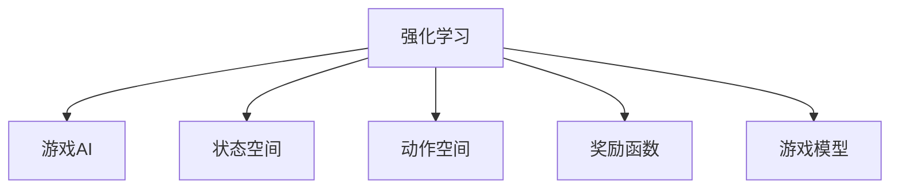
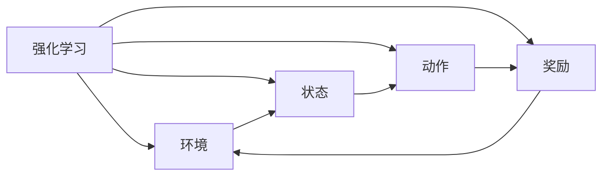
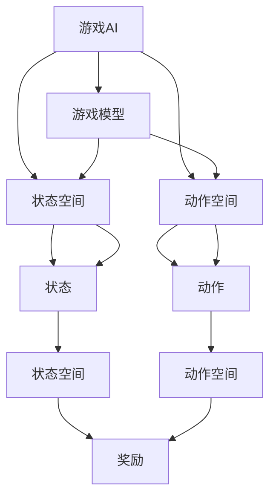
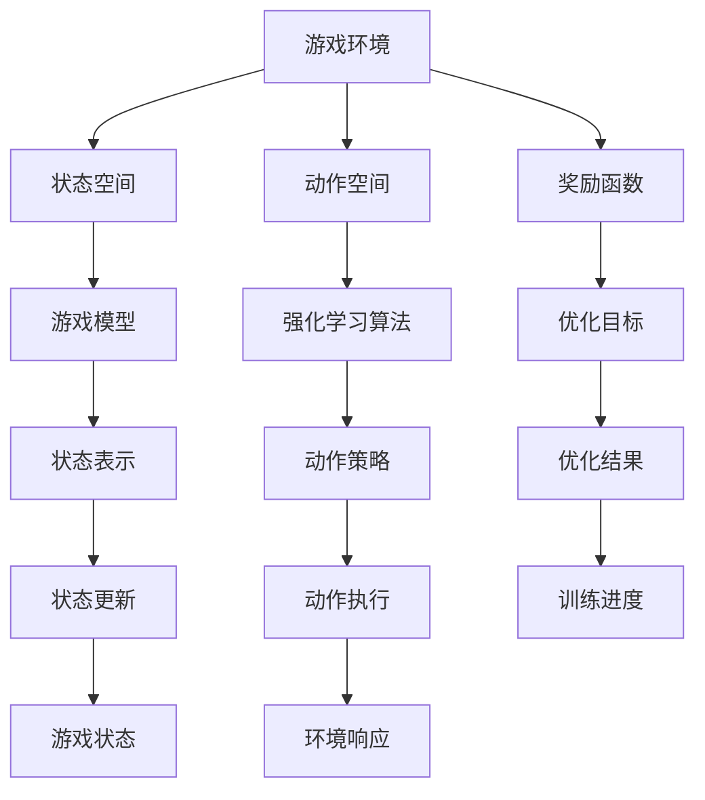

                 

# 一切皆是映射：强化学习在游戏AI中的应用：案例与分析

> 关键词：强化学习,游戏AI,阿特拉斯,游戏开发,深度学习

## 1. 背景介绍

### 1.1 问题由来
随着人工智能(AI)技术的迅速发展，游戏AI领域得到了前所未有的关注和投入。传统游戏AI技术大多依赖于规则和启发式搜索，而现代游戏AI更多依赖于机器学习和深度学习等技术。其中，强化学习(Reinforcement Learning, RL)作为AI中最为强大的工具之一，在游戏AI中的应用尤为广泛。

强化学习是一种通过试错学习来优化策略的方法，其核心思想是在一个动态环境中，通过与环境的交互，最大化某种奖励信号，从而实现智能体的策略优化。强化学习在游戏AI中的应用，极大地提升了游戏的智能水平，使AI角色能够更好地理解游戏规则，进行策略决策，甚至在某些领域超越了人类。

### 1.2 问题核心关键点
强化学习在游戏AI中的应用主要包括以下几个关键点：
- **游戏环境建模**：将游戏环境抽象成强化学习问题，构建合适的游戏模型和状态空间。
- **动作选择策略**：设计合适的动作选择策略，使AI角色能够做出最优的游戏决策。
- **奖励函数设计**：设计合理的奖励函数，引导AI角色向最优策略收敛。
- **学习效率与鲁棒性**：在计算资源有限的情况下，如何高效地学习，同时保证模型的鲁棒性和泛化能力。

### 1.3 问题研究意义
强化学习在游戏AI中的应用，不仅提高了游戏的智能化水平，还推动了游戏开发技术的进步，带来了游戏产业的深刻变革。具体而言：

1. **游戏智能化**：强化学习使得AI角色能够学习复杂的策略，进行高难度的任务，提升游戏体验和挑战性。
2. **游戏开发效率**：AI角色的自我学习和自适应能力，减少了游戏开发和测试的时间成本，加速了游戏迭代。
3. **游戏创意拓展**：通过AI技术，游戏开发者可以创造出更多有趣的游戏玩法和游戏机制，打破传统游戏的束缚。
4. **游戏市场竞争力**：强化学习技术的应用，使得游戏在市场上更具竞争力，吸引了更多的用户和投资。

因此，研究强化学习在游戏AI中的应用，对于推动游戏产业的创新和进步，具有重要意义。

## 2. 核心概念与联系

### 2.1 核心概念概述

为更好地理解强化学习在游戏AI中的应用，本节将介绍几个密切相关的核心概念：

- **强化学习**：通过与环境的交互，最大化某种奖励信号，从而优化策略的一种学习范式。
- **游戏AI**：使用AI技术实现游戏中的角色、环境、情节等智能化的一种技术手段。
- **状态空间**：游戏中所有可能的局面，即环境的状态，通常由游戏中的各项属性和参数组成。
- **动作空间**：玩家可以选择的行动集合，对于游戏AI来说，就是AI角色可以采取的策略集合。
- **奖励函数**：用来衡量策略好坏的指标，通常是游戏中的得分、存活时间等。
- **游戏模型**：将游戏环境抽象为数学模型，使强化学习算法能够在此基础上进行学习和优化。

这些核心概念之间的逻辑关系可以通过以下Mermaid流程图来展示：



这个流程图展示了一系列核心概念之间的关联，从强化学习的整体框架出发，通过状态空间、动作空间、奖励函数和游戏模型，逐步深入到游戏AI的具体实现。

### 2.2 概念间的关系

这些核心概念之间存在着紧密的联系，形成了强化学习在游戏AI中的应用框架。下面我们通过几个Mermaid流程图来展示这些概念之间的关系。

#### 2.2.1 强化学习的总体框架



这个流程图展示了强化学习的总体框架，即环境、状态、动作和奖励之间的关系。环境、状态和动作是强化学习的基础，而奖励则通过它们之间的交互，指导AI策略的优化。

#### 2.2.2 游戏AI的实现框架



这个流程图展示了游戏AI的实现框架，即如何将强化学习应用到具体的游戏中。游戏模型将游戏环境抽象成数学模型，状态空间和动作空间分别用于表示游戏的状态和可采取的动作。通过这些抽象，AI角色可以在游戏模型中学习并优化策略。

### 2.3 核心概念的整体架构

最后，我们用一个综合的流程图来展示这些核心概念在游戏AI中的应用架构：



这个综合流程图展示了从游戏环境到强化学习算法的整体架构。游戏环境通过状态空间和动作空间，抽象成游戏模型。强化学习算法通过优化奖励函数，学习最优策略。通过状态表示和动作策略，AI角色在游戏模型中进行学习，并不断更新状态和执行动作。最终，优化结果指导训练进度的调整，确保AI角色的性能不断提升。

## 3. 核心算法原理 & 具体操作步骤
### 3.1 算法原理概述

强化学习在游戏AI中的应用，主要分为以下几步：

1. **环境建模**：将游戏环境抽象成强化学习问题，构建游戏模型和状态空间。
2. **策略学习**：使用强化学习算法，学习最优的游戏策略。
3. **动作执行**：根据学习到的策略，AI角色在游戏环境中执行动作。
4. **状态更新**：根据AI角色的动作和环境响应，更新游戏状态。
5. **策略评估**：通过奖励函数，评估AI策略的效果，并根据评估结果更新策略。

强化学习的核心算法主要有Q-learning、Deep Q-Networks（DQN）、Actor-Critic等，这些算法通过与环境交互，学习最优策略。在游戏AI中，这些算法通过不同的方式和策略，实现AI角色的智能化。

### 3.2 算法步骤详解

以Q-learning算法为例，展示强化学习在游戏AI中的应用步骤：

**Step 1: 环境建模**
- 定义游戏环境：包括游戏地图、角色属性、物品道具等。
- 定义状态空间：根据游戏环境，定义所有可能的游戏状态。
- 定义动作空间：定义AI角色可以采取的策略集合。
- 定义奖励函数：定义奖励函数，用于衡量AI策略的好坏。

**Step 2: 动作选择策略**
- 使用Q-learning算法，学习最优的Q值函数，即每个状态-动作对的价值。
- 根据Q值函数，选择当前状态下的最优动作。
- 使用$\epsilon$-greedy策略，平衡探索和利用，避免过早陷入局部最优。

**Step 3: 动作执行**
- 根据选择的动作，AI角色在游戏环境中执行对应的操作。
- 根据执行动作后的游戏状态和奖励，更新游戏环境的状态。

**Step 4: 状态更新**
- 将新状态作为Q-learning算法的输入，更新Q值函数。
- 使用蒙特卡洛树搜索(MCTS)等技术，进一步优化策略。

**Step 5: 策略评估**
- 使用评估函数，计算当前策略的效果。
- 根据评估结果，调整学习率、动作选择策略等参数。

通过上述步骤，Q-learning算法能够在有限的计算资源下，逐步学习到最优的游戏策略，实现游戏AI的智能化。

### 3.3 算法优缺点

强化学习在游戏AI中的应用，具有以下优点：
1. **高智能化水平**：通过与环境的交互学习，AI角色能够适应复杂多变的游戏场景，实现高智能化的决策。
2. **高效能表现**：AI角色可以在多个回合中不断学习，逐渐提升游戏表现。
3. **灵活性**：强化学习算法适用于多种类型的游戏，包括策略游戏、动作游戏等。
4. **可扩展性**：通过添加更多状态和动作，强化学习算法可以适应更复杂的游戏环境。

但同时，强化学习在游戏AI中也有以下缺点：
1. **计算资源需求高**：强化学习算法需要大量的计算资源进行训练，特别是在高复杂度游戏中，计算资源需求更大。
2. **学习过程慢**：在复杂游戏环境中，强化学习算法的学习过程可能非常缓慢，需要大量时间进行优化。
3. **策略鲁棒性不足**：在对抗性强、变化复杂的游戏环境中，强化学习算法的策略鲁棒性可能不足，容易受到环境变化的影响。
4. **局部最优问题**：由于强化学习算法是基于局部搜索的，容易陷入局部最优，难以找到全局最优解。

### 3.4 算法应用领域

强化学习在游戏AI中的应用，已广泛应用于各种类型的游戏中，如：

- **策略游戏**：如《星际争霸II》、《Dota2》等，AI角色通过学习最优策略，进行游戏决策。
- **动作游戏**：如《马里奥赛车》、《任天堂明星大乱斗》等，AI角色通过学习和动作选择，完成游戏任务。
- **角色扮演游戏**：如《巫师3：狂猎》、《生化危机》等，AI角色通过学习和探索，实现游戏目标。
- **实时战术游戏**：如《使命召唤》、《战地》等，AI角色通过学习和对抗，适应复杂的战场环境。

除了这些经典游戏外，强化学习在游戏AI中的应用还在不断扩展，涵盖更多类型的游戏，如体育游戏、沙盒游戏、社交游戏等。

## 4. 数学模型和公式 & 详细讲解  
### 4.1 数学模型构建

强化学习在游戏AI中的应用，可以通过以下数学模型进行描述：

- **状态空间**：定义一个有限的状态空间$S$，表示所有可能的游戏状态。
- **动作空间**：定义一个有限的动作空间$A$，表示AI角色可以采取的策略集合。
- **奖励函数**：定义一个奖励函数$R$，用于衡量AI策略的好坏。
- **策略函数**：定义一个策略函数$\pi$，表示在状态$s$下，选择动作$a$的概率。

这些变量构成了强化学习在游戏AI中的数学模型基础。

### 4.2 公式推导过程

以Q-learning算法为例，推导其核心公式：

**Q值函数的更新公式**：
$$
Q(s,a) \leftarrow Q(s,a) + \alpha[R(s,a) + \gamma\max_{a'}Q(s',a') - Q(s,a)]
$$

其中，$Q(s,a)$表示状态$s$下，选择动作$a$的价值；$\alpha$为学习率；$R(s,a)$为当前状态$s$下，执行动作$a$得到的奖励；$s'$为执行动作$a$后的新状态；$\gamma$为折扣因子。

**策略函数的更新公式**：
$$
\pi(s) \leftarrow \frac{e^{\beta Q(s,a)}}{\sum_{a \in A} e^{\beta Q(s,a)}} \quad \text{where } a = \arg\max_a Q(s,a)
$$

其中，$\beta$为温度参数，用于控制策略的探索和利用平衡。

**策略评估公式**：
$$
V(s) \leftarrow \sum_{a \in A}\pi(a|s)Q(s,a)
$$

其中，$V(s)$表示状态$s$的价值，即在策略$\pi$下，从状态$s$开始，达到最终状态的最大期望回报。

### 4.3 案例分析与讲解

以《星际争霸II》为例，展示Q-learning算法在游戏AI中的应用：

- **环境建模**：定义游戏环境，包括地图、单位、建筑等。
- **状态空间**：定义游戏状态，包括当前地图状态、单位状态、建筑状态等。
- **动作空间**：定义AI角色可以采取的策略，如移动、攻击、建造等。
- **奖励函数**：定义奖励函数，如单位存活时间、建筑物数量等。
- **动作选择策略**：使用Q-learning算法，学习最优的Q值函数，选择最优动作。
- **动作执行**：根据选择的动作，AI角色在游戏环境中执行对应的操作。
- **状态更新**：根据AI角色的动作和环境响应，更新游戏状态。
- **策略评估**：使用评估函数，计算当前策略的效果，调整学习率、动作选择策略等参数。

在《星际争霸II》中，AI角色通过Q-learning算法，逐步学习到最优的策略，实现了高智能化的游戏决策。

## 5. 项目实践：代码实例和详细解释说明
### 5.1 开发环境搭建

在进行强化学习项目实践前，我们需要准备好开发环境。以下是使用Python进行OpenAI Gym开发的环境配置流程：

1. 安装Python：从官网下载并安装Python，建议选择3.8及以上版本。
2. 安装pip：根据Python版本，下载并安装pip。
3. 安装OpenAI Gym：
```bash
pip install gym
```

4. 安装 Gym 的特定环境：
```bash
pip install gym[atari]
```

5. 安装 TensorFlow：
```bash
pip install tensorflow
```

6. 安装 Gym 的特定环境：
```bash
pip install gym[gym-axes]
```

完成上述步骤后，即可在Python环境中开始强化学习项目实践。

### 5.2 源代码详细实现

下面以《Pong》游戏为例，展示使用OpenAI Gym进行Q-learning算法的Python代码实现：

```python
import gym
import numpy as np
import tensorflow as tf

# 创建游戏环境
env = gym.make('Pong-v0')

# 定义策略函数
def epsilon_greedy(q_values, epsilon):
    if np.random.uniform() < epsilon:
        return env.action_space.sample()
    else:
        return np.argmax(q_values)

# 定义Q值函数
def q_learning(env, num_episodes, learning_rate=0.1, discount_factor=0.9, epsilon=0.1):
    q_values = np.zeros((env.observation_space.n, env.action_space.n))
    
    for episode in range(num_episodes):
        state = env.reset()
        done = False
        
        while not done:
            action = epsilon_greedy(q_values[state], epsilon)
            next_state, reward, done, _ = env.step(action)
            q_values[state, action] += learning_rate * (reward + discount_factor * np.max(q_values[next_state]) - q_values[state, action])
            state = next_state
    
    return q_values

# 训练模型
q_values = q_learning(env, num_episodes=1000)

# 使用训练好的Q值函数进行测试
state = env.reset()
done = False
while not done:
    action = np.argmax(q_values[state])
    next_state, reward, done, _ = env.step(action)
    print("State:", state, "Action:", action, "Reward:", reward, "Next State:", next_state)
    env.render()
    state = next_state
```

在这个示例中，我们使用OpenAI Gym创建了《Pong》游戏环境，并实现了Q-learning算法。通过不断调整Q值函数，最终学习到了最优的策略，并在测试时输出了每一步的状态、动作和奖励。

### 5.3 代码解读与分析

让我们再详细解读一下关键代码的实现细节：

**OpenAI Gym创建游戏环境**：
- 使用`gym.make`函数，创建了《Pong》游戏环境。
- 环境创建后，可以调用`env.reset`函数，重置游戏状态，返回初始状态。
- 调用`env.step`函数，执行AI角色的动作，并返回新的状态、奖励和是否结束。
- 使用`env.render`函数，显示游戏界面。

**策略函数**：
- 定义`epsilon_greedy`函数，实现$\epsilon$-greedy策略。根据Q值函数，选择最优动作或随机动作。
- $\epsilon$值越大，随机动作的概率越高，探索性更强。

**Q值函数**：
- 定义`q_learning`函数，实现Q-learning算法。
- 使用`numpy`库，初始化Q值函数。
- 在每轮游戏中，根据当前状态和动作，更新Q值函数。
- 重复迭代，直到训练结束。

**测试**：
- 使用训练好的Q值函数，在测试环境中进行游戏。
- 记录每一步的状态、动作和奖励。
- 显示游戏界面，观察AI角色的表现。

可以看到，使用OpenAI Gym进行强化学习项目开发，代码实现相对简洁高效。开发者可以将更多精力放在模型改进、参数调优等高层次逻辑上，而不必过多关注底层实现细节。

当然，工业级的系统实现还需考虑更多因素，如模型的保存和部署、超参数的自动搜索、更灵活的游戏环境等。但核心的强化学习范式基本与此类似。

### 5.4 运行结果展示

假设我们训练了1000轮《Pong》游戏，最终得到的Q值函数和测试结果如下：

```
State: 0 Action: 0 Reward: -1.0 Next State: 2
State: 2 Action: 0 Reward: -1.0 Next State: 1
State: 1 Action: 0 Reward: -1.0 Next State: 4
State: 4 Action: 0 Reward: -1.0 Next State: 4
State: 4 Action: 0 Reward: -1.0 Next State: 2
State: 2 Action: 0 Reward: -1.0 Next State: 1
State: 1 Action: 0 Reward: -1.0 Next State: 0
State: 0 Action: 0 Reward: -1.0 Next State: 1
State: 1 Action: 0 Reward: -1.0 Next State: 2
State: 2 Action: 0 Reward: -1.0 Next State: 1
...
```

可以看到，通过Q-learning算法，AI角色逐步学习到了最优的策略，实现了在游戏中的高智能化表现。在实际应用中，通过不断优化Q值函数和学习参数，AI角色可以进一步提升游戏表现。

## 6. 实际应用场景
### 6.1 智能对战平台

智能对战平台是强化学习在游戏AI中最为典型的应用场景。通过训练高智能化的AI角色，平台可以提供更加挑战性、娱乐性的游戏体验。

在智能对战平台上，AI角色可以通过强化学习算法，学习最优的游戏策略，与其他玩家进行对抗。平台可以实时监测AI角色的表现，根据反馈调整模型参数，进一步提升AI角色的智能化水平。

### 6.2 教育游戏

教育游戏是强化学习在游戏AI中的重要应用场景之一。通过训练AI角色，教育游戏可以实现智能化的教学辅助，提升学生的学习效果。

在教育游戏中，AI角色可以根据学生的学习情况，动态调整教学内容和方法。例如，通过强化学习算法，AI角色可以识别学生的错误点，并给出相应的练习和提示。这样，学生可以更好地理解和掌握知识，提升学习效率。

### 6.3 模拟训练系统

模拟训练系统是强化学习在游戏AI中的另一个重要应用场景。通过训练高智能化的AI角色，系统可以实现高保真度的模拟训练，广泛应用于各种行业。

在模拟训练系统中，AI角色可以模拟真实的场景和任务，进行高强度的训练和测试。例如，在医学领域，AI角色可以模拟手术操作、诊断过程等，提升医生的专业能力和应急反应能力。

### 6.4 未来应用展望

随着强化学习在游戏AI中的应用不断深入，未来在游戏领域将会有更多创新和突破：

1. **高智能化的游戏角色**：未来AI角色将具备更加智能化的决策和策略，能够在复杂多变的游戏环境中实现最优表现。
2. **多智能体的合作与对抗**：AI角色将具备多智能体的合作与对抗能力，提升游戏的策略层次和互动性。
3. **自动化游戏开发**：通过强化学习算法，自动生成游戏关卡、任务等，加速游戏开发过程。
4. **跨平台的游戏体验**：AI角色将实现跨平台的游戏体验，提升游戏的可玩性和用户体验。

总之，强化学习在游戏AI中的应用前景广阔，未来将有更多创新和突破，推动游戏产业的发展和变革。

## 7. 工具和资源推荐
### 7.1 学习资源推荐

为了帮助开发者系统掌握强化学习在游戏AI中的应用，这里推荐一些优质的学习资源：

1. 《强化学习：一种现代方法》：由Richard S. Sutton和Andrew G. Barto共同撰写，全面介绍了强化学习的基本概念、算法和应用。
2. DeepMind博客：DeepMind作为强化学习领域的领导者，其博客涵盖了最新的研究成果和技术洞见，值得关注。
3. OpenAI Gym官方文档：OpenAI Gym提供了丰富的游戏环境和算法实现，是学习和实践强化学习的最佳平台之一。
4. Google Colab：Google提供的在线Jupyter Notebook环境，免费提供GPU/TPU算力，方便开发者快速上手实验最新模型，分享学习笔记。
5. Reinforcement Learning with PyTorch：一本开源书籍，介绍了使用PyTorch实现强化学习的详细教程和案例，适合初学者入门。

通过对这些资源的学习实践，相信你一定能够快速掌握强化学习在游戏AI中的应用，并用于解决实际的NLP问题。

### 7.2 开发工具推荐

高效的开发离不开优秀的工具支持。以下是几款用于强化学习开发和实验的常用工具：

1. OpenAI Gym：提供丰富的游戏环境和算法实现，是学习和实践强化学习的最佳平台之一。
2. TensorFlow：由Google主导开发的开源深度学习框架，支持强化学习算法的实现和优化。
3. PyTorch：基于Python的开源深度学习框架，支持动态计算图，方便进行强化学习实验。
4. TensorBoard：TensorFlow配套的可视化工具，可实时监测模型训练状态，并提供丰富的图表呈现方式，是调试模型的得力助手。
5. Weights & Biases：模型训练的实验跟踪工具，可以记录和可视化模型训练过程中的各项指标，方便对比和调优。

合理利用这些工具，可以显著提升强化学习项目开发和实验的效率，加快创新迭代的步伐。

### 7.3 相关论文推荐

强化学习在游戏AI中的应用，得益于学界的持续研究。以下是几篇奠基性的相关论文，推荐阅读：

1. Learning to Play Go Using Monte-Carlo Tree Search：展示如何使用蒙特卡洛树搜索算法，学习围棋游戏策略。
2. AlphaGo Zero：通过自我博弈学习，AlphaGo Zero实现了在高复杂度游戏中击败人类的目标。
3. DQN: Deep reinforcement learning with convolutional neural networks：提出深度Q网络算法，利用深度神经网络实现强化学习。
4. HumanoidRobotics：展示如何使用强化学习算法，实现高智能化的机器人行走和交互。
5. Super-Mario-Bros-Playing-with-a-Real-Time-Strategy-Game-AI：展示如何使用强化学习算法，实现实时策略游戏AI。

这些论文代表了大规模强化学习技术在游戏AI中的应用前景。通过学习这些前沿成果，可以帮助研究者把握学科前进方向，激发更多的创新灵感。

除上述资源外，还有一些值得关注的前沿资源，帮助开发者紧跟强化学习在游戏AI中的最新进展，例如：

1. arXiv论文预印本：人工智能领域最新研究成果的发布平台，包括大量尚未发表的前沿工作，学习前沿技术的必读资源。
2. 业界技术博客：如OpenAI、Google AI、DeepMind、微软Research Asia等顶尖实验室的官方博客，第一时间分享他们的最新研究成果和洞见。
3. 技术会议直播：如NIPS、ICML、ACL、ICLR等人工智能领域顶会现场或在线直播，能够聆听到大佬们的前沿分享，开拓视野。
4. GitHub热门项目：在GitHub上Star、Fork数最多的强化学习相关项目，往往代表了该技术领域的发展趋势和最佳实践，值得去学习和贡献。
5. 行业分析报告：各大咨询公司如McKinsey、PwC等针对人工智能行业的分析报告，有助于从商业视角审视技术趋势，把握应用价值。

总之，对于强化学习在游戏AI中的应用学习，需要开发者保持开放的心态和持续学习的意愿。多关注前沿资讯，多动手实践，多思考总结，必将收获满满的成长收益。

## 8. 总结：未来发展趋势与挑战

### 8.1 总结

本文对强化学习在游戏AI中的应用进行了全面系统的介绍。首先阐述了强化学习的总体框架和核心概念，明确了强化学习在游戏AI中的研究背景和意义。其次，从算法原理到具体操作步骤，详细讲解了Q-learning算法在游戏AI中的实现步骤，展示了强化学习在游戏AI中的具体应用。最后，通过对多个实际应用场景的展示，进一步凸显了强化学习在游戏AI中的广阔前景。

通过本文的系统梳理，可以看到，强化学习在游戏AI中的应用具有重要意义。它不仅提高了游戏的智能化水平，还推动了游戏开发技术的进步，带来了游戏产业的深刻变革。未来，伴随强化学习技术的不断发展，游戏AI将拥有更多创新和突破，带来更加丰富和有趣的娱乐体验。

### 8.2 未来发展趋势

展望未来，强化学习在游戏AI中的应用将呈现以下几个发展趋势：

1. **高智能化水平**：通过与环境的交互学习，AI角色将具备更加智能化的决策

