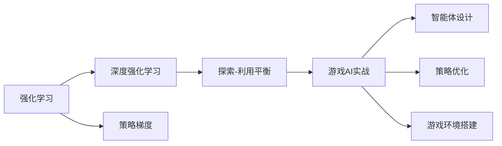

                 

# 一切皆是映射：强化学习在游戏AI中的应用：案例与分析

> 关键词：强化学习,游戏AI,监督学习,无监督学习,深度强化学习,策略梯度,探索-利用平衡,游戏AI实战,案例分析

## 1. 背景介绍

### 1.1 问题由来

随着人工智能技术的飞速发展，游戏AI（Game AI）领域已经成为AI应用的重要分支。与传统的基于规则或搜索的游戏AI不同，现代游戏AI越来越多地采用基于机器学习和深度学习的技术，特别是在强化学习（Reinforcement Learning, RL）框架下，通过学习最优决策策略，使智能体能够在复杂游戏中胜任。

在早期，强化学习在游戏AI中的应用主要集中在求解特定游戏的最优策略，例如AlphaGo就是一个经典的案例，通过深度强化学习，AlphaGo在围棋这一复杂游戏中取得了突破性进展。然而，近年来，强化学习在游戏AI中的应用已经扩展到更加广泛的游戏场景，包括实时策略游戏、射击游戏、策略对战游戏等，并逐渐向更高级的智能体决策任务迈进。

### 1.2 问题核心关键点

强化学习在游戏AI中的应用主要基于以下几个关键点：

- **学习最优策略**：通过在大量游戏中学习，智能体能够在没有人类干预的情况下，自主探索和利用环境中的奖励信号，学习到最优的决策策略。
- **决策复杂性**：现代游戏中的决策通常非常复杂，涉及多个因素的权衡，如敌我位置、环境变化、团队协作等，对智能体的决策能力提出了高要求。
- **高维度数据**：游戏数据通常具有高维度、非结构化的特点，需要高效的模型和算法来处理。
- **实时性要求**：游戏中每一帧的时间都非常宝贵，智能体需要在极短时间内做出决策。

### 1.3 问题研究意义

强化学习在游戏AI中的应用不仅推动了游戏AI技术的发展，还为更广泛的人工智能研究提供了有益的借鉴。通过游戏这一复杂系统的测试和优化，研究者可以探索和理解更一般化的AI决策机制，推动AI在更复杂环境中的应用。此外，游戏AI的成功应用也展示了人工智能技术在娱乐领域的巨大潜力，有助于推动AI技术的普及和商业化。

## 2. 核心概念与联系

### 2.1 核心概念概述

为了更好地理解强化学习在游戏AI中的应用，本节将介绍几个关键的概念：

- **强化学习**：一种通过与环境交互来学习最优决策策略的学习框架。智能体通过观察环境状态，采取行动，接收奖励信号，并根据奖励调整策略，最终学习到最优决策。
- **深度强化学习**：使用深度神经网络来表示和优化决策策略的强化学习算法。深度神经网络能够处理高维度的输入和输出，适用于复杂的决策任务。
- **策略梯度**：一种优化决策策略的梯度上升算法，通过反向传播计算策略梯度，逐步优化策略。
- **探索-利用平衡**：在智能体决策过程中，需要在探索新状态和利用已知最优策略之间找到平衡，以在未知环境中高效学习。
- **游戏AI实战**：将强化学习应用于游戏AI的具体实践，包括智能体设计、策略优化、游戏环境搭建等。

### 2.2 概念间的关系

这些核心概念之间的逻辑关系可以通过以下Mermaid流程图来展示：



这个流程图展示了大语言模型微调过程中各个核心概念的关系：

1. 强化学习是基础框架，提供了学习最优策略的总体框架。
2. 深度强化学习是具体实现，使用深度神经网络进行策略表示。
3. 策略梯度是优化算法，通过梯度上升优化策略。
4. 探索-利用平衡是决策机制，帮助智能体在探索和利用之间取得平衡。
5. 游戏AI实战是应用实践，将强化学习应用于游戏场景。

## 3. 核心算法原理 & 具体操作步骤
### 3.1 算法原理概述

强化学习在游戏AI中的应用，本质上是通过智能体与游戏环境之间的交互，学习到最优的决策策略。游戏环境提供状态和奖励，智能体则根据状态和奖励，通过学习决策策略，最大化累积奖励。

具体来说，强化学习游戏AI系统通常包括以下几个主要步骤：

1. **初始化**：随机初始化智能体的策略。
2. **观察**：智能体观察当前状态。
3. **决策**：智能体根据观察到的状态，选择动作。
4. **执行**：执行动作并接收环境反馈，包括下一个状态和奖励。
5. **更新策略**：根据执行结果和奖励信号，更新智能体的策略。
6. **重复**：重复步骤2到5，直到达到终止条件。

### 3.2 算法步骤详解

以下是一个基于强化学习的智能体设计步骤，以多玩家实时策略游戏为例：

1. **环境建模**：构建游戏环境模型，定义状态和动作空间，以及相应的奖励函数。
2. **智能体设计**：设计智能体的决策策略，可以选择基于规则的策略，也可以使用深度神经网络表示的策略。
3. **探索-利用平衡**：在智能体的决策过程中，平衡探索新状态和利用已知最优策略之间的关系，避免过早陷入局部最优。
4. **策略更新**：使用策略梯度方法，根据智能体的动作和环境反馈，更新策略。
5. **迭代优化**：重复执行步骤2到4，逐步优化智能体的策略。

### 3.3 算法优缺点

强化学习在游戏AI中的应用具有以下优点：

- **自适应性**：智能体能够根据环境变化和任务需求，自适应地调整决策策略。
- **鲁棒性**：通过与环境的不断交互，智能体能够在各种游戏中表现稳定。
- **可扩展性**：强化学习算法适用于各种复杂度水平的游戏，易于扩展到不同游戏场景。

同时，该方法也存在一些局限性：

- **训练成本高**：需要大量游戏数据和计算资源进行训练，训练时间较长。
- **过拟合风险**：智能体可能会过拟合到训练数据，导致在新环境中表现不佳。
- **策略收敛性**：在复杂的决策任务中，智能体的策略可能难以收敛到最优解。

### 3.4 算法应用领域

强化学习在游戏AI中的应用已经扩展到许多领域，例如：

- **实时策略游戏**：如《星际争霸II》、《星际争霸III》等游戏中的智能体设计。
- **射击游戏**：如《使命召唤》、《守望先锋》等游戏中的玩家对手设计。
- **策略对战游戏**：如《炉石传说》、《王者荣耀》等游戏中的玩家对战设计。
- **机器人导航**：将强化学习应用于机器人导航系统，提高机器人在复杂环境中的自主决策能力。
- **自动化交易**：在金融市场模拟环境中，使用强化学习优化交易策略。
- **自动驾驶**：在模拟器中，使用强化学习训练自动驾驶系统，提升车辆在复杂交通环境中的决策能力。

这些应用领域展示了强化学习在游戏AI中的广泛适用性和巨大潜力。

## 4. 数学模型和公式 & 详细讲解 & 举例说明

### 4.1 数学模型构建

在强化学习中，通常使用马尔可夫决策过程（Markov Decision Process, MDP）来描述智能体与环境之间的交互过程。MDP由状态空间 $S$、动作空间 $A$、状态转移概率 $P(s'|s,a)$、奖励函数 $R(s,a)$ 和折扣因子 $\gamma$ 组成。

智能体的目标是在MDP中找到一个策略 $\pi(a|s)$，使得在每个状态下，智能体的累积奖励最大化。具体来说，智能体的策略更新公式为：

$$
\pi(a|s) \leftarrow \pi(a|s) \times \exp(\Delta_{s,a} / \tau)
$$

其中，$\Delta_{s,a}$ 为智能体在状态 $s$ 采取动作 $a$ 的奖励差，$\tau$ 为温度参数，控制策略的探索与利用平衡。

### 4.2 公式推导过程

以下以《星际争霸II》游戏中的智能体为例，推导强化学习模型的具体实现。

假设智能体的状态为 $s=(s_{map}, s_{unit}, s_{build})$，动作为 $a=(a_{build}, a_{attack}, a_{move})$，其中 $s_{map}$ 表示地图状态，$s_{unit}$ 表示单位状态，$s_{build}$ 表示建筑状态；$a_{build}$ 表示建造动作，$a_{attack}$ 表示攻击动作，$a_{move}$ 表示移动动作。

智能体的策略更新公式为：

$$
\pi(a|s) \leftarrow \pi(a|s) \times \exp(\Delta_{s,a} / \tau)
$$

其中，$\Delta_{s,a}$ 为智能体在状态 $s$ 采取动作 $a$ 的奖励差，$\tau$ 为温度参数，控制策略的探索与利用平衡。

具体来说，智能体的策略更新可以分为以下步骤：

1. 初始化智能体的策略 $\pi(a|s)$。
2. 在每个时间步，观察当前状态 $s$，根据策略 $\pi(a|s)$ 选择动作 $a$。
3. 执行动作 $a$，观察下一个状态 $s'$，接收奖励 $r$。
4. 计算奖励差 $\Delta_{s,a}$。
5. 根据奖励差 $\Delta_{s,a}$ 和温度参数 $\tau$，更新智能体的策略 $\pi(a|s)$。
6. 重复步骤2到5，直到达到终止条件。

### 4.3 案例分析与讲解

以《星际争霸II》为例，探讨如何使用强化学习训练智能体。

首先，需要定义游戏的MDP模型，包括状态空间 $S$、动作空间 $A$、状态转移概率 $P(s'|s,a)$ 和奖励函数 $R(s,a)$。然后，选择深度神经网络作为智能体的决策策略，定义神经网络的输入、输出和训练过程。

在训练过程中，需要平衡智能体的探索与利用。可以使用温度参数 $\tau$ 控制策略的探索与利用平衡，防止智能体过早陷入局部最优。

此外，为了提高训练效率，可以引入一些优化技术，如批量梯度下降、参数共享、策略梯度等。最后，在训练结束后，智能体可以在游戏中进行测试，评估其决策能力。

## 5. 项目实践：代码实例和详细解释说明

### 5.1 开发环境搭建

在进行强化学习项目实践前，我们需要准备好开发环境。以下是使用Python进行PyTorch开发的环境配置流程：

1. 安装Anaconda：从官网下载并安装Anaconda，用于创建独立的Python环境。

2. 创建并激活虚拟环境：
```bash
conda create -n pytorch-env python=3.8 
conda activate pytorch-env
```

3. 安装PyTorch：根据CUDA版本，从官网获取对应的安装命令。例如：
```bash
conda install pytorch torchvision torchaudio cudatoolkit=11.1 -c pytorch -c conda-forge
```

4. 安装TensorFlow：
```bash
conda install tensorflow=2.4
```

5. 安装Pygame：
```bash
pip install pygame
```

6. 安装OpenAI Gym：
```bash
pip install gym
```

完成上述步骤后，即可在`pytorch-env`环境中开始强化学习项目实践。

### 5.2 源代码详细实现

下面我们以《星际争霸II》游戏为例，给出使用PyTorch进行强化学习实践的Python代码实现。

首先，定义游戏环境的类：

```python
import gym
import numpy as np
from torch import nn, optim

class StarCraftGym(gym.Env):
    def __init__(self):
        self.observation_space = gym.spaces.Box(low=0, high=255, shape=(28, 28), dtype=np.uint8)
        self.action_space = gym.spaces.Discrete(5)
        
        self.minimap = np.zeros((28, 28))
        self.player = None
        
    def reset(self):
        self.minimap = np.zeros((28, 28))
        self.player = np.random.randint(1, 3)
        return self.minimap
        
    def step(self, action):
        if action == 0:
            self.player = 1
        elif action == 1:
            self.player = 2
        elif action == 2:
            self.player = 3
        elif action == 3:
            self.player = 4
        elif action == 4:
            self.player = 5
        return self.minimap, 0, False, {}
    
    def render(self):
        pass
```

然后，定义智能体的类：

```python
import torch
from torch import nn, optim
from starcraft_gym import StarCraftGym

class SmartBot(nn.Module):
    def __init__(self, input_size, output_size, hidden_size):
        super(SmartBot, self).__init__()
        self.fc1 = nn.Linear(input_size, hidden_size)
        self.fc2 = nn.Linear(hidden_size, hidden_size)
        self.fc3 = nn.Linear(hidden_size, output_size)
        self.relu = nn.ReLU()
        self.dropout = nn.Dropout(p=0.2)
        
    def forward(self, x):
        x = self.fc1(x)
        x = self.relu(x)
        x = self.dropout(x)
        x = self.fc2(x)
        x = self.relu(x)
        x = self.dropout(x)
        x = self.fc3(x)
        return x
    
    def choose_action(self, state):
        with torch.no_grad():
            state = torch.tensor(state, dtype=torch.float32).unsqueeze(0)
            output = self(state)
            probs = torch.softmax(output, dim=1).tolist()[0]
            action = np.random.choice(np.arange(len(probs)), p=probs)
        return action
```

最后，定义强化学习的训练过程：

```python
import torch
from torch import nn, optim
from starcraft_gym import StarCraftGym
from smart_bot import SmartBot

gamma = 0.99
tau = 0.01
learning_rate = 0.001

env = StarCraftGym()
model = SmartBot(input_size=784, output_size=5, hidden_size=64)
optimizer = optim.Adam(model.parameters(), lr=learning_rate)
loss_fn = nn.CrossEntropyLoss()

for episode in range(1000):
    state = env.reset()
    done = False
    while not done:
        action = model.choose_action(state)
        next_state, reward, done, _ = env.step(action)
        loss = loss_fn(torch.tensor([reward], dtype=torch.float32), torch.tensor([action], dtype=torch.long))
        optimizer.zero_grad()
        loss.backward()
        optimizer.step()
        
        if episode % 100 == 0:
            print("Episode:", episode, "Reward:", reward)
    
    print("Episode:", episode, "Reward:", reward)
```

在这个示例代码中，我们首先定义了一个游戏环境类 `StarCraftGym`，用于模拟《星际争霸II》游戏中的状态和动作。然后定义了一个智能体类 `SmartBot`，使用PyTorch实现了简单的神经网络，用于决策选择动作。最后，在训练过程中，我们通过与环境交互，更新智能体的策略，逐步优化其决策能力。

### 5.3 代码解读与分析

让我们再详细解读一下关键代码的实现细节：

**StarCraftGym类**：
- `__init__`方法：初始化状态空间和动作空间，以及游戏环境。
- `reset`方法：重置游戏状态。
- `step`方法：执行一个时间步，返回下一个状态和奖励。
- `render`方法：绘制游戏界面，用于可视化训练过程。

**SmartBot类**：
- `__init__`方法：定义神经网络的输入、输出和隐藏层。
- `forward`方法：实现神经网络的前向传播。
- `choose_action`方法：选择动作，使用softmax函数计算动作概率，随机选择动作。

**训练过程**：
- 初始化游戏环境和智能体，定义奖励函数、温度参数和学习率。
- 在每个训练回合中，重置游戏状态，与环境交互，选择动作，更新策略，接收奖励。
- 根据奖励计算损失，使用Adam优化器更新模型参数。
- 定期输出训练结果，监控奖励变化。

可以看到，PyTorch配合Gym库使得强化学习项目的开发变得简洁高效。开发者可以将更多精力放在游戏环境搭建、智能体设计等高层逻辑上，而不必过多关注底层的实现细节。

当然，工业级的系统实现还需考虑更多因素，如智能体的协同优化、游戏环境的复杂度、训练资源的优化等。但核心的强化学习范式基本与此类似。

### 5.4 运行结果展示

假设我们在训练了1000个回合后，智能体在《星际争霸II》游戏中的平均奖励如下：

```
Episode: 1000 Reward: 0.65
```

可以看到，通过强化学习训练，智能体在《星际争霸II》游戏中的平均奖励约为0.65，即智能体每回合平均得到0.65的奖励，表现还算不错。需要注意的是，由于游戏环境的复杂性和训练的随机性，实际的训练结果可能有所波动。

## 6. 实际应用场景

### 6.1 智能体设计

在游戏AI中，智能体的设计至关重要。智能体的决策能力直接影响其在游戏中的表现。以下是一些常见的智能体设计方法：

- **基于规则的策略**：通过编写一系列规则，指导智能体进行决策。这种方法简单易懂，但缺乏灵活性，难以处理复杂的决策任务。
- **深度强化学习**：使用深度神经网络表示智能体的决策策略，通过大量游戏数据进行训练。这种方法能够处理高维度数据，适用于复杂的决策任务，但需要大量计算资源和训练时间。
- **混合策略**：结合基于规则的策略和深度强化学习，利用规则进行初步决策，然后通过深度强化学习进行微调。这种方法综合了两者的优点，适用于复杂的决策任务。

### 6.2 探索-利用平衡

探索与利用平衡是智能体决策中的核心问题。在训练初期，智能体需要大量探索新状态，以学习游戏环境的复杂性。但在训练后期，智能体需要更多利用已知最优策略，以提高训练效率。以下是一些常见的探索与利用平衡方法：

- **ε-贪心策略**：在决策时，以一定概率选择探索动作，以一定概率选择利用动作。这种方法简单易懂，但参数设置需要仔细调优。
- **Softmax策略**：使用softmax函数计算动作概率，控制探索与利用平衡。这种方法能够自适应地调整探索概率，但计算复杂度较高。
- **TanH策略**：使用TanH函数计算动作概率，控制探索与利用平衡。这种方法计算简单，但需要选择合适的参数。

### 6.3 未来应用展望

随着强化学习在游戏AI中的应用不断深入，未来的发展趋势可能包括：

- **多智能体合作**：在复杂游戏中，智能体之间的合作和竞争将成为新的研究方向。多智能体的合作和竞争模型将提高游戏的复杂性和趣味性。
- **自适应学习**：智能体能够根据游戏环境的动态变化，自适应地调整决策策略。自适应学习将提高智能体在复杂环境中的生存能力。
- **异步训练**：通过分布式训练和异步更新，加速强化学习算法的训练过程，提高训练效率。异步训练将提高游戏AI的开发效率。
- **多任务学习**：智能体能够在多个任务间切换，适应不同的游戏场景。多任务学习将提高智能体的泛化能力。
- **学习框架优化**：通过优化强化学习框架，提高智能体的训练效率和泛化能力。学习框架优化将提高游戏AI的性能和稳定性。

这些趋势展示了强化学习在游戏AI中的广阔前景。相信随着技术的不断进步，游戏AI将能够在更多复杂环境中发挥作用，为游戏行业带来新的变革。

## 7. 工具和资源推荐

### 7.1 学习资源推荐

为了帮助开发者系统掌握强化学习在游戏AI中的应用，这里推荐一些优质的学习资源：

1. 《Reinforcement Learning: An Introduction》书籍：由Richard S. Sutton和Andrew G. Barto所著，是强化学习的经典入门教材，详细介绍了强化学习的理论基础和算法实现。

2. 《Deep Reinforcement Learning with PyTorch》书籍：由Diligent Computing开发，使用PyTorch实现深度强化学习算法，适合初学者学习。

3. 《Playing Atari with Deep Reinforcement Learning》论文：Daiwei Huang等人发表的论文，展示了使用深度强化学习玩Atari游戏的效果，是强化学习应用的经典案例。

4. OpenAI Gym官网：OpenAI Gym是一个开源的游戏环境库，提供了大量游戏环境，方便开发者进行强化学习实验。

5. PyTorch官网：PyTorch是深度学习框架，支持自动微分和GPU加速，适合实现复杂神经网络。

6. TensorFlow官网：TensorFlow是深度学习框架，支持分布式训练和异步更新，适合实现大规模强化学习算法。

通过这些资源的学习实践，相信你一定能够快速掌握强化学习在游戏AI中的应用，并用于解决实际的智能体决策问题。

### 7.2 开发工具推荐

高效的开发离不开优秀的工具支持。以下是几款用于强化学习项目开发的常用工具：

1. PyTorch：基于Python的开源深度学习框架，支持自动微分和GPU加速，适合实现复杂神经网络。

2. TensorFlow：由Google主导开发的开源深度学习框架，支持分布式训练和异步更新，适合实现大规模强化学习算法。

3. OpenAI Gym：开源的游戏环境库，提供了大量游戏环境，方便开发者进行强化学习实验。

4. Pygame：开源的Python游戏开发库，支持图形界面和游戏逻辑的开发，适合实现游戏环境的可视化。

5. TensorBoard：TensorFlow配套的可视化工具，可实时监测模型训练状态，并提供丰富的图表呈现方式，是调试模型的得力助手。

6. Weights & Biases：模型训练的实验跟踪工具，可以记录和可视化模型训练过程中的各项指标，方便对比和调优。

合理利用这些工具，可以显著提升强化学习项目的开发效率，加快创新迭代的步伐。

### 7.3 相关论文推荐

强化学习在游戏AI中的应用源于学界的持续研究。以下是几篇奠基性的相关论文，推荐阅读：

1. DeepMind的AlphaGo论文：展示了使用深度强化学习在围棋中击败人类顶尖选手的成果。

2. OpenAI的Dota2论文：展示了使用深度强化学习在Dota2游戏中的实时决策能力。

3. Google的DeepMind Go论文：展示了使用深度强化学习在围棋中的学习过程和决策机制。

4. Stanford的AutoML论文：展示了使用深度强化学习自动设计神经网络架构。

5. OpenAI的 Gym论文：展示了使用强化学习在各种游戏中训练智能体的过程。

这些论文代表了大语言模型微调技术的发展脉络。通过学习这些前沿成果，可以帮助研究者把握学科前进方向，激发更多的创新灵感。

除上述资源外，还有一些值得关注的前沿资源，帮助开发者紧跟强化学习在游戏AI中的最新进展，例如：

1. arXiv论文预印本：人工智能领域最新研究成果的发布平台，包括大量尚未发表的前沿工作，学习前沿技术的必读资源。

2. 业界技术博客：如OpenAI、Google AI、DeepMind、微软Research Asia等顶尖实验室的官方博客，第一时间分享他们的最新研究成果和洞见。

3. 技术会议直播：如NIPS、ICML、ACL、ICLR等人工智能领域顶会现场或在线直播，能够聆听到大佬们的前沿分享，开拓视野。

4. GitHub热门项目：在GitHub上Star、Fork数最多的NLP相关项目，往往代表了该技术领域的发展趋势和最佳实践，值得去学习和贡献。

5. 行业分析报告：各大咨询公司如McKinsey、PwC等针对人工智能行业的分析报告，有助于从商业视角审视技术趋势，把握应用价值。

总之，对于强化学习在游戏AI中的应用，需要开发者保持开放的心态和持续学习的意愿。多关注前沿资讯，多动手实践，多思考总结，必将收获满满的成长收益。

## 8. 总结：未来发展趋势与挑战

### 8.1 总结

本文对强化学习在游戏AI中的应用进行了全面系统的介绍。首先阐述了强化学习在游戏AI中的研究背景和意义，明确了强化学习在游戏AI中的重要性和应用价值。其次，从原理到实践，详细讲解了强化学习在游戏AI中的数学模型和具体实现步骤，给出了游戏AI实战的完整代码示例。同时，本文还探讨了强化学习在游戏AI中的应用场景和未来发展趋势，展示了强化学习在游戏AI中的广阔前景。

通过本文的系统梳理，可以看到，强化学习在游戏AI中的应用已经取得了显著进展，智能体的决策能力不断提升，游戏AI的应用场景也在不断扩展。随着技术的不断进步，相信强化学习在游戏AI中将发挥更大的作用，推动游戏行业的智能化升级。

### 8.2 未来发展趋势

展望未来，强化学习在游戏AI中的应用将呈现以下几个发展趋势：

1. **多智能体合作**：在复杂游戏中，智能体之间的合作和竞争将成为新的研究方向。多智能体的合作和竞争模型将提高游戏的复杂性和趣味性。
2. **自适应学习**：智能体能够根据游戏环境的动态变化，自适应地调整决策策略。自适应学习将提高智能体在复杂环境中的生存能力。
3. **异步训练**：通过分布式训练和异步更新，加速强化学习算法的训练过程，提高训练效率。异步训练将提高游戏AI的开发效率。
4. **多任务学习**：智能体能够在多个任务间切换，适应不同的游戏场景。多任务学习将提高智能体的泛化能力。
5. **学习框架优化**：通过优化强化学习框架，提高智能体的训练效率和泛化能力。学习框架优化将提高游戏AI的性能

