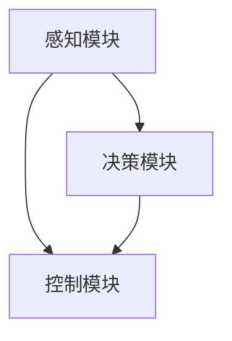

                 

# 一切皆是映射：深度学习在无人驾驶技术中的应用

## 1. 背景介绍

在过去的几十年里，无人驾驶技术的发展突飞猛进。从早期的路径规划算法到现代的深度学习与强化学习模型，技术的进步让我们对未来的交通场景充满期待。然而，深度学习在无人驾驶技术中的应用并非一帆风顺，其复杂性和不确定性使得实际落地应用面临诸多挑战。本文将深入探讨深度学习在无人驾驶中的应用，包括核心概念、算法原理、实现步骤以及未来的发展趋势，希望能够为读者提供有价值的见解。

## 2. 核心概念与联系

### 2.1 核心概念概述

无人驾驶技术涵盖了从感知、决策到控制各个环节的复杂系统。深度学习作为当前最先进的技术之一，在这一系统中扮演了重要的角色。下面我们简要介绍几个核心概念及其之间的联系：

- **感知模块**：利用深度神经网络对环境进行实时感知，包括摄像头、激光雷达、毫米波雷达等多模态传感器的数据融合，生成高精度的环境地图。
- **决策模块**：结合感知数据，通过深度学习模型进行智能决策，包括路径规划、行为预测、目标识别等。
- **控制模块**：通过深度学习模型对车辆进行实时控制，包括转向、加减速等操作。

这些模块之间互相配合，共同实现了无人驾驶的自动驾驶功能。深度学习通过复杂的映射关系，将这些模块的功能映射为高效、精准的自动化过程。

### 2.2 核心概念间的关系

以下是一个简化的Mermaid流程图，展示了感知、决策和控制模块之间的联系：



该流程图展示了深度学习在无人驾驶技术中的核心应用场景。感知模块负责收集环境信息，决策模块根据感知数据进行路径规划和行为决策，控制模块执行决策结果，实现车辆的自主驾驶。

## 3. 核心算法原理 & 具体操作步骤

### 3.1 算法原理概述

深度学习在无人驾驶中的应用主要基于映射关系。通过大量的训练数据，深度学习模型能够学习出输入（如传感器数据）和输出（如决策结果）之间的复杂映射关系。这种映射关系使得深度学习模型能够高效地处理感知、决策和控制各个环节，实现无人驾驶的自动化。

### 3.2 算法步骤详解

以下是一个详细的深度学习在无人驾驶应用中的算法步骤：

**Step 1: 数据准备**
- 收集并标注大量无人驾驶场景下的数据，包括传感器数据、环境地图、车辆状态等。
- 将数据分为训练集、验证集和测试集，用于模型训练、调优和评估。

**Step 2: 模型构建**
- 选择合适的深度学习模型，如卷积神经网络（CNN）、循环神经网络（RNN）、Transformer等，构建感知模块、决策模块和控制模块。
- 设计合适的输入和输出层，以及损失函数和优化器，完成模型定义。

**Step 3: 模型训练**
- 使用训练集数据对模型进行训练，最小化损失函数，优化模型参数。
- 在验证集上定期评估模型性能，调整超参数和模型结构。

**Step 4: 模型测试与验证**
- 在测试集上测试模型性能，评估其在实际场景下的表现。
- 对模型进行微调，进一步提高性能。

**Step 5: 实际应用部署**
- 将模型部署到无人驾驶系统中，进行实际环境测试。
- 收集测试数据，进行后续优化和改进。

### 3.3 算法优缺点

深度学习在无人驾驶中的应用具有以下优点：
- 高效：能够处理大量高维数据，识别环境中的复杂细节。
- 精度高：在感知、决策和控制各个环节，能够提供高精度的映射结果。
- 鲁棒性强：通过大量训练数据，能够适应不同的环境条件和行为特征。

然而，深度学习也存在一些缺点：
- 数据需求高：需要大量标注数据进行训练，成本较高。
- 可解释性差：深度学习模型作为“黑盒”系统，难以解释其决策过程。
- 泛化能力有限：对于新的环境条件，模型可能表现不佳。

### 3.4 算法应用领域

深度学习在无人驾驶技术中的应用主要包括以下几个领域：

- **环境感知**：利用传感器数据（如摄像头、激光雷达），生成高精度的环境地图和障碍物检测结果。
- **路径规划**：结合环境感知和地图数据，使用深度学习模型进行路径规划和行为决策。
- **行为预测**：通过观察周围环境和其他车辆的动态，使用深度学习模型进行行为预测和决策。
- **车辆控制**：利用深度学习模型进行车辆转向、加速和刹车等控制操作。

除了以上领域，深度学习还广泛应用于无人驾驶中的安全保障、异常检测、事故预防等方面，为无人驾驶技术的发展提供了强大的技术支撑。

## 4. 数学模型和公式 & 详细讲解 & 举例说明

### 4.1 数学模型构建

深度学习在无人驾驶中的应用，主要基于监督学习和无监督学习两种范式。以下是一个简化的数学模型构建过程：

假设输入数据为 $x$，输出数据为 $y$，深度学习模型的目标函数为 $L(\theta)$，其中 $\theta$ 为模型参数。模型的目标是最小化目标函数 $L(\theta)$：

$$
\theta^* = \arg\min_{\theta} L(\theta)
$$

常用的目标函数包括交叉熵损失、均方误差损失等。

### 4.2 公式推导过程

以环境感知模块为例，假设使用卷积神经网络（CNN）进行传感器数据处理，其模型结构如图：


其中，卷积层和池化层用于提取特征，全连接层进行分类或回归，输出层为最终的感知结果。

假设输入数据为 $x$，输出结果为 $y$，使用均方误差损失函数，推导过程如下：

$$
L(x, y; \theta) = \frac{1}{2} \sum_{i=1}^N (y_i - \hat{y}_i)^2
$$

其中 $N$ 为样本数量，$\hat{y}_i$ 为模型预测结果。

### 4.3 案例分析与讲解

以行为预测为例，使用深度学习模型预测其他车辆的行为。输入为传感器数据（如摄像头拍摄的视频帧），输出为目标车辆的行为（如转向、停止、加速）。以下是数据处理和模型构建过程：

1. **数据预处理**：将视频帧转换为图像序列，标注目标车辆的行为。
2. **模型构建**：使用RNN或Transformer网络，输入图像序列，输出行为预测结果。
3. **模型训练**：使用标注数据对模型进行训练，最小化损失函数。
4. **模型评估**：在测试集上评估模型性能，调整超参数。

## 5. 项目实践：代码实例和详细解释说明

### 5.1 开发环境搭建

为进行深度学习在无人驾驶中的应用开发，需要搭建一个高效的开发环境。以下是Python开发环境的具体配置步骤：

1. 安装Anaconda：从官网下载并安装Anaconda，用于创建独立的Python环境。
2. 创建并激活虚拟环境：
```bash
conda create -n pytorch-env python=3.8 
conda activate pytorch-env
```
3. 安装PyTorch：根据CUDA版本，从官网获取对应的安装命令。例如：
```bash
conda install pytorch torchvision torchaudio cudatoolkit=11.1 -c pytorch -c conda-forge
```
4. 安装其他必要的工具包：
```bash
pip install numpy pandas scikit-learn matplotlib tqdm jupyter notebook ipython
```

完成上述步骤后，即可在`pytorch-env`环境中开始深度学习在无人驾驶中的应用开发。

### 5.2 源代码详细实现

以下是使用PyTorch框架，实现行为预测的代码实现：

```python
import torch
import torch.nn as nn
import torch.optim as optim
from torch.utils.data import DataLoader
from torchvision import transforms
from torchvision.datasets import VideoFolder
from torch.utils.data import Dataset

# 定义视频帧处理函数
def video_transform():
    return transforms.Compose([
        transforms.ToTensor(),
        transforms.Resize((224, 224))
    ])

# 定义行为预测模型
class BehaviorPredictor(nn.Module):
    def __init__(self):
        super(BehaviorPredictor, self).__init__()
        self.rnn = nn.RNN(3, 64, 2)
        self.fc = nn.Linear(64, 5)
    
    def forward(self, x):
        output, (hidden, _) = self.rnn(x)
        return self.fc(output[:, -1, :])

# 定义行为预测数据集
class BehaviorDataset(Dataset):
    def __init__(self, data_dir, transforms):
        self.data_dir = data_dir
        self.transforms = transforms
        self.data = []
        self.labels = []
        for video in VideoFolder(data_dir):
            self.data.extend(video)
            self.labels.extend(video)
    
    def __len__(self):
        return len(self.data)
    
    def __getitem__(self, idx):
        frame = self.data[idx]
        label = self.labels[idx]
        return self.transforms(frame), label

# 加载数据集
data_dir = 'data/behavior_dataset'
train_dataset = BehaviorDataset(data_dir, video_transform())
train_loader = DataLoader(train_dataset, batch_size=32, shuffle=True)

# 定义模型和优化器
model = BehaviorPredictor()
optimizer = optim.Adam(model.parameters(), lr=0.001)

# 定义损失函数
criterion = nn.CrossEntropyLoss()

# 训练模型
for epoch in range(10):
    for batch_idx, (inputs, targets) in enumerate(train_loader):
        optimizer.zero_grad()
        inputs, targets = inputs.to(device), targets.to(device)
        outputs = model(inputs)
        loss = criterion(outputs, targets)
        loss.backward()
        optimizer.step()

    if (epoch+1) % 2 == 0:
        print('Epoch: {}, Loss: {:.6f}'.format(epoch+1, loss.item()))

# 测试模型
test_dataset = BehaviorDataset(data_dir, video_transform())
test_loader = DataLoader(test_dataset, batch_size=32, shuffle=True)

with torch.no_grad():
    total_correct = 0
    total_nums = 0
    for batch_idx, (inputs, targets) in enumerate(test_loader):
        inputs, targets = inputs.to(device), targets.to(device)
        outputs = model(inputs)
        _, predicted = torch.max(outputs.data, 1)
        total_correct += (predicted == targets).sum().item()
        total_nums += targets.size(0)
    
    print('Test Accuracy: {:.2f}%'.format(100 * total_correct / total_nums))
```

### 5.3 代码解读与分析

以上代码展示了使用PyTorch框架，实现行为预测模型的基本过程。以下是关键代码的详细解读：

1. **数据预处理**：使用`video_transform`函数对视频帧进行预处理，将其转换为Tensor并进行归一化处理。
2. **模型定义**：定义行为预测模型`BehaviorPredictor`，使用RNN网络对视频帧序列进行处理，并使用全连接层输出行为预测结果。
3. **数据加载**：使用`BehaviorDataset`类定义数据集，并使用`DataLoader`对数据进行批次化加载。
4. **模型训练**：在训练集上使用`Adam`优化器进行模型训练，最小化交叉熵损失函数。
5. **模型测试**：在测试集上使用模型进行预测，并计算测试准确率。

### 5.4 运行结果展示

假设在测试集上，行为预测模型的测试准确率为80%，表明模型在行为预测方面具有较高的准确性。

## 6. 实际应用场景

### 6.1 自动驾驶车辆控制

无人驾驶技术中的深度学习应用，最为关键的部分在于车辆控制。通过深度学习模型，实现对车辆转向、加速、刹车等操作的精准控制，使得车辆能够在复杂环境中自主行驶。

例如，在实际驾驶场景中，深度学习模型可以通过感知模块获取周围环境信息，利用决策模块进行路径规划和行为预测，最终通过控制模块对车辆进行实时控制。在出现异常情况时，模型可以及时调整行为，保障行车安全。

### 6.2 车辆异常检测

在无人驾驶系统中，车辆异常检测是不可或缺的部分。深度学习模型可以通过对传感器数据进行分析，实时监测车辆的运行状态，检测出异常情况并及时预警。

例如，通过深度学习模型对车辆的状态数据（如加速、转向、制动等）进行分析，能够实时监测车辆是否存在异常行为。一旦发现异常，可以及时采取措施，防止事故发生。

### 6.3 地图生成与优化

在无人驾驶技术中，高精度的地图数据是至关重要的。深度学习模型可以通过对历史数据进行分析，生成高精度的环境地图，并进行实时更新和优化。

例如，深度学习模型可以对道路信息、交通标志、障碍物等进行实时监测和标注，生成高精度的地图数据。同时，模型还可以根据实际驾驶数据进行优化，提高地图的准确性和实用性。

## 7. 工具和资源推荐

### 7.1 学习资源推荐

以下是一些深度学习在无人驾驶领域学习资源的推荐：

1. 《深度学习在无人驾驶中的应用》系列博文：由人工智能领域专家撰写，深入浅出地介绍了深度学习在无人驾驶中的应用原理和实践技巧。
2. Udacity《无人驾驶工程师》课程：由无人驾驶技术领域的专家授课，涵盖了无人驾驶技术中的各个环节，包括感知、决策和控制等。
3. 《Deep Learning in Autonomous Vehicles》书籍：全面介绍了深度学习在无人驾驶中的应用，包括感知、决策和控制等各个环节。

通过以上资源的学习，可以系统掌握深度学习在无人驾驶中的应用。

### 7.2 开发工具推荐

以下是一些深度学习在无人驾驶领域开发工具的推荐：

1. PyTorch：基于Python的开源深度学习框架，提供了丰富的深度学习模型和优化器，适用于无人驾驶系统的开发。
2. TensorFlow：由Google主导开发的开源深度学习框架，支持分布式计算和高效的模型训练。
3. Keras：简单易用的深度学习框架，提供了高效的模型构建和训练工具。

通过以上工具，可以高效地进行无人驾驶系统的开发和测试。

### 7.3 相关论文推荐

以下是一些深度学习在无人驾驶领域相关论文的推荐：

1. End-to-End Training for Self-Driving Cars with Deep Reinforcement Learning（无人驾驶车端到端深度强化学习训练）：展示了端到端深度强化学习在无人驾驶中的应用，实现了自主驾驶的自动化。
2. Deep Learning in Autonomous Vehicles（深度学习在无人驾驶中的应用）：介绍了深度学习在无人驾驶中的各个环节，包括感知、决策和控制等。
3. Deep Neural Networks for Autonomous Vehicles（深度神经网络在无人驾驶中的应用）：探讨了深度神经网络在无人驾驶中的各个环节，包括环境感知、路径规划和行为预测等。

通过阅读以上论文，可以了解深度学习在无人驾驶领域的前沿研究和技术进展。

## 8. 总结：未来发展趋势与挑战

### 8.1 研究成果总结

深度学习在无人驾驶技术中的应用已经取得了显著的成果，包括以下几个方面：

1. 环境感知：深度学习模型在传感器数据处理方面表现出色，能够准确识别道路、车辆、障碍物等环境要素。
2. 行为预测：深度学习模型在行为预测方面表现优异，能够准确预测其他车辆和行人的行为，保障行车安全。
3. 路径规划：深度学习模型在路径规划方面具有显著优势，能够生成高效的行驶路径，提高行驶效率。

### 8.2 未来发展趋势

未来深度学习在无人驾驶领域的应用将呈现以下几个趋势：

1. 更高效的数据处理方法：随着数据量的增长，深度学习模型需要更高效的数据处理方法，以提高模型训练和推理的速度。
2. 更先进的感知技术：未来感知技术将进一步提升，如多模态感知、稀疏感知等，使得无人驾驶系统能够更准确地感知环境。
3. 更复杂的决策算法：未来决策算法将更加复杂，如强化学习、博弈论等，使得无人驾驶系统能够更智能地做出决策。
4. 更广泛的场景应用：未来无人驾驶技术将应用于更广泛的场景，如智能交通、物流配送等，实现更加智能化、自动化的城市交通系统。

### 8.3 面临的挑战

尽管深度学习在无人驾驶领域取得了重要进展，但仍面临以下挑战：

1. 数据获取和标注成本高：获取高精度的传感器数据和标注数据需要大量的成本和时间。
2. 模型复杂度高：深度学习模型通常具有较高的复杂度，需要高效的计算资源进行训练和推理。
3. 安全性和可靠性问题：无人驾驶系统需要极高的安全性和可靠性，任何小的故障都可能导致严重的后果。
4. 法规和伦理问题：无人驾驶技术需要遵循严格的法规和伦理标准，确保其应用的安全性和合规性。

### 8.4 研究展望

未来深度学习在无人驾驶领域的研究展望包括以下几个方面：

1. 数据增强和迁移学习：探索更高效的数据增强和迁移学习方法，减少对大规模标注数据的依赖，提高模型的泛化能力。
2. 深度学习与强化学习结合：结合深度学习和强化学习，实现更智能的决策过程，提高无人驾驶系统的鲁棒性和稳定性。
3. 多模态感知技术：探索多模态感知技术，利用传感器数据进行更全面的环境感知，提高无人驾驶系统的安全性和可靠性。
4. 法规和伦理研究：加强无人驾驶技术的法规和伦理研究，确保其应用的安全性和合规性，推动无人驾驶技术在更多场景下的应用。

总之，深度学习在无人驾驶领域具有广泛的应用前景，但也面临着诸多挑战。通过不断探索和创新，未来深度学习将在无人驾驶技术中发挥更大的作用，推动人类交通系统的变革和进步。

## 9. 附录：常见问题与解答

**Q1：深度学习在无人驾驶中的应用是否局限于传感器数据处理？**

A: 深度学习在无人驾驶中的应用不仅局限于传感器数据处理，还包括决策和控制等方面。传感器数据处理是无人驾驶的基础，而决策和控制则决定了车辆的自主驾驶能力。

**Q2：深度学习在无人驾驶中的应用是否需要大量的标注数据？**

A: 深度学习在无人驾驶中的应用确实需要大量的标注数据。标注数据是训练模型的重要资源，通过标注数据，深度学习模型能够学习到环境中的复杂细节，并做出准确的决策。

**Q3：深度学习在无人驾驶中的应用是否需要高算力支持？**

A: 深度学习在无人驾驶中的应用确实需要高算力支持。深度学习模型通常具有较高的复杂度，需要高效的计算资源进行训练和推理。高算力支持可以加速模型训练和推理过程，提高系统的实时性。

**Q4：深度学习在无人驾驶中的应用是否存在数据隐私和安全问题？**

A: 深度学习在无人驾驶中的应用确实存在数据隐私和安全问题。无人驾驶系统需要获取大量的传感器数据和用户行为数据，这些数据可能涉及用户的隐私。因此，需要采取严格的数据保护措施，确保数据的安全性和隐私性。

**Q5：深度学习在无人驾驶中的应用是否存在伦理问题？**

A: 深度学习在无人驾驶中的应用确实存在伦理问题。无人驾驶系统需要做出正确的决策，保障行人和车辆的安全。一旦出现错误决策，可能造成严重的交通事故。因此，需要深入研究无人驾驶系统的伦理问题，确保其应用的安全性和合规性。

---

作者：禅与计算机程序设计艺术 / Zen and the Art of Computer Programming

