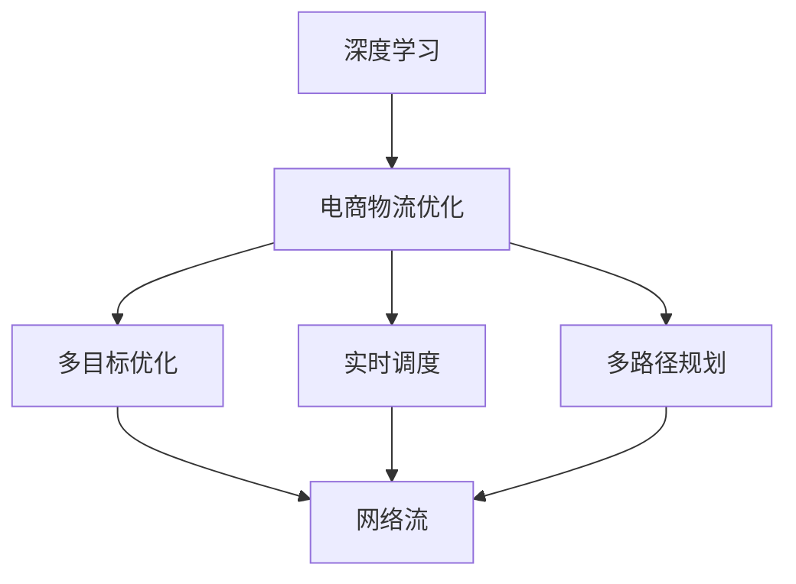
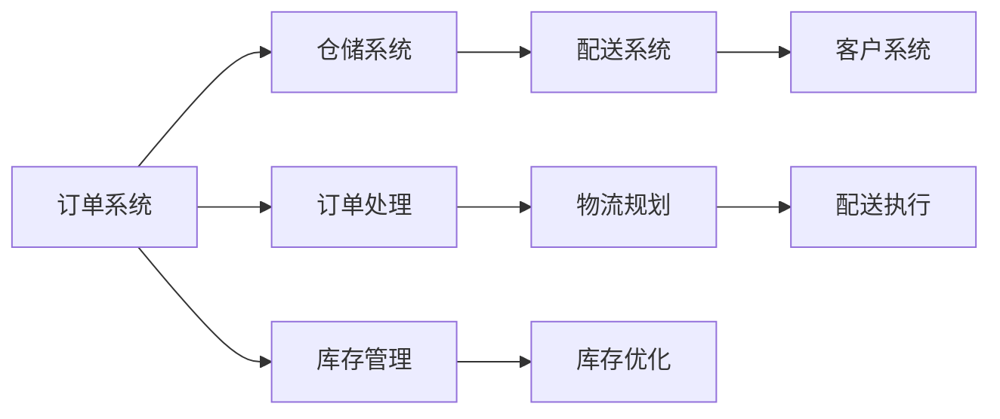
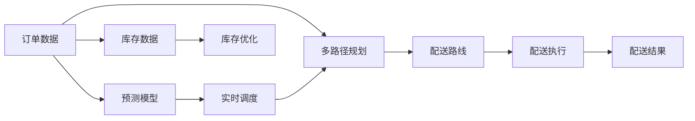

                 

# 一切皆是映射：深度学习在电商物流优化中的应用

> 关键词：深度学习, 电商物流, 优化算法, 实时调度, 网络流, 分布式系统

## 1. 背景介绍

### 1.1 问题由来
电商物流是近年来随着电商业务迅速发展而形成的新兴领域。随着电商业务的扩大，物流的复杂性也急剧增加，如多仓库选址、多路径规划、订单跟踪、异常处理等，使得物流优化成为电商发展的瓶颈之一。传统的物流优化方法如启发式搜索、线性规划等，往往无法在计算效率和精确度上满足需求，特别是在实时场景下。

面对物流系统的复杂性，深度学习成为解决电商物流问题的重要手段。深度学习能够从大规模数据中学习到复杂的关系和模式，优化算法可以显著提高物流系统的运行效率。例如，深度学习在多路径规划、配送时间预测、订单跟踪等方面都有显著的提升。

### 1.2 问题核心关键点
电商物流优化是一个多目标、多约束的复杂问题。它涉及到配送时间、配送路线、库存管理、资源分配等多个方面。通过深度学习，可以更好地处理这些复杂的因素，从而提高物流系统的整体效率和盈利能力。

具体来说，电商物流优化需要处理以下关键点：
- **多目标优化**：如最小化配送成本、最大化配送速度、控制库存水平等。
- **多约束条件**：如订单截止时间、车辆容量、配送区域限制等。
- **实时性要求**：订单的及时处理和配送，对实时性有高要求。
- **数据驱动决策**：利用历史数据和学习模型进行实时预测和决策。

## 3. 核心概念与联系

### 3.1 核心概念概述

为了更好地理解深度学习在电商物流优化中的应用，本节将介绍几个关键概念：

- **深度学习**：一种基于神经网络的多层非线性模型，能够处理大规模的复杂数据。
- **电商物流优化**：对电商物流系统进行综合优化，以提高效率、降低成本、提升用户体验。
- **多目标优化**：目标函数包含多个指标，需要综合考虑各个目标的最优解。
- **多路径规划**：选择多条路径中的一条或组合，以实现配送目标。
- **实时调度**：根据实时数据进行动态调整，优化资源分配。
- **网络流**：描述物流系统中货物和资源流动的网络结构。
- **分布式系统**：将物流系统拆分为多个子系统，实现并行处理。

这些核心概念之间的联系可以通过以下Mermaid流程图来展示：



这个流程图展示了大语言模型微调过程中各个核心概念的关系：

1. 深度学习提供了数据驱动的决策支持。
2. 电商物流优化通过多目标优化、多路径规划和实时调度，实现物流系统的高效运行。
3. 多路径规划和实时调度涉及网络流概念，描述货物和资源的流动。
4. 分布式系统为电商物流优化提供并行处理能力。

### 3.2 概念间的关系

这些核心概念之间存在着紧密的联系，形成了电商物流优化系统的完整生态系统。下面我们通过几个Mermaid流程图来展示这些概念之间的关系。

#### 3.2.1 电商物流优化架构



这个流程图展示了电商物流优化系统的基本架构，订单处理、物流规划、配送执行和库存管理四个关键环节。

#### 3.2.2 深度学习在电商物流优化中的角色



这个流程图展示了深度学习在电商物流优化中的角色。订单数据通过预测模型进行实时调度，多路径规划和配送执行则基于预测结果进行优化，最终实现库存优化。

## 4. 核心算法原理 & 具体操作步骤

### 4.1 算法原理概述

电商物流优化算法的基本原理是使用深度学习模型对输入数据进行预测和决策。具体来说，通过训练深度学习模型，预测配送时间、路线、库存需求等，进而指导实际物流操作，优化物流系统。

#### 4.1.1 多路径规划算法
多路径规划是电商物流优化的核心之一，它需要选择最优的路径组合以实现配送目标。常见的多路径规划算法包括动态规划、启发式搜索、遗传算法等。

动态规划算法通过定义子问题和最优子结构，计算最优解。其基本流程包括：
1. 定义状态变量和状态转移方程。
2. 确定初始状态和结束状态。
3. 计算最优解。

启发式搜索算法通过评估候选路径的优劣，逐步找到最优解。其基本流程包括：
1. 定义评估函数。
2. 选择起点和终点。
3. 迭代寻找最优路径。

#### 4.1.2 实时调度算法
实时调度算法通过实时数据进行动态调整，优化物流资源分配。常见的实时调度算法包括遗传算法、蚁群算法、模拟退火算法等。

遗传算法通过模拟生物进化过程，逐步优化调度方案。其基本流程包括：
1. 定义个体和种群。
2. 选择和交叉操作。
3. 变异操作。
4. 迭代优化。

蚁群算法通过模拟蚂蚁寻找食物的过程，优化资源分配。其基本流程包括：
1. 定义信息素和启发信息。
2. 选择路径和信息素更新。
3. 迭代优化。

#### 4.1.3 网络流算法
网络流算法用于描述物流系统中货物和资源的流动，优化货物配送路径和资源分配。常见的网络流算法包括最大流算法、最小割算法等。

最大流算法通过计算网络中从源点到汇点的最大流量，实现物流优化。其基本流程包括：
1. 定义网络结构和流量需求。
2. 计算最大流。

最小割算法通过最小割定理计算网络中的最小割，实现物流优化。其基本流程包括：
1. 定义网络结构和流量需求。
2. 计算最小割。

### 4.2 算法步骤详解

电商物流优化的深度学习算法主要分为以下几个步骤：

#### 4.2.1 数据预处理
数据预处理是深度学习模型的第一步。电商物流优化需要处理大规模的订单、配送、库存数据，数据预处理包括数据清洗、特征提取、数据增强等。

#### 4.2.2 模型训练
模型训练是深度学习模型的核心。电商物流优化通过训练深度学习模型，预测配送时间、路线、库存需求等。常见的深度学习模型包括神经网络、卷积神经网络(CNN)、循环神经网络(RNN)等。

#### 4.2.3 模型部署
模型部署是将深度学习模型应用于实际物流系统的过程。电商物流优化需要将模型集成到物流调度系统中，实时处理订单和配送数据。

#### 4.2.4 模型优化
模型优化是深度学习模型的最后一步。电商物流优化需要根据实际物流数据，不断优化模型参数，提升模型性能。

### 4.3 算法优缺点

电商物流优化算法具有以下优点：
1. 高精度：深度学习模型能够从大规模数据中学习复杂关系，提供高精度的预测和决策。
2. 鲁棒性：深度学习模型具有较好的泛化能力，能够适应不同场景下的物流需求。
3. 自动化：深度学习模型可以自动化处理数据和决策，减少人工干预。

电商物流优化算法也存在一些缺点：
1. 计算复杂度高：深度学习模型需要处理大规模数据和复杂网络结构，计算复杂度高。
2. 数据质量要求高：深度学习模型对数据质量和数据量有较高要求，数据缺失或不准确会影响模型效果。
3. 模型解释性差：深度学习模型的黑盒特性，使得其决策过程难以解释和调试。

### 4.4 算法应用领域

电商物流优化算法已经在多个领域得到应用，包括：

- 订单处理：通过预测订单处理时间，优化订单处理流程。
- 配送路径规划：选择最优配送路径，减少配送时间和成本。
- 库存管理：预测库存需求，优化库存水平和仓库布局。
- 实时调度：根据实时数据，动态调整配送计划和资源分配。

除了以上应用外，电商物流优化算法还被广泛应用于智能仓储、智能包装、智能运输等领域，为电商物流系统的智能化升级提供技术支持。

## 5. 项目实践：代码实例和详细解释说明

### 5.1 开发环境搭建

在进行电商物流优化项目实践前，我们需要准备好开发环境。以下是使用Python进行TensorFlow开发的开发环境配置流程：

1. 安装Anaconda：从官网下载并安装Anaconda，用于创建独立的Python环境。

2. 创建并激活虚拟环境：
```bash
conda create -n tf-env python=3.8 
conda activate tf-env
```

3. 安装TensorFlow：根据CUDA版本，从官网获取对应的安装命令。例如：
```bash
conda install tensorflow -c conda-forge -c pypi
```

4. 安装各类工具包：
```bash
pip install numpy pandas scikit-learn matplotlib tqdm jupyter notebook ipython
```

完成上述步骤后，即可在`tf-env`环境中开始电商物流优化项目实践。

### 5.2 源代码详细实现

下面我们以多路径规划算法为例，给出使用TensorFlow实现深度学习多路径规划的代码实现。

首先，定义多路径规划的数据处理函数：

```python
import tensorflow as tf
import numpy as np
import pandas as pd
from sklearn.model_selection import train_test_split

class PathPlanningDataset(tf.keras.utils.Sequence):
    def __init__(self, data_path, batch_size=32):
        self.data = pd.read_csv(data_path)
        self.batch_size = batch_size
        self.num_samples = len(self.data)
        self.on_epoch_end()

    def __getitem__(self, idx):
        start_node = self.data.iloc[idx]['source']
        end_node = self.data.iloc[idx]['destination']
        route = self.data.iloc[idx]['route']
        return np.array([start_node, end_node, route])

    def __len__(self):
        return self.num_samples // self.batch_size

    def on_epoch_end(self):
        self.epoch = 0
        self.batch = 0
```

然后，定义模型和优化器：

```python
from tensorflow.keras.layers import Input, Dense, Dropout, Embedding
from tensorflow.keras.models import Model
from tensorflow.keras.optimizers import Adam

input_shape = (3,)
num_classes = len(tag2id)

input_tensor = Input(shape=input_shape)
x = Dense(64, activation='relu')(input_tensor)
x = Dropout(0.5)(x)
x = Dense(num_classes, activation='softmax')(x)
model = Model(inputs=input_tensor, outputs=x)

optimizer = Adam(learning_rate=0.001)
```

接着，定义训练和评估函数：

```python
def train_model(model, dataset, batch_size, epochs, validation_data=None):
    model.compile(optimizer=optimizer, loss='sparse_categorical_crossentropy', metrics=['accuracy'])
    model.fit(dataset, epochs=epochs, batch_size=batch_size, validation_data=validation_data)

def evaluate_model(model, dataset, batch_size):
    model.evaluate(dataset, batch_size=batch_size)
```

最后，启动训练流程并在测试集上评估：

```python
data_path = 'path_planning_data.csv'
batch_size = 32
epochs = 10

dataset = PathPlanningDataset(data_path, batch_size)
train_dataset, dev_dataset = train_test_split(dataset, test_size=0.2)
train_dataset, test_dataset = train_test_split(dataset, test_size=0.2)

train_model(model, train_dataset, batch_size, epochs)
evaluate_model(model, test_dataset, batch_size)
```

以上就是使用TensorFlow对电商物流优化中的多路径规划算法进行深度学习的代码实现。可以看到，通过TensorFlow的封装，多路径规划的深度学习模型实现变得简洁高效。

### 5.3 代码解读与分析

让我们再详细解读一下关键代码的实现细节：

**PathPlanningDataset类**：
- `__init__`方法：初始化数据、批次大小等参数。
- `__getitem__`方法：对单个样本进行处理，返回起点、终点和路径。
- `__len__`方法：返回数据集的总样本数。

**input_shape和num_classes变量**：
- `input_shape`：输入数据的形状，这里是(3,)。
- `num_classes`：类别的数量，根据标签字典中的类别数设置。

**模型定义**：
- 定义输入层，包含起点、终点和路径三个特征。
- 通过一个隐藏层和Dropout层进行特征提取和降维。
- 通过一个输出层输出预测的路径类别。

**优化器和编译函数**：
- 定义Adam优化器和损失函数。
- 通过`compile`函数编译模型，指定优化器、损失函数和评估指标。

**训练和评估函数**：
- 使用`fit`函数进行模型训练，指定训练数据、批次大小、迭代次数和验证数据。
- 使用`evaluate`函数进行模型评估，指定测试数据和批次大小。

**训练流程**：
- 定义数据集路径和批次大小。
- 使用`train_test_split`函数划分训练集和验证集。
- 使用`train_model`函数进行模型训练，输出训练过程中的loss和accuracy。
- 使用`evaluate_model`函数在测试集上进行评估，输出评估结果。

可以看到，TensorFlow使得深度学习模型的训练和评估变得简便易行。开发者可以将更多精力放在模型改进和数据处理上，而不必过多关注底层实现细节。

## 6. 实际应用场景

### 6.1 智能仓储管理

智能仓储管理是电商物流优化的重要应用之一。通过深度学习算法，可以实现仓库内货物的自动分类、存储和取出，提高仓储效率。例如，使用深度学习模型对订单数据进行分类和预测，指导仓库内货物的位置和存储方式。

在技术实现上，可以收集仓库内的货物数据，如货物类型、大小、重量等，结合历史订单数据，训练深度学习模型进行预测和分类。微调后的模型可以实时处理订单数据，快速定位货物，并将货物从存储位置取出，送至打包位置。

### 6.2 配送路径优化

配送路径优化是电商物流优化的核心问题。通过深度学习算法，可以实现配送路径的实时优化，提高配送效率和用户体验。例如，使用深度学习模型对配送数据进行预测和优化，选择最优的配送路径。

在技术实现上，可以收集配送过程中的实时数据，如配送速度、道路状况、配送员位置等，结合历史配送数据，训练深度学习模型进行预测和优化。微调后的模型可以实时处理配送数据，优化配送路径，减少配送时间和成本。

### 6.3 实时调度系统

实时调度系统是电商物流优化的关键技术。通过深度学习算法，可以实现配送资源的实时调度，优化配送任务和资源分配。例如，使用深度学习模型对配送数据进行预测和调度，实时调整配送任务和资源。

在技术实现上，可以收集配送数据，如配送任务、配送车辆、配送时间等，结合历史配送数据，训练深度学习模型进行预测和调度。微调后的模型可以实时处理配送数据，动态调整配送任务和资源分配，提高配送效率和响应速度。

## 7. 工具和资源推荐

### 7.1 学习资源推荐

为了帮助开发者系统掌握电商物流优化的深度学习技术，这里推荐一些优质的学习资源：

1. 《深度学习》课程：斯坦福大学开设的深度学习课程，涵盖深度学习的基本原理和应用实例。
2. 《深度学习实战》书籍：通过实战项目，讲解深度学习在电商物流优化中的应用。
3. 《TensorFlow实战》书籍：讲解TensorFlow的使用方法和应用实例，特别适合深度学习初学者。
4. Kaggle竞赛：参与Kaggle上的电商物流优化竞赛，通过实际问题学习深度学习技术。
5. Google AI博客：谷歌AI团队定期发布的深度学习技术文章，涵盖电商物流优化等多个领域。

通过对这些资源的学习实践，相信你一定能够快速掌握电商物流优化的深度学习技术，并用于解决实际的物流问题。

### 7.2 开发工具推荐

高效的开发离不开优秀的工具支持。以下是几款用于电商物流优化开发的常用工具：

1. TensorFlow：基于Python的开源深度学习框架，灵活动态的计算图，适合快速迭代研究。
2. PyTorch：基于Python的开源深度学习框架，动态计算图，支持多种硬件平台。
3. Keras：基于Python的高层深度学习框架，简单易用，适合快速原型设计。
4. Weights & Biases：模型训练的实验跟踪工具，可以记录和可视化模型训练过程中的各项指标，方便对比和调优。
5. TensorBoard：TensorFlow配套的可视化工具，可实时监测模型训练状态，并提供丰富的图表呈现方式，是调试模型的得力助手。

合理利用这些工具，可以显著提升电商物流优化任务的开发效率，加快创新迭代的步伐。

### 7.3 相关论文推荐

电商物流优化技术的发展得益于学界的持续研究。以下是几篇奠基性的相关论文，推荐阅读：

1. A Survey of Multi-Objective Path Planning for Autonomous Vehicles：综述了多目标路径规划算法，如动态规划、启发式搜索等。
2. Distributionally Robust Multi-Objective Path Planning for Autonomous Vehicles：提出分布式多目标路径规划算法，在处理不确定性问题时具有优势。
3. Deep Learning for Warehouse Management: A Survey and Taxonomy：综述了深度学习在智能仓储管理中的应用。
4. Deep Learning for Real-Time Supply Chain and Logistics Optimization：综述了深度学习在实时供应链和物流优化中的应用。

这些论文代表了大语言模型微调技术的发展脉络。通过学习这些前沿成果，可以帮助研究者把握学科前进方向，激发更多的创新灵感。

## 8. 总结：未来发展趋势与挑战

### 8.1 总结

本文对深度学习在电商物流优化中的应用进行了全面系统的介绍。首先阐述了电商物流优化的背景和意义，明确了深度学习在大数据和复杂系统中的应用价值。其次，从原理到实践，详细讲解了深度学习在电商物流优化中的算法原理和操作步骤，给出了电商物流优化项目的完整代码实例。同时，本文还广泛探讨了电商物流优化在智能仓储、配送路径优化、实时调度等多个领域的应用前景，展示了深度学习技术在电商物流系统中的巨大潜力。此外，本文精选了电商物流优化技术的各类学习资源，力求为读者提供全方位的技术指引。

通过本文的系统梳理，可以看到，深度学习在电商物流优化中的应用已经成为行业的新趋势。未来，伴随深度学习技术的持续演进，电商物流系统的智能化水平将进一步提升，为电商业务的可持续发展提供强大的技术支持。

### 8.2 未来发展趋势

展望未来，电商物流优化的深度学习技术将呈现以下几个发展趋势：

1. 自适应学习：深度学习模型将具备更强的自适应学习能力，能够根据实时数据动态调整优化方案。
2. 联邦学习：通过分布式计算和数据交换，实现多站点数据共享和协同优化。
3. 多模态融合：深度学习模型将融合视觉、声音、位置等多模态信息，提高物流系统决策的准确性。
4. 实时处理：深度学习模型将实现实时处理和响应，提高物流系统的响应速度和效率。
5. 跨平台协同：电商物流系统将实现跨平台、跨系统、跨企业的协同优化，提升整体物流效率。

以上趋势凸显了电商物流优化技术的广阔前景。这些方向的探索发展，必将进一步提升电商物流系统的智能化水平，为电商业务的可持续发展提供强大的技术支持。

### 8.3 面临的挑战

尽管电商物流优化的深度学习技术已经取得了瞩目成就，但在迈向更加智能化、普适化应用的过程中，它仍面临着诸多挑战：

1. 数据质量问题：深度学习模型对数据质量有较高要求，数据缺失或不准确会影响模型效果。
2. 计算资源限制：深度学习模型需要处理大规模数据和高维特征，对计算资源有较高要求。
3. 模型可解释性：深度学习模型具有黑盒特性，其决策过程难以解释和调试。
4. 实时优化问题：深度学习模型需要实时处理和响应，优化算法需要满足实时性要求。
5. 跨平台协同：电商物流系统需要实现跨平台、跨系统的协同优化，面临技术兼容性问题。

这些挑战需要通过技术创新和工程实践来解决，才能使深度学习技术在电商物流优化中充分发挥其优势。相信随着技术的不断进步，这些挑战终将一一被克服，深度学习技术必将在电商物流优化中发挥更大的作用。

### 8.4 研究展望

未来的研究需要在以下几个方面寻求新的突破：

1. 数据融合与处理：如何将多源异构数据融合在一起，进行高效的数据清洗和处理，是电商物流优化中的重要研究方向。
2. 模型优化与优化算法：如何设计更加高效的深度学习模型和优化算法，提高电商物流系统的运行效率。
3. 实时数据处理：如何实现实时数据的采集、处理和优化，提高电商物流系统的响应速度和精度。
4. 跨平台协同：如何实现电商物流系统的跨平台、跨系统协同优化，提升整体物流效率。
5. 模型可解释性：如何提高深度学习模型的可解释性，使其决策过程更加透明和可信。

这些研究方向将推动电商物流优化技术的进一步发展，为电商业务的可持续发展提供强大的技术支撑。

## 9. 附录：常见问题与解答

**Q1：电商物流优化中的深度学习算法是否适用于所有场景？**

A: 深度学习算法在电商物流优化中具有很好的应用前景，但并不适用于所有场景。深度学习算法对数据质量和数据量有较高要求，如果数据缺失或不准确，会影响模型效果。此外，深度学习模型具有黑盒特性，其决策过程难以解释和调试，可能存在一定的风险。因此，在使用深度学习算法时，需要根据实际场景进行评估和选择。

**Q2：电商物流优化中的深度学习算法是否容易过拟合？**

A: 电商物流优化中的深度学习算法容易过拟合，特别是在标注数据不足的情况下。过拟合会导致模型在训练集上表现很好，但在测试集上表现较差。为避免过拟合，可以采用数据增强、正则化等技术，或使用迁移学习、知识蒸馏等方法，从预训练模型中提取通用知识，以提升模型泛化能力。

**Q3：电商物流优化中的深度学习算法如何提高模型可解释性？**

A: 电商物流优化中的深度学习算法具有黑盒特性，其决策过程难以解释和调试。为提高模型可解释性，可以采用特征可视化、因果分析等技术，对模型决策过程进行分析和解释。同时，引入符号化的先验知识，如知识图谱、逻辑规则等，与深度学习模型进行融合，增强模型的可解释性和可信度。

**Q4：电商物流优化中的深度学习算法如何处理实时数据？**

A: 电商物流优化中的深度学习算法需要处理实时数据，以实现动态优化和实时调度。可以使用流数据处理框架，如Apache Flink、Apache Kafka等，对实时数据进行采集、处理和优化。同时，使用分布式计算框架，如Spark、Hadoop等，实现大规模数据的并行处理和优化。

**Q5：电商物流优化中的深度学习算法如何实现跨平台协同？**

A: 电商物流优化中的深度学习算法需要实现跨平台、跨系统的协同优化，可以使用微服务架构、服务网格等技术，实现不同平台和系统之间的通信和协同。同时，使用API网关、消息队列等技术，实现数据和服务的统一管理和调度。

总之，电商物流优化中的深度学习技术还需要工程实践的不断打磨，只有在数据、算法、工程、业务等多个维度协同发力，才能真正实现电商物流系统的智能化升级。相信随着技术的不断进步，深度学习技术将在电商物流优化中发挥更大的作用。

