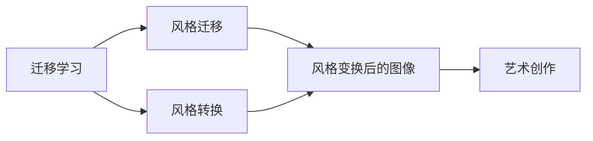
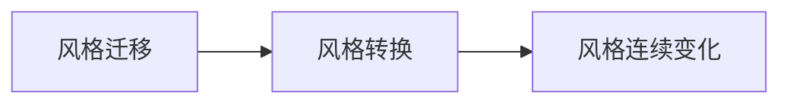

                 

# 一切皆是映射：深度学习在艺术设计中的应用

> 关键词：深度学习,艺术设计,图像生成,风格迁移,风格转换,艺术创作

## 1. 背景介绍

### 1.1 问题由来
近年来，随着深度学习技术的飞速发展，其应用领域已经从传统的计算机视觉、自然语言处理扩展到了艺术设计、音乐创作等更具创意的领域。这些领域的创作，过去往往依赖于人类创意和经验积累，难以被机器理解和模仿。但随着深度学习的进步，特别是生成对抗网络（GAN）和变分自编码器（VAE）等技术的发展，使得机器能够自动生成具有高度艺术性的作品，极大地拓展了艺术设计的边界。

在艺术设计领域，深度学习的应用主要集中在图像生成、风格迁移、风格转换、艺术创作等方面。这些应用不仅能节省大量人力物力，还能在一定程度上激发新的艺术形式和设计风格，为传统艺术设计带来新的突破。

### 1.2 问题核心关键点
深度学习在艺术设计中的应用，主要依赖于生成模型和迁移学习两种技术。生成模型如GAN和VAE，能够通过学习大规模数据，生成高质量的图像和音频作品。迁移学习则通过将预训练模型迁移到新的任务上，实现图像样式的转换、艺术风格的创作等。

这些技术的应用，为艺术设计带来了新的工具和方法。例如，GAN可以自动生成新的图像，VAE可以重构和生成图像，风格迁移则可以将不同风格的图像进行变换，风格转换则可以实现图像风格的连续变化。这些工具和方法，使得艺术设计师能够更容易地进行创作和实验，探索新的设计风格和表达方式。

### 1.3 问题研究意义
研究深度学习在艺术设计中的应用，对于拓展机器的艺术创作能力，激发艺术设计的创新性，具有重要意义：

1. 提升创作效率。深度学习自动生成图像和音频，可以节省大量创作时间，让设计师能够将更多精力放在创意和表达上。
2. 探索新风格。通过深度学习，设计师可以探索新的艺术风格和表达形式，突破传统艺术设计的局限。
3. 降低成本投入。深度学习技术可以自动生成高质量作品，减少了制作和材料成本。
4. 拓宽设计视野。深度学习技术为设计师提供了新的工具和方法，拓宽了他们的设计视野和创作思路。

总之，深度学习在艺术设计中的应用，不仅可以提升创作的效率和质量，还能推动艺术设计的创新和发展，为艺术设计的未来带来更多的可能。

## 2. 核心概念与联系

### 2.1 核心概念概述

为更好地理解深度学习在艺术设计中的应用，本节将介绍几个关键概念及其关系：

- 生成对抗网络（GAN）：一种由生成器和判别器组成的深度学习模型，能够生成高质量的图像和音频。GAN通过对抗训练，不断提升生成器的生成能力，使生成的作品逼真度越来越高。
- 变分自编码器（VAE）：一种基于变分推断的生成模型，能够学习数据的隐含表示，并实现数据的重构和生成。VAE通过编码器和解码器的联合训练，生成与真实数据相似的新数据。
- 迁移学习：将预训练模型的知识迁移到新的任务上，实现风格的迁移和转换。深度学习模型的迁移能力，使得迁移学习成为艺术设计中常用的技术。
- 风格迁移（Style Transfer）：将一张图像的风格迁移到另一张图像上，实现图像风格的转换。风格迁移的典型应用包括将复古照片变为卡通风格，或将自然风景转为印象派风格等。
- 风格转换（Style Conversion）：通过深度学习模型，实现图像风格的连续变化，如图像风格的过渡。风格转换可以用于视频和动画的特效制作，提高作品的视觉效果。
- 艺术创作（Artistic Creation）：通过深度学习技术，生成具有一定艺术性和创造性的作品，如生成新的画作、音乐等。

这些核心概念之间的逻辑关系可以通过以下Mermaid流程图来展示：

```mermaid
graph TB
    A[生成对抗网络(GAN)] --> B[变分自编码器(VAE)]
    A --> C[风格迁移]
    A --> D[风格转换]
    B --> E[艺术创作]
    C --> F
    D --> G
    E --> H
```

这个流程图展示了大语言模型的核心概念及其之间的关系：

1. 生成对抗网络（GAN）和变分自编码器（VAE）是基础生成模型，可以生成高质量的图像和音频。
2. 风格迁移和风格转换是迁移学习技术，可以将图像风格进行变换和连续变化。
3. 艺术创作是基于生成和迁移学习技术的高级应用，能够生成具有一定艺术性的作品。

这些概念共同构成了深度学习在艺术设计中的基本框架，为设计师提供了丰富的工具和方法。

### 2.2 概念间的关系

这些核心概念之间存在着紧密的联系，形成了深度学习在艺术设计中的应用生态系统。下面通过几个Mermaid流程图来展示这些概念之间的关系。

#### 2.2.1 生成模型与艺术创作的关系

```mermaid
graph TB
    A[生成对抗网络(GAN)] --> B[艺术创作]
    A --> C[变分自编码器(VAE)]
    B --> D[高质量图像]
    C --> D
```

这个流程图展示了生成对抗网络（GAN）和变分自编码器（VAE）如何为艺术创作提供高质量的素材，从而提升了创作的效率和质量。

#### 2.2.2 迁移学习与艺术创作的关系



这个流程图展示了迁移学习技术如何通过风格迁移和风格转换，为艺术创作提供了更多样化的表达方式，丰富了创作的风格和形式。

#### 2.2.3 风格迁移与风格转换的联系



这个流程图展示了风格迁移和风格转换的联系，风格迁移可以视为风格转换的一种特例，即从一个具体的风格到另一个具体的风格，而风格转换则可以实现风格的连续变化。

### 2.3 核心概念的整体架构

最后，我们用一个综合的流程图来展示这些核心概念在大语言模型微调过程中的整体架构：

```mermaid
graph TB
    A[大规模文本数据] --> B[预训练]
    B --> C[生成对抗网络(GAN)]
    C --> D[风格迁移]
    C --> E[风格转换]
    D --> F[艺术创作]
    E --> F
    F --> G[高质量艺术作品]
```

这个综合流程图展示了从预训练到艺术创作的全过程。深度学习模型首先在文本数据上进行预训练，然后通过生成对抗网络（GAN）和变分自编码器（VAE）等生成模型，生成高质量的图像和音频素材。接着，通过迁移学习技术，将风格进行迁移和转换，丰富了创作的形式。最终，通过艺术创作技术，生成具有一定艺术性的作品。通过这些流程，深度学习技术在艺术设计中的应用得以完整展现。

## 3. 核心算法原理 & 具体操作步骤
### 3.1 算法原理概述

深度学习在艺术设计中的应用，主要依赖于生成对抗网络（GAN）和变分自编码器（VAE）等生成模型，以及迁移学习技术。这些技术能够自动生成高质量的图像和音频，实现风格的迁移和转换，从而极大地拓展了艺术设计的边界。

GAN的原理是通过一个生成器和一个判别器进行对抗训练，生成器和判别器相互博弈，生成器不断优化生成的图像，使其能够欺骗判别器，而判别器则不断提升鉴别能力，以区分生成图像和真实图像。最终，生成器生成的图像逼真度越来越高，甚至可以以假乱真。

VAE的原理是通过编码器将输入图像映射到低维隐含空间，通过解码器将隐含空间映射回高维图像空间，从而实现图像的重构和生成。VAE的核心在于学习数据的隐含表示，能够生成与真实数据相似的新数据。

迁移学习的核心在于将预训练模型的知识迁移到新的任务上，实现风格的迁移和转换。迁移学习可以有效地利用大规模数据训练的预训练模型，在新任务上只需少量数据即可取得良好的效果。

### 3.2 算法步骤详解

#### 3.2.1 生成对抗网络（GAN）

GAN的训练过程包括两个主要部分：生成器和判别器的训练。

**生成器的训练**：
1. 生成器接收随机噪声向量 $z$，将其映射为图像 $G(z)$。
2. 判别器判断 $G(z)$ 是否为真实图像。
3. 计算判别器的损失函数，并反向传播更新判别器参数。
4. 计算生成器的损失函数，并反向传播更新生成器参数。

**判别器的训练**：
1. 生成器生成假图像，判别器判断 $G(z)$ 是否为真实图像。
2. 计算判别器的损失函数，并反向传播更新判别器参数。
3. 计算生成器的损失函数，并反向传播更新生成器参数。

**生成器和判别器的交替训练**：
1. 交替更新生成器和判别器的参数。
2. 逐步提高生成器的生成质量，最终生成逼真度极高的图像。

GAN的训练过程可以通过以下伪代码来描述：

```python
for epoch in range(N_epochs):
    for i in range(N_steps):
        # 生成器的训练
        z = GAN.sample_z()  # 生成随机噪声向量
        fake_images = GAN.G(z)  # 生成假图像
        real_images = get_real_images()  # 获取真实图像
        real_loss = GAN.discriminator.real_loss(fake_images, real_images)  # 计算判别器的真实图像损失
        fake_loss = GAN.discriminator.fake_loss(fake_images, real_images)  # 计算判别器的假图像损失
        GAN.G_loss = real_loss + fake_loss  # 计算生成器的损失
        GAN.G.update_weights(GAN.G_loss)  # 更新生成器参数
        
        # 判别器的训练
        real_images = get_real_images()  # 获取真实图像
        fake_images = GAN.G(z)  # 生成假图像
        real_loss = GAN.discriminator.real_loss(real_images, fake_images)  # 计算判别器的真实图像损失
        fake_loss = GAN.discriminator.fake_loss(fake_images, real_images)  # 计算判别器的假图像损失
        GAN.D_loss = real_loss + fake_loss  # 计算判别器的损失
        GAN.D.update_weights(GAN.D_loss)  # 更新判别器参数
        
    epoch_loss = GAN.G_loss + GAN.D_loss  # 计算总损失
    epoch_loss /= N_steps  # 计算平均损失
    GAN.update_weights(epoch_loss)  # 更新模型参数
```

#### 3.2.2 变分自编码器（VAE）

VAE的训练过程包括编码器和解码器的联合训练，以及重构损失和潜在空间损失的计算。

**编码器的训练**：
1. 将输入图像 $x$ 映射到低维隐含空间 $z$。
2. 计算编码器的重构损失，并反向传播更新编码器参数。

**解码器的训练**：
1. 将隐含空间 $z$ 映射回高维图像空间 $x'$。
2. 计算解码器的重构损失，并反向传播更新解码器参数。

**重构损失的计算**：
1. 计算重构损失 $L_{rec}$，即 $L_{rec} = \|x - x'\|^2$。
2. 计算潜在空间损失 $L_{kld}$，即 $L_{kld} = -0.5 \sum_{i=1}^n(z_i^2 - \sigma_i^2 - \log\sigma_i)$，其中 $z_i$ 是隐含空间中的第 $i$ 个维度，$\sigma_i$ 是第 $i$ 个维度的标准差。

**VAE的训练过程**：
1. 交替更新编码器和解码器的参数。
2. 逐步提高重构质量和潜在空间的多样性。

VAE的训练过程可以通过以下伪代码来描述：

```python
for epoch in range(N_epochs):
    for i in range(N_steps):
        # 编码器的训练
        x = get_images()  # 获取图像
        z = VAE.encoder(x)  # 将图像映射到隐含空间
        x_hat = VAE.decoder(z)  # 将隐含空间映射回图像
        rec_loss = VAE.loss_rec(x_hat, x)  # 计算重构损失
        kld_loss = VAE.loss_kld(z)  # 计算潜在空间损失
        VAE.total_loss = rec_loss + kld_loss  # 计算总损失
        VAE.encoder.update_weights(VAE.total_loss)  # 更新编码器参数
        
        # 解码器的训练
        z = get_z()  # 获取隐含空间向量
        x_hat = VAE.decoder(z)  # 将隐含空间映射回图像
        rec_loss = VAE.loss_rec(x_hat, x)  # 计算重构损失
        kld_loss = VAE.loss_kld(z)  # 计算潜在空间损失
        VAE.total_loss = rec_loss + kld_loss  # 计算总损失
        VAE.decoder.update_weights(VAE.total_loss)  # 更新解码器参数
        
    epoch_loss = VAE.total_loss  # 计算平均损失
    VAE.update_weights(epoch_loss)  # 更新模型参数
```

#### 3.2.3 迁移学习

迁移学习的核心在于将预训练模型的知识迁移到新的任务上。迁移学习的一般流程包括：

1. 收集新任务的标注数据 $D_{task}$。
2. 将预训练模型的权重 $w_{pretrain}$ 作为初始化参数，对新任务的模型进行微调。
3. 在新任务的标注数据上训练微调后的模型，优化新任务的参数 $w_{task}$。
4. 在新任务上评估微调后的模型，进行必要的调整。

迁移学习的训练过程可以通过以下伪代码来描述：

```python
# 收集新任务的标注数据
D_task = collect_data()

# 初始化模型参数
w_pretrain = load_pretrained_model()  # 加载预训练模型的权重

# 微调模型
w_task = fine_tune_model(D_task, w_pretrain)  # 在新任务上微调模型

# 在新任务上训练模型
model = train_model(D_task, w_task)  # 在新任务上训练模型

# 在新任务上评估模型
evaluation_result = evaluate_model(D_task, model)  # 在新任务上评估模型

# 调整模型参数
model.update_weights(evaluation_result)  # 调整模型参数
```

### 3.3 算法优缺点

深度学习在艺术设计中的应用具有以下优点：

1. 高效生成：深度学习模型能够自动生成高质量的图像和音频，极大地提升了创作效率。
2. 丰富创意：深度学习模型可以生成多种风格和形式的图像，拓展了艺术设计的表达空间。
3. 技术支持：深度学习技术为艺术设计提供了新的工具和方法，推动了设计思维的创新。

同时，这些技术也存在一些缺点：

1. 依赖数据：深度学习模型需要大量标注数据进行训练，数据获取和处理成本较高。
2. 计算量大：深度学习模型需要大量的计算资源进行训练和推理，设备要求较高。
3. 模型复杂：深度学习模型结构复杂，难以理解和调试，需要较高的技术门槛。

尽管存在这些缺点，但随着技术的不断进步和应用的广泛推广，深度学习在艺术设计中的应用将逐渐成熟，进一步拓展艺术设计的边界和可能性。

### 3.4 算法应用领域

深度学习在艺术设计中的应用，已经在图像生成、风格迁移、风格转换、艺术创作等多个领域取得了显著成果。以下是一些典型的应用场景：

#### 3.4.1 图像生成

图像生成是深度学习在艺术设计中最直接的应用之一。GAN和VAE等生成模型，通过学习大规模数据，可以生成高质量的图像和视频素材，极大地提升了设计创作的效率和质量。

**案例分析**：
- GAN可以生成逼真的名人肖像、自然风景、抽象艺术等，用于商业广告、影视特效等领域。
- VAE可以重构和生成自然图像，生成具有一定艺术性和创意的图像，用于艺术作品展示、设计灵感启迪等领域。

#### 3.4.2 风格迁移

风格迁移可以将一种图像的风格迁移到另一种图像上，实现图像风格的转换。风格迁移技术广泛应用于图片处理、视频特效等领域。

**案例分析**：
- 将复古照片变为卡通风格，增强视觉效果，用于社交媒体、影视作品等。
- 将自然风景转为印象派风格，提升艺术美感，用于广告宣传、文化艺术展示等领域。

#### 3.4.3 风格转换

风格转换可以通过深度学习模型，实现图像风格的连续变化，如图像风格的过渡。风格转换技术在视频特效、动画制作等领域有广泛应用。

**案例分析**：
- 将动画角色从一个风格逐渐过渡到另一个风格，增强视觉效果，用于动画电影、游戏等领域。
- 将连续的图像从一个风格逐渐过渡到另一个风格，实现动态变换，用于视频特效、动画制作等领域。

#### 3.4.4 艺术创作

艺术创作是深度学习在艺术设计中最具创意的应用之一。通过深度学习技术，可以生成具有一定艺术性和创造性的作品，如画作、音乐等。

**案例分析**：
- 生成新的画作，融合多种风格和形式，用于艺术展览、文化艺术展示等领域。
- 生成新的音乐，融合多种音乐风格，用于音乐创作、影视配乐等领域。

## 4. 数学模型和公式 & 详细讲解  
### 4.1 数学模型构建

本节将使用数学语言对深度学习在艺术设计中的应用进行更加严格的刻画。

记输入图像为 $x \in \mathbb{R}^n$，输出图像为 $x' \in \mathbb{R}^n$。假设生成对抗网络（GAN）由生成器和判别器组成，生成器的参数为 $\theta_G$，判别器的参数为 $\theta_D$。

定义生成器的输出为 $G(x; \theta_G)$，判别器的输出为 $D(G(x; \theta_G); \theta_D)$。则GAN的损失函数为：

$$
L_{GAN} = \mathbb{E}_{x \sim p_x} D(G(x; \theta_G); \theta_D) + \mathbb{E}_{z \sim p_z} [1 - D(G(z; \theta_G); \theta_D)]
$$

其中，$p_x$ 和 $p_z$ 分别表示输入图像和噪声向量的分布，$z \sim p_z$ 表示从噪声向量空间中随机采样噪声向量 $z$。

定义变分自编码器（VAE）的编码器为 $E(x; \theta_E)$，解码器为 $D(z; \theta_D)$，隐含空间的均值和方差分别为 $\mu$ 和 $\sigma^2$。则VAE的损失函数为：

$$
L_{VAE} = L_{rec} + L_{kld}
$$

其中，重构损失 $L_{rec} = \frac{1}{2} \|x - D(E(x; \theta_E); \theta_D)\|^2$，潜在空间损失 $L_{kld} = \frac{1}{2} \sum_{i=1}^n(z_i^2 - \sigma_i^2 - \log\sigma_i)$，$z_i$ 是隐含空间中的第 $i$ 个维度，$\sigma_i$ 是第 $i$ 个维度的标准差。

定义迁移学习中预训练模型的权重为 $w_{pretrain}$，新任务的模型权重为 $w_{task}$。则迁移学习的损失函数为：

$$
L_{task} = \mathbb{E}_{x \sim D_{task}} [L(x, w_{task})] + \lambda \|w_{task} - w_{pretrain}\|
$$

其中，$L(x, w_{task})$ 为在新任务上的损失函数，$\lambda$ 为正则化系数，控制迁移学习中的参数更新比例。

### 4.2 公式推导过程

#### 4.2.1 生成对抗网络（GAN）

生成对抗网络（GAN）的训练过程可以视为生成器和判别器之间的对抗博弈。假设生成器和判别器的损失函数分别为 $L_G$ 和 $L_D$，则GAN的总损失函数为：

$$
L_{GAN} = \mathbb{E}_{x \sim p_x} L_D(G(x); \theta_D) + \mathbb{E}_{z \sim p_z} [1 - L_D(G(z); \theta_D)]
$$

对于生成器，其损失函数 $L_G$ 可以分解为真实图像损失和假图像损失：

$$
L_G = L_{real} + L_{fake}
$$

其中，真实图像损失 $L_{real}$ 为：

$$
L_{real} = \mathbb{E}_{x \sim p_x} \log D(G(x); \theta_D)
$$

假图像损失 $L_{fake}$ 为：

$$
L_{fake} = \mathbb{E}_{z \sim p_z} \log (1 - D(G(z); \theta_D))
$$

对于判别器，其损失函数 $L_D$ 也可以分解为真实图像损失和假图像损失：

$$
L_D = L_{real} + L_{fake}
$$

其中，真实图像损失 $L_{real}$ 为：

$$
L_{real} = \mathbb{E}_{x \sim p_x} \log D(G(x); \theta_D)
$$

假图像损失 $L_{fake}$ 为：

$$
L_{fake} = \mathbb{E}_{z \sim p_z} \log D(G(z); \theta_D)
$$

通过不断更新生成器和判别器的参数，GAN可以生成逼真度极高的图像。

#### 4.2.2 变分自编码器（VAE）

变分自编码器（VAE）的训练过程包括编码器和解码器的联合训练，以及重构损失和潜在空间损失的计算。假设编码器的输出为 $E(x; \theta_E)$，解码器的输出为 $D(z; \theta_D)$，隐含空间的均值和方差分别为 $\mu$ 和 $\sigma^2$。则VAE的损失函数为：

$$
L_{VAE} = L_{rec} + L_{kld}
$$

其中，重构损失 $L_{rec}$ 为：

$$
L_{rec} = \frac{1}{2} \mathbb{E}_{x \sim p_x} \|x - D(E(x); \theta_D)\|^2
$$

潜在空间损失 $L_{kld}$ 为：

$$
L_{kld} = -\mathbb{E}_{z \sim p_z} \log N(\mu, \sigma^2)
$$

通过不断更新编码器和解码器的参数，VAE可以生成与真实数据相似的新数据。

#### 4.2.3 迁移学习

迁移学习的核心在于将预训练模型的知识迁移到新的任务上。假设预训练模型的权重为 $w_{pretrain}$，新任务的模型权重为 $w_{task}$。则迁移学习的损失函数为：

$$
L_{task} = \mathbb{E}_{x \sim D_{task}} [L(x, w_{task})] + \lambda \|w_{task} - w_{pretrain}\|
$$

其中，$L(x, w_{task})$ 为在新任务上的损失函数，$\lambda$ 为正则化系数，控制迁移学习中的参数更新比例。通过不断更新新任务的模型参数，迁移学习可以实现风格的迁移和转换。

### 4.3 案例分析与讲解

**案例1：图像生成**

通过GAN和VAE等生成模型，可以自动生成高质量的图像和音频素材，提升艺术设计的效率和质量。以下是一个GAN生成名人肖像的案例：

1. 收集名人肖像的高质量图片数据集。
2. 使用GAN模型进行训练，生成名人肖像的逼真图像。
3. 将生成的图像应用于广告宣传、影视特效等领域。

**案例2：风格迁移**

通过风格迁移技术，可以将一种图像的风格迁移到另一种图像上，实现图像风格的转换。以下是一个风格迁移的案例：

1. 收集自然风景的高质量图片数据集。
2. 使用风格迁移模型，将自然风景图片变为印象派风格。
3. 将转换后的图片应用于文化艺术展示、广告宣传等领域。

**案例3：艺术创作**

通过深度学习技术，可以生成具有一定艺术性和创造性的作品，如画作、音乐等。以下是一个艺术创作的案例：

1. 收集各种风格和形式的画作数据集。
2. 使用VAE等模型，生成具有一定艺术性的新画作。
3. 将生成的画作应用于艺术展览、文化艺术展示等领域。

## 5. 项目实践：代码实例和详细解释说明
### 5.1 开发环境搭建

在进行深度学习在艺术设计中的应用实践前，我们需要准备好开发环境。以下是使用Python进行PyTorch开发的环境配置流程：

1. 安装Anaconda：从官网下载并安装Anaconda，用于创建独立的Python环境。

2. 创建并激活虚拟环境：
```bash
conda create -n pytorch-env python=3.8 
conda activate pytorch-env
```

3. 安装PyTorch：根据CUDA版本，从官网获取对应的安装命令。例如：
```bash
conda install pytorch torchvision torchaudio cudatoolkit=11.1

