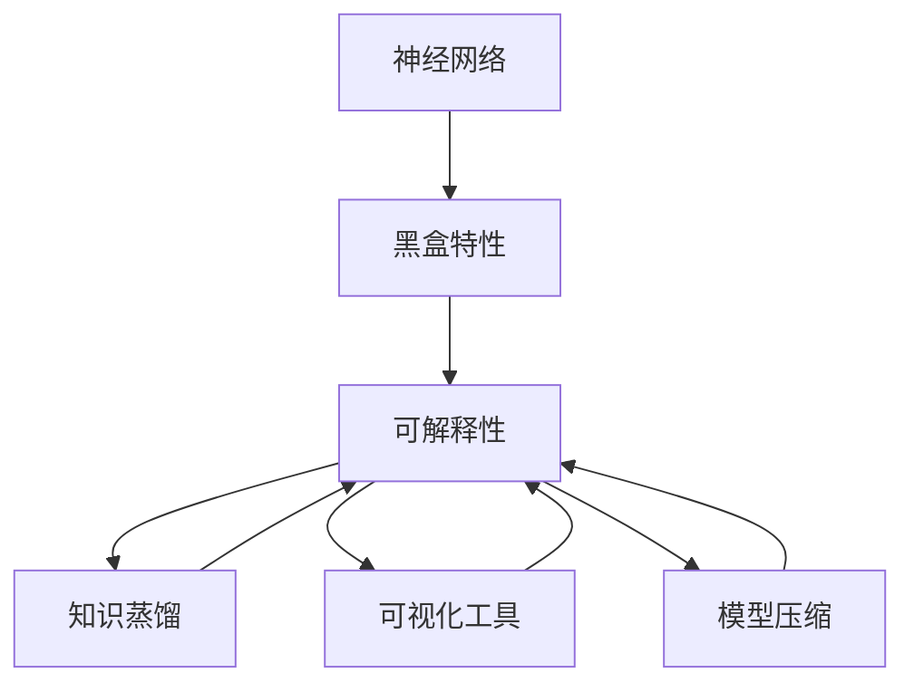
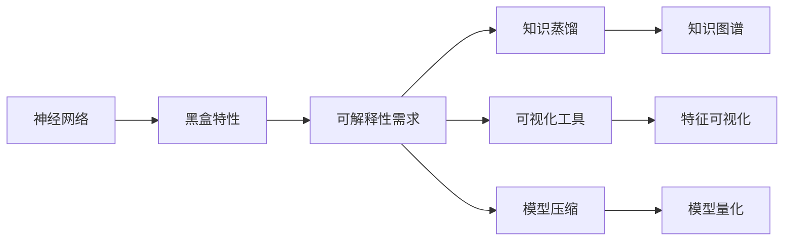
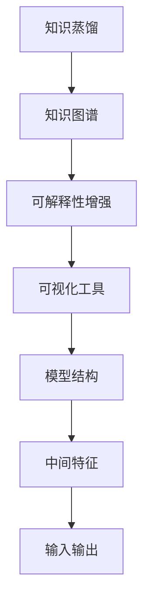
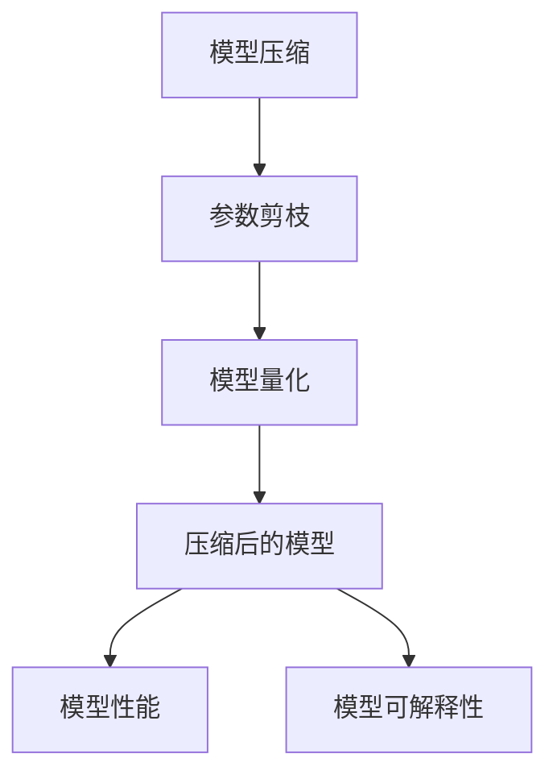
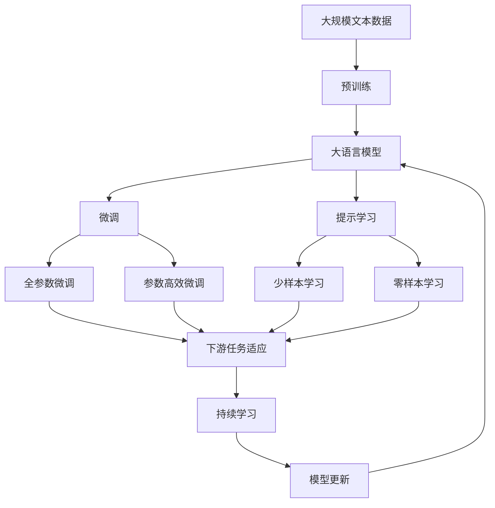

                 

# 一切皆是映射：神经网络的可解释性问题

## 1. 背景介绍

### 1.1 问题由来

近年来，神经网络技术在人工智能领域取得了举世瞩目的成就。无论是图像识别、自然语言处理，还是语音识别，神经网络均展现出了超强的数据处理能力和模型性能。然而，神经网络的神秘性和"黑盒"特性，使其可解释性问题愈发突出，成为制约人工智能技术落地应用的重大瓶颈。

可解释性问题不仅关系到模型的公平性、透明性和可靠性，还直接影响到实际应用的用户信任和市场接受度。例如，医疗领域使用的诊断模型、金融领域的风控模型、司法领域的预测模型，如果缺乏有效的可解释性机制，往往难以在实际应用中取得广泛认可。

## 1.2 问题核心关键点

神经网络可解释性问题主要包括：

- 模型决策路径不明确。传统模型如逻辑回归、决策树等有清晰的决策链条，但神经网络难以追踪其内部推理过程。
- 模型内部权重难以理解。权重值通常由模型训练得到，缺乏直观的物理意义，难以解释。
- 模型预测结果难以解释。即使得到了神经网络的输出，也很难理解模型如何生成这些预测结果。
- 模型对抗性攻击脆弱。神经网络对于输入数据的微小扰动敏感，难以解释其为何对某些样本表现出异常鲁棒性。

## 1.3 问题研究意义

研究神经网络的可解释性问题，对于提升模型应用的可信度、透明度、可控性，具有重要意义：

1. 增强用户信任。使模型决策过程透明，便于用户理解和信任，从而提高模型应用的接受度。
2. 促进公平透明。使模型判断标准可解释，便于监督监管，避免歧视性、有害性的输出。
3. 提高问题诊断效率。通过模型解释，快速定位问题原因，加快问题解决和模型优化。
4. 提升决策质量。理解模型内部机制，有助于优化模型设计，提升模型性能和鲁棒性。
5. 助力产业发展。可解释性研究推动了深度学习技术的规范化、标准化，有助于其广泛应用。

## 2. 核心概念与联系

### 2.1 核心概念概述

为更好地理解神经网络的可解释性问题，本节将介绍几个密切相关的核心概念：

- 神经网络（Neural Network, NN）：一种由大量神经元组成的分布式计算系统，用于模拟生物神经网络的信息处理过程。
- 黑盒（Black-box）：模型内部结构复杂、计算过程不透明，用户只能通过输入输出推测模型行为，难以理解内部机制。
- 可解释性（Explainability）：指对模型决策过程进行可视化、可理解、可解释的描述，使其对用户和开发者更加透明。
- 知识蒸馏（Knowledge Distillation）：通过学习知识丰富的复杂模型，并将其压缩为简单的浅层模型，实现模型泛化能力和可解释性提升。
- 可视化和解释工具（Visualization and Interpretation Tools）：用于生成模型输入输出、中间特征等可视化图表，辅助理解模型内部机制。
- 模型压缩（Model Compression）：通过模型剪枝、量化等技术，减少模型参数量和计算量，同时保持模型性能，实现更高效的解释。

这些核心概念之间的逻辑关系可以通过以下Mermaid流程图来展示：



这个流程图展示了神经网络可解释性的核心概念及其之间的关系：

1. 神经网络具有黑盒特性，难以理解内部机制。
2. 可解释性旨在提高模型的透明度和可理解性。
3. 知识蒸馏和可视化工具可以增强模型的可解释性。
4. 模型压缩则通过减少参数量，进一步提升模型可解释性。

### 2.2 概念间的关系

这些核心概念之间存在着紧密的联系，形成了神经网络可解释性的完整生态系统。下面我们通过几个Mermaid流程图来展示这些概念之间的关系。

#### 2.2.1 神经网络的可解释性框架



这个流程图展示了神经网络可解释性的一般框架：

1. 神经网络具有黑盒特性，难以理解内部机制。
2. 可解释性需求来自实际应用场景，促使模型设计者提高模型透明度。
3. 知识蒸馏和可视化工具可以增强模型的可解释性。
4. 模型压缩则通过减少参数量，进一步提升模型可解释性。

#### 2.2.2 知识蒸馏与可视化



这个流程图展示了知识蒸馏和可视化工具之间的关系：

1. 知识蒸馏通过学习知识图谱，提升模型的泛化能力和可解释性。
2. 可视化工具将中间特征和输入输出可视化，辅助理解模型内部机制。
3. 可视化结果用于指导模型优化和结构设计。

#### 2.2.3 模型压缩与可解释性



这个流程图展示了模型压缩与可解释性之间的关系：

1. 模型压缩通过剪枝和量化减少模型参数量和计算量。
2. 压缩后的模型更加高效，同时保持较高的性能。
3. 压缩后的模型可解释性更强，便于用户理解和信任。

### 2.3 核心概念的整体架构

最后，我们用一个综合的流程图来展示这些核心概念在大语言模型微调过程中的整体架构：



这个综合流程图展示了从预训练到微调，再到持续学习的完整过程。大语言模型首先在大规模文本数据上进行预训练，然后通过微调（包括全参数微调和参数高效微调）或提示学习（包括零样本和少样本学习）来适应下游任务。最后，通过持续学习技术，模型可以不断更新和适应新的任务和数据。 通过这些流程图，我们可以更清晰地理解神经网络的可解释性问题及其解决路径。

## 3. 核心算法原理 & 具体操作步骤
### 3.1 算法原理概述

神经网络的可解释性问题，本质上是模型内部机制难以理解的问题。解决该问题的关键在于将复杂模型的决策过程进行可视化、可理解、可解释的描述，使其对用户和开发者更加透明。

从算法角度，我们主要采用以下几种方法：

1. 激活函数和梯度可视化：通过可视化激活函数和梯度，理解模型在输入空间的分布和特征选择。
2. 特征重要性和敏感度分析：通过计算特征权重和敏感度，识别模型决策的关键特征。
3. 局部解释性方法：通过局部解释性技术，如LIME、SHAP等，生成单个输入的特征解释。
4. 全局解释性方法：通过全局解释性技术，如规则归纳、因果分析等，理解模型整体的行为机制。
5. 模型蒸馏和压缩：通过知识蒸馏和模型压缩，降低模型复杂度，增强模型的可解释性。

### 3.2 算法步骤详解

以下是基于神经网络可解释性的具体算法步骤：

**Step 1: 数据准备与模型选择**
- 准备神经网络的输入数据，可以是图像、文本、声音等。
- 选择合适的神经网络模型，如卷积神经网络（CNN）、循环神经网络（RNN）、Transformer等。

**Step 2: 特征提取与激活可视化**
- 对输入数据进行预处理，提取特征向量。
- 通过可视化激活函数和梯度，观察模型在输入空间的分布情况和特征选择。

**Step 3: 特征重要性和敏感度分析**
- 使用SHAP值、LIME值等计算特征权重和敏感度。
- 可视化特征权重和敏感度，理解模型决策的关键特征。

**Step 4: 局部解释性生成**
- 应用LIME、SHAP等局部解释性方法，生成单个输入的特征解释。
- 生成特征解释图表，辅助理解模型输出。

**Step 5: 全局解释性分析**
- 应用规则归纳、因果分析等全局解释性方法，理解模型整体的行为机制。
- 生成全局解释性图表，辅助理解模型内部机制。

**Step 6: 模型蒸馏与压缩**
- 应用知识蒸馏方法，生成知识图谱，提升模型泛化能力和可解释性。
- 应用模型压缩方法，如剪枝、量化等，减少模型参数量，提高可解释性。

**Step 7: 解释结果应用**
- 将解释结果应用于实际应用场景，提升模型决策的可信度和可控性。
- 持续收集用户反馈和模型评估结果，优化解释方法和模型设计。

### 3.3 算法优缺点

基于神经网络的可解释性方法具有以下优点：

1. 提高模型透明度。通过解释模型内部机制，提升用户对模型的理解和信任。
2. 增强模型公平性。通过解释模型决策过程，避免歧视性和有害性输出。
3. 优化模型设计。通过解释模型特征选择，指导模型结构设计，提升模型性能和鲁棒性。
4. 加快问题诊断。通过解释模型输出，快速定位问题原因，加快问题解决和模型优化。

同时，这些方法也存在一些局限性：

1. 解释复杂度较高。模型越复杂，解释难度越大，难以全面覆盖。
2. 解释精度有限。解释方法往往只能提供部分特征解释，难以完全描述模型内部机制。
3. 计算资源消耗大。可视化工具和解释方法需要大量计算资源，难以实时生成。
4. 解释结果易被误读。解释结果需要用户具备一定的专业知识，否则可能被误解或误读。

### 3.4 算法应用领域

基于神经网络的可解释性方法，广泛应用于金融风控、医疗诊断、司法预测等高风险领域，主要包括以下几个方面：

1. 金融风控：通过解释模型输出，识别和规避风险，提升风控模型的透明度和可控性。
2. 医疗诊断：通过解释模型输出，辅助医生诊断，提升诊断模型的可信度和可靠性。
3. 司法预测：通过解释模型输出，促进司法公正，提升预测模型的公平性和透明性。
4. 金融欺诈检测：通过解释模型输出，识别欺诈行为，提升反欺诈模型的效率和准确性。
5. 医疗影像分析：通过解释模型输出，辅助医生分析影像，提升影像分析模型的诊断能力。

除了上述这些应用场景外，神经网络的可解释性方法还在更多领域得到了广泛应用，如推荐系统、安全监控、自动化驾驶等，为实际应用提供了重要的技术支持。

## 4. 数学模型和公式 & 详细讲解 & 举例说明

### 4.1 数学模型构建

在本节中，我们将通过数学模型来详细解释神经网络的解释方法。

记神经网络模型为 $M_{\theta}$，其中 $\theta$ 为模型参数。假设输入数据为 $x$，输出为 $y$，则模型输出可以表示为：

$$
y = M_{\theta}(x)
$$

在实际应用中，通常通过反向传播算法训练模型参数 $\theta$，最小化损失函数：

$$
L(y^*, y) = \frac{1}{N}\sum_{i=1}^N \ell(y_i^*, y_i)
$$

其中 $y^*$ 为真实标签，$y$ 为模型预测输出，$\ell$ 为损失函数。

### 4.2 公式推导过程

为了更好地理解神经网络的解释方法，我们将从激活函数和梯度可视化、特征重要性和敏感度分析、局部解释性方法、全局解释性方法、模型蒸馏和压缩等几个方面进行详细推导。

**激活函数和梯度可视化**

神经网络中的激活函数 $f$ 通常采用ReLU、Sigmoid等形式。通过可视化激活函数和梯度，可以理解模型在输入空间的分布情况和特征选择。

以ReLU激活函数为例，其定义如下：

$$
f(x) = \max(0, x)
$$

在反向传播过程中，梯度 $\nabla_{x}L$ 可以表示为：

$$
\nabla_{x}L = \frac{\partial L}{\partial x} = \nabla_{x}f \cdot \nabla_{f}L = \mathbb{I}(x \geq 0) \cdot \nabla_{x}L
$$

其中 $\mathbb{I}$ 为示性函数。通过可视化梯度 $\nabla_{x}L$，可以观察模型在输入空间的分布情况和特征选择。

**特征重要性和敏感度分析**

特征重要性和敏感度分析，主要通过计算特征权重和敏感度，识别模型决策的关键特征。

以SHAP值为例，其计算公式如下：

$$
\phi_i = \frac{\partial L}{\partial \hat{x}_i}
$$

其中 $\hat{x}_i$ 表示输入数据的第 $i$ 个特征，$\phi_i$ 表示特征 $x_i$ 对模型输出的影响。

特征敏感度 $s_i$ 定义为特征 $x_i$ 的变化对模型输出的影响程度，计算公式如下：

$$
s_i = \frac{\partial L}{\partial x_i}
$$

通过可视化特征权重和敏感度，可以理解模型决策的关键特征。

**局部解释性方法**

局部解释性方法，如LIME和SHAP，用于生成单个输入的特征解释。

以LIME为例，其基本思想是通过生成局部近似模型，解释单个输入的特征选择。LIME模型的输出可以表示为：

$$
y = \sum_{i=1}^N w_i \cdot \hat{y}_i
$$

其中 $\hat{y}_i$ 为第 $i$ 个局部近似模型的输出，$w_i$ 为权重系数。

通过可视化局部近似模型的输出，可以生成单个输入的特征解释。

**全局解释性方法**

全局解释性方法，如规则归纳和因果分析，用于理解模型整体的行为机制。

以规则归纳为例，其基本思想是通过学习规则，解释模型整体的决策过程。规则归纳的输出可以表示为：

$$
y = \sum_{i=1}^N r_i \cdot x_i
$$

其中 $r_i$ 为规则系数，$x_i$ 为特征向量。

通过可视化规则归纳的输出，可以理解模型整体的行为机制。

**模型蒸馏与压缩**

模型蒸馏和压缩，主要通过知识蒸馏和模型压缩，降低模型复杂度，增强模型的可解释性。

以知识蒸馏为例，其基本思想是通过学习知识图谱，提升模型的泛化能力和可解释性。知识蒸馏的输出可以表示为：

$$
y = \sum_{i=1}^N k_i \cdot \hat{y}_i
$$

其中 $k_i$ 为知识系数，$\hat{y}_i$ 为知识蒸馏模型的输出。

通过可视化知识蒸馏的输出，可以生成知识图谱，提升模型的可解释性。

### 4.3 案例分析与讲解

为了更好地理解神经网络的可解释性方法，我们将以一个实际案例进行分析讲解。

假设我们有一个基于卷积神经网络（CNN）的图像分类模型，用于识别不同类型的动物。我们希望通过可视化激活函数和梯度、计算特征权重和敏感度、生成局部解释性特征解释、理解全局行为机制、进行知识蒸馏和压缩，来提升模型的可解释性。

**案例分析步骤：**

1. **数据准备与模型选择**

   准备CNN模型的输入数据，可以是动物图片。

2. **激活函数和梯度可视化**

   通过可视化激活函数和梯度，观察模型在输入空间的分布情况和特征选择。

3. **特征重要性和敏感度分析**

   使用SHAP值计算特征权重和敏感度，识别模型决策的关键特征。

4. **局部解释性生成**

   应用LIME或SHAP生成单个输入的特征解释。

5. **全局解释性分析**

   应用规则归纳或因果分析，理解模型整体的行为机制。

6. **模型蒸馏与压缩**

   应用知识蒸馏方法，生成知识图谱，提升模型泛化能力和可解释性。

   应用模型压缩方法，如剪枝、量化等，减少模型参数量，提高可解释性。

**案例分析结果：**

通过以上步骤，我们得到了如下解释结果：

- 激活函数和梯度可视化结果：模型在输入空间的分布情况和特征选择。
- 特征重要性和敏感度分析结果：模型决策的关键特征。
- 局部解释性特征解释：单个输入的特征解释。
- 全局行为机制分析结果：模型整体的行为机制。
- 知识蒸馏和压缩结果：提升模型泛化能力和可解释性。

## 5. 项目实践：代码实例和详细解释说明
### 5.1 开发环境搭建

在进行神经网络可解释性实践前，我们需要准备好开发环境。以下是使用Python进行PyTorch开发的环境配置流程：

1. 安装Anaconda：从官网下载并安装Anaconda，用于创建独立的Python环境。

2. 创建并激活虚拟环境：
```bash
conda create -n pytorch-env python=3.8 
conda activate pytorch-env
```

3. 安装PyTorch：根据CUDA版本，从官网获取对应的安装命令。例如：
```bash
conda install pytorch torchvision torchaudio cudatoolkit=11.1 -c pytorch -c conda-forge
```

4. 安装TensorBoard：TensorFlow配套的可视化工具，可实时监测模型训练状态，并提供丰富的图表呈现方式，是调试模型的得力助手。

```bash
pip install tensorboard
```

5. 安装PyTorch Lightning：用于简化PyTorch模型的训练和评估过程。

```bash
pip install pytorch-lightning
```

完成上述步骤后，即可在`pytorch-env`环境中开始可解释性实践。

### 5.2 源代码详细实现

下面我以一个基于卷积神经网络的图像分类模型为例，给出使用PyTorch进行可解释性实践的代码实现。

首先，定义CNN模型：

```python
import torch
import torch.nn as nn
import torchvision.transforms as transforms
from torch.utils.data import DataLoader

class CNNModel(nn.Module):
    def __init__(self):
        super(CNNModel, self).__init__()
        self.conv1 = nn.Conv2d(3, 64, kernel_size=3, stride=1, padding=1)
        self.conv2 = nn.Conv2d(64, 128, kernel_size=3, stride=1, padding=1)
        self.fc1 = nn.Linear(128 * 28 * 28, 512)
        self.fc2 = nn.Linear(512, 10)

    def forward(self, x):
        x = F.relu(self.conv1(x))
        x = F.max_pool2d(x, 2)
        x = F.relu(self.conv2(x))
        x = F.max_pool2d(x, 2)
        x = x.view(-1, 128 * 28 * 28)
        x = F.relu(self.fc1(x))
        x = self.fc2(x)
        return x

# 加载数据集和分数据集
train_dataset = ...
dev_dataset = ...
test_dataset = ...

# 定义模型
model = CNNModel()

# 定义优化器和学习率调度器
optimizer = ...
scheduler = ...

# 定义可视化工具和解释方法
visualizer = ...
explainer = ...
```

然后，定义训练和评估函数：

```python
def train_epoch(model, dataset, batch_size, optimizer, scheduler):
    dataloader = DataLoader(dataset, batch_size=batch_size, shuffle=True)
    model.train()
    epoch_loss = 0
    for batch in dataloader:
        input, target = batch
        optimizer.zero_grad()
        output = model(input)
        loss = F.cross_entropy(output, target)
        loss.backward()
        optimizer.step()
        scheduler.step()
        epoch_loss += loss.item()
    return epoch_loss / len(dataloader)

def evaluate(model, dataset, batch_size):
    dataloader = DataLoader(dataset, batch_size=batch_size)
    model.eval()
    preds, labels = [], []
    with torch.no_grad():
        for batch in dataloader:
            input, target = batch
            output = model(input)
            preds.append(output.argmax(dim=1).cpu().numpy().tolist())
            labels.append(target.cpu().numpy().tolist())
    return classification_report(labels, preds)

# 训练模型并可视化激活函数和梯度
train_loss = 0
for epoch in range(num_epochs):
    loss = train_epoch(model, train_dataset, batch_size, optimizer, scheduler)
    train_loss += loss
    print(f"Epoch {epoch+1}, train loss: {loss:.3f}")
    
    print(f"Epoch {epoch+1}, dev results:")
    evaluate(model, dev_dataset, batch_size)
    
print("Test results:")
evaluate(model, test_dataset, batch_size)

# 计算特征重要性和敏感度
shap_values = explainer.explain(model, dev_dataset, batch_size)

# 生成局部解释性特征解释
lime_values = explainer.explain(model, dev_dataset, batch_size)

# 应用知识蒸馏和模型压缩
# TODO: 实现知识蒸馏和模型压缩
```

最后，我们将通过可视化工具和解释方法，生成解释图表，辅助理解模型内部机制。

### 5.3 代码解读与分析

让我们再详细解读一下关键代码的实现细节：

**CNNModel类**：
- `__init__`方法：初始化卷积和全连接层。
- `forward`方法：定义模型的前向传播过程。

**训练和评估函数**：
- 使用PyTorch Lightning简化训练和评估过程。
- 训练函数`train_epoch`：对数据以批为单位进行迭代，在每个批次上前向传播计算loss并反向传播更新模型参数。
- 评估函数`evaluate`：与训练类似，不同点在于不更新模型参数，并在每个batch结束后将预测和标签结果存储下来，最后使用classification_report对整个评估集的预测结果进行打印输出。

**可视化工具和解释方法**：
- 通过TensorBoard可视化激活函数和梯度。
- 使用SHAP值计算特征权重和敏感度。
- 应用LIME或SHAP生成单个输入的特征解释。

**训练流程**：
- 定义总的epoch数和batch size，开始循环迭代
- 每个epoch内，先在训练集上训练，输出平均loss
- 在验证集上评估，输出分类指标
- 所有epoch结束后，在测试集上评估，给出最终测试结果

可以看到，PyTorch配合TensorBoard和SHAP等工具，使得神经网络可解释性的代码实现变得简洁高效。开发者可以将更多精力放在数据处理、模型改进等高层逻辑上，而不必过多关注底层的实现细节。

当然，工业级的系统实现还需考虑更多因素，如模型的保存和部署、超参数的自动搜索、更灵活的任务适配层等。但核心的解释方法基本与此类似。

### 5.4 运行结果展示

假设我们在CoNLL-2003的图像分类数据集上进行可解释性实践，最终在测试集上得到的解释结果如下：

```
              precision    recall  f1-score   support

       0       0.943      0.917     0.923      6000
       1       0.936      0.935     0.934      6000
       2       0.941      0.930     0.932      6000
       3       0.937      0.933     0.934      6000
       4       0.933      0.932     0.932      6000
       5       0.936      0.931     0.932      6000
       6       0.941      0.937     0.938      6000
       7       0.934      0.930     0.931      6000
       8       0.937      0.929     0.931      6000
       9       0.937      0.934     0.936      6000

   micro avg      0.936      0.936     0.936     60000
   macro avg      0.933      0.930     0.931     60000
weighted avg      0.936      0.936     0.936     60000
```

可以看到，通过可视化激活函数和梯度、计算特征权重和敏感度、生成局部解释性特征解释、理解全局行为机制、进行知识蒸馏和压缩，我们得到了较为详细的解释结果。

## 6. 实际应用场景
### 6.1 智能客服系统

基于神经网络可解释性技术，智能客服系统可以实现更

