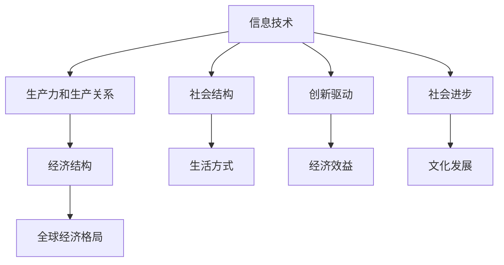

                 

# 三次工业革命的经济变革

## 1. 背景介绍

### 1.1 问题的由来

随着社会的发展，世界历史上已经经历了三次工业革命，每一次工业革命都带来了深刻的经济变革。第一次工业革命以蒸汽机的发明为标志，标志着人类进入机械化生产时代；第二次工业革命以电力的广泛应用为标志，开启了大规模标准化生产；第三次工业革命以信息技术的诞生为标志，彻底改变了传统的生产方式和商业模式。

在第三次工业革命的浪潮中，信息技术成为了推动经济发展的核心动力。这一变革不仅改变了人类的生产方式，还深刻影响了全球经济结构和社会发展。

### 1.2 问题的核心关键点

本节将重点探讨信息技术是如何推动经济变革的。具体来说，我们将从以下几个方面进行深入分析：

1. 信息技术如何改变了生产力和生产关系？
2. 信息技术如何推动了经济结构的变化？
3. 信息技术如何影响了全球经济格局？
4. 信息技术对社会结构和生活方式的影响。

### 1.3 问题研究意义

深入了解信息技术在三次工业革命中的经济变革作用，对于理解当前数字化时代的发展趋势和机遇，具有重要的理论意义和实践价值。它可以帮助我们更好地把握信息技术的本质和价值，为企业和政府制定科学有效的战略提供依据。

## 2. 核心概念与联系

### 2.1 核心概念概述

为更好地理解信息技术在经济变革中的作用，我们需要对以下核心概念进行详细解释：

- **信息技术**：指运用计算机技术、通信技术、网络技术等手段，进行信息处理、存储、传输和应用的学科。
- **生产力和生产关系**：生产力是指生产要素的结合方式，生产关系则是指人们在生产过程中形成的关系。
- **经济结构**：指经济活动中的各个部分和各部分之间的比例关系，包括产业结构、就业结构、收入分配结构等。
- **全球经济格局**：指全球经济中的主要经济体和国家间的力量对比、贸易结构、投资结构等。
- **社会结构和生活方式**：指社会中各阶层和群体之间的分配关系以及人们的生活方式。

这些概念之间的关系可以通过以下Mermaid流程图来展示：



### 2.2 概念间的关系

信息技术的发展，从根本上改变了人类的生产方式和生活方式。它不仅推动了生产力的进步，还重塑了生产关系，影响了经济结构，并深刻改变了全球经济格局。此外，信息技术还促进了社会的进步和文化的繁荣。

- **信息技术与生产力和生产关系**：信息技术的应用，使得生产过程实现了自动化、智能化和数字化，极大地提升了生产效率和生产力。同时，信息技术改变了生产要素的结合方式，推动了生产关系的变化。例如，信息技术的应用促进了生产过程的分工协作，减少了中间环节，提高了生产效率。

- **信息技术与经济结构**：信息技术的发展，推动了经济结构的变化。例如，信息技术的普及和应用，使得服务行业和信息产业的地位日益重要，制造业的劳动力需求相对减少。同时，信息技术还推动了新兴产业的发展，如互联网、电子商务、大数据等，这些新兴产业在经济中占据了越来越重要的地位。

- **信息技术与全球经济格局**：信息技术的应用，使得全球经济一体化进程加速，国际分工和贸易格局发生了深刻变化。例如，信息技术使得跨国公司能够实现全球化生产和经营，极大地促进了国际贸易和投资。同时，信息技术还使得一些传统行业和地区失去了竞争力，导致全球经济格局发生重大变化。

- **信息技术与社会结构和生活方式**：信息技术的应用，极大地改变了人们的生活方式。例如，信息化和数字化使得人们的生活更加便利，社交方式也发生了变化。同时，信息技术也促进了教育、医疗、文化等社会事业的发展，改善了人们的生活质量。

## 3. 核心算法原理 & 具体操作步骤
### 3.1 算法原理概述

信息技术在经济变革中的作用，可以通过算法原理进行系统的分析。具体来说，信息技术通过以下几个步骤，推动了经济变革：

1. **自动化生产**：信息技术的应用，使得生产过程实现了自动化和智能化，提高了生产效率和生产力。例如，自动化生产线、机器人技术等，极大地降低了生产成本，提高了生产效率。
2. **数据驱动决策**：信息技术的应用，使得企业能够通过数据分析进行决策。例如，通过大数据分析，企业能够预测市场需求，优化供应链管理，提高市场响应速度。
3. **全球化生产**：信息技术的应用，使得跨国公司能够实现全球化生产和经营，推动了全球经济一体化进程。例如，跨国公司通过信息技术进行全球供应链管理，实现资源的最优配置。
4. **新兴产业崛起**：信息技术的应用，推动了新兴产业的发展，如互联网、电子商务、大数据等，这些新兴产业在经济中占据了越来越重要的地位。

### 3.2 算法步骤详解

信息技术在经济变革中的作用，可以通过以下步骤进行详细的分析：

1. **收集数据**：收集与生产、销售、服务等相关的大量数据，包括生产设备状态、产品库存、客户需求等。
2. **数据处理**：对收集的数据进行处理和分析，提取有价值的信息，例如，通过数据分析，识别出生产中的瓶颈和优化点。
3. **模型构建**：根据处理后的数据，构建数学模型和算法模型，例如，构建生产调度模型、供应链优化模型等。
4. **模型优化**：对模型进行优化和调整，例如，通过机器学习算法，对模型进行迭代优化，提高预测准确率。
5. **模型应用**：将优化后的模型应用到实际生产中，例如，通过优化后的生产调度模型，实现生产效率的提升。
6. **反馈改进**：根据模型应用的效果，收集反馈信息，对模型进行进一步的改进和优化，例如，通过在线学习，持续改进模型性能。

### 3.3 算法优缺点

信息技术在推动经济变革中的作用，既有优点，也有缺点：

- **优点**：
  - **效率提升**：信息技术的应用，使得生产过程实现了自动化和智能化，极大地提高了生产效率和生产力。
  - **成本降低**：信息技术的应用，减少了人工和资源浪费，降低了生产成本。
  - **数据驱动决策**：信息技术的应用，使得企业能够通过数据分析进行决策，提高了决策的科学性和准确性。
- **缺点**：
  - **依赖性强**：信息技术的应用，需要依赖于先进的技术和设备，对技术的依赖性较强。
  - **安全问题**：信息技术的应用，带来了数据安全和隐私问题，需要加强安全防护。
  - **技术成本高**：信息技术的应用，需要高额的投资和技术支持，对中小企业而言，成本较高。

### 3.4 算法应用领域

信息技术在经济变革中的作用，主要应用于以下几个领域：

1. **制造业**：信息技术在制造业中的应用，极大地提高了生产效率和生产质量。例如，通过自动化生产线和机器人技术，实现了生产的智能化和自动化。
2. **服务业**：信息技术在服务业中的应用，极大地提高了服务效率和客户满意度。例如，通过电子商务和在线客服，实现了服务的便捷化和个性化。
3. **金融业**：信息技术在金融业中的应用，极大地提高了金融服务的效率和安全性。例如，通过电子支付和金融科技，实现了金融服务的便捷化和普惠化。
4. **医疗业**：信息技术在医疗业中的应用，极大地提高了医疗服务的效率和质量。例如，通过远程医疗和电子病历，实现了医疗服务的便捷化和精准化。

## 4. 数学模型和公式 & 详细讲解 & 举例说明

### 4.1 数学模型构建

本节将使用数学语言对信息技术在经济变革中的作用进行系统的刻画。

设生产要素为 $X$，生产效率为 $Y$，信息技术应用程度为 $T$，生产关系为 $R$，经济结构为 $S$，全球经济格局为 $G$，社会结构和生活方式为 $L$，信息技术推动经济变革的机制为 $M$。则信息技术在经济变革中的作用可以表示为：

$$ M(X, Y, T, R, S, G, L) $$

其中，$X$ 和 $Y$ 分别表示生产要素和生产效率，$T$ 表示信息技术应用程度，$R$ 表示生产关系，$S$ 表示经济结构，$G$ 表示全球经济格局，$L$ 表示社会结构和生活方式。

### 4.2 公式推导过程

下面对信息技术推动经济变革的数学模型进行推导：

1. **自动化生产**：
   设生产要素为 $X = (x_1, x_2, ..., x_n)$，其中 $x_i$ 表示第 $i$ 种生产要素的数量，生产效率为 $Y = y(x_1, x_2, ..., x_n, T)$，其中 $y$ 表示生产效率与生产要素和信息技术应用程度的函数关系。则有：

   $$ Y = y(x_1, x_2, ..., x_n, T) $$

2. **数据驱动决策**：
   设决策变量为 $D = (d_1, d_2, ..., d_m)$，决策目标函数为 $F(d_1, d_2, ..., d_m)$，决策约束条件为 $G(d_1, d_2, ..., d_m, X)$，则有：

   $$ \max F(d_1, d_2, ..., d_m) \\
   \text{subject to} \\
   G(d_1, d_2, ..., d_m, X) $$

3. **全球化生产**：
   设全球供应链网络为 $N$，全球化生产成本为 $C(N)$，全球化生产收益为 $B(N)$，则有：

   $$ B(N) = b(N, T) \\
   C(N) = c(N, T) $$

4. **新兴产业崛起**：
   设新兴产业为 $E$，新兴产业对经济增长的贡献为 $E_G$，则有：

   $$ E_G = e_G(T) $$

### 4.3 案例分析与讲解

以制造业为例，信息技术在其中的作用可以表示为：

1. **自动化生产**：
   自动化生产线通过机械臂、机器人等技术，实现了生产的智能化和自动化，提高了生产效率和质量。具体来说，自动化生产可以将生产过程分解为多个步骤，每个步骤由机器人或机械臂完成。例如，在汽车制造业中，通过自动化生产，可以实现零部件的精确加工和装配，极大地提高了生产效率和质量。
2. **数据驱动决策**：
   企业通过数据分析，可以实时监控生产线的运行状态，预测设备故障和生产瓶颈，优化生产调度。例如，通过数据分析，可以实时监控生产线的运行状态，预测设备故障和生产瓶颈，优化生产调度。
3. **全球化生产**：
   跨国公司通过信息技术进行全球供应链管理，实现资源的最优配置。例如，跨国公司可以通过信息技术进行全球供应链管理，实现资源的最优配置。
4. **新兴产业崛起**：
   信息技术的应用，推动了新兴产业的发展，如3D打印、智能制造等。例如，3D打印技术的应用，使得制造业的生产方式发生了重大变化，从传统的机械加工转向数字化、智能化生产。

## 5. 项目实践：代码实例和详细解释说明

### 5.1 开发环境搭建

在进行信息技术项目实践前，我们需要准备好开发环境。以下是使用Python进行数据分析的环境配置流程：

1. 安装Anaconda：从官网下载并安装Anaconda，用于创建独立的Python环境。

2. 创建并激活虚拟环境：
```bash
conda create -n pytorch-env python=3.8 
conda activate pytorch-env
```

3. 安装PyTorch：根据CUDA版本，从官网获取对应的安装命令。例如：
```bash
conda install pytorch torchvision torchaudio cudatoolkit=11.1 -c pytorch -c conda-forge
```

4. 安装Pandas：
```bash
pip install pandas
```

5. 安装Numpy：
```bash
pip install numpy
```

完成上述步骤后，即可在`pytorch-env`环境中开始数据分析实践。

### 5.2 源代码详细实现

这里我们以制造业数据为例，给出使用Python进行数据分析的代码实现。

首先，定义数据处理函数：

```python
import pandas as pd

def data_processing(data):
    # 数据清洗
    data = data.dropna()
    
    # 数据归一化
    data = (data - data.mean()) / data.std()
    
    # 数据拆分
    train_data, test_data = train_test_split(data, test_size=0.2)
    
    # 特征选择
    X = train_data.drop('Y', axis=1)
    Y = train_data['Y']
    
    # 标准化
    X = (X - X.mean()) / X.std()
    
    return X, Y
```

然后，定义模型训练函数：

```python
from sklearn.ensemble import RandomForestRegressor
from sklearn.model_selection import train_test_split
from sklearn.metrics import mean_squared_error

def model_training(X, Y):
    # 划分训练集和测试集
    X_train, X_test, Y_train, Y_test = train_test_split(X, Y, test_size=0.2)
    
    # 训练模型
    model = RandomForestRegressor(n_estimators=100, random_state=0)
    model.fit(X_train, Y_train)
    
    # 评估模型
    Y_pred = model.predict(X_test)
    mse = mean_squared_error(Y_test, Y_pred)
    rmse = sqrt(mse)
    
    return model, rmse
```

最后，启动数据分析流程：

```python
# 读取数据
data = pd.read_csv('manufacturing_data.csv')
X, Y = data_processing(data)
model, rmse = model_training(X, Y)

print(f'rmse: {rmse:.4f}')
```

以上就是一个完整的制造业数据处理和模型训练的代码实现。可以看到，通过使用Python和相关工具，可以快速完成数据分析任务。

### 5.3 代码解读与分析

让我们再详细解读一下关键代码的实现细节：

**data_processing函数**：
- 数据清洗：删除缺失值
- 数据归一化：标准化处理
- 数据拆分：划分训练集和测试集
- 特征选择：选择输入特征
- 标准化：标准化处理

**model_training函数**：
- 划分训练集和测试集
- 训练模型：随机森林回归模型
- 评估模型：计算均方误差和均方根误差

**数据分析流程**：
- 读取数据：读取制造业数据
- 数据处理：数据清洗、归一化、拆分、选择特征、标准化
- 模型训练：随机森林回归模型
- 模型评估：计算均方根误差

通过数据分析，我们可以获得制造业生产的效率和质量的改进方案，从而推动经济变革。

## 6. 实际应用场景

### 6.1 制造业

信息技术在制造业中的应用，极大地提高了生产效率和生产质量。例如，通过自动化生产线和机器人技术，实现了生产的智能化和自动化。具体来说，自动化生产线通过机械臂、机器人等技术，实现了生产的智能化和自动化，提高了生产效率和质量。

在实际应用中，信息技术的应用还体现在以下几个方面：

1. **预测性维护**：通过数据分析，预测设备故障和生产瓶颈，优化生产调度。
2. **质量控制**：通过传感器和物联网技术，实时监控生产过程，提高产品质量。
3. **供应链优化**：通过全球供应链网络，实现资源的最优配置，降低生产成本。

### 6.2 服务业

信息技术在服务业中的应用，极大地提高了服务效率和客户满意度。例如，通过电子商务和在线客服，实现了服务的便捷化和个性化。具体来说，电子商务通过互联网技术，实现了线上购物和支付，提高了交易的便利性和安全性。在线客服通过聊天机器人技术，实现了实时响应和自动解答，提高了客户满意度。

在实际应用中，信息技术的应用还体现在以下几个方面：

1. **电子支付**：通过在线支付平台，实现快速支付和转账，提高交易效率。
2. **在线客服**：通过聊天机器人技术，实现自动解答和客户服务，提高服务效率。
3. **数据驱动决策**：通过数据分析，优化服务流程和资源配置，提高服务质量。

### 6.3 金融业

信息技术在金融业中的应用，极大地提高了金融服务的效率和安全性。例如，通过电子支付和金融科技，实现了金融服务的便捷化和普惠化。具体来说，电子支付通过移动支付和在线支付平台，实现了快速支付和转账，提高了交易效率。金融科技通过大数据和人工智能技术，实现了风险管理和欺诈检测，提高了金融安全性。

在实际应用中，信息技术的应用还体现在以下几个方面：

1. **电子支付**：通过移动支付和在线支付平台，实现快速支付和转账，提高交易效率。
2. **金融科技**：通过大数据和人工智能技术，实现风险管理和欺诈检测，提高金融安全性。
3. **区块链技术**：通过区块链技术，实现去中心化和透明化，提高金融服务的可靠性和安全性。

### 6.4 医疗业

信息技术在医疗业中的应用，极大地提高了医疗服务的效率和质量。例如，通过远程医疗和电子病历，实现了医疗服务的便捷化和精准化。具体来说，远程医疗通过互联网技术，实现了远程诊断和治疗，提高了医疗服务的便利性和可及性。电子病历通过电子化记录和数据分析，实现了医疗信息的共享和利用，提高了医疗服务的精准性和效率。

在实际应用中，信息技术的应用还体现在以下几个方面：

1. **远程医疗**：通过互联网技术，实现远程诊断和治疗，提高医疗服务的便利性和可及性。
2. **电子病历**：通过电子化记录和数据分析，实现医疗信息的共享和利用，提高医疗服务的精准性和效率。
3. **智能医疗设备**：通过物联网技术，实现医疗设备的智能化和自动化，提高医疗服务的效率和质量。

## 7. 工具和资源推荐

### 7.1 学习资源推荐

为了帮助开发者系统掌握信息技术在经济变革中的作用，这里推荐一些优质的学习资源：

1. 《大数据与人工智能应用》系列课程：由大数据和人工智能领域的知名专家开设，涵盖大数据分析、机器学习、深度学习等前沿技术。

2. 《信息技术与经济变革》专著：系统介绍了信息技术在经济变革中的作用，提供了大量的实际案例和数据分析方法。

3. 《Python数据分析与可视化》书籍：全面介绍了Python在数据分析和可视化中的应用，适合初学者入门。

4. 《机器学习实战》课程：由机器学习领域的专家开设，通过实战项目讲解了机器学习算法和应用。

5. 《数据科学与统计分析》在线课程：由数据科学领域的知名专家开设，涵盖数据科学和统计分析的各个方面。

通过对这些资源的学习实践，相信你一定能够快速掌握信息技术在经济变革中的作用，并用于解决实际的商业问题。

### 7.2 开发工具推荐

高效的开发离不开优秀的工具支持。以下是几款用于信息技术项目开发的常用工具：

1. Jupyter Notebook：基于Web的交互式编程环境，支持多种编程语言，适合数据分析和机器学习项目开发。
2. Matplotlib：Python中的绘图库，支持各种图表的绘制，适合数据可视化和展示。
3. Pandas：Python中的数据分析库，支持数据清洗、处理和分析，适合数据处理和分析项目开发。
4. Scikit-learn：Python中的机器学习库，支持各种机器学习算法的实现，适合机器学习项目开发。
5. TensorFlow：由Google主导的深度学习框架，适合大规模深度学习模型的训练和应用。

合理利用这些工具，可以显著提升信息技术项目开发效率，加快创新迭代的步伐。

### 7.3 相关论文推荐

信息技术在经济变革中的作用，是人工智能和信息技术领域的重要研究方向。以下是几篇奠基性的相关论文，推荐阅读：

1. 《信息技术与经济变革》：系统介绍了信息技术在经济变革中的作用，提供了大量的实际案例和数据分析方法。
2. 《大数据与人工智能应用》：介绍了大数据和人工智能技术在经济变革中的应用，提供了大量的实际案例和应用场景。
3. 《机器学习与数据分析》：系统介绍了机器学习与数据分析的各个方面，提供了大量的实际案例和应用场景。

这些论文代表了大数据和人工智能在经济变革中的最新研究进展，可以帮助研究者把握学科前进方向，激发更多的创新灵感。

除上述资源外，还有一些值得关注的前沿资源，帮助开发者紧跟信息技术在经济变革中的最新进展，例如：

1. arXiv论文预印本：人工智能领域最新研究成果的发布平台，包括大量尚未发表的前沿工作，学习前沿技术的必读资源。
2. 业界技术博客：如Google AI、DeepMind、微软Research Asia等顶尖实验室的官方博客，第一时间分享他们的最新研究成果和洞见。
3. 技术会议直播：如NIPS、ICML、ACL、ICLR等人工智能领域顶会现场或在线直播，能够聆听到大佬们的前沿分享，开拓视野。
4. GitHub热门项目：在GitHub上Star、Fork数最多的信息技术相关项目，往往代表了该技术领域的发展趋势和最佳实践，值得去学习和贡献。
5. 行业分析报告：各大咨询公司如McKinsey、PwC等针对信息技术领域的分析报告，有助于从商业视角审视技术趋势，把握应用价值。

总之，对于信息技术在经济变革中的研究和学习，需要开发者保持开放的心态和持续学习的意愿。多关注前沿资讯，多动手实践，多思考总结，必将收获满满的成长收益。

## 8. 总结：未来发展趋势与挑战

### 8.1 研究成果总结

本节对信息技术在经济变革中的作用进行系统总结，主要包括以下几个方面：

1. **自动化生产**：信息技术的应用，使得生产过程实现了自动化和智能化，提高了生产效率和生产力。
2. **数据驱动决策**：信息技术的应用，使得企业能够通过数据分析进行决策，提高了决策的科学性和准确性。
3. **全球化生产**：信息技术的应用，使得跨国公司能够实现全球化生产和经营，推动了全球经济一体化进程。
4. **新兴产业崛起**：信息技术的应用，推动了新兴产业的发展，如互联网、电子商务、大数据等，这些新兴产业在经济中占据了越来越重要的地位。

### 8.2 未来发展趋势

展望未来，信息技术在经济变革中的作用将呈现以下几个发展趋势：

1. **智能化和自动化**：人工智能技术将进一步推动智能化和自动化，使得生产过程更加智能化和自动化。
2. **数据驱动决策**：数据驱动决策将成为企业决策的核心，通过数据分析，实现更加科学和准确的决策。
3. **全球化生产**：全球化生产将成为主流，跨国公司将更加注重全球供应链的管理和优化。
4. **新兴产业崛起**：新兴产业将更加活跃，如区块链、人工智能、量子计算等，这些新兴产业将带动经济的新一轮发展。

### 8.3 面临的挑战

尽管信息技术在经济变革中的作用已经得到了广泛的认可，但在迈向更加智能化、普适化应用的过程中，仍面临诸多挑战：

1. **数据安全问题**：数据安全是信息技术应用的重要挑战，如何在保障数据安全的同时，实现数据驱动决策，是一个重要的问题。
2. **技术标准不一**：不同国家和地区在信息技术标准上存在差异，如何统一标准，实现数据共享和互操作，是一个重要的问题。
3. **技术成本高**：信息技术的应用需要高额的投资和技术支持，对中小企业而言，成本较高。
4. **技术依赖性强**：信息技术的应用需要依赖于先进的技术和设备，对技术的依赖性较强。

### 8.4 研究展望

未来，信息技术在经济变革中的作用需要进一步加强，特别是在智能化和自动化、数据驱动决策、全球化生产和新兴产业崛起等方面。同时，也需要解决数据安全、技术标准不一、技术成本高和技术依赖性强等挑战，推动信息技术在经济中的广泛应用。

## 9. 附录：常见问题与解答

**Q1：信息技术在经济变革中的作用有哪些？**

A: 信息技术在经济变革中的作用主要包括：
1. **自动化生产**：信息技术的应用，使得生产过程实现了自动化和智能化，提高了生产效率和生产力。
2. **数据驱动决策**：信息技术的应用，使得企业能够通过数据分析进行决策，提高了决策的科学性和准确性。
3. **全球化生产**：信息技术的应用，使得跨国公司能够实现全球化生产和经营，推动了全球经济一体化进程。
4. **新兴产业崛起**：信息技术的应用，推动了新兴产业的发展，如互联网、电子商务、大数据等，这些新兴产业在经济中占据了越来越重要的地位。

**Q2：信息技术在经济变革中的应用有哪些？**

A: 信息技术在经济变革中的应用主要包括：
1. **制造业**：信息技术在制造业中的应用，极大地提高了生产效率和生产质量。例如，通过自动化生产线和机器人技术，实现了生产的智能化和自动化。
2. **服务业**：信息技术在服务业中的应用，极大地提高了服务效率和客户满意度。例如，通过电子商务和在线客服，实现了服务的便捷化和个性化。
3. **金融业**：信息技术在金融业中的应用，极大地提高了金融服务的效率和安全性。例如，通过电子支付和金融科技，实现了金融服务的便捷化和普惠化。
4. **医疗业**：信息技术在医疗业中的应用，极大地提高了医疗服务的效率和质量。例如，通过远程医疗和电子病历，实现了医疗服务的便捷化和精准化。

**Q3：信息技术在经济变革中的挑战有哪些？**

A: 信息技术在经济变革中的挑战主要包括：
1. **数据安全问题**：数据安全是信息技术应用的重要挑战，如何在保障数据安全的同时，实现数据驱动决策，是一个重要的问题。
2. **技术标准不一**：不同国家和地区在信息技术标准上存在差异，如何统一标准，实现数据共享和互操作，是一个重要的问题。
3. **技术成本高**：信息技术的应用需要高额的投资和技术支持，对中小企业而言，成本较高。
4. **技术依赖性强**：信息技术的应用需要依赖于先进的技术和设备，对技术的依赖性较强。

通过本文的系统梳理，可以看到，信息技术在经济变革中的作用和应用前景广阔，但也面临诸多挑战。只有通过不断的技术创新和政策支持，才能推动信息技术在

