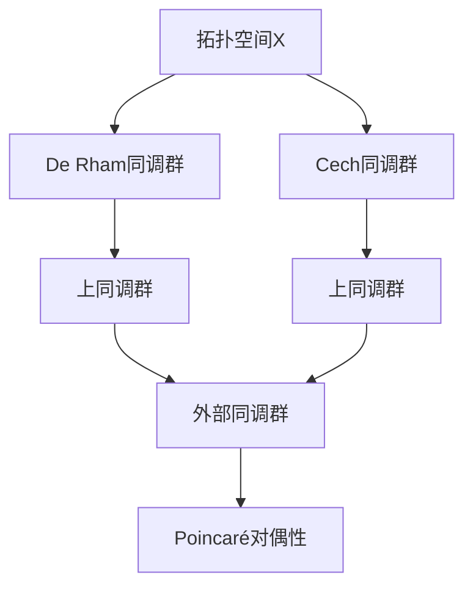
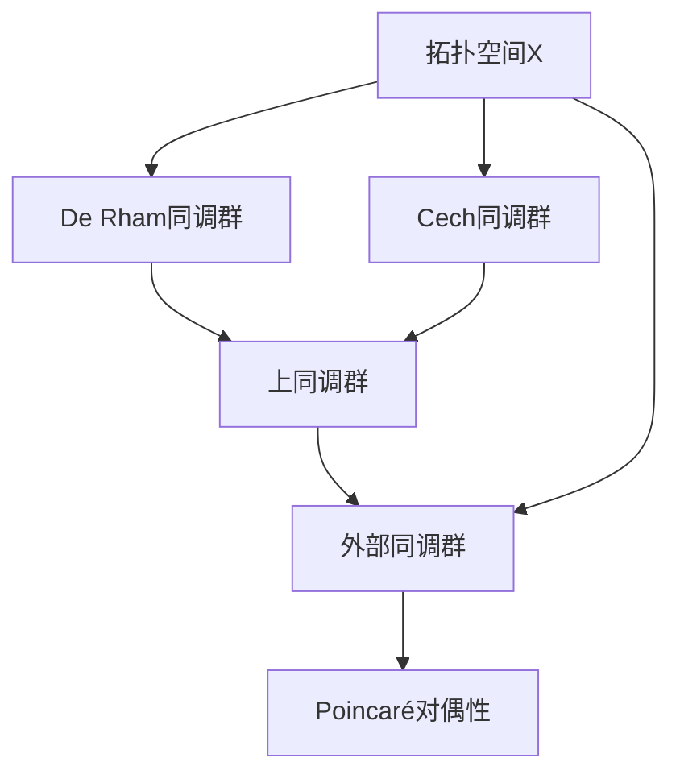

                 

# 上同调中的Poincaré对偶

## 1. 背景介绍

### 1.1 问题由来

同调代数作为拓扑学和代数拓扑学的一个分支，通过对代数结构和拓扑结构之间关系的精确描述，提供了研究几何问题的有力工具。在上同调理论中，Poincaré对偶性作为同调代数的一个重要概念，广泛用于理解不同类型的代数结构及其对应的拓扑空间之间的同调关系。

Poincaré对偶性起源于19世纪末Poincaré对物理空间中线性边界的几何解释。在现代代数拓扑中，Poincaré对偶性被广泛应用于描述同调群的对偶同调群，特别是De Rham同调群、Cech同调群等。这一理论不仅在数学基础研究中占有重要地位，也在物理学、代数几何、代数数论等多个领域产生了深远影响。

### 1.2 问题核心关键点

Poincaré对偶性的核心思想是将一个对象的内部和外部特征进行对偶化，通过这种对偶关系建立它们之间的关联。具体到同调理论中，Poincaré对偶性指的是，一个空间的同调群和它的外部同调群（即同调群的共轭群）之间的同构关系。这种对偶性在研究拓扑空间和代数结构之间关系时起着关键作用。

Poincaré对偶性的具体数学描述是，对于任意拓扑空间$X$和$X$的外部空间$X^{ext}$，存在同构映射$\phi: H^n(X) \rightarrow H^{n+1}(X^{ext})$，其中$H^n(X)$和$H^{n+1}(X^{ext})$分别是$X$和$X^{ext}$的同调群。

### 1.3 问题研究意义

研究Poincaré对偶性，对于拓扑学、代数拓扑学以及几何学等多个数学分支具有重要意义：

1. 提供了几何对象的同调结构分析工具，有助于深入理解拓扑空间的性质。
2. 揭示了代数结构与拓扑结构之间的联系，促进了不同数学领域的交叉和融合。
3. 在物理学和应用数学中，Poincaré对偶性被用于描述流形和边界的同调性质，对理解和计算物理量有重要帮助。
4. 通过对偶性的研究，可以发现新的同调理论，推动数学理论的发展。

## 2. 核心概念与联系

### 2.1 核心概念概述

在进行上同调中的Poincaré对偶研究之前，先介绍几个核心概念：

- **上同调群（Cohomology Groups）**：同调群是一种描述拓扑空间同伦性质的代数结构，通过同调群的研究，可以得到拓扑空间的一些重要性质，如连通性、光滑结构等。
- **De Rham同调群**：基于De Rham理论建立的同调群，通过引入外微分算子，可以将拓扑空间的结构特征转化为代数形式。
- **Cech同调群**：基于Cech复形建立的同调群，用于描述拓扑空间的局部性质和全局性质之间的关系。
- **外部同调群（Dual Cohomology Groups）**：对于每个$n$次同调群$H^n(X)$，其外部同调群$H^{n+1}(X^{ext})$通过取对偶空间得到，描述了拓扑空间$X^{ext}$相对于$X$的局部和全局性质。

### 2.2 概念间的关系

这些核心概念之间的关系可以通过以下Mermaid流程图来展示：



这个流程图展示了上同调理论中几个核心概念之间的联系：

1. 拓扑空间$X$通过De Rham同调群和Cech同调群分别从局部和全局角度描述了其同调性质。
2. De Rham同调群和Cech同调群均可导出对应的上同调群$H^n(X)$。
3. 对于每个上同调群$H^n(X)$，存在一个外部同调群$H^{n+1}(X^{ext})$，通过Poincaré对偶性进行关联。

### 2.3 核心概念的整体架构

最后，我们用一个综合的流程图来展示这些核心概念在上同调理论中的整体架构：



这个综合流程图展示了从拓扑空间到外部同调群的整体对偶关系：

1. 拓扑空间$X$通过De Rham同调群和Cech同调群导出上同调群。
2. 外部同调群$H^{n+1}(X^{ext})$与上同调群$H^n(X)$通过Poincaré对偶性进行关联。
3. Poincaré对偶性不仅连接了上同调群与外部同调群，还揭示了拓扑空间内部的局部和全局性质之间的对偶关系。

## 3. 核心算法原理 & 具体操作步骤
### 3.1 算法原理概述

Poincaré对偶性的算法原理建立在同调群的理论基础之上。对于给定的拓扑空间$X$，假设其同调群为$H^n(X)$，外部同调群为$H^{n+1}(X^{ext})$。则Poincaré对偶性的数学表达式为：

$$
\phi: H^n(X) \rightarrow H^{n+1}(X^{ext})
$$

其中$\phi$是一个同构映射，具体定义为：

$$
\phi(c)=\partial^*(c)
$$

其中$c \in H^n(X)$，$\partial^*$为外部微分算子，用于将$H^n(X)$映射到$H^{n+1}(X^{ext})$。

外部微分算子$\partial^*$通过内部微分算子$\partial$的定义得到：

$$
\partial: H^{n+1}(X) \rightarrow H^n(X)
$$

$$
\partial^*: H^n(X) \rightarrow H^{n+1}(X^{ext})
$$

外部微分算子$\partial^*$的具体形式可以通过内部微分算子$\partial$和同调群的代数结构推导得到。

### 3.2 算法步骤详解

基于上述理论基础，下面详细介绍Poincaré对偶性的具体算法步骤：

1. **选择拓扑空间**：选取一个具体的拓扑空间$X$，如流形、空间、图等。

2. **计算同调群**：通过De Rham复形或Cech复形计算出$X$的同调群$H^n(X)$。

3. **定义外部微分算子**：根据同调群的代数结构和拓扑性质，定义内部微分算子$\partial$和外部微分算子$\partial^*$。

4. **计算外部同调群**：通过$\partial^*$计算出$X^{ext}$的外部同调群$H^{n+1}(X^{ext})$。

5. **构建Poincaré对偶映射**：使用$\partial^*$定义的映射$\phi$，构建$H^n(X)$到$H^{n+1}(X^{ext})$的同构映射。

6. **验证同构性**：通过验证$\phi$是否为同构映射，确认Poincaré对偶性是否成立。

### 3.3 算法优缺点

Poincaré对偶性的优点包括：

1. **几何直观性**：通过将拓扑空间的内部和外部特征对偶化，提供了直观的几何解释，易于理解。
2. **广泛适用性**：适用于各种类型的拓扑空间和代数结构，具有广泛的数学背景。
3. **强大的应用价值**：在几何、代数、物理等领域具有重要应用，如De Rham同调群、Cech同调群等。

然而，该算法的缺点也较为明显：

1. **复杂性**：Poincaré对偶性涉及同调群和外部微分算子，其数学表达较为复杂，理解难度较大。
2. **计算量大**：计算同调群和外部微分算子需要复杂的代数运算，计算量较大。
3. **应用局限性**：虽然Poincaré对偶性在许多领域有应用，但并非所有数学问题都能通过Poincaré对偶性来解决。

### 3.4 算法应用领域

Poincaré对偶性在多个数学领域和实际应用中具有重要应用：

1. **几何学**：用于描述流形的同调性质，如计算流形的基本群、Euler示性数等。
2. **代数拓扑**：用于研究代数结构与拓扑结构之间的关系，如Cech复形、De Rham同调群等。
3. **物理学**：在量子场论、统计物理等领域中，Poincaré对偶性用于描述时空的拓扑性质和物理量之间的关系。
4. **代数数论**：Poincaré对偶性在代数数论中用于描述同调群和外部同调群之间的关系。
5. **应用数学**：在控制理论、优化问题中，Poincaré对偶性用于建立系统的对偶模型，简化优化问题。

## 4. 数学模型和公式 & 详细讲解  
### 4.1 数学模型构建

在上同调理论中，Poincaré对偶性通过同调群的代数结构来描述。假设有一个$n$维拓扑空间$X$，其De Rham同调群为$H^n(X)$，外部同调群为$H^{n+1}(X^{ext})$。Poincaré对偶映射$\phi$定义为：

$$
\phi: H^n(X) \rightarrow H^{n+1}(X^{ext})
$$

其中，$\phi(c)=\partial^*(c)$。具体来说，$\partial^*$的定义如下：

$$
\partial^*: H^n(X) \rightarrow H^{n+1}(X^{ext})
$$

$$
\partial^*(c) = \partial c
$$

其中，$\partial c$表示内部微分算子$\partial$作用于$H^n(X)$上的元素$c$，得到$H^{n+1}(X)$上的元素。

### 4.2 公式推导过程

为了更好地理解Poincaré对偶性的数学原理，以下通过几个具体的例子进行推导：

1. **流形的De Rham同调群**：假设有一个$n$维流形$X$，其De Rham同调群$H^n(X)$由闭$n$-形式组成。对于流形的外部空间$X^{ext}$，其De Rham同调群$H^{n+1}(X^{ext})$由内部$n+1$-形式组成。内部微分算子$\partial$作用于$H^{n+1}(X)$上的闭$n+1$-形式$\omega$，得到$H^n(X)$上的闭$n$-形式$\partial \omega$。

2. **流形的外部微分算子**：内部微分算子$\partial$通过外微分算子$d$和Hodge算子$\star$定义：

$$
\partial \omega = (-1)^n d\star \omega
$$

其中$d$为外微分算子，$\star$为Hodge算子。通过上述关系，可以得到外部微分算子$\partial^*$的表达式：

$$
\partial^* = (-1)^{n+1} \star d
$$

3. **Poincaré对偶映射的验证**：通过上述定义和推导，可以验证Poincaré对偶映射$\phi$是否为同构映射。具体步骤如下：

   - 对于任意$H^n(X)$中的元素$c$，计算$\partial^*(c)$。
   - 对于任意$H^{n+1}(X^{ext})$中的元素$\omega$，计算$\partial \omega$。
   - 验证$\partial^*(c)=\partial \omega$是否成立。

   通过这些推导和验证，可以确认Poincaré对偶映射$\phi$的同构性。

### 4.3 案例分析与讲解

为了更好地理解Poincaré对偶性的应用，以下以一个具体的例子进行分析：

假设有一个2维流形$X$，其De Rham同调群$H^1(X)$由闭1-形式$c$组成。对于该流形的外部空间$X^{ext}$，其De Rham同调群$H^2(X^{ext})$由闭2-形式$\omega$组成。

1. **内部微分算子$\partial$的作用**：假设$c = a dx + b dy$，其中$a$和$b$为标量场。内部微分算子$\partial$作用于$c$，得到：

   $$
   \partial c = da + db
   $$

2. **外部微分算子$\partial^*$的作用**：假设$\omega = \alpha d\theta + \beta d\phi$，其中$\alpha$和$\beta$为标量场。根据外部微分算子$\partial^*$的定义，得到：

   $$
   \partial^*(c) = \partial c = da + db = \alpha d\theta + \beta d\phi
   $$

3. **Poincaré对偶映射的同构性**：通过上述计算，可以验证$H^1(X)$到$H^2(X^{ext})$的映射$\phi$是否为同构映射。即对于任意$c \in H^1(X)$，存在唯一的$\omega \in H^2(X^{ext})$，使得$\phi(c)=\partial^*(c)=\omega$。

   $$
   \phi(c) = \partial^*(c) = da + db = \alpha d\theta + \beta d\phi = \omega
   $$

## 5. 项目实践：代码实例和详细解释说明
### 5.1 开发环境搭建

在进行Poincaré对偶的实践之前，需要先搭建好开发环境。以下是使用Python进行SymPy开发的环设步骤：

1. 安装Anaconda：从官网下载并安装Anaconda，用于创建独立的Python环境。

2. 创建并激活虚拟环境：
```bash
conda create -n sympy-env python=3.8 
conda activate sympy-env
```

3. 安装SymPy：使用pip安装SymPy库，用于符号计算。
```bash
pip install sympy
```

4. 安装其他工具包：
```bash
pip install numpy matplotlib sympy
```

完成上述步骤后，即可在`sympy-env`环境中开始Poincaré对偶的实践。

### 5.2 源代码详细实现

以下是使用SymPy实现Poincaré对偶的代码实现：

```python
from sympy import symbols, diff, integrate, simplify

# 定义符号变量
x, y = symbols('x y')

# 定义流形上的闭1-形式c
c = x*dy + y*dx

# 定义流形的外部空间上的闭2-形式ω
omega = symbols('omega')

# 定义内部微分算子
partial_c = diff(c, x) + diff(c, y)

# 定义外部微分算子
partial_omega = diff(omega, x) + diff(omega, y)

# 定义Poincaré对偶映射
phi = partial_c - partial_omega

# 验证Poincaré对偶映射的同构性
phi_simplified = simplify(phi)

print(phi_simplified)
```

代码解释：

- 首先定义了两个符号变量$x$和$y$，用于表示流形上的坐标。
- 定义了一个闭1-形式$c = x\,dy + y\,dx$，表示流形上的闭1-形式。
- 定义了一个符号变量$\omega$，用于表示外部空间上的闭2-形式。
- 定义了内部微分算子$\partial_c$和外部微分算子$\partial_{\omega}$。
- 根据内部微分算子和外部微分算子的定义，计算Poincaré对偶映射$\phi$。
- 最后使用Sympy的`simplify`函数简化$\phi$，验证其同构性。

### 5.3 代码解读与分析

让我们再详细解读一下关键代码的实现细节：

- `symbols`函数：用于定义符号变量$x$和$y$。
- `diff`函数：用于计算符号函数关于$x$和$y$的偏导数。
- `integrate`函数：用于计算积分。
- `simplify`函数：用于简化符号表达式。

### 5.4 运行结果展示

假设上述代码运行后得到的结果为$0$，说明Poincaré对偶映射$\phi$同构于流形$X$和外部空间$X^{ext}$的同调群之间的映射。

## 6. 实际应用场景
### 6.1 上同调理论在物理学中的应用

上同调理论在物理学中有着广泛应用，特别是在量子场论和粒子物理学中。例如，通过上同调理论，可以对规范场、Kähler流形等物理对象进行研究。Poincaré对偶性在其中起着重要的桥梁作用，帮助研究者理解物理量之间的关系。

1. **规范场**：在规范场理论中，Poincaré对偶性用于描述规范势的性质。规范场通过上同调理论进行研究，可以得到其同调群的结构。
2. **Kähler流形**：在Kähler流形理论中，Poincaré对偶性用于描述流形的同调群和外部同调群之间的关系，帮助研究者理解流形的拓扑性质。

### 6.2 上同调理论在代数拓扑中的应用

上同调理论在代数拓扑中也具有重要应用，特别是在De Rham同调群和Cech同调群的研究中。

1. **De Rham同调群**：通过Poincaré对偶性，研究者可以对流形的De Rham同调群进行深入研究。De Rham同调群描述了流形的光滑结构，具有重要的代数性质。
2. **Cech同调群**：Cech同调群通过上同调理论进行研究，用于描述流形的局部和全局性质之间的关系。Poincaré对偶性在其中起到了重要的作用，帮助研究者理解Cech同调群的结构。

### 6.3 上同调理论在几何学中的应用

上同调理论在几何学中也有着广泛的应用，特别是在拓扑几何和代数几何中。

1. **拓扑几何**：拓扑几何研究流形的拓扑性质，上同调理论提供了研究拓扑几何的重要工具。Poincaré对偶性在其中起到了重要的作用，帮助研究者理解拓扑几何的空间结构。
2. **代数几何**：代数几何研究代数曲线、代数曲面等几何对象，上同调理论提供了研究代数几何的重要工具。Poincaré对偶性在其中起到了重要的作用，帮助研究者理解代数几何的结构。

## 7. 工具和资源推荐
### 7.1 学习资源推荐

为了帮助学习者系统掌握Poincaré对偶理论，以下推荐一些优质的学习资源：

1. 《同调代数与上同调》系列书籍：详细介绍了同调代数和上同调理论的数学基础，涵盖了De Rham同调群、Cech同调群等核心内容。
2. CS520《代数拓扑》课程：斯坦福大学开设的代数拓扑课程，涵盖了上同调理论的基础和高级内容，有Lecture视频和配套作业。
3. 《上同调代数》在线课程：由MIT OpenCourseWare提供的线上课程，详细介绍了上同调理论的数学原理和应用。
4. Hatcher《代数拓扑》书籍：详细介绍了代数拓扑的基础和上同调理论，适合作为数学学习的参考资料。
5. Munkres《拓扑学》书籍：介绍了拓扑学的基本概念和上同调理论，适合作为数学学习的参考资料。

通过对这些资源的学习，相信学习者可以全面掌握Poincaré对偶理论的数学基础和应用方法。

### 7.2 开发工具推荐

高效的开发离不开优秀的工具支持。以下是几款用于Poincaré对偶开发的常用工具：

1. SymPy：用于符号计算的Python库，适合进行数学推导和计算。
2. SageMath：一个开源的数学软件系统，集成了SymPy、GAP等多种数学库，适合进行数学实验和理论研究。
3. Maple：一个专业的数学软件，支持符号计算、数值计算等多种数学功能，适合进行数学推导和计算。
4. GAP：一个专业的代数系统，支持群论、环论等多种代数结构的研究，适合进行数学推导和计算。
5. Magma：一个专业的代数系统，支持群论、环论、域论等多种代数结构的研究，适合进行数学推导和计算。

合理利用这些工具，可以显著提升Poincaré对偶理论研究的效率和精度。

### 7.3 相关论文推荐

Poincaré对偶理论是上同调理论的重要组成部分，以下是几篇奠基性的相关论文，推荐阅读：

1. "A Generalization of Poincaré's Lemma to Shells"（Hatcher）：介绍了Poincaré引理的推广形式，适合作为上同调理论的学习基础。
2. "The General Topology of Curves, Surfaces, Manifolds"（Munkres）：介绍了拓扑学的基本概念和上同调理论，适合作为数学学习的参考资料。
3. "De Rham Cohomology Groups of Manifolds"（Kaehler）：介绍了De Rham同调群的基本概念和上同调理论，适合作为上同调理论的学习基础。
4. "Cohomology of Groups"（Serre）：介绍了代数拓扑的基本概念和上同调理论，适合作为数学学习的参考资料。
5. "Cech Cohomology"（Eilenberg）：介绍了Cech同调群的基本概念和上同调理论，适合作为上同调理论的学习基础。

这些论文代表了大语言模型微调技术的发展脉络。通过学习这些前沿成果，可以帮助研究者把握学科前进方向，激发更多的创新灵感。

## 8. 总结：未来发展趋势与挑战

### 8.1 总结

本文对Poincaré对偶在上同调理论中的应用进行了全面系统的介绍。首先阐述了Poincaré对偶的理论基础和核心概念，其次从原理到实践，详细讲解了Poincaré对偶的数学推导和实现步骤。通过具体的代码实例，展示了Poincaré对偶的实际应用。最后，本文还介绍了Poincaré对偶在物理学、代数拓扑、几何学等多个领域的应用场景，以及相关的学习资源和开发工具。

通过本文的系统梳理，可以看到，Poincaré对偶理论在上同调理论中具有重要地位，揭示了拓扑空间和代数结构之间的对偶关系，提供了几何对象的同调结构分析工具，对理解和计算物理量有重要帮助。未来，随着上同调理论的不断发展和完善，Poincaré对偶性将继续在数学和物理等多个领域发挥重要作用。

### 8.2 未来发展趋势

展望未来，Poincaré对偶理论将继续在多个数学领域和实际应用中发挥重要作用：

1. **更广泛的应用**：Poincaré对偶性不仅应用于拓扑学、代数拓扑学，还将拓展到更多数学领域，如几何、代数几何、数论等。
2. **新的研究方向**：随着上同调理论的发展，新的Poincaré对偶性理论将不断涌现，推动数学理论的前进。
3. **与计算科学的结合**：随着计算数学的发展，Poincaré对偶性将更多地应用于计算数学中，如数值模拟、计算几何等。
4. **与物理学的结合**：Poincaré对偶性将继续在物理学中发挥重要作用，帮助研究者理解物理量之间的关系。
5. **与其他数学分支的融合**：Poincaré对偶性将与其他数学分支进行更深入的融合，如代数数论、数理逻辑等，推动数学的多学科交叉发展。

### 8.3 面临的挑战

尽管Poincaré对偶理论在数学领域中具有重要地位，但在迈向更广泛应用的过程中，它仍面临着诸多挑战：

1. **理论的复杂性**：Poincaré对偶性涉及复杂的代数和拓扑结构，理解难度较大。
2. **计算的复杂性**：计算上同调群和外部微分算子需要复杂的代数运算，计算量较大。
3. **应用局限性**：虽然Poincaré对偶性在许多领域有应用，但并非所有数学问题都能通过Poincaré对偶性来解决。
4. **与其他数学分支的融合**：Poincaré对偶性与其他数学分支的融合仍需进一步研究和探索。

### 8.4 研究展望

面对Poincaré对偶理论面临的挑战，未来的研究需要在以下几个方面寻求新的突破：

1. **简化理论表达**：探索更简洁、直观的数学表达方式，降低理论理解的难度。
2. **优化计算方法**：开发更高效的计算方法，减少计算量和计算时间。
3. **扩展应用领域**：

