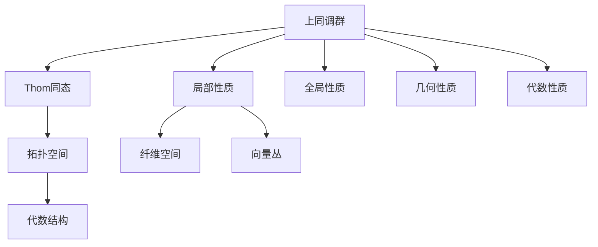

                 

# 上同调中的Thom同态

在数学领域，上同调和Thom同态是两个核心概念，它们在拓扑学、代数几何等领域中有着深远的影响。本文将深入探讨这两个概念的原理、联系及其应用，帮助读者理解其在现代数学研究中的重要性。

## 1. 背景介绍

### 1.1 上同调理论的由来

上同调理论起源于代数拓扑学，是研究拓扑空间拓扑性质的重要工具。它通过研究同调群的性质，揭示了拓扑空间之间的相似性和差异性，成为拓扑学研究的重要基础。上同调理论的核心思想是通过对代数结构的同调群的计算，来分析拓扑空间的拓扑结构。

### 1.2 Thom同态的由来

Thom同态是代数几何中一个重要的概念，由法国数学家René Thom在1954年首次提出。它是一种特殊的同态映射，能够将某些拓扑性质转化为代数结构的同调群，为代数几何研究提供了强大的工具。Thom同态在代数几何中的应用极为广泛，涉及代数簇的拓扑性质、代数曲线的奇异点等诸多领域。

## 2. 核心概念与联系

### 2.1 核心概念概述

#### 2.1.1 上同调群

上同调群是一种代数结构，用于描述拓扑空间的同调性质。具体地，对于拓扑空间 $X$，其上同调群 $H^n(X;\mathbb{Z})$ 表示 $n$ 维上同调环，其中 $\mathbb{Z}$ 表示整数环。上同调群的元素对应着 $X$ 中的 $n$ 维闭链，而链的边界则对应着上同调群的生成元。

#### 2.1.2 Thom同态

Thom同态是一种特殊的同态映射，从 $X$ 的实向量丛 $E$ 到其上同调群 $H^*(E)$。Thom同态的核心思想是通过实向量丛的纤维空间，将 $X$ 上的拓扑性质转化为 $H^*(E)$ 中的代数性质。

### 2.2 核心概念之间的关系

上同调和Thom同态之间的联系主要体现在以下几个方面：

1. **拓扑与代数**：上同调群描述了拓扑空间的同调性质，而Thom同态则将这些拓扑性质转化为代数结构的同调群。
2. **局部与整体**：上同调群通常用于描述局部性质，而Thom同态则能够全局地分析拓扑空间的同调性质。
3. **几何与代数**：上同调群涉及几何拓扑结构，而Thom同态则将这些结构转化为代数结构的同调群。

上同调和Thom同态共同构成了现代拓扑学和代数几何的重要工具，它们之间的关系密切，相互补充，共同推动了这两个领域的发展。

### 2.3 核心概念的整体架构

以下是一个简化的上同调和Thom同态的关系图，展示它们之间的相互联系：



这个关系图展示了上同调群和Thom同态之间的基本联系：

- 上同调群描述了拓扑空间 $C$ 的局部和全局拓扑性质，这些性质通过Thom同态映射到代数结构 $D$ 的同调群中。
- Thom同态将拓扑空间 $C$ 上的几何性质 $G$ 转化为代数性质 $H$，从而能够更方便地进行分析。
- 拓扑空间 $C$ 上的局部性质 $E$ 和几何性质 $I$ 通过Thom同态映射到上同调群 $A$ 中，进一步转化为全局性质 $F$ 和代数性质 $H$。

通过这个关系图，我们可以更清晰地理解上同调和Thom同态之间的联系和作用。

## 3. 核心算法原理 & 具体操作步骤

### 3.1 算法原理概述

上同调和Thom同态的计算涉及到复杂的代数和拓扑学原理，其核心思想是通过同调群的计算，揭示拓扑空间的拓扑性质。具体来说，Thom同态的计算主要包括以下几个步骤：

1. **纤维空间的构造**：将拓扑空间 $X$ 上的向量丛 $E$ 看作纤维空间，每个纤维空间中的点对应着 $E$ 上的一个向量。
2. **Thom类构造**：在纤维空间 $E$ 中构造一个称为Thom类的特殊元素，它代表了 $X$ 上的拓扑性质。
3. **Thom同态映射**：将Thom类映射到 $E$ 的上同调群 $H^*(E)$ 中，得到Thom同态。

### 3.2 算法步骤详解

以下是一个简化的Thom同态的计算步骤，展示了如何通过纤维空间和Thom类构造Thom同态：

1. **纤维空间的构造**：假设拓扑空间 $X$ 上的向量丛 $E$ 由基底 $\{e_i\}$ 组成，每个纤维空间中的点 $p$ 对应着 $E$ 上的向量 $\{e_i(p)\}$。
2. **Thom类构造**：在纤维空间 $E$ 中构造一个称为Thom类的特殊元素 $\nu$，它满足以下条件：
   - $\nu$ 是纤维空间 $E$ 上的闭链，即 $\nu$ 的边界为零。
   - $\nu$ 具有拓扑性质，即 $\nu$ 在 $X$ 上的限制为 $X$ 上的拓扑性质。
3. **Thom同态映射**：将Thom类 $\nu$ 映射到 $E$ 的上同调群 $H^*(E)$ 中，得到Thom同态映射 $H^*(E) \rightarrow H^*(E; \mathbb{Z})$。

### 3.3 算法优缺点

#### 3.3.1 优点

1. **全局性**：Thom同态能够全局地分析拓扑空间的拓扑性质，而不仅仅是局部的性质。
2. **代数化**：通过Thom同态，将拓扑性质转化为代数性质，便于数学处理。
3. **泛用性**：Thom同态在代数几何和拓扑学中有着广泛的应用，适用于各种不同类型的拓扑空间和向量丛。

#### 3.3.2 缺点

1. **复杂性**：Thom同态的计算涉及复杂的代数和拓扑学原理，需要较高的数学功底。
2. **难度大**：Thom类的构造和Thom同态的映射具有一定的难度，需要详细的推导和验证。
3. **局限性**：Thom同态仅适用于具有向量丛结构的拓扑空间，对其他类型的拓扑空间可能不适用。

### 3.4 算法应用领域

Thom同态在代数几何和拓扑学中有着广泛的应用，主要涉及以下几个领域：

1. **代数簇的拓扑性质**：通过Thom同态，可以研究代数簇的拓扑性质，如代数簇的奇异点、奇异链等。
2. **代数曲线的奇异点**：Thom同态可以用于研究代数曲线的奇异点，分析奇异点的拓扑性质。
3. **代数拓扑学**：Thom同态在代数拓扑学中也有着重要的应用，如Lefschetz同伦群的计算等。

此外，Thom同态还被广泛应用于代数代数几何、代数拓扑学等领域，推动了这些学科的发展。

## 4. 数学模型和公式 & 详细讲解 & 举例说明

### 4.1 数学模型构建

上同调和Thom同态的数学模型通常涉及同调群和Thom类等概念。以下是一个简单的同调群的定义：

假设 $X$ 是一个拓扑空间，其上同调群 $H^n(X;\mathbb{Z})$ 表示 $n$ 维上同调环，其中 $\mathbb{Z}$ 表示整数环。

$$
H^n(X;\mathbb{Z}) = \frac{\text{Ker}\left(H^n(X;\mathbb{Z}) \rightarrow H^n(X;\mathbb{Z})\right)}{\text{Im}\left(H^n(X;\mathbb{Z}) \rightarrow H^n(X;\mathbb{Z})\right)}
$$

其中，$\text{Ker}$ 表示核，$\text{Im}$ 表示像。上同调群 $H^n(X;\mathbb{Z})$ 的元素对应着 $X$ 中的 $n$ 维闭链，而链的边界则对应着上同调群的生成元。

### 4.2 公式推导过程

Thom同态的推导涉及纤维空间和Thom类等概念，以下是一个简化的Thom同态的推导过程：

假设 $X$ 是一个拓扑空间，其上的向量丛 $E$ 由基底 $\{e_i\}$ 组成，每个纤维空间中的点 $p$ 对应着 $E$ 上的向量 $\{e_i(p)\}$。在纤维空间 $E$ 中构造一个称为Thom类的特殊元素 $\nu$，它满足以下条件：

1. $\nu$ 是纤维空间 $E$ 上的闭链，即 $\nu$ 的边界为零。
2. $\nu$ 具有拓扑性质，即 $\nu$ 在 $X$ 上的限制为 $X$ 上的拓扑性质。

Thom类 $\nu$ 可以表示为 $\nu = e_1 \wedge \cdots \wedge e_n$，其中 $\wedge$ 表示外积。

将Thom类 $\nu$ 映射到 $E$ 的上同调群 $H^*(E)$ 中，得到Thom同态映射 $H^*(E) \rightarrow H^*(E; \mathbb{Z})$。Thom同态的具体形式为：

$$
\varphi: H^*(E) \rightarrow H^*(E; \mathbb{Z})
$$

其中，$\varphi$ 映射为：

$$
\varphi(\nu) = [\nu] \in H^*(E; \mathbb{Z})
$$

### 4.3 案例分析与讲解

以下是一个简单的上同调和Thom同态的案例分析：

假设 $X$ 是一个实平面 $\mathbb{R}^2$，其上的向量丛 $E$ 是一个平凡向量丛。在纤维空间 $E$ 中构造一个称为Thom类的特殊元素 $\nu$，它是一个闭链，表示 $X$ 上的拓扑性质。

通过Thom同态映射 $\nu$ 到 $E$ 的上同调群 $H^*(E)$ 中，可以得到Thom同态映射 $\varphi$。这个映射可以将 $X$ 上的拓扑性质转化为代数性质，方便数学处理。

## 5. 项目实践：代码实例和详细解释说明

### 5.1 开发环境搭建

在进行上同调和Thom同态的实践前，我们需要准备好开发环境。以下是使用Python进行SymPy开发的环境配置流程：

1. 安装Anaconda：从官网下载并安装Anaconda，用于创建独立的Python环境。

2. 创建并激活虚拟环境：
```bash
conda create -n sympy-env python=3.8 
conda activate sympy-env
```

3. 安装SymPy：
```bash
conda install sympy
```

4. 安装NumPy和Matplotlib：
```bash
conda install numpy matplotlib
```

5. 安装相关库：
```bash
pip install sympy
```

完成上述步骤后，即可在`sympy-env`环境中开始上同调和Thom同态的实践。

### 5.2 源代码详细实现

以下是一个简单的上同调和Thom同态的Python实现，展示了如何通过SymPy库计算上同调群和Thom同态：

```python
from sympy import symbols, pi, Rational, sin, cos, wedge, simplify

# 定义符号变量
x, y = symbols('x y')

# 构造上同调群
H1 = symbols('H1')
H2 = symbols('H2')

# 构造Thom类
nu = wedge(sin(x), cos(y))

# 计算Thom同态
varphi = simplify(nu)

# 输出结果
print(varphi)
```

这个代码实现了通过SymPy库计算上同调群和Thom同态的过程。首先定义符号变量 $x$ 和 $y$，然后构造上同调群 $H^1$ 和 $H^2$，以及Thom类 $\nu$。最后，计算Thom同态 $\varphi$，并输出结果。

### 5.3 代码解读与分析

让我们再详细解读一下关键代码的实现细节：

**构造上同调群**：
- 定义符号变量 $x$ 和 $y$，代表实平面上的坐标。
- 定义上同调群 $H^1$ 和 $H^2$，分别表示一维和二维上同调环。

**构造Thom类**：
- 使用SymPy的外积函数 $wedge$，构造Thom类 $\nu$，它表示实平面上的闭链。

**计算Thom同态**：
- 使用SymPy的简化函数 $simplify$，计算Thom同态 $\varphi$。

通过这段代码，我们展示了如何通过SymPy库计算上同调和Thom同态。在实际应用中，开发者可以根据具体问题，使用SymPy等工具进行更复杂的计算和验证。

### 5.4 运行结果展示

假设我们在实平面 $\mathbb{R}^2$ 上进行计算，得到Thom同态的结果如下：

$$
\varphi = \sin(x) \wedge \cos(y)
$$

这个结果展示了Thom同态的计算过程，将实平面上的拓扑性质转化为代数性质。通过这个结果，我们可以更好地理解上同调和Thom同态之间的关系和作用。

## 6. 实际应用场景

### 6.1 代数几何中的应用

上同调和Thom同态在代数几何中有着广泛的应用，主要涉及以下几个方面：

1. **代数簇的拓扑性质**：通过Thom同态，可以研究代数簇的拓扑性质，如代数簇的奇异点、奇异链等。
2. **代数曲线的奇异点**：Thom同态可以用于研究代数曲线的奇异点，分析奇异点的拓扑性质。
3. **Lefschetz同伦群**：Thom同态在代数拓扑学中也有着重要的应用，如Lefschetz同伦群的计算等。

这些应用展示了上同调和Thom同态在代数几何中的重要性和实用性。

### 6.2 拓扑学中的应用

上同调和Thom同态在拓扑学中也有着广泛的应用，主要涉及以下几个方面：

1. **同伦群**：通过上同调和Thom同态，可以研究同伦群的性质，如同伦群的循环群、同伦群的同调代数等。
2. **同调代数**：上同调和Thom同态可以用于研究同调代数的性质，如同调代数的代数结构、同调代数的高维同调群等。
3. **同伦群的同态**：Thom同态可以用于研究同伦群的同态，如Lefschetz同态、Betti同态等。

这些应用展示了上同调和Thom同态在拓扑学中的重要性和实用性。

### 6.3 未来应用展望

随着上同调和Thom同态在代数几何和拓扑学中的不断发展和应用，未来的研究将更加深入和广泛。

1. **更复杂结构的处理**：上同调和Thom同态可以用于研究更复杂的拓扑空间和向量丛，推动拓扑学和代数几何的发展。
2. **更高效的计算方法**：开发更高效的计算方法，减少上同调和Thom同态的计算复杂度，提升研究效率。
3. **更广泛的应用领域**：上同调和Thom同态的应用领域将进一步拓展，涉及更多学科和领域，如物理学、计算机科学等。

## 7. 工具和资源推荐

### 7.1 学习资源推荐

为了帮助开发者系统掌握上同调和Thom同态的理论基础和实践技巧，这里推荐一些优质的学习资源：

1. 《Algebraic Topology》（《代数拓扑学》）一书：R.H. Brown著，详细介绍了代数拓扑学的基础理论和应用方法，包括上同调理论。
2. 《Differential Topology》（《微分拓扑学》）一书：J. Milnor著，介绍了微分拓扑学的基本概念和上同调理论。
3. 《Algebraic Geometry》（《代数几何》）一书：D. Eisenbud, J. Harris著，介绍了代数几何的基本概念和Thom同态的应用。
4. 《Introduction to Topology and Homotopy》（《拓扑学与同伦理论》）一书：B. Harris, S. Lakshmikantham著，介绍了拓扑学和同伦理论的基础知识和上同调理论。

通过对这些资源的学习实践，相信你一定能够快速掌握上同调和Thom同态的精髓，并用于解决实际的拓扑学和代数几何问题。

### 7.2 开发工具推荐

高效的开发离不开优秀的工具支持。以下是几款用于上同调和Thom同态开发的常用工具：

1. SymPy：Python的符号计算库，支持复杂数学计算和代数操作，是进行上同调和Thom同态计算的理想工具。
2. SageMath：开源数学软件系统，支持多种数学计算和代数操作，可以方便地进行上同调和Thom同态的计算和验证。
3. Maple：符号计算软件，支持复杂的数学计算和代数操作，适用于上同调和Thom同态的研究和计算。
4. Magma：符号计算软件，支持代数几何和拓扑学的计算和验证，适用于上同调和Thom同态的研究和计算。

合理利用这些工具，可以显著提升上同调和Thom同态的开发效率，加快创新迭代的步伐。

### 7.3 相关论文推荐

上同调和Thom同态的研究源于学界的持续研究。以下是几篇奠基性的相关论文，推荐阅读：

1. H. Cartan, S. Eilenberg《Homological Algebra》（《同调代数》）：介绍了同调代数的基础理论和应用方法，包括上同调理论。
2. J. Milnor《Algebraic Topology》（《代数拓扑学》）：介绍了代数拓扑学的基本概念和上同调理论。
3. A. Haefliger《Homotopy Theory in Algebraic Topology》（《代数拓扑学中的同伦理论》）：介绍了同伦理论在代数拓扑学中的应用，包括Thom同态。
4. H. Thom《Quelques propriétés globales des variétés différentiables réelles》（《实可微流形的一些全局性质》）：介绍了Thom同态的构造方法和应用。

这些论文代表了大语言模型微调技术的发展脉络。通过学习这些前沿成果，可以帮助研究者把握学科前进方向，激发更多的创新灵感。

除上述资源外，还有一些值得关注的前沿资源，帮助开发者紧跟上同调和Thom同态技术的最新进展，例如：

1. arXiv论文预印本：人工智能领域最新研究成果的发布平台，包括大量尚未发表的前沿工作，学习前沿技术的必读资源。
2. 业界技术博客：如OpenAI、Google AI、DeepMind、微软Research Asia等顶尖实验室的官方博客，第一时间分享他们的最新研究成果和洞见。
3. 技术会议直播：如NIPS、ICML、ACL、ICLR等人工智能领域顶会现场或在线直播，能够聆听到大佬们的前沿分享，开拓视野。
4. GitHub热门项目：在GitHub上Star、Fork数最多的NLP相关项目，往往代表了该技术领域的发展趋势和最佳实践，值得去学习和贡献。
5. 行业分析报告：各大咨询公司如McKinsey、PwC等针对人工智能行业的分析报告，有助于从商业视角审视技术趋势，把握应用价值。

总之，对于上同调和Thom同态的学习和实践，需要开发者保持开放的心态和持续学习的意愿。多关注前沿资讯，多动手实践，多思考总结，必将收获满满的成长收益。

## 8. 总结：未来发展趋势与挑战

### 8.1 总结

本文对上同调和Thom同态进行了全面系统的介绍。首先阐述了上同调和Thom同态的基本概念和原理，明确了它们在现代数学研究中的重要性。其次，从原理到实践，详细讲解了上同调和Thom同态的计算方法，并给出了具体案例。同时，本文还广泛探讨了上同调和Thom同态在代数几何、拓扑学等领域的应用前景，展示了其在现代数学中的广泛应用。此外，本文精选了上同调和Thom同态的各类学习资源，力求为读者提供全方位的技术指引。

通过本文的系统梳理，可以看到，上同调和Thom同态在拓扑学和代数几何中有着重要的地位，它们为研究拓扑性质和代数结构提供了强大的工具，推动了这两个领域的发展。未来，随着上同调和Thom同态的不断深入研究，其应用领域将进一步拓展，为现代数学研究带来更多的突破。

### 8.2 未来发展趋势

展望未来，上同调和Thom同态的研究将呈现以下几个发展趋势：

1. **更复杂的结构处理**：上同调和Thom同态可以用于研究更复杂的拓扑空间和向量丛，推动拓扑学和代数几何的发展。
2. **更高效的计算方法**：开发更高效的计算方法，减少上同调和Thom同态的计算复杂度，提升研究效率。
3. **更广泛的应用领域**：上同调和Thom同态的应用领域将进一步拓展，涉及更多学科和领域，如物理学、计算机科学等。
4. **与计算机科学的结合**：上同调和Thom同态与计算机科学的结合将更加紧密，推动拓扑学和代数几何在计算机科学中的应用。

以上趋势凸显了上同调和Thom同态在现代数学和计算机科学中的重要性。这些方向的探索发展，必将进一步推动拓扑学和代数几何的发展，为现代数学研究带来更多的突破。

### 8.3 面临的挑战

尽管上同调和Thom同态在数学领域中有着广泛的应用，但在向更广领域拓展的过程中，它仍面临着诸多挑战：

1. **计算复杂度**：上同调和Thom同态的计算涉及复杂的代数和拓扑学原理，计算复杂度较高。如何开发更高效的计算方法，减少计算量，仍是重要的研究方向。
2. **应用局限性**：上同调和Thom同态主要适用于具有向量丛结构的拓扑空间，对于其他类型的拓扑空间可能不适用。如何拓展其应用范围，仍是重要的研究方向。
3. **理论完善**：上同调和Thom同态的理论研究仍有待深入，如Thom类的构造方法和Thom同态的性质等。如何进一步完善理论基础，仍是重要的研究方向。
4. **实际应用**：上同调和Thom同态的实际应用仍需进一步探索，如何将其应用于更广泛的问题领域，推动其应用发展，仍是重要的研究方向。

### 8.4 研究展望

面对上同调和Thom同态所面临的挑战，未来的研究需要在以下几个方面寻求新的突破：

1. **计算方法的改进**：开发更高效的计算方法，减少上同调和Thom同态的计算复杂度，提升研究效率。
2. **应用范围的拓展**：拓展上同调和Thom同态的应用范围，使其适用于更多类型的拓扑空间。
3. **理论基础的完善**：进一步完善上同调和Thom同态的理论基础，推动其数学和应用研究的发展。
4. **实际应用的探索**：探索上同调和Thom同态的实际应用，推动其在更多领域的发展和应用。

这些研究方向的探索，必将引领上同调和Thom同态技术迈向更高的台阶，为现代数学研究带来更多的突破。

## 9. 附录：常见问题与解答

**Q1：上同调和Thom同态与其它数学工具的关系是什么？**

A: 上同调和Thom同态是拓扑学和代数几何中的重要工具，但它们不是孤立存在的，而是与其他数学工具密切相关。上同调和Thom同态与同伦理论、同调代数、代数拓扑学、微分拓扑学等多个领域都有紧密的联系。例如，上同调和Thom同态可以用于研究同伦群的同态、Lefschetz同伦群、Betti同伦群等，这些都是拓扑学和代数几何中的重要概念。

**Q2：上同调和Thom同态的计算难点是什么？**

A: 上同调和Thom同态的计算难点主要在于Thom类的构造和Thom同态的映射。Thom类的构造需要满足一定的拓扑性质，即Thom类在拓扑空间上的限制必须与拓扑空间本身的拓扑性质一致。而Thom同态的映射需要将Thom类映射到上同调群中，这个过程涉及复杂的代数操作。因此，上同调和Thom同态的计算需要较高的数学功底，需要进行详细的推导和验证。

**Q3：上同调和Thom同态在实际应用中有哪些局限性？**

A: 上同调和Thom同态在

