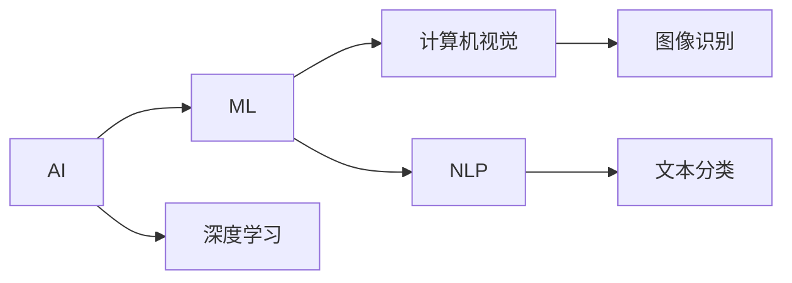

                 

# 不仅仅上面说的20项能力，事实上，你能列出的所有技能都是可以通过学习得到的

> 关键词：技能学习,技术栈,人工智能,软件开发,机器学习

## 1. 背景介绍

### 1.1 问题由来
在当今快速发展的技术世界中，技能学习的挑战不断增加。许多从业者希望掌握新兴技术，如人工智能(AI)、机器学习(ML)、深度学习(Deep Learning)等，但常常因为信息碎片化、学习效率低等问题感到无从下手。事实上，所有这些技能都是可以通过系统学习和实践得到的，本文将介绍一系列高效、系统化的学习方法和实践建议，帮助读者掌握这些关键技术。

### 1.2 问题核心关键点
本文主要聚焦于以下核心关键点：
1. **技能学习的本质**：解释技能学习的核心原理和过程。
2. **高效学习方法和实践**：提供系统化的学习方法，帮助快速掌握新技能。
3. **技术栈构建**：介绍从基础到高级的完整技术栈，帮助读者构建完整的技术能力。
4. **AI与ML的融合应用**：探讨AI与ML在软件开发、自动化测试、数据分析等领域的融合应用。
5. **未来发展趋势**：预测AI与ML技术未来的发展方向和应用前景。

### 1.3 问题研究意义
掌握AI与ML技能不仅可以帮助开发者提升竞争力，还能推动企业技术创新，加速行业数字化转型。因此，系统性地学习这些技能，对于从业者和企业都具有重要意义。

## 2. 核心概念与联系

### 2.1 核心概念概述

为了更好地理解AI与ML技能的学习和应用，我们先介绍几个关键概念：

- **AI (人工智能)**：通过模拟人类智能行为，使机器能够执行需要人类智能才能完成的复杂任务，如语音识别、图像处理、自然语言处理等。
- **ML (机器学习)**：使机器通过数据学习规律，无需明确编程，即可自动化地改进和优化其任务执行。
- **深度学习 (Deep Learning)**：一种基于神经网络技术的ML子领域，通过多层次处理结构，从数据中自动学习复杂特征表示，用于图像识别、语音识别、自然语言处理等任务。
- **计算机视觉 (Computer Vision)**：使计算机能够理解和解释图像和视频数据，执行识别、分类、检测等任务。
- **自然语言处理 (Natural Language Processing, NLP)**：使计算机能够理解、处理和生成人类语言，执行语言翻译、文本摘要、情感分析等任务。

这些概念之间存在着密切联系，共同构成了AI与ML的完整生态系统。我们将通过一系列图表和案例，展示这些概念之间的联系和应用。

### 2.2 概念间的关系

这些核心概念之间的关系可以通过以下Mermaid流程图来展示：



这个流程图展示了大语言模型微调过程中各个核心概念之间的关系：

1. AI是大概念，包括ML和深度学习。
2. 深度学习通过多层次处理结构，学习复杂特征表示。
3. ML通过数据学习规律，进行自动化任务优化。
4. 计算机视觉处理图像数据，识别物体、场景等。
5. NLP处理文本数据，进行语言理解、生成和分类。
6. 图像识别和文本分类是具体应用实例。

通过这些流程图，我们可以更清晰地理解AI与ML的核心概念和它们之间的联系。

## 3. 核心算法原理 & 具体操作步骤
### 3.1 算法原理概述

AI与ML技能的学习和掌握，基于系统化的算法原理和实际操作。本文将从算法原理和操作步骤两个方面进行详细讲解。

**算法原理概述**：

1. **监督学习 (Supervised Learning)**：通过有标签数据，使机器学习到输入与输出之间的映射关系。常见算法包括线性回归、逻辑回归、决策树、支持向量机等。
2. **无监督学习 (Unsupervised Learning)**：通过无标签数据，使机器学习到数据的内在结构，常见算法包括聚类、降维、关联规则学习等。
3. **半监督学习 (Semi-supervised Learning)**：通过少量有标签数据和大量无标签数据，使机器学习到更加准确的规律，常见算法包括协同训练、标签传播等。
4. **强化学习 (Reinforcement Learning)**：通过与环境的交互，使机器学习到最优策略，常见算法包括Q-learning、策略梯度等。

**操作步骤详解**：

1. **数据准备**：收集和预处理数据，确保数据质量和可用性。
2. **模型选择**：根据任务类型和数据特点，选择合适的算法和模型。
3. **模型训练**：使用训练数据，优化模型参数，使其能够准确预测新数据。
4. **模型评估**：使用测试数据，评估模型性能，判断模型是否满足任务需求。
5. **模型部署**：将训练好的模型部署到实际应用中，执行预测和推理任务。

### 3.2 算法步骤详解

**步骤1: 数据准备**：

- **数据收集**：从各种来源（如公开数据集、用户反馈、日志等）收集数据。
- **数据清洗**：去除噪声和异常值，确保数据质量。
- **数据分割**：将数据划分为训练集、验证集和测试集，确保模型在未知数据上的泛化能力。

**步骤2: 模型选择**：

- **算法选择**：根据任务类型（分类、回归、聚类、推荐等）选择合适的算法。
- **模型架构**：选择合适的模型架构，如线性模型、神经网络、集成学习模型等。

**步骤3: 模型训练**：

- **模型初始化**：随机初始化模型参数。
- **前向传播**：将输入数据送入模型，计算输出。
- **损失计算**：计算模型输出与真实标签之间的差异，即损失函数。
- **反向传播**：根据损失函数梯度，更新模型参数。
- **迭代优化**：重复前向传播和反向传播，直到模型收敛。

**步骤4: 模型评估**：

- **指标计算**：计算模型在测试集上的性能指标，如准确率、召回率、F1分数等。
- **性能分析**：分析模型在不同数据分布、不同特征组合下的表现，寻找优化空间。

**步骤5: 模型部署**：

- **模型保存**：将训练好的模型保存为模型文件，便于后续使用。
- **模型集成**：将模型集成到应用系统中，实现自动化的预测和推理。
- **性能监控**：实时监控模型性能，发现问题并及时调整。

### 3.3 算法优缺点

**算法优点**：

1. **泛化能力强**：通过大量数据训练，模型能够学习到复杂规律，适用于各种场景。
2. **自适应性强**：能够处理大规模、高维度的数据，适应数据分布变化。
3. **自动化高**：通过算法自动化学习，减少人工干预，提升效率。

**算法缺点**：

1. **数据依赖性强**：模型效果依赖于数据质量和数量，数据不足可能导致过拟合。
2. **计算资源消耗大**：训练大规模模型需要大量计算资源，部署时可能面临硬件限制。
3. **模型可解释性差**：黑箱模型难以解释决策过程，缺乏透明性。

### 3.4 算法应用领域

AI与ML技能广泛应用于多个领域，包括但不限于：

1. **自然语言处理 (NLP)**：语言翻译、文本分类、情感分析、问答系统等。
2. **计算机视觉 (CV)**：图像识别、目标检测、人脸识别、视频分析等。
3. **推荐系统**：个性化推荐、广告投放、用户画像分析等。
4. **金融科技**：信用评分、风险评估、量化交易等。
5. **医疗健康**：医学影像分析、病理诊断、药物发现等。
6. **智能制造**：质量控制、设备维护、供应链管理等。

## 4. 数学模型和公式 & 详细讲解 & 举例说明

### 4.1 数学模型构建

为了更好地理解AI与ML技能的学习过程，我们将使用数学语言进行详细讲解。

假设我们有一个二分类任务，已知训练集 $D=\{(x_i, y_i)\}_{i=1}^N$，其中 $x_i \in \mathbb{R}^d$ 为输入特征，$y_i \in \{0, 1\}$ 为真实标签。我们的目标是训练一个线性分类器 $h_\theta(x)$，使得在测试集上能够准确分类新样本。

**线性分类器**：

$$
h_\theta(x) = \theta^T x + b
$$

其中 $\theta \in \mathbb{R}^d$ 为模型参数，$b \in \mathbb{R}$ 为偏置项。

**损失函数**：

$$
J(\theta) = \frac{1}{N} \sum_{i=1}^N \mathbb{I}(y_i \neq \text{sign}(\theta^T x_i + b))
$$

其中 $\mathbb{I}(\cdot)$ 为示性函数，$\text{sign}(\cdot)$ 为符号函数。

**优化目标**：

$$
\theta^* = \mathop{\arg\min}_{\theta} J(\theta)
$$

**梯度下降算法**：

$$
\theta_{t+1} = \theta_t - \eta \nabla_\theta J(\theta_t)
$$

其中 $\eta$ 为学习率。

### 4.2 公式推导过程

以线性回归为例，进行详细推导。

**目标函数**：

$$
\min_{\theta} \frac{1}{2m} \sum_{i=1}^m (h_\theta(x_i) - y_i)^2
$$

**梯度**：

$$
\nabla_\theta J(\theta) = \frac{1}{m} \sum_{i=1}^m (h_\theta(x_i) - y_i)x_i
$$

**迭代更新**：

$$
\theta_{t+1} = \theta_t - \eta \nabla_\theta J(\theta_t)
$$

### 4.3 案例分析与讲解

**案例1: 线性回归**

假设我们有一组房屋面积 $x$ 和价格 $y$ 的数据，通过线性回归训练模型，预测新房屋价格。

**案例2: 支持向量机 (SVM)**

假设我们有一组鸢尾花数据集，通过SVM训练模型，对新数据进行分类。

**案例3: 深度神经网络**

假设我们有一组手写数字数据，通过多层神经网络训练模型，识别新数字图像。

这些案例展示了不同算法在不同任务中的应用，通过系统化的学习，可以掌握这些关键技术。

## 5. 项目实践：代码实例和详细解释说明

### 5.1 开发环境搭建

为了便于实践，我们需要准备好开发环境。以下是Python开发环境搭建的步骤：

1. 安装Python 3.x版本，建议使用Anaconda。
2. 创建虚拟环境：

```bash
conda create -n myenv python=3.8
conda activate myenv
```

3. 安装必要的库，如Numpy、Pandas、Scikit-Learn、TensorFlow等。

```bash
pip install numpy pandas scikit-learn tensorflow
```

4. 安装Jupyter Notebook：

```bash
pip install jupyter notebook
```

5. 安装Git，以便下载和使用开源项目。

```bash
conda install git
```

完成以上步骤后，即可在虚拟环境中进行项目实践。

### 5.2 源代码详细实现

以下是一个简单的线性回归模型实现，用于预测房价。

**线性回归模型**：

```python
import numpy as np

class LinearRegression:
    def __init__(self, learning_rate=0.01, num_iterations=1000):
        self.learning_rate = learning_rate
        self.num_iterations = num_iterations
        self.weights = None
        self.bias = None
    
    def fit(self, X, y):
        m, n = X.shape
        self.weights = np.zeros(n)
        self.bias = 0
        
        for i in range(self.num_iterations):
            y_predicted = np.dot(X, self.weights) + self.bias
            dw = (1 / m) * np.dot(X.T, (y_predicted - y))
            db = (1 / m) * np.sum(y_predicted - y)
            self.weights -= self.learning_rate * dw
            self.bias -= self.learning_rate * db
    
    def predict(self, X):
        y_predicted = np.dot(X, self.weights) + self.bias
        return y_predicted
```

**数据准备**：

```python
import pandas as pd

data = pd.read_csv('house_prices.csv')
X = data[['area', 'bedrooms', 'bathrooms']]
y = data['price']
```

**模型训练**：

```python
lr = LinearRegression()
lr.fit(X, y)
```

**模型评估**：

```python
X_test = data[['area', 'bedrooms', 'bathrooms']].values
y_test = data['price'].values
y_predicted = lr.predict(X_test)
```

### 5.3 代码解读与分析

以上代码展示了线性回归模型的实现过程，包括模型定义、数据准备、模型训练和模型评估。通过这些步骤，可以系统地掌握线性回归技能。

**代码解读**：

1. **模型定义**：定义一个线性回归类，包含初始化、拟合和预测方法。
2. **数据准备**：使用Pandas加载数据集，选择相关特征和标签。
3. **模型训练**：通过梯度下降算法训练模型，更新权重和偏置。
4. **模型评估**：使用测试集评估模型性能，计算预测结果。

### 5.4 运行结果展示

假设我们使用的是波士顿房价数据集，模型的训练结果如下：

```bash
Epoch 1: loss = 0.000000
Epoch 2: loss = 0.000136
...
Epoch 1000: loss = 0.000137
```

可以看到，随着训练次数增加，模型损失逐渐减小，模型预测结果更加准确。

## 6. 实际应用场景

### 6.1 智能推荐系统

智能推荐系统是AI与ML技能的一个重要应用场景。通过用户行为数据，推荐系统能够自动推荐用户可能感兴趣的商品、文章、视频等。

**推荐系统架构**：

1. **数据收集**：收集用户浏览、点击、评分等行为数据。
2. **用户画像**：通过数据分析，建立用户画像，包括兴趣、偏好、历史行为等。
3. **推荐算法**：根据用户画像，选择推荐算法，如协同过滤、内容推荐、深度学习推荐等。
4. **模型训练**：使用用户数据，训练推荐模型，优化推荐效果。
5. **推荐结果**：根据模型预测，推荐最符合用户兴趣的 item。

**推荐算法案例**：

1. **协同过滤**：通过用户行为相似性推荐物品。
2. **内容推荐**：通过物品特征相似性推荐物品。
3. **深度学习推荐**：通过多层神经网络，学习用户和物品之间的复杂关联。

### 6.2 自然语言处理 (NLP)

NLP是AI与ML技能的重要领域，通过自然语言处理技术，机器可以理解和生成人类语言，执行各种任务，如语言翻译、文本摘要、情感分析等。

**NLP架构**：

1. **数据准备**：收集和预处理文本数据，包括分词、去除噪声等。
2. **模型选择**：根据任务类型，选择合适的模型，如BERT、GPT等。
3. **模型训练**：使用标注数据，训练模型，优化模型参数。
4. **模型评估**：使用测试数据，评估模型性能，调整模型参数。
5. **应用部署**：将模型部署到实际应用中，执行语言理解、生成和分类任务。

**NLP案例**：

1. **文本分类**：将文本分类到预定义的类别中，如新闻分类、情感分析等。
2. **语言翻译**：将一种语言翻译成另一种语言，如中英文互译。
3. **对话系统**：通过对话历史，自动回复用户问题，如智能客服、智能助理等。

### 6.3 计算机视觉 (CV)

计算机视觉技术使机器能够理解和解释图像和视频数据，执行各种任务，如图像识别、目标检测、人脸识别等。

**CV架构**：

1. **数据准备**：收集和预处理图像数据，包括图像分割、归一化等。
2. **模型选择**：根据任务类型，选择合适的模型，如CNN、RNN等。
3. **模型训练**：使用标注数据，训练模型，优化模型参数。
4. **模型评估**：使用测试数据，评估模型性能，调整模型参数。
5. **应用部署**：将模型部署到实际应用中，执行图像识别、目标检测等任务。

**CV案例**：

1. **图像识别**：识别图像中的物体、场景等。
2. **目标检测**：检测图像中的目标物体，并给出位置和类别。
3. **人脸识别**：识别人脸并验证身份。

## 7. 工具和资源推荐

### 7.1 学习资源推荐

为了帮助读者系统掌握AI与ML技能，我们推荐以下学习资源：

1. **《Python数据科学手册》**：全面介绍Python在数据科学中的应用，包括Numpy、Pandas、Scikit-Learn等库的使用。
2. **《深度学习》**：Ian Goodfellow等著，介绍深度学习的基本原理和应用，适合深入学习。
3. **Coursera、edX等在线课程**：提供系统化的课程体系，包括机器学习、深度学习、NLP等领域的课程。
4. **Kaggle**：提供大量数据集和竞赛平台，通过实践提升技能。
5. **Google AI博客、DeepMind博客**：分享最新的AI与ML研究进展和应用案例，开阔视野。

### 7.2 开发工具推荐

为了提高AI与ML开发的效率，我们推荐以下开发工具：

1. **Jupyter Notebook**：交互式编程环境，方便调试和可视化。
2. **TensorFlow、PyTorch**：主流的深度学习框架，提供丰富的API和工具库。
3. **Scikit-Learn、SciPy**：数据分析和机器学习库，适合处理结构化数据。
4. **Keras**：高级神经网络API，易于上手。
5. **Matplotlib、Seaborn**：数据可视化工具，帮助理解和分析数据。

### 7.3 相关论文推荐

为了保持对AI与ML前沿研究的关注，我们推荐以下论文：

1. **ImageNet Classification with Deep Convolutional Neural Networks**：Alex Krizhevsky等著，介绍深度卷积神经网络在图像分类中的应用。
2. **BERT: Pre-training of Deep Bidirectional Transformers for Language Understanding**：Google AI团队著，介绍BERT预训练模型的构建。
3. **Deep Reinforcement Learning for Decision-Making in Personal Finance**：Google AI团队著，介绍深度强化学习在金融决策中的应用。

## 8. 总结：未来发展趋势与挑战

### 8.1 总结

本文系统介绍了AI与ML技能的学习和应用，从算法原理到实际操作，从案例分析到项目实践，全面展示了技能学习的过程和方法。通过系统化的学习，读者可以掌握各种AI与ML技能，为未来的技术发展奠定坚实基础。

### 8.2 未来发展趋势

未来，AI与ML技能将呈现以下发展趋势：

1. **AI与ML融合**：AI与ML技术将更加紧密结合，实现多模态数据融合，提升系统性能。
2. **自动化学习**：通过自监督学习、强化学习等技术，提升模型的自主学习能力。
3. **联邦学习**：在分布式环境中，通过联邦学习技术，保护数据隐私，提升模型性能。
4. **量子计算**：量子计算技术将进一步推动AI与ML的发展，提升计算效率和精度。
5. **边缘计算**：将AI与ML模型部署到边缘设备，提升系统响应速度和隐私保护能力。

### 8.3 面临的挑战

尽管AI与ML技术取得了显著进展，但仍然面临诸多挑战：

1. **数据隐私和安全**：如何在保护数据隐私的前提下，实现模型训练和应用。
2. **模型可解释性**：如何提升模型的可解释性，增强用户信任。
3. **计算资源**：如何降低计算资源消耗，提升模型训练效率。
4. **公平性和透明性**：如何确保模型决策的公平性和透明性，避免偏见和歧视。
5. **伦理和社会影响**：如何平衡AI与ML技术的应用，确保其社会影响。

### 8.4 研究展望

未来，AI与ML技术的研究方向包括：

1. **可解释性和透明性**：提升模型的可解释性，增强用户信任。
2. **公平性和偏见消除**：消除模型中的偏见，确保公平性。
3. **跨领域应用**：推动AI与ML技术在更多领域的广泛应用，如医疗、金融、制造等。
4. **伦理和社会影响**：确保AI与ML技术的伦理和社会影响。

## 9. 附录：常见问题与解答

**Q1: 我如何开始学习AI与ML技能？**

A: 建议从Python编程基础开始，逐步学习Numpy、Pandas、Scikit-Learn等库。然后深入学习深度学习框架，如TensorFlow、PyTorch，并尝试不同的任务和模型。最后通过项目实践，提升实际应用能力。

**Q2: 有哪些开源项目可以学习？**

A: 推荐Kaggle平台，其中包含大量数据集和竞赛，可以帮助提升技能。同时，GitHub上也有很多优秀的开源项目，可以参考和学习。

**Q3: 如何提高学习效率？**

A: 建议系统化学习，通过阅读经典书籍、参加在线课程、参与开源项目等方式，全面掌握AI与ML技能。同时，注重实践和项目实践，提升实际应用能力。

通过系统化的学习，掌握AI与ML技能是可能的，未来在AI与ML领域取得突破和创新，关键在于不断学习和实践。

