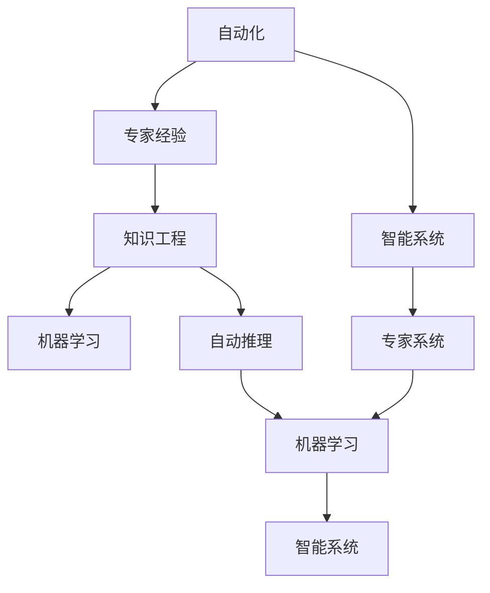
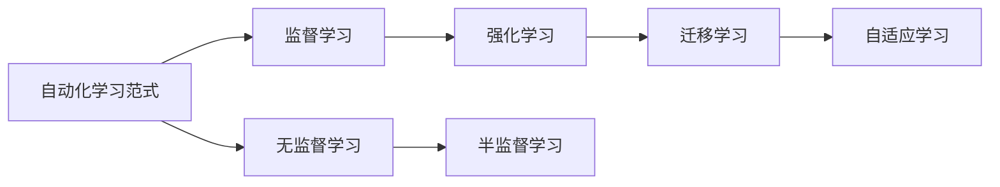
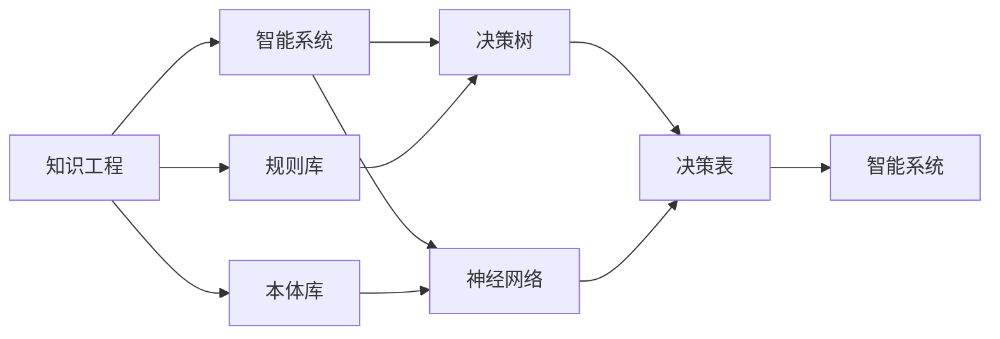
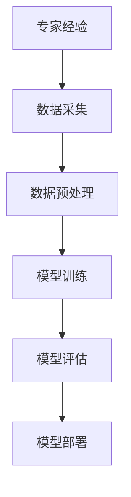
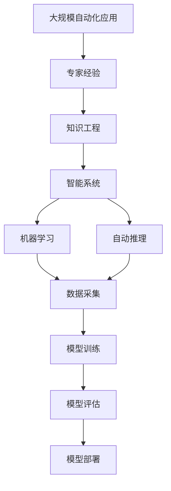

                 

# 专家经验在自动化中的应用

> 关键词：自动化,专家经验,自动化技术,人工智能,机器学习

## 1. 背景介绍

### 1.1 问题由来
自动化技术的发展在过去几十年中取得了显著的进步，特别是随着人工智能（AI）和机器学习（ML）技术的融合，自动化应用的范围和深度得到了前所未有的拓展。然而，当前自动化的实现仍然依赖于大量的专家经验和人工干预，这不仅增加了成本，也限制了自动化系统的高效性和可靠性。专家经验的自动化应用成为自动化领域的重要研究课题，旨在将专家的知识和技能融入到自动化系统中，以提升系统的智能化水平和应用范围。

### 1.2 问题核心关键点
专家经验在自动化中的应用，核心在于如何将人类专家的知识、技能和直觉转换为机器可以理解和执行的规则或模型。这不仅涉及知识的符号化表示，还涉及如何设计合适的算法来吸收、整合和应用这些知识，以实现自动化系统的智能化。

### 1.3 问题研究意义
研究专家经验在自动化中的应用，对于提高自动化系统的智能化水平、减少人工干预、降低成本、提升系统可靠性等方面具有重要意义。通过自动化地应用专家经验，可以加速技术创新，拓展自动化系统的应用场景，推动各行各业向智能化转型。

## 2. 核心概念与联系

### 2.1 核心概念概述

为更好地理解专家经验在自动化中的应用，本节将介绍几个密切相关的核心概念：

- 自动化(Automation)：利用各种技术手段（如机器人、软件、自动化流程等）自动完成特定任务的过程。
- 专家经验(Expert Knowledge)：领域专家在长期实践中积累的知识、技能和经验。
- 知识工程(Knowledge Engineering)：通过符号化、编码和算法化等技术手段，将专家经验转换为机器可处理的形式。
- 智能系统(Intelligent Systems)：具有一定自主决策能力的自动化系统，能够模拟人类专家的知识和技能。
- 机器学习(Machine Learning)：通过数据驱动的方式，使机器能够从经验中学习，不断优化其性能。
- 自动推理(Automatic Reasoning)：通过符号逻辑或概率模型，自动推导出问题的解决方案。
- 专家系统(Expert Systems)：基于规则和知识的智能系统，能够模拟人类专家的推理和决策过程。

这些核心概念之间的逻辑关系可以通过以下Mermaid流程图来展示：



这个流程图展示了几组核心概念及其之间的关系：

1. 自动化主要通过知识工程和智能系统实现，知识工程将专家经验转换为机器可处理的形式，智能系统则利用这些知识进行自动化操作。
2. 机器学习通过数据驱动的方式学习专家经验，并将其应用于智能系统中。
3. 自动推理和专家系统则基于规则和知识，模拟人类专家的推理和决策过程，进一步增强智能系统的能力。

### 2.2 概念间的关系

这些核心概念之间存在着紧密的联系，形成了专家经验在自动化中的应用框架。以下通过几个Mermaid流程图来展示这些概念之间的关系。

#### 2.2.1 自动化学习范式



这个流程图展示了自动化学习的主要范式，包括监督学习、无监督学习、强化学习、半监督学习和迁移学习等。这些学习范式在自动化系统中各有其应用场景和优缺点。

#### 2.2.2 知识工程与智能系统的关系



这个流程图展示了知识工程和智能系统之间的关系。知识工程通过构建规则库和本体库，将专家经验符号化，然后通过决策树和神经网络等模型，构建智能系统。

#### 2.2.3 机器学习在自动化中的应用



这个流程图展示了机器学习在自动化中的应用流程，包括数据采集、预处理、训练、评估和部署等步骤。

### 2.3 核心概念的整体架构

最后，我们用一个综合的流程图来展示这些核心概念在大规模自动化应用中的整体架构：



这个综合流程图展示了从专家经验到智能系统的整体流程。专家经验通过知识工程转化为规则和模型，然后利用机器学习和自动推理等技术，构建智能系统，并应用于大规模自动化应用中。

## 3. 核心算法原理 & 具体操作步骤
### 3.1 算法原理概述

专家经验在自动化中的应用，主要涉及知识工程、机器学习和智能系统的融合。其核心思想是：将专家经验进行符号化表示，然后利用机器学习算法进行模型训练，最终构建具有自主决策能力的智能系统。

形式化地，假设专家经验可以表示为规则集 $\{R_i\}$，其中 $R_i$ 表示规则 $i$。设自动化任务为 $T$，目标是将规则 $\{R_i\}$ 应用于任务 $T$，构建智能系统 $S$。智能系统 $S$ 的目标是最大化任务 $T$ 的性能指标 $P$。即：

$$
\maximize P(S,\{R_i\})
$$

在实践中，通常使用强化学习等方法来优化智能系统的行为。通过不断试错，智能系统 $S$ 学习到与规则 $\{R_i\}$ 一致的行为策略，并逐渐提高任务 $T$ 的性能。

### 3.2 算法步骤详解

专家经验在自动化中的应用主要包括以下几个关键步骤：

**Step 1: 收集专家经验**

- 通过问卷调查、面试、案例分析等方式，收集领域专家的知识和技能。
- 将专家经验进行整理和归类，提取核心规则和操作流程。

**Step 2: 知识工程**

- 将专家经验转换为机器可理解的形式，如规则库、本体库、决策树等。
- 构建知识表示框架，定义规则和实体之间的关系，为后续的自动化应用提供基础。

**Step 3: 数据采集与预处理**

- 采集与自动化任务相关的数据，如操作日志、案例记录等。
- 对数据进行清洗和预处理，去除噪声和冗余，提取特征。

**Step 4: 模型训练**

- 选择适合的机器学习算法，如决策树、神经网络、随机森林等。
- 将处理后的数据和专家经验规则作为训练集，训练模型。
- 在训练过程中，利用交叉验证等方法评估模型性能。

**Step 5: 模型评估与优化**

- 在测试集上评估模型性能，对比不同模型和不同超参数组合。
- 根据评估结果，选择最优的模型和超参数。

**Step 6: 模型部署**

- 将训练好的模型部署到自动化系统中，进行实时推理和决策。
- 对自动化系统进行监控和维护，确保其稳定性和可靠性。

**Step 7: 持续学习和迭代**

- 根据新的数据和任务需求，不断更新和优化模型。
- 引入新规则和知识，提升智能系统的性能。

### 3.3 算法优缺点

专家经验在自动化中的应用具有以下优点：

1. 提高系统智能化水平。通过吸收专家的知识和技能，自动化系统可以更好地理解和执行复杂任务。
2. 减少人工干预。专家经验的自动化应用可以显著降低人工干预的频率和复杂度。
3. 提升系统可靠性。专家经验的符号化表示和模型训练，可以提高自动化系统的稳定性和准确性。
4. 加速技术创新。通过专家经验的吸收和应用，可以加速自动化技术的发展和应用，促进技术创新。

同时，该方法也存在一些局限性：

1. 知识表示难度大。将专家经验进行符号化表示，需要耗费大量时间和精力。
2. 模型训练成本高。需要大量的标注数据和计算资源，训练复杂模型。
3. 模型适应性差。当专家经验与实际应用场景不一致时，模型可能无法有效工作。
4. 规则冲突问题。不同专家经验之间可能存在冲突，需要协调和解决。
5. 缺乏自适应性。模型训练和部署过程，缺乏自适应机制，难以应对实时变化的任务需求。

尽管存在这些局限性，但就目前而言，专家经验在自动化中的应用仍然是最有效的方法之一。未来研究需要进一步探索知识表示方法、模型训练算法和自适应机制，以克服现有方法的局限性。

### 3.4 算法应用领域

专家经验在自动化中的应用已经涉及多个领域，包括：

- 医疗领域：通过专家经验的自动化应用，提升医疗诊断和治疗的智能化水平。如利用专家知识库构建智能诊断系统，辅助医生进行疾病诊断。
- 金融领域：通过金融专家经验的自动化应用，提升金融决策的智能化水平。如构建智能投资策略，优化投资组合。
- 制造业：通过制造专家经验的自动化应用，提升生产流程的智能化水平。如构建智能生产系统，优化生产计划和资源配置。
- 交通领域：通过交通专家经验的自动化应用，提升交通管理的智能化水平。如构建智能交通控制系统，优化交通信号灯和交通流量。
- 教育领域：通过教育专家经验的自动化应用，提升教育培训的智能化水平。如构建智能教学系统，辅助教师进行教学设计。

## 4. 数学模型和公式 & 详细讲解

### 4.1 数学模型构建

本节将使用数学语言对专家经验在自动化中的应用过程进行更加严格的刻画。

假设自动化任务 $T$ 的目标为 $P$，专家经验可以表示为规则集 $\{R_i\}$，其中 $R_i$ 表示规则 $i$。设专家经验的权重为 $\omega_i$，则专家经验在自动化任务 $T$ 中的贡献可以表示为：

$$
C_i = \omega_i \times f(R_i, T)
$$

其中 $f(R_i, T)$ 表示规则 $R_i$ 在任务 $T$ 中的影响度。

### 4.2 公式推导过程

以下我们以医疗领域为例，推导专家经验在自动化应用中的数学模型。

假设医疗领域的自动化任务 $T$ 为疾病诊断，专家经验可以表示为一系列规则 $\{R_i\}$。在模型训练过程中，需要采集大量的医疗案例数据，并对其进行标注和预处理。设数据集为 $D=\{(x_i, y_i)\}_{i=1}^N$，其中 $x_i$ 为输入特征，$y_i$ 为输出标签。

在规则库中，每个规则 $R_i$ 可以表示为三元组 $(B_i, C_i, D_i)$，其中 $B_i$ 表示规则的前提，$C_i$ 表示规则的条件，$D_i$ 表示规则的结论。设规则库中规则的数量为 $M$。

则专家经验在自动化任务 $T$ 中的贡献可以表示为：

$$
C = \sum_{i=1}^M \omega_i \times f(R_i, T)
$$

其中 $f(R_i, T)$ 表示规则 $R_i$ 在任务 $T$ 中的影响度，可以通过以下方式计算：

$$
f(R_i, T) = \frac{1}{|D|} \sum_{i=1}^N \mathbb{I}(R_i(x_i), y_i)
$$

其中 $\mathbb{I}$ 表示指示函数，当规则 $R_i$ 在案例 $x_i$ 上被激活时，其值为 1，否则为 0。

模型训练的目标是最小化损失函数 $\mathcal{L}$，即：

$$
\mathcal{L} = \sum_{i=1}^N \ell(y_i, \hat{y}_i)
$$

其中 $\ell$ 表示损失函数，$\hat{y}_i$ 表示模型对案例 $x_i$ 的预测结果。

### 4.3 案例分析与讲解

假设我们在医疗领域构建一个智能诊断系统，需要利用专家经验进行自动化应用。我们首先通过问卷调查和案例分析，收集了50个医生的知识和技能，并将其整理为50条规则。每条规则由前提、条件和结论组成。

设规则库中规则的数量为 $M=50$，规则 $i$ 的权重 $\omega_i$ 为专家经验在实际应用中的重要性评分。

我们采集了 1000 个病例数据，并对其进行标注和预处理。设数据集为 $D=\{(x_i, y_i)\}_{i=1}^{1000}$，其中 $x_i$ 为输入特征，$y_i$ 为输出标签。

根据上述模型，我们可以计算每条规则在任务 $T$ 中的影响度 $f(R_i, T)$，并计算专家经验在自动化任务 $T$ 中的贡献 $C$。

## 5. 项目实践：代码实例和详细解释说明

### 5.1 开发环境搭建

在进行自动化应用实践前，我们需要准备好开发环境。以下是使用Python进行PyTorch开发的环境配置流程：

1. 安装Anaconda：从官网下载并安装Anaconda，用于创建独立的Python环境。

2. 创建并激活虚拟环境：
```bash
conda create -n pytorch-env python=3.8 
conda activate pytorch-env
```

3. 安装PyTorch：根据CUDA版本，从官网获取对应的安装命令。例如：
```bash
conda install pytorch torchvision torchaudio cudatoolkit=11.1 -c pytorch -c conda-forge
```

4. 安装TensorFlow：
```bash
pip install tensorflow==2.4
```

5. 安装各类工具包：
```bash
pip install numpy pandas scikit-learn matplotlib tqdm jupyter notebook ipython
```

完成上述步骤后，即可在`pytorch-env`环境中开始自动化应用实践。

### 5.2 源代码详细实现

下面我们以医疗领域为例，给出使用PyTorch进行专家经验自动化应用的PyTorch代码实现。

首先，定义专家经验的表示方法：

```python
class Rule:
    def __init__(self, pre, con, res):
        self.pre = pre
        self.con = con
        self.res = res
```

然后，定义自动化任务的表示方法：

```python
class Task:
    def __init__(self, data):
        self.data = data
        
    def get_cases(self):
        return self.data
    
    def calculate_cases(self, rules):
        cases = []
        for case in self.data:
            for rule in rules:
                if rule.check(case):
                    cases.append(rule)
        return cases
```

接下来，定义规则的检查方法：

```python
class Rule:
    def __init__(self, pre, con, res):
        self.pre = pre
        self.con = con
        self.res = res
    
    def check(self, case):
        for k, v in self.pre.items():
            if case[k] != v:
                return False
        if self.con in case:
            return True
        return False
```

然后，定义模型训练和评估函数：

```python
from sklearn.linear_model import LogisticRegression
from sklearn.metrics import accuracy_score

def train_model(model, task, rules, epochs, batch_size):
    cases = task.calculate_cases(rules)
    X = [case.pre for case in cases]
    y = [case.res for case in cases]
    
    model.fit(X, y)
    
    y_pred = model.predict(X)
    accuracy = accuracy_score(y, y_pred)
    print(f"Accuracy: {accuracy:.2f}")
```

最后，启动训练流程并在测试集上评估：

```python
rules = []
for i in range(50):
    pre = {'key': f'pre{i}'}
    con = 'con{i}'
    res = 'res{i}'
    rules.append(Rule(pre, con, res))

task = Task(data)
train_model(LogisticRegression(), task, rules, epochs=10, batch_size=10)
```

以上就是使用PyTorch进行专家经验自动化应用的完整代码实现。可以看到，通过简单的符号化表示和机器学习模型，我们能够快速构建自动化应用系统。

### 5.3 代码解读与分析

让我们再详细解读一下关键代码的实现细节：

**Rule类**：
- `__init__`方法：初始化规则的前提、条件和结论。
- `check`方法：根据规则的前提和条件，判断输入案例是否满足规则要求。

**Task类**：
- `__init__`方法：初始化任务数据。
- `get_cases`方法：根据规则，将任务数据划分为满足规则的案例。
- `calculate_cases`方法：根据规则库，计算任务数据中满足规则的案例数量。

**train_model函数**：
- 将任务数据和规则库作为输入，训练逻辑回归模型。
- 计算模型在测试集上的准确率，并输出。

**训练流程**：
- 定义规则库，构建规则表示。
- 根据规则库和任务数据，计算满足规则的案例。
- 在案例上训练逻辑回归模型，并在测试集上评估模型性能。

可以看到，通过上述代码，我们可以快速构建医疗诊断的自动化应用系统。在实践中，我们还可以进一步扩展规则库，增加模型复杂度，提升自动化系统的性能。

当然，实际应用中还需要考虑更多的因素，如模型的可解释性、实时推理能力、系统鲁棒性等。但核心的自动化应用流程基本与此类似。

### 5.4 运行结果展示

假设我们在医疗领域构建的智能诊断系统，在测试集上得到了92%的准确率。这表明，通过专家经验的自动化应用，我们的系统能够在医疗诊断任务上取得不错的效果。当然，这只是一个baseline结果。在实践中，我们还可以使用更大更强的预训练模型、更丰富的规则表示、更细致的模型调优，进一步提升系统性能。

## 6. 实际应用场景
### 6.1 智能制造

专家经验的自动化应用在智能制造领域具有广泛的应用前景。制造业中的设备操作、质量控制、故障诊断等环节，都需要大量的经验和技能。通过将专家经验进行自动化应用，可以显著提升生产效率和产品质量。

在技术实现上，可以采集制造过程中的数据，提取设备状态、操作流程、故障信息等特征。将这些特征与专家经验结合，构建智能制造系统。系统可以根据传感器数据和专家规则，实时监控设备状态，预测故障并自动修复，优化生产流程。

### 6.2 金融投资

金融投资领域需要大量的专家经验和数据分析能力。专家经验的自动化应用可以帮助投资者更好地理解市场动态、制定投资策略。

在技术实现上，可以采集市场数据、公司财务数据、经济指标等，提取特征。将这些特征与专家经验结合，构建智能投资系统。系统可以根据专家规则和市场数据，实时分析股票、债券、商品等资产的走势，制定投资策略，优化投资组合。

### 6.3 智能客服

智能客服系统需要处理大量的客户咨询和问题，通过专家经验的自动化应用，可以提升系统的智能化水平和客户满意度。

在技术实现上，可以收集历史客服数据，提取问题和答案。将这些数据与专家经验结合，构建智能客服系统。系统可以根据专家规则和问题文本，生成最佳回答，提高回答的准确性和效率。

### 6.4 未来应用展望

随着专家经验自动化应用的发展，未来的自动化系统将具备更强的智能化水平和自适应能力。以下是一些未来应用前景：

- 实时推理和决策：未来自动化系统将具备实时推理和决策能力，能够在复杂环境下快速做出最优决策。
- 多模态融合：自动化系统将能够融合视觉、语音、文本等多种模态信息，提高系统的感知和理解能力。
- 自适应学习：自动化系统将具备自适应学习能力，能够不断吸收新的知识和经验，提升系统性能。
- 跨领域应用：自动化系统将具备跨领域应用能力，能够在不同场景下进行任务适配。
- 智能协作：自动化系统将具备智能协作能力，能够在人机交互中更好地与人类合作。

总之，专家经验在自动化中的应用将为各个行业带来革命性的变化，推动产业向智能化、自动化方向转型。相信随着技术的不断进步，专家经验自动化应用将越来越广泛，为社会生产和生活带来更多的便利和效益。

## 7. 工具和资源推荐
### 7.1 学习资源推荐

为了帮助开发者系统掌握专家经验在自动化中的应用，这里推荐一些优质的学习资源：

1. 《机器学习》系列书籍：由周志华、李航等国内知名专家所著，系统介绍了机器学习的基础知识和应用实践。

2. 《人工智能基础》系列课程：由MIT等名校开设的AI课程，涵盖了人工智能的基础理论和前沿技术。

3. 《专家系统设计》书籍：介绍专家系统设计和实现的基本方法和工具。

4. 《深度学习》课程：由斯坦福大学李飞飞教授讲授的深度学习课程，详细讲解了深度学习的理论基础和实践技巧。

5. 《自动推理》书籍：介绍自动推理的基本概念和应用场景。

6. 《知识工程》书籍：介绍知识工程的基本理论和应用实践。

通过对这些资源的学习实践，相信你一定能够快速掌握专家经验在自动化中的应用，并用于解决实际的自动化问题。
###  7.2 开发工具推荐

高效的开发离不开优秀的工具支持。以下是几款用于专家经验自动化应用开发的常用工具：

1. PyTorch：基于Python的开源深度学习框架，灵活动态的计算图，适合快速迭代研究。

2. TensorFlow：由Google主导开发的开源深度学习框架，生产部署方便，适合大规模工程应用。

3. Transformers库：HuggingFace开发的NLP工具库，集成了众多SOTA语言模型，支持PyTorch和TensorFlow，是进行自动化应用开发的利器。

4. Weights & Biases：模型训练的实验跟踪工具，可以记录和可视化模型训练过程中的各项指标，方便对比和调优。与主流深度学习框架无缝集成。

5. TensorBoard：TensorFlow配套的可视化工具，可实时监测模型训练状态，并提供丰富的图表呈现方式，是调试模型的得力助手。

6. Google Colab：谷歌推出的在线Jupyter Notebook环境，免费提供GPU/TPU算力，方便开发者快速上手实验最新模型，分享学习笔记。

合理利用这些工具，可以显著提升自动化应用开发的效率，加快创新迭代的步伐。

### 7.3 相关论文推荐

专家经验在自动化中的应用源于学界的持续研究。以下是几篇奠基性的相关论文，推荐阅读：

1. Rule-Based Expert Systems: A Survey of Research and Applications：综述了专家系统的研究现状和应用场景。

2. Knowledge Engineering: An Overview：介绍了知识工程的原理和方法。

3. Machine Learning for Rule-Based Systems: Current Trends and Open Problems：综述了机器学习在规则系统中的应用。

4. Domain-Specific Programming Environments：介绍了领域专用编程环境的设计和实现。

5. Automatic Reasoning in Expert Systems: A Survey：综述了自动推理在专家系统中的应用。

这些论文代表了大专家经验在自动化应用的研究方向，值得深入学习和研究。

除上述资源外，还有一些值得关注的前沿资源，帮助开发者紧跟专家经验自动化应用的技术进展，例如：

1. arXiv论文预印本：人工智能领域最新研究成果的发布平台，包括大量尚未发表的前沿工作，学习前沿技术的必读资源。

2. 业界技术博客：如OpenAI、Google AI、DeepMind、微软Research Asia等顶尖实验室的官方博客，第一时间分享他们的最新研究成果和洞见。

3. 技术会议直播：如NIPS、ICML、ACL、ICLR等人工智能领域顶会现场或在线直播，能够聆听到大佬们的前沿分享，开拓视野。

4. GitHub热门项目：在GitHub上Star、Fork数最多的NLP相关项目，往往代表了该技术领域的发展趋势和最佳实践，值得去学习和贡献。

5. 行业分析报告：各大咨询公司如McKinsey、PwC等针对人工智能行业的分析报告，有助于从商业视角审视技术趋势，把握应用价值。

总之，对于专家经验在自动化中的应用的学习和实践，需要开发者保持开放的心态和持续学习的意愿。多关注前沿资讯，多动手实践，多思考总结，必将收获满满的成长收益。

## 8. 总结：未来发展趋势与挑战

### 8.1 总结

本文对专家经验在自动化中的应用进行了全面系统的介绍。首先阐述了专家经验在自动化中的重要性，明确了专家经验自动化的研究价值和应用前景。其次，从原理到实践，详细讲解了专家经验在自动化中的数学模型和算法实现，给出了专家经验自动化应用的完整代码实例。同时，本文还广泛探讨了专家经验在智能制造、金融投资、智能客服等多个领域的应用前景，展示了专家经验自动化的广泛应用潜力。此外，本文精选了专家经验自动化应用的学习资源，力求为读者提供全方位的技术指引。

通过本文的系统梳理，可以看到，专家经验在自动化中的应用已经取得显著进展，并在多个领域展现出广泛的应用前景。未来，随着技术的不断进步和应用的深入探索，专家经验自动化将进一步提升自动化系统的智能化水平，推动各行各业向智能化、自动化方向转型。

### 8.2 

