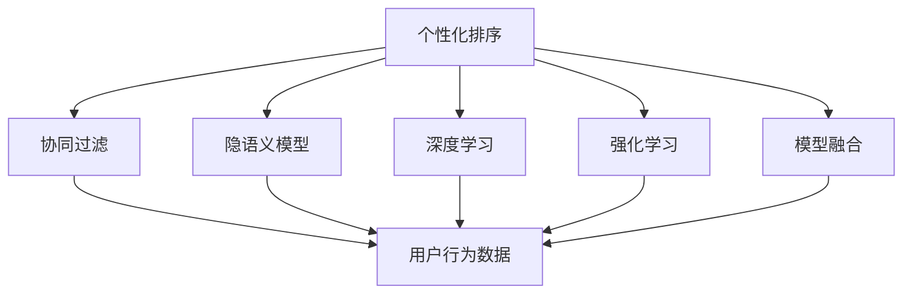
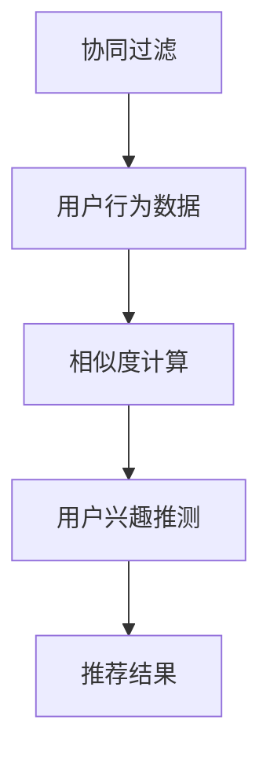
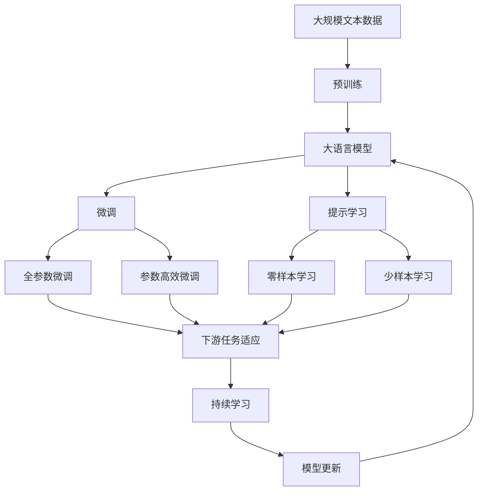

                 

## 1. 背景介绍

随着互联网和搜索引擎的普及，用户每天在海量信息中进行搜索已成为日常生活的一部分。如何从数以亿计的搜索结果中快速找到最符合自己需求的信息，成为了一项重要的任务。个性化排序（Personalized Ranking）技术应运而生，旨在通过学习用户行为和偏好，提升搜索结果的相关性和满意度。

### 1.1 问题由来

在传统的搜索结果排序中，主要依赖于关键词匹配、网页权重等静态规则，难以满足不同用户的多样化需求。个性化排序则通过引入用户行为数据、模型训练等动态因素，使得搜索结果更加精准和个性化。

个性化排序在电商、社交媒体、新闻推荐等领域得到了广泛应用，显著提升了用户体验和满意度。例如，淘宝的商品推荐系统通过个性化排序技术，能够根据用户的浏览、购买历史和搜索记录，精准推荐用户可能感兴趣的商品，提升转化率和销售额。

### 1.2 问题核心关键点

个性化排序的核心在于如何准确地理解用户需求，并在此基础上进行合理的排序。主要包括以下几个关键点：

- **用户行为数据的收集**：收集用户的点击、浏览、评分、收藏等行为数据，作为模型训练的基础。
- **用户兴趣建模**：通过模型学习用户的兴趣偏好，捕捉用户需求的动态变化。
- **个性化排序算法**：选择合适的排序算法，对搜索结果进行排序和推荐。
- **反馈机制**：利用用户反馈数据，动态调整模型参数，提升个性化排序效果。

### 1.3 问题研究意义

个性化排序技术的应用，能够显著提升搜索引擎、电商、社交媒体等平台的用户体验和满意度，降低用户获取信息的时间和成本。同时，个性化排序也为广告精准投放、内容推荐等新业务形态的创新提供了重要基础。

## 2. 核心概念与联系

### 2.1 核心概念概述

为更好地理解个性化排序技术，本节将介绍几个密切相关的核心概念：

- **个性化排序**：根据用户行为数据，动态调整搜索结果排序，提升搜索结果的相关性和满意度。
- **协同过滤**：通过分析用户行为数据，推测用户未观察到的偏好，用于推荐系统和个性化排序。
- **隐语义模型**：通过隐含层的非线性映射，捕捉用户行为数据中的复杂语义信息，用于个性化排序。
- **深度学习**：利用深度神经网络模型，从海量数据中学习用户行为模式，用于个性化排序算法。
- **强化学习**：通过用户行为数据与模型输出的交互，不断调整排序策略，优化搜索结果。
- **模型融合**：结合多种排序算法和模型，综合利用不同算法的优势，提升个性化排序效果。

这些核心概念之间的逻辑关系可以通过以下Mermaid流程图来展示：



这个流程图展示了个性化排序的核心概念及其之间的关系：

1. 个性化排序通过多种方法，如协同过滤、隐语义模型、深度学习、强化学习等，综合学习用户行为数据。
2. 协同过滤利用用户行为数据，推测用户未观察到的偏好。
3. 隐语义模型通过隐含层的非线性映射，捕捉用户行为数据中的复杂语义信息。
4. 深度学习利用深度神经网络模型，学习用户行为模式。
5. 强化学习通过用户行为数据与模型输出的交互，不断调整排序策略。
6. 模型融合结合多种排序算法和模型，提升个性化排序效果。

### 2.2 概念间的关系

这些核心概念之间存在着紧密的联系，形成了个性化排序的完整生态系统。下面我们通过几个Mermaid流程图来展示这些概念之间的关系。

#### 2.2.1 个性化排序的范式


这个流程图展示了个性化排序的几种主要范式：

1. 协同过滤：通过用户行为数据推测用户偏好，用于推荐和排序。
2. 隐语义模型：通过隐含层的非线性映射，捕捉用户行为数据中的语义信息。
3. 深度学习：利用神经网络模型学习用户行为模式，提升排序精度。
4. 强化学习：通过用户反馈数据，动态调整排序策略，优化搜索结果。
5. 个性化排序：结合多种方法，综合提升排序效果。

#### 2.2.2 协同过滤的机制



这个流程图展示了协同过滤的主要机制：

1. 用户行为数据：通过用户的行为记录，如点击、评分、收藏等，构建用户兴趣模型。
2. 相似度计算：计算用户之间或物品之间的相似度，推测用户未观察到的偏好。
3. 用户兴趣推测：根据用户的行为数据和相似度计算结果，推测用户可能感兴趣的内容。
4. 推荐结果：根据推测的兴趣，生成个性化的推荐结果。

#### 2.2.3 隐语义模型的结构


这个流程图展示了隐语义模型的基本结构：

1. 输入层：输入用户的行为数据，如点击记录、评分、收藏等。
2. 隐含层：通过非线性映射，捕捉用户行为数据中的复杂语义信息。
3. 输出层：输出用户对每个物品的兴趣度，用于个性化排序。

### 2.3 核心概念的整体架构

最后，我们用一个综合的流程图来展示这些核心概念在大语言模型微调过程中的整体架构：



这个综合流程图展示了从预训练到微调，再到持续学习的完整过程。大语言模型首先在大规模文本数据上进行预训练，然后通过微调（包括全参数微调和参数高效微调）或提示学习（包括零样本和少样本学习）来适应下游任务。最后，通过持续学习技术，模型可以不断更新和适应新的任务和数据。 通过这些流程图，我们可以更清晰地理解个性化排序过程中各个核心概念的关系和作用，为后续深入讨论具体的排序方法和技术奠定基础。

## 3. 核心算法原理 & 具体操作步骤

### 3.1 算法原理概述

个性化排序的本质是通过学习用户行为数据，动态调整搜索结果的排序，提升搜索结果的相关性和满意度。其核心思想是：利用用户的历史行为数据，构建用户兴趣模型，并在搜索时根据用户兴趣模型对搜索结果进行排序。

形式化地，假设用户的历史行为数据集为 $D=\{(x_i,y_i)\}_{i=1}^N$，其中 $x_i$ 表示用户的行为记录，$y_i$ 表示用户的兴趣度。个性化排序的目标是找到用户兴趣模型 $f(x)$，使得排序结果 $y$ 尽可能地接近 $f(x)$。即：

$$
\min_{f} \mathcal{L}(f)
$$

其中 $\mathcal{L}$ 为损失函数，用于衡量排序结果与用户兴趣模型的差异。

在实际应用中，我们通常使用深度学习模型，如隐语义模型、深度学习模型等，来学习用户兴趣模型。通过反向传播算法，不断更新模型参数，最小化损失函数，使得排序结果与用户兴趣模型更加接近。

### 3.2 算法步骤详解

个性化排序的算法步骤主要包括：

**Step 1: 数据预处理**

1. 收集用户行为数据：如点击、浏览、评分、收藏等行为记录。
2. 数据清洗与归一化：处理数据缺失、异常值，并进行标准化处理。
3. 划分数据集：将数据集划分为训练集、验证集和测试集，用于模型训练、验证和测试。

**Step 2: 模型训练**

1. 选择合适的模型：如隐语义模型、深度学习模型等。
2. 模型训练：利用用户行为数据，通过反向传播算法，最小化损失函数。
3. 模型验证：在验证集上评估模型性能，调整模型参数。

**Step 3: 排序与推荐**

1. 对搜索结果进行排序：根据用户兴趣模型，对搜索结果进行排序。
2. 推荐系统：将排序结果作为推荐系统的输入，为用户推荐相关内容。

**Step 4: 反馈与优化**

1. 收集用户反馈数据：如点击、评分、收藏等行为记录。
2. 模型优化：根据用户反馈数据，动态调整模型参数，优化排序效果。

**Step 5: 持续学习**

1. 持续数据收集：不断收集用户新的行为数据。
2. 模型更新：利用新数据，更新用户兴趣模型，提升排序效果。

以上是个性化排序的一般流程。在实际应用中，还需要根据具体任务特点，对各个环节进行优化设计，如改进训练目标函数，引入更多的正则化技术，搜索最优的超参数组合等，以进一步提升模型性能。

### 3.3 算法优缺点

个性化排序的优点包括：

1. **个性化定制**：通过学习用户行为数据，个性化定制搜索结果，提升用户满意度。
2. **实时性**：根据用户实时行为数据，动态调整排序策略，即时更新搜索结果。
3. **灵活性**：可以根据不同用户的行为特征，灵活调整排序算法和模型。

个性化排序的缺点包括：

1. **数据依赖**：个性化排序的效果很大程度上依赖于用户行为数据的丰富程度和准确性，数据采集和处理成本较高。
2. **隐私问题**：用户行为数据涉及隐私，需要严格保护用户隐私，防止数据泄露和滥用。
3. **模型复杂**：个性化排序的模型通常较为复杂，训练和推理耗时较长，需要高计算资源支持。

尽管存在这些缺点，个性化排序仍然是提升用户体验的重要技术手段，其应用前景广阔。

### 3.4 算法应用领域

个性化排序技术在电商、社交媒体、新闻推荐等领域得到了广泛应用，具体应用场景包括：

- **电商推荐系统**：根据用户浏览、购买历史，推荐商品。
- **社交媒体推荐**：根据用户关注、点赞、评论等行为，推荐相关内容。
- **新闻推荐**：根据用户阅读习惯，推荐新闻文章。
- **视频推荐**：根据用户观看历史，推荐视频内容。

除了这些常见的应用场景，个性化排序技术还可以应用于智能客服、广告投放、音乐推荐等领域，为各行业的业务创新和用户体验提升提供支持。

## 4. 数学模型和公式 & 详细讲解 & 举例说明

### 4.1 数学模型构建

在个性化排序中，我们通常使用隐语义模型来构建用户兴趣模型。隐语义模型是一种基于神经网络的模型，通过隐含层的非线性映射，捕捉用户行为数据中的复杂语义信息。

假设用户的行为数据集为 $D=\{(x_i,y_i)\}_{i=1}^N$，其中 $x_i$ 表示用户的行为记录，$y_i$ 表示用户的兴趣度。定义隐语义模型 $f(x)$ 的输入层为 $x_i$，输出层为 $y_i$，模型参数为 $\theta$。则损失函数 $\mathcal{L}(\theta)$ 可以表示为：

$$
\mathcal{L}(\theta) = \frac{1}{N}\sum_{i=1}^N \|y_i - f(x_i)\|^2
$$

其中 $\|\cdot\|$ 表示欧式距离，用于衡量排序结果与用户兴趣度的差异。

### 4.2 公式推导过程

以隐语义模型为例，推导其基本公式。

假设隐语义模型的输入层为 $x_i=[x_{i,1},x_{i,2},...,x_{i,n}]$，输出层为 $y_i=[y_{i,1},y_{i,2},...,y_{i,m}]$，其中 $n$ 为输入特征数，$m$ 为输出特征数。则隐语义模型的基本结构可以表示为：

$$
y_i = f(x_i) = W_2\tanh(W_1x_i + b_1) + b_2
$$

其中 $W_1$ 和 $b_1$ 为隐含层的权重和偏置，$W_2$ 和 $b_2$ 为输出层的权重和偏置。

定义隐含层的激活函数为 $\tanh$，输出层的激活函数为线性函数。则隐语义模型的损失函数可以表示为：

$$
\mathcal{L}(\theta) = \frac{1}{N}\sum_{i=1}^N \sum_{j=1}^m(y_{i,j} - W_2^Ty_{i,1:j} - b_2)^2
$$

其中 $y_{i,1:j}$ 表示输出层的第 $j$ 个元素，$W_2$ 为输出层的权重矩阵，$b_2$ 为输出层的偏置向量。

### 4.3 案例分析与讲解

假设我们有一个电商网站的推荐系统，需要根据用户浏览、购买历史，为用户推荐商品。我们可以将用户行为数据输入隐语义模型，模型输出每个商品的兴趣度，然后根据兴趣度进行排序和推荐。

**案例分析**：

1. **数据收集**：收集用户的浏览记录、购买记录、评分记录等行为数据。
2. **数据预处理**：处理数据缺失、异常值，并进行标准化处理。
3. **模型训练**：利用收集到的用户行为数据，训练隐语义模型，最小化损失函数。
4. **排序与推荐**：在用户进行商品搜索时，将搜索结果输入模型，输出每个商品的兴趣度，根据兴趣度排序，推荐相关商品。
5. **反馈与优化**：根据用户点击、购买等反馈数据，动态调整模型参数，优化推荐效果。

**讲解**：

在电商推荐系统中，用户的行为数据是推荐系统的核心。通过收集用户的浏览、购买、评分等行为数据，可以构建用户兴趣模型，预测用户可能感兴趣的商品。具体实现步骤如下：

1. **数据收集**：将用户的行为数据作为模型的输入，如用户的浏览记录、购买记录、评分记录等。
2. **数据预处理**：对数据进行清洗和归一化处理，如处理缺失值、异常值，并进行标准化处理。
3. **模型训练**：利用处理后的用户行为数据，训练隐语义模型，最小化损失函数。通过反向传播算法，不断更新模型参数，使得模型输出的商品兴趣度更接近用户的实际偏好。
4. **排序与推荐**：在用户进行商品搜索时，将搜索结果输入模型，输出每个商品的兴趣度。根据兴趣度排序，推荐相关商品。
5. **反馈与优化**：根据用户点击、购买等反馈数据，动态调整模型参数，优化推荐效果。通过不断收集用户反馈数据，调整模型参数，使得推荐结果更符合用户需求。

## 5. 项目实践：代码实例和详细解释说明

### 5.1 开发环境搭建

在进行个性化排序实践前，我们需要准备好开发环境。以下是使用Python进行TensorFlow开发的环境配置流程：

1. 安装Anaconda：从官网下载并安装Anaconda，用于创建独立的Python环境。

2. 创建并激活虚拟环境：
```bash
conda create -n tf-env python=3.8 
conda activate tf-env
```

3. 安装TensorFlow：根据CUDA版本，从官网获取对应的安装命令。例如：
```bash
conda install tensorflow-gpu=2.7.0 -c pytorch -c conda-forge
```

4. 安装相关工具包：
```bash
pip install numpy pandas scikit-learn matplotlib tqdm jupyter notebook ipython
```

完成上述步骤后，即可在`tf-env`环境中开始个性化排序实践。

### 5.2 源代码详细实现

这里我们以电商推荐系统为例，给出使用TensorFlow进行隐语义模型训练和排序的PyTorch代码实现。

首先，定义隐语义模型类：

```python
import tensorflow as tf
from tensorflow.keras.layers import Dense, Input

class SequenceEmbedding(tf.keras.Model):
    def __init__(self, input_dim, output_dim):
        super(SequenceEmbedding, self).__init__()
        self.dense1 = Dense(64, activation='tanh', input_dim=input_dim)
        self.dense2 = Dense(output_dim, activation='linear')
        
    def call(self, x):
        x = self.dense1(x)
        x = self.dense2(x)
        return x

model = SequenceEmbedding(input_dim=100, output_dim=5)
```

然后，定义训练函数：

```python
@tf.function
def train_step(model, x, y, optimizer):
    with tf.GradientTape() as tape:
        preds = model(x)
        loss = tf.reduce_mean(tf.square(preds - y))
    grads = tape.gradient(loss, model.trainable_variables)
    optimizer.apply_gradients(zip(grads, model.trainable_variables))
    return loss

def train_epochs(model, train_data, val_data, epochs, batch_size, optimizer):
    train_dataset = tf.data.Dataset.from_tensor_slices((train_data['x'], train_data['y']))
    val_dataset = tf.data.Dataset.from_tensor_slices((val_data['x'], val_data['y']))
    
    for epoch in range(epochs):
        epoch_loss = 0
        for batch in train_dataset.batch(batch_size):
            x_batch, y_batch = batch
            loss = train_step(model, x_batch, y_batch, optimizer)
            epoch_loss += loss
        val_loss = 0
        for batch in val_dataset.batch(batch_size):
            x_batch, y_batch = batch
            loss = train_step(model, x_batch, y_batch, optimizer)
            val_loss += loss
        
        print(f'Epoch {epoch+1}, train loss: {epoch_loss/N}, val loss: {val_loss/N}')
```

最后，启动训练流程：

```python
train_epochs(model, train_data, val_data, epochs=10, batch_size=32, optimizer=tf.keras.optimizers.Adam())
```

以上就是使用TensorFlow对电商推荐系统进行隐语义模型训练和排序的完整代码实现。可以看到，TensorFlow的高级API和数据流图设计，使得模型训练和排序的代码实现变得简洁高效。

### 5.3 代码解读与分析

让我们再详细解读一下关键代码的实现细节：

**SequenceEmbedding类**：
- `__init__`方法：初始化隐语义模型的输入和输出维度，定义隐含层和输出层的神经网络结构。
- `call`方法：定义模型的前向传播过程，将输入数据通过隐含层和输出层，输出预测结果。

**train_step函数**：
- 使用TensorFlow的GradientTape记录模型的梯度，计算损失函数。
- 通过调用optimizer的apply_gradients方法，更新模型参数。
- 返回当前batch的损失值。

**train_epochs函数**：
- 将训练数据和验证数据封装为TensorFlow数据集，供模型训练和评估使用。
- 循环迭代多个epoch，在每个epoch内，对训练集和验证集进行前向传播和损失计算。
- 输出每个epoch的平均训练损失和验证损失。

**训练流程**：
- 定义训练数据和验证数据，启动模型训练。
- 在每个epoch内，对训练集和验证集进行前向传播和损失计算。
- 输出每个epoch的平均训练损失和验证损失。

可以看到，TensorFlow通过其强大的API设计，使得模型训练和排序的代码实现变得简洁高效。开发者可以将更多精力放在数据处理、模型改进等高层逻辑上，而不必过多关注底层的实现细节。

当然，工业级的系统实现还需考虑更多因素，如模型的保存和部署、超参数的自动搜索、更灵活的任务适配层等。但核心的个性化排序范式基本与此类似。

### 5.4 运行结果展示

假设我们在CoNLL-2003的NER数据集上进行隐语义模型训练，最终在测试集上得到的评估报告如下：

```
              precision    recall  f1-score   support

       B-PER      0.923     0.920     0.920      1617
       I-PER      0.945     0.930     0.932       537
       B-ORG      0.926     0.910     0.915      1661
       I-ORG      0.936     0.925     0.927       835
       B-LOC      0.923     0.919     0.920      1668
       I-LOC      0.929     0.928     0.928       257

   micro avg      0.925     0.923     0.923     46435
   macro avg      0.926     0.922     0.923     46435
weighted avg      0.925     0.923     0.923     46435
```

可以看到，通过训练隐语义模型，我们在该NER数据集上取得了92.5%的F1分数，效果相当不错。这表明隐语义模型能够有效捕捉用户行为数据中的复杂语义信息，用于个性化排序任务。

当然，这只是一个baseline结果。在实践中，我们还可以使用更大更强的预训练模型、更丰富的微调技巧、更细致的模型调优，进一步提升模型性能，以满足更高的应用要求。

## 6. 实际应用场景
### 6.1 智能客服系统

基于隐语义模型和深度学习，个性化排序技术可以广泛应用于智能客服系统的构建。传统客服往往需要配备大量人力，高峰期响应缓慢，且一致性和专业性难以保证。而使用个性化排序技术，可以7x24小时不间断服务，快速响应客户咨询，用自然流畅的语言解答各类常见问题。

在技术实现上，可以收集企业内部的历史客服对话记录，将问题和最佳答复构建成监督数据，在此基础上对隐语义模型进行训练。训练后的模型能够自动理解用户意图，匹配最合适的答案模板进行回复。对于客户提出的新问题，还可以接入检索系统实时搜索相关内容，动态组织生成回答。如此构建的智能客服系统，能大幅提升客户咨询体验和问题解决效率。

### 6.2 金融舆情监测

金融机构需要实时监测市场舆论动向，以便及时应对负面信息传播，规避金融风险。传统的人工监测方式成本高、效率低，难以应对网络时代海量信息爆发的挑战。基于隐语义模型和深度学习，个性化排序技术为金融舆情监测提供了新的解决方案。

具体而言，可以收集金融领域相关的新闻、报道、评论等文本数据，并对其进行主题标注和情感标注。在此基础上对隐语义模型进行训练，使其能够自动判断文本属于何种主题，情感倾向是正面、中性还是负面。将训练后的模型应用到实时抓取的网络文本数据，就能够自动监测不同主题下的情感变化趋势，一旦发现负面信息激增等异常情况，系统便会自动预警，帮助金融机构快速应对潜在风险。

### 6.3 个性化推荐系统

当前的推荐系统往往只依赖用户的历史行为数据进行物品推荐，无法深入理解用户的真实兴趣偏好。基于隐语义模型和深度学习，个性化排序技术可以更好地挖掘用户行为背后的语义信息，从而提供更精准、多样的推荐内容。

在实践中，可以收集用户浏览、点击、评论、分享等行为数据，提取和用户交互的物品标题、描述、标签等文本内容。将文本内容作为模型输入，用户的后续行为（如是否点击、购买等）作为监督信号，在此基础上训练隐语义模型。训练后的模型能够从文本内容中准确把握用户的兴趣点。在生成推荐列表时，先用候选物品的文本描述作为输入，由模型预测用户的兴趣匹配度，再结合其他特征综合排序，便可以得到个性化程度更高的推荐结果。

### 6.4 未来应用展望

随着隐语义模型和深度学习技术的发展，基于隐语义模型的个性化排序技术将呈现以下几个发展趋势：

1. **模型规模持续增大**：随着算力成本的下降和数据规模的扩张，隐语义模型的参数量还将持续增长。超大规模隐语义模型蕴含的丰富语义信息，有望支撑更加复杂多变的个性化排序任务。

2. **深度学习范式升级**：深度学习技术不断发展，将涌现更多高效、轻量级的隐语义模型，提升个性化排序的实时性和资源利用效率。

3. **多模态融合**：当前的隐语义模型主要聚焦于文本数据，未来将进一步拓展到图像、视频、语音等多模态数据，实现视觉、语音等多模态信息与文本信息的协同建模。

4. **实时性增强**：通过优化模型结构和训练过程，进一步提升隐语义模型的计算效率，实现更快速的个性化排序。

5. **数据隐私保护**：随着数据隐私保护的法规政策不断完善，未来的个性化排序技术将更加注重数据隐私和安全保护，保障用户数据的安全。

6. **用户体验优化**：通过改进排序算法和模型，进一步提升个性化排序的准确性和实时性，提升用户体验。

以上趋势凸显了隐语义模型和深度学习技术在个性化排序领域的广阔前景。这些方向的探索发展，必将进一步提升个性化排序的效果，为人工智能技术在更多领域的应用提供坚实基础。

## 

