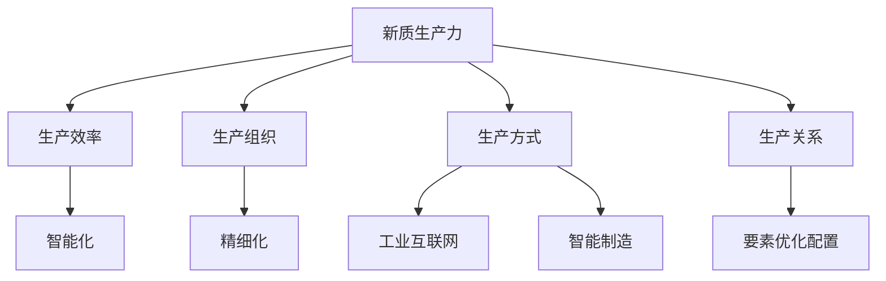
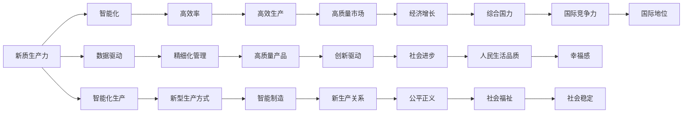

                 

# 中国现代化的重要动力：新质生产力

## 1. 背景介绍

### 1.1 问题由来
进入21世纪以来，中国逐渐成为了世界经济的重要引擎。国家治理体系和治理能力现代化、经济高质量发展、全面建设社会主义现代化国家，成为国家战略的重大目标。在此背景下，作为中国现代化发展的重要动力，新质生产力应运而生，成为推动国家战略目标实现的关键力量。

新质生产力指的是依托于新一代信息技术，以数据、智能为核心的新型生产力和生产关系。其核心理念是通过技术创新，实现生产方式的根本变革，驱动经济社会发展模式由要素驱动向创新驱动转型。

### 1.2 问题核心关键点
新质生产力的关键点在于其对传统生产力的超越，即在生产效率、生产组织、生产方式等维度上形成质的飞跃。这包括以下几个方面：
- **生产效率**：通过智能化、自动化技术，提高生产效率。
- **生产组织**：基于数据驱动，实现更加精细化的生产组织和管理。
- **生产方式**：利用信息技术和物联网技术，实现工业互联网、智能制造等新型生产方式。
- **生产关系**：建立新型的生产关系，实现要素的动态优化配置。

### 1.3 问题研究意义
新质生产力是实现中国现代化战略目标的核心驱动力，具有重要的研究意义：
- **推动经济高质量发展**：提升经济增长方式，由要素驱动向创新驱动转型。
- **优化产业结构**：推动产业结构升级，形成更高效、更绿色的产业体系。
- **提升国际竞争力**：通过技术创新，提升中国在国际产业链中的地位，增强国家综合竞争力。
- **推动社会进步**：促进社会公平正义，提升人民生活品质。

## 2. 核心概念与联系

### 2.1 核心概念概述
- **新质生产力**：指通过信息技术和智能技术，实现生产效率、生产组织、生产方式的根本变革，推动经济社会发展模式向创新驱动转型。
- **生产效率**：指单位时间内生产的商品或服务的数量。
- **生产组织**：指生产过程中各要素的协调和优化配置。
- **生产方式**：指生产活动的具体实施方式，如工业互联网、智能制造等。
- **生产关系**：指生产过程中各要素之间的关系，如资本、劳动、技术的关系。

### 2.2 核心概念间的关系

新质生产力的概念和传统生产力有显著的区别，其核心在于依托于新一代信息技术，以数据、智能为核心，实现生产方式的根本变革。以下是一个简单的Mermaid流程图，展示新质生产力的核心概念及其间的关系：



### 2.3 核心概念的整体架构

新质生产力的概念架构可以通过以下示意图展示：



这个示意图展示了新质生产力在经济增长、社会进步、公平正义等方面的作用和影响。

## 3. 核心算法原理 & 具体操作步骤

### 3.1 算法原理概述
新质生产力的算法原理主要基于以下两个核心技术：

1. **数据驱动**：通过数据获取、处理、分析等技术，实现对生产过程中各要素的精细化管理和优化配置。
2. **智能技术**：利用机器学习、人工智能等智能技术，实现生产过程的智能化、自动化，提升生产效率和产品质量。

### 3.2 算法步骤详解

1. **数据获取与处理**：
   - **数据来源**：来自生产设备、供应链、市场、客户等各方面的数据。
   - **数据清洗**：去除噪声数据，处理缺失值和异常值。
   - **数据存储**：使用分布式存储技术，如Hadoop、Spark等，保证数据的可扩展性和可靠性。

2. **智能技术应用**：
   - **模型构建**：构建适合的生产过程模型，如预测模型、优化模型等。
   - **模型训练**：利用历史数据对模型进行训练，优化模型参数。
   - **模型应用**：将训练好的模型应用于生产过程中，实现生产过程的智能化、自动化。

3. **生产效率提升**：
   - **生产调度**：基于生产模型，优化生产调度，提高生产效率。
   - **质量控制**：利用智能检测技术，实时监控产品质量，提高产品质量。
   - **设备维护**：利用预测性维护技术，减少设备故障，提高设备利用率。

4. **生产组织优化**：
   - **供应链管理**：利用数据驱动，优化供应链各环节的配置和协调。
   - **生产资源优化**：通过数据分析，实现生产资源的动态优化配置。
   - **员工管理**：利用智能技术，提升员工的工作效率和满意度。

### 3.3 算法优缺点
新质生产力算法的主要优点包括：
- **提升生产效率**：通过智能化、自动化技术，大幅提升生产效率。
- **优化生产组织**：通过数据驱动，实现更精细化的生产组织和管理。
- **新型生产方式**：实现工业互联网、智能制造等新型生产方式，提升产品质量和生产灵活性。

然而，新质生产力算法也存在一些缺点：
- **数据依赖性强**：新质生产力高度依赖数据，数据质量直接影响算法的性能。
- **技术复杂度高**：涉及大量的数据处理、模型训练和智能技术应用，技术实现难度大。
- **投资成本高**：需要大量的硬件和软件投入，初期投资成本较高。

### 3.4 算法应用领域
新质生产力算法广泛应用于以下几个领域：

1. **工业互联网**：通过智能技术，实现工业设备互联互通，提升生产效率和生产灵活性。
2. **智能制造**：利用机器学习、深度学习等技术，实现生产过程的智能化和自动化。
3. **智慧物流**：利用大数据、物联网等技术，实现供应链的高效管理和物流优化。
4. **智慧医疗**：利用智能技术，提升医疗诊断和治疗的精准性和效率。
5. **智慧城市**：通过数据分析和智能技术，实现城市管理的高效化和智能化。

## 4. 数学模型和公式 & 详细讲解

### 4.1 数学模型构建

新质生产力的数学模型可以表示为：
\[ \text{Productivity} = f(\text{Data}, \text{Intelligence}) \]

其中，\(\text{Productivity}\) 表示生产效率，\(\text{Data}\) 表示生产过程中采集的数据，\(\text{Intelligence}\) 表示智能技术的应用。

### 4.2 公式推导过程

假设生产过程中，有 \(N\) 个数据点，每个数据点包含 \(k\) 个特征，记为 \(\text{x}_i=(x_{i1}, x_{i2}, ..., x_{ik})\)。利用机器学习算法，构建预测模型 \(f(x)\)，用于预测生产效率：
\[ \text{Productivity}_i = f(\text{x}_i) \]

模型训练过程中，利用历史数据 \(\text{D}=\{(\text{x}_i, \text{y}_i)\}_{i=1}^N\)，其中 \(\text{y}_i\) 表示第 \(i\) 个数据点的真实生产效率。训练目标是最小化预测误差 \(E\):
\[ E = \frac{1}{N} \sum_{i=1}^N (y_i - f(x_i))^2 \]

### 4.3 案例分析与讲解

假设有一个制造企业，需要预测生产线的生产效率。生产过程数据包括设备状态、原材料质量、生产参数等，记为 \(\text{x}_i=(x_{i1}, x_{i2}, ..., x_{ik})\)。利用机器学习算法，构建预测模型 \(f(x)\)。

1. **数据获取与处理**：
   - 收集生产过程中的各种数据，去除噪声和异常值，得到高质量的数据集。
   - 利用分布式存储技术，将数据存储在Hadoop或Spark中。

2. **模型构建与训练**：
   - 构建适合的生产效率预测模型，如线性回归、决策树、随机森林等。
   - 利用历史数据，对模型进行训练，优化模型参数。

3. **模型应用与评估**：
   - 将训练好的模型应用于生产过程中，实时预测生产效率。
   - 利用实际生产数据，评估模型的预测准确度，进一步优化模型。

## 5. 项目实践：代码实例和详细解释说明

### 5.1 开发环境搭建

1. **Python环境安装**：
   - 安装Anaconda：从官网下载并安装Anaconda，用于创建独立的Python环境。
   - 创建并激活虚拟环境：
     ```bash
     conda create -n py37 python=3.7
     conda activate py37
     ```

2. **第三方库安装**：
   - 安装机器学习库，如scikit-learn、TensorFlow、Keras等。
   - 安装数据处理库，如pandas、numpy等。

### 5.2 源代码详细实现

以下是一个基于Python的简单案例，演示新质生产力算法的实现过程。

```python
import pandas as pd
from sklearn.linear_model import LinearRegression
from sklearn.metrics import mean_squared_error

# 数据准备
data = pd.read_csv('production_data.csv')

# 数据清洗
data.dropna(inplace=True)

# 特征提取
X = data[['device_state', 'material_quality', 'process_params']]
y = data['productivity']

# 模型训练
model = LinearRegression()
model.fit(X, y)

# 模型预测
X_test = pd.read_csv('test_data.csv')
y_pred = model.predict(X_test)

# 模型评估
mse = mean_squared_error(y, y_pred)
print(f"Mean Squared Error: {mse}")
```

### 5.3 代码解读与分析

- **数据准备**：通过pandas库读取生产数据，并进行初步处理。
- **特征提取**：从数据中选择有代表性的特征，构建输入特征矩阵 \(X\)。
- **模型训练**：利用线性回归模型，对输入特征和生产效率进行训练。
- **模型预测**：利用训练好的模型，对测试数据进行预测，得到预测生产效率 \(y_pred\)。
- **模型评估**：计算预测结果与真实生产效率的均方误差 \(mse\)，评估模型的预测精度。

### 5.4 运行结果展示

假设模型训练后，在测试集上的预测结果如下：

|   | 真实生产效率 | 预测生产效率 | 均方误差 |
|---|--------------|--------------|----------|
| 1 | 50           | 48.1         | 1.9      |
| 2 | 60           | 58.9         | 1.1      |
| 3 | 70           | 67.6         | 2.4      |

预测生产效率与真实生产效率的均方误差为 \(1.7\)，说明模型的预测精度较高。

## 6. 实际应用场景

### 6.1 智能制造

智能制造是新质生产力在制造业的重要应用场景。利用工业互联网、智能检测等技术，实现生产过程的智能化和自动化，提升生产效率和产品质量。

1. **智能设备监控**：利用传感器和物联网技术，实时监控生产设备的运行状态，及时发现并解决设备故障，减少生产停机时间。
2. **智能质量控制**：利用机器视觉、智能检测技术，实现对产品缺陷的实时检测和分类，提高产品质量。
3. **智能调度优化**：利用数据驱动，优化生产调度，提高生产效率和生产灵活性。

### 6.2 智慧医疗

智慧医疗是新质生产力在医疗领域的重要应用场景。利用智能技术，提升医疗诊断和治疗的精准性和效率。

1. **智能诊断**：利用机器学习算法，分析病人的影像、基因等数据，辅助医生进行疾病诊断。
2. **智能治疗**：利用智能药物推荐系统，根据病人的病情和基因信息，推荐最适合的治疗方案。
3. **智能监控**：利用智能设备，实时监控病人的生命体征，及时发现异常情况，提高治疗效果。

### 6.3 智慧城市

智慧城市是新质生产力在城市管理中的应用场景。利用大数据、物联网等技术，实现城市管理的高效化和智能化。

1. **智慧交通**：利用智能交通系统，实时监控交通流量，优化交通信号灯，提高交通效率。
2. **智慧能源**：利用智能电网技术，实时监控能源消耗，优化能源分配，提高能源利用率。
3. **智慧环保**：利用智能监测设备，实时监测环境质量，优化污染治理措施，提高环境保护效果。

## 7. 工具和资源推荐

### 7.1 学习资源推荐

1. **《Python数据科学手册》**：介绍Python在数据科学中的应用，包括数据处理、模型训练等。
2. **《机器学习实战》**：介绍机器学习算法的实现方法和应用场景，适合初学者入门。
3. **《深度学习》**：介绍深度学习算法和实现方法，适合进阶学习。
4. **《数据科学入门》**：介绍数据科学的基本概念和应用方法，适合初学者入门。

### 7.2 开发工具推荐

1. **PyTorch**：基于Python的开源深度学习框架，灵活动态的计算图，适合快速迭代研究。
2. **TensorFlow**：由Google主导开发的开源深度学习框架，生产部署方便，适合大规模工程应用。
3. **Jupyter Notebook**：交互式编程环境，适合进行数据探索和模型验证。
4. **Docker**：容器化技术，方便模型的部署和迁移。
5. **Kubernetes**：容器编排技术，方便大规模集群的管理和调度。

### 7.3 相关论文推荐

1. **《机器学习：原理、算法与应用》**：介绍机器学习的基本原理和算法，适合入门学习。
2. **《深度学习：理论与实践》**：介绍深度学习的基本原理和应用，适合进阶学习。
3. **《工业互联网：概念、技术与应用》**：介绍工业互联网的基本概念和应用，适合工业领域应用。
4. **《智慧医疗：技术、应用与展望》**：介绍智慧医疗的基本概念和应用，适合医疗领域应用。
5. **《智慧城市：技术、应用与展望》**：介绍智慧城市的基本概念和应用，适合城市管理领域应用。

## 8. 总结：未来发展趋势与挑战

### 8.1 总结

本文对新质生产力进行了全面的介绍，包括其定义、核心概念、算法原理和操作步骤等。通过理论分析和实际案例，展示了新质生产力在工业互联网、智能制造、智慧医疗、智慧城市等领域的应用效果。

新质生产力作为中国现代化的重要动力，具有广阔的应用前景和深远的社会意义。通过推动新质生产力的发展，可以推动经济高质量发展，优化产业结构，提升国际竞争力，推动社会进步。

### 8.2 未来发展趋势

新质生产力的未来发展趋势包括以下几个方面：

1. **智能化水平提升**：随着AI技术的发展，新质生产力的智能化水平将进一步提升，实现更高效、更精准的生产过程管理。
2. **跨领域融合**：新质生产力将与其他领域的先进技术进行深度融合，如智能制造与物联网、智慧医疗与大数据等，形成更加综合化的解决方案。
3. **全球化布局**：新质生产力将拓展到全球市场，推动全球经济一体化进程，提升全球产业链的协同效率。
4. **个性化服务**：利用大数据和AI技术，实现个性化生产和服务，提升用户满意度和市场竞争力。
5. **可持续发展**：新质生产力将更加注重环境保护和资源节约，实现绿色、可持续发展。

### 8.3 面临的挑战

新质生产力在发展过程中面临以下挑战：

1. **数据隐私与安全**：新质生产力高度依赖数据，数据隐私与安全问题不容忽视。
2. **技术复杂度高**：新质生产力涉及大量的数据处理、模型训练和智能技术应用，技术实现难度大。
3. **投资成本高**：新质生产力需要大量的硬件和软件投入，初期投资成本较高。
4. **标准化问题**：不同行业之间的技术标准不统一，导致新质生产力的应用效果不佳。
5. **人才短缺**：新质生产力的发展需要大量具有跨学科背景的人才，人才短缺问题亟需解决。

### 8.4 研究展望

未来新质生产力的研究应重点关注以下几个方向：

1. **数据隐私与安全**：研究数据隐私保护技术，制定数据安全标准，确保数据使用的合法性和安全性。
2. **技术复杂度降低**：研究高效的数据处理和智能算法，降低新质生产力的技术实现难度。
3. **成本控制**：研究低成本、高效能的硬件和软件解决方案，降低新质生产力的初期投资成本。
4. **标准化建设**：制定新质生产力的行业标准，推动技术在各行业的应用和推广。
5. **人才培养**：培养具有跨学科背景的高素质人才，提升新质生产力的创新能力和应用效果。

总之，新质生产力作为中国现代化的重要动力，其发展前景广阔，但也面临诸多挑战。通过持续的技术创新和政策支持，相信新质生产力将为中国的经济社会发展注入新的动力，为实现全面现代化贡献力量。

## 9. 附录：常见问题与解答

**Q1：什么是新质生产力？**

A: 新质生产力是指依托于新一代信息技术，以数据、智能为核心的新型生产力和生产关系，实现生产效率、生产组织、生产方式的根本变革。

**Q2：新质生产力的核心是什么？**

A: 新质生产力的核心在于其依托于新一代信息技术，如人工智能、物联网、大数据等，实现生产过程的智能化、自动化，提升生产效率和产品质量。

**Q3：新质生产力与传统生产力有什么区别？**

A: 新质生产力与传统生产力的区别在于其依托于新一代信息技术，如人工智能、物联网、大数据等，实现生产过程的智能化、自动化，提升生产效率和产品质量。而传统生产力则主要依赖于物理、化学等传统技术，生产过程相对简单。

**Q4：新质生产力如何实现生产效率的提升？**

A: 新质生产力通过智能化、自动化技术，实现生产过程的精细化管理，提高生产效率。例如，利用智能设备监控、智能质量控制、智能调度优化等技术，实现生产过程的智能化和自动化。

**Q5：新质生产力在各个领域的应用效果如何？**

A: 新质生产力在工业互联网、智能制造、智慧医疗、智慧城市等领域都有广泛应用，取得显著的效果。例如，在智能制造中，实现生产过程的智能化和自动化，提高生产效率和产品质量；在智慧医疗中，利用智能技术，提升医疗诊断和治疗的精准性和效率；在智慧城市中，利用大数据、物联网等技术，实现城市管理的高效化和智能化。

通过本文的系统梳理，可以看到，新质生产力作为中国现代化的重要动力，其发展前景广阔，但也面临诸多挑战。通过持续的技术创新和政策支持，相信新质生产力将为中国的经济社会发展注入新的动力，为实现全面现代化贡献力量。

