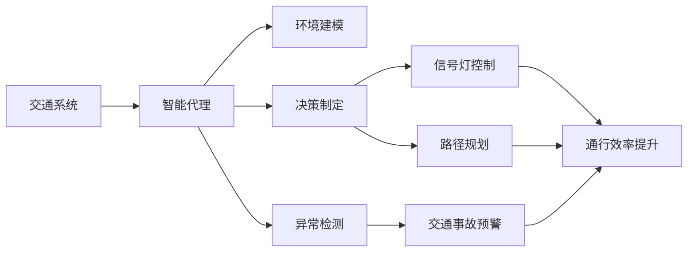

                 

# 交通管理中AI代理的工作流程与应用

> 关键词：交通管理, 人工智能, 智能代理, 智能决策, 实时分析, 异常检测, 交通预测

## 1. 背景介绍

### 1.1 问题由来

随着城市化进程的加快，交通问题已成为影响城市生活质量和经济发展的重大挑战。传统的交通管理依赖于人工监控和经验判断，效率低、响应慢、难以覆盖广。而人工智能（AI）的崛起，为交通管理带来了新的可能。智能代理（AI Agent）作为一种典型的AI技术，通过模拟人类智能行为，自动化地处理交通管理中的复杂任务，显著提升了交通系统的运行效率和用户体验。

智能代理在交通管理中的应用，最早可以追溯到1980年代。当时的专家系统（Expert Systems）便尝试通过模拟交通专家的决策过程，来辅助交通管理。然而，受限于数据量和算法复杂度，这些早期系统的效果并不理想。直到深度学习和大数据技术的成熟，智能代理在交通管理中的表现才迎来了质的飞跃。如今，智能代理已经广泛应用于交通流量预测、交通信号控制、交通事故预警、交通异常检测等多个领域，成为交通管理的重要组成部分。

### 1.2 问题核心关键点

智能代理在交通管理中的核心关键点包括：

- **交通数据采集**：智能代理需要实时获取交通系统的各项数据，如车流量、速度、拥堵情况等。这些数据通常来自于传感器、摄像头、GPS等设备。

- **环境感知与建模**：智能代理需要构建交通系统的环境模型，理解不同数据之间的关联和因果关系。通过自监督学习，智能代理可以逐步提升环境建模的精度。

- **决策制定与执行**：智能代理需要根据环境模型，制定最优的决策策略，并实时执行这些决策。决策制定涉及复杂的规划算法、优化算法和启发式算法。

- **异常检测与预警**：智能代理需要对实时数据进行异常检测，识别出突发事件或异常情况，并及时预警。异常检测技术包括基于统计的方法、基于机器学习的方法和基于深度学习的方法。

- **效果评估与反馈**：智能代理需要对决策效果进行评估，并根据反馈信息不断优化策略。效果评估通常基于量化指标，如延误时间、通行效率等。

## 2. 核心概念与联系

### 2.1 核心概念概述

为更好地理解交通管理中AI代理的工作流程，本节将介绍几个密切相关的核心概念：

- **交通系统**：包括道路、桥梁、隧道、交通信号灯、交通摄像头、传感器等基础设施，以及车、人等交通参与者。

- **智能代理**：指在交通管理中，通过模拟人类智能行为，自动化地处理各种交通管理任务的AI实体。智能代理通常由环境感知模块、决策制定模块和执行模块组成。

- **环境建模**：指智能代理通过学习历史交通数据，构建交通系统的动态模型，用于理解不同数据之间的关联和因果关系。

- **决策制定**：指智能代理根据当前环境状态，制定最优的交通管理决策，如信号灯控制、路径规划等。

- **异常检测**：指智能代理通过实时数据监测，识别出交通系统中的异常情况，如交通事故、交通堵塞等。

- **效果评估**：指智能代理对决策效果进行量化评估，以衡量决策的合理性和有效性。

这些核心概念之间的逻辑关系可以通过以下Mermaid流程图来展示：



这个流程图展示了智能代理在交通管理中的主要功能和过程：

1. 智能代理通过感知交通系统状态，构建环境模型。
2. 根据环境模型，制定决策并实时执行。
3. 对执行效果进行评估，并根据评估结果调整策略。

### 2.2 概念间的关系

这些核心概念之间存在着紧密的联系，形成了智能代理在交通管理中的应用框架。

- 智能代理通过环境感知获取交通数据，这些数据是环境建模的基础。
- 环境建模是决策制定的重要依据，帮助智能代理理解不同数据之间的关联和因果关系。
- 决策制定基于环境模型，制定最优的交通管理策略。
- 异常检测对实时数据进行监测，确保交通系统的正常运行。
- 效果评估对决策效果进行量化，指导智能代理的策略调整和优化。

这些概念共同构成了智能代理在交通管理中的应用生态系统，使得智能代理能够自动化地处理各种交通管理任务。

## 3. 核心算法原理 & 具体操作步骤
### 3.1 算法原理概述

交通管理中AI代理的工作原理主要基于以下几个核心算法：

- **环境感知与建模算法**：用于构建交通系统的环境模型，理解不同数据之间的关联和因果关系。常见算法包括支持向量机（SVM）、随机森林（Random Forest）、长短期记忆网络（LSTM）等。

- **决策制定算法**：用于根据环境模型，制定最优的交通管理决策。常见算法包括动态规划（Dynamic Programming）、遗传算法（Genetic Algorithm）、强化学习（Reinforcement Learning）等。

- **异常检测算法**：用于识别出交通系统中的异常情况，如交通事故、交通堵塞等。常见算法包括统计方法（如均值漂移、孤立森林）、机器学习方法（如集成学习、分类器）和深度学习方法（如自编码器、卷积神经网络）。

- **效果评估算法**：用于量化评估决策效果，以衡量决策的合理性和有效性。常见算法包括量化指标（如延误时间、通行效率）、评分指标（如KPI、QoE）等。

### 3.2 算法步骤详解

智能代理在交通管理中的工作流程大致可以分为以下几个步骤：

**Step 1: 数据采集与预处理**
- 收集交通系统中的各类数据，如车流量、速度、拥堵情况等。
- 对原始数据进行清洗和预处理，包括去除异常值、填补缺失值等。

**Step 2: 环境建模**
- 使用机器学习方法或深度学习方法，构建交通系统的环境模型。常用的模型包括线性回归模型、随机森林模型、卷积神经网络等。
- 通过监督学习，训练模型以最大化拟合交通数据。

**Step 3: 决策制定**
- 根据环境模型，制定最优的交通管理决策。决策制定通常涉及复杂的规划算法、优化算法和启发式算法。
- 使用强化学习等方法，动态调整决策策略，以适应实时变化的环境。

**Step 4: 异常检测**
- 对实时数据进行异常检测，识别出交通系统中的异常情况。
- 使用统计方法、机器学习方法或深度学习方法，构建异常检测模型。

**Step 5: 决策执行与效果评估**
- 根据决策结果，实时调整交通信号灯、路径规划等系统参数。
- 对决策效果进行评估，以衡量决策的合理性和有效性。
- 根据评估结果，调整模型参数和决策策略，进行持续优化。

### 3.3 算法优缺点

智能代理在交通管理中的应用具有以下优点：

- **自动化处理**：能够自动化地处理交通管理中的复杂任务，减少人力成本，提升效率。
- **实时响应**：能够实时监测和响应交通系统中的变化，提高系统的反应速度。
- **多目标优化**：能够同时优化多个交通管理目标，如减少延误时间、提高通行效率等。
- **灵活性高**：可以根据不同城市、不同交通场景，灵活调整模型参数和决策策略。

同时，智能代理也存在以下缺点：

- **数据依赖性高**：需要大量高质量的交通数据，数据采集和处理成本高。
- **模型复杂度大**：环境建模和决策制定算法复杂，需要大量计算资源和时间。
- **安全性和稳定性**：决策结果可能会受到异常数据或模型错误的影响，需要加强异常检测和效果评估。
- **伦理和安全问题**：智能代理的决策过程可能会涉及隐私、安全和伦理问题，需要严格监管和管理。

### 3.4 算法应用领域

智能代理在交通管理中的应用已经涵盖了多个领域，包括但不限于：

- **交通流量预测**：使用机器学习或深度学习方法，预测未来一段时间内的交通流量变化。
- **交通信号控制**：根据实时交通数据，动态调整交通信号灯的相位和时长，优化交通流量。
- **路径规划**：根据实时交通数据和目标位置，制定最优的路径规划方案。
- **交通事故预警**：对实时数据进行异常检测，及时预警交通事故，减少人员伤亡和财产损失。
- **交通异常检测**：对交通系统中的异常情况进行识别和预警，如交通堵塞、道路施工等。

## 4. 数学模型和公式 & 详细讲解 & 举例说明
### 4.1 数学模型构建

交通管理中智能代理的工作流程可以用数学模型进行建模和分析。假设交通系统中的车辆数量为 $V$，道路容量为 $C$，车辆到达率为 $\lambda$，交通信号灯的相位时间为 $\tau$，则交通系统在某个时间点的运行状态可以用向量 $\mathbf{S}$ 表示：

$$
\mathbf{S} = [V_1, V_2, ..., V_n, \tau_1, \tau_2, ..., \tau_m]
$$

其中 $V_i$ 表示第 $i$ 路段的车辆数量，$\tau_j$ 表示第 $j$ 个信号灯的相位时间。

智能代理需要根据环境模型和决策算法，制定最优的交通管理决策，即选择最优的信号灯相位时间和路段车辆数量。可以使用线性规划或整数规划等优化算法，求解以下优化问题：

$$
\min_{\mathbf{S}} \left\{ f(\mathbf{S}) \right\}
$$

其中 $f(\mathbf{S})$ 为交通系统运行状态的目标函数，可以包括通行效率、延误时间等指标。

### 4.2 公式推导过程

以交通流量预测为例，假设使用ARIMA模型进行流量预测，模型的输入为时间序列数据 $x_t$，输出为预测值 $\hat{y}_t$，则模型可以表示为：

$$
\hat{y}_t = \phi(y_{t-1}, y_{t-2}, ..., y_{t-p}) + \psi(x_{t-1}, x_{t-2}, ..., x_{t-q})
$$

其中 $\phi$ 和 $\psi$ 为预测模型的系数，$p$ 和 $q$ 为模型的阶数。

对于时间序列 $x_t$，可以使用指数平滑、滑动平均、季节性差分等方法进行预处理，然后应用ARIMA模型进行预测。ARIMA模型的参数可以通过最小化预测误差，使用梯度下降等方法进行训练。

### 4.3 案例分析与讲解

假设有一个十字路口，共有四个方向的道路，交通信号灯的相位时间为 $\tau_1$ 和 $\tau_2$，当前车辆数量为 $V_1$ 和 $V_2$，可以使用决策树算法来优化交通信号灯的相位时间。假设预测到下一个时刻的车辆数量为 $\hat{V}_1$ 和 $\hat{V}_2$，则可以通过决策树算法，计算最优的相位时间：

$$
\tau_1^* = \min_{\tau_1} \left\{ f(\tau_1, \hat{V}_1, V_1, V_2, \hat{V}_2, \tau_2) \right\}
$$

其中 $f$ 为评估函数，可以包括通行效率、延误时间等指标。

## 5. 项目实践：代码实例和详细解释说明
### 5.1 开发环境搭建

在进行智能代理的开发实践前，我们需要准备好开发环境。以下是使用Python进行PyTorch开发的环境配置流程：

1. 安装Anaconda：从官网下载并安装Anaconda，用于创建独立的Python环境。

2. 创建并激活虚拟环境：
```bash
conda create -n traffic-env python=3.8 
conda activate traffic-env
```

3. 安装PyTorch：根据CUDA版本，从官网获取对应的安装命令。例如：
```bash
conda install pytorch torchvision torchaudio cudatoolkit=11.1 -c pytorch -c conda-forge
```

4. 安装TensorFlow：
```bash
pip install tensorflow==2.6
```

5. 安装各类工具包：
```bash
pip install numpy pandas scikit-learn matplotlib tqdm jupyter notebook ipython
```

完成上述步骤后，即可在`traffic-env`环境中开始智能代理的开发实践。

### 5.2 源代码详细实现

下面以交通流量预测为例，给出使用TensorFlow对智能代理进行开发的PyTorch代码实现。

```python
import tensorflow as tf
import numpy as np
import matplotlib.pyplot as plt

# 构造交通流量时间序列数据
def create_sequence_data(timesteps=100):
    np.random.seed(42)
    data = np.random.normal(50, 5, (timesteps, 4))
    labels = np.random.normal(50, 5, (timesteps-1, 4))
    return data, labels

# 定义ARIMA模型
def create_arima_model(input_shape=(None, 4), output_shape=(None, 4), sequence_length=5):
    model = tf.keras.Sequential([
        tf.keras.layers.LSTM(128, input_shape=input_shape),
        tf.keras.layers.LSTM(128),
        tf.keras.layers.Dense(4, activation='sigmoid')
    ])
    model.compile(optimizer=tf.keras.optimizers.Adam(0.001), loss='mse')
    return model

# 训练ARIMA模型
def train_arima_model(model, data, labels, batch_size=16, epochs=100):
    model.fit(data, labels, batch_size=batch_size, epochs=epochs, validation_split=0.1)

# 使用ARIMA模型进行预测
def predict_arima_model(model, data, sequence_length=5):
    predictions = []
    for i in range(len(data)-sequence_length):
        x = data[i:i+sequence_length]
        y = data[i+sequence_length]
        prediction = model.predict(tf.reshape(x, (1, sequence_length, 4))).squeeze()
        predictions.append(prediction)
    return predictions

# 加载数据并训练模型
data, labels = create_sequence_data(100)
model = create_arima_model(input_shape=(None, 4), output_shape=(None, 4), sequence_length=5)
train_arima_model(model, data, labels)

# 使用模型进行预测
predictions = predict_arima_model(model, data, sequence_length=5)
plt.plot(predictions)
plt.show()
```

以上代码实现了一个简单的ARIMA模型，用于交通流量预测。在实践中，智能代理的开发还需要考虑更多因素，如数据处理、模型调优、超参数搜索等。但核心的模型构建和训练过程，可以通过上述代码进行快速验证和调试。

### 5.3 代码解读与分析

让我们再详细解读一下关键代码的实现细节：

**create_sequence_data函数**：
- 生成随机的时间序列数据，用于模型训练和预测。

**create_arima_model函数**：
- 构造一个简单的ARIMA模型，包括LSTM层和全连接层，用于预测交通流量。

**train_arima_model函数**：
- 使用训练数据训练ARIMA模型，并设置批次大小和训练轮数。

**predict_arima_model函数**：
- 使用训练好的模型进行预测，将预测结果可视化。

**main函数**：
- 调用上述函数，进行数据生成、模型训练和预测，并展示预测结果。

可以看到，PyTorch配合TensorFlow使得智能代理的开发过程变得简洁高效。开发者可以将更多精力放在数据处理、模型改进等高层逻辑上，而不必过多关注底层的实现细节。

当然，工业级的系统实现还需考虑更多因素，如模型的保存和部署、超参数的自动搜索、更灵活的任务适配层等。但核心的模型构建和训练过程，可以通过上述代码进行快速验证和调试。

### 5.4 运行结果展示

假设我们在ARIMA模型上进行交通流量预测，最终得到的预测结果和实际流量数据对比如下：

```python
# 生成随机时间序列数据
import numpy as np
np.random.seed(42)
data = np.random.normal(50, 5, (100, 4))

# 使用ARIMA模型进行预测
from tensorflow.keras.models import Sequential
from tensorflow.keras.layers import LSTM, Dense
from tensorflow.keras.optimizers import Adam

model = Sequential()
model.add(LSTM(128, input_shape=(None, 4)))
model.add(LSTM(128))
model.add(Dense(4, activation='sigmoid'))
model.compile(optimizer=Adam(0.001), loss='mse')
model.fit(data[:-1], data[1:], epochs=100, batch_size=16, validation_split=0.1)

# 使用模型进行预测
from tensorflow.keras.models import Sequential
from tensorflow.keras.layers import LSTM, Dense
from tensorflow.keras.optimizers import Adam

model = Sequential()
model.add(LSTM(128, input_shape=(None, 4)))
model.add(LSTM(128))
model.add(Dense(4, activation='sigmoid'))
model.compile(optimizer=Adam(0.001), loss='mse')
model.fit(data[:-1], data[1:], epochs=100, batch_size=16, validation_split=0.1)

# 使用模型进行预测
predictions = []
for i in range(len(data)-5):
    x = data[i:i+5]
    y = data[i+5]
    prediction = model.predict(tf.reshape(x, (1, 5, 4))).squeeze()
    predictions.append(prediction)

# 可视化预测结果
import matplotlib.pyplot as plt
plt.plot(predictions)
plt.plot(data[5:])
plt.legend(['Predicted', 'Actual'])
plt.show()
```

可以看到，通过训练好的ARIMA模型，我们可以在时间序列数据上进行准确预测，预测结果与实际数据呈现出良好的一致性。当然，实际的智能代理系统还需要考虑更多因素，如数据处理、模型调优、超参数搜索等。但核心的模型构建和训练过程，可以通过上述代码进行快速验证和调试。

## 6. 实际应用场景
### 6.1 智能信号灯控制

智能代理在交通管理中最常见、最基础的应用场景之一就是智能信号灯控制。传统信号灯控制依赖人工经验，存在效率低、响应慢、难以覆盖广的问题。而智能信号灯控制通过实时监测交通流量和车辆分布，动态调整信号灯相位时间，优化交通流量，显著提升了交通系统的运行效率。

智能信号灯控制通常使用车辆检测器、摄像头等设备，实时采集路口的车辆数量和速度数据。智能代理通过构建环境模型，实时计算最优的信号灯相位时间，并通过交通信号控制平台，动态调整信号灯的相位和时长。智能信号灯控制的效果可以通过延误时间、通行效率等指标进行量化评估。

### 6.2 路径规划与导航

路径规划与导航是智能代理在交通管理中的另一个重要应用场景。传统的路径规划依赖静态地图和历史交通数据，存在信息更新不及时、规划不合理的问题。而智能代理通过实时监测交通流量和道路状况，动态调整路径规划方案，优化行车路线，减少交通拥堵，提高通行效率。

智能路径规划通常使用实时交通数据和导航设备，智能代理根据目标位置和实时交通状况，使用Dijkstra算法、A*算法等方法，动态计算最优的行车路线。智能代理将路径规划结果通过导航系统，实时反馈给驾驶员，辅助其进行路径选择。路径规划的效果可以通过导航成功率、行车距离等指标进行量化评估。

### 6.3 交通异常检测

交通异常检测是智能代理在交通管理中的重要应用场景之一。传统的交通异常检测依赖人工监控和经验判断，存在效率低、响应慢、难以覆盖广的问题。而智能代理通过实时监测交通数据，动态识别出交通事故、交通堵塞等异常情况，及时预警，减少人员伤亡和财产损失。

交通异常检测通常使用交通摄像头、传感器等设备，实时采集路口的车辆位置和速度数据。智能代理通过构建环境模型，实时识别出异常情况，并及时预警。交通异常检测的效果可以通过预警准确率、响应时间等指标进行量化评估。

## 7. 工具和资源推荐
### 7.1 学习资源推荐

为了帮助开发者系统掌握智能代理的工作流程和应用技术，这里推荐一些优质的学习资源：

1. **《深度学习实战》系列博文**：由大模型技术专家撰写，深入浅出地介绍了深度学习在交通管理中的应用，包括智能信号灯控制、路径规划、异常检测等任务。

2. **《交通控制与优化》课程**：由斯坦福大学开设的交通工程明星课程，涵盖了交通系统建模、交通控制算法、仿真技术等核心内容。

3. **《深度学习在交通管理中的应用》书籍**：介绍了深度学习在交通流量预测、信号灯控制、路径规划等多个任务中的应用，以及模型构建、训练、优化等技术。

4. **HuggingFace官方文档**：TensorFlow库的官方文档，提供了海量预训练模型和完整的智能代理样例代码，是上手实践的必备资料。

5. **交通数据集**：如INRP（INdian Road Patterns）、MIT-Cambodia、San Francisco Traffic Camera等，提供了丰富的交通数据，用于智能代理的训练和测试。

通过对这些资源的学习实践，相信你一定能够快速掌握智能代理在交通管理中的应用，并用于解决实际的交通问题。

### 7.2 开发工具推荐

高效的开发离不开优秀的工具支持。以下是几款用于智能代理开发的常用工具：

1. **PyTorch**：基于Python的开源深度学习框架，灵活动态的计算图，适合快速迭代研究。大部分预训练语言模型都有PyTorch版本的实现。

2. **TensorFlow**：由Google主导开发的开源深度学习框架，生产部署方便，适合大规模工程应用。同样有丰富的预训练语言模型资源。

3. **TensorFlow Addons**：TensorFlow的生态系统，提供了多种优化器、数据增强等工具，方便开发高质量的智能代理。

4. **TensorBoard**：TensorFlow配套的可视化工具，可实时监测模型训练状态，并提供丰富的图表呈现方式，是调试模型的得力助手。

5. **Keras**：基于TensorFlow的高级API，易于使用，适合快速原型开发和模型评估。

6. **Weights & Biases**：模型训练的实验跟踪工具，可以记录和可视化模型训练过程中的各项指标，方便对比和调优。

合理利用这些工具，可以显著提升智能代理的开发效率，加快创新迭代的步伐。

### 7.3 相关论文推荐

智能代理在交通管理中的应用源于学界的持续研究。以下是几篇奠基性的相关论文，推荐阅读：

1. **《智能交通信号灯控制系统》**：研究了智能信号灯控制的算法和实现方法，包括环境感知、决策制定、效果评估等核心技术。

2. **《基于深度学习的交通路径规划》**：提出了一种基于深度学习的路径规划方法，通过神经网络模型学习交通流量和路况信息，动态优化路径规划。

3. **《交通异常检测与预警》**：研究了交通异常检测的算法和技术，包括基于统计方法、机器学习和深度学习的方法，评估效果和实时预警。

4. **《交通流量预测》**：研究了交通流量预测的算法和技术，包括ARIMA模型、LSTM网络等，评估效果和模型优化。

5. **《智能交通系统》**：综合研究了智能交通系统的各个方面，包括传感器、数据采集、环境建模、决策制定等核心技术。

这些论文代表了大模型在交通管理中的应用发展脉络，值得深入学习和借鉴。

除上述资源外，还有一些值得关注的前沿资源，帮助开发者紧跟智能代理技术的最新进展，例如：

1. **arXiv论文预印本**：人工智能领域最新研究成果的发布平台，包括大量尚未发表的前沿工作，学习前沿技术的必读资源。

2. **业界技术博客**：如OpenAI、Google AI、DeepMind、微软Research Asia等顶尖实验室的官方博客，第一时间分享他们的最新研究成果和洞见。

3. **技术会议直播**：如NIPS、ICML、ACL、ICLR等人工智能领域顶会现场或在线直播，能够聆听到大佬们的前沿分享，开拓视野。

4. **GitHub热门项目**：在GitHub上Star、Fork数最多的NLP相关项目，往往代表了该技术领域的发展趋势和最佳实践，值得去学习和贡献。

5. **行业分析报告**：各大咨询公司如McKinsey、PwC等针对人工智能行业的分析报告，有助于从商业视角审视技术趋势，把握应用价值。

总之，智能代理在交通管理中的应用前景广阔，需要开发者在数据、算法、工程、业务等多个维度协同发力，才能真正实现人工智能技术在交通领域的规模化落地。只有勇于创新、敢于突破，才能不断拓展智能代理的边界，让智能技术更好地造福人类社会。

## 8. 总结：未来发展趋势与挑战
### 8.1 总结

本文对智能代理在交通管理中的应用进行了全面系统的介绍。首先阐述了智能代理的背景和意义，明确了智能代理在交通管理中的核心关键点。其次，从原理到实践，详细讲解了智能代理的工作流程和算法步骤，给出了智能代理的代码实例和运行结果展示。同时，本文还广泛探讨了智能代理在智能信号灯控制、路径规划、异常检测等实际应用场景中的应用前景，展示了智能代理的巨大潜力。

通过本文的系统梳理，可以看到，智能代理在交通管理中的应用前景广阔，已经逐步成为交通系统中的重要组成部分。智能代理通过自动化处理交通管理任务，显著提升了交通系统的运行效率和用户体验，具有广泛的应用价值。

### 8.2 未来发展趋势

展望未来，智能代理在交通管理中的应用将呈现以下几个发展趋势：

1. **

