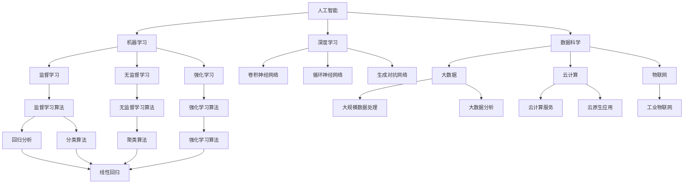
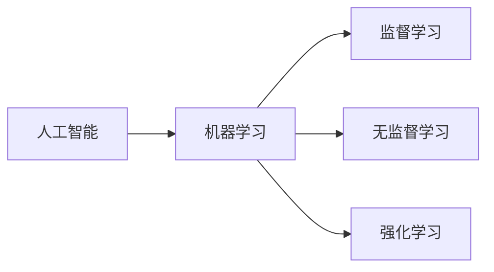
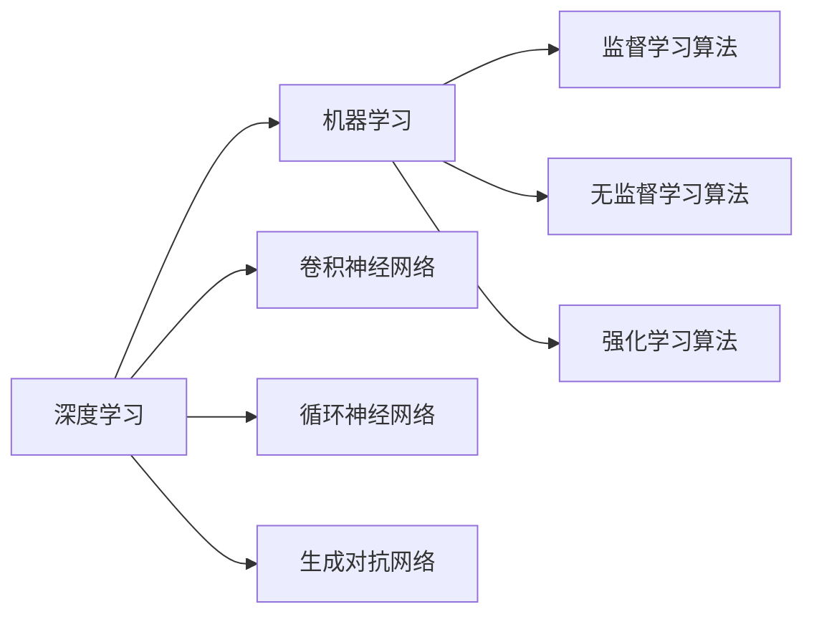
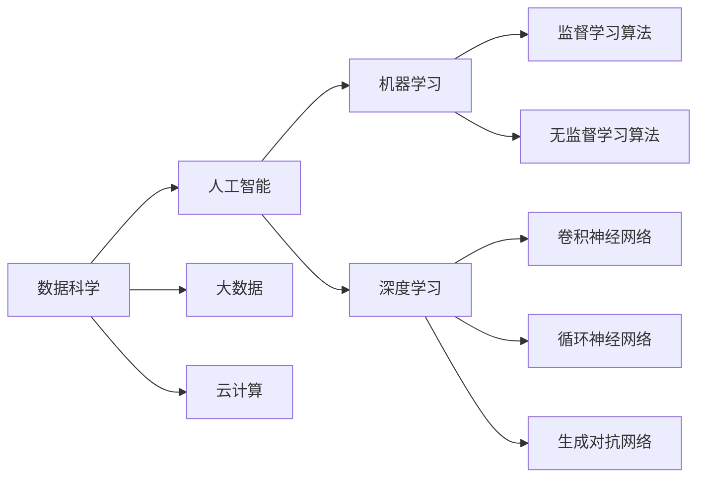

                 

# 产业变革中的AI技术应用

> 关键词：人工智能,产业变革,机器学习,深度学习,数据科学,自动化,数字化转型

## 1. 背景介绍

### 1.1 问题由来
近年来，人工智能(AI)技术迅猛发展，已经成为推动产业变革的重要力量。从制造业、农业到金融、医疗，各个行业都在经历着深刻的数字化转型。AI技术通过自动化和智能化的手段，提升了生产效率，降低了成本，创造了新的商业价值。然而，AI技术的应用也带来了新的挑战和风险，如就业问题、隐私保护、伦理道德等。本文将深入探讨AI技术在产业变革中的具体应用，分析其带来的机遇和挑战。

### 1.2 问题核心关键点
AI技术在产业变革中的应用主要集中在以下几个方面：

- 数据驱动的决策支持：利用机器学习和大数据技术，企业可以更加科学地制定经营策略和市场决策。
- 自动化和智能化生产：AI技术能够实现生产线自动化、预测性维护等，提升生产效率和产品质量。
- 智能客户服务：AI聊天机器人、语音助手等智能服务，提升了客户体验，降低了企业运营成本。
- 个性化推荐：利用推荐算法，电商、媒体、金融等行业可以实现精准营销，提升用户粘性和忠诚度。
- 新商业模式的探索：AI技术在医疗、物流、教育等领域的创新应用，催生了新的商业模式和服务模式。

AI技术的广泛应用，不仅改变了企业的生产方式和服务模式，也推动了整个社会向数字化、智能化方向发展。然而，AI技术的快速发展也带来了数据安全、隐私保护、伦理道德等诸多挑战。本文将从技术应用、伦理道德和社会影响三个层面，全面探讨AI技术在产业变革中的作用和影响。

### 1.3 问题研究意义
研究AI技术在产业变革中的应用，对于推动各行各业数字化转型、提升企业的竞争力和效率，具有重要意义。同时，通过探讨AI技术在实际应用中面临的挑战，可以帮助企业更好地应对变革，确保AI技术的健康发展。

## 2. 核心概念与联系

### 2.1 核心概念概述

为更好地理解AI技术在产业变革中的应用，本节将介绍几个密切相关的核心概念：

- 人工智能(AI)：利用机器学习、深度学习等技术，实现智能决策、自动化执行、自然语言理解等功能。
- 机器学习(ML)：通过算法和数据训练模型，使其具备一定的预测和推理能力。
- 深度学习(Deep Learning)：一种特殊类型的机器学习，通过多层神经网络实现特征提取和模式识别。
- 数据科学(Data Science)：涵盖数据采集、数据处理、数据分析和数据可视化的学科。
- 自动化(Automation)：利用技术手段，自动完成重复性、规则性工作。
- 数字化转型(Digital Transformation)：通过数字化手段，提升企业的运营效率和竞争能力。

这些核心概念之间的逻辑关系可以通过以下Mermaid流程图来展示：



这个流程图展示了几大核心概念及其之间的关系：

1. 人工智能是核心，通过机器学习、深度学习等技术实现智能决策。
2. 机器学习包括监督学习、无监督学习和强化学习。
3. 深度学习通过多层神经网络实现复杂特征提取。
4. 数据科学涵盖数据采集、处理、分析和可视化。
5. 自动化通过技术手段实现自动化执行。
6. 数字化转型通过数字化手段提升运营效率。

这些概念共同构成了AI技术在产业变革中的应用框架，使其能够在各个领域发挥智能决策和自动化执行的能力。

### 2.2 概念间的关系

这些核心概念之间存在着紧密的联系，形成了AI技术在产业变革中的完整生态系统。下面我们通过几个Mermaid流程图来展示这些概念之间的关系。

#### 2.2.1 人工智能的学习范式



这个流程图展示了人工智能的几种主要学习范式：

1. 监督学习：通过有标注数据训练模型，使其具备一定的预测能力。
2. 无监督学习：通过无标注数据训练模型，发现数据中的潜在模式和结构。
3. 强化学习：通过智能体与环境的交互，学习最优决策策略。

#### 2.2.2 深度学习与机器学习的联系



这个流程图展示了深度学习与机器学习的关系：

1. 深度学习是机器学习的一种特殊形式，通过多层神经网络实现复杂特征提取。
2. 深度学习包含卷积神经网络、循环神经网络和生成对抗网络等技术。
3. 机器学习包括监督学习、无监督学习和强化学习等算法。

#### 2.2.3 数据科学与人工智能的关系



这个流程图展示了数据科学与人工智能的关系：

1. 数据科学是人工智能的重要组成部分，涵盖数据采集、处理、分析和可视化。
2. 数据科学依赖于大数据和云计算等技术基础设施。
3. 人工智能通过机器学习和深度学习等技术实现智能决策和自动化执行。

### 2.3 核心概念的整体架构

最后，我们用一个综合的流程图来展示这些核心概念在AI技术在产业变革中的应用：

```mermaid
graph TB
    A[大数据] --> B[云计算]
    A --> C[物联网]
    B --> D[人工智能]
    D --> E[机器学习]
    D --> F[深度学习]
    E --> G[监督学习算法]
    E --> H[无监督学习算法]
    F --> I[卷积神经网络]
    F --> J[循环神经网络]
    F --> K[生成对抗网络]
    D --> L[自动化]
    D --> M[数据科学]
    L --> N[生产线自动化]
    L --> O[预测性维护]
    M --> P[智能客户服务]
    M --> Q[个性化推荐]
    L --> R[新商业模式]
    N --> S[智能制造]
    O --> T[智能运维]
    P --> U[智能客服]
    Q --> V[精准营销]
    R --> W[数字孪生]
    S --> X[智能生产]
    T --> Y[智能运维]
    U --> Z[智能客服]
    V --> AA[精准营销]
    W --> AB[数字孪生]
    X --> AC[智能制造]
    Y --> AD[智能运维]
    Z --> AE[智能客服]
    AA --> AF[精准营销]
    AB --> AG[数字孪生]
    AC --> AH[智能制造]
    AD --> AI[智能运维]
    AE --> AJ[智能客服]
    AF --> AK[精准营销]
    AG --> AL[数字孪生]
    AH --> AM[智能制造]
    AI --> AN[智能运维]
    AJ --> AO[智能客服]
    AK --> AP[精准营销]
    AL --> AQ[数字孪生]
    AM --> AR[智能制造]
    AN --> AS[智能运维]
    AO --> AT[智能客服]
    AP --> AU[精准营销]
    AQ --> AV[数字孪生]
    AR --> AW[智能制造]
    AS --> AX[智能运维]
    AT --> AY[智能客服]
    AU --> AZ[精准营销]
    AV --> BA[数字孪生]
    AW --> BB[智能制造]
    AX --> BC[智能运维]
    AY --> BD[智能客服]
    AZ --> BE[精准营销]
    BA --> BF[数字孪生]
    BB --> BG[智能制造]
    BC --> BH[智能运维]
    BD --> BI[智能客服]
    BE --> BJ[精准营销]
    BF --> BL[数字孪生]
    BG --> BM[智能制造]
    BH --> BN[智能运维]
    BI --> BO[智能客服]
    BJ --> BP[精准营销]
    BL --> BM[数字孪生]
    BM --> BN[智能制造]
    BN --> BO[智能运维]
    BP --> BQ[精准营销]
    BQ --> BR[数字孪生]
    BR --> BS[智能制造]
    BS --> BT[智能运维]
    BT --> BU[智能客服]
    BU --> BV[精准营销]
    BV --> BW[数字孪生]
    BW --> BX[智能制造]
    BX --> BY[智能运维]
    BY --> BZ[智能客服]
    BZ --> BA[精准营销]
    BA --> BC[数字孪生]
    BC --> BD[智能制造]
    BD --> BE[智能运维]
    BE --> BF[智能客服]
    BF --> BG[精准营销]
    BG --> BH[数字孪生]
    BH --> BI[智能制造]
    BI --> BJ[智能运维]
    BJ --> BK[精准营销]
    BK --> BL[数字孪生]
    BL --> BM[智能制造]
    BM --> BN[智能运维]
    BN --> BO[智能客服]
    BO --> BP[精准营销]
    BP --> BQ[数字孪生]
    BQ --> BR[智能制造]
    BR --> BS[智能运维]
    BS --> BT[智能客服]
    BT --> BU[精准营销]
    BU --> BV[数字孪生]
    BV --> BW[智能制造]
    BW --> BX[智能运维]
    BX --> BY[智能客服]
    BY --> BZ[精准营销]
    BZ --> BA[数字孪生]
    BA --> BC[数字孪生]
    BC --> BD[智能制造]
    BD --> BE[智能运维]
    BE --> BF[智能客服]
    BF --> BG[精准营销]
    BG --> BH[数字孪生]
    BH --> BI[智能制造]
    BI --> BJ[智能运维]
    BJ --> BK[精准营销]
    BK --> BL[数字孪生]
    BL --> BM[智能制造]
    BM --> BN[智能运维]
    BN --> BO[智能客服]
    BO --> BP[精准营销]
    BP --> BQ[数字孪生]
    BQ --> BR[智能制造]
    BR --> BS[智能运维]
    BS --> BT[智能客服]
    BT --> BU[精准营销]
    BU --> BV[数字孪生]
    BV --> BW[智能制造]
    BW --> BX[智能运维]
    BX --> BY[智能客服]
    BY --> BZ[精准营销]
    BZ --> BA[数字孪生]
    BA --> BC[数字孪生]
    BC --> BD[智能制造]
    BD --> BE[智能运维]
    BE --> BF[智能客服]
    BF --> BG[精准营销]
    BG --> BH[数字孪生]
    BH --> BI[智能制造]
    BI --> BJ[智能运维]
    BJ --> BK[精准营销]
    BK --> BL[数字孪生]
    BL --> BM[智能制造]
    BM --> BN[智能运维]
    BN --> BO[智能客服]
    BO --> BP[精准营销]
    BP --> BQ[数字孪生]
    BQ --> BR[智能制造]
    BR --> BS[智能运维]
    BS --> BT[智能客服]
    BT --> BU[精准营销]
    BU --> BV[数字孪生]
    BV --> BW[智能制造]
    BW --> BX[智能运维]
    BX --> BY[智能客服]
    BY --> BZ[精准营销]
    BZ --> BA[数字孪生]
    BA --> BC[数字孪生]
    BC --> BD[智能制造]
    BD --> BE[智能运维]
    BE --> BF[智能客服]
    BF --> BG[精准营销]
    BG --> BH[数字孪生]
    BH --> BI[智能制造]
    BI --> BJ[智能运维]
    BJ --> BK[精准营销]
    BK --> BL[数字孪生]
    BL --> BM[智能制造]
    BM --> BN[智能运维]
    BN --> BO[智能客服]
    BO --> BP[精准营销]
    BP --> BQ[数字孪生]
    BQ --> BR[智能制造]
    BR --> BS[智能运维]
    BS --> BT[智能客服]
    BT --> BU[精准营销]
    BU --> BV[数字孪生]
    BV --> BW[智能制造]
    BW --> BX[智能运维]
    BX --> BY[智能客服]
    BY --> BZ[精准营销]
    BZ --> BA[数字孪生]
    BA --> BC[数字孪生]
    BC --> BD[智能制造]
    BD --> BE[智能运维]
    BE --> BF[智能客服]
    BF --> BG[精准营销]
    BG --> BH[数字孪生]
    BH --> BI[智能制造]
    BI --> BJ[智能运维]
    BJ --> BK[精准营销]
    BK --> BL[数字孪生]
    BL --> BM[智能制造]
    BM --> BN[智能运维]
    BN --> BO[智能客服]
    BO --> BP[精准营销]
    BP --> BQ[数字孪生]
    BQ --> BR[智能制造]
    BR --> BS[智能运维]
    BS --> BT[智能客服]
    BT --> BU[精准营销]
    BU --> BV[数字孪生]
    BV --> BW[智能制造]
    BW --> BX[智能运维]
    BX --> BY[智能客服]
    BY --> BZ[精准营销]
    BZ --> BA[数字孪生]
    BA --> BC[数字孪生]
    BC --> BD[智能制造]
    BD --> BE[智能运维]
    BE --> BF[智能客服]
    BF --> BG[精准营销]
    BG --> BH[数字孪生]
    BH --> BI[智能制造]
    BI --> BJ[智能运维]
    BJ --> BK[精准营销]
    BK --> BL[数字孪生]
    BL --> BM[智能制造]
    BM --> BN[智能运维]
    BN --> BO[智能客服]
    BO --> BP[精准营销]
    BP --> BQ[数字孪生]
    BQ --> BR[智能制造]
    BR --> BS[智能运维]
    BS --> BT[智能客服]
    BT --> BU[精准营销]
    BU --> BV[数字孪生]
    BV --> BW[智能制造]
    BW --> BX[智能运维]
    BX --> BY[智能客服]
    BY --> BZ[精准营销]
    BZ --> BA[数字孪生]
    BA --> BC[数字孪生]
    BC --> BD[智能制造]
    BD --> BE[智能运维]
    BE --> BF[智能客服]
    BF --> BG[精准营销]
    BG --> BH[数字孪生]
    BH --> BI[智能制造]
    BI --> BJ[智能运维]
    BJ --> BK[精准营销]
    BK --> BL[数字孪生]
    BL --> BM[智能制造]
    BM --> BN[智能运维]
    BN --> BO[智能客服]
    BO --> BP[精准营销]
    BP --> BQ[数字孪生]
    BQ --> BR[智能制造]
    BR --> BS[智能运维]
    BS --> BT[智能客服]
    BT --> BU[精准营销]
    BU --> BV[数字孪生]
    BV --> BW[智能制造]
    BW --> BX[智能运维]
    BX --> BY[智能客服]
    BY --> BZ[精准营销]
    BZ --> BA[数字孪生]
    BA --> BC[数字孪生]
    BC --> BD[智能制造]
    BD --> BE[智能运维]
    BE --> BF[智能客服]
    BF --> BG[精准营销]
    BG --> BH[数字孪生]
    BH --> BI[智能制造]
    BI --> BJ[智能运维]
    BJ --> BK[精准营销]
    BK --> BL[数字孪生]
    BL --> BM[智能制造]
    BM --> BN[智能运维]
    BN --> BO[智能客服]
    BO --> BP[精准营销]
    BP --> BQ[数字孪生]
    BQ --> BR[智能制造]
    BR --> BS[智能运维]
    BS --> BT[智能客服]
    BT --> BU[精准营销]
    BU --> BV[数字孪生]
    BV --> BW[智能制造]
    BW --> BX[智能运维]
    BX --> BY[智能客服]
    BY --> BZ[精准营销]
    BZ --> BA[数字孪生]
    BA --> BC[数字孪生]
    BC --> BD[智能制造]
    BD --> BE[智能运维]
    BE --> BF[智能客服]
    BF --> BG[精准营销]
    BG --> BH[数字孪生]
    BH --> BI[智能制造]
    BI --> BJ[智能运维]
    BJ --> BK[精准营销]
    BK --> BL[数字孪生]
    BL --> BM[智能制造]
    BM --> BN[智能运维]
    BN --> BO[智能客服]
    BO --> BP[精准营销]
    BP --> BQ[数字孪生]
    BQ --> BR[智能制造]
    BR --> BS[智能运维]
    BS --> BT[智能客服]
    BT --> BU[精准营销]
    BU --> BV[数字孪生]
    BV --> BW[智能制造]
    BW --> BX[智能运维]
    BX --> BY[智能客服]
    BY --> BZ[精准营销]
    BZ --> BA[数字孪生]
    BA --> BC[数字孪生]
    BC --> BD[智能制造]
    BD --> BE[智能运维]
    BE --> BF[智能客服]
    BF --> BG[精准营销]
    BG --> BH[数字孪生]
    BH --> BI[智能制造]
    BI --> BJ[智能运维]
    BJ --> BK[精准营销]
    BK --> BL[数字孪生]
    BL --> BM[智能制造]
    BM --> BN[智能运维]
    BN --> BO[智能客服]
    BO --> BP[精准营销]
    BP --> BQ[数字孪生]
    BQ --> BR[智能制造]
    BR --> BS[智能运维]
    BS --> BT[智能客服]
    BT --> BU[精准营销]
    BU --> BV[数字孪生]
    BV --> BW[智能制造]
    BW --> BX[智能运维]
    BX --> BY[智能客服]
    BY --> BZ[精准营销]
    BZ --> BA[数字孪生]
    BA --> BC[数字孪生]
    BC --> BD[智能制造]
    BD --> BE[智能运维]
    BE --> BF[智能客服]
    BF --> BG[精准营销]
    BG --> BH[数字孪生]
    BH --> BI[智能制造]
    BI --> BJ[智能运维]
    BJ --> BK[精准营销]
    BK --> BL[数字孪生]
    BL --> BM[智能制造]
    BM --> BN[智能运维]
    BN --> BO[智能客服]
    BO --> BP[精准营销]
    BP --> BQ[数字孪生]
    BQ --> BR[智能制造]
    BR --> BS[智能运维]
    BS --> BT[智能客服]
    BT --> BU[精准营销]
    BU --> BV[数字孪生]
    BV --> BW[智能制造]
    BW --> BX[智能运维]
    BX --> BY[智能客服]
    BY --> BZ[精准营销]
    BZ --> BA[数字孪生]
    BA --> BC[数字孪生]
    BC --> BD[智能制造]
    BD --> BE[智能运维]
    BE --> BF[智能客服]
    BF --> BG[精准营销]
    BG --> BH[数字孪生]
    BH --> BI[智能制造]
    BI --> BJ[智能运维]
    BJ --> BK[精准营销]
    BK --> BL[数字孪生]
    BL --> BM[智能制造]
    BM --> BN[智能运维]
    BN --> BO[智能客服]
    BO --> BP[精准营销]
    BP --> BQ[数字孪生]
    BQ --> BR[智能制造]
    BR --> BS[智能运维]
    BS --> BT[智能客服]
    BT --> BU[精准营销]
    BU --> BV[数字孪生]
    BV --> BW[智能制造]
    BW --> BX[智能运维]
    BX --> BY[智能客服]
    BY --> BZ[精准营销]
    BZ --> BA[数字孪生]
    BA --> BC[数字孪生]
    BC --> BD[智能制造]
    BD --> BE[智能运维]
    BE --> BF[智能客服]
    BF --> BG[精准营销]
    BG --> BH[数字孪生]
    BH --> BI[智能制造]
    BI --> BJ[智能运维]
    BJ --> BK[精准营销]
    BK --> BL[数字孪生]
    BL --> BM[智能制造]
    BM --> BN[智能运维]
    BN --> BO[智能客服]
    BO --> BP[精准营销]
    BP --> BQ[数字孪生]
    BQ --> BR[智能制造]
    BR --> BS[智能运维]
    BS --> BT[智能客服]
    BT --> BU[精准营销]
    BU --> BV[数字孪生]
    BV --> BW[智能制造]
    BW --> BX[智能运维]
    BX --> BY[智能客服]
    BY --> BZ[精准营销]
    BZ --> BA[数字孪生]
    BA --> BC[数字孪生]
    BC --> BD[智能制造]
    BD --> BE[智能运维]
    BE --> BF[智能客服]
    BF --> BG[精准营销]
    BG --> BH[数字孪生]
    BH --> BI[智能制造]
    BI --> BJ[智能运维]
    BJ --> BK[精准营销]
    BK --> BL[数字孪生]
    BL --> BM[智能制造]
    BM --> BN[智能运维]
    BN --> BO[智能客服]
    BO --> BP[精准营销]
    BP --> BQ[数字孪生]
    BQ --> BR[智能制造]
    BR --> BS[智能运维]
    BS --> BT[智能客服]
    BT --> BU[精准营销]
    BU --> BV[数字孪生]
    BV --> BW[智能制造]
    BW --> BX[智能运维]
    BX --> BY[智能客服]
    BY --> BZ[精准营销]
    BZ --> BA[数字孪生]
    BA --> BC[数字孪生]
    BC --> BD[智能制造]
    BD --> BE[智能运维]
    BE --> BF[智能客服]
    BF --> BG[精准营销]
    BG --> BH[数字孪生]
    BH --> BI[智能制造]
    BI --> BJ[智能运维]
    BJ --> BK[精准营销]
    BK --> BL[数字孪生]
    BL --> BM[智能制造]
    BM --> BN[智能运维]
    BN --> BO[智能客服]
    BO --> BP[精准营销]
    BP --> BQ[数字孪生]
    BQ --> BR[智能制造]
    BR --> BS[智能运维]
    BS --> BT[智能客服]
    BT --> BU[精准营销]
    BU --> BV[数字孪生]
    BV --> BW[智能制造]
    BW --> BX[智能运维]
    BX --> BY[智能客服]
    BY --> BZ[精准营销]
    BZ --> BA[数字孪生]
    BA --> BC[数字孪生]
    BC --> BD[智能制造]
    BD --> BE[智能运维]
    BE --> BF[智能客服]
    BF --> BG[精准营销]
    BG --> BH[数字孪生]
    BH --> BI[智能制造]
    BI --> BJ[智能运维]
    BJ --> BK[精准营销]
    BK --> BL[数字孪生]
    BL --> BM[智能制造]
    BM --> BN[智能运维]
    BN --> BO[智能客服]
    BO --> BP[精准营销]
    BP --> BQ[数字孪生]
    BQ --> BR[智能制造]
    BR --> BS[智能运维]
    BS --> BT[智能客服]
    BT --> BU[精准营销]
    BU --> BV[数字孪生]
    BV --> BW[智能制造]
    BW --> BX[智能运维]
    BX --> BY[智能客服]
    BY --> BZ[精准营销]
    BZ --> BA[数字孪生]
    BA --> BC[数字孪生]
    BC --> BD[智能制造]
    BD --> BE[智能运维]
    BE --> BF[智能客服]
    BF --> BG[精准营销]
    BG --> BH[

