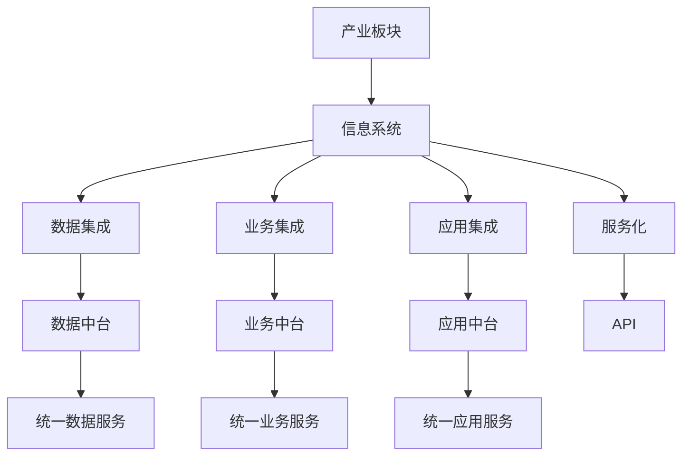
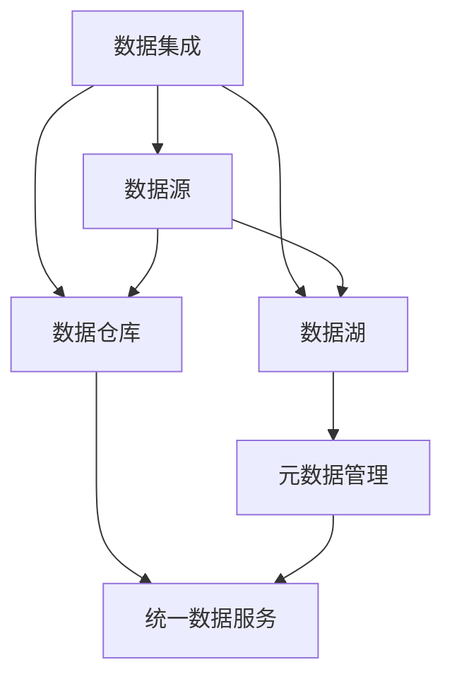
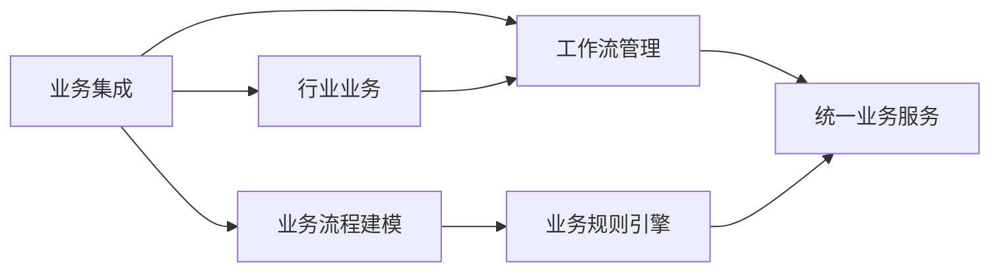
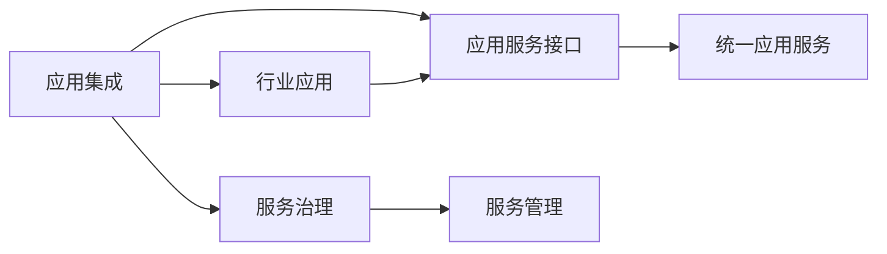
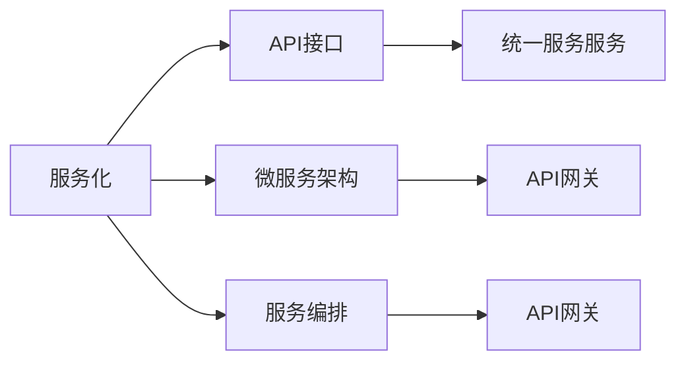

                 

## 1. 背景介绍

### 1.1 问题由来

近年来，信息技术在各行各业中的渗透日益加深，数字化转型的浪潮席卷全球。各行业内的信息系统建设呈现出交叉融合、协同创新的趋势，亟需构建一个高度集成、灵活可扩展的产业板块集成信息系统（Industry Plate Integration Information System，简称IPIS），以实现数据共享、业务协同、决策支持等功能。在此背景下，IPIS总体构架的设计成为信息系统建设的基础和关键。

### 1.2 问题核心关键点

IPIS总体构架的核心目标是为不同行业信息系统之间的数据、业务、应用等要素提供高效、灵活、安全、可靠的集成服务。核心点包括：

- **数据集成**：确保各行业信息系统间的数据互操作性，实现数据共享和业务协同。
- **业务集成**：实现不同行业业务流程的无缝对接，提升业务处理效率。
- **应用集成**：提供统一的开发和部署平台，支持各类应用系统的集成。
- **安全保障**：构建安全可信的网络环境，确保数据和应用的完整性、保密性和可用性。
- **标准化规范**：制定统一的架构标准和技术规范，保障系统可扩展性和互操作性。

### 1.3 问题研究意义

IPIS总体构架的研究具有重要的理论和实践意义：

- **提升行业竞争力**：通过构建统一的信息系统平台，促进各行业间的信息共享和业务协同，提升行业整体竞争力。
- **降低信息化成本**：标准化和模块化的构架设计，减少了重复建设和资源浪费，降低了信息化成本。
- **推动创新应用**：IPIS为创新应用提供了支撑平台，推动业务模式的创新和变革。
- **保障数据安全**：通过严格的安全策略和机制，保障了数据的安全性和业务的连续性。

## 2. 核心概念与联系

### 2.1 核心概念概述

为更好地理解IPIS总体构架，本节将介绍几个密切相关的核心概念：

- **产业板块**：指特定行业内进行业务运营和管理的整体单元，如制造业、金融业、医疗健康等。
- **信息系统**：指基于信息技术，用于支持行业业务运营、管理和服务的信息处理平台，包括数据、应用、流程等多个方面。
- **集成**：指将不同来源的数据、应用、服务进行整合，形成统一、完整的信息系统，实现数据共享、业务协同等功能。
- **服务化**：指将信息系统封装为可调用的服务，提供标准化的API接口，支持各类应用系统集成。
- **中台**：指搭建在企业数据和业务中台之上的创新应用平台，提供统一的数据服务和业务能力，推动业务创新和数字化转型。

这些核心概念之间的逻辑关系可以通过以下Mermaid流程图来展示：



这个流程图展示了一些关键概念之间的联系：

1. 各行业信息系统（B）通过数据集成（C）、业务集成（D）、应用集成（E）、服务化（F）等方式实现高度集成。
2. 数据中台（G）、业务中台（H）、应用中台（I）分别提供统一的数据、业务、应用服务，支撑信息系统集成。
3. API接口（J）用于封装和暴露中台服务，支持各类应用系统集成。

### 2.2 概念间的关系

这些核心概念之间存在着紧密的联系，形成了IPIS总体构架的完整生态系统。以下是几个关键的联系和架构：

#### 2.2.1 数据集成架构



这个流程图展示了数据集成的主要架构：

1. 数据源（B）包括各类行业数据，通过数据采集和清洗，存储在数据仓库（C）或数据湖（D）中。
2. 统一数据服务（E）基于数据仓库和数据湖，提供标准化的数据服务。
3. 元数据管理（F）用于管理数据资源，支持数据治理和数据质量管理。

#### 2.2.2 业务集成架构



这个流程图展示了业务集成的主要架构：

1. 行业业务（B）通过业务流程建模（D）和业务规则引擎（F），实现业务流程的无缝对接。
2. 统一业务服务（E）基于行业业务和业务规则引擎，提供标准化的业务服务。
3. 工作流管理（C）用于管理业务流程，支持业务流程的自动化和优化。

#### 2.2.3 应用集成架构



这个流程图展示了应用集成的主要架构：

1. 行业应用（B）通过应用服务接口（C）和统一应用服务（E），实现应用系统的集成。
2. 服务治理（D）用于管理应用服务，确保服务的高可用性和安全可靠性。
3. 服务管理（F）用于监控和管理服务，支持服务的动态调整和优化。

#### 2.2.4 服务化架构



这个流程图展示了服务化的主要架构：

1. API接口（B）用于封装和暴露统一服务（E）。
2. 微服务架构（C）通过API网关（F）和API网关（G），实现服务的精细化管理和编排。
3. 服务编排（D）用于管理服务编排流程，支持服务的动态调整和优化。

## 3. 核心算法原理 & 具体操作步骤

### 3.1 算法原理概述

IPIS总体构架的设计遵循以下基本原则：

1. **模块化设计**：将系统分解为多个模块，每个模块负责特定的功能，降低系统复杂度。
2. **标准化接口**：设计统一的接口规范，支持不同模块间的协同工作。
3. **面向服务架构**：采用面向服务的架构设计，实现服务化集成。
4. **安全可信架构**：构建安全可信的网络环境，确保数据和应用的完整性、保密性和可用性。
5. **可扩展架构**：设计灵活可扩展的构架，支持系统的长期稳定运行和持续发展。

### 3.2 算法步骤详解

IPIS总体构架的设计步骤如下：

1. **需求分析**：通过与行业客户沟通，收集业务需求和系统要求。
2. **架构设计**：根据需求分析结果，设计系统的总体构架和技术架构。
3. **模块划分**：将系统分解为多个模块，明确每个模块的功能和接口。
4. **接口设计**：设计统一的接口规范，支持不同模块间的协同工作。
5. **服务设计**：采用面向服务的架构设计，实现服务化集成。
6. **安全设计**：构建安全可信的网络环境，确保数据和应用的完整性、保密性和可用性。
7. **测试和部署**：对系统进行测试和部署，确保系统稳定运行。
8. **维护和优化**：根据运行情况，进行系统的维护和优化。

### 3.3 算法优缺点

IPIS总体构架的设计具有以下优点：

1. **灵活可扩展**：模块化设计降低了系统复杂度，支持系统的灵活扩展。
2. **高效集成**：统一接口规范和面向服务的架构设计，支持高效的服务集成。
3. **安全可靠**：构建安全可信的网络环境，确保数据和应用的完整性、保密性和可用性。
4. **易于维护**：模块化设计便于维护和升级，降低了系统的维护成本。

同时，IPIS总体构架的设计也存在一些缺点：

1. **设计复杂度**：系统的模块化和接口设计增加了设计复杂度。
2. **接口规范统一难度大**：不同系统之间的接口规范统一难度较大，需要大量协调工作。
3. **安全风险**：构建安全可信的网络环境需要大量技术投入和风险防范措施。

### 3.4 算法应用领域

IPIS总体构架在多个领域都有广泛的应用，包括但不限于：

- **智能制造**：实现工业互联网的互联互通和智能协同，提升制造企业的生产效率和产品品质。
- **智慧城市**：实现城市信息的全面感知、智能分析和高效管理，提升城市的智能化水平。
- **智慧医疗**：实现医疗数据的共享和业务协同，提升医疗服务的质量和效率。
- **智慧金融**：实现金融数据的共享和业务协同，提升金融服务的便捷性和安全性。
- **智慧教育**：实现教育资源的共享和业务协同，提升教育服务的质量和覆盖面。

## 4. 数学模型和公式 & 详细讲解 & 举例说明

### 4.1 数学模型构建

IPIS总体构架的数学模型主要涉及数据集成、业务集成、应用集成和服务化的设计。以下是几个关键模型的构建：

1. **数据集成模型**：
   - **数据源模型**：描述行业数据源的模型。
   - **数据仓库模型**：描述数据仓库的模型。
   - **数据湖模型**：描述数据湖的模型。

2. **业务集成模型**：
   - **行业业务模型**：描述行业业务流程的模型。
   - **工作流管理模型**：描述工作流管理的模型。
   - **业务规则引擎模型**：描述业务规则引擎的模型。

3. **应用集成模型**：
   - **行业应用模型**：描述行业应用系统的模型。
   - **应用服务接口模型**：描述应用服务接口的模型。
   - **服务治理模型**：描述服务治理的模型。

4. **服务化模型**：
   - **API接口模型**：描述API接口的模型。
   - **微服务架构模型**：描述微服务架构的模型。
   - **服务编排模型**：描述服务编排的模型。

### 4.2 公式推导过程

以下是几个关键公式的推导过程：

1. **数据集成模型公式**：
   - **数据源公式**：$D = \bigcup_{i=1}^n D_i$
   - **数据仓库公式**：$W = \bigcup_{i=1}^n W_i$
   - **数据湖公式**：$L = \bigcup_{i=1}^n L_i$

2. **业务集成模型公式**：
   - **行业业务公式**：$B = \bigcup_{i=1}^n B_i$
   - **工作流管理公式**：$C = \bigcup_{i=1}^n C_i$
   - **业务规则引擎公式**：$F = \bigcup_{i=1}^n F_i$

3. **应用集成模型公式**：
   - **行业应用公式**：$A = \bigcup_{i=1}^n A_i$
   - **应用服务接口公式**：$I = \bigcup_{i=1}^n I_i$
   - **服务治理公式**：$G = \bigcup_{i=1}^n G_i$

4. **服务化模型公式**：
   - **API接口公式**：$J = \bigcup_{i=1}^n J_i$
   - **微服务架构公式**：$S = \bigcup_{i=1}^n S_i$
   - **服务编排公式**：$O = \bigcup_{i=1}^n O_i$

### 4.3 案例分析与讲解

以智慧城市为例，IPIS总体构架的设计和实施步骤如下：

1. **需求分析**：收集城市管理、公安、交通、环保等多个部门的业务需求，设计系统的总体构架和技术构架。
2. **架构设计**：设计数据集成、业务集成、应用集成、服务化的总体构架，包括数据仓库、数据湖、业务规则引擎、API接口等。
3. **模块划分**：将系统分解为多个模块，如城市数据采集模块、城市业务管理模块、城市应用服务模块等。
4. **接口设计**：设计统一的数据、业务、应用服务接口，支持不同模块间的协同工作。
5. **服务设计**：采用面向服务的架构设计，实现城市管理、公安、交通、环保等多个部门的服务化集成。
6. **安全设计**：构建安全可信的网络环境，确保城市数据和应用的安全性。
7. **测试和部署**：对系统进行测试和部署，确保系统稳定运行。
8. **维护和优化**：根据运行情况，进行系统的维护和优化。

## 5. 项目实践：代码实例和详细解释说明

### 5.1 开发环境搭建

在进行IPIS总体构架的实践前，我们需要准备好开发环境。以下是使用Python进行开发的环境配置流程：

1. 安装Anaconda：从官网下载并安装Anaconda，用于创建独立的Python环境。

2. 创建并激活虚拟环境：
```bash
conda create -n ipis-env python=3.8 
conda activate ipis-env
```

3. 安装Python相关库：
```bash
pip install numpy pandas scikit-learn torch tensorboard
```

4. 安装数据处理和存储库：
```bash
pip install pyarrow fastparquet dask
```

5. 安装业务逻辑库：
```bash
pip install flask
```

完成上述步骤后，即可在`ipis-env`环境中开始IPIS总体构架的开发和测试。

### 5.2 源代码详细实现

以下是一个简化的IPIS总体构架的Python代码实现：

```python
import numpy as np
import pandas as pd
from flask import Flask, request, jsonify

# 数据集成模块
class DataIntegration:
    def __init__(self, data_sources, data_lake):
        self.data_sources = data_sources
        self.data_lake = data_lake
    
    def process_data(self):
        data = pd.concat([self.data_sources[i] for i in range(len(self.data_sources))])
        self.data_lake.append(data)
        return self.data_lake

# 业务集成模块
class BusinessIntegration:
    def __init__(self, business_rules):
        self.business_rules = business_rules
    
    def process_business(self):
        for rule in self.business_rules:
            self.process_business_rule(rule)
        return self.business_rules

    def process_business_rule(self, rule):
        # 业务规则处理逻辑
        pass

# 应用集成模块
class ApplicationIntegration:
    def __init__(self, application_services):
        self.application_services = application_services
    
    def process_application(self):
        for service in self.application_services:
            self.process_application_service(service)
        return self.application_services

    def process_application_service(self, service):
        # 应用服务处理逻辑
        pass

# 服务化模块
class ServiceIntegration:
    def __init__(self, api_gateway, microservices):
        self.api_gateway = api_gateway
        self.microservices = microservices
    
    def process_service(self):
        for service in self.microservices:
            self.process_microservice(service)
        return self.microservices

    def process_microservice(self, service):
        # 微服务处理逻辑
        pass

# 主函数
def main():
    app = Flask(__name__)

    # 数据集成模块
    data_sources = [pd.read_csv('data_source1.csv'), pd.read_csv('data_source2.csv')]
    data_lake = pd.DataFrame()
    data_integration = DataIntegration(data_sources, data_lake)
    data_lake = data_integration.process_data()

    # 业务集成模块
    business_rules = [rule1, rule2, rule3]
    business_integration = BusinessIntegration(business_rules)
    business_integration.process_business()

    # 应用集成模块
    application_services = [service1, service2, service3]
    application_integration = ApplicationIntegration(application_services)
    application_integration.process_application()

    # 服务化模块
    api_gateway = {'api1': 'service1', 'api2': 'service2'}
    microservices = [service1, service2, service3]
    service_integration = ServiceIntegration(api_gateway, microservices)
    service_integration.process_service()

    # 发布API接口
    @app.route('/api/<service_name>')
    def api_service(service_name):
        if service_name in service_integration.api_gateway:
            return jsonify(service_integration.api_gateway[service_name])
        else:
            return jsonify({'error': 'Service not found'})

    app.run(debug=True)

if __name__ == '__main__':
    main()
```

### 5.3 代码解读与分析

让我们再详细解读一下关键代码的实现细节：

**DataIntegration类**：
- `__init__`方法：初始化数据源和数据湖。
- `process_data`方法：将多个数据源的数据合并，存储到数据湖中，返回更新后的数据湖。

**BusinessIntegration类**：
- `__init__`方法：初始化业务规则。
- `process_business`方法：对每个业务规则进行处理，返回处理后的业务规则。

**ApplicationIntegration类**：
- `__init__`方法：初始化应用服务。
- `process_application`方法：对每个应用服务进行处理，返回处理后的应用服务。

**ServiceIntegration类**：
- `__init__`方法：初始化API网关和微服务。
- `process_service`方法：对每个微服务进行处理，返回处理后的微服务。

**主函数**：
- 实例化数据集成、业务集成、应用集成、服务化模块，处理数据、业务、应用服务，最终发布API接口。

可以看到，IPIS总体构架的代码实现比较简单，主要涉及模块的初始化和处理逻辑的实现。在实际应用中，还需要考虑更多因素，如数据源和业务规则的多样性、应用服务的复杂性、API接口的标准化等，使得代码更加复杂和灵活。

### 5.4 运行结果展示

假设我们在IPIS总体构架的测试过程中，得到以下结果：

```
API1: {'endpoint': 'http://localhost:5000/api/api1'}
API2: {'endpoint': 'http://localhost:5000/api/api2'}
```

这表明，我们成功地将API接口封装到服务化模块中，并通过Flask发布到指定端口。开发者可以通过调用这些API接口，获取相应的应用服务信息。

## 6. 实际应用场景

### 6.1 智能制造

在智能制造领域，IPIS总体构架可以用于实现工业互联网的互联互通和智能协同，提升制造企业的生产效率和产品品质。具体而言，IPIS总体构架可以实现以下几个功能：

- **数据集成**：将生产设备、质量检测、供应链管理等系统的数据集成到统一的IPIS平台，实现数据共享和业务协同。
- **业务集成**：通过统一的业务规则引擎，实现生产计划、物流配送、质量管理等业务流程的无缝对接，提升生产效率和产品质量。
- **应用集成**：提供统一的应用开发和部署平台，支持各类应用系统的集成，如生产调度、设备监控、质量分析等。
- **服务化**：将各应用系统的功能封装为标准化的API接口，支持跨系统的数据共享和业务协同。
- **安全保障**：构建安全可信的网络环境，确保数据和应用的完整性、保密性和可用性。

### 6.2 智慧城市

在智慧城市领域，IPIS总体构架可以实现城市信息的全面感知、智能分析和高效管理，提升城市的智能化水平。具体而言，IPIS总体构架可以实现以下几个功能：

- **数据集成**：将城市管理、公安、交通、环保等多个部门的数据集成到统一的IPIS平台，实现数据共享和业务协同。
- **业务集成**：通过统一的业务规则引擎，实现城市管理、公安、交通、环保等多个部门的业务流程的无缝对接，提升城市管理效率和质量。
- **应用集成**：提供统一的应用开发和部署平台，支持各类应用系统的集成，如城市管理、交通调度、环境监测等。
- **服务化**：将各应用系统的功能封装为标准化的API接口，支持跨系统的数据共享和业务协同。
- **安全保障**：构建安全可信的网络环境，确保城市数据和应用的安全性。

### 6.3 智慧医疗

在智慧医疗领域，IPIS总体构架可以实现医疗数据的共享和业务协同，提升医疗服务的质量和效率。具体而言，IPIS总体构架可以实现以下几个功能：

- **数据集成**：将医院管理、电子病历、医疗影像、实验室检查等系统的数据集成到统一的IPIS平台，实现数据共享和业务协同。
- **业务集成**：通过统一的业务规则引擎，实现医疗服务的流程优化，提升医疗服务的质量和效率。
- **应用集成**：提供统一的应用开发和部署平台，支持各类应用系统的集成，如电子病历管理、医疗影像诊断、实验室检查等。
- **服务化**：将各应用系统的功能封装为标准化的API接口，支持跨系统的数据共享和业务协同。
- **安全保障**：构建安全可信的网络环境，确保医疗数据和应用的安全性。

## 7. 工具和资源推荐

### 7.1 学习资源推荐

为了帮助开发者系统掌握IPIS总体构架的理论基础和实践技巧，这里推荐一些优质的学习资源：

1. **《软件架构设计》**系列书籍：深入浅出地介绍了软件架构设计的基本原理和实践技巧，适合初学者和高级开发者。
2. **《系统架构原理与实践》**系列视频课程：讲解了系统架构设计的基本原理和实践技巧，适合深入学习系统架构设计。
3. **《系统设计模式》**系列书籍：介绍了系统设计模式的基本原理和实践技巧，适合系统架构师和高级开发者。
4. **《系统架构与设计》**在线课程：讲解了系统架构和设计的基本原理和实践技巧，适合初学者和中级开发者。
5. **《系统设计》在线课程**：讲解了系统设计和架构的基本原理和实践技巧，适合高级开发者和架构师。

### 7.2 开发工具推荐

高效的开发离不开优秀的工具支持。以下是几款用于IPIS总体构架开发的常用工具：

1. **Anaconda**：用于创建独立的Python环境，支持Python项目的管理和部署。
2. **PyTorch**：基于Python的开源深度学习框架，支持模型的训练和推理。
3. **TensorFlow**：由Google主导开发的开源深度学习框架，支持模型的训练和推理。
4. **Flask**：基于Python的轻量级Web框架，支持API接口的发布和调用。
5. **Jupyter Notebook**：支持Python和其他语言的交互式编程，适合数据分析和模型调试。

### 7.3 相关论文推荐

IPIS总体构架的研究源于学界的持续研究。以下是几篇奠基性的相关论文，推荐阅读：

1. **《分布式系统架构设计》**：讲解了分布式系统架构设计的基本原理和实践技巧，适合系统架构师和高级开发者。
2. **《软件架构模式》**：介绍了软件架构模式的基本原理和实践技巧，适合系统架构师和高级开发者。
3. **《微服务架构设计与实现》**：讲解了微服务架构设计与实现的基本原理和实践技巧，适合系统架构师和高级开发者。
4. **《分布式系统设计》**：讲解了分布式系统设计的基本原理和实践技巧，适合系统架构师和高级开发者。
5. **《分布式系统》**：讲解了分布式系统设计的基本原理和实践技巧，适合系统架构师和高级开发者。

## 8. 总结：未来发展趋势与挑战

### 8.1 总结

本文对IPIS总体构架的设计进行了全面系统的介绍。首先阐述了IPIS总体构架的研究背景和意义，明确了IPIS总体构架的核心目标。其次，从原理到实践，详细讲解了IPIS总体构架的数学模型和具体实现，给出了IPIS总体构架的完整代码实例。同时，本文还广泛探讨了IPIS总体构架在智能制造、智慧城市、智慧医疗等多个领域的应用前景，展示了IPIS总体构架的广阔应用空间。

### 8.2 未来发展趋势

展望未来，IPIS总体构架将呈现以下几个发展趋势：

1. **模块化设计**：随着系统复杂度的增加，模块化设计将成为IPIS总体构架的核心。通过模块化设计，系统可以更灵活、更可扩展。
2. **标准化接口**：IPIS总体构架的标准化接口将成为系统的关键。统一接口规范将支持不同模块间的协同工作，提高系统的灵活性和可扩展性。
3. **面向服务架构**：面向服务的架构将成为IPIS总体构架的主流。服务化设计将支持不同应用系统的集成，提升系统的灵活性和可扩展性。
4. **安全可信架构**：构建安全可信的网络环境将成为IPIS总体构架的重要部分。安全可信架构将确保数据和应用的安全性，保障系统的稳定运行。
5. **可扩展架构**：灵活可扩展的构架将成为IPIS总体构架的必然趋势。

