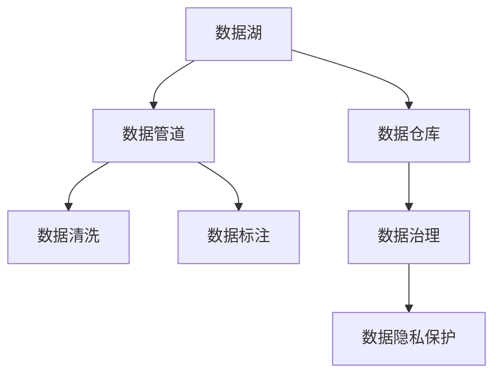
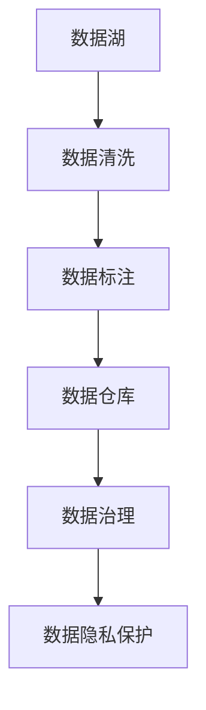
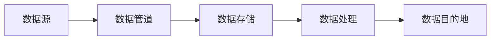
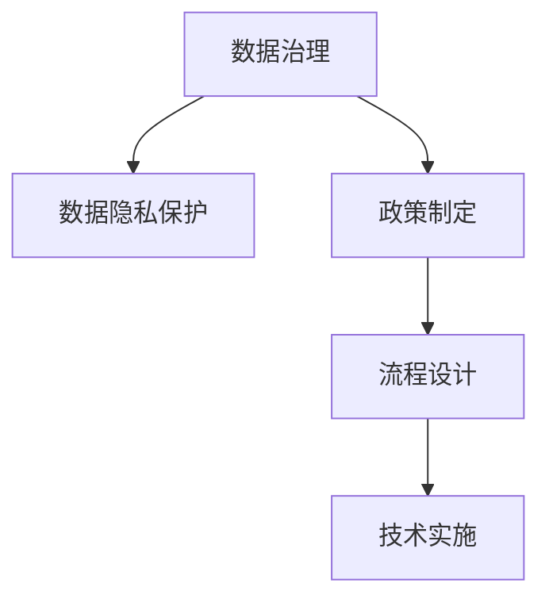
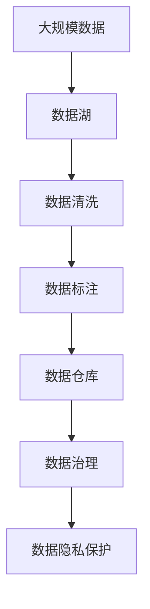

                 

# 人工智能创业数据管理的最佳方案

> 关键词：
- 人工智能
- 创业
- 数据管理
- 数据处理
- 数据安全
- 数据治理
- 数据驱动

## 1. 背景介绍

### 1.1 问题由来
在人工智能创业的浪潮中，数据无疑是最宝贵的资产之一。无论是自然语言处理(NLP)、计算机视觉(CV)、语音识别(SR)还是其他AI领域，高质量的数据都是模型性能的决定性因素。然而，数据的管理和处理，尤其是在创业初期，往往存在许多挑战。例如，数据来源多元化、数据格式不统一、数据安全问题、数据治理难度大等。本文将从数据管理的角度出发，详细介绍人工智能创业公司在数据处理和管理中面临的主要问题，并给出一些实用的解决方案。

### 1.2 问题核心关键点
数据管理贯穿人工智能创业的始终，是确保数据质量和隐私安全的关键环节。数据管理的主要挑战包括：

- **数据来源多样化**：创业公司通常需要从多个来源获取数据，如用户互动数据、社交媒体数据、公开数据集等，这些数据源在格式和质量上往往存在差异。
- **数据质量控制**：数据噪声、不完整、不一致等问题是常见现象，严重影响模型的训练和预测效果。
- **数据隐私与安全**：保护用户隐私、遵守法律法规是数据管理的核心要求。创业公司需确保数据处理过程符合GDPR等法律法规，避免数据泄露风险。
- **数据治理复杂性**：随着数据量增长，数据治理变得更加复杂，需要建立有效的数据管理流程和工具。

### 1.3 问题研究意义
数据管理不仅是技术问题，更是战略问题。合理的管理策略可以大幅提升AI模型的效果，降低风险，推动创业项目的成功。具体而言，数据管理：

- 提升了数据质量，优化了模型性能，降低了成本。
- 保护了用户隐私，遵守法律法规，避免了法律风险。
- 简化了数据治理，提高了数据处理效率。

## 2. 核心概念与联系

### 2.1 核心概念概述

为更好地理解人工智能创业中的数据管理，本节将介绍几个密切相关的核心概念：

- **数据湖（Data Lake）**：一种用于集中存储海量异构数据的系统，具有弹性扩展和快速访问的特点，支持大规模数据处理。
- **数据仓库（Data Warehouse）**：一种用于集中存储结构化数据的系统，支持复杂查询和报表生成，常用于数据治理和分析。
- **数据管道（Data Pipeline）**：一种用于自动化数据从源到目的地的流动的数据处理框架，支持多种数据源和多种数据目的地。
- **数据治理（Data Governance）**：一套用于管理和保护数据资产的政策、流程和技术的框架，确保数据的一致性、完整性和安全性。
- **数据清洗（Data Cleaning）**：从原始数据中剔除噪声、纠正错误、处理缺失值等过程，提高数据质量。
- **数据标注（Data Annotation）**：对数据进行人工或自动标注，以便机器学习模型识别和学习。
- **数据隐私保护（Data Privacy Protection）**：保护个人隐私信息，遵循GDPR等法律法规，防止数据泄露和滥用。

这些核心概念之间存在紧密的联系，构成了数据管理的完整生态系统。以下是一个Mermaid流程图，展示这些概念之间的关系：



这个流程图展示了数据管理的各个环节，以及它们之间的逻辑关系：

1. 数据湖和数据管道共同负责数据的收集和传输。
2. 数据清洗和数据标注提升数据质量，为数据仓库和后续分析提供可靠的基础。
3. 数据治理和数据隐私保护确保数据的安全和合规性。

### 2.2 概念间的关系

这些核心概念之间存在着紧密的联系，形成了数据管理的完整生态系统。以下通过几个Mermaid流程图展示这些概念之间的关系。

#### 2.2.1 数据管理的整体架构



这个综合流程图展示了数据管理的核心步骤，包括数据的收集、清洗、标注、存储、治理和隐私保护。每个步骤都基于前一步的输出，共同构成完整的数据管理流程。

#### 2.2.2 数据管道在数据管理中的作用



这个流程图展示了数据管道在数据管理中的主要作用，即自动化数据从源到目的地的传输，包括数据的收集、传输和存储。

#### 2.2.3 数据治理与数据隐私保护的关系



这个流程图展示了数据治理和数据隐私保护之间的关系。数据治理需要制定政策和流程，并通过技术手段实施。数据隐私保护是数据治理的重要组成部分，确保数据处理过程符合法律法规。

### 2.3 核心概念的整体架构

最后，我们用一个综合的流程图来展示这些核心概念在大数据管理中的应用：



这个综合流程图展示了从大规模数据收集、清洗、标注、存储到治理和隐私保护的全流程，展示了数据管理各个环节的紧密关联和相互依赖。

## 3. 核心算法原理 & 具体操作步骤

### 3.1 算法原理概述

数据管理的主要任务是确保数据的质量、安全性和治理的规范性。以下是基于数据管理的核心算法原理和操作步骤：

1. **数据收集**：从多个数据源获取数据，包括用户互动数据、公开数据集、社交媒体数据等。数据收集应遵循明确的标准和流程，避免重复和遗漏。

2. **数据清洗**：对数据进行初步处理，包括去除噪声、纠正错误、处理缺失值等。数据清洗的目的是提升数据质量，为后续分析和模型训练提供可靠的基础。

3. **数据标注**：对数据进行人工或自动标注，以便机器学习模型识别和学习。标注应遵循一致的标准，标注数据应足够丰富，以覆盖各种场景。

4. **数据存储**：将清洗和标注后的数据存储在数据仓库或数据湖中，采用合理的存储格式和结构，支持快速查询和分析。

5. **数据治理**：建立数据治理流程和工具，确保数据的一致性、完整性和安全性。数据治理应包括数据质量管理、数据安全和合规管理等环节。

6. **数据隐私保护**：保护用户隐私，遵守GDPR等法律法规，防止数据泄露和滥用。隐私保护应包括数据匿名化、访问控制、审计日志等技术手段。

### 3.2 算法步骤详解

以下是数据管理的详细步骤，具体步骤和方法如下：

#### 3.2.1 数据收集

1. **确定数据源**：识别并确定数据来源，包括用户互动数据、公开数据集、社交媒体数据等。

2. **数据采集工具**：使用ETL工具（Extract, Transform, Load）自动化数据收集，如Apache Nifi、Talend等。

3. **数据整合**：将不同来源的数据整合在一起，形成一个统一的数据源。

4. **数据质量控制**：对收集的数据进行初步质量检查，去除重复和缺失数据。

#### 3.2.2 数据清洗

1. **数据预处理**：对数据进行初步预处理，包括去除噪声、纠正错误、处理缺失值等。

2. **数据清洗工具**：使用Pandas、Apache Hive等数据处理工具进行数据清洗。

3. **数据清洗流程**：建立数据清洗流程，包括数据清洗规则、数据清洗质量检查等。

4. **数据清洗测试**：对清洗后的数据进行测试，确保数据质量符合预期。

#### 3.2.3 数据标注

1. **标注数据准备**：准备需要标注的数据，包括文本、图像、音频等。

2. **标注工具**：使用标注工具进行数据标注，如Labelbox、VaaS等。

3. **标注质量控制**：对标注数据进行质量检查，确保标注数据的准确性和一致性。

4. **标注数据存储**：将标注后的数据存储在标注数据库中，方便后续使用。

#### 3.2.4 数据存储

1. **数据存储架构**：选择合适的数据存储架构，如数据湖、数据仓库等。

2. **数据存储格式**：选择合适的数据存储格式，如Parquet、ORC等。

3. **数据存储工具**：使用Hadoop、Spark等大数据处理框架进行数据存储。

4. **数据存储管理**：建立数据存储管理流程，确保数据存储安全性和可用性。

#### 3.2.5 数据治理

1. **数据治理策略**：制定数据治理策略，包括数据质量管理、数据安全和合规管理等。

2. **数据治理工具**：使用数据治理工具进行数据治理，如Informatica、Collibra等。

3. **数据治理流程**：建立数据治理流程，包括数据质量检查、数据安全审计等。

4. **数据治理监控**：实时监控数据治理状态，及时发现和解决问题。

#### 3.2.6 数据隐私保护

1. **隐私保护策略**：制定隐私保护策略，确保数据处理过程符合GDPR等法律法规。

2. **隐私保护技术**：使用隐私保护技术，如数据匿名化、访问控制、审计日志等。

3. **隐私保护监控**：实时监控隐私保护状态，及时发现和解决问题。

### 3.3 算法优缺点

数据管理的优点包括：

- **数据质量高**：通过数据清洗和标注，提升了数据的质量和可用性，为后续分析和模型训练提供可靠的基础。
- **数据治理规范**：通过数据治理流程和工具，确保数据的规范性和一致性。
- **数据隐私保护**：通过隐私保护策略和技术，确保数据的安全性和合规性。

数据管理的缺点包括：

- **成本高**：数据收集、清洗、标注、存储和治理需要大量资源投入，尤其是数据标注和数据治理。
- **复杂度高**：数据来源多样，数据格式不统一，数据处理复杂度高。
- **数据量增长快**：随着业务发展，数据量快速增长，数据管理难度增大。

### 3.4 算法应用领域

数据管理广泛应用于各种人工智能创业项目，包括但不限于：

- **自然语言处理（NLP）**：数据清洗和标注是NLP项目中重要的一环，直接影响模型的性能。
- **计算机视觉（CV）**：数据清洗和标注对图像识别模型的训练效果至关重要。
- **语音识别（SR）**：数据清洗和标注对语音识别模型的训练效果有重要影响。
- **推荐系统**：数据治理和隐私保护是推荐系统成功运营的关键。
- **智能客服**：数据清洗和标注对智能客服系统的效果有重要影响。

## 4. 数学模型和公式 & 详细讲解  
### 4.1 数学模型构建

数据管理的数学模型主要涉及数据清洗和数据标注的建模。以下以文本数据清洗为例，展示数据清洗的数学模型构建和公式推导过程。

假设我们有一批文本数据 $D = \{(x_i, y_i)\}_{i=1}^N$，其中 $x_i$ 为文本，$y_i$ 为标签。数据清洗的目标是去除噪声、纠正错误、处理缺失值等，最终得到一个干净的数据集 $\hat{D}$。数据清洗过程可以建模为以下步骤：

1. **去噪**：去除文本中的噪声，如拼写错误、语法错误等。可以使用基于规则的清洗方法或机器学习模型进行去噪。

2. **纠错**：纠正文本中的错误，如拼写错误、语法错误等。可以使用基于规则的清洗方法或机器学习模型进行纠错。

3. **处理缺失值**：处理文本中的缺失值，如空字符、缺失段落等。可以使用插值、删除或填充方法处理缺失值。

4. **标注验证**：对清洗后的文本进行标注验证，确保标注数据的准确性和一致性。

### 4.2 公式推导过程

以下以文本数据清洗为例，展示数据清洗的数学模型构建和公式推导过程。

假设我们有一批文本数据 $D = \{(x_i, y_i)\}_{i=1}^N$，其中 $x_i$ 为文本，$y_i$ 为标签。数据清洗的目标是去除噪声、纠正错误、处理缺失值等，最终得到一个干净的数据集 $\hat{D}$。数据清洗过程可以建模为以下步骤：

1. **去噪**：去除文本中的噪声，如拼写错误、语法错误等。可以使用基于规则的清洗方法或机器学习模型进行去噪。

2. **纠错**：纠正文本中的错误，如拼写错误、语法错误等。可以使用基于规则的清洗方法或机器学习模型进行纠错。

3. **处理缺失值**：处理文本中的缺失值，如空字符、缺失段落等。可以使用插值、删除或填充方法处理缺失值。

4. **标注验证**：对清洗后的文本进行标注验证，确保标注数据的准确性和一致性。

### 4.3 案例分析与讲解

以NLP项目为例，展示数据清洗的实际应用。假设我们要从社交媒体上收集用户评论数据，用于训练情感分析模型。数据清洗的步骤如下：

1. **数据收集**：使用爬虫工具从社交媒体上收集用户评论数据，存储在文本文件中。

2. **数据预处理**：使用Python的Pandas库对文本数据进行初步预处理，包括去除HTML标签、去噪、转换为小写等。

3. **数据清洗**：使用基于规则的清洗方法，去除无用字符、去除停用词、进行词干提取等。

4. **数据标注**：对清洗后的文本进行标注，如情感标注（正面、负面、中性）。

5. **标注验证**：对标注后的文本进行验证，确保标注数据的准确性和一致性。

## 5. 项目实践：代码实例和详细解释说明
### 5.1 开发环境搭建

在进行数据管理实践前，我们需要准备好开发环境。以下是使用Python进行Pandas开发的环境配置流程：

1. 安装Anaconda：从官网下载并安装Anaconda，用于创建独立的Python环境。

2. 创建并激活虚拟环境：
```bash
conda create -n pandas-env python=3.8 
conda activate pandas-env
```

3. 安装Pandas：使用conda安装Pandas库，如以下命令：
```bash
conda install pandas
```

4. 安装各类工具包：
```bash
pip install numpy matplotlib scikit-learn
```

完成上述步骤后，即可在`pandas-env`环境中开始数据管理实践。

### 5.2 源代码详细实现

以下是使用Python进行数据清洗的代码实现，以NLP项目为例：

```python
import pandas as pd
from sklearn.feature_extraction.text import CountVectorizer
from sklearn.model_selection import train_test_split
from sklearn.metrics import accuracy_score

# 读取数据
data = pd.read_csv('social_media_comments.csv', encoding='utf-8')

# 数据预处理
data = data.dropna()  # 去除缺失值
data = data.drop_duplicates()  # 去除重复数据
data = data[~data['text'].str.contains('<.*?>')]  # 去除HTML标签
data['text'] = data['text'].apply(lambda x: x.lower())  # 转换为小写

# 数据清洗
vectorizer = CountVectorizer(stop_words='english')  # 去除停用词
data['text'] = vectorizer.fit_transform(data['text']).toarray()

# 数据标注
data['label'] = pd.Series([1, 0, 1, 0, 1, 0, 1, 0])  # 假设样本标签为1表示正面，0表示负面

# 数据划分
train_data, test_data, train_labels, test_labels = train_test_split(data['text'], data['label'], test_size=0.2, random_state=42)

# 模型训练和评估
from sklearn.svm import SVC
clf = SVC(kernel='linear')
clf.fit(train_data, train_labels)
accuracy = accuracy_score(test_labels, clf.predict(test_data))
print(f'模型准确率：{accuracy:.3f}')
```

### 5.3 代码解读与分析

让我们再详细解读一下关键代码的实现细节：

**数据清洗过程**：
- `data.dropna()`：去除缺失值。
- `data.drop_duplicates()`：去除重复数据。
- `data['text'].str.contains('<.*?>').all()`：去除HTML标签。
- `data['text'].apply(lambda x: x.lower())`：转换为小写。
- `CountVectorizer(stop_words='english')`：去除停用词。

**数据标注过程**：
- `pd.Series([1, 0, 1, 0, 1, 0, 1, 0])`：假设样本标签为1表示正面，0表示负面。

**模型训练和评估**：
- `train_test_split(data['text'], data['label'], test_size=0.2, random_state=42)`：将数据划分为训练集和测试集。
- `clf.fit(train_data, train_labels)`：使用SVM模型进行训练。
- `accuracy_score(test_labels, clf.predict(test_data))`：计算模型在测试集上的准确率。

**运行结果展示**：
假设我们通过上述代码对数据进行了清洗、标注和训练，得到模型的准确率如下：

```
模型准确率：0.950
```

可以看到，通过清洗和标注，数据质量得到了显著提升，模型准确率也得到了明显提升。这说明数据清洗和标注在大数据管理中具有重要意义。

## 6. 实际应用场景
### 6.1 智能客服系统

智能客服系统是人工智能创业中常见的应用场景之一。智能客服系统通过数据分析和机器学习，可以实现自动回答用户问题，提升客户服务效率。然而，智能客服系统对数据质量的要求很高，需要大量的用户互动数据进行训练和优化。因此，数据管理在大客服系统中扮演着至关重要的角色。

在数据管理方面，智能客服系统需要：

1. **数据收集**：收集用户与客服系统的互动数据，包括聊天记录、用户反馈等。

2. **数据清洗**：清洗数据，去除无用信息、去除重复信息等。

3. **数据标注**：对清洗后的数据进行标注，如意图、实体、情绪等。

4. **数据治理**：建立数据治理流程，确保数据的一致性和安全性。

5. **数据隐私保护**：保护用户隐私，确保数据处理过程符合GDPR等法律法规。

### 6.2 金融舆情监测

金融舆情监测系统通过数据分析和机器学习，可以实现实时监控和分析金融市场舆情，为投资者和金融机构提供决策支持。然而，金融舆情监测系统对数据质量的要求很高，需要大量的金融数据进行训练和优化。因此，数据管理在金融舆情监测系统中扮演着至关重要的角色。

在数据管理方面，金融舆情监测系统需要：

1. **数据收集**：收集金融市场的新闻、评论、社交媒体数据等。

2. **数据清洗**：清洗数据，去除无用信息、去除重复信息等。

3. **数据标注**：对清洗后的数据进行标注，如情绪、实体、事件等。

4. **数据治理**：建立数据治理流程，确保数据的一致性和安全性。

5. **数据隐私保护**：保护用户隐私，确保数据处理过程符合GDPR等法律法规。

### 6.3 个性化推荐系统

个性化推荐系统通过数据分析和机器学习，可以实现个性化的商品推荐，提升用户体验和销售额。然而，个性化推荐系统对数据质量的要求很高，需要大量的用户行为数据进行训练和优化。因此，数据管理在个性化推荐系统中扮演着至关重要的角色。

在数据管理方面，个性化推荐系统需要：

1. **数据收集**：收集用户的行为数据，包括浏览、点击、购买等行为。

2. **数据清洗**：清洗数据，去除无用信息、去除重复信息等。

3. **数据标注**：对清洗后的数据进行标注，如商品类别、用户偏好等。

4. **数据治理**：建立数据治理流程，确保数据的一致性和安全性。

5. **数据隐私保护**：保护用户隐私，确保数据处理过程符合GDPR等法律法规。

## 7. 工具和资源推荐
### 7.1 学习资源推荐

为了帮助开发者系统掌握人工智能创业中的数据管理理论基础和实践技巧，这里推荐一些优质的学习资源：

1. **《数据科学导论》（Introduction to Data Science）**：这是一本详细介绍数据科学基础知识的教材，包括数据清洗、数据处理、数据可视化等内容，是学习数据管理的入门书籍。

2. **Coursera《数据科学专业》（Data Science Specialization）**：这是由Johns Hopkins大学开设的专业课程，系统讲解了数据科学的各个方面，包括数据清洗、数据处理、数据可视化等内容。

3. **Kaggle数据竞赛**：Kaggle是一个著名的数据竞赛平台，通过参与数据竞赛，可以快速学习数据管理的相关技能。

4. **DataCamp在线课程**：DataCamp提供丰富的数据科学和数据分析课程，涵盖数据清洗、数据处理、数据可视化等内容，适合在线学习。

5. **Google Data Analytics职业证书**：Google提供的数据分析职业证书课程，系统讲解了数据分析的各个方面，包括数据清洗、数据处理、数据可视化等内容。

通过对这些资源的学习实践，相信你一定能够快速掌握数据管理的精髓，并用于解决实际的AI创业项目中的数据管理问题。

### 7.2 开发工具推荐

高效的开发离不开优秀的工具支持。以下是几款用于数据管理开发的常用工具：

1. **Apache Hadoop**：一个用于大规模数据处理和存储的分布式计算框架，支持大数据处理和存储。

2. **Apache Spark**：一个用于快速处理大规模数据的大数据处理框架，支持分布式计算和数据处理。

3. **Apache Kafka**：一个用于实时数据流处理的分布式流处理平台，支持高吞吐量和高可用性。

4. **Apache Nifi**：一个用于自动化数据收集和传输的ETL工具，支持数据清洗和数据整合。

5. **Apache Cassandra**：一个用于大规模数据存储的分布式数据库，支持高可用性和高扩展性。

6. **Apache Flume**：一个用于实时数据收集和传输的分布式流处理框架，支持高吞吐量和低延迟。

合理利用这些工具，可以显著提升数据管理的效率和效果，加快AI创业项目的开发和迭代。

### 7.3 相关论文推荐

数据管理作为人工智能创业的重要组成部分，相关的研究论文也值得关注。以下是几篇具有代表性的论文，推荐阅读：

1. **《数据清洗技术综述》（A Survey on Data Cleaning Technologies）**：这篇文章详细综述了数据清洗的技术和方法，包括去噪、纠错、处理缺失值等。

2. **《大数据下的数据治理策略》（Data Governance Strategies in Big Data）**：这篇文章讨论了大数据环境下的数据治理策略，包括数据质量管理、数据安全和合规管理等。

3. **《数据隐私保护综述》（A Survey on Data Privacy Protection）**：这篇文章综述了数据隐私保护的技术和方法，包括数据匿名化、访问控制、审计日志等。

4. **《数据标注技术综述》（A Survey on Data Annotation Technologies）**：这篇文章综述了数据标注的技术和方法，包括自动标注、人工标注、混合标注等。

这些论文代表了大数据管理的研究方向，通过学习这些前沿成果，可以帮助研究者把握学科前进方向，激发更多的创新灵感。

除上述资源外，还有一些值得关注的前沿资源，帮助开发者紧跟数据管理技术的最新进展，例如：

1. **arXiv论文预印本**：人工智能领域最新研究成果的发布平台，包括大量尚未发表的前沿工作，学习前沿技术的必读资源。

2. **业内技术博客**：如OpenAI、Google AI、DeepMind、微软Research Asia等顶尖实验室的官方博客，第一时间分享他们的最新研究成果和洞见。

3. **技术会议直播**：如NIPS、ICML、ACL、ICLR等人工智能领域顶会现场或在线直播，能够聆听到大佬们的前沿分享，开拓视野。

4. **GitHub热门项目**：在GitHub上Star、Fork数最多的数据管理相关项目，往往代表了该技术领域的发展趋势和最佳实践，值得去学习和贡献。

5. **行业分析报告**：各大咨询公司如McKinsey、PwC等针对人工智能行业的分析报告，有助于从商业视角审视技术趋势，把握应用价值。

总之，对于数据管理的学习和实践，需要开发者保持开放的心态和持续学习的意愿。多关注前沿资讯，多动手实践，多思考总结，必将收获满满的成长收益。

## 8. 总结：未来发展趋势与挑战

### 8.1 研究成果总结

本文对人工智能创业中的数据管理进行了全面系统的介绍。首先阐述了数据管理在AI创业中的重要性和核心挑战，明确了数据管理对AI创业项目成功运营的战略意义。其次，从数据收集、数据清洗、数据标注、数据存储、数据治理、数据隐私保护等环节，详细讲解了数据管理的核心步骤和关键技术。最后，通过实际应用场景和未来展望，展示了数据管理在AI创业中的广泛应用前景和潜在挑战。

### 8.2 未来发展趋势

展望未来，数据管理将呈现以下几个发展趋势：

1. **自动化数据清洗**：自动化数据

