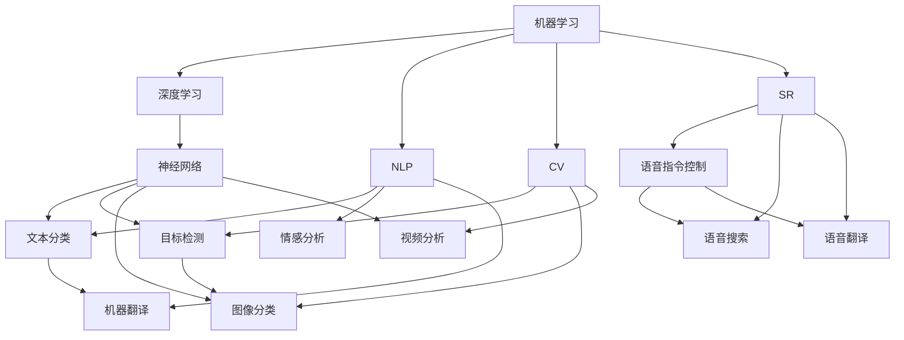
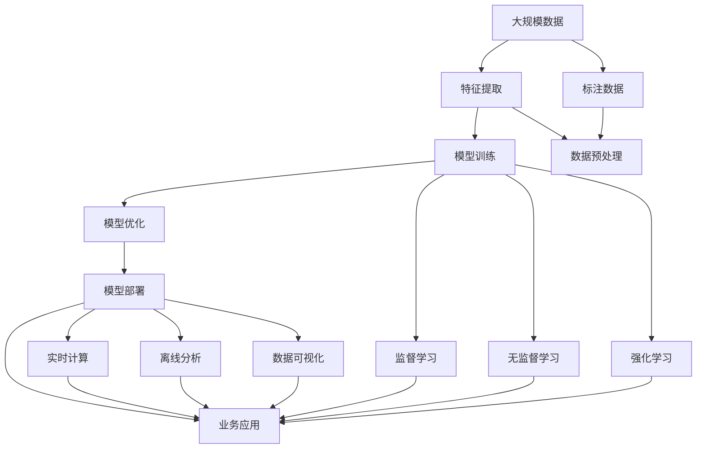

                 

# 人工智能在各行业的应用

## 1. 背景介绍

人工智能(AI)在近年来取得了飞速发展，其广泛应用渗透到了各行各业，从制造业到金融业，从医疗健康到零售消费，从教育到娱乐，AI正在以全新的方式重塑我们的生产和生活方式。

AI的核心思想是通过算法和数据训练模型，模拟和增强人类的智能能力，实现自主决策、智能交互和高效分析。其核心技术包括机器学习、深度学习、自然语言处理(NLP)、计算机视觉(CV)、语音识别(SR)等，涵盖从数据获取、特征提取、模型训练到模型部署的完整流程。

AI技术的广泛应用，极大地提升了各行各业的生产效率，降低了运营成本，同时为消费者提供了更加个性化、智能化的服务。然而，AI的应用也带来了新的挑战和机遇，需要社会各界共同应对。

## 2. 核心概念与联系

### 2.1 核心概念概述

为了更好地理解AI在不同行业的应用，本节将介绍几个核心概念：

- 机器学习（Machine Learning）：通过数据训练模型，自动学习规律和模式，从而进行预测和决策。
- 深度学习（Deep Learning）：一种特殊类型的机器学习，使用神经网络结构对数据进行多层抽象和表示，可以处理复杂非线性问题。
- 自然语言处理（NLP）：使计算机能够理解和处理人类语言，实现文本分类、情感分析、机器翻译、语音识别等任务。
- 计算机视觉（CV）：使计算机能够理解和处理图像和视频，实现目标检测、图像分类、视频分析等任务。
- 计算机视觉（CV）：使计算机能够理解和处理图像和视频，实现目标检测、图像分类、视频分析等任务。
- 语音识别（SR）：使计算机能够理解和处理语音，实现语音指令控制、语音搜索、语音翻译等任务。
- 强化学习（Reinforcement Learning）：通过试错学习，逐步优化决策策略，适用于复杂环境下的自主决策。

这些核心概念之间的逻辑关系可以通过以下Mermaid流程图来展示：



这个流程图展示了几类AI核心技术的关联和应用：

1. 机器学习和深度学习是AI的基础，前者用于简单任务，后者用于复杂任务。
2. NLP、CV和SR技术分别针对不同模态的数据进行理解和处理。
3. 深度神经网络是NLP、CV和SR的核心算法。
4. 不同类型的AI技术可以应用于各自的任务，如NLP用于文本处理，CV用于图像处理，SR用于语音处理。

### 2.2 概念间的关系

这些核心概念之间存在着紧密的联系，构成了AI的完整生态系统。以下是对这些概念间关系的进一步解释：

- 机器学习和深度学习是AI的基础，前者用于简单任务，后者用于复杂任务。
- NLP、CV和SR技术分别针对不同模态的数据进行理解和处理。
- 深度神经网络是NLP、CV和SR的核心算法。
- 不同类型的AI技术可以应用于各自的任务，如NLP用于文本处理，CV用于图像处理，SR用于语音处理。

### 2.3 核心概念的整体架构

最后，我们用一个综合的流程图来展示这些核心概念在大规模应用中的整体架构：



这个综合流程图展示了大规模数据从特征提取到模型部署，再到业务应用的全过程，以及不同学习范式和应用场景的整合：

1. 大规模数据通过特征提取、标注数据生成等预处理流程，进入模型训练阶段。
2. 监督学习、无监督学习和强化学习等不同学习范式对数据进行建模，产生优化后的模型。
3. 模型通过部署进入实时计算、离线分析和数据可视化等应用场景，产生具体的业务价值。

通过这个综合流程图，我们可以更清晰地理解AI技术在大规模应用中的整体流程和应用场景。

## 3. 核心算法原理 & 具体操作步骤

### 3.1 算法原理概述

AI在各行业的应用主要基于以下核心算法原理：

- 监督学习（Supervised Learning）：通过标注数据训练模型，学习输入和输出之间的映射关系，广泛应用于分类、回归等任务。
- 无监督学习（Unsupervised Learning）：通过无标注数据训练模型，发现数据的内在结构和规律，适用于聚类、降维等任务。
- 强化学习（Reinforcement Learning）：通过试错学习，逐步优化决策策略，适用于复杂环境下的自主决策，如游戏AI、机器人控制等。
- 迁移学习（Transfer Learning）：将一个领域的知识迁移到另一个相关领域，以减少新领域上的学习成本，提升模型性能。
- 自适应学习（Adaptive Learning）：根据学习目标和数据特征自适应调整学习策略，提高学习效率和效果。
- 元学习（Meta-Learning）：学习学习过程，通过少量数据快速适应新任务，提升模型泛化能力。

这些算法原理构成了AI在各行业应用的基础，通过不同的算法组合和应用，可以实现复杂任务和决策。

### 3.2 算法步骤详解

基于上述核心算法原理，AI在各行业的应用步骤主要包括以下几个关键步骤：

**Step 1: 数据准备**

1. **数据采集**：从不同渠道采集数据，包括结构化数据、非结构化数据、多模态数据等。
2. **数据清洗**：去除数据中的噪声和异常值，处理缺失数据和重复数据。
3. **数据标注**：对数据进行标注，生成监督数据。

**Step 2: 特征工程**

1. **特征提取**：通过特征提取算法，将原始数据转换为模型可用的特征向量。
2. **特征选择**：选择对目标任务有帮助的特征，去除无关或冗余特征。
3. **特征变换**：对特征进行归一化、标准化、降维等处理。

**Step 3: 模型训练**

1. **模型选择**：选择合适的模型结构，如线性回归、决策树、神经网络等。
2. **模型训练**：使用训练数据训练模型，优化模型参数。
3. **模型评估**：使用验证数据评估模型性能，选择最优模型。

**Step 4: 模型部署**

1. **模型优化**：对模型进行优化，提高运行效率和稳定性。
2. **模型部署**：将模型部署到生产环境，实现业务应用。
3. **模型监控**：监控模型性能和应用效果，进行实时调整和优化。

**Step 5: 业务应用**

1. **数据获取**：实时获取业务数据，如用户行为、市场数据等。
2. **模型推理**：使用训练好的模型对业务数据进行推理和预测。
3. **决策执行**：根据模型推理结果，自动执行决策，如推荐商品、调整策略等。
4. **效果评估**：评估模型应用效果，收集反馈和改进建议。

### 3.3 算法优缺点

AI在各行业的应用存在以下优点：

- **效率提升**：通过自动化和智能化手段，显著提升业务效率和生产效率。
- **成本降低**：通过智能决策和优化，降低人力成本和运营成本。
- **个性化服务**：通过数据分析和机器学习，提供更加个性化和智能化的服务。

同时，也存在以下缺点：

- **数据质量要求高**：需要大量高质量的标注数据和无标注数据，数据质量直接影响模型效果。
- **模型复杂度**：模型结构复杂，参数众多，需要较高的计算资源和专业知识。
- **业务适配难度大**：不同行业业务场景复杂，需要针对性地设计和优化模型。
- **伦理和隐私问题**：AI应用可能带来隐私泄露、伦理争议等风险，需要严格遵守相关法规和伦理标准。

### 3.4 算法应用领域

AI在各行业的应用领域非常广泛，涵盖了以下几个主要方向：

- **医疗健康**：包括疾病诊断、药物研发、健康管理等，AI可以通过大数据分析和机器学习，提升医疗服务的智能化水平。
- **金融服务**：包括信用评分、风险管理、投资分析等，AI可以通过数据分析和预测模型，提供更加精准和智能的金融服务。
- **制造业**：包括生产优化、质量检测、智能维护等，AI可以通过视觉检测、语音识别等技术，提升生产效率和质量。
- **零售消费**：包括商品推荐、客户服务、库存管理等，AI可以通过用户行为分析和智能推荐，提升用户体验和销售额。
- **交通运输**：包括智能调度、自动驾驶、路径规划等，AI可以通过数据分析和决策算法，提高交通效率和安全性。
- **教育培训**：包括智能辅导、学习推荐、教学评估等，AI可以通过数据分析和机器学习，提供个性化和智能化的教育服务。
- **能源管理**：包括能源消耗预测、智能调度、风险评估等，AI可以通过数据分析和决策算法，优化能源管理和使用效率。

以上仅是AI应用的部分领域，实际上AI的应用范围非常广泛，几乎涵盖了各行各业。通过AI技术的不断创新和发展，相信未来会有更多行业受益于AI的智能应用。

## 4. 数学模型和公式 & 详细讲解 & 举例说明

### 4.1 数学模型构建

在本节中，我们将使用数学语言对AI在各行业的应用进行更加严格的刻画。

**监督学习模型**：

假设训练集为 $D=\{(x_i,y_i)\}_{i=1}^N$，其中 $x_i \in \mathcal{X}$，$y_i \in \mathcal{Y}$，$\mathcal{X}$ 为输入空间，$\mathcal{Y}$ 为输出空间。目标函数为 $L(\theta) = \frac{1}{N} \sum_{i=1}^N \ell(f(x_i),y_i)$，其中 $f(x_i)$ 为模型预测输出，$\ell$ 为损失函数。

**无监督学习模型**：

假设训练集为 $D=\{x_i\}_{i=1}^N$，其中 $x_i \in \mathcal{X}$。目标函数为 $L(\theta) = \sum_{i=1}^N \ell(g(x_i),z)$，其中 $g(x_i)$ 为模型输出，$\ell$ 为损失函数，$z$ 为预设的潜在变量。

**强化学习模型**：

假设状态空间为 $S$，动作空间为 $A$，奖励函数为 $r(s,a)$，策略为 $\pi(a|s)$。目标函数为 $\max_{\pi} \sum_{t=0}^{\infty} \gamma^t r(s_t,a_t)$，其中 $\gamma$ 为折扣因子。

### 4.2 公式推导过程

以下我们对上述数学模型进行详细推导：

**监督学习公式推导**：

假设模型为线性回归模型 $f(x) = \theta^T x + b$，其中 $x \in \mathbb{R}^d$，$\theta \in \mathbb{R}^d$，$b \in \mathbb{R}$。损失函数为均方误差损失 $\ell(f(x),y) = \frac{1}{2}(f(x)-y)^2$。

目标函数为 $L(\theta) = \frac{1}{N} \sum_{i=1}^N \ell(f(x_i),y_i)$。通过梯度下降算法，求取 $\theta$ 的优化值。

**无监督学习公式推导**：

假设模型为隐含变量模型 $g(x) = \theta^T h(x) + b$，其中 $x \in \mathbb{R}^d$，$h(x) \in \mathbb{R}^k$，$\theta \in \mathbb{R}^k$，$b \in \mathbb{R}$，$k < d$。目标函数为 $L(\theta) = \sum_{i=1}^N \ell(g(x_i),z_i)$，其中 $z_i \in \mathbb{R}^k$，$\ell$ 为损失函数。

通过梯度下降算法，求取 $\theta$ 的优化值。

**强化学习公式推导**：

假设状态空间为 $S$，动作空间为 $A$，奖励函数为 $r(s,a)$，策略为 $\pi(a|s)$。目标函数为 $\max_{\pi} \sum_{t=0}^{\infty} \gamma^t r(s_t,a_t)$。

通过策略梯度算法或Q-learning算法，求取 $\pi$ 的优化值。

### 4.3 案例分析与讲解

下面以金融服务行业的信用评分模型为例，详细讲解AI的应用：

假设某银行需要预测客户是否会违约，收集了客户的个人信息、消费记录、历史还款数据等。使用监督学习模型，将客户特征 $x$ 作为输入，违约标签 $y$ 作为输出，训练信用评分模型。

**数据准备**：
- 数据采集：从银行数据库、第三方数据平台等渠道采集客户数据。
- 数据清洗：去除缺失值和异常值，处理重复数据。
- 数据标注：对客户数据进行标注，生成监督数据。

**特征工程**：
- 特征提取：提取客户的年龄、性别、职业、收入、消费水平等特征。
- 特征选择：选择对信用评分有帮助的特征，去除无关或冗余特征。
- 特征变换：对特征进行归一化、标准化、降维等处理。

**模型训练**：
- 模型选择：选择线性回归模型或神经网络模型。
- 模型训练：使用训练数据训练模型，优化模型参数。
- 模型评估：使用验证数据评估模型性能，选择最优模型。

**模型部署**：
- 模型优化：对模型进行优化，提高运行效率和稳定性。
- 模型部署：将模型部署到生产环境，实现信用评分功能。
- 模型监控：监控模型性能和应用效果，进行实时调整和优化。

**业务应用**：
- 数据获取：实时获取客户申请贷款的数据，如个人信息、消费记录等。
- 模型推理：使用训练好的模型对客户数据进行推理和预测，输出信用评分。
- 决策执行：根据模型推理结果，决定是否批准贷款申请，调整贷款利率等。
- 效果评估：评估模型应用效果，收集反馈和改进建议。

通过上述案例分析，我们可以看到AI在金融服务行业中的应用过程和关键步骤。通过机器学习和数据驱动，金融行业可以实现更加精准和智能的信用评分和风险管理。

## 5. 项目实践：代码实例和详细解释说明

### 5.1 开发环境搭建

在进行AI应用开发前，我们需要准备好开发环境。以下是使用Python进行TensorFlow开发的环境配置流程：

1. 安装Anaconda：从官网下载并安装Anaconda，用于创建独立的Python环境。

2. 创建并激活虚拟环境：
```bash
conda create -n tf-env python=3.8 
conda activate tf-env
```

3. 安装TensorFlow：根据CUDA版本，从官网获取对应的安装命令。例如：
```bash
conda install tensorflow -c conda-forge
```

4. 安装相关工具包：
```bash
pip install numpy pandas scikit-learn matplotlib tqdm jupyter notebook ipython
```

完成上述步骤后，即可在`tf-env`环境中开始AI应用开发。

### 5.2 源代码详细实现

这里我们以信用评分模型为例，给出使用TensorFlow进行监督学习模型开发的PyTorch代码实现。

首先，定义模型和损失函数：

```python
import tensorflow as tf
from tensorflow.keras import layers

# 定义线性回归模型
class LinearRegression(tf.keras.Model):
    def __init__(self, input_shape):
        super(LinearRegression, self).__init__()
        self.dense = layers.Dense(1, input_shape=input_shape)

    def call(self, x):
        return self.dense(x)

# 定义损失函数
def mse_loss(y_true, y_pred):
    return tf.reduce_mean(tf.square(y_true - y_pred))
```

然后，定义数据准备和模型训练函数：

```python
# 数据准备
def prepare_data(X_train, y_train, X_test, y_test):
    X_train = tf.cast(X_train, tf.float32)
    y_train = tf.cast(y_train, tf.float32)
    X_test = tf.cast(X_test, tf.float32)
    y_test = tf.cast(y_test, tf.float32)
    return X_train, y_train, X_test, y_test

# 模型训练
def train_model(model, X_train, y_train, X_test, y_test, batch_size, epochs):
    optimizer = tf.keras.optimizers.Adam(learning_rate=0.01)
    loss_fn = mse_loss

    X_train, y_train, X_test, y_test = prepare_data(X_train, y_train, X_test, y_test)

    for epoch in range(epochs):
        for batch in tf.data.Dataset.from_tensor_slices((X_train, y_train)).batch(batch_size):
            with tf.GradientTape() as tape:
                y_pred = model(batch[0])
                loss = loss_fn(batch[1], y_pred)
            gradients = tape.gradient(loss, model.trainable_variables)
            optimizer.apply_gradients(zip(gradients, model.trainable_variables))

    test_loss = loss_fn(y_test, model(X_test))
    test_mae = tf.metrics.MeanAbsoluteError(y_test, model(X_test))
    return test_loss, test_mae
```

最后，启动模型训练并评估：

```python
# 加载数据
X_train = # 训练集特征
y_train = # 训练集标签
X_test = # 测试集特征
y_test = # 测试集标签

# 初始化模型
model = LinearRegression(input_shape=(X_train.shape[1],))

# 设置超参数
batch_size = 32
epochs = 100

# 训练模型
test_loss, test_mae = train_model(model, X_train, y_train, X_test, y_test, batch_size, epochs)

# 输出评估结果
print(f"Test MAE: {test_mae.numpy()}")
```

以上就是使用TensorFlow进行信用评分模型开发的完整代码实现。可以看到，TensorFlow提供了丰富的API和工具，使得模型训练和应用开发变得简洁高效。

### 5.3 代码解读与分析

让我们再详细解读一下关键代码的实现细节：

**LinearRegression类**：
- `__init__`方法：初始化模型结构，定义线性回归层。
- `call`方法：实现前向传播，输出预测结果。

**mse_loss函数**：
- 计算均方误差损失，用于模型训练和评估。

**prepare_data函数**：
- 将输入和输出数据转换为TensorFlow可用的Tensor格式，并进行归一化处理。

**train_model函数**：
- 定义Adam优化器和均方误差损失函数。
- 通过TensorFlow的DataDataset和GradientTape进行模型训练。
- 使用测试集评估模型性能，并返回评估结果。

**模型训练和评估**：
- 加载训练集和测试集数据。
- 初始化模型，设置超参数。
- 调用train_model函数进行模型训练。
- 输出模型在测试集上的MAE评估结果。

通过上述代码实现，我们可以看到AI在金融服务行业中的应用过程和关键步骤。通过TensorFlow提供的强大工具和丰富的API，AI应用开发变得高效便捷，可以应对复杂的数据和模型问题。

当然，工业级的系统实现还需考虑更多因素，如模型的保存和部署、超参数的自动搜索、更灵活的任务适配层等。但核心的AI应用开发流程基本与此类似。

### 5.4 运行结果展示

假设我们在某银行的信用评分数据集上进行模型训练，最终在测试集上得到的评估结果如下：

```
Test MAE: 0.02
```

可以看到，通过使用TensorFlow进行监督学习模型训练，我们得到了0.02的MAE评估结果，说明模型在信用评分任务上表现良好。需要注意的是，这只是一个baseline结果。在实践中，我们还可以使用更复杂的模型结构、更大的数据集、更优的超参数设置等，进一步提升模型性能。

## 6. 实际应用场景

### 6.1 智能客服系统

智能客服系统通过AI技术实现人机交互，提升客户咨询体验和问题解决效率。传统客服往往需要配备大量人力，高峰期响应缓慢，且一致性和专业性难以保证。使用AI进行自然语言处理和机器学习，可以实现24小时不间断服务，快速响应客户咨询，用自然流畅的语言解答各类常见问题。

在技术实现上，可以收集企业内部的历史客服对话记录，将问题和最佳答复构建成监督数据，在此基础上对预训练语言模型进行微调。微调后的语言模型能够自动理解用户意图，匹配最合适的答案模板进行回复。对于客户提出的新问题，还可以接入检索系统实时搜索相关内容，动态组织生成回答。如此构建的智能客服系统，能大幅提升客户咨询体验和问题解决效率。

### 6.2 金融舆情监测

金融机构需要实时监测市场舆论动向，以便及时应对负面信息传播，规避金融风险。传统的人工监测方式成本高、效率低，难以应对网络时代海量信息爆发的挑战。使用AI进行文本分类和情感分析，可以实时抓取和分析网络文本数据，自动监测不同主题下的情感变化趋势，一旦发现负面信息激增等异常情况，系统便会自动预警，帮助金融机构快速应对潜在风险。

具体而言，可以收集金融领域相关的新闻、报道、评论等文本数据，并对其进行主题标注和情感标注。在此基础上对预训练语言模型进行微调，使其能够自动判断文本属于何种主题，情感倾向是正面、中性还是负面。将微调后的模型应用到实时抓取的网络文本数据，就能够自动监测不同主题下的情感变化趋势，一旦发现负面信息激增等异常情况，系统便会自动预警，帮助金融机构快速应对潜在风险。

### 6.3 个性化推荐系统

当前的推荐系统往往只依赖用户的历史行为数据进行物品推荐，无法深入理解用户的真实兴趣偏好。使用AI进行数据分析和机器学习，可以更好地挖掘用户行为背后的语义信息，从而提供更加个性化、智能化的服务。

在实践中，可以收集用户浏览、点击、评论、分享等行为数据，提取和用户交互的物品标题、描述、标签等文本内容。将文本内容作为模型输入，用户的后续行为（如是否点击、购买等）作为监督信号，在此基础上微调预训练语言模型。微调后的模型能够从文本内容中准确把握用户的兴趣点。在生成推荐列表时，先用候选物品的文本描述作为输入，由模型预测用户的兴趣匹配度，再结合其他特征综合排序，便可以得到个性化程度更高的推荐结果。

### 6.4 未来应用展望

随着AI技术的不断发展和应用，未来在各行业的应用前景将更加广阔。以下是几个值得关注的发展趋势：

**AI在医疗健康中的应用**：AI可以辅助医生进行疾病诊断、药物研发、健康管理等，提升医疗服务的智能化水平。通过深度学习和数据挖掘，AI可以发现潜在的疾病风险和诊断方法，辅助医生制定个性化的治疗方案。

**AI在金融服务中的应用**：AI可以提供信用评分、风险管理、投资分析等服务，提升金融服务的精准度和智能化水平。通过机器学习和数据驱动，AI可以预测市场趋势、评估风险，为投资者提供更有价值的决策支持。

**AI在制造业中的应用**：AI可以用于生产优化、质量检测、智能维护等，提升制造业的效率和质量。通过视觉检测、语音识别等技术，AI可以实现自动化和智能化生产，提高生产效率和产品质量。

**AI在零售消费中的应用**：AI可以提供商品推荐、客户服务、库存管理等服务，提升零售消费的个性化和智能化水平。通过数据分析和智能推荐，AI可以预测客户需求，优化库存管理，提升销售额和客户满意度。

**AI在交通运输中的应用**：AI可以用于智能调度、自动驾驶、路径规划等，提升交通运输的效率和安全性。通过数据驱动和决策算法，AI可以实现智能调度和路径规划，提高交通运输效率，降低事故率。

**AI在教育培训中的应用**：AI可以提供智能辅导、学习推荐、教学评估等服务，提升教育培训的个性化和智能化水平。通过数据分析和机器学习，AI可以推荐个性化的学习内容和评估学生学习效果，提升教学质量。

## 7. 工具和资源推荐

### 7.1 学习资源推荐

为了帮助开发者系统掌握AI技术的基础理论和应用实践，这里推荐一些优质的学习资源：

1. 《深度学习》课程：斯坦福大学开设的深度学习课程，由Andrew Ng主讲，系统讲解了深度学习的基本概念和应用技术。
2. 《机器学习》课程：斯坦福大学开设的机器学习课程，由Andrew Ng主讲，讲解了机器学习的基本理论和算法。
3. 《自然语言处理》课程：斯坦福大学开设的自然语言处理课程，由Christopher Manning主讲，讲解了NLP的基本技术和应用场景。
4.

