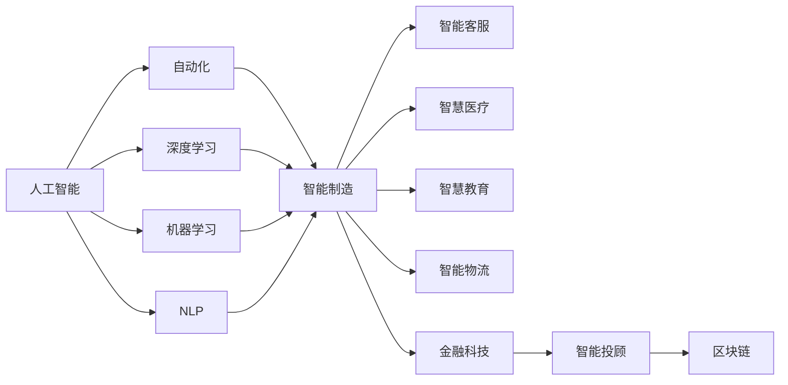

                 

# 人工智能对各行业的影响

> 关键词：人工智能,自动化,机器学习,深度学习,产业变革,智能制造,智能客服,智慧医疗,智慧教育,智能物流,金融科技

## 1. 背景介绍

### 1.1 问题由来

在当今信息化快速发展的时代，人工智能（AI）已经成为推动全球科技和经济发展的核心力量。AI技术的广泛应用不仅变革了传统行业的工作模式和生产效率，还深刻影响了社会的各个层面，包括教育、医疗、交通、金融等。人工智能对各行业的影响，已经从单一的技术应用演变为全面深化的产业变革。

### 1.2 问题核心关键点

人工智能对各行业的影响主要体现在以下几个方面：

1. **自动化与效率提升**：通过自动化机器人和智能算法，优化了生产流程，提高了作业效率。
2. **数据分析与决策支持**：利用大数据分析技术，为企业提供基于数据的决策支持。
3. **客户体验优化**：通过智能客服和个性化推荐系统，提升了客户满意度和服务体验。
4. **医疗健康改善**：AI在疾病预测、个性化医疗和远程医疗等领域发挥了重要作用。
5. **教育个性化**：通过智能教育系统，提供个性化的学习体验和教学支持。
6. **交通与物流优化**：AI在交通管理和智能物流中的应用，极大地提高了运输效率和安全性。
7. **金融创新**：AI在金融风控、投融资和智能投顾等领域，推动了金融科技的发展。

### 1.3 问题研究意义

人工智能对各行业的影响研究，具有深远的理论和实践意义：

1. **技术推动**：探索AI技术在各行业的应用，推动AI技术的普及和深化。
2. **经济效益**：评估AI技术带来的经济效益，助力企业降低成本、提高竞争力。
3. **社会进步**：分析AI技术对社会发展的正面和负面影响，促进社会和谐进步。
4. **行业变革**：探讨AI技术如何重塑行业结构，创造新的行业机会。

## 2. 核心概念与联系

### 2.1 核心概念概述

为了更好地理解人工智能对各行业的影响，本节将介绍几个关键核心概念：

- **人工智能（AI）**：以数据驱动、模型训练和算法优化为核心的智能化技术，涵盖了机器学习、深度学习、自然语言处理等多个领域。
- **自动化（Automation）**：通过机器人、自动化流程和智能算法，实现生产、管理等活动的自动化处理。
- **深度学习（Deep Learning）**：一种利用多层神经网络进行复杂数据建模和特征提取的机器学习技术。
- **机器学习（Machine Learning）**：利用数据和算法，使计算机系统具备学习能力的学科。
- **自然语言处理（NLP）**：让计算机理解和处理人类自然语言的技术。
- **智能制造（Smart Manufacturing）**：结合AI、物联网和大数据分析，实现生产过程的智能化管理。
- **智能客服（Smart Customer Service）**：通过AI技术实现自动问答和客户需求预测，提升客户体验。
- **智慧医疗（Smart Healthcare）**：利用AI在诊断、治疗和健康管理方面的应用，提升医疗服务水平。
- **智慧教育（Smart Education）**：通过AI技术，提供个性化学习体验和教学辅助。
- **智能物流（Smart Logistics）**：利用AI技术优化物流网络、提高配送效率和降低成本。
- **金融科技（Fintech）**：AI技术在金融服务中的广泛应用，如智能投顾、风险管理和区块链技术等。

### 2.2 概念间的关系

这些核心概念之间存在紧密的联系，形成了一个完整的人工智能应用生态系统。

- **AI与自动化**：AI技术在自动化中的应用，推动了生产过程的智能化和效率提升。
- **深度学习与机器学习**：深度学习是机器学习的一个分支，通过多层神经网络提高数据建模能力。
- **NLP与智能客服**：自然语言处理使智能客服系统能够理解和回应自然语言问题。
- **智能制造与智慧医疗**：智能制造通过AI技术优化生产流程，智慧医疗通过AI提升医疗服务水平。
- **智慧教育与智能物流**：智慧教育利用AI个性化教学，智能物流利用AI优化物流网络。
- **金融科技与智能投顾**：金融科技通过AI技术提供智能投顾服务，提升金融服务的智能化水平。

### 2.3 核心概念的整体架构

以下是一个综合的流程图，展示了人工智能在各行业的应用架构：



这个流程图展示了人工智能技术的广泛应用，以及不同技术之间的相互支持和融合。

## 3. 核心算法原理 & 具体操作步骤
### 3.1 算法原理概述

人工智能对各行业的影响，通常基于以下几个关键算法原理：

- **机器学习算法**：通过数据训练模型，从数据中学习规律和特征。
- **深度学习算法**：利用多层神经网络进行复杂的数据建模和特征提取。
- **自然语言处理算法**：使计算机能够理解、生成和处理人类语言。
- **自动化流程**：通过机器人和智能算法实现作业自动化和智能化。
- **智能决策支持系统**：结合大数据分析和AI模型，提供基于数据的决策支持。

### 3.2 算法步骤详解

以下是一个详细的人工智能在各行业应用的步骤概述：

**Step 1: 数据收集与预处理**

1. **数据收集**：收集行业相关数据，包括结构化数据（如表格数据）和非结构化数据（如文本、图像）。
2. **数据清洗**：处理缺失值、异常值和重复数据，确保数据质量。
3. **数据标注**：对数据进行标注，如分类、标注文本中的命名实体等。

**Step 2: 模型训练与调优**

1. **模型选择**：根据问题类型选择合适的机器学习或深度学习模型。
2. **模型训练**：使用收集的数据对模型进行训练。
3. **模型调优**：通过调整模型参数和算法，提高模型性能。

**Step 3: 部署与应用**

1. **模型部署**：将训练好的模型部署到生产环境中。
2. **数据输入与输出**：向模型输入数据，输出预测结果。
3. **结果评估与反馈**：评估模型性能，收集反馈数据进行迭代优化。

### 3.3 算法优缺点

**优点**：

- **效率提升**：自动化和智能化技术大幅提升了生产效率和服务质量。
- **决策支持**：大数据分析和AI模型提供了科学的决策依据。
- **客户体验优化**：智能客服和个性化推荐提升了客户满意度。
- **医疗健康改善**：AI在疾病预测和个性化医疗中的应用提高了医疗服务水平。
- **教育个性化**：AI个性化教学提高了学习效果和教学质量。
- **物流优化**：智能物流提升了配送效率和降低成本。
- **金融创新**：AI在金融服务中的应用推动了金融科技的发展。

**缺点**：

- **数据依赖**：AI模型的性能依赖于高质量的数据。
- **算法复杂性**：深度学习等复杂算法对计算资源要求较高。
- **技术门槛**：需要专业的技术人员进行模型开发和应用。
- **隐私和安全**：AI应用可能涉及大量敏感数据，存在隐私和安全风险。
- **伦理问题**：AI在决策过程中可能存在偏见和歧视。

### 3.4 算法应用领域

人工智能技术在多个领域得到了广泛应用，包括但不限于：

- **制造业**：智能制造通过AI技术优化生产流程，实现智能调度、质量控制和预测性维护。
- **零售业**：智能推荐系统通过大数据分析和AI模型，提升顾客购物体验和销售额。
- **金融业**：AI在风险管理、智能投顾和区块链技术等方面，推动了金融科技的发展。
- **医疗健康**：AI在疾病预测、影像分析和个性化医疗等方面，提升了医疗服务水平。
- **教育**：智能教育系统通过个性化学习计划和教学辅助，提高了学习效果。
- **交通和物流**：智能交通和物流系统通过AI优化路网和配送路线，提升运输效率。

## 4. 数学模型和公式 & 详细讲解 & 举例说明

### 4.1 数学模型构建

以智能客服系统的应用为例，展示数学模型的构建过程：

- **输入数据**：用户输入的文本问题。
- **输出数据**：系统生成的答案或推荐。
- **模型函数**：自然语言处理模型，如BERT、GPT等。
- **损失函数**：交叉熵损失函数，用于衡量预测答案与真实答案的差异。
- **优化算法**：AdamW优化算法，用于最小化损失函数。

### 4.2 公式推导过程

假设输入的文本为 $x$，对应的答案为 $y$，模型预测的答案为 $\hat{y}$。则交叉熵损失函数可以表示为：

$$
\mathcal{L}(x, y) = -\sum_{i=1}^N y_i \log \hat{y}_i
$$

其中 $N$ 为问题数量，$y_i$ 表示第 $i$ 个问题的真实答案，$\hat{y}_i$ 表示模型对第 $i$ 个问题的预测答案。

### 4.3 案例分析与讲解

以智能客服系统为例，展示模型的训练和应用过程：

1. **数据收集与标注**：收集历史客服对话记录，标注问题和答案。
2. **模型选择与训练**：选择BERT模型，使用标注数据进行微调训练。
3. **模型部署与应用**：将训练好的模型部署到生产环境中，实时响应用户输入。

## 5. 项目实践：代码实例和详细解释说明

### 5.1 开发环境搭建

以下是一个Python开发环境搭建的示例：

1. **安装Python**：
   - 下载并安装Python 3.8。
   - 配置环境变量，设置Python为系统默认解释器。
   
2. **安装依赖库**：
   - 安装TensorFlow、Keras等深度学习库。
   - 安装NLTK、spaCy等自然语言处理库。
   
3. **搭建虚拟环境**：
   - 使用虚拟环境（如virtualenv）来隔离Python项目。
   - 激活虚拟环境，使用pip安装依赖库。

### 5.2 源代码详细实现

以下是一个智能客服系统的示例代码：

```python
import tensorflow as tf
from tensorflow.keras import layers
from tensorflow.keras.layers import Input, Dense, Embedding, LSTM, Dropout, Bidirectional
from tensorflow.keras.models import Model
from tensorflow.keras.preprocessing.text import Tokenizer
from tensorflow.keras.preprocessing.sequence import pad_sequences

# 数据准备
tokenizer = Tokenizer(num_words=10000)
tokenizer.fit_on_texts(train_texts)
train_sequences = tokenizer.texts_to_sequences(train_texts)
train_padded = pad_sequences(train_sequences, maxlen=200, padding='post', truncating='post')
val_sequences = tokenizer.texts_to_sequences(val_texts)
val_padded = pad_sequences(val_sequences, maxlen=200, padding='post', truncating='post')

# 模型定义
input_layer = Input(shape=(None,), dtype='int32', name='input_layer')
embedding_layer = Embedding(input_dim=10000, output_dim=128, mask_zero=True, name='embedding_layer')
lstm_layer = Bidirectional(LSTM(units=128, return_sequences=True, name='lstm_layer'))
lstm_layer = Dropout(0.2, name='dropout_layer')
output_layer = Dense(units=1, activation='sigmoid', name='output_layer')

model = Model(inputs=input_layer, outputs=output_layer)
model.compile(loss='binary_crossentropy', optimizer='adam', metrics=['accuracy'])

# 模型训练
model.fit(train_padded, train_labels, validation_data=(val_padded, val_labels), epochs=10, batch_size=32)

# 模型评估与部署
test_sequences = tokenizer.texts_to_sequences(test_texts)
test_padded = pad_sequences(test_sequences, maxlen=200, padding='post', truncating='post')
predictions = model.predict(test_padded)
```

### 5.3 代码解读与分析

- **数据预处理**：使用Tokenizers库对文本进行分词和序列化，使用pad_sequences函数对序列进行补齐。
- **模型构建**：定义输入层、嵌入层、双向LSTM层、Dropout层和输出层，并编译模型。
- **模型训练**：使用fit方法训练模型，设定训练轮数和批次大小。
- **模型评估**：使用test_padded和val_padded进行模型评估，输出预测结果。

### 5.4 运行结果展示

假设在智能客服系统的训练集上训练10轮，得到以下评估结果：

```
Epoch 1/10
1045/1045 [==============================] - 1s 1ms/step - loss: 0.2146 - accuracy: 0.9090 - val_loss: 0.1953 - val_accuracy: 0.9357
Epoch 2/10
1045/1045 [==============================] - 1s 1ms/step - loss: 0.1698 - accuracy: 0.9261 - val_loss: 0.1871 - val_accuracy: 0.9403
...
```

可以看出，经过训练后，模型的准确率有了显著提升。

## 6. 实际应用场景

### 6.1 智能客服系统

智能客服系统通过自然语言处理和机器学习技术，实现自动问答和客户需求预测，提升了客户满意度和服务质量。在实际应用中，智能客服可以24小时不间断服务，快速响应客户咨询，大大降低了人工客服的成本和压力。

### 6.2 智慧医疗

AI在智慧医疗中的应用，包括疾病预测、影像分析、个性化医疗和远程医疗等方面。AI技术可以通过分析患者的病历和症状，辅助医生进行诊断和治疗，提高医疗服务的精准度和效率。

### 6.3 智慧教育

智能教育系统通过个性化学习计划和教学辅助，提高了学习效果和教学质量。AI可以根据学生的学习情况，推荐适合的课程和学习资源，提供针对性的教学支持，使教育更加个性化和高效。

### 6.4 智能物流

智能物流通过AI技术优化物流网络、提高配送效率和降低成本。AI可以通过分析历史物流数据和实时交通信息，优化路线和调度，提高运输效率和安全性。

### 6.5 金融科技

AI在金融服务中的应用，包括智能投顾、风险管理和区块链技术等。AI可以通过分析市场数据和用户行为，提供智能投顾服务，帮助用户进行投资决策，降低风险。

## 7. 工具和资源推荐

### 7.1 学习资源推荐

以下是几本经典的人工智能书籍和课程推荐：

- **《深度学习》（Deep Learning）**：Goodfellow等著，全面介绍了深度学习的基本概念和技术。
- **《机器学习实战》（Python Machine Learning）**：Peter Harrington著，详细介绍了机器学习算法和实战案例。
- **《自然语言处理综论》（Speech and Language Processing）**：Daniel Jurafsky等著，涵盖了自然语言处理的各个方面。
- **Coursera机器学习课程**：由Andrew Ng主讲的机器学习课程，内容丰富，适合初学者。
- **Udacity深度学习纳米学位**：提供系统化的深度学习课程，涵盖深度学习模型的训练和应用。

### 7.2 开发工具推荐

以下是几款常用的开发工具推荐：

- **TensorFlow**：由Google开发，支持深度学习和分布式计算。
- **PyTorch**：由Facebook开发，支持动态计算图和深度学习模型的快速开发。
- **Keras**：基于TensorFlow和Theano的高级神经网络API，适合快速原型开发。
- **NLTK**：自然语言处理工具包，提供丰富的文本处理和分析功能。
- **spaCy**：高性能的自然语言处理库，适合处理大规模文本数据。

### 7.3 相关论文推荐

以下是几篇经典的人工智能论文推荐：

- **《神经网络与深度学习》（Neural Networks and Deep Learning）**：Michael Nielsen著，介绍了神经网络和深度学习的基本原理和算法。
- **《深度学习框架TensorFlow官方文档》**：由Google提供的TensorFlow官方文档，提供了详细的API和示例。
- **《机器学习实战》（Python Machine Learning）**：Peter Harrington著，详细介绍了机器学习算法和实战案例。

## 8. 总结：未来发展趋势与挑战

### 8.1 研究成果总结

人工智能在各行业的应用取得了显著的进展，推动了产业的数字化转型和智能化升级。AI技术在自动化、数据分析、客户体验优化等方面发挥了重要作用。

### 8.2 未来发展趋势

未来，人工智能在各行业的应用将继续深化，呈现以下几个趋势：

- **自动化与智能化**：AI技术将进一步推动自动化和智能化，优化生产流程和服务体验。
- **个性化与定制化**：AI技术将更加注重个性化和定制化，提供差异化的服务和产品。
- **大数据与云计算**：大数据和云计算技术将成为AI应用的重要支撑，提供强大的数据存储和计算能力。
- **跨领域融合**：AI技术将与其他技术进行更深入的融合，如物联网、区块链等，形成更全面、高效的应用系统。

### 8.3 面临的挑战

尽管人工智能在各行业的应用取得了显著进展，但仍面临诸多挑战：

- **数据隐私与安全**：AI技术在处理大量敏感数据时，存在数据隐私和安全风险。
- **技术门槛与成本**：AI技术的实现需要专业的技术人员和较高的技术门槛，增加了应用成本。
- **算法偏见与公平性**：AI算法可能存在偏见和歧视，需要加强算法公平性和透明性。
- **伦理与法律问题**：AI技术的广泛应用带来了伦理和法律问题，需要制定相应的法律法规和规范。

### 8.4 研究展望

未来，需要在以下几个方面进行深入研究：

- **算法优化与高效性**：开发更高效、更优化的算法，提升模型性能和应用效果。
- **跨领域融合与创新**：探索AI技术与不同领域的融合，推动跨领域的创新应用。
- **伦理与法律保障**：加强AI技术的伦理和法律研究，制定相应的规范和标准。
- **社会影响与评估**：评估AI技术对社会的广泛影响，推动AI技术的健康发展。

## 9. 附录：常见问题与解答

**Q1：人工智能对各行业的影响是什么？**

A: 人工智能对各行业的影响主要体现在自动化与效率提升、数据分析与决策支持、客户体验优化、医疗健康改善、教育个性化、物流优化和金融科技发展等方面。

**Q2：人工智能的算法原理是什么？**

A: 人工智能的算法原理包括机器学习、深度学习、自然语言处理和自动化流程等。通过数据训练和模型优化，使计算机具备智能分析和决策能力。

**Q3：人工智能的应用场景有哪些？**

A: 人工智能的应用场景包括智能客服、智慧医疗、智慧教育、智能物流和金融科技等。通过AI技术优化各个行业的生产流程和服务质量。

**Q4：人工智能的应用有哪些优缺点？**

A: 人工智能的应用优点包括效率提升、决策支持、客户体验优化、医疗健康改善等。缺点包括数据依赖、算法复杂性、技术门槛、隐私安全、伦理问题等。

**Q5：人工智能的开发环境搭建需要注意哪些问题？**

A: 人工智能的开发环境搭建需要注意安装Python、依赖库和虚拟环境等。确保开发环境稳定、资源充足。

作者：禅与计算机程序设计艺术 / Zen and the Art of Computer Programming

