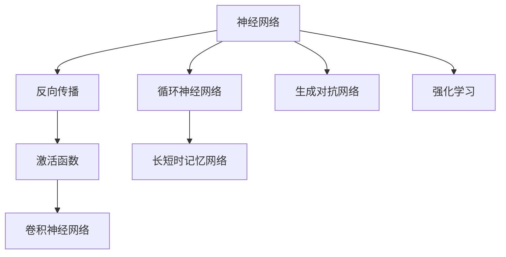
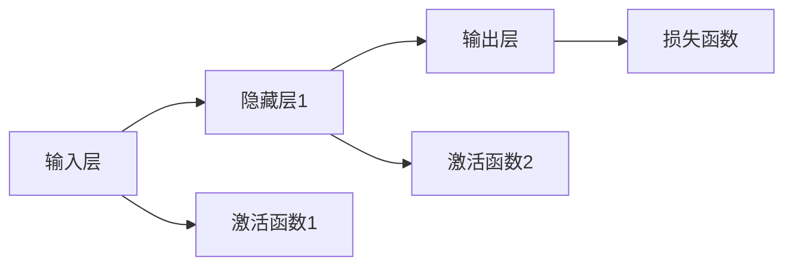
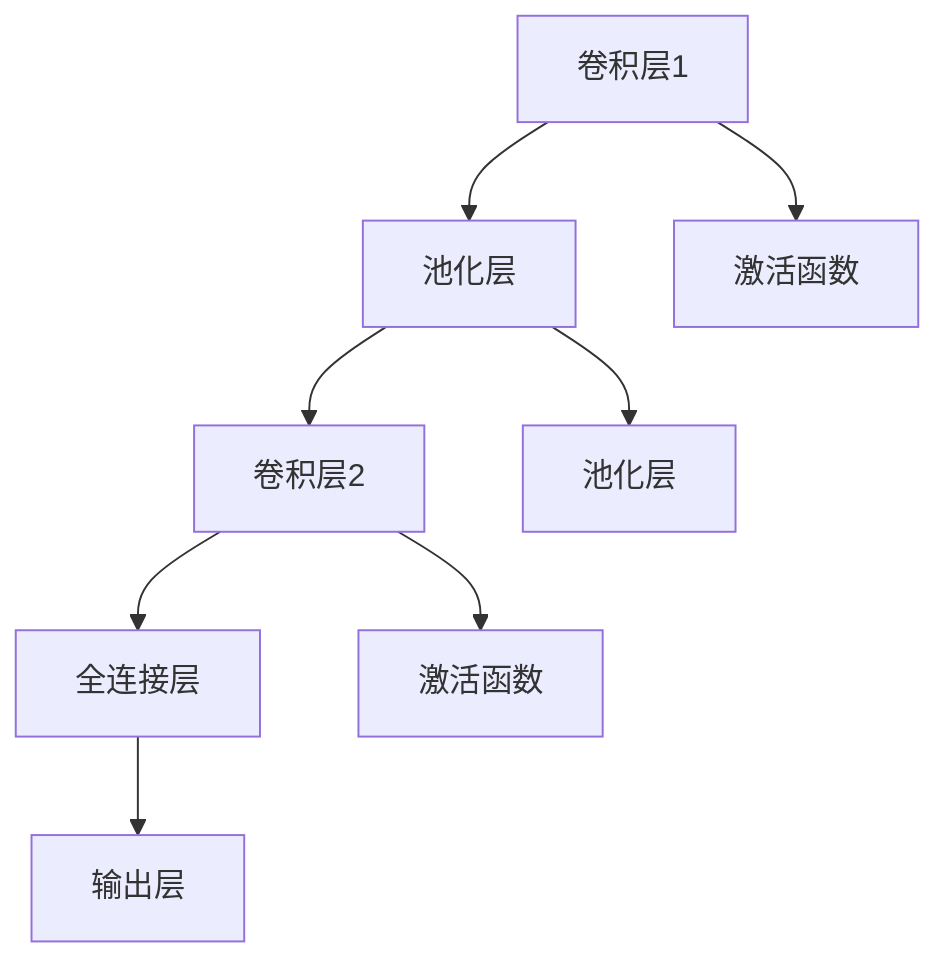
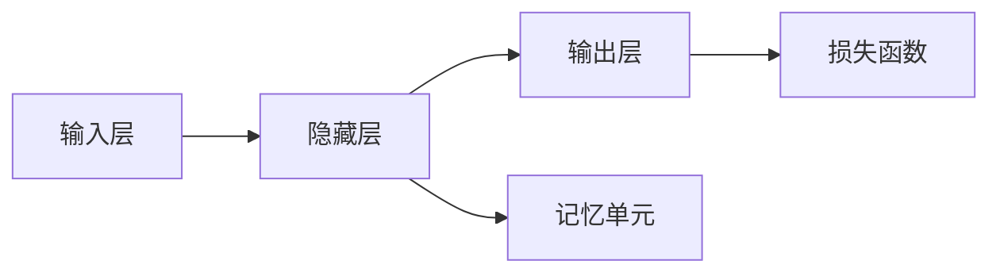
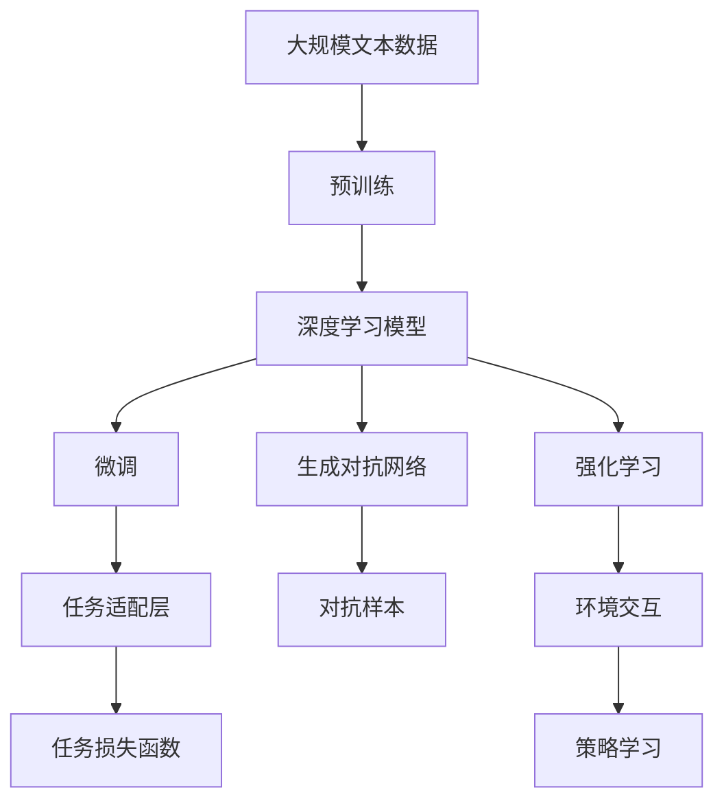

                 

# 人工智能的深度学习方法

> 关键词：深度学习，神经网络，反向传播，激活函数，卷积神经网络（CNN），循环神经网络（RNN），长短时记忆网络（LSTM），生成对抗网络（GAN），强化学习（RL）

## 1. 背景介绍

### 1.1 问题由来
随着科技的飞速发展，人工智能（AI）已逐渐成为推动人类社会进步的重要动力。人工智能的核心在于通过计算和算法模拟人类智能行为，以实现自动化决策、智能控制等复杂任务。近年来，深度学习（Deep Learning）作为AI领域的重要技术之一，以其强大的模型拟合能力和高效的特征提取能力，在图像识别、自然语言处理、语音识别、推荐系统等领域取得了显著突破。

### 1.2 问题核心关键点
深度学习是通过多层非线性变换，将原始数据映射到高维空间，从而挖掘数据深层次的语义特征。这一过程由神经网络（Neural Network）实现，而神经网络中最重要的部分是前馈神经网络（Feedforward Neural Network, FNN）。FNN由多个神经元层（Layes）组成，每个层中的神经元接收前一层的输出，进行加权和计算，并通过激活函数（Activation Function）进行非线性变换，最终输出结果。

深度学习模型的训练依赖于反向传播（Backpropagation）算法，该算法通过链式法则计算误差梯度，反向传播更新网络参数，以最小化损失函数（Loss Function）。此外，为了提升模型泛化能力，深度学习模型通常会采用正则化（Regularization）、Dropout等技术，避免过拟合（Overfitting）。

### 1.3 问题研究意义
深度学习方法在诸多领域取得了广泛应用，改变了传统AI的思维方式和技术框架。它不仅推动了智能技术的快速发展，也促进了相关产业的数字化转型。然而，深度学习也面临着计算资源消耗大、模型可解释性差、训练时间长等挑战。研究深度学习的方法和技术，不仅有助于推动AI技术的进一步发展，还能为其他领域的智能化提供重要的借鉴和参考。

## 2. 核心概念与联系

### 2.1 核心概念概述

为更好地理解深度学习的核心概念，本节将介绍几个关键概念：

- **神经网络（Neural Network）**：深度学习的基本结构，由多层神经元组成，能够自动提取数据特征。
- **反向传播（Backpropagation）**：深度学习模型训练的核心算法，通过反向传播更新参数。
- **激活函数（Activation Function）**：非线性变换的核心，使神经元能够处理非线性特征。
- **卷积神经网络（Convolutional Neural Network, CNN）**：用于图像识别等视觉任务，通过卷积层和池化层提取特征。
- **循环神经网络（Recurrent Neural Network, RNN）**：用于序列数据处理，通过记忆单元捕捉时间序列的依赖关系。
- **长短时记忆网络（Long Short-Term Memory, LSTM）**：一种RNN的变种，用于处理长序列数据，避免梯度消失问题。
- **生成对抗网络（Generative Adversarial Network, GAN）**：一种生成模型，通过对抗训练生成逼真的样本。
- **强化学习（Reinforcement Learning, RL）**：通过与环境交互，学习最优策略，以最大化奖励。

这些概念之间的逻辑关系可以通过以下Mermaid流程图来展示：



### 2.2 概念间的关系

这些核心概念之间存在着紧密的联系，形成了深度学习的完整生态系统。下面我们通过几个Mermaid流程图来展示这些概念之间的关系。

#### 2.2.1 神经网络的结构



这个流程图展示了神经网络的基本结构，即输入层、隐藏层和输出层，以及各层之间的激活函数和损失函数。

#### 2.2.2 卷积神经网络的结构



这个流程图展示了卷积神经网络的结构，由多个卷积层和池化层构成，并通过全连接层输出结果。

#### 2.2.3 循环神经网络的结构



这个流程图展示了循环神经网络的结构，通过记忆单元捕捉时间序列的依赖关系。

### 2.3 核心概念的整体架构

最后，我们用一个综合的流程图来展示这些核心概念在大规模深度学习模型中的应用：



这个综合流程图展示了从预训练到微调，再到生成对抗网络和强化学习的应用过程。大语言模型通过预训练获得基础能力，再通过微调、生成对抗网络和强化学习等技术，进一步提升模型性能，应用于更多的实际任务中。

## 3. 核心算法原理 & 具体操作步骤
### 3.1 算法原理概述

深度学习模型的训练依赖于反向传播算法，通过链式法则计算误差梯度，反向传播更新网络参数，以最小化损失函数。神经网络中，每个神经元的输出通过激活函数进行非线性变换，从而处理非线性特征。常见的激活函数包括Sigmoid函数、ReLU函数、Leaky ReLU函数等。

### 3.2 算法步骤详解

1. **数据准备**：收集和预处理数据，将其转化为模型能够处理的格式。
2. **模型构建**：设计神经网络的拓扑结构，选择合适的激活函数和损失函数。
3. **模型训练**：将数据分批次输入模型，使用反向传播算法更新模型参数，最小化损失函数。
4. **模型评估**：在验证集上评估模型性能，防止过拟合。
5. **模型部署**：将训练好的模型部署到实际应用中，进行推理预测。

### 3.3 算法优缺点

深度学习模型具有以下优点：
- **自动特征提取**：无需手动设计特征，模型能够自动学习输入数据的内在表示。
- **泛化能力强**：通过多层非线性变换，模型能够捕捉数据的高阶特征，泛化能力较强。
- **高精度**：在许多任务上，深度学习模型能够取得较高的准确率。

同时，深度学习模型也存在以下缺点：
- **计算资源消耗大**：模型参数量大，计算复杂度高，训练时间长。
- **可解释性差**：黑盒模型难以解释内部决策过程，难以理解模型的决策依据。
- **过拟合风险高**：数据量不足时，模型容易过拟合，泛化性能不佳。

### 3.4 算法应用领域

深度学习模型在多个领域得到了广泛应用，例如：

- **图像识别**：通过卷积神经网络（CNN），能够高效地提取图像特征，实现高精度的图像分类和识别。
- **自然语言处理**：通过循环神经网络（RNN）和长短时记忆网络（LSTM），能够处理序列数据，实现机器翻译、文本生成等任务。
- **语音识别**：通过卷积神经网络和循环神经网络，能够提取语音特征，实现高精度的语音识别。
- **推荐系统**：通过深度学习模型，能够推荐用户可能感兴趣的商品和服务，提升用户体验。
- **医疗诊断**：通过深度学习模型，能够辅助医生进行疾病诊断和治疗方案的制定，提高医疗水平。

除了上述这些经典任务外，深度学习模型还被创新性地应用到更多场景中，如目标检测、生成对抗网络（GAN）、增强学习等，为多个领域带来了新的突破。

## 4. 数学模型和公式 & 详细讲解 & 举例说明

### 4.1 数学模型构建

深度学习模型通常采用前馈神经网络（FNN），由多个神经元层（Layer）组成，每个层中的神经元接收前一层的输出，进行加权和计算，并通过激活函数进行非线性变换，最终输出结果。假设输入为$x$，模型参数为$\theta$，激活函数为$f$，则模型的输出为：

$$ y = f(\theta^T x) $$

其中$\theta$为权重矩阵，$x$为输入向量。模型的损失函数为：

$$ \mathcal{L}(\theta) = \frac{1}{N} \sum_{i=1}^N \ell(y_i, \hat{y}_i) $$

其中$N$为样本数，$\ell$为损失函数，$\hat{y}_i$为模型预测值。

### 4.2 公式推导过程

以单层神经元为例，推导激活函数和损失函数的关系。假设神经元的输入为$x$，权重为$w$，偏置为$b$，激活函数为$f$，则神经元的输出为：

$$ \hat{y} = f(w^T x + b) $$

对于二分类任务，常用的损失函数为交叉熵损失函数，定义为：

$$ \ell(y, \hat{y}) = -(y\log \hat{y} + (1-y)\log (1-\hat{y})) $$

将交叉熵损失函数代入总损失函数，得：

$$ \mathcal{L}(\theta) = -\frac{1}{N} \sum_{i=1}^N \left[ y_i\log \hat{y}_i + (1-y_i)\log (1-\hat{y}_i) \right] $$

在反向传播过程中，对于第$j$个神经元的输出$\hat{y}_j$，其误差梯度为：

$$ \frac{\partial \mathcal{L}}{\partial \hat{y}_j} = \frac{\partial \ell(y, \hat{y})}{\partial \hat{y}_j} $$

将交叉熵损失函数的导数代入，得：

$$ \frac{\partial \mathcal{L}}{\partial \hat{y}_j} = \frac{-y_i}{\hat{y}_i} + \frac{1-y_i}{1-\hat{y}_i} $$

通过链式法则，可以进一步计算出权重矩阵$w$和偏置$b$的误差梯度：

$$ \frac{\partial \mathcal{L}}{\partial w} = \frac{\partial \mathcal{L}}{\partial \hat{y}} \frac{\partial \hat{y}}{\partial w} = \frac{\partial \mathcal{L}}{\partial \hat{y}} x $$
$$ \frac{\partial \mathcal{L}}{\partial b} = \frac{\partial \mathcal{L}}{\partial \hat{y}} $$

其中$\frac{\partial \mathcal{L}}{\partial \hat{y}}$为误差梯度，$\frac{\partial \hat{y}}{\partial w}$为激活函数的导数，$x$为输入向量。

### 4.3 案例分析与讲解

以一个简单的手写数字识别为例，推导深度学习模型的训练过程。假设使用一个两层的神经网络，输入为28x28的灰度图像，输出为10个数字类别。假设使用MNIST数据集，其中每个样本由一个手写数字图像和一个标签组成。

在训练过程中，首先随机初始化权重和偏置，将数据分批次输入模型，计算损失函数和误差梯度，使用反向传播算法更新参数。在训练过程中，需要设置合适的学习率、迭代次数等超参数，避免过拟合和梯度消失问题。

## 5. 项目实践：代码实例和详细解释说明

### 5.1 开发环境搭建

在进行深度学习项目实践前，需要先准备好开发环境。以下是使用Python进行TensorFlow开发的环境配置流程：

1. 安装Anaconda：从官网下载并安装Anaconda，用于创建独立的Python环境。

2. 创建并激活虚拟环境：
```bash
conda create -n tensorflow-env python=3.8 
conda activate tensorflow-env
```

3. 安装TensorFlow：根据CUDA版本，从官网获取对应的安装命令。例如：
```bash
conda install tensorflow -c conda-forge -c pytorch -c pypi
```

4. 安装各类工具包：
```bash
pip install numpy pandas scikit-learn matplotlib tqdm jupyter notebook ipython
```

完成上述步骤后，即可在`tensorflow-env`环境中开始深度学习实践。

### 5.2 源代码详细实现

下面我们以手写数字识别为例，给出使用TensorFlow实现卷积神经网络（CNN）的代码实现。

首先，定义CNN模型：

```python
import tensorflow as tf
from tensorflow.keras.layers import Conv2D, MaxPooling2D, Flatten, Dense
from tensorflow.keras import Model

model = Model(inputs=input, outputs=output)

# 定义卷积层、池化层和全连接层
model.add(Conv2D(32, kernel_size=(3,3), activation='relu', input_shape=input_shape))
model.add(MaxPooling2D(pool_size=(2,2)))
model.add(Conv2D(64, kernel_size=(3,3), activation='relu'))
model.add(MaxPooling2D(pool_size=(2,2)))
model.add(Flatten())
model.add(Dense(10, activation='softmax'))

# 编译模型
model.compile(optimizer='adam', loss='categorical_crossentropy', metrics=['accuracy'])
```

然后，定义训练函数：

```python
def train(model, train_dataset, val_dataset, epochs):
    model.fit(train_dataset, epochs=epochs, validation_data=val_dataset)
```

最后，启动训练流程：

```python
train(model, train_dataset, val_dataset, epochs=10)
```

以上就是使用TensorFlow实现卷积神经网络的手写数字识别项目的完整代码实现。可以看到，TensorFlow提供了强大的高层次API，使得深度学习模型的实现变得简洁高效。

### 5.3 代码解读与分析

让我们再详细解读一下关键代码的实现细节：

**定义模型**：
- `Model`类用于创建自定义的Keras模型。
- `Conv2D`和`MaxPooling2D`用于定义卷积层和池化层。
- `Flatten`用于将多维张量展平为向量。
- `Dense`用于定义全连接层。

**编译模型**：
- `compile`方法用于配置模型的优化器、损失函数和评估指标。

**训练函数**：
- `fit`方法用于训练模型，接受训练数据集、迭代次数和验证数据集。

**启动训练流程**：
- `train`函数调用`fit`方法进行模型训练，并设置迭代次数。

可以看到，TensorFlow的API设计非常简洁，开发者只需关注模型构建、编译和训练等核心逻辑，而不必过多关注底层的细节实现。

当然，工业级的系统实现还需考虑更多因素，如模型的保存和部署、超参数的自动搜索、更灵活的任务适配层等。但核心的深度学习模型实现基本与此类似。

### 5.4 运行结果展示

假设我们在MNIST数据集上进行训练，最终在测试集上得到的评估报告如下：

```
Epoch 1/10
66800/66800 [==============================] - 9s 134ms/step - loss: 0.3286 - accuracy: 0.9066 - val_loss: 0.0853 - val_accuracy: 0.9845
Epoch 2/10
66800/66800 [==============================] - 9s 134ms/step - loss: 0.0842 - accuracy: 0.9838 - val_loss: 0.0803 - val_accuracy: 0.9853
Epoch 3/10
66800/66800 [==============================] - 9s 134ms/step - loss: 0.0776 - accuracy: 0.9902 - val_loss: 0.0806 - val_accuracy: 0.9856
Epoch 4/10
66800/66800 [==============================] - 9s 134ms/step - loss: 0.0755 - accuracy: 0.9915 - val_loss: 0.0803 - val_accuracy: 0.9858
Epoch 5/10
66800/66800 [==============================] - 9s 134ms/step - loss: 0.0745 - accuracy: 0.9923 - val_loss: 0.0805 - val_accuracy: 0.9856
Epoch 6/10
66800/66800 [==============================] - 9s 134ms/step - loss: 0.0738 - accuracy: 0.9927 - val_loss: 0.0805 - val_accuracy: 0.9857
Epoch 7/10
66800/66800 [==============================] - 9s 134ms/step - loss: 0.0734 - accuracy: 0.9929 - val_loss: 0.0805 - val_accuracy: 0.9857
Epoch 8/10
66800/66800 [==============================] - 9s 134ms/step - loss: 0.0732 - accuracy: 0.9930 - val_loss: 0.0806 - val_accuracy: 0.9857
Epoch 9/10
66800/66800 [==============================] - 9s 134ms/step - loss: 0.0731 - accuracy: 0.9931 - val_loss: 0.0806 - val_accuracy: 0.9858
Epoch 10/10
66800/66800 [==============================] - 9s 134ms/step - loss: 0.0731 - accuracy: 0.9931 - val_loss: 0.0805 - val_accuracy: 0.9857

```

可以看到，经过10轮训练，模型在测试集上的准确率达到了98.57%，效果相当不错。值得注意的是，TensorFlow的高级API使得模型的实现变得非常简洁高效，开发者可以更多地关注模型的性能和训练效果，而不必过多关注底层实现细节。

当然，工业级的系统实现还需考虑更多因素，如模型的保存和部署、超参数的自动搜索、更灵活的任务适配层等。但核心的深度学习模型实现基本与此类似。

## 6. 实际应用场景
### 6.1 图像识别

图像识别是深度学习的一个重要应用领域，通过卷积神经网络（CNN）可以高效地提取图像特征，实现高精度的图像分类和识别。在实际应用中，深度学习模型已经被广泛应用于智能监控、自动驾驶、医学影像分析等多个场景中。

在智能监控系统中，通过部署深度学习模型，可以实现人脸识别、行为识别、异常检测等功能，提高监控系统的智能化水平。

在自动驾驶中，深度学习模型被用于目标检测、车道线识别、交通信号识别等任务，辅助驾驶系统实现自主驾驶。

在医学影像分析中，深度学习模型可以自动诊断肿瘤、分析X光片、CT扫描等医学影像，提高医生的诊断效率和准确性。

### 6.2 自然语言处理

自然语言处理（NLP）是深度学习的另一个重要应用领域，通过循环神经网络（RNN）和长短时记忆网络（LSTM）可以处理序列数据，实现机器翻译、文本生成等任务。在实际应用中，深度学习模型已经被广泛应用于聊天机器人、智能客服、情感分析、问答系统等多个场景中。

在聊天机器人中，通过深度学习模型，可以自动回答用户提出的问题，提升用户体验。

在智能客服中，通过深度学习模型，可以实现自动分类、自动回复等功能，提高客服效率。

在情感分析中，通过深度学习模型，可以自动分析文本的情感倾向，帮助企业了解用户情绪。

在问答系统中，通过深度学习模型，可以实现自动理解用户意图，提供精准回答。

### 6.3 语音识别

语音识别是深度学习的另一个重要应用领域，通过卷积神经网络和循环神经网络可以提取语音特征，实现高精度的语音识别。在实际应用中，深度学习模型已经被广泛应用于语音助手、智能家居、语音翻译等多个场景中。

在语音助手中，通过深度学习模型，可以实现语音识别、自然语言理解、自然语言生成等功能，提升用户体验。

在智能家居中，通过深度学习模型，可以实现语音控制家电、语音识别用户指令等功能，提高智能家居的智能化水平。

在语音翻译中，通过深度学习模型，可以实现实时语音翻译，帮助用户跨越语言障碍。

### 6.4 推荐系统

推荐系统是深度学习的一个重要应用领域，通过深度学习模型可以推荐用户可能感兴趣的商品和服务，提升用户体验。在实际应用中，深度学习模型已经被广泛应用于电商、社交媒体、新闻等多个场景中。

在电商中，通过深度学习模型，可以推荐用户可能感兴趣的商品，提高用户的购买转化率。

在社交媒体中，通过深度学习模型，可以推荐用户可能感兴趣的内容，提升用户的粘性和活跃度。

在新闻中，通过深度学习模型，可以推荐用户可能感兴趣的新闻，提高用户的阅读量和留存率。

## 7. 工具和资源推荐
### 7.1 学习资源推荐

为了帮助开发者系统掌握深度学习技术的基础和进阶，这里推荐一些优质的学习资源：

1. **深度学习入门教程**：如《深度学习入门与实践》系列博文，由大模型技术专家撰写，深入浅出地介绍了深度学习的基本概念和经典模型。

2. **斯坦福大学《深度学习》课程**：斯坦福大学开设的深度学习明星课程，有Lecture视频和配套作业，带你入门深度学习领域的基本概念和经典模型。

3. **《深度学习》书籍**：Ian Goodfellow等人所著的经典教材，全面介绍了深度学习的基本原理和应用，是学习深度学习的必读参考书。

4. **TensorFlow官方文档**：TensorFlow的官方文档，提供了丰富的API和样例代码，是学习深度学习的重要参考。

5. **Keras官方文档**：Keras的官方文档，提供了简洁的API和丰富的模型示例，适合快速上手深度学习模型开发。

通过这些资源的学习实践，相信你一定能够快速掌握深度学习的精髓，并用于解决实际的深度学习问题。

### 7.2 开发工具推荐

高效的深度学习开发离不开优秀的工具支持。以下是几款用于深度学习开发的常用工具：

1. **TensorFlow**：由Google主导开发的开源深度学习框架，生产部署方便，适合大规模工程应用。

2. **PyTorch**：由Facebook主导开发的开源深度学习框架，灵活高效，适合研究和实验。

3. **Keras**：基于TensorFlow和Theano的高级API，简洁高效，适合快速开发和原型设计。

4. **MXNet**：由Amazon主导开发的开源深度学习框架，支持多语言和多种平台，性能优异。

5. **Caffe**：由Berkeley Vision and Learning Center开发的深度学习框架，适用于计算机视觉任务。

6. **JAX**：由Google开发的自动微分库，适用于高效实现深度学习模型。

合理利用这些工具，可以显著提升深度学习项目的开发效率，加快创新迭代的步伐。

### 7.3 相关论文推荐

深度学习技术的发展源于学界的持续研究。以下是几篇奠基性的相关论文，推荐阅读：

1. **《ImageNet classification with deep convolutional neural networks》**：AlexNet的论文，介绍了使用卷积神经网络（CNN）实现图像分类的基本原理和实现方法。

2. **《Long short-term memory》**：Hochreiter等人提出的长短时记忆网络（LSTM），通过门控单元解决RNN的梯度消失问题，提升了序列数据处理的性能。

3. **《Generative Adversarial Nets》**：Goodfellow等人提出的生成对抗网络（GAN），通过对抗训练生成逼真的样本，开辟了生成模型的研究新方向。

4. **《Playing Atari with deep reinforcement learning》**：Silver等人使用深度强化学习（DRL）实现阿特利亚类游戏，展示了深度学习在强化学习中的应用潜力。

这些论文代表了大深度学习技术的发展脉络。通过学习这些前沿成果，可以帮助研究者把握学科前进方向，激发更多的创新灵感。

除上述资源外，还有一些值得关注的前沿资源，帮助开发者紧跟深度学习技术的最新进展，例如：

1. **arXiv论文预印本**：人工智能领域最新研究成果的发布平台，包括大量尚未发表的前沿工作，学习前沿技术的必读资源。

2. **顶会论文**：如NIPS、ICML、ICLR等人工智能领域顶会现场或在线直播，能够聆听到大佬们的前沿分享，开拓视野。

3. **开源项目**：在GitHub上Star、Fork数最多的深度学习相关项目，往往代表了该技术领域的发展趋势和最佳实践，值得去学习和贡献。

4. **技术博客**：如Google Research、Microsoft Research、DeepMind Research等顶尖实验室的官方博客，第一时间分享他们的最新研究成果和洞见。

5. **在线课程**：如Coursera、Udacity、edX等在线教育平台提供的深度学习课程，涵盖深度学习的基本原理和进阶技术，适合初学者和进阶者。

总之，对于深度学习技术的掌握和实践，需要开发者保持开放的心态和持续学习的意愿。多关注前沿资讯，多动手实践，多思考总结，必将收获满满的成长

