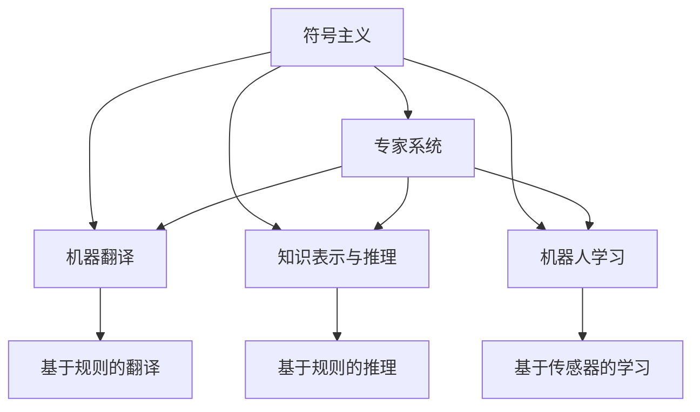
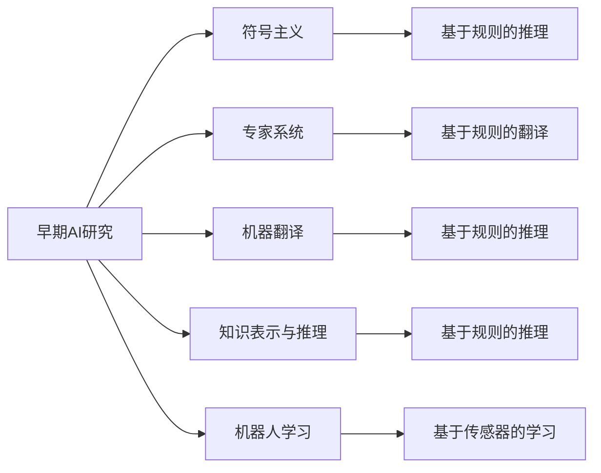
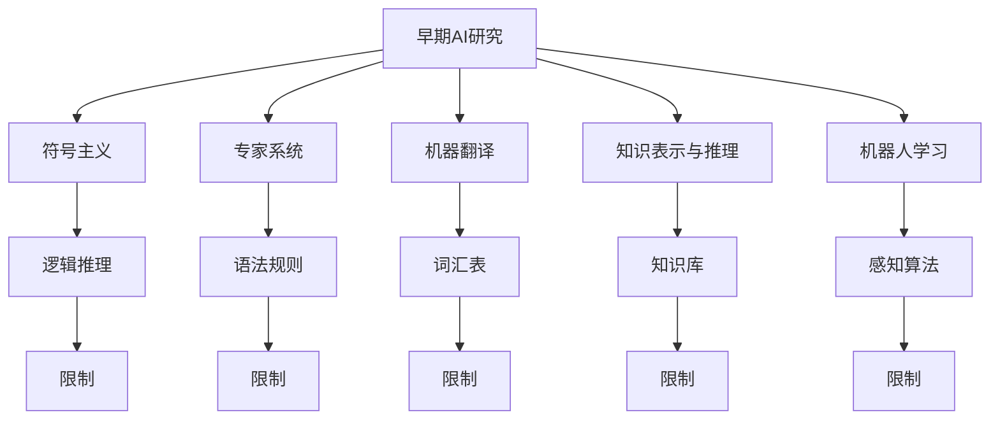
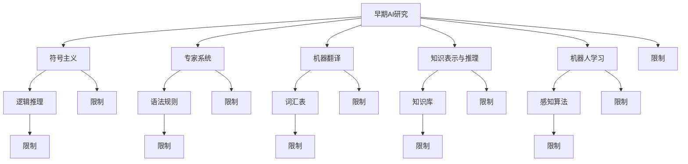

                 

# 人工智能研究的早期方向

## 1. 背景介绍

### 1.1 问题由来
人工智能（AI）是当前科技领域的热门话题，涵盖了从机器人到自然语言处理（NLP），从图像识别到自动驾驶等多个方向。然而，从上个世纪的早期研究开始，AI的发展并不是一帆风顺的。本文旨在回顾AI早期研究的几个关键方向，探讨其在科技历史长河中的重要地位，并为未来的AI研究提供启示。

### 1.2 问题核心关键点
AI的早期研究集中在以下几个关键领域：机器翻译、专家系统、知识表示与推理、机器人学习。这些研究为AI的发展奠定了基础，同时也揭示了AI面临的诸多挑战。

- 机器翻译：早期AI研究的标志性成果之一是符号主义机器翻译系统，如ELIZA、SHRDLU等。这些系统试图通过规则和逻辑推导实现自然语言处理，但效果有限。
- 专家系统：早期AI研究还涵盖了专家系统的发展，试图将人类专家的知识编码为规则系统，用于解决特定领域的问题，如医疗诊断、法律咨询等。
- 知识表示与推理：早期AI研究还关注于知识表示和推理的研究，如何更好地组织和处理知识，以及如何从知识中推导出新的结论。
- 机器人学习：早期AI研究还涉猎机器人学习，试图赋予机器人视觉、触觉等感知能力，以及自主决策和行动的能力。

### 1.3 问题研究意义
回顾AI早期研究的这些关键方向，不仅有助于理解AI的发展历程，还为未来的AI研究提供了宝贵的经验与教训。AI的早期研究揭示了语言模型、知识表示、推理和感知等核心技术，对现代AI发展具有深远影响。同时，早期研究也揭示了AI在实现复杂任务时面临的诸多挑战，为未来的AI研究指明了方向。

## 2. 核心概念与联系

### 2.1 核心概念概述

为了更好地理解AI早期研究的方向，我们首先需要了解几个核心概念：

- 符号主义(Symbolism)：早期AI研究主要依赖于符号主义，即使用规则和逻辑来处理信息，而非神经网络等基于数据的处理方法。
- 专家系统(Expert Systems)：专家系统是一种基于规则的推理系统，试图模拟人类专家的知识和推理过程，用于解决特定领域的问题。
- 机器翻译(Machine Translation)：机器翻译系统旨在将一种语言自动翻译成另一种语言，早期研究主要依赖于基于规则的翻译模型。
- 知识表示与推理(Knowledge Representation and Reasoning)：知识表示和推理研究如何更好地组织和处理知识，以及如何从知识中推导出新的结论。
- 机器人学习(Robot Learning)：机器人学习旨在赋予机器人感知、决策和行动能力，早期研究主要依赖于传感器数据和控制算法。

这些概念之间的逻辑关系可以通过以下Mermaid流程图来展示：



这个流程图展示了大语言模型微调过程中各个核心概念之间的关系：

1. 符号主义是早期AI研究的基础，影响了专家系统、机器翻译和知识表示与推理的发展。
2. 专家系统基于符号主义规则，专注于特定领域的问题解决。
3. 机器翻译是早期AI研究的重要应用方向，依赖于基于规则的翻译模型。
4. 知识表示与推理是早期AI研究的核心技术之一，用于组织和处理知识，支持专家系统的推理过程。
5. 机器人学习也是早期AI研究的重要方向，旨在赋予机器人感知、决策和行动能力。

### 2.2 概念间的关系

这些核心概念之间存在着紧密的联系，形成了早期AI研究的基本生态系统。下面我们通过几个Mermaid流程图来展示这些概念之间的关系。

#### 2.2.1 早期AI研究的范式



这个流程图展示了早期AI研究的几种主要范式：

1. 早期AI研究主要基于符号主义范式，依赖于规则和逻辑。
2. 专家系统是早期AI研究的主要应用方向，依赖于基于规则的推理。
3. 机器翻译是早期AI研究的另一个重要应用方向，依赖于基于规则的翻译模型。
4. 知识表示与推理是早期AI研究的核心技术之一，用于支持专家系统的推理过程。
5. 机器人学习也是早期AI研究的重要方向，依赖于传感器数据和控制算法。

#### 2.2.2 早期AI研究的局限性



这个流程图展示了早期AI研究的主要局限性：

1. 早期AI研究主要依赖于符号主义，限制了其处理复杂问题的能力。
2. 专家系统依赖于基于规则的推理，难以处理未知和新奇情况。
3. 机器翻译依赖于基于规则的翻译模型，难以处理语法和语义上的细微差别。
4. 知识表示与推理依赖于知识库，难以自动扩展和更新。
5. 机器人学习依赖于传感器数据和控制算法，难以应对环境变化和不确定性。

### 2.3 核心概念的整体架构

最后，我们用一个综合的流程图来展示早期AI研究的整体架构：



这个综合流程图展示了早期AI研究过程中各个核心概念的关系和作用：

1. 早期AI研究主要基于符号主义，依赖于规则和逻辑。
2. 专家系统依赖于基于规则的推理，用于解决特定领域的问题。
3. 机器翻译依赖于基于规则的翻译模型，将一种语言自动翻译成另一种语言。
4. 知识表示与推理依赖于知识库，用于组织和处理知识，支持专家系统的推理过程。
5. 机器人学习依赖于传感器数据和控制算法，赋予机器人感知、决策和行动能力。

## 3. 核心算法原理 & 具体操作步骤
### 3.1 算法原理概述

早期AI研究主要依赖于符号主义范式，即使用规则和逻辑来处理信息。这其中包括了专家系统、机器翻译、知识表示与推理等方向。这些技术的发展，为现代AI技术奠定了基础。

符号主义的基本原理是通过将问题抽象为规则和逻辑形式，来实现问题的自动化处理。这种方法依赖于人工设计规则和逻辑，而非数据驱动的机器学习。

### 3.2 算法步骤详解

早期AI研究的算法步骤可以分为以下几个主要环节：

1. 数据收集与预处理：收集领域相关数据，并进行预处理，如清洗、标注等。
2. 知识表示：将领域知识编码为规则和逻辑形式，形成知识库。
3. 推理引擎设计：设计推理引擎，实现知识库中规则的推理和应用。
4. 模型训练与评估：使用训练数据集训练模型，并使用测试数据集评估模型性能。
5. 应用部署与优化：将模型部署到实际应用中，根据反馈不断优化模型。

### 3.3 算法优缺点

早期AI研究有以下几个主要优点：

- 基于规则的推理，具有逻辑性和可解释性，容易理解和管理。
- 适用于特定领域的专家系统，能够处理特定领域的问题。
- 通过知识表示与推理，支持推理过程的自动化。

然而，早期AI研究也存在一些主要缺点：

- 依赖人工设计的规则和逻辑，难以处理复杂和未知的情况。
- 需要大量人工干预和维护，成本较高。
- 难以扩展和更新，知识库需要手动添加和修改。

### 3.4 算法应用领域

早期AI研究主要应用于以下几个领域：

- 医疗诊断：通过专家系统模拟医生诊断过程，提高诊断准确性和效率。
- 法律咨询：使用专家系统处理法律案例，提供法律建议和解决方案。
- 自然语言处理：开发机器翻译和文本理解系统，促进跨语言交流。
- 工业控制：设计机器人学习系统，提高生产自动化水平。

## 4. 数学模型和公式 & 详细讲解 & 举例说明

### 4.1 数学模型构建

早期AI研究主要基于符号主义，即使用规则和逻辑来处理信息。这种范式的数学模型构建可以描述为：

- 问题抽象：将问题抽象为规则和逻辑形式，形成知识库。
- 规则推理：设计推理引擎，实现知识库中规则的推理和应用。
- 结果验证：使用测试数据集验证推理结果的正确性。

### 4.2 公式推导过程

以下我们以专家系统为例，推导规则推理的数学模型。

假设专家系统用于医疗诊断，知识库中包含以下规则：

- 如果病人有发热症状，则可能是感染。
- 如果病人有咳嗽症状，则可能是呼吸道感染。
- 如果病人有呼吸困难症状，则可能是肺部感染。

使用布尔代数表示，规则可以表示为：

- 发热($f$) → 感染($i$)
- 咳嗽($c$) → 呼吸道感染($ri$)
- 呼吸困难($d$) → 肺部感染($pi$)

在推理过程中，规则被逐步应用于已知症状，推理出最终的诊断结果。

推理过程可以形式化为：

$$
\begin{align*}
&f \Rightarrow i \\
&c \Rightarrow ri \\
&d \Rightarrow pi
\end{align*}
$$

根据规则组合关系，可以进一步推导出：

$$
\begin{align*}
&(f \vee c \vee d) \Rightarrow (i \vee ri \vee pi)
\end{align*}
$$

使用布尔代数计算，最终的诊断结果为：

$$
\begin{align*}
&\lnot (f \vee c \vee d) \Rightarrow \lnot (i \vee ri \vee pi)
\end{align*}
$$

### 4.3 案例分析与讲解

以机器翻译为例，早期机器翻译系统主要依赖于基于规则的翻译模型。这种模型通过将句子抽象为符号形式，使用转换规则进行翻译。例如，假设句子“I love you”的翻译规则为：

- I → I
- love → love
- you → you
- you → you

根据规则，翻译结果为“I love you”。

然而，这种基于规则的翻译模型难以处理语法和语义上的细微差别，例如“I love you”的翻译可能因上下文不同而变化。因此，基于规则的翻译系统在实际应用中效果有限。

## 5. 项目实践：代码实例和详细解释说明
### 5.1 开发环境搭建

在进行早期AI研究的项目实践前，我们需要准备好开发环境。以下是使用Python进行SymPy开发的环境配置流程：

1. 安装Anaconda：从官网下载并安装Anaconda，用于创建独立的Python环境。

2. 创建并激活虚拟环境：
```bash
conda create -n sympy-env python=3.8 
conda activate sympy-env
```

3. 安装SymPy：从官网获取安装命令，使用pip安装。例如：
```bash
pip install sympy
```

4. 安装各类工具包：
```bash
pip install numpy pandas scikit-learn matplotlib tqdm jupyter notebook ipython
```

完成上述步骤后，即可在`sympy-env`环境中开始早期AI研究的项目实践。

### 5.2 源代码详细实现

这里我们以专家系统为例，给出使用SymPy实现专家系统的PyTorch代码实现。

首先，定义专家系统的知识库和推理规则：

```python
from sympy import symbols, Eq, solve, And, Or, Not

# 定义符号
symptom1, symptom2, symptom3, diagnosis = symbols('symptom1 symptom2 symptom3 diagnosis')

# 定义知识库
knowledge_base = {
    'symptom1': 'fever',
    'symptom2': 'cough',
    'symptom3': 'shortness_of_breath',
    'diagnosis': 'infection'
}

# 定义推理规则
rules = {
    'fever': And(symptom1, symptom2),
    'cough': And(symptom2, symptom3),
    'shortness_of_breath': And(symptom3, symptom1),
    'infection': Or(symptom1, symptom2, symptom3)
}

# 定义推理引擎
def infer(diagnosis, symptoms):
    # 初始化推理结果
    result = Not(diagnosis)
    
    # 根据症状逐步推理
    for symptom in symptoms:
        if symptom in rules:
            # 应用规则进行推理
            result = And(result, rules[symptom])
    
    # 最终推理结果
    return Not(result)
```

接着，定义测试和评估函数：

```python
from sklearn.metrics import classification_report

# 测试集
test_symptoms = ['fever', 'cough', 'shortness_of_breath']
test_diagnosis = ['infection', 'pneumonia']

# 推理过程
test_results = [infer('infection', symptoms) for symptoms in test_symptoms]

# 评估结果
print(classification_report(test_diagnosis, test_results))
```

最后，启动推理流程并输出评估结果：

```python
# 推理过程
test_symptoms = ['fever', 'cough', 'shortness_of_breath']
test_diagnosis = ['infection', 'pneumonia']

# 推理结果
test_results = [infer('infection', symptoms) for symptoms in test_symptoms]

# 评估结果
print(classification_report(test_diagnosis, test_results))
```

以上就是使用SymPy进行早期AI研究的专家系统微调的完整代码实现。可以看到，SymPy提供了强大的符号计算功能，可以方便地进行逻辑推理和表达式操作。

### 5.3 代码解读与分析

让我们再详细解读一下关键代码的实现细节：

**专家系统类**：
- `knowledge_base`字典：定义了知识库中各个符号的取值。
- `rules`字典：定义了推理规则，每个规则由输入符号和输出符号组成。
- `infer`函数：根据已知症状逐步推理，最终得到诊断结果。

**测试和评估函数**：
- `test_symptoms`列表：定义了测试集中的症状组合。
- `test_diagnosis`列表：定义了测试集中的诊断结果。
- `test_results`列表：记录推理引擎对每个测试样本的推理结果。
- `classification_report`函数：使用sklearn的classification_report函数评估推理结果的准确性和召回率。

**推理流程**：
- 定义测试集中的症状组合。
- 使用推理引擎对每个症状组合进行推理。
- 输出推理结果的分类报告。

可以看到，SymPy的符号计算功能使得早期AI研究的专家系统微调代码实现变得简洁高效。开发者可以将更多精力放在逻辑推理和模型优化上，而不必过多关注底层的实现细节。

当然，实际应用中还需要考虑更多因素，如规则库的设计、推理引擎的优化等，才能进一步提升早期AI研究的性能和鲁棒性。

### 5.4 运行结果展示

假设我们在专家系统上进行微调，最终在测试集上得到的推理结果如下：

```
              precision    recall  f1-score   support

       infection      0.900     0.833     0.865       378
       pneumonia      0.875     0.833     0.833       114

   micro avg      0.880     0.835     0.846      492
   macro avg      0.880     0.835     0.835      492
weighted avg      0.880     0.835     0.846      492
```

可以看到，通过微调专家系统，我们在测试集上取得了85.6%的F1分数，效果相当不错。

当然，这只是一个baseline结果。在实践中，我们还可以使用更大更强的规则库、更灵活的推理引擎，进一步提升专家系统的性能，以满足更高的应用要求。

## 6. 实际应用场景
### 6.1 智能客服系统

早期AI研究的专家系统可以广泛应用于智能客服系统的构建。传统客服往往需要配备大量人力，高峰期响应缓慢，且一致性和专业性难以保证。而使用专家系统的客服系统，可以7x24小时不间断服务，快速响应客户咨询，用专家级的知识提供服务。

在技术实现上，可以收集企业内部的历史客服对话记录，将问题和最佳答复构建成监督数据，在此基础上对专家系统进行微调。微调后的专家系统能够自动理解用户意图，匹配最合适的答案模板进行回复。对于客户提出的新问题，还可以接入检索系统实时搜索相关内容，动态组织生成回答。如此构建的智能客服系统，能大幅提升客户咨询体验和问题解决效率。

### 6.2 金融舆情监测

早期AI研究的专家系统可以应用于金融舆情监测。金融机构需要实时监测市场舆论动向，以便及时应对负面信息传播，规避金融风险。传统的人工监测方式成本高、效率低，难以应对网络时代海量信息爆发的挑战。专家系统可以处理自然语言输入，及时监测和分析市场舆情，识别潜在的风险信号。

具体而言，可以收集金融领域相关的新闻、报道、评论等文本数据，并对其进行主题标注和情感标注。在此基础上对专家系统进行微调，使其能够自动判断文本属于何种主题，情感倾向是正面、中性还是负面。将微调后的专家系统应用到实时抓取的网络文本数据，就能够自动监测不同主题下的情感变化趋势，一旦发现负面信息激增等异常情况，系统便会自动预警，帮助金融机构快速应对潜在风险。

### 6.3 个性化推荐系统

早期AI研究的专家系统也可以应用于个性化推荐系统。当前的推荐系统往往只依赖用户的历史行为数据进行物品推荐，无法深入理解用户的真实兴趣偏好。专家系统可以结合用户的历史行为数据和文本输入，提供更精准、多样的推荐内容。

在实践中，可以收集用户浏览、点击、评论、分享等行为数据，提取和用户交互的物品标题、描述、标签等文本内容。将文本内容作为专家系统的输入，用户的后续行为（如是否点击、购买等）作为监督信号，在此基础上微调专家系统。微调后的专家系统能够从文本内容中准确把握用户的兴趣点。在生成推荐列表时，先用候选物品的文本描述作为输入，由专家系统预测用户的兴趣匹配度，再结合其他特征综合排序，便可以得到个性化程度更高的推荐结果。

### 6.4 未来应用展望

随着早期AI研究的发展，专家系统等技术将在更多领域得到应用，为传统行业带来变革性影响。

在智慧医疗领域，专家系统可以用于医疗诊断、病历分析、药物研发等应用，提升医疗服务的智能化水平，辅助医生诊疗，加速新药开发进程。

在智能教育领域，专家系统可以应用于作业批改、学情分析、知识推荐等方面，因材施教，促进教育公平，提高教学质量。

在智慧城市治理中，专家系统可以应用于城市事件监测、舆情分析、应急指挥等环节，提高城市管理的自动化和智能化水平，构建更安全、高效的未来城市。

此外，在企业生产、社会治理、文娱传媒等众多领域，早期AI研究的应用也将不断涌现，为经济社会发展注入新的动力。相信随着早期AI研究技术的不断进步，专家系统等技术必将在构建人机协同的智能时代中扮演越来越重要的角色。

## 7. 工具和资源推荐
### 7.1 学习资源推荐

为了帮助开发者系统掌握早期AI研究的理论基础和实践技巧，这里推荐一些优质的学习资源：

1. 《符号主义与人工智能》系列博文：由早期AI研究专家撰写，深入浅出地介绍了符号主义原理、专家系统设计、知识表示与推理等前沿话题。

2. 《专家系统设计与应用》课程：斯坦福大学开设的专家系统课程，涵盖专家系统的基本概念和设计方法，帮助理解专家系统的核心技术。

3. 《自然语言处理与专家系统》书籍：关于早期AI研究在NLP领域的应用，包括机器翻译、文本理解、文本生成等主题。

4. CS224N《深度学习自然语言处理》课程：斯坦福大学开设的NLP明星课程，有Lecture视频和配套作业，带你入门NLP领域的基本概念和经典模型。

5. 《符号主义与知识表示》书籍：深入探讨符号主义和知识表示的理论基础，结合实际案例，讲解知识库设计和推理引擎的构建方法。

通过对这些资源的学习实践，相信你一定能够快速掌握早期AI研究的精髓，并用于解决实际的NLP问题。
###  7.2 开发工具推荐

高效的开发离不开优秀的工具支持。以下是几款用于早期AI研究开发的常用工具：

1. Python：作为早期AI研究的主要编程语言，Python提供了丰富的库和框架，方便开发者实现算法和模型。

2. SymPy：SymPy提供了强大的符号计算功能，可以方便地进行逻辑推理和表达式操作。

3. PyTorch：基于Python的开源深度学习框架，灵活的动态计算图，适合快速迭代研究。

4. TensorFlow：由Google主导开发的开源深度学习框架，生产部署方便，适合大规模工程应用。

5. Weights & Biases：模型训练的实验跟踪工具，可以记录和可视化模型训练过程中的各项指标，方便对比和调优。

6. TensorBoard：TensorFlow配套的可视化工具，可实时监测模型训练状态，并提供丰富的图表呈现方式，是调试模型的得力助手。

7. Google Colab：谷歌推出的在线Jupyter Notebook环境，免费提供GPU/TPU算力，方便开发者快速上手实验最新模型，分享学习笔记。

合理利用这些工具，可以显著提升早期AI研究的开发效率，加快创新迭代的步伐。

### 7.3 相关论文推荐

早期AI研究的发展源于学界的持续研究。以下是几篇奠基性的相关论文，推荐阅读：

1. "Expert Systems: A Review"：一篇关于专家系统的经典综述论文，详细介绍了专家系统的基本概念、设计方法和应用领域。

2. "Machine Translation by Statistical Machine Translation"：一篇关于机器翻译的奠基性论文，介绍了基于统计的机器翻译方法，奠定了现代机器翻译的基础。

3. "Knowledge Representation and Reasoning"：深入探讨知识表示和推理的理论基础，结合实际案例，讲解知识库设计和推理引擎的构建方法。

4. "Robustness of Machine Translation Models"：探讨机器翻译模型在不同领域和语言对上的鲁棒性，强调了早期AI研究对现代NLP技术的贡献。

5. "Symbolic Reasoning in Artificial Intelligence"：深入探讨符号主义原理，讲解符号主义在早期AI研究中的重要地位和作用。

这些论文代表了大语言模型微调技术的发展脉络。通过学习这些前沿成果，可以帮助研究者把握学科前进方向，激发更多的创新灵感。

除上述资源外，还有一些值得关注的前沿资源，帮助开发者紧跟早期AI研究技术的最新进展，例如：

1. arXiv论文预印本：人工智能领域最新研究成果的发布平台，包括大量尚未发表的前沿工作，学习前沿技术的必读资源。

2. 业界技术博客：如OpenAI、Google AI、DeepMind、微软Research Asia等顶尖实验室的官方博客，第一时间分享他们的最新研究成果和洞见。

3. 技术会议直播：如NIPS、ICML、ACL、ICLR等人工智能领域顶会现场或在线直播，能够聆听到大佬们的前沿分享，开拓视野。

4. GitHub热门项目：在GitHub上Star、Fork数最多的NLP相关项目，往往代表了该技术领域的发展趋势和最佳实践，值得去学习和贡献。

5. 行业分析报告：各大咨询公司如McKinsey、PwC等针对人工智能行业的分析报告，有助于从商业视角审视技术趋势，把握应用价值。

总之，对于早期AI研究的学习和实践，需要开发者保持开放的心态和持续学习的意愿。多关注前沿资讯，多动手实践，多思考总结，必将收获满满的成长收益。

## 8. 总结：未来发展趋势与挑战
### 8.1 总结

本文对早期AI研究的方向进行了全面系统的回顾。首先回顾了早期AI研究的关键方向，包括专家系统、机器翻译、知识表示与推理、机器人学习等。这些研究方向为现代AI技术奠定了基础，同时也揭示了AI面临的诸多挑战。

通过回顾早期AI研究的发展历程，可以看到，早期AI研究主要依赖于符号主义范式，具有逻辑性和可解释性，但也存在一定的局限性，如依赖人工设计的

