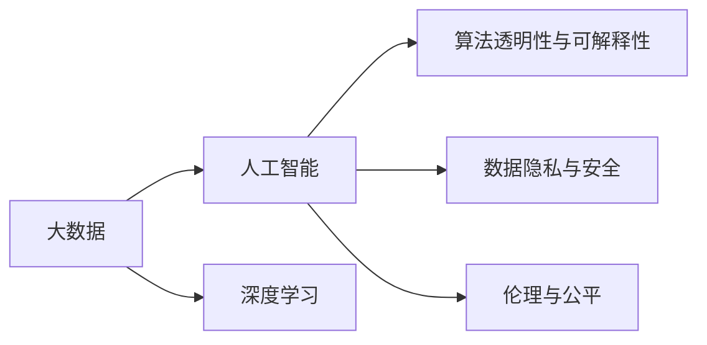

                 

## 1. 背景介绍

“人生而自由，却无往不在枷锁之中”，这是伏尔泰的一句名言，深刻道出了自由的真谛。而在大数据、人工智能（AI）和深度学习的领域，我们同样面临着类似的困境。这些技术在为我们带来便利的同时，也在无形中限制了我们的自由。本文将从大数据和人工智能的角度，探讨这一现象，并分析如何在这个数字枷锁中寻找自由。

## 2. 核心概念与联系

### 2.1 核心概念概述

在大数据和人工智能领域，存在许多关键概念，这些概念相互交织，构成了技术的基石。

- **大数据**：指数据量庞大、结构复杂、价值密度低的数据集合，其核心在于能够利用先进的数据分析工具，从中提取出有价值的信息。

- **人工智能**：一种通过机器学习、深度学习等技术，使得计算机能够模拟人类智能的技术，旨在解决复杂问题，提升决策效率。

- **深度学习**：一种特殊的机器学习方法，通过多层神经网络模型，能够自动学习和提取数据特征，在图像识别、自然语言处理等领域取得了巨大成功。

- **数据隐私与安全**：随着数据量的增加，如何保护数据隐私、防止数据泄露成为了一个重要的问题。

- **算法透明性与可解释性**：在深度学习模型中，黑箱模型的问题日益凸显，如何使模型更加透明，具备可解释性，成为了研究的热点。

- **伦理与公平**：随着AI技术的广泛应用，算法偏见、数据不均衡等问题，对社会的伦理和公平提出了严峻挑战。

这些核心概念间的关系可以用以下Mermaid流程图表示：



### 2.2 概念间的关系

这些核心概念之间存在紧密的联系。大数据是人工智能和深度学习的基石，而深度学习则是人工智能的核心技术之一。数据隐私和安全是应用大数据和深度学习技术必须考虑的重要问题，而算法透明性与可解释性、伦理与公平则是深度学习模型广泛应用后需要面对的挑战。

## 3. 核心算法原理 & 具体操作步骤

### 3.1 算法原理概述

在大数据和深度学习的应用中，算法原理是关键。以下是对核心算法原理的概述：

- **数据预处理**：在应用深度学习模型之前，需要对数据进行预处理，如去噪、归一化、特征提取等。

- **模型训练**：通过反向传播算法，对模型进行训练，使得模型能够对新的数据进行准确的预测。

- **模型评估**：对训练好的模型进行评估，如准确率、召回率、F1分数等，评估模型的性能。

- **模型优化**：通过超参数调优、正则化等手段，对模型进行优化，提升模型的泛化能力。

### 3.2 算法步骤详解

在深度学习模型训练过程中，常见的步骤包括：

1. **数据准备**：收集和整理数据，进行数据清洗和预处理，生成训练集、验证集和测试集。

2. **模型选择与构建**：选择合适的深度学习模型，并根据任务需求构建模型架构。

3. **超参数调优**：调整学习率、批大小、优化器等超参数，确保模型能够快速收敛。

4. **模型训练**：使用训练集对模型进行训练，通过反向传播算法更新模型参数。

5. **模型评估**：使用验证集评估模型性能，并根据评估结果进行调整。

6. **模型部署**：将训练好的模型部署到实际应用中，进行推理和预测。

### 3.3 算法优缺点

深度学习模型在处理复杂问题上具有显著优势，但同时也有一些缺点：

- **数据依赖性强**：深度学习模型需要大量的数据进行训练，数据量的多少直接影响到模型的性能。

- **模型复杂度高**：深度学习模型通常具有很多参数，模型复杂度高，需要大量的计算资源进行训练和推理。

- **黑箱问题**：深度学习模型通常被视为“黑箱”，其内部工作机制不透明，难以解释。

- **鲁棒性差**：深度学习模型对数据和超参数的变化敏感，容易产生过拟合。

### 3.4 算法应用领域

深度学习模型在多个领域得到了广泛应用，例如：

- **计算机视觉**：图像分类、物体检测、人脸识别等任务。

- **自然语言处理**：文本分类、机器翻译、语音识别等任务。

- **医疗健康**：医学影像分析、疾病预测、个性化医疗等任务。

- **金融风控**：信用评分、欺诈检测、市场分析等任务。

## 4. 数学模型和公式 & 详细讲解 & 举例说明

### 4.1 数学模型构建

在深度学习中，常用的数学模型包括神经网络模型、卷积神经网络（CNN）和循环神经网络（RNN）等。以下以神经网络模型为例，构建一个简单的模型。

假设我们的神经网络模型包含一个输入层、两个隐藏层和一个输出层，每个神经元接收前一层的所有神经元的输出，并应用激活函数进行处理。设输入样本为$x$，隐藏层输出为$h$，输出结果为$y$，则模型的前向传播过程可以表示为：

$$
h_1 = \sigma(W_1x + b_1)
$$

$$
h_2 = \sigma(W_2h_1 + b_2)
$$

$$
y = W_3h_2 + b_3
$$

其中，$W$和$b$分别为权重和偏置，$\sigma$为激活函数。

### 4.2 公式推导过程

在深度学习模型训练中，常用的优化算法包括梯度下降法（SGD）、随机梯度下降法（SGD）、Adam等。以Adam优化算法为例，其公式推导如下：

设学习率为$\eta$，初始梯度为$g_0$，则Adam算法更新公式为：

$$
m_t = \beta_1 m_{t-1} + (1-\beta_1) g_t
$$

$$
v_t = \beta_2 v_{t-1} + (1-\beta_2) g_t^2
$$

$$
\theta_{t+1} = \theta_t - \frac{\eta}{\sqrt{v_t}+\epsilon} m_t
$$

其中，$\beta_1$和$\beta_2$为动量衰减系数，$\epsilon$为防止分母为0的小量。

### 4.3 案例分析与讲解

以图像分类任务为例，使用卷积神经网络模型进行处理。假设我们有一个包含$M$个类别的数据集，每个类别包含$N$个样本。我们首先通过卷积层和池化层提取特征，然后通过全连接层进行分类。设模型参数为$W$和$b$，则模型的前向传播过程为：

$$
x' = W_{conv}x + b_{conv}
$$

$$
f(x') = W_{conv}x + b_{conv}
$$

$$
f(x') = W_{pool}f(x')
$$

$$
x'' = W_{fc}f(x')
$$

$$
y = \sigma(x'')
$$

其中，$W_{conv}$、$W_{pool}$和$W_{fc}$分别为卷积核、池化核和全连接核，$b_{conv}$和$b_{fc}$分别为卷积层和全连接层的偏置。

## 5. 项目实践：代码实例和详细解释说明

### 5.1 开发环境搭建

在开始项目实践前，我们需要搭建好开发环境。以下是在Python环境下搭建深度学习项目的步骤：

1. **安装Python和相关库**：安装Python 3.x，安装深度学习框架如TensorFlow、PyTorch等。

2. **创建虚拟环境**：使用虚拟环境工具，如Anaconda，创建一个Python虚拟环境，用于隔离不同项目的依赖。

3. **安装依赖包**：安装深度学习项目所需的相关依赖包，如NumPy、Pandas、Matplotlib等。

### 5.2 源代码详细实现

以下是一个使用PyTorch框架进行图像分类的代码示例。代码中使用了卷积神经网络模型，并使用Adam优化算法进行训练。

```python
import torch
import torch.nn as nn
import torch.optim as optim
import torchvision.transforms as transforms
import torchvision.datasets as datasets

class Net(nn.Module):
    def __init__(self):
        super(Net, self).__init__()
        self.conv1 = nn.Conv2d(3, 64, kernel_size=3, stride=1, padding=1)
        self.pool = nn.MaxPool2d(kernel_size=2, stride=2)
        self.fc1 = nn.Linear(64 * 28 * 28, 128)
        self.fc2 = nn.Linear(128, 10)

    def forward(self, x):
        x = self.pool(F.relu(self.conv1(x)))
        x = self.pool(F.relu(self.fc1(x.view(-1, 64 * 28 * 28)))
        x = self.fc2(x)
        return x

net = Net()
criterion = nn.CrossEntropyLoss()
optimizer = optim.Adam(net.parameters(), lr=0.001)

train_dataset = datasets.CIFAR10(root='./data', train=True, download=True, transform=transforms.ToTensor())
train_loader = torch.utils.data.DataLoader(train_dataset, batch_size=64, shuffle=True)

for epoch in range(10):
    for i, (images, labels) in enumerate(train_loader):
        optimizer.zero_grad()
        outputs = net(images)
        loss = criterion(outputs, labels)
        loss.backward()
        optimizer.step()
```

### 5.3 代码解读与分析

以上代码中，我们定义了一个卷积神经网络模型，并使用了Adam优化算法进行训练。具体来说，我们使用了PyTorch框架中的`nn.Conv2d`、`nn.MaxPool2d`、`nn.Linear`和`nn.ReLU`等模块，构建了一个包含两个卷积层和一个全连接层的神经网络模型。

在训练过程中，我们首先定义了损失函数和优化器，然后使用`torch.utils.data.DataLoader`将训练集数据加载到模型中，进行训练。在每个epoch中，我们对模型进行前向传播，计算损失，并使用反向传播算法更新模型参数。

### 5.4 运行结果展示

在训练过程中，我们可以使用`torchvision`库中的`utils`模块来可视化训练过程中的损失和准确率变化。以下是一个简单的可视化示例：

```python
import matplotlib.pyplot as plt

losses = []
accuracies = []

for epoch in range(10):
    loss = 0
    accuracy = 0
    for images, labels in train_loader:
        optimizer.zero_grad()
        outputs = net(images)
        loss += criterion(outputs, labels).item()
        _, predicted = torch.max(outputs.data, 1)
        accuracy += (predicted == labels).sum().item()
    losses.append(loss / len(train_loader))
    accuracies.append(accuracy / len(train_loader))
```

```python
plt.plot(losses, label='Loss')
plt.plot(accuracies, label='Accuracy')
plt.legend()
plt.show()
```

以上代码将训练过程中的损失和准确率变化绘制成曲线，以便观察模型的训练效果。

## 6. 实际应用场景

### 6.4 未来应用展望

随着深度学习技术的不断发展，其在各个领域的应用前景广阔。以下是一些未来可能的实际应用场景：

- **智能医疗**：使用深度学习模型对医疗影像进行分析和诊断，提高疾病诊断的准确率和效率。

- **智能交通**：使用深度学习模型对交通流量进行预测和优化，提升交通系统的智能化水平。

- **智能家居**：使用深度学习模型对家庭环境进行感知和控制，提升居住体验。

- **智能客服**：使用深度学习模型进行自然语言处理，提供智能客服和语音助手服务。

- **金融风控**：使用深度学习模型进行信用评分和欺诈检测，提升金融系统的安全性。

## 7. 工具和资源推荐

### 7.1 学习资源推荐

为了帮助读者更好地掌握深度学习技术，以下是一些推荐的学习资源：

- **Deep Learning Specialization**：由Andrew Ng教授主持的深度学习课程，在Coursera平台上提供。

- **TensorFlow官方文档**：TensorFlow的官方文档，详细介绍了TensorFlow的使用方法和API接口。

- **PyTorch官方文档**：PyTorch的官方文档，提供了丰富的教程和示例代码。

- **GitHub深度学习项目**：GitHub上包含大量深度学习项目的源代码，可以参考和学习。

- **Kaggle竞赛**：Kaggle是一个数据科学竞赛平台，提供大量公开数据集和竞赛任务，可以练习深度学习模型。

### 7.2 开发工具推荐

在深度学习项目开发中，以下工具可以帮助提高开发效率和模型性能：

- **Jupyter Notebook**：一个轻量级的开发环境，支持Python和数学公式的混合编辑。

- **TensorBoard**：TensorFlow配套的可视化工具，可以实时监控模型训练过程。

- **Weights & Biases**：模型训练的实验跟踪工具，可以记录和可视化模型训练过程中的各项指标。

- **PyTorch Lightning**：一个轻量级的深度学习框架，支持快速搭建和训练深度学习模型。

- **TensorFlow Extended (TFX)**：谷歌推出的机器学习框架，支持数据管道、模型训练和部署等全流程自动化。

### 7.3 相关论文推荐

为了了解深度学习领域的最新进展，以下是一些推荐的相关论文：

- **ImageNet Classification with Deep Convolutional Neural Networks**：Hinton等人提出的深度卷积神经网络模型，开创了计算机视觉领域的深度学习时代。

- **Convolutional Neural Networks for Sentence Classification**：Kim等人提出的卷积神经网络模型，用于自然语言处理中的文本分类任务。

- **Attention Is All You Need**：Vaswani等人提出的Transformer模型，用于自然语言处理中的序列建模任务。

- **Deep Learning for Personalized News Recommendation**：Li等人提出的深度学习模型，用于个性化新闻推荐任务。

- **Domain-Adversarial Training of Neural Networks**：Goodfellow等人提出的对抗训练方法，用于提高深度学习模型的鲁棒性和泛化能力。

## 8. 总结：未来发展趋势与挑战

### 8.1 研究成果总结

本文对深度学习模型在大数据应用中的原理和操作步骤进行了详细讲解，分析了深度学习模型的优缺点和应用领域。通过对比分析，揭示了深度学习模型在大数据应用中的利弊，并提出了一些优化方法和未来方向。

### 8.2 未来发展趋势

未来，深度学习模型将朝着更加高效、鲁棒、可解释和可控的方向发展。以下是一些未来趋势：

- **模型压缩与加速**：随着计算资源的增长，如何压缩深度学习模型并加速推理速度，是一个重要研究方向。

- **自动化模型设计**：通过自动化模型设计技术，如神经架构搜索（NAS），快速构建和优化深度学习模型。

- **联邦学习与隐私保护**：联邦学习技术可以保护数据隐私，同时实现模型协同优化，是未来数据隐私保护的重要方向。

- **多模态学习**：将视觉、听觉、文本等多种数据源进行融合，提升深度学习模型的泛化能力和适应性。

- **可解释性增强**：如何增强深度学习模型的可解释性，提升模型决策的可理解性和可信任性，是一个重要研究方向。

### 8.3 面临的挑战

尽管深度学习模型在各个领域取得了巨大成功，但仍面临一些挑战：

- **数据稀缺**：深度学习模型需要大量标注数据进行训练，数据稀缺问题仍然存在。

- **模型复杂度高**：深度学习模型参数众多，计算资源消耗大，训练和推理速度慢。

- **算法透明性与可解释性**：深度学习模型通常被视为“黑箱”，难以解释其内部工作机制。

- **伦理与公平性**：深度学习模型存在算法偏见和歧视性问题，需要从算法和数据源多个方面进行改进。

### 8.4 研究展望

未来，深度学习模型的研究将从以下几个方面展开：

- **模型可解释性**：如何增强深度学习模型的可解释性，提升模型决策的可理解性和可信任性，是一个重要研究方向。

- **模型公平性与鲁棒性**：如何消除深度学习模型的算法偏见，提高模型鲁棒性，是未来的重要方向。

- **自动化模型设计**：通过自动化模型设计技术，如神经架构搜索（NAS），快速构建和优化深度学习模型。

- **多模态学习**：将视觉、听觉、文本等多种数据源进行融合，提升深度学习模型的泛化能力和适应性。

- **联邦学习与隐私保护**：联邦学习技术可以保护数据隐私，同时实现模型协同优化，是未来数据隐私保护的重要方向。

总之，深度学习模型在大数据应用中具有广阔的发展前景，但同时也面临诸多挑战。只有不断地进行技术创新和改进，才能更好地发挥其潜力，为社会带来更大的价值。

## 9. 附录：常见问题与解答

### Q1：深度学习模型需要大量标注数据进行训练，如何缓解这一问题？

A：可以通过以下方法缓解深度学习模型对大量标注数据的依赖：

- **数据增强**：通过数据增强技术，如随机裁剪、旋转、缩放等，生成更多的训练数据。

- **半监督学习**：利用少量标注数据和大量未标注数据进行联合训练，提升模型性能。

- **自监督学习**：通过自监督学习任务，如自回归、自编码等，从无标签数据中学习特征，提升模型泛化能力。

### Q2：深度学习模型如何避免过拟合？

A：可以通过以下方法避免深度学习模型的过拟合：

- **正则化**：使用L2正则化、Dropout等技术，限制模型的复杂度，避免过拟合。

- **早停策略**：在验证集上监控模型性能，当性能不再提升时，停止训练。

- **数据增强**：通过数据增强技术，扩充训练集，提升模型泛化能力。

- **批量归一化**：在模型层之间添加归一化层，加速训练，提高模型泛化能力。

### Q3：如何提高深度学习模型的推理效率？

A：可以通过以下方法提高深度学习模型的推理效率：

- **模型剪枝**：去除不必要的层和参数，减小模型尺寸，提高推理速度。

- **量化加速**：将浮点模型转为定点模型，压缩存储空间，提高计算效率。

- **分布式训练**：使用分布式训练技术，加速模型训练过程，提升推理效率。

- **硬件加速**：使用GPU、TPU等硬件加速设备，提高模型训练和推理速度。

总之，深度学习模型在大数据应用中具有广阔的发展前景，但同时也面临诸多挑战。只有不断地进行技术创新和改进，才能更好地发挥其潜力，为社会带来更大的价值。

---

作者：禅与计算机程序设计艺术 / Zen and the Art of Computer Programming

