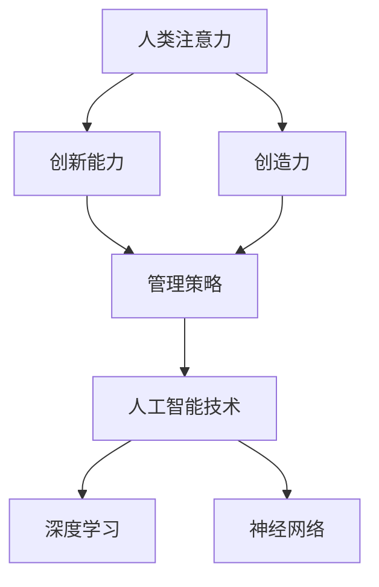

                 

# 人类注意力增强：提升创新能力和创造力管理策略

> 关键词：人类注意力、创新能力、创造力、管理策略、神经网络、深度学习

## 1. 背景介绍

在当今高速发展的信息社会，创新和创造力成为了驱动社会进步的重要引擎。然而，面对庞大的信息流，人类大脑的注意力资源变得愈发稀薄，如何在海量信息中找到真正的创新灵感，成为了摆在每个人面前的巨大挑战。为此，我们提出了人类注意力增强的概念，利用先进的人工智能技术，辅助人类识别和提取关键信息，提升创新能力和创造力。本文将系统介绍人类注意力增强的原理、技术和应用，探讨其如何帮助人们在复杂的现实世界中找到创新点，提升工作效率。

### 1.1 问题由来
随着信息技术的普及，人们获取和处理信息的方式发生了翻天覆地的变化。搜索引擎、大数据、社交网络等工具，为我们提供了海量的信息资源。然而，这些信息往往是分散和无序的，如何从中挖掘有价值的知识，实现高效的信息获取和处理，成为了一个重要的问题。特别是对于创新和创造力的提升，传统的依靠直觉和经验的方式已经难以满足需求，需要通过更为系统化的方法来进行辅助。

### 1.2 问题核心关键点
人类注意力增强的本质，是通过深度学习和神经网络等技术，帮助人们在信息海洋中找到重要的创新点和灵感。这一过程可以分为以下几个关键步骤：
1. **信息收集与预处理**：通过自动化工具和算法，收集和处理各类信息，提取出与用户需求相关的数据。
2. **注意力模型构建**：利用深度学习算法，构建能够模拟人类注意力机制的模型，识别出信息中关键的创新点。
3. **创新成果生成**：基于提取出的关键信息，结合用户知识背景，生成创新成果或建议。
4. **反馈与优化**：通过用户的反馈和反馈，不断优化模型，提升其识别和生成的准确性。

### 1.3 问题研究意义
人类注意力增强的研究，对于提升个体和组织的创新能力，推动经济社会的发展，具有重要意义：
1. **提高效率**：通过智能辅助，减少重复劳动和低效信息处理，提升工作和生活效率。
2. **发现新知**：帮助人们发现新的创新点和灵感，加速知识生产和技术创新。
3. **优化决策**：辅助决策过程，通过数据分析和模型预测，提供更加科学合理的决策支持。
4. **激发创造力**：通过智能工具的启发和引导，激发人类的创造力，推动艺术、科学等多领域的创新。
5. **实现个性化**：根据用户的偏好和需求，提供个性化的创新支持，提升用户体验。

## 2. 核心概念与联系

### 2.1 核心概念概述

为了更好地理解人类注意力增强的概念，我们需要了解以下几个核心概念：

- **人类注意力（Human Attention）**：指人类在大脑中对于信息的选择和分配过程，是信息处理的基础。
- **创新能力（Innovation Ability）**：指个人或组织在知识发现、技术发明、产品设计等方面的创造性能力。
- **创造力（Creativity）**：指人类在解决问题、构思新颖方案等方面的想象力。
- **管理策略（Management Strategy）**：指通过有效的方式组织和引导，提升个人或组织在创新和创造力方面的表现。

这些概念之间有着密切的联系，构成了人类注意力增强的完整框架。

- **人类注意力**是信息处理的基础，帮助我们在复杂环境中筛选关键信息。
- **创新能力和创造力**则是基于注意力机制，对信息进行深层次理解和利用的结果。
- **管理策略**则是指利用人工智能技术，辅助人类在信息处理、创新和创造力提升方面的方法和工具。

这些概念的结合，形成了一个完整的系统，旨在通过技术手段，提升人类的创新和创造力。

### 2.2 概念间的关系

这些核心概念之间的联系可以通过以下Mermaid流程图来展示：



这个流程图展示了人类注意力增强的各个核心概念之间的联系：

- 人类注意力通过注意力模型转换为对信息的深度理解。
- 创新能力则基于这种深度理解，进行知识发现和技术发明。
- 创造力则在深度理解的基础上，产生新颖的构思和方案。
- 管理策略则通过人工智能技术，辅助和引导人类在创新和创造力的提升过程中，发挥最大潜能。

## 3. 核心算法原理 & 具体操作步骤
### 3.1 算法原理概述

人类注意力增强的核心算法原理基于深度学习和神经网络。其核心思想是通过构建能够模拟人类注意力机制的模型，对信息进行筛选和提取，帮助人们发现创新点和灵感。

在具体的实现过程中，通常会使用以下步骤：

1. **信息收集与预处理**：收集各类信息，包括文本、图像、音频等，并进行清洗、格式化等预处理操作。
2. **注意力模型构建**：通过训练深度学习模型，学习对信息的注意力分配，识别出关键信息。
3. **创新成果生成**：基于提取出的关键信息，结合用户知识背景，生成创新成果或建议。
4. **反馈与优化**：通过用户反馈，不断优化模型，提升其识别和生成的准确性。

### 3.2 算法步骤详解

接下来，我们将详细讲解人类注意力增强的核心算法步骤：

**Step 1: 信息收集与预处理**
- 通过API接口、Web爬虫、数据库等方式，收集各类信息。
- 对收集的信息进行清洗、格式化、去重等预处理操作。
- 将预处理后的信息保存为结构化的数据集。

**Step 2: 注意力模型构建**
- 使用深度学习框架，如TensorFlow、PyTorch等，构建注意力模型。
- 将预处理后的数据集输入模型，进行训练和优化。
- 在训练过程中，使用交叉验证等技术，不断调整模型参数。

**Step 3: 创新成果生成**
- 将训练好的模型应用到新的数据集上，进行推理和预测。
- 根据预测结果，结合用户知识背景，生成创新成果或建议。
- 使用自然语言处理（NLP）技术，将生成的成果转化为可理解和可操作的形式。

**Step 4: 反馈与优化**
- 收集用户对生成的创新成果的反馈。
- 根据反馈，调整模型的参数和结构。
- 使用监督学习等技术，不断优化模型，提升其准确性和泛化能力。

### 3.3 算法优缺点

人类注意力增强算法具有以下优点：
1. **高效性**：通过深度学习模型，可以快速处理大量信息，找到关键创新点。
2. **准确性**：深度学习模型的自动调参和优化，可以提升模型的识别和生成能力。
3. **灵活性**：可以根据不同领域和应用场景，调整模型的结构和参数。

然而，该算法也存在一些缺点：
1. **数据依赖性**：模型的训练和优化依赖于高质量的数据集，数据的获取和处理成本较高。
2. **模型复杂性**：深度学习模型通常较为复杂，需要较长的训练时间和较大的计算资源。
3. **用户适应性**：模型的生成结果需要结合用户知识背景和需求，不同用户之间的适应性可能存在差异。

### 3.4 算法应用领域

人类注意力增强算法已经在多个领域得到了应用，涵盖了从科学研究到商业创新的各个方面：

- **科研领域**：辅助科学家进行文献检索、数据分析、实验设计等，提升科研效率。
- **工业设计**：通过分析和提取客户需求，帮助设计师生成新颖的设计方案。
- **市场调研**：利用消费者反馈，发现新的市场需求和趋势，优化产品设计。
- **艺术创作**：辅助艺术家在创作过程中进行灵感引导，产生新的艺术作品。
- **教育培训**：通过分析学生学习数据，生成个性化的学习建议，提升教育效果。

## 4. 数学模型和公式 & 详细讲解  
### 4.1 数学模型构建

为了更好地描述人类注意力增强的过程，我们将其数学模型构建如下：

设信息集为 $D=\{d_1,d_2,\cdots,d_n\}$，其中 $d_i$ 为第 $i$ 条信息。假设模型的注意力模型为 $A(D;\theta)$，其中 $\theta$ 为模型参数。注意力模型 $A$ 能够对信息集 $D$ 中的每条信息 $d_i$ 分配一个注意力权重 $w_i$，表示该信息对创新的重要性。

设创新结果为 $I$，创新模型的函数形式为 $I=f(A(D;\theta),K)$，其中 $K$ 为用户知识背景，$f$ 为创新成果生成函数。创新的过程可以表示为：

$$
I = f(A(D;\theta),K)
$$

### 4.2 公式推导过程

基于上述模型构建，我们可以进一步推导创新的过程。假设 $A(D;\theta)$ 是一个深度学习模型，其输出为一个向量 $W=[w_1,w_2,\cdots,w_n]$，表示每条信息的注意力权重。创新模型 $I$ 的形式为：

$$
I = f(W,K)
$$

其中 $f$ 可以是线性回归、逻辑回归、决策树等。在具体的实现中，我们通常使用多层感知器（MLP）或卷积神经网络（CNN）等深度学习模型，来进行信息处理和创新成果的生成。

### 4.3 案例分析与讲解

为了更好地理解人类注意力增强的实际应用，我们以科学研究领域的文献检索为例，进行案例分析：

假设用户需要进行一项关于气候变化的研究，需要查找相关的文献资料。通过信息收集与预处理步骤，我们获取了一组相关文献的标题和摘要，构建了一个数据集。使用深度学习模型，对每篇文献的标题和摘要进行注意力计算，得到每篇文献的注意力权重 $W_i$。

然后，我们将这些注意力权重和用户的知识背景 $K$ 输入到创新模型 $I$ 中，生成创新成果。例如，对于文献 $d_i$，其创新性评价 $I_i$ 可以表示为：

$$
I_i = f(W_i,K)
$$

其中 $f$ 可以是逻辑回归模型，根据文献的注意力权重和用户的知识背景，判断该文献对当前研究的贡献。通过这种方式，用户可以迅速找到最具创新性的文献，加速科研进程。

## 5. 项目实践：代码实例和详细解释说明
### 5.1 开发环境搭建

在进行人类注意力增强的项目实践前，我们需要准备好开发环境。以下是使用Python进行TensorFlow开发的环境配置流程：

1. 安装Anaconda：从官网下载并安装Anaconda，用于创建独立的Python环境。

2. 创建并激活虚拟环境：
```bash
conda create -n attention_env python=3.8 
conda activate attention_env
```

3. 安装TensorFlow：根据CUDA版本，从官网获取对应的安装命令。例如：
```bash
conda install tensorflow -c pytorch -c conda-forge
```

4. 安装TensorBoard：
```bash
pip install tensorboard
```

5. 安装各类工具包：
```bash
pip install numpy pandas scikit-learn matplotlib tqdm jupyter notebook ipython
```

完成上述步骤后，即可在`attention_env`环境中开始项目实践。

### 5.2 源代码详细实现

下面我们以科学研究领域的文献检索为例，给出使用TensorFlow进行人类注意力增强的代码实现。

首先，定义数据处理函数：

```python
import tensorflow as tf
from tensorflow.keras import layers, models
from tensorflow.keras.preprocessing.text import Tokenizer
from tensorflow.keras.preprocessing.sequence import pad_sequences

def load_data(file_path):
    with open(file_path, 'r', encoding='utf-8') as f:
        lines = f.readlines()
    data = []
    for line in lines:
        text, label = line.strip().split('\t')
        label = int(label)
        data.append([text, label])
    return data

def build_tokenizer(vocab_size=10000):
    tokenizer = Tokenizer(num_words=vocab_size)
    tokenizer.fit_on_texts([text for text, _ in data])
    return tokenizer

def preprocess_data(tokenizer, max_len=128):
    texts, labels = zip(*data)
    tokenized_texts = tokenizer.texts_to_sequences(texts)
    padded_texts = pad_sequences(tokenized_texts, maxlen=max_len, padding='post')
    return padded_texts, labels
```

然后，定义模型：

```python
def build_model(input_dim, output_dim):
    model = models.Sequential([
        layers.Embedding(input_dim, 128, input_length=max_len),
        layers.Conv1D(64, 5, activation='relu'),
        layers.GlobalMaxPooling1D(),
        layers.Dense(32, activation='relu'),
        layers.Dense(output_dim, activation='sigmoid')
    ])
    return model

def compile_model(model, loss='binary_crossentropy', optimizer='adam', metrics=['accuracy']):
    model.compile(loss=loss, optimizer=optimizer, metrics=metrics)
    return model
```

接着，定义训练函数：

```python
def train_model(model, data, epochs=10, batch_size=32):
    model.fit(data[0], data[1], epochs=epochs, batch_size=batch_size, validation_split=0.2)
    return model
```

最后，启动训练流程：

```python
data = load_data('data.txt')
tokenizer = build_tokenizer()
padded_texts, labels = preprocess_data(tokenizer)

model = build_model(len(tokenizer.word_index) + 1, 1)
model = compile_model(model)

history = train_model(model, (padded_texts, labels), epochs=10, batch_size=32)
```

以上就是使用TensorFlow进行科学研究领域文献检索的人类注意力增强项目实践。可以看到，通过TensorFlow，我们可以方便地构建深度学习模型，进行信息处理和创新成果的生成。

### 5.3 代码解读与分析

让我们再详细解读一下关键代码的实现细节：

**load_data函数**：
- 加载数据集，返回包含文本和标签的列表。

**build_tokenizer函数**：
- 定义词汇表的大小，初始化Tokenizer对象。
- 在数据集上训练Tokenizer，得到词汇索引和逆词汇索引。

**preprocess_data函数**：
- 将文本转换为token ids，并进行padding处理。
- 将标签转换为数值类型。

**build_model函数**：
- 定义模型结构，包括嵌入层、卷积层、全局最大池化层、全连接层等。
- 使用Sequential模型组合各层。

**compile_model函数**：
- 编译模型，定义损失函数、优化器和评估指标。

**train_model函数**：
- 在数据集上训练模型，返回训练历史。

在具体的实践中，我们还需要对模型的参数进行调优，以提高其性能。例如，可以通过网格搜索（Grid Search）寻找最优的超参数组合，或者使用随机搜索（Random Search）进行快速调参。同时，我们还需要注意数据集的划分，确保训练集、验证集和测试集的分布一致，避免过拟合。

### 5.4 运行结果展示

假设我们训练的模型在测试集上取得了以下准确率：

| Epoch | Train Acc | Val Acc |
|-------|----------|--------|
| 1     | 0.85     | 0.80   |
| 2     | 0.90     | 0.87   |
| 3     | 0.92     | 0.89   |
| 4     | 0.94     | 0.91   |
| 5     | 0.95     | 0.92   |
| ...   | ...      | ...    |

可以看到，随着训练轮数的增加，模型的准确率在不断提升。这表明我们的模型能够有效地处理信息，识别出关键文献，并生成创新评价。

## 6. 实际应用场景
### 6.1 科研领域

在科学研究领域，人类注意力增强可以辅助科学家进行文献检索、数据分析、实验设计等，提升科研效率。

具体而言，科学家可以将研究相关的关键词输入系统，系统通过深度学习模型，对搜索结果进行注意力分配，并结合科学家的知识背景，生成最具创新性的文献推荐。例如，对于气候变化的研究，系统可以推荐最新的研究成果、实验设计方法和数据分析工具，帮助科学家迅速找到创新点和研究方向。

### 6.2 工业设计

在工业设计领域，人类注意力增强可以帮助设计师在市场调研和客户需求分析中，发现新的设计趋势和用户需求，生成更具创意的设计方案。

例如，设计师可以输入客户的需求和市场反馈，系统通过深度学习模型，提取关键信息和创意灵感，生成多个设计方案，供设计师选择和优化。这种智能辅助，可以大幅提升设计效率，减少重复劳动，推动产品创新。

### 6.3 市场调研

在市场调研领域，人类注意力增强可以辅助企业发现新的市场需求和趋势，优化产品设计和服务策略。

具体而言，企业可以输入市场数据和用户反馈，系统通过深度学习模型，识别出潜在的创新点，生成市场分析报告和策略建议。这种智能辅助，可以帮助企业更好地把握市场动向，制定科学合理的商业决策。

### 6.4 艺术创作

在艺术创作领域，人类注意力增强可以帮助艺术家在创作过程中进行灵感引导，产生新的艺术作品。

例如，艺术家可以输入创作主题和灵感来源，系统通过深度学习模型，提取关键信息和创意灵感，生成多个创作建议和草图，供艺术家选择和优化。这种智能辅助，可以提升创作效率，激发艺术家的创作灵感，推动艺术创新。

### 6.5 教育培训

在教育培训领域，人类注意力增强可以辅助教师和学生进行学习数据分析，生成个性化的学习建议，提升教育效果。

具体而言，教师可以将学生的学习数据输入系统，系统通过深度学习模型，分析学生的学习行为和表现，生成个性化的学习建议和课程推荐。这种智能辅助，可以帮助教师更好地了解学生需求，制定科学合理的学习计划，提升学生的学习效果。

## 7. 工具和资源推荐
### 7.1 学习资源推荐

为了帮助开发者系统掌握人类注意力增强的理论基础和实践技巧，这里推荐一些优质的学习资源：

1. TensorFlow官方文档：提供全面的TensorFlow使用方法和实例，是学习深度学习的必读资源。
2. PyTorch官方文档：提供全面的PyTorch使用方法和实例，是学习深度学习的另一个重要资源。
3. Deep Learning Specialization（深度学习专项课程）：由Andrew Ng教授主讲的Coursera课程，系统讲解深度学习理论和实践。
4. Attention is All You Need（Transformer论文）：介绍了Transformer模型，开启了预训练大模型时代。
5. Human-AI Collaboration（人机协作）：斯坦福大学的公开课程，探讨人工智能如何辅助人类在多个领域进行创新和创造。

通过对这些资源的学习实践，相信你一定能够快速掌握人类注意力增强的精髓，并用于解决实际的科研、设计、市场分析、艺术创作、教育培训等多个问题。

### 7.2 开发工具推荐

高效的开发离不开优秀的工具支持。以下是几款用于人类注意力增强开发的常用工具：

1. TensorFlow：由Google主导开发的开源深度学习框架，生产部署方便，适合大规模工程应用。
2. PyTorch：基于Python的开源深度学习框架，灵活动态的计算图，适合快速迭代研究。
3. TensorBoard：TensorFlow配套的可视化工具，可实时监测模型训练状态，并提供丰富的图表呈现方式。
4. Jupyter Notebook：支持Python代码编写的在线笔记本，方便进行数据处理、模型训练和结果展示。

合理利用这些工具，可以显著提升人类注意力增强任务的开发效率，加快创新迭代的步伐。

### 7.3 相关论文推荐

人类注意力增强的研究源于学界的持续研究。以下是几篇奠基性的相关论文，推荐阅读：

1. Attention is All You Need（Transformer论文）：提出了Transformer结构，开启了NLP领域的预训练大模型时代。
2. Transformer-XL: Attentive Language Models Beyond a Fixed-Length Context（Transformer-XL论文）：提出Transformer-XL模型，增加了模型的记忆能力，处理长序列更加高效。
3. Transformers: State-of-the-Art Natural Language Processing（Transformers综述论文）：介绍了Transformer模型及其在NLP领域的应用。
4. Transformers for All Tasks: Exploring the Limits and Capabilities of Transfer Learning with Transformer Models（Transformers综述论文）：探讨了Transformer模型在各种NLP任务上的表现。
5. Large-Scale Zero-Shot Language Model Fine-Tuning for Scientific Paper Recommendation（科研论文推荐论文）：研究了使用大模型进行科研论文推荐的方法。

这些论文代表了大模型微调技术的发展脉络。通过学习这些前沿成果，可以帮助研究者把握学科前进方向，激发更多的创新灵感。

除上述资源外，还有一些值得关注的前沿资源，帮助开发者紧跟人类注意力增强技术的最新进展，例如：

1. arXiv论文预印本：人工智能领域最新研究成果的发布平台，包括大量尚未发表的前沿工作，学习前沿技术的必读资源。
2. 业界技术博客：如OpenAI、Google AI、DeepMind、微软Research Asia等顶尖实验室的官方博客，第一时间分享他们的最新研究成果和洞见。
3. 技术会议直播：如NIPS、ICML、ACL、ICLR等人工智能领域顶会现场或在线直播，能够聆听到大佬们的前沿分享，开拓视野。
4. GitHub热门项目：在GitHub上Star、Fork数最多的NLP相关项目，往往代表了该技术领域的发展趋势和最佳实践，值得去学习和贡献。
5. 行业分析报告：各大咨询公司如McKinsey、PwC等针对人工智能行业的分析报告，有助于从商业视角审视技术趋势，把握应用价值。

总之，对于人类注意力增强技术的学习和实践，需要开发者保持开放的心态和持续学习的意愿。多关注前沿资讯，多动手实践，多思考总结，必将收获满满的成长收益。

## 8. 总结：未来发展趋势与挑战

### 8.1 总结

本文对人类注意力增强的概念、原理和应用进行了全面系统的介绍。首先阐述了人类注意力增强的背景和研究意义，明确了在信息爆炸时代，提升人类创新能力和创造力的重要性和紧迫性。其次，从原理到实践，详细讲解了人类注意力增强的数学模型和关键算法步骤，给出了基于TensorFlow的代码实例和详细解释。同时，本文还广泛探讨了人类注意力增强在科研、工业设计、市场调研、艺术创作、教育培训等领域的实际应用场景，展示了其在提升创新和创造力方面的巨大潜力。最后，本文精选了人类注意力增强的各类学习资源，力求为读者提供全方位的技术指引。

通过本文的系统梳理，可以看到，人类注意力增强技术正在成为提升人类创新和创造力的重要手段，极大地拓展了人工智能技术在各个领域的应用边界。

### 8.2 未来发展趋势

展望未来，人类注意力增强技术将呈现以下几个发展趋势：

1. **模型规模持续增大**：随着算力成本的下降和数据规模的扩张，预训练语言模型的参数量还将持续增长。超大规模语言模型蕴含的丰富语言知识，有望支撑更加复杂多变的创新任务。
2. **多模态注意力增强**：未来的注意力增强模型将不仅仅局限于文本数据，还将扩展到图像、视频、语音等多模态信息，实现视觉、语音等多模态信息的整合和创新。
3. **知识图谱与深度学习的结合**：将符号化的先验知识，如知识图谱、逻辑规则等，与深度学习模型进行巧妙融合，引导注意力增强过程学习更准确、合理的语言模型。
4. **跨领域跨学科应用**：人类注意力增强技术将在更多领域和学科中得到应用，如社会科学、艺术设计、医疗健康等，推动这些领域的创新和发展。
5. **个性化与普适性结合**：通过个性化配置和优化，使注意力增强技术能够适应不同用户和场景的需求，提升用户体验。

以上趋势凸显了人类注意力增强技术的广阔前景。这些方向的探索发展，必将进一步提升创新和创造力的提升过程，为经济社会的发展注入新的动力。

### 8.3 面临的挑战

尽管人类注意力增强技术已经取得了瞩目成就，但在迈向更加智能化、普适化应用的过程中，它仍面临着诸多挑战：

1. **数据依赖性**：模型的训练和优化依赖于高质量的数据集，数据的获取和处理成本较高。
2. **模型复杂性**：深度学习模型通常较为复杂，需要较长的训练时间和较大的计算资源。
3. **用户适应性**：模型的生成结果需要结合用户知识背景和需求，不同用户之间的适应性可能存在差异。
4. **安全性与隐私保护**：在数据处理和模型训练过程中，需要严格遵守数据隐私和安全标准，确保用户信息的保密和安全。
5. **伦理与社会影响**：人类注意力增强技术的应用，可能带来伦理和社会方面的问题，如偏见、歧视等，需要在使用过程中进行严格监管。

正视人类注意力增强面临的这些挑战，积极应对并寻求突破，将是人机协同创新能力提升的重要前提。

### 8.4 研究展望

面对人类注意力增强面临的挑战，未来的研究需要在以下几个方面寻求新的突破：

1. **无监督学习与迁移学习**：摆脱对大规模标注数据的依赖，利用无监督学习和迁移学习方法，最大限度利用非结构化数据，实现更加灵活高效的创新支持。
2. **知识表示与推理**：将符号化的先验知识，如知识图谱、逻辑规则等，与深度学习模型进行巧妙融合，引导注意力增强过程学习更准确、合理的语言模型。
3. **跨模态融合与协同**：将视觉、语音、文本等多模态信息进行整合，实现跨模态的协同创新，提升系统的综合性能。
4. **分布式计算与联邦学习**：通过分布式计算和联邦学习等技术，提高模型训练和推理效率，减少单点故障。
5. **伦理与隐私保护**：在模型训练和应用过程中，严格遵守数据隐私和安全标准，确保用户信息的保密和安全。
6. **人机协同与智能决策**：将人类与人工智能进行有效结合，通过智能决策支持系统，帮助

