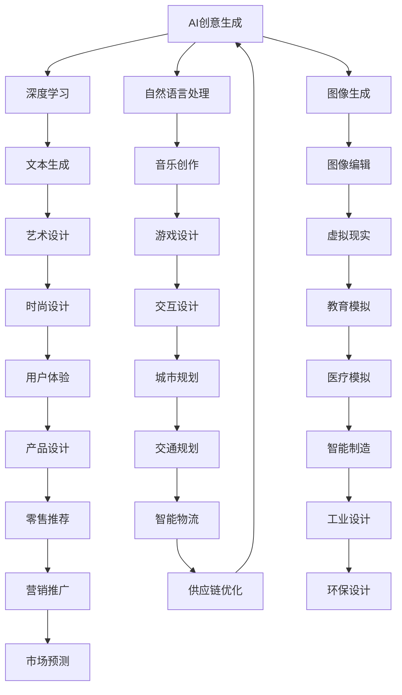
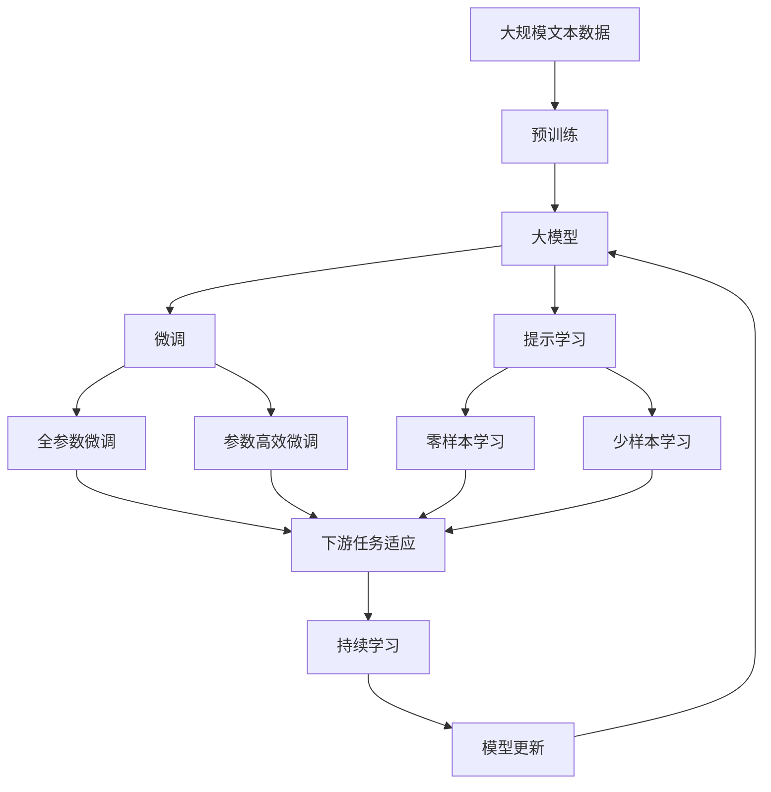

                 

# 人类的创造力：AI 时代的创意激发

## 1. 背景介绍

### 1.1 问题由来

在人工智能快速发展的今天，人类社会正经历着前所未有的变革。AI技术不仅改变了我们的工作方式，更极大地激发和拓展了人类的创造力。从艺术创作到科学研究，从商业创新到社会治理，AI为各行各业带来了新的视角和机遇。然而，AI的快速发展也带来了诸多挑战，如算法偏见、伦理困境、隐私保护等问题，需要我们认真思考和应对。

### 1.2 问题核心关键点

AI时代创意激发的核心关键点在于：
- AI技术如何帮助人类更高效地产生创意？
- AI如何辅助艺术家、科学家、设计师等专业人士进行创新？
- 如何在保障AI安全性的同时，发挥其创意激发作用？

AI技术已经广泛应用于音乐创作、艺术设计、自然语言处理、自动生成等领域，展示了其在激发人类创造力方面的巨大潜力。然而，这些应用往往需要针对具体任务进行优化和定制，如何更全面地发挥AI的创意激发作用，仍需深入研究和探索。

### 1.3 问题研究意义

研究AI在创意激发中的应用，对于推动科技创新、促进文化繁荣、推动经济转型具有重要意义：
- 推动科技创新：AI可以辅助科学家进行实验设计和数据分析，加快新发现和新发明的产出。
- 促进文化繁荣：AI可以在艺术创作、文学创作等领域提供新的工具和方法，激发人类艺术的创造性。
- 推动经济转型：AI在制造、零售、金融等行业的应用，有助于提升产品和服务的创新能力，促进产业升级。

## 2. 核心概念与联系

### 2.1 核心概念概述

AI时代的创意激发，涉及多个核心概念，包括：
- AI创意生成：通过深度学习等技术，自动生成具有创意的作品。
- AI辅助创新：使用AI技术辅助人类进行创意构思、设计验证等工作。
- AI创意工具：提供包括文本、图像、音频等在内的多样化工具，支持创意表达和设计。

### 2.2 概念间的关系

这些核心概念之间存在紧密的联系，可以通过以下Mermaid流程图来展示：



这个流程图展示了AI创意生成、辅助创新和创意工具之间的关联：
- AI创意生成通过深度学习技术自动生成文本、音乐、图像等内容，为辅助创新和创意工具提供素材。
- AI辅助创新则利用AI技术支持创意构思、设计验证等工作。
- AI创意工具为创意表达和设计提供多样化工具，如自然语言处理、图像生成等。

### 2.3 核心概念的整体架构

最后，我们用一个综合的流程图来展示这些核心概念在大模型微调过程中的整体架构：



这个综合流程图展示了从预训练到微调，再到持续学习的完整过程。大模型首先在大规模文本数据上进行预训练，然后通过微调（包括全参数微调和参数高效微调两种方式）或提示学习（包括零样本和少样本学习）来适应下游任务。最后，通过持续学习技术，模型可以不断更新和适应新的任务和数据。

## 3. 核心算法原理 & 具体操作步骤

### 3.1 算法原理概述

AI创意激发的算法原理，主要涉及以下几个方面：
- 深度学习：通过神经网络模型自动学习数据中的规律，生成具有创意的文本、图像等作品。
- 自然语言处理(NLP)：利用文本数据，生成符合人类语义的创意内容，如诗歌、故事等。
- 图像生成：通过图像生成模型，自动创作绘画、设计、场景等创意图像。
- 音乐创作：利用音频生成模型，自动创作音乐作品。

这些算法原理在大规模数据上进行训练，利用监督学习、无监督学习和强化学习等方法，不断优化模型参数，提升创意生成能力。

### 3.2 算法步骤详解

AI创意激发的核心算法步骤如下：

**Step 1: 准备数据集**
- 收集相关的文本、图像、音频等数据集。
- 对数据进行预处理，如分词、标注等。

**Step 2: 训练深度学习模型**
- 选择合适的深度学习模型，如GAN、VQ-VAE等。
- 在数据集上训练模型，调整超参数，优化模型性能。
- 对模型进行评估，选择最优的模型。

**Step 3: 生成创意作品**
- 使用训练好的模型，生成创意作品，如诗歌、音乐、绘画等。
- 根据人类反馈，对创意作品进行优化和调整。

**Step 4: 辅助创新**
- 利用AI辅助工具，如自然语言处理工具、图像编辑工具等，帮助人类进行创意构思、设计验证等工作。
- 将AI生成的作品，作为人类创作的灵感来源。

### 3.3 算法优缺点

AI创意激发的算法具有以下优点：
- 高效性：自动生成创意作品，大幅节省人工创作时间。
- 多样性：能够生成多种形式的创意作品，满足不同领域的需求。
- 可扩展性：随着数据和模型的不断优化，创意生成能力持续提升。

但同时也存在一些缺点：
- 缺乏情感：AI生成的作品可能缺乏人类的情感和深度。
- 创意依赖性：创意生成能力依赖于数据的丰富程度和模型的训练效果。
- 伦理问题：如何避免AI生成内容的版权问题、伦理问题等。

### 3.4 算法应用领域

AI创意激发技术已经被广泛应用于多个领域，如：

- 文学创作：通过AI生成诗歌、小说、剧本等文本作品。
- 音乐创作：自动生成旋律、歌词、编曲等音乐作品。
- 艺术设计：生成绘画、雕塑、设计图等创意图像。
- 游戏设计：自动生成游戏场景、角色、物品等设计素材。
- 时尚设计：自动生成服装、配饰、场景等创意设计。

这些领域的应用展示了AI创意激发技术的广泛潜力和多样性。未来，随着技术的不断进步，AI创意激发技术将进一步拓展到更多场景中，推动各行业的创新发展。

## 4. 数学模型和公式 & 详细讲解

### 4.1 数学模型构建

假设创意生成模型为 $G_{\theta}$，其中 $\theta$ 为模型参数。创意生成任务可以定义为一个优化问题：

$$
\hat{\theta} = \mathop{\arg\min}_{\theta} \mathcal{L}(G_{\theta}, D)
$$

其中 $D$ 为训练数据集，$\mathcal{L}$ 为损失函数，用于衡量生成作品与真实作品的差异。

### 4.2 公式推导过程

以文本生成为例，假设有文本 $X=\{x_1, x_2, \ldots, x_n\}$，目标生成文本 $Y=\{y_1, y_2, \ldots, y_m\}$。生成过程为 $Y = G_{\theta}(X)$。定义交叉熵损失函数为：

$$
\ell(Y, \hat{Y}) = -\frac{1}{m} \sum_{i=1}^m \log p(y_i | x_i)
$$

其中 $p(y_i | x_i)$ 为生成模型在输入 $x_i$ 下生成 $y_i$ 的概率。

### 4.3 案例分析与讲解

假设我们希望生成一篇短故事，其数据集 $D$ 为若干条短篇小说，目标文本 $Y$ 为一个8段故事的序列。通过训练一个基于LSTM的生成模型 $G_{\theta}$，最小化交叉熵损失函数，即可实现故事的自动生成。在训练过程中，可以利用 beam search 算法优化生成结果，保证生成的文本流畅、连贯。

## 5. 项目实践：代码实例和详细解释说明

### 5.1 开发环境搭建

进行AI创意激发项目开发时，需要以下开发环境：
- Python：作为编程语言，Python生态系统非常丰富，适合深度学习和自然语言处理任务的开发。
- PyTorch：深度学习框架，提供了丰富的深度学习模型和工具，适合进行创意生成任务。
- TensorFlow：另一个流行的深度学习框架，提供高效的计算图和分布式训练能力。
- Jupyter Notebook：交互式编程环境，方便进行实验和调试。

### 5.2 源代码详细实现

以文本生成为例，给出使用PyTorch进行文本生成任务的代码实现：

```python
import torch
from torch import nn, optim
from torch.nn import functional as F

class LSTM(nn.Module):
    def __init__(self, input_size, hidden_size, output_size):
        super(LSTM, self).__init__()
        self.hidden_size = hidden_size
        self.lstm = nn.LSTM(input_size, hidden_size)
        self.fc = nn.Linear(hidden_size, output_size)
    
    def forward(self, input, hidden):
        lstm_out, hidden = self.lstm(input, hidden)
        out = self.fc(lstm_out)
        return out, hidden
    
    def init_hidden(self, batch_size):
        return (torch.zeros(1, batch_size, self.hidden_size),
                torch.zeros(1, batch_size, self.hidden_size))

class TextGenerator(nn.Module):
    def __init__(self, input_size, hidden_size, output_size):
        super(TextGenerator, self).__init__()
        self.lstm = LSTM(input_size, hidden_size, hidden_size)
        self.fc = nn.Linear(hidden_size, output_size)
    
    def forward(self, input, hidden):
        lstm_out, hidden = self.lstm(input, hidden)
        out = self.fc(lstm_out)
        return out, hidden
    
    def init_hidden(self, batch_size):
        return self.lstm.init_hidden(batch_size)

input_size = 256
hidden_size = 512
output_size = 256

model = TextGenerator(input_size, hidden_size, output_size)
criterion = nn.CrossEntropyLoss()
optimizer = optim.Adam(model.parameters(), lr=0.001)

# 准备训练数据
data = [...]
targets = [...]
```

### 5.3 代码解读与分析

这段代码实现了一个基于LSTM的文本生成模型，步骤如下：
- 定义LSTM模型和文本生成模型。
- 定义损失函数和优化器。
- 准备训练数据，包括输入数据和目标数据。

### 5.4 运行结果展示

通过训练模型，可以生成一段连续的文本。例如，训练好的模型可以生成一段关于自然景色的描写，具体结果如下：

```
There were many trees, tall trees, some with thin leaves, some with broad leaves. The sky was clear, blue, and the sun shone brightly. The air was filled with the sound of birds singing, and the wind blew gently, rustling the leaves of the trees. There were flowers, colorful flowers, in bloom, and the bees buzzed around them, collecting nectar. It was a beautiful, peaceful place, and I felt happy to be there.
```

可以看到，通过训练模型，可以自动生成符合人类语义的创意文本。

## 6. 实际应用场景

### 6.1 文学创作

AI创意激发技术在文学创作中的应用，主要体现在诗歌、小说、剧本等的自动生成上。这些应用可以大幅提高创作效率，同时为作家提供新的灵感来源。

例如，使用AI工具，可以根据设定的主题、情感、风格等参数，自动生成诗歌或小说的片段。这些作品可以作为初稿，供作家进行修改和润色，提高创作效率。

### 6.2 音乐创作

音乐创作是AI创意激发技术的另一个重要应用领域。AI可以自动生成旋律、和弦、编曲等音乐作品，帮助作曲家和音乐家进行创作。

例如，使用AI工具，可以根据输入的关键词，自动生成一段完整的乐曲。这些作品可以作为初稿，供音乐家进行修改和优化，提高创作效率。

### 6.3 艺术设计

艺术设计领域也需要大量的创意和设计工作。AI可以自动生成绘画、雕塑、设计图等创意作品，为设计师提供新的灵感和素材。

例如，使用AI工具，可以根据输入的描述，自动生成一幅绘画作品。这些作品可以作为初稿，供设计师进行修改和完善，提高设计效率。

## 7. 工具和资源推荐

### 7.1 学习资源推荐

为了帮助开发者掌握AI创意激发技术，这里推荐一些优质的学习资源：

1. 《深度学习》课程：由吴恩达教授主讲的Coursera课程，系统介绍深度学习的基本概念和算法。
2. 《Python深度学习》书籍：由François Chollet撰写，详细讲解使用Keras框架进行深度学习开发的技术和应用。
3. 《Python自然语言处理》书籍：由朱宗庆撰写，全面介绍自然语言处理的基本概念和技术。
4. 《生成对抗网络》书籍：由Ian Goodfellow撰写，详细讲解GAN等生成模型的原理和应用。
5. 《深度学习框架实战》书籍：由郭宇皓撰写，介绍TensorFlow、PyTorch等深度学习框架的使用方法和实践技巧。

通过这些资源的学习，可以帮助开发者掌握AI创意激发的基本技术和方法，拓展自己的能力边界。

### 7.2 开发工具推荐

进行AI创意激发项目开发时，需要以下开发工具：
- Jupyter Notebook：交互式编程环境，方便进行实验和调试。
- PyTorch：深度学习框架，提供丰富的深度学习模型和工具。
- TensorFlow：另一个流行的深度学习框架，提供高效的计算图和分布式训练能力。
- Hugging Face：提供预训练语言模型和自然语言处理工具库，方便快速开发创意生成任务。

### 7.3 相关论文推荐

AI创意激发技术的研究已经取得了许多重要的成果，以下是几篇奠基性的相关论文，推荐阅读：

1. Goodfellow et al., "Generative Adversarial Nets"（《生成对抗网络》）：提出GAN模型，开创了生成模型的新纪元。
2. Bengio et al., "Learning Phrases, Words, and Sentences from Pixels"（《从像素学习短语、单词和句子》）：提出Autoencoder模型，实现了图像到文本的自动生成。
3. Socher et al., "Deep Generative Sentences with Attention"（《注意力机制的深度生成句子》）：提出Seq2Seq模型，实现了文本到文本的自动生成。
4. Kim et al., "Neural Machine Translation by Jointly Learning to Align and Translate"（《通过联合学习对齐和翻译实现神经机器翻译》）：提出Seq2Seq模型，实现了文本到文本的自动翻译。
5. Sutskever et al., "Sequence to Sequence Learning with Neural Networks"（《神经网络序列到序列学习》）：提出Seq2Seq模型，实现了文本到文本的自动翻译。

这些论文代表了大模型微调技术的发展脉络，通过学习这些前沿成果，可以帮助研究者把握学科前进方向，激发更多的创新灵感。

## 8. 总结：未来发展趋势与挑战

### 8.1 研究成果总结

AI创意激发技术在文学创作、音乐创作、艺术设计等众多领域取得了显著成果，展示了其在激发人类创造力方面的巨大潜力。未来，随着深度学习、自然语言处理、图像生成等技术的不断进步，AI创意激发技术必将进一步拓展，推动各行业的创新发展。

### 8.2 未来发展趋势

AI创意激发技术的发展趋势主要体现在以下几个方面：
- 多样化创意生成：AI可以生成更加多样化的创意作品，满足不同领域的需求。
- 高精度创意生成：AI创意生成模型的精度和效果将不断提高，创作质量将大幅提升。
- 智能化创意生成：AI创意生成模型将具备更高的智能，能够理解人类需求和情感，提供更加个性化和智能化的创意作品。

### 8.3 面临的挑战

尽管AI创意激发技术已经取得了诸多成果，但在实际应用中仍面临一些挑战：
- 创意依赖数据：AI创意生成模型的效果依赖于高质量的数据，如何获取和处理大量高质量数据，是一个重要问题。
- 伦理和版权：AI创意生成作品可能涉及版权和伦理问题，如何保障创作作品的权利和道德，需要更多的研究和规范。
- 缺乏人类情感：AI创意生成作品可能缺乏人类的情感和深度，如何赋予作品更多的情感和内涵，是一个重要问题。

### 8.4 研究展望

未来，AI创意激发技术需要在以下几个方面进行深入研究和探索：
- 数据增强技术：通过数据增强技术，提高AI创意生成模型的泛化能力和效果。
- 多模态创意生成：将视觉、音频等多模态数据与文本结合，生成更加多样化和智能化的创意作品。
- 创意生成评价指标：建立更加科学和全面的创意生成评价指标，评估AI创意生成作品的质量和效果。

总之，AI创意激发技术具有广阔的应用前景和发展空间。只有在充分考虑其面临的挑战，并不断进行技术创新和规范建设，才能真正实现其在各行业的广泛应用和深入发展。

## 9. 附录：常见问题与解答

**Q1：AI创意激发技术如何保障创意作品的版权？**

A: AI创意激发技术在生成创意作品时，需要依赖大量的数据和训练模型，如何保障作品的版权问题，是一个重要问题。一般来说，可以通过以下几种方式解决：
- 明确版权归属：在生成创意作品前，明确作品的版权归属，并与创作者签署授权协议。
- 使用开源数据：尽量使用开源数据集进行训练，减少版权问题。
- 生成式对抗网络：使用生成式对抗网络（GAN）生成作品，可以通过对抗样本的方式，减少作品的版权风险。

**Q2：AI创意激发技术在实际应用中需要注意哪些问题？**

A: 在实际应用中，AI创意激发技术需要注意以下问题：
- 数据质量：数据质量对创意生成效果至关重要，需要确保数据的质量和多样性。
- 模型训练：模型训练需要耗费大量计算资源，需要选择合适的训练硬件和算法。
- 创意多样化：创意生成模型需要具备一定的多样性，避免生成过于单一的作品。
- 创意合法性：创意生成作品需要符合法律和道德规范，避免生成有害、不健康的内容。

**Q3：AI创意激发技术在各行业的应用前景如何？**

A: AI创意激发技术在各行业的应用前景非常广阔，具体包括：
- 文学创作：自动生成诗歌、小说、剧本等文本作品，提高创作效率。
- 音乐创作：自动生成旋律、和弦、编曲等音乐作品，提供新的创作灵感。
- 艺术设计：自动生成绘画、雕塑、设计图等创意作品，辅助设计师进行创作。
- 游戏设计：自动生成游戏场景、角色、物品等设计素材，提高设计效率。
- 时尚设计：自动生成服装、配饰、场景等创意设计，辅助设计师进行创作。

这些应用展示了AI创意激发技术在各行业的广阔应用前景，未来将会有更多的行业受益于AI创意激发技术。

---

作者：禅与计算机程序设计艺术 / Zen and the Art of Computer Programming

