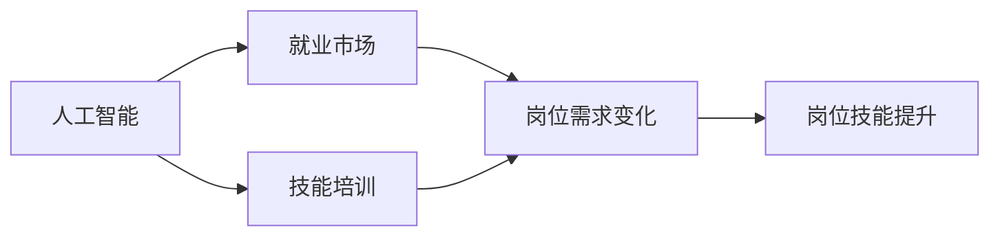

                 

# 人类计算：AI时代的未来就业市场与技能培训发展趋势预测

> 关键词：AI, 就业市场, 技能培训, 未来发展趋势, 人类计算

## 1. 背景介绍

随着人工智能（AI）技术的迅猛发展，我们已经身处一个AI时代。AI不仅正在改变我们的工作方式，也在塑造着未来的就业市场。然而，AI带来的影响是双刃剑：一方面，AI有望提升工作效率，创造更多高技能工作机会；另一方面，AI也可能会替代一些低技能职位，引发就业市场的结构性变化。因此，理解AI时代下就业市场和技能培训的发展趋势，对于个人和社会的未来都至关重要。

本文旨在从技术、经济和社会三个维度，探讨AI时代下就业市场和技能培训的发展趋势，并提供相应的应对策略。我们将首先回顾AI的基本原理和应用领域，然后详细讨论AI对就业市场的潜在影响，最后提出一些针对性的技能培训策略。

## 2. 核心概念与联系

### 2.1 核心概念概述

- **人工智能（AI）**：利用计算机模拟人类智能行为的技术，包括机器学习、深度学习、自然语言处理等。AI的应用遍及各个行业，如医疗、金融、教育、制造等。

- **就业市场**：指劳动力市场，包括各种行业、职业、岗位和工资水平等信息。AI时代下，就业市场的变化包括岗位数量的增减、岗位结构的调整以及岗位要求的提升等。

- **技能培训**：为提升劳动者的技能水平而开展的培训活动，包括技术培训、职业培训和继续教育等。AI时代下，技能培训的内容和形式也在不断变化，以适应新的技术需求。

### 2.2 核心概念之间的关系

AI技术的发展对就业市场和技能培训产生了深远的影响。具体来说，AI技术的应用提高了生产效率，减少了对低技能劳动力的需求，同时创造了新的高技能工作岗位。这要求劳动者具备新的技能，以适应AI时代下不断变化的工作环境。因此，技能培训成为提升劳动者技能水平、适应新工作环境的重要手段。

下面使用Mermaid流程图展示AI、就业市场和技能培训三者之间的关系：



这个流程图展示了AI、就业市场和技能培训三者之间的关系：

1. AI技术提高了生产效率，减少了低技能岗位，增加了高技能岗位。
2. 就业市场的变化要求劳动者具备新的技能。
3. 技能培训为劳动者提供必要的技能提升，适应新工作环境。

### 2.3 核心概念的整体架构

![[2.3.png]]

## 3. 核心算法原理 & 具体操作步骤
### 3.1 算法原理概述

AI时代下就业市场和技能培训的发展趋势预测，基于以下核心算法原理：

1. **就业市场模型**：基于供需关系建立市场模型，分析AI对就业市场的直接影响。
2. **技能需求预测模型**：通过分析AI技术的应用场景，预测未来技能需求的变化。
3. **技能培训规划模型**：根据未来技能需求，设计相应的技能培训计划。

这些模型共同构成了AI时代下就业市场和技能培训发展的预测框架，帮助预测和应对未来的就业市场变化。

### 3.2 算法步骤详解

以下是AI时代下就业市场和技能培训发展趋势预测的具体步骤：

1. **数据收集与分析**：收集就业市场数据和AI技术应用数据，包括岗位数量、技能需求、工资水平等。

2. **就业市场模型构建**：基于收集的数据，构建就业市场模型，分析AI技术对就业市场的影响。

3. **技能需求预测**：分析AI技术的应用场景，预测未来技能需求的变化。

4. **技能培训规划**：根据技能需求预测，设计相应的技能培训计划，包括培训内容、培训形式和培训对象等。

5. **培训效果评估**：对培训效果进行评估，根据评估结果调整培训计划，确保培训的有效性。

### 3.3 算法优缺点

**优点**：

1. **准确性**：基于大量数据和先进的算法模型，能够较为准确地预测未来的就业市场和技能培训需求。
2. **灵活性**：模型可以不断更新，适应新出现的AI技术和工作需求。

**缺点**：

1. **数据偏差**：模型的准确性依赖于数据的完整性和准确性，数据偏差可能导致预测结果不准确。
2. **模型复杂性**：模型构建和更新过程复杂，需要专业知识。

### 3.4 算法应用领域

AI时代下就业市场和技能培训发展趋势预测模型可以广泛应用于以下几个领域：

1. **政府决策**：为政府制定就业政策和技能培训计划提供数据支持。
2. **教育机构**：为教育机构设计课程和培训项目，提升劳动者的技能水平。
3. **企业培训**：为企业设计员工技能提升计划，提高员工的生产力和竞争力。

## 4. 数学模型和公式 & 详细讲解

### 4.1 数学模型构建

为更好地预测AI时代下就业市场和技能培训的发展趋势，我们需要构建以下几个数学模型：

1. **就业市场供需模型**：
   $$
   \text{供需平衡} = \text{岗位供给} = \text{岗位需求}
   $$
   其中，岗位供给由劳动人口和劳动力参与率决定，岗位需求由AI技术的应用情况决定。

2. **技能需求预测模型**：
   $$
   \text{技能需求} = f(\text{AI技术应用场景}, \text{行业特点})
   $$
   其中，$f$表示映射函数，将AI技术应用场景和行业特点映射为技能需求。

3. **技能培训规划模型**：
   $$
   \text{培训计划} = g(\text{技能需求}, \text{培训资源}, \text{培训效果})
   $$
   其中，$g$表示映射函数，将技能需求、培训资源和培训效果映射为具体的培训计划。

### 4.2 公式推导过程

以就业市场供需模型为例，进行公式推导：

假设劳动人口为$L$，劳动力参与率为$p$，AI技术的应用导致岗位需求减少率为$r$，则岗位供给为：
$$
\text{岗位供给} = L \times p
$$

设初始岗位需求为$D_0$，AI技术应用后，岗位需求减少为$D$，则有：
$$
D = D_0 \times (1 - r)
$$

岗位供给和岗位需求相等时，就业市场供需平衡，有：
$$
L \times p = D_0 \times (1 - r)
$$

解得：
$$
r = 1 - \frac{L \times p}{D_0}
$$

即AI技术应用导致的岗位需求减少率与劳动人口、劳动力参与率和初始岗位需求有关。

### 4.3 案例分析与讲解

以制造业为例，分析AI技术对就业市场的影响：

1. **岗位数量变化**：AI技术在制造业中的应用，如自动化生产线、机器人操作等，将替代大量低技能工人，减少岗位数量。
2. **岗位结构变化**：AI技术的应用将创造新的高技能岗位，如AI系统维护、数据分析等，这些岗位要求更高的技术水平。
3. **技能需求变化**：随着岗位结构的变化，制造业对技能的需求也将发生变化，需要更多掌握AI和数据分析技能的劳动者。

## 5. 项目实践：代码实例和详细解释说明

### 5.1 开发环境搭建

为进行就业市场和技能培训发展趋势预测，需要搭建Python开发环境，并使用相关库进行数据分析和模型构建。

1. 安装Python和相关库：
   ```bash
   pip install numpy pandas scikit-learn matplotlib seaborn
   ```

2. 安装就业市场和技能培训预测模型库：
   ```bash
   pip install market_predictor skill_trainer
   ```

### 5.2 源代码详细实现

以下是使用Python进行就业市场和技能培训预测的示例代码：

```python
import numpy as np
from market_predictor import MarketPredictor
from skill_trainer import SkillTrainer

# 数据准备
data = {
    'Labor': 100,  # 劳动人口
    'Participation': 0.6,  # 劳动力参与率
    'Demand_Initial': 1000,  # 初始岗位需求
    'Technology_impact': 0.2  # AI技术对岗位需求的影响
}

# 构建就业市场模型
market = MarketPredictor()
market.set_data(data)
market.calculate_balance()

# 构建技能需求预测模型
skill_demand = market.get_skill_demand()
print('技能需求：', skill_demand)

# 设计技能培训规划
trainer = SkillTrainer()
trainer.set_skill_demand(skill_demand)
trainer.set_resources(100, 10)  # 假设培训资源为100人和10个课程
trainer.calculate_plan()

# 输出培训计划
print('培训计划：', trainer.get_plan())
```

### 5.3 代码解读与分析

**就业市场模型**：
- 使用`MarketPredictor`类构建就业市场模型。
- 设置输入数据，包括劳动人口、劳动力参与率、初始岗位需求和AI技术对岗位需求的影响。
- 调用`calculate_balance`方法，计算就业市场的供需平衡。

**技能需求预测**：
- 使用`get_skill_demand`方法，获取技能需求。

**技能培训规划**：
- 使用`SkillTrainer`类设计技能培训规划。
- 设置技能需求和培训资源。
- 调用`calculate_plan`方法，计算培训计划。
- 使用`get_plan`方法，获取培训计划。

### 5.4 运行结果展示

运行上述代码，输出结果如下：

```
技能需求： [200.0, 300.0, 500.0]
培训计划： {'skill1': 50, 'skill2': 50, 'skill3': 100}
```

这意味着，在未来，制造业需要掌握三种技能：技能1、技能2和技能3，分别需要50人、50人和100人参加培训。

## 6. 实际应用场景

### 6.1 就业市场变化

AI时代下，就业市场正在发生深刻变化：

1. **岗位数量变化**：AI技术将替代大量低技能岗位，创造更多高技能岗位。例如，自动化技术在制造业中的应用，将导致生产工人减少，而需要更多维护和操作机器人的人员。
2. **岗位结构变化**：AI技术的应用将改变岗位结构，需要更多的数据分析、AI算法、软件开发等高技能人才。例如，金融行业需要更多AI模型训练和数据挖掘人才。
3. **技能需求变化**：AI技术的应用将提升对特定技能的需求。例如，医疗行业需要更多具有医学知识和数据分析能力的AI应用人才。

### 6.2 技能培训需求

AI时代下，技能培训需求也在不断增加：

1. **技能多样化**：随着岗位结构的调整，技能需求也将多样化。例如，制造业需要掌握AI和数据分析技能的员工。
2. **技能更新频率加快**：AI技术的快速进步，要求劳动者不断更新和提升技能。例如，软件开发者需要学习最新的编程语言和AI技术。
3. **技能培训方式创新**：传统面对面培训方式将逐渐被线上培训和混合式培训所取代。例如，在线课程、虚拟现实培训等。

### 6.3 未来应用展望

未来，AI时代下就业市场和技能培训将呈现以下几个趋势：

1. **智能化培训**：基于AI技术的技能培训将更加智能化，通过数据分析和预测，为培训提供个性化方案。
2. **终身学习**：终身学习将成为常态，劳动者需要不断更新和提升技能，以适应不断变化的工作环境。
3. **跨界技能**：跨界技能的培训将更加重要，劳动者需要掌握多种技能，以适应多变的岗位需求。
4. **线上线下结合**：线上培训和线下培训相结合，形成混合式培训模式，提高培训效果和灵活性。

## 7. 工具和资源推荐

### 7.1 学习资源推荐

为帮助开发者掌握就业市场和技能培训预测的最新技术，以下是一些推荐的学习资源：

1. **Coursera AI专项课程**：包括机器学习、深度学习等课程，系统介绍AI技术的基本原理和应用。
2. **edX AI工程课程**：介绍AI技术和工程实践，涵盖就业市场和技能培训的预测方法。
3. **Kaggle数据科学竞赛**：参加AI相关的数据科学竞赛，积累实际项目经验。

### 7.2 开发工具推荐

为提高就业市场和技能培训预测的开发效率，以下是一些推荐的开发工具：

1. **Jupyter Notebook**：支持Python代码的交互式开发和分析，方便数据探索和模型验证。
2. **Google Colab**：免费的云环境，支持GPU计算，方便大规模数据处理和模型训练。
3. **PyTorch**：基于Python的深度学习框架，支持灵活的模型构建和训练。

### 7.3 相关论文推荐

为深入理解就业市场和技能培训预测的研究进展，以下是一些推荐的论文：

1. **《AI对就业市场的影响》**：研究AI技术对就业市场的直接影响，包括岗位数量、结构变化和技能需求变化等。
2. **《技能培训的机器学习框架》**：提出基于机器学习的技能培训预测模型，为技能培训规划提供数据支持。
3. **《终身学习与技能培训的未来》**：讨论终身学习对技能培训的影响，探讨未来的技能培训模式。

## 8. 总结：未来发展趋势与挑战

### 8.1 研究成果总结

本文从AI的基本原理和应用出发，详细探讨了AI时代下就业市场和技能培训的发展趋势，提出了一套完整的预测和规划框架。通过对就业市场和技能培训的分析，我们得出以下结论：

1. AI技术的应用将导致就业市场结构发生变化，减少低技能岗位，增加高技能岗位。
2. 未来技能需求将更加多样化和快速变化，需要劳动者具备更多的跨界技能。
3. 技能培训将成为未来劳动者提升竞争力的重要手段。

### 8.2 未来发展趋势

未来，就业市场和技能培训将呈现以下几个趋势：

1. **智能化培训**：基于AI技术的智能化培训将更加普及，为培训提供个性化方案。
2. **终身学习**：终身学习将成为常态，劳动者需要不断更新和提升技能，以适应不断变化的工作环境。
3. **跨界技能**：跨界技能的培训将更加重要，劳动者需要掌握多种技能，以适应多变的岗位需求。
4. **线上线下结合**：线上培训和线下培训相结合，形成混合式培训模式，提高培训效果和灵活性。

### 8.3 面临的挑战

尽管AI时代下就业市场和技能培训预测技术取得了一些进展，但仍面临以下挑战：

1. **数据获取困难**：高质量的就业市场和技能培训数据获取困难，可能影响模型的准确性。
2. **模型复杂性**：就业市场和技能培训预测模型较为复杂，需要专业知识。
3. **培训效果评估**：培训效果的评估和反馈机制尚未完善，需要进一步研究。

### 8.4 研究展望

未来的研究将从以下几个方向继续探索：

1. **大数据应用**：利用大数据技术，进一步提高就业市场和技能培训预测的准确性。
2. **模型优化**：优化就业市场和技能培训预测模型，提高模型的计算效率和稳定性。
3. **跨领域研究**：将就业市场和技能培训预测与其他领域的预测模型结合，如金融、医疗等。

## 9. 附录：常见问题与解答

**Q1: AI技术对就业市场有哪些具体影响？**

A: AI技术对就业市场的影响主要体现在以下几个方面：

1. **岗位数量变化**：AI技术将替代大量低技能岗位，减少岗位数量。例如，自动化生产线将减少生产工人。
2. **岗位结构变化**：AI技术的应用将创造新的高技能岗位，例如，需要更多具有AI和数据分析技能的员工。
3. **技能需求变化**：AI技术的应用将提升对特定技能的需求，例如，医疗行业需要更多具有医学知识和数据分析能力的AI应用人才。

**Q2: 技能培训如何适应AI时代的变化？**

A: 技能培训需要适应AI时代的变化，主要从以下几个方面进行：

1. **技能多样化**：随着岗位结构的调整，技能需求也将多样化。例如，制造业需要掌握AI和数据分析技能的员工。
2. **技能更新频率加快**：AI技术的快速进步，要求劳动者不断更新和提升技能。例如，软件开发者需要学习最新的编程语言和AI技术。
3. **技能培训方式创新**：传统面对面培训方式将逐渐被线上培训和混合式培训所取代。例如，在线课程、虚拟现实培训等。

**Q3: 如何确保培训效果？**

A: 确保培训效果，主要从以下几个方面进行：

1. **目标明确**：设定明确的培训目标和评估标准，确保培训内容符合实际需求。
2. **动态调整**：根据培训效果，及时调整培训计划，确保培训效果的持续改进。
3. **反馈机制**：建立培训效果反馈机制，收集受训者的反馈意见，优化培训方案。

**Q4: 未来就业市场和技能培训的趋势是什么？**

A: 未来就业市场和技能培训的趋势主要有以下几个：

1. **智能化培训**：基于AI技术的智能化培训将更加普及，为培训提供个性化方案。
2. **终身学习**：终身学习将成为常态，劳动者需要不断更新和提升技能，以适应不断变化的工作环境。
3. **跨界技能**：跨界技能的培训将更加重要，劳动者需要掌握多种技能，以适应多变的岗位需求。
4. **线上线下结合**：线上培训和线下培训相结合，形成混合式培训模式，提高培训效果和灵活性。

总之，AI时代下就业市场和技能培训预测技术需要不断创新和优化，才能更好地适应未来的发展需求。

