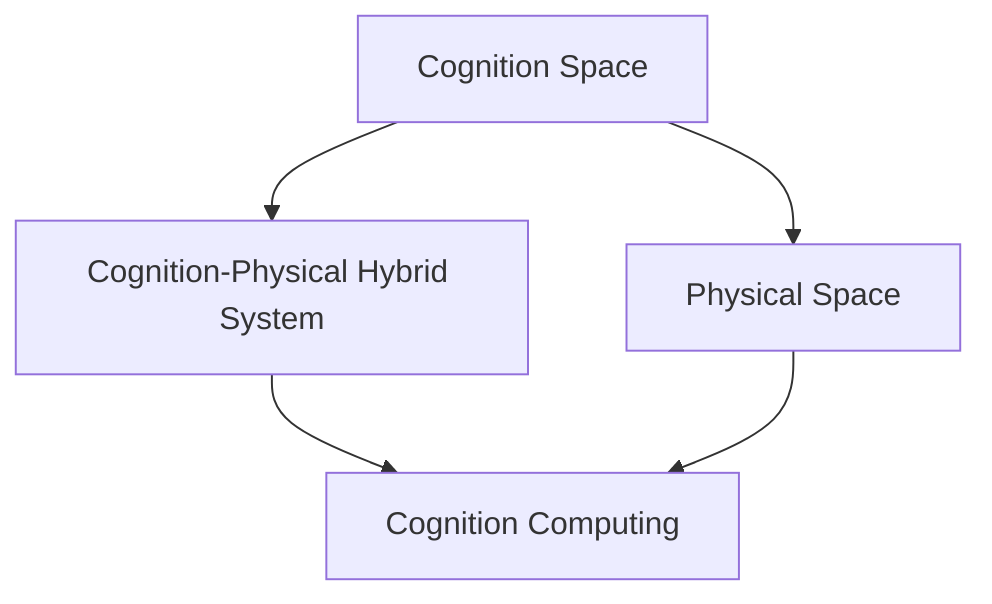
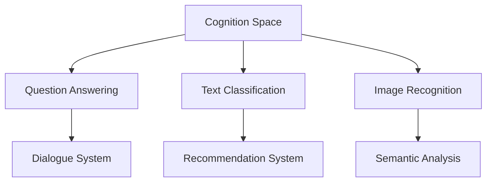
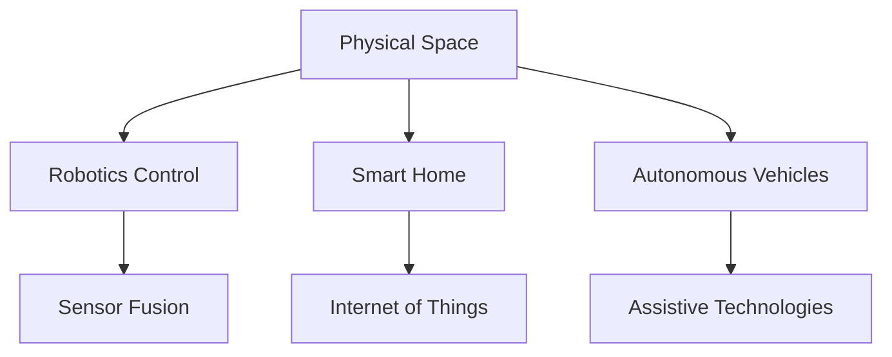
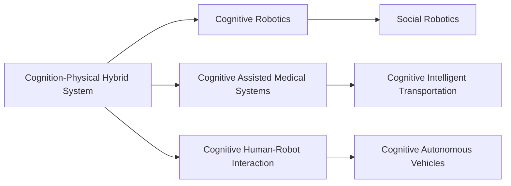
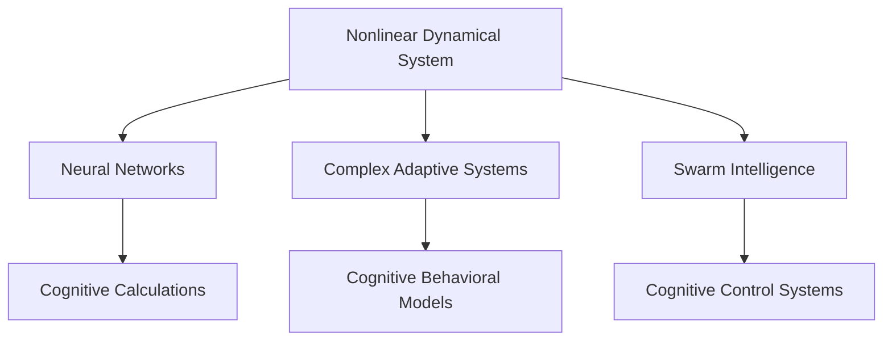
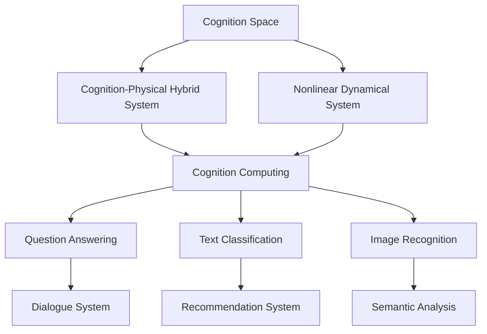

                 

# 人类认知的4种基本模式：从认知空间转向物理空间

> 关键词：认知模式,认知空间,物理空间,人类认知

## 1. 背景介绍

### 1.1 问题由来
随着人工智能技术的发展，如何更好地理解和模拟人类认知，成为研究的热点。人类认知是一个复杂的系统，涉及感知、记忆、思考、决策等多个层面。在计算机科学中，模拟人类认知的过程被统称为认知计算（Cognitive Computing）。认知计算旨在构建能够模拟人类智能系统的计算模型，从而解决复杂的问题。

### 1.2 问题核心关键点
认知计算的核心在于如何有效地构建和模拟人类认知过程。目前，认知计算主要包括以下几种认知模式：
1. **认知空间模式**：通过构建抽象的认知空间，模拟人类在问题解决中的思考过程。
2. **物理空间模式**：直接模拟物理世界的真实系统，通过传感器和执行器与外界交互。
3. **认知-物理混合模式**：结合认知空间和物理空间，构建更为综合的认知系统。
4. **非线性动力学系统**：模拟人类认知的动态变化，通过非线性动力学方程描述认知过程。

这些模式各自有其独特的优势和适用场景，本文将详细探讨它们之间的联系和应用。

### 1.3 问题研究意义
理解人类认知的不同模式，对于设计和构建认知计算系统具有重要意义。一方面，可以帮助我们更好地理解人类认知的本质和机制，从而设计出更为智能和高效的认知系统。另一方面，可以针对不同应用场景选择合适的认知模式，提高系统的实用性。

## 2. 核心概念与联系

### 2.1 核心概念概述

为更好地理解认知计算的基本模式，本节将介绍几个关键概念：

- **认知空间**：指抽象的思维空间，用于模拟人类在解决问题时的思考过程。例如，在图灵测试中，测试者通过问答与人工智能系统交互，可以理解为在认知空间中进行思维对话。

- **物理空间**：指真实世界的物理环境，用于模拟真实系统中的传感器和执行器交互。例如，在机器人控制系统中，通过传感器获取环境信息，通过执行器进行运动操作。

- **认知-物理混合系统**：结合认知空间和物理空间，构建可以模拟人类智能行为的系统。例如，人类大脑通过感知和决策与物理世界交互，机器人通过认知控制与环境交互。

- **非线性动力学系统**：用于描述认知过程的动态变化，通过非线性方程描述认知状态和变化规律。例如，神经网络中的非线性激活函数，用于模拟神经元的非线性特性。

- **认知计算**：通过计算机模拟人类智能行为，解决复杂问题。包括认知空间模式、物理空间模式、认知-物理混合模式和非线性动力学系统等多种方法。

这些概念之间的逻辑关系可以通过以下Mermaid流程图来展示：

这个流程图展示了大语言模型微调过程中各个概念之间的联系：

1. 认知空间通过认知-物理混合系统与物理空间进行交互，共同构建认知计算系统。
2. 认知空间和非线性动力学系统一起用于描述认知过程的动态变化。
3. 物理空间和非线性动力学系统用于描述真实世界中的动态变化。

### 2.2 概念间的关系

这些核心概念之间存在着紧密的联系，形成了认知计算的整体框架。下面我们通过几个Mermaid流程图来展示这些概念之间的关系。

#### 2.2.1 认知空间模式

这个流程图展示了认知空间模式在各个任务中的应用：

1. 认知空间通过问答系统进行思维对话，模拟人类理解自然语言的过程。
2. 认知空间用于文本分类和情感分析等任务，通过构建认知空间进行特征提取。
3. 认知空间用于图像识别和语音识别等任务，通过构建认知空间进行特征提取。

#### 2.2.2 物理空间模式

这个流程图展示了物理空间模式在各个领域中的应用：

1. 物理空间用于机器人控制，通过传感器和执行器与外界交互。
2. 物理空间用于智能家居系统，通过传感器和执行器实现自动化控制。
3. 物理空间用于自动驾驶车辆，通过传感器和执行器实现自主导航。

#### 2.2.3 认知-物理混合模式

这个流程图展示了认知-物理混合模式在各个场景中的应用：

1. 认知-物理混合系统用于认知机器人，通过认知空间和物理空间实现智能交互。
2. 认知-物理混合系统用于医疗系统，通过认知空间和物理空间实现辅助诊断和治疗。
3. 认知-物理混合系统用于人机交互，通过认知空间和物理空间实现自然语言理解和执行。

#### 2.2.4 非线性动力学系统

这个流程图展示了非线性动力学系统在各个领域中的应用：

1. 非线性动力学系统用于神经网络，通过非线性激活函数模拟神经元的非线性特性。
2. 非线性动力学系统用于复杂适应系统，通过非线性动力学方程描述系统的动态变化。
3. 非线性动力学系统用于群体智能，通过非线性动力学方程描述群体的协同行为。

### 2.3 核心概念的整体架构

最后，我们用一个综合的流程图来展示这些核心概念在大语言模型微调过程中的整体架构：

这个综合流程图展示了从认知空间到物理空间的整体架构：

1. 认知空间通过认知-物理混合系统与物理空间进行交互，共同构建认知计算系统。
2. 认知空间和非线性动力学系统一起用于描述认知过程的动态变化。
3. 物理空间和非线性动力学系统用于描述真实世界中的动态变化。
4. 认知空间和物理空间通过问答系统、文本分类、图像识别等任务进行应用。

通过这些流程图，我们可以更清晰地理解认知计算过程中各个概念的关系和作用，为后续深入讨论具体的认知模式和应用奠定基础。

## 3. 核心算法原理 & 具体操作步骤
### 3.1 算法原理概述

认知计算的算法原理主要基于认知空间模式、物理空间模式、认知-物理混合模式和非线性动力学系统。这些算法原理可以从认知心理学、神经科学和控制理论等多个学科中借鉴和应用。

#### 3.1.1 认知空间模式

认知空间模式的核心思想是通过构建抽象的认知空间，模拟人类在解决问题时的思考过程。例如，在图灵测试中，测试者通过问答与人工智能系统交互，可以理解为在认知空间中进行思维对话。这种模式常用于问答系统、自然语言处理和推理任务中。

#### 3.1.2 物理空间模式

物理空间模式的核心思想是通过传感器和执行器与外界交互，模拟真实世界的物理环境。例如，在机器人控制系统中，通过传感器获取环境信息，通过执行器进行运动操作。这种模式常用于机器人控制、智能家居和自动驾驶等领域。

#### 3.1.3 认知-物理混合模式

认知-物理混合模式结合了认知空间和物理空间，构建可以模拟人类智能行为的系统。例如，人类大脑通过感知和决策与物理世界交互，机器人通过认知控制与环境交互。这种模式常用于认知机器人、智能医疗和人机交互等领域。

#### 3.1.4 非线性动力学系统

非线性动力学系统用于描述认知过程的动态变化，通过非线性方程描述认知状态和变化规律。例如，神经网络中的非线性激活函数，用于模拟神经元的非线性特性。这种模式常用于神经网络、复杂适应系统和群体智能等领域。

### 3.2 算法步骤详解

#### 3.2.1 认知空间模式

**Step 1: 准备数据和标签**

- 收集用于训练的数据和标签。
- 数据包括问题、答案和用户输入等文本信息。
- 标签用于表示正确答案或用户意图。

**Step 2: 构建认知空间**

- 构建认知空间，用于存储和处理数据。
- 认知空间通常使用图结构表示，节点表示单词或概念，边表示单词之间的语义关系。
- 使用自然语言处理技术，将文本信息转化为认知空间结构。

**Step 3: 训练认知模型**

- 使用认知空间模式训练认知模型，学习正确的推理逻辑。
- 训练过程通常使用神经网络或逻辑推理算法。
- 模型通过不断调整权重，逐步优化推理结果。

**Step 4: 应用认知模型**

- 将训练好的认知模型应用于实际问题解决中。
- 输入问题或用户指令，模型通过推理得到答案或执行结果。

**Step 5: 评估和优化**

- 评估模型的性能，如准确率、召回率和F1分数等。
- 根据评估结果，对模型进行优化和改进。

#### 3.2.2 物理空间模式

**Step 1: 收集物理数据**

- 收集物理世界中的传感器数据。
- 数据包括图像、声音、位置等信息。
- 数据需要进行预处理，如去噪、归一化等。

**Step 2: 构建物理模型**

- 构建物理模型，用于描述传感器和执行器的交互。
- 物理模型通常使用状态空间和控制方程表示。
- 使用控制理论或机器人学技术，构建物理模型。

**Step 3: 训练物理模型**

- 使用物理空间模式训练物理模型，学习传感器和执行器之间的交互关系。
- 训练过程通常使用控制算法或机器学习算法。
- 模型通过不断调整参数，逐步优化传感器和执行器的交互。

**Step 4: 应用物理模型**

- 将训练好的物理模型应用于实际物理系统中。
- 传感器获取环境信息，模型进行决策，执行器进行动作。
- 实时调整模型的参数，适应动态变化的环境。

**Step 5: 评估和优化**

- 评估模型的性能，如响应时间、控制精度和鲁棒性等。
- 根据评估结果，对模型进行优化和改进。

#### 3.2.3 认知-物理混合模式

**Step 1: 设计混合系统**

- 设计认知-物理混合系统，结合认知空间和物理空间。
- 系统包括感知、决策和执行模块。
- 使用认知心理学和控制理论，设计混合系统的架构。

**Step 2: 构建认知和物理模型**

- 构建认知空间模型，用于描述认知过程。
- 构建物理空间模型，用于描述传感器和执行器的交互。
- 将认知空间模型和物理空间模型进行集成。

**Step 3: 训练混合系统**

- 使用认知-物理混合模式训练混合系统，学习认知和物理之间的交互。
- 训练过程通常使用强化学习或协同优化算法。
- 系统通过不断调整参数，逐步优化认知和物理的交互。

**Step 4: 应用混合系统**

- 将训练好的混合系统应用于实际问题解决中。
- 输入问题或用户指令，系统通过推理和决策得到答案或执行结果。
- 实时调整系统的参数，适应动态变化的环境。

**Step 5: 评估和优化**

- 评估系统的性能，如认知精度、响应速度和控制精度等。
- 根据评估结果，对系统进行优化和改进。

#### 3.2.4 非线性动力学系统

**Step 1: 构建非线性模型**

- 构建非线性动力学模型，用于描述认知过程的动态变化。
- 模型通常使用微分方程或差分方程表示。
- 使用神经网络或复杂适应系统技术，构建非线性模型。

**Step 2: 训练非线性模型**

- 使用非线性动力学系统训练非线性模型，学习认知过程的动态变化。
- 训练过程通常使用优化算法或迭代算法。
- 模型通过不断调整参数，逐步优化认知过程的动态变化。

**Step 3: 应用非线性模型**

- 将训练好的非线性模型应用于实际问题解决中。
- 输入问题或用户指令，模型通过动态变化得到答案或执行结果。
- 实时调整模型的参数，适应动态变化的环境。

**Step 4: 评估和优化**

- 评估模型的性能，如动态稳定性、收敛速度和鲁棒性等。
- 根据评估结果，对模型进行优化和改进。

### 3.3 算法优缺点

#### 3.3.1 认知空间模式

**优点：**
- 认知空间模式可以处理抽象问题，适用于复杂的推理和决策任务。
- 可以使用现有的自然语言处理技术，如语言模型、语义分析等。

**缺点：**
- 需要大量的标注数据进行训练，标注成本较高。
- 对语言模型的质量要求较高，模型训练和优化较为复杂。

#### 3.3.2 物理空间模式

**优点：**
- 物理空间模式可以直接模拟真实世界的交互，适用于实际的物理系统。
- 可以使用现有的传感器和执行器技术，如机器人、传感器网络等。

**缺点：**
- 需要复杂的传感器和执行器设计，硬件成本较高。
- 对环境和系统的动态变化要求较高，鲁棒性较差。

#### 3.3.3 认知-物理混合模式

**优点：**
- 认知-物理混合模式结合了认知空间和物理空间，适用于复杂的人机交互任务。
- 可以同时处理认知和物理方面的信息，提高系统的综合性能。

**缺点：**
- 系统设计复杂，需要考虑认知和物理两方面的交互。
- 需要复杂的传感器和执行器设计，硬件成本较高。

#### 3.3.4 非线性动力学系统

**优点：**
- 非线性动力学系统可以描述复杂的动态变化，适用于复杂的认知过程。
- 可以使用现有的神经网络和复杂适应系统技术，如深度学习、演化算法等。

**缺点：**
- 模型设计和训练复杂，需要对动态变化进行合理建模。
- 对数据和参数的要求较高，需要大量的训练数据和计算资源。

### 3.4 算法应用领域

认知计算的算法在多个领域中得到了广泛应用，以下是一些典型的应用场景：

#### 3.4.1 问答系统

问答系统通过认知空间模式，模拟人类理解自然语言的过程，实现自然语言问答。例如，智能客服系统通过自然语言处理技术，将用户的问题转化为认知空间中的节点和边，进行推理和决策，最终给出答案。

#### 3.4.2 机器人控制

机器人控制通过物理空间模式，模拟真实世界的交互，实现机器人的自主导航和操作。例如，智能机器人通过传感器获取环境信息，通过执行器进行运动操作，实现自主导航和对象识别。

#### 3.4.3 智能家居

智能家居通过认知-物理混合模式，结合认知空间和物理空间，实现家庭自动化和智能化控制。例如，智能家居系统通过传感器获取环境信息，通过认知空间进行决策，通过执行器进行控制，实现智能控制和能源管理。

#### 3.4.4 复杂系统优化

复杂系统优化通过非线性动力学系统，模拟系统的动态变化，实现系统的优化和控制。例如，金融系统通过非线性动力学模型，模拟市场动态变化，进行风险管理和投资优化。

## 4. 数学模型和公式 & 详细讲解  
### 4.1 数学模型构建

认知计算的数学模型通常基于认知空间模式、物理空间模式、认知-物理混合模式和非线性动力学系统。以下是对这些模型的数学构建和推导。

#### 4.1.1 认知空间模式

**数学模型构建：**

- 认知空间通常使用图结构表示，节点表示单词或概念，边表示单词之间的语义关系。
- 使用自然语言处理技术，将文本信息转化为认知空间结构。
- 认知空间模型可以使用逻辑推理算法，如逻辑规划、Bayesian网络等。

**数学公式推导：**

- 假设认知空间中有一个节点$x_i$，其邻居节点集合为$\{y_1, y_2, \cdots, y_n\}$。
- 节点$x_i$和$y_j$之间的边权重为$w_{ij}$。
- 节点$x_i$的认知状态为$h_i$，可以通过逻辑推理或贝叶斯网络计算得到。
- 使用认知空间模型进行推理时，可以按照以下步骤：
  1. 输入问题或用户指令，将其转化为认知空间中的节点和边。
  2. 使用逻辑推理或贝叶斯网络计算节点状态。
  3. 通过推理得到答案或执行结果。

#### 4.1.2 物理空间模式

**数学模型构建：**

- 物理空间通常使用状态空间和控制方程表示，描述传感器和执行器的交互。
- 使用控制理论或机器人学技术，构建物理模型。
- 物理模型可以使用线性或非线性控制算法，如PID控制、线性反馈控制等。

**数学公式推导：**

- 假设物理空间中的状态为$s_i$，控制量为$u_i$，控制目标是优化函数$J$。
- 使用控制理论或机器人学技术，构建物理模型。
- 使用线性或非线性控制算法进行控制，可以按照以下步骤：
  1. 输入传感器数据，得到系统状态。
  2. 使用控制算法计算控制量。
  3. 执行控制量，调整系统状态。
  4. 实时调整控制算法参数，适应动态变化的环境。

#### 4.1.3 认知-物理混合模式

**数学模型构建：**

- 认知-物理混合系统结合了认知空间和物理空间，构建可以模拟人类智能行为的系统。
- 系统包括感知、决策和执行模块，使用认知心理学和控制理论设计架构。
- 使用认知-物理混合模型进行推理时，可以按照以下步骤：
  1. 输入问题或用户指令，将其转化为认知空间中的节点和边。
  2. 使用逻辑推理或贝叶斯网络计算节点状态。
  3. 使用控制算法计算执行量。
  4. 执行执行量，调整系统状态。
  5. 实时调整控制算法参数，适应动态变化的环境。

#### 4.1.4 非线性动力学系统

**数学模型构建：**

- 非线性动力学系统用于描述认知过程的动态变化，通过非线性方程描述认知状态和变化规律。
- 使用神经网络或复杂适应系统技术，构建非线性模型。
- 非线性动力学系统可以使用神经网络或演化算法进行建模和优化。

**数学公式推导：**

- 假设认知过程的状态为$x(t)$，动态变化为$\dot{x}(t)$。
- 使用非线性动力学系统进行建模时，可以按照以下步骤：
  1. 输入问题或用户指令，将其转化为认知状态。
  2. 使用神经网络或演化算法计算动态变化。
  3. 通过动态变化得到答案或执行结果。
  4. 实时调整模型参数，适应动态变化的环境。

### 4.2 公式推导过程

#### 4.2.1 认知空间模式

假设认知空间中有一个节点$x_i$，其邻居节点集合为$\{y_1, y_2, \cdots, y_n\}$。节点$x_i$和$y_j$之间的边权重为$w_{ij}$。节点$x_i$的认知状态为$h_i$，可以通过逻辑推理或贝叶斯网络计算得到。

使用认知空间模型进行推理时，可以按照以下步骤：

1. 输入问题或用户指令，将其转化为认知空间中的节点和边。
2. 使用逻辑推理或贝叶斯网络计算节点状态。
3. 通过推理得到答案或执行结果。

**公式推导：**

- 假设认知空间中有一个节点$x_i$，其邻居节点集合为$\{y_1, y_2, \cdots, y_n\}$。
- 节点$x_i$和$y_j$之间的边权重为$w_{ij}$。
- 节点$x_i$的认知状态为$h_i$，可以通过逻辑推理或贝叶斯网络计算得到。
- 使用认知空间模型进行推理时，可以按照以下步骤：
  1. 输入问题或用户指令，将其转化为认知空间中的节点和边。
  2. 使用逻辑推理或贝叶斯网络计算节点状态。
  3. 通过推理得到答案或执行结果。

#### 4.2.2 物理空间模式

假设物理空间中的状态为$s_i$，控制量为$u_i$，控制目标是优化函数$J$。使用控制理论或机器人学技术，构建物理模型。使用线性或非线性控制算法进行控制，可以按照以下步骤：

1. 输入传感器数据，得到系统状态。
2. 使用控制算法计算控制量。
3. 执行控制量，调整系统状态。
4. 实时调整控制算法参数，适应动态变化的环境。

**公式推导：**

- 假设物理空间中的状态为$s_i$，控制量为$u_i$，控制目标是优化函数$J$。
- 使用控制理论或机器人学技术，构建物理模型。
- 使用线性或非线性控制算法进行控制，可以按照以下步骤：
  1. 输入传感器数据，得到系统状态。
  2. 使用控制算法计算控制量。
  3. 执行控制量，调整系统状态。
  4. 实时调整控制算法参数，适应动态变化的环境。

#### 4.2.3 认知-物理混合模式

假设认知-物理混合系统结合了认知空间和物理空间，构建可以模拟人类智能行为的系统。系统包括感知、决策和执行模块，使用认知心理学和控制理论设计架构。使用认知-物理混合模型进行推理时，可以按照以下步骤：

1. 输入问题或用户指令，将其转化为认知空间中的节点和边。
2. 使用逻辑推理或贝叶斯网络计算节点状态。
3. 使用控制算法计算执行量。
4. 执行执行量，调整系统状态。
5. 实时调整控制算法参数，适应动态变化的环境。

**公式推导：**

- 假设认知-物理混合系统结合了认知空间和物理空间，构建可以模拟人类智能行为的系统。
- 系统包括感知、决策和执行模块，使用认知心理学和控制理论设计架构。
- 使用认知-物理混合模型进行推理时，可以按照以下步骤：
  1. 输入问题或用户指令，将其转化为认知空间中的节点和边。
  2. 使用逻辑推理或贝叶斯网络计算节点状态。
  3. 使用控制算法计算执行量。
  4. 执行执行量，调整系统状态。
  5. 实时调整控制算法参数，适应动态变化的环境。

#### 4.2.4 非线性动力学系统

假设认知过程的状态为$x(t)$，动态变化为$\dot{x}(t)$。使用非线性动力学系统进行建模时，可以按照以下步骤：

1. 输入问题或用户指令，将其转化为认知状态。
2. 使用神经网络或演化算法计算动态变化。
3. 通过动态变化得到答案或执行结果。
4. 实时调整模型参数，适应动态变化的环境。

**公式推导：**

- 假设认知过程的状态为$x(t)$，动态变化为$\dot{x}(t)$。
- 使用非线性动力学系统进行建模时，可以按照以下步骤：
  1. 输入问题或用户指令，将其转化为认知状态。
  2. 使用神经网络或演化算法计算动态变化。
  3. 通过动态变化得到答案或执行结果。
  4. 实时调整模型参数，适应动态变化的环境。

### 4.3 案例分析与讲解

#### 4.3.1 问答系统

**案例分析：**

假设我们有一个智能客服系统，用于解答用户的问题。系统通过认知空间模式，模拟人类理解自然语言的过程，实现自然语言问答。

**讲解：**

1. 首先，系统收集大量的问答数据，构建认知空间中的节点和边。
2. 使用逻辑推理算法或贝叶斯网络，计算节点状态，推理出答案。
3. 将推理结果输出给用户，进行反馈和优化。

#### 4.3.2 机器人控制

**案例分析：**

假设我们有一个智能机器人，用于自主导航和对象识别。系统通过物理空间模式，模拟真实世界的交互，实现机器人的自主导航和操作。

**讲解：**

1. 首先，系统使用传感器获取环境信息，构建物理空间中的状态。
2.

